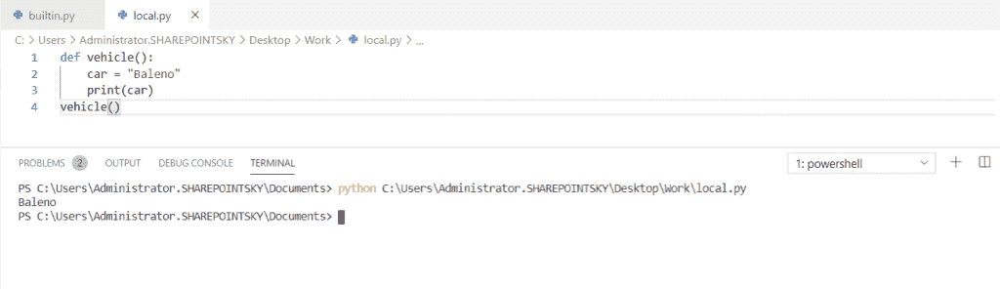
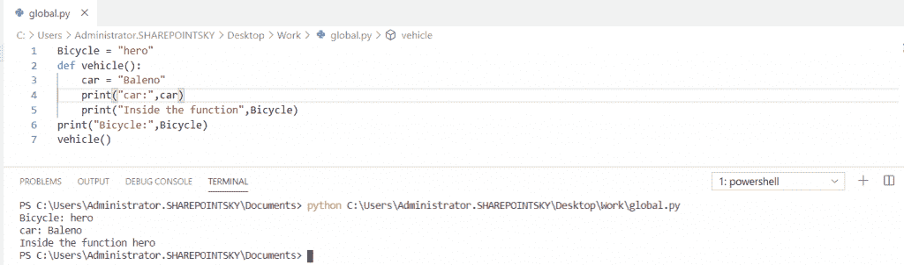
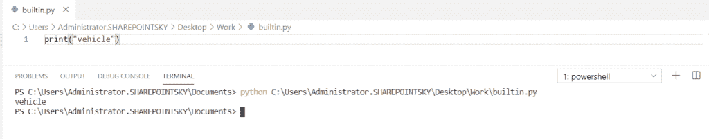
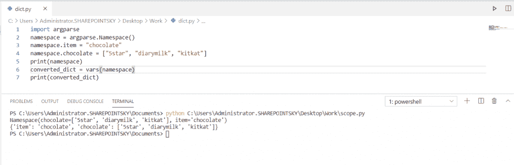
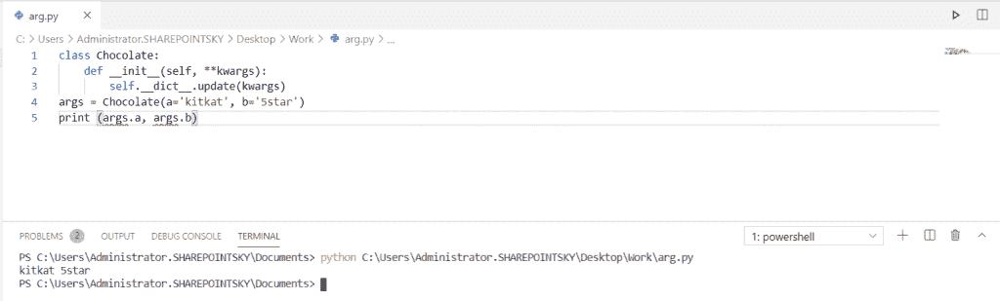
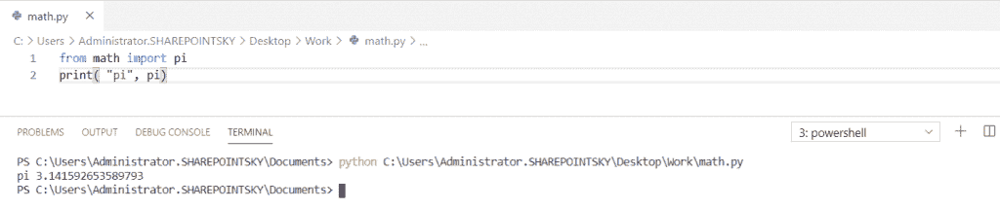
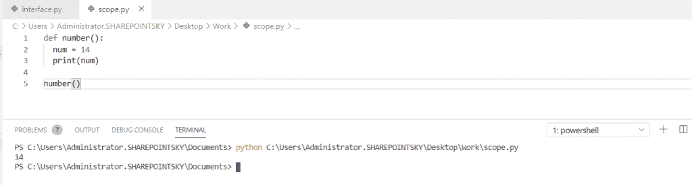
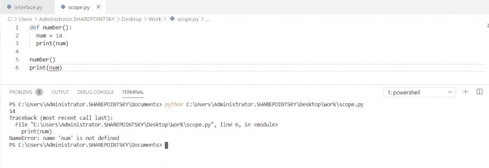

# Python 命名空间教程

> 原文：<https://pythonguides.com/python-namespace-tutorial/>

[](https://sharepointsky.teachable.com/p/python-and-machine-learning-training-course)

在这个 [Python 教程](https://pythonguides.com/python-programming-for-the-absolute-beginner/)中，我们将学习 python 中的**命名空间。另外，我们将检查 **:****

*   Python 中的命名空间是什么？
*   Python 本地名称空间
*   全局名称空间
*   内置名称空间
*   Python 命名空间类
*   Python 命名空间导入
*   Python 命名空间添加到字典
*   Python 命名空间和范围

目录

[](#)

*   [Python 命名空间介绍](#Introduction_to_Python_namespace "Introduction to Python namespace")
*   [Python 中的本地命名空间](#Local_Namespace_in_Python "Local Namespace in Python")
*   [Python 全局命名空间](#Python_Global_Namespace "Python Global Namespace")
*   [Python 中内置的名称空间](#Built-in_Namespace_in_Python "Built-in Namespace in Python")
*   [Python 命名空间到字典](#Python_namespace_to_dictionary "Python namespace to dictionary")
*   [Python 命名空间类](#Python_namespace_class "Python namespace class")
*   [Python 名称空间导入](#Python_namespace_import "Python namespace import")
    *   [进口报表](#The_import_statement "The import statement")
    *   [from 语句](#The_from_statement "The from statement")
    *   [from import *语句](#The_from_import_statement "The from import* statement")
*   [Python 命名空间和作用域](#Python_namespace_and_scope "Python namespace and scope")

## Python 命名空间介绍

*   **名**是指**变量**的名称，空格是指访问**变量的位置。**
*   命名空间表示一个内存块。
*   名称空间是一个为程序中的每个对象使用唯一名称的系统。这也是一种从名称到对象的映射。

你可能喜欢 [Python 中的](https://pythonguides.com/python-copy-file/)复制文件(示例)和 [Crosstab 熊猫](https://pythonguides.com/crosstab-in-python-pandas/)。

## Python 中的本地命名空间

*   **Python 本地名称空间**包含函数中的**本地名称。**
*   它是在调用函数时创建的，一直持续到函数返回。

在这个例子中，我定义了一个函数 vehicle，汽车是函数 vehicle 内部的本地名称空间。

示例:

```py
def vehicle():
    car = "Baleno"
    print(car)
vehicle()
```

下面的屏幕截图显示了输出:



Local Namespace

## Python 全局命名空间

*   **Python 全局名称空间**是在模块导入时创建的，它一直持续到模块结束。
*   它包含导入到项目中的所有模块的名称。
*   在这个例子中，我定义了函数 vehicle 命名空间，Bicycle 命名空间是在函数()vehicle 之外定义的，所以 `Bicycle = "hero"` 是一个全局命名空间。
*   也可以在函数内部打印。

示例:

```py
Bicycle = "hero"
def vehicle():
    car = "Baleno"
    print("car:",car)
    print("Inside the function",Bicycle)
print("Bicycle:",Bicycle)
vehicle()
```

下面的屏幕截图显示了输出:



Python Global Namespace

## Python 中内置的名称空间

*   Python 中的**内置名称空间是在 Python 解释器启动时创建的，并且在解释器运行之前一直存在。**
*   这个名称空间包含内置函数，内置名称空间包含内置函数，如 print()、open()、close()。

在这个例子中，我没有定义任何函数 print 是 python 中的一个**内置名称空间。**

示例:

```py
print("vehicle")
```

下面的屏幕截图显示了输出:



Built-in Namespace

```py
Namespace = {"NameA":objectA, "NameB":objectB}
```

## Python 命名空间到字典

这里可以看到**如何将 argparse.namespace()对象转换成 python** 中的字典。argparse 模块很容易编写一个命令行**接口**，来导入 argparse 模块。

语法:

```py
import argparse
```

在这个例子中，我让**导入 argparse** 模块， `item()` 返回所有的键值对，变量被转换成字典，名称空间变量被转换成字典，使用 **converted_dict = vars(名称空间)**。

示例:

```py
import argparse
namespace = argparse.Namespace()
namespace.item = "chocolate"
namespace.chocolate = ["5star", "diarymilk", "kitkat"]
print(namespace)
converted_dict = vars(namespace)
print(converted_dict)
```

下面的屏幕截图显示了输出:



Python namespace to dictionary

## Python 命名空间类

*   在这里，我们可以看到 python 中的**命名空间类。类有一个本地命名空间，因此只有它们可以访问。类也有自己的命名空间。**
*   在这个例子中，**类 Chocolate** 是一个初始化的类，它有一个名为 `_init_()` 的特殊方法。
*   init()被定制为特定的初始状态。** `kwargs` 是一个关键字参数，允许关键字的可变长度起作用。
*   **自我。__ 字典** __。**更新**允许访问属性和物品。 **args = Chocolate(a='kitkat '，b='5star')** 返回打印结果。

示例:

```py
class Chocolate:
    def __init__(self, **kwargs):
        self.__dict__.update(kwargs)
args = Chocolate(a='kitkat', b='5star')
print (args.a, args.b)
```

下面的截图显示了输出:

在这个输出中，我们可以看到分配给 args 的属性。



Python namespace class

## Python 名称空间导入

现在，我们可以看到 python 中不同类型的导入语句。

*   **导入**语句
*   语句中的
*   ****来自导入*** 语句**

 **### 进口报表

通过使用 `import` 导入文件来访问模块中的代码。

语法:

```py
import module1[, module2[,---- moduleN]
```

### from 语句

语句中的**用于**将模块中的**特定属性导入到当前名称空间中。**

语法:

```py
from modulename import name1[, name2[,---- nameN]]
```

示例:

```py
from math import pi
```

```py
from math import pi
print( "pi", pi)
```



The from statement

### 从**导入***报表

这里， `from import*` 用于将模块中的所有名称导入到当前名称空间中。

语法:

```py
from modulename import *
```

在这里，我们可以导入任何模块名。

## Python 命名空间和作用域

当在被称为**作用域**的函数区域内只有一个变量可用时。在这个例子中，变量乘法不适用于外部函数，它只适用于内部函数。

示例:

```py
def number():
  num = 14
  print(num)

number()
```

下面的截图显示了输出:

我们可以看到正确的输出，因为 print 语句在函数内部。



Python namespace and scope

在这里，我们可以看到，如果我们在函数之外编写 print 语句，那么我们将得到一个错误。因此，为了得到正确的输出，我们必须遵循函数内部的 print 语句。



Python namespace and scope

您可能会喜欢以下 python 教程:

*   [Python 文件方法(附有用例子)](https://pythonguides.com/python-file-methods/)
*   [Python tkinter messagebox +示例](https://pythonguides.com/python-tkinter-messagebox/)
*   [集合的并集 Python +实例](https://pythonguides.com/union-of-sets-python/)
*   [如何在 Python 中把字符串转换成日期时间](https://pythonguides.com/convert-a-string-to-datetime-in-python/)
*   [Python 中的转义序列](https://pythonguides.com/escape-sequence-in-python/)
*   [Python 线程和多线程](https://pythonguides.com/python-threading-and-multithreading/)
*   [Python 列表理解λ](https://pythonguides.com/python-list-comprehension/)

在这里，我们学习了 Python 名称空间。

*   什么是 Python 名称空间？
*   Python 本地名称空间
*   Python 中的全局命名空间
*   Python 中的内置名称空间
*   Python 命名空间到字典
*   Python 命名空间类
*   Python 命名空间导入
*   Python 命名空间和范围

[Bijay Kumar](https://pythonguides.com/author/fewlines4biju/)

Python 是美国最流行的语言之一。我从事 Python 工作已经有很长时间了，我在与 Tkinter、Pandas、NumPy、Turtle、Django、Matplotlib、Tensorflow、Scipy、Scikit-Learn 等各种库合作方面拥有专业知识。我有与美国、加拿大、英国、澳大利亚、新西兰等国家的各种客户合作的经验。查看我的个人资料。

[enjoysharepoint.com/](https://enjoysharepoint.com/)[](https://www.facebook.com/fewlines4biju "Facebook")[](https://www.linkedin.com/in/fewlines4biju/ "Linkedin")[](https://twitter.com/fewlines4biju "Twitter")**