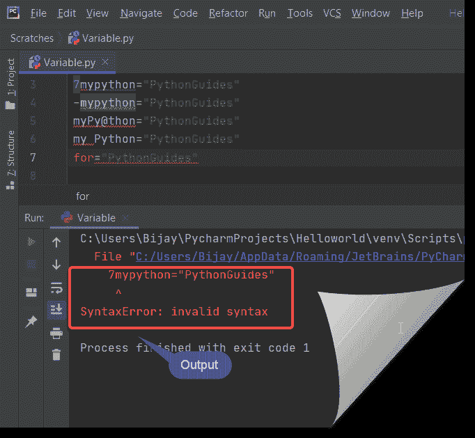

# Python 命名约定(详细指南)

> 原文：<https://pythonguides.com/python-naming-conventions/>

[](https://sharepointsky.teachable.com/p/python-and-machine-learning-training-course)

在本 [python 教程](https://pythonguides.com/python-programming-for-the-absolute-beginner/)中，我们将详细讨论 **Python 命名约定**。比如在类、[变量](https://pythonguides.com/create-python-variable/)、函数、对象、文件名、模块、常量、包、全局、变量等情况下，如何使用 python 中的**命名约定。**

在我的上一篇博客中，我们讨论了如何在 python 中使用 regex 拆分字符串。

我们还将在这里讨论以下主题。

*   Python 中如何选择函数名？
*   Python 中的**变量命名约定有哪些？**
*   如何用 python 命名一个类？
*   在 python 中我的文件名应该是什么？
*   python 中的方法名应该是什么？
*   python 中的常量命名约定
*   如何用 python 命名一个包？
*   python 中的对象命名约定
*   在 python 中我的模块名应该是什么？
*   python 中的全局变量命名约定
*   什么是 Snake_case 命名风格 Python？
*   不要忽略方法的参数。

在 python 中，命名任何组件时，我们都需要遵循某些规则。让我们一个一个来看。

目录

[](#)

*   [Python 命名约定](#Python_naming_conventions "Python naming conventions")
*   [如何在 Python 中选择函数名？](#How_to_choose_a_function_name_in_Python "How to choose a function name in Python?")
*   [python 中的变量命名约定或者说 Python 中的变量命名约定有哪些？](#Variable_naming_convention_in_python_or_What_are_the_variable_naming_conventions_in_Python "Variable naming convention in python or What are the variable naming conventions in Python?")
*   [如何用 python 命名一个类](#How_to_name_a_Class_in_python "How to name a Class in python")
*   [我在 python 中的文件名应该是什么？](#What_should_be_my_file_name_in_python "What should be my file name in python?")
*   [python 中的方法名应该是什么？](#What_should_be_a_method_name_in_python "What should be a method name in python?")
*   [python 中的常量命名约定](#Constant_naming_convention_in_python "Constant naming convention in python")
*   [如何用 python 给包命名？](#How_to_name_a_package_in_python "How to name a package in python?")
*   [python 中的对象命名约定](#Object_naming_convention_in_python "Object naming convention in python")
*   [我在 python 中的模块名应该是什么？](#What_should_be_my_module_name_in_python "What should be my module name in python?")
*   [python 中的全局变量命名约定](#Global_variable_naming_convention_in_python "Global variable naming convention in python")
*   [什么是 Snake_case 命名风格 Python？](#What_is_Snake_case_naming_style_Python "What is Snake_case naming style Python?")
*   不要忽略一个方法的参数
*   [python 命名约定的一般规则](#Rules_in_general_for_python_naming_conventions "Rules in general for python naming conventions")

## Python 命名约定

命名约定在任何编程语言中都非常重要和有用。在这里，我们将看到在用 Python 编程时应该使用的各种 **Python 命名约定**。

## 如何在 Python 中选择函数名？

当**在 Python** 中命名一个函数时，我们需要遵循某些规则。

*   **规则-1:** 我们要用全部的**小写字符**来写 [Python 函数](https://pythonguides.com/string-methods-in-python/)的名字。
*   **规则 2:` `在 python 中命名函数时不要使用大写字符**。
*   **规则 3:** 在命名函数时，在单词之间使用**下划线(_)** 代替空格。

示例:

```py
def my_function():
  print("This is the way we should use the function name")

def critical_function():
  print("Better function name")

def new_data():
  print("Better function name")
```

## python 中的变量命名约定或者说 Python 中的变量命名约定有哪些？

**变量**名称的 Python 命名约定与函数名称相同。

在给一个 [Python 变量](https://pythonguides.com/create-python-variable/)命名时，我们需要遵循一些规则。

*   **规则-1** :变量名应该以字母或**下划线(_)** 字符开头。
*   **规则二:**变量名只能包含 **A-Z，A-Z，0-9** 和**下划线(_)** 。
*   规则 3: 你不能以一个**数字**开始变量名。
*   **规则-4:** 变量名不能使用特殊字符，如 **$、%、#、&、@等。-,^** 等。
*   **规则 5** :变量名**区分大小写**。例如 str 和 Str 是两个不同的变量。
*   **规则-6:** 不要使用保留关键字作为变量名，例如像**类，for，def，del，is，else，` `try，from，**等关键字。

```py
#Allowed variable names

x=2
y="Hello"
mypython="PythonGuides"
my_python="PythonGuides"
_my_python="PythonGuides"
_mypython="PythonGuides"
MYPYTHON="PythonGuides"
myPython="PythonGuides"
myPython7="PythonGuides"
```

```py
#Variable name not Allowed

7mypython="PythonGuides"
-mypython="PythonGuides"
myPy@thon="PythonGuides"
my Python="PythonGuides"
for="PythonGuides"
```

它显示**无效语法**。它将一个接一个地执行并显示错误。



Python naming conventions

阅读:[如何在 Python 中求一个数的位数之和](https://pythonguides.com/sum-of-digits-of-a-number-in-python/)

## 如何用 python 命名一个类

**Python 类的命名约定**和任何其他编程语言一样，比如 [C#。net](https://www.enjoysharepoint.com/generate-otp-asp-net/) 或者 C++。

当我们在 [python](https://www.python.org/) 中决定类的名字时，我们需要遵循某些规则。

当你给类起一个合适的名字时，程序看起来真的很酷，因为程序是从类开始的。

*   规则一:我们需要遵循**茶包**的惯例
*   规则 2: 当你为一个异常编写类时，这个名字应该以“**错误**结尾。
*   **规则 3:** 如果你从某个地方调用类或者 `callable` 那么，在这种情况下，你可以像**函数**一样给一个类名。
*   **规则-4:**python 中的内置类是带**小写**的。

示例:

```py
class MyClass

class Hello

class InputError
```

## 我在 python 中的文件名应该是什么？

当我们在 python 中决定文件的名称时，我们需要遵循某些规则。

*   规则 1: 我们应该选择一个**的简称**作为文件名。
*   规则 2: 当你决定一个文件的名字时，你应该全部使用小写的**。**
***   规则三:我们也可以在文件名中使用**下划线(_)** 。**

 **## python 中的方法名应该是什么？

当我们在 python 中为[方法决定名称时，我们需要遵循某些规则。](https://pythonguides.com/string-methods-in-python/)

*   规则 1: 在决定一个方法的名字时，你应该全部使用小写的**。**
`*   `规则 2:** 如果你的方法名中有多个单词，那么它们应该用一个**下划线(_)** 隔开。*   规则 3: 非公共方法名应该以下划线(_)开头。*   规则 4: 如果你想破坏一个方法名，那么在这种情况下我们可以在开头使用两个**下划线(_)** 。**

 **## python 中的常量命名约定

在命名一个常量时，我们需要遵循一些规则。

*   **规则-1:****python 中的常量名**应该是**大写**始终。
*   **规则 2:** 如果你的常量名中有多个单词，那么它们应该用一个**下划线(_)** 隔开。

## 如何用 python 给包命名？

在命名一个包时，我们需要遵循一些规则。

*   规则 1: 在决定一个包的名字时，你应该全部使用小写的**。**
`*   `规则 2:** 如果你的方法名中有多个单词，那么它们应该用一个**下划线(_)** 隔开。*   **规则三:**最好用一个**单字**作为**套餐名称**。**

 **## python 中的对象命名约定

当我们在 python 中决定对象的名称时，我们需要遵循某些规则。

*   规则 1: 在给一个物体起名字的时候，你应该全部使用小写的**。**
`*   `规则二:**选择一个非常**的简称**。*   规则 3: 如果你的对象名中有多个单词，那么它们应该用一个**下划线(_)** 隔开。**

 **## 我在 python 中的模块名应该是什么？

当我们在 python 中决定模块的名称时，我们需要遵循某些规则。

*   规则 1: 在决定一个模块的名字时，你应该全部使用小写的**。**
`*   `规则 2:** 如果你的模块名中有多个单词，那么它们应该用一个**下划线(_)** 隔开。*   **规则 3:** 最好用一个**单字**作为**模块名**。**

 **## python 中的全局变量命名约定

在命名一个**全局变量时，我们需要遵循某些规则。**

*   规则 1: 在给一个物体起名字的时候，你应该全部使用小写的**。**
`*   `规则 2:** 如果你的全局变量名称中有多个单词，那么它们应该用一个**下划线(_)** 隔开。**

 **## 什么是 Snake_case 命名风格 Python？

这是一种格式，如果 python 对象名中有多个单词，那么它们应该用一个**下划线(_)** 隔开。

当我们用**下划线(_)** 代替空格来分隔一个复合词时，我们称之为 **Snake_case 命名风格 Python** 。

示例:

```py
Hello_World

My_Instance_Name
```

## 不要忽略一个方法的参数

*   在实例方法的情况下，使用名为“self”的参数作为它们的第一个参数。
*   对于类方法，使用“cls”作为它们的第一个参数。

## python 命名约定的一般规则

*   规则 1: 总是给任何 python 对象一个有意义的全名。不要给一个像 x，y，或 z 等的名字。
*   规则 2: 当不止一个单词出现时，在对象名之间不要给空格，而是使用**下划线(_)** 。
*   规则 3: 最好只在有意义的时候使用 camelCase，否则尽量避免使用 camelCase。

您可能会喜欢以下 Python 教程:

*   [为什么 python 如此受欢迎？python 为什么会蓬勃发展？](https://pythonguides.com/python-programming-for-the-absolute-beginner/)
*   [python 是如何工作的？python 是如何解读的？](https://pythonguides.com/python-programming-for-the-absolute-beginner/)
*   [Python 下载和安装步骤](https://pythonguides.com/python-download-and-installation/)
*   [如何在 python 中创建一个字符串并将其赋给一个变量](https://pythonguides.com/create-a-string-in-python/)
*   [Python Hello World 程序](https://pythonguides.com/python-hello-world-program/)
*   [如何在 python 中使用正则表达式拆分字符串](https://pythonguides.com/python-split-string-regex/)
*   [如何在 python 中连接字符串](https://pythonguides.com/concatenate-strings-in-python/)

**结论:**

Python 是最流行的开源面向对象编程语言，它很容易学习，语法也很简单。

我们应该用小写字母来写函数名。变量名不能以**号**开头。

命名一个类时，我们需要遵循 `camelCase` 约定。

在决定一个方法的名字时，你应该全部使用小写的**。非公共方法名应该以一个**下划线(_)** 开头。**

 **在为一个物体命名时，我们应该使用全部小写的**。**

 **变量名以字母或**下划线(_)** 字符开头。

我们应该选择一个**短名**作为文件名，所有**小写**字符。

本 python 教程解释了以下几点:

*   Python 中如何选择函数名？
*   Python 中的变量命名约定有哪些？
*   如何用 python 命名一个类？
*   在 python 中我的文件名应该是什么？
*   python 中的方法名应该是什么？
*   python 中的常量命名约定
*   如何用 python 命名一个包？
*   python 中的对象命名约定
*   在 python 中我的模块名应该是什么？
*   python 中的全局变量命名约定
*   什么是 Snake_case 命名风格 Python？
*   不要忽略方法的参数。
*   python 命名约定的一般规则。

[Bijay Kumar](https://pythonguides.com/author/fewlines4biju/)

Python 是美国最流行的语言之一。我从事 Python 工作已经有很长时间了，我在与 Tkinter、Pandas、NumPy、Turtle、Django、Matplotlib、Tensorflow、Scipy、Scikit-Learn 等各种库合作方面拥有专业知识。我有与美国、加拿大、英国、澳大利亚、新西兰等国家的各种客户合作的经验。查看我的个人资料。

[enjoysharepoint.com/](https://enjoysharepoint.com/)[](https://www.facebook.com/fewlines4biju "Facebook")[](https://www.linkedin.com/in/fewlines4biju/ "Linkedin")[](https://twitter.com/fewlines4biju "Twitter")``********``