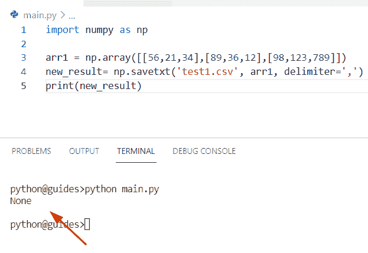

# Python NumPy 2d 数组+示例

> 原文：<https://pythonguides.com/python-numpy-2d-array/>

[](https://sharepointsky.teachable.com/p/python-and-machine-learning-training-course)

在这个 [Numpy 教程](https://pythonguides.com/numpy/)中，我们将学习**如何在 Python** 中使用二维 Numpy 数组。此外，我们将涵盖这些主题。

*   Python NumPy 2d 数组切片
*   Python NumPy 2d 数组初始化
*   Python NumPy 2d 数组索引
*   Python NumPy 二维零数组
*   Python NumPy 2d 数组到 1d 数组
*   Python NumPy 2d 阵列 append
*   Python NumPy 2d 数组声明
*   Python NumPy 2d 数组大小
*   Python NumPy 2d 数组到 3d 数组
*   不带 numpy 的 Python 2d 数组
*   Python numpy where 2d 数组
*   Python numpy 空 2d 数组
*   Python 按列排序 2d numpy 数组
*   Python numpy 连接 2d 数组
*   Python numpy 2d 数组到 CSV
*   Python numpy 2d 数组整形
*   Python numpy rotate 2d array
*   Python numpy 随机二维数组
*   Python numpy 2d 数组到字符串
*   Python numpy 转置 2d 数组
*   Python NumPy 唯一二维数组
*   Python 迭代 numpy 2d 数组
*   Python numpy 二维零数组
*   Python 在 Numpy 2d 数组中查找值的索引
*   Python 绘图 numpy 2d 数组
*   Python numpy argmax 2d 数组
*   Python numpy 平均二维数组
*   Python numpy 堆栈 2d 数组
*   Python numpy shuffle 2d 数组
*   Python numpy 按条件过滤二维数组

目录

[](#)

*   [Python NumPy 2d 数组](#Python_NumPy_2d_array "Python NumPy 2d array")
    *   [另一个用 Python 创建二维数组的例子](#Another_example_to_create_a_2-dimension_array_in_Python "Another example to create a 2-dimension array in Python")
*   [Python NumPy 2d 数组切片](#Python_NumPy_2d_array_slicing "Python NumPy 2d array slicing")
    *   [使用切片方法创建二维数组的另一种方法](#Another_method_for_creating_a_2-dimensional_array_by_using_the_slicing_method "Another method for creating a 2-dimensional array by using the slicing method")
*   [Python NumPy 2d 数组初始化](#Python_NumPy_2d_array_initialize "Python NumPy 2d array initialize")
*   [Python NumPy 2d 数组索引](#Python_NumPy_2d_array_indexing "Python NumPy 2d array indexing")
*   [Python NumPy 二维零数组](#Python_NumPy_2d_array_of_zeros "Python NumPy 2d array of zeros")
*   [Python NumPy 2d 数组转 1d](#Python_NumPy_2d_array_to_1d "Python NumPy 2d array to 1d")
    *   [另一个使用 ravel()方法将二维数组转换成一维数组的例子](#Another_example_to_convert_2-d_array_to_1-d_array_by_using_ravel_method "Another example to convert 2-d array to 1-d array by using ravel() method")
*   [Python NumPy 2d 数组追加](#Python_NumPy_2d_array_append "Python NumPy 2d array append")
*   [Python NumPy 2d 数组声明](#Python_NumPy_2d_array_declaration "Python NumPy 2d array declaration")
*   [Python NumPy 2d 数组大小](#Python_NumPy_2d_array_size "Python NumPy 2d array size")
*   [Python NumPy 2d 数组转 3d](#Python_NumPy_2d_array_to_3d "Python NumPy 2d array to 3d")
*   [没有 numpy 的 Python 2d 数组](#Python_2d_array_without_numpy "Python 2d array without numpy")
*   [Python numpy where 2d 数组](#Python_numpy_where_2d_array "Python numpy where 2d array")
*   [Python numpy 空 2d 数组](#Python_numpy_empty_2d_array "Python numpy empty 2d array")
*   [Python 按列排序 2d numpy 数组](#Python_sort_2d_numpy_array_by_column "Python sort 2d numpy array by column")
*   [Python numpy 串接 2d 数组](#Python_numpy_concatenate_2d_array "Python numpy concatenate 2d array")
*   [Python numpy 2d 数组到 CSV](#Python_numpy_2d_array_to_CSV "Python numpy 2d array to CSV")
*   [Python numpy 2d 数组整形](#Python_numpy_2d_array_reshape "Python numpy 2d array reshape")
*   [Python numpy 旋转二维数组](#Python_numpy_rotate_2d_array "Python numpy rotate 2d array")
*   [Python numpy 随机二维数组](#Python_numpy_random_2d_array "Python numpy random 2d array")
*   [Python numpy 2d 数组转字符串](#Python_numpy_2d_array_to_string "Python numpy 2d array to string")
*   [Python numpy 转置 2d 数组](#Python_numpy_transpose_2d_array "Python numpy transpose 2d array")
*   [Python NumPy 唯一二维数组](#Python_NumPy_unique_2d_array "Python NumPy unique 2d array")
*   [Python 迭代 numpy 2d 数组](#Python_iterate_numpy_2d_array "Python iterate numpy 2d array")
*   [Python 在 Numpy 2d 数组中查找值的索引](#Python_find_index_of_value_in_Numpy_2d_array "Python find index of value in Numpy 2d array")
*   [Python plot numpy 2d 数组](#Python_plot_numpy_2d_array "Python plot numpy 2d array")
    *   [图截图](#Graph_Screenshot "Graph Screenshot")
*   [Python numpy argmax 2d 数组](#Python_numpy_argmax_2d_array "Python numpy argmax 2d array")
*   [Python numpy 平均二维数组](#Python_numpy_average_2d_array "Python numpy average 2d array")
*   [Python numpy 栈 2d 数组](#Python_numpy_stack_2d_array "Python numpy stack 2d array")
*   [Python numpy shuffle 2d 数组](#Python_numpy_shuffle_2d_array "Python numpy shuffle 2d array")
*   [Python numpy 按条件过滤二维数组](#Python_numpy_filter_two-dimensional_array_by_condition "Python numpy filter two-dimensional array by condition")

## Python NumPy 2d 数组

*   在这一节中，我们将讨论如何在 Python 中创建一个二维数组。
*   在 Python 中创建一个二维数组，我们可以很容易地应用 np.array 函数。这个功能基本上占用内存少，系统化存储数据。

**语法:**

下面是 `numpy.array()` 函数的语法

```py
numpy.array
           (
            object,
            dtype=None,
            copy=True,
            order='K',
            subok=False,
            ndim=0,
            like=None
           )
```

**举例:**

```py
import numpy as np

arr1 = np.array([[23,67],[78,92]])
print(arr1)
```

在上面的代码中，我们首先导入了一个 numpy 库，然后创建了一个变量**‘arr 1’**，并分配了一个 numpy 数组函数来创建一个二维数组。

下面是以下代码的截图


Python NumPy 2d array

### 另一个用 Python 创建二维数组的例子

通过使用 `np.arange()` 和`shape()`方法，我们可以执行这个特定的任务。在 Python 中， `numpy.arange()` 函数是基于数值范围的，它是一个内置的 numpy 函数，总是返回一个 ndarray 对象。而`NP . shape()`方法用于在不更新数据的情况下对 numpy 数组进行整形。

**源代码:**

```py
import numpy as np

new_arr = np.arange(12).reshape(3,4)
print(new_arr)
```

在上面的例子中，我们应用了 `np.arange()` 和 shape()方法来创建一个二维数组。一旦你将打印出**‘new _ arr’**，那么输出将显示 `0-12` 整数。

下面是以下给定代码的输出


Python NumPy 2d array

阅读: [Python NumPy 数组](https://pythonguides.com/python-numpy-array/)

## Python NumPy 2d 数组切片

*   让我们看看如何使用 Python 中的切片方法创建一个二维数组。
*   在这个例子中，我们必须提取 numpy 数组的第一项和最后一项。为了完成这项任务，我们将应用包含第一个和最后两个元素的 **[:2]** 切片方法。

**举例:**

```py
import numpy as np

arr1 = np.array([[[67, 23, 89], [21, 31, 89], [64, 89, 91]],
                [[78, 993, 56], [31, 22, 88], [120, 805, 190]],
                ])

result= arr1[:2, 1:, :2]
print("slicing array:",result)
```

你可以参考下面的截图


Python NumPy 2d array slicing

### 使用切片方法创建二维数组的另一种方法

在这个例子中，我们将使用 `numpy.ix_()` 函数。在 Python 中，这个方法接受 n 个一维或二维序列，这个函数将帮助用户对数组进行切片。

**语法:**

下面是 numpy.ix()函数的语法

```py
numpy.ix(*args)
```

示例:

```py
import numpy as np

new_arr = np.arange(12).reshape(3,4)
print(new_arr)

result = new_arr[np.ix_([2,1],[0,2])]
print(result) 
```

下面是以下给定代码的执行过程


Python NumPy 2d array slicing

阅读: [Python NumPy zeros +示例](https://pythonguides.com/python-numpy-zeros/)

## Python NumPy 2d 数组初始化

*   这里我们可以看到如何使用 Python 初始化一个 numpy 二维数组。
*   通过使用 `np.empty()` 方法，我们可以轻松地创建一个 numpy 数组，而无需声明给定形状和数据类型的条目。在 Python 中，该方法不会将 numpy 数组值设置为零。
*   在这个程序中，我们还将使用 `append()` 函数来合并两个数组，并将它们存储到一个给定的空数组中，这个函数总是返回一个新数组。

**语法:**

下面是 numpy.empty()函数的语法

```py
numpy.empty
           (
            shape,
            dtype=float,
            order='c',
            like=None
           )
```

**源代码:**

```py
import numpy as np

out1 = np.empty((0, 3), int)
out1 = np.append(out1, np.array([[78, 68, 92, 56]]), axis=0)
out1 = np.append(out1, np.array([[98, 11, 34, 89]]), axis=0)
print(out1)
```

在上面的程序中，我们初始化了一个空数组，然后使用 numpy append()函数在其中添加条目。一旦打印出“out1 ”,输出将显示新的二维数组。

下面是以下代码的截图


Python NumPy 2d array initialize

阅读: [Python NumPy arange +示例](https://pythonguides.com/python-numpy-arange/)

## Python NumPy 2d 数组索引

*   在这一节中，我们将讨论如何使用 Python 获得 numpy 数组的索引号。
*   为了执行这个特定的任务，首先我们将使用 `np.array()` 函数创建一个数组，然后声明一个变量**‘b’**，在这个变量中我们将选择想要在输出中显示的索引号。

**举例:**

```py
import numpy as np

arr1 = np.array([[67, 23], [21, 31]])
b= arr1[1]
print(b)
```

下面是以下给定代码的实现


Python NumPy 2d array indexing

正如您在截图中看到的，输出显示了第二个 numpy 数组。

阅读: [Python NumPy Sum +示例](https://pythonguides.com/python-numpy-sum/)

## Python NumPy 二维零数组

*   在这个程序中，我们将讨论如何用 Python 创建一个零值的二维数组。
*   在这个例子中，我们将使用 numpy zeros 函数来创建一个用零填充的新数组，这个方法指示指定 numpy 数组的确切维数。

**语法:**

下面是 numpy.zeros()函数的语法

```py
numpy.zeros
           (
            shape,
            dtype=float,
            order='C',
            like=None
           )
```

**源代码:**

```py
import numpy as np

arr1 = np.zeros((3, 3))
print(arr1)
```

在上面的程序中，我们已经使用了 `np.zeros()` 函数在其中指定了数组元素的形状。现在，一旦你打印了**‘arr 1’**，它将显示一个由 3 行 3 列填充零的 2d 数组。


Python NumPy 2d array of zeros

阅读: [Python NumPy 矩阵+示例](https://pythonguides.com/python-numpy-matrix/)

## Python NumPy 2d 数组转 1d

*   在这一节中，我们将讨论如何将二维数组转换成一维数组。
*   通过使用 flatten 方法我们可以解决这个问题，这个函数返回一个一维数组的副本。
*   在 Python 中， `flatten()` 方法改变数组的形状，它将帮助用户将二维数组转换成一维数组。

**语法:**

下面是 numpy.flatten()方法的语法

```py
ndarray.flatten
               (
                order='C'
               )
```

**源代码:**

```py
import numpy as np

arr1 = np.array([[67, 23, 89], [21, 31, 89], [64, 89, 91]])
result=arr1.flatten()
print(result)
```

在上面的代码中，我们已经导入了别名为“np”的 numpy 库，我们将使用 np.array()函数创建一个整数数组。在这个例子中，我们将使用 ndarray.flatten()来展平二维数组。

你可以参考下面的截图


Python NumPy 2d array to 1d

### 另一个使用 ravel()方法将二维数组转换成一维数组的例子

通过使用 `numpy.ravel()` 方法，我们可以得到一维数组形式的输出。在 Python 中，这个方法将总是返回一个具有相同数据类型的 numpy 数组，如果该数组是一个掩码数组，那么它将返回一个掩码 numpy 数组。

**语法:**

下面是 numpy.ravel()方法的语法

```py
numpy.ravel(
            a,
            order='C'
           )
```

**举例:**

让我们举一个例子，看看如何将二维数组转换成一维数组

```py
import numpy as np 
new_val = np.array([[45, 34, 56],
                   [118, 192, 765],
                   [356, 563, 932]])

new_result = np.ravel(new_val)
print("Convert 2d to 1-d:",new_result)
```

下面是以下代码的截图


Python NumPy 2d array to 1d

阅读: [Python NumPy append + 9 示例](https://pythonguides.com/python-numpy-append/)

## Python NumPy 2d 数组追加

*   在这个程序中，我们将讨论如何在 Python 中添加二维数组。
*   在 Python 中，numpy 模块中提供了 `numpy.append()` 函数，该函数将帮助用户向给定数组中添加新项，或者简单地说，我们可以使用 `np.append()` 函数合并两个不同的数组，它将返回一个具有相同形状和维度的新数组

**语法:**

下面是 numpy.append()函数的语法

```py
numpy.append
            (
             arr,
             values,
             axis=None
            )
```

**举例:**

```py
import numpy as np

arr1 = np.array([[178, 667], [190, 567]])
arr2 = np.array([[888, 128], [24, 76]])
new_res = np.append(arr1, arr2,axis=1)

print(new_res)
```

在上面的程序中，我们已经导入了一个 numpy 库，然后使用 np.array 创建了两个不同的数组，现在我们要追加这些数组，并将它们存储到 **'new_res'** 变量中。一旦您将打印**‘new _ RES’**，那么输出将显示一个新的 numpy 数组。

下面是以下代码的截图


Python NumPy 2d array append

阅读: [Python sort NumPy 数组+示例](https://pythonguides.com/python-sort-numpy-array/)

## Python NumPy 2d 数组声明

*   这里我们可以看到如何用 Python 声明一个 numpy 二维数组。
*   在 Python 中声明一个新的二维数组我们可以很容易地使用 arange 和`shape()`方法的组合。shape()方法用于在不更新数据的情况下对 numpy 数组进行整形，而 arange()函数用于创建一个新数组。

**源代码:**

```py
import numpy as np

new_arr=np.arange(8)
new_result=new_arr.reshape(2,4)
print(new_result)
```

下面是以下给定代码的输出


Python NumPy 2d array declaration

阅读: [Python NumPy concatenate](https://pythonguides.com/python-numpy-concatenate/)

## Python NumPy 2d 数组大小

*   让我们看看如何在 Python 中获得 numpy 二维数组的大小。
*   在 Python 中， `size()` 属性总是返回 numpy 数组的大小，这意味着它计算 numpy 数组的项数，然后显示它。

**语法:**

下面是 ndarray size()的语法

```py
numpy.ndarray.size()
```

**举例:**

```py
import numpy as np

new_array = np.array([[34, 15], [78, 98], [23, 78]])
print("size of 2-dimension aray is: ", new_array.size)
```

你可以参考下面的截图


Python NumPy 2d array size

正如你在截图中看到的，输出是 6。

阅读: [Python NumPy linspace +示例](https://pythonguides.com/python-numpy-linspace/)

## Python NumPy 2d 数组转 3d

*   在这一节中，我们将讨论如何将二维数组转换成三维数组。
*   在 Python 中，要将二维数组转换成三维数组，我们可以很容易地使用`numpy . shape()`方法。此函数将在不更新元素的情况下调整数组的形状。

**语法:**

下面是 numpy.reshape()方法的语法

```py
numpy.reshape
             (
              a,
              newshape,
              order='C'
             )
```

**举例:**

```py
import numpy as np

new_val = np.array([[78,98,345,667,765,982],
                [16,78,228,934,578,309]])

new_result = np.reshape(new_val, (4, 3))
print(new_result)
```

在上面的代码中，我们使用了`NP . shape()`方法将二维数组转换为三维数组。在这种方法中，我们已经指定了新数组的形状和维数。

下面是以下给定代码的实现


Python NumPy 2d array to 3d

阅读:[Python NumPy where with examples](https://pythonguides.com/python-numpy-where/)

## 没有 numpy 的 Python 2d 数组

*   在这一节中，我们将讨论如何在不使用 numpy 包的情况下用 Python 创建一个二维数组。
*   在这个例子中，我们首先选择了数组的数量，然后创建了一个变量“new_val ”,在这个变量中，我们必须用 range 属性指定一个列表理解方法。

**源代码:**

```py
Z = 4

new_val = [[1] * Z for i in range(Z)]
print(new_val)
```

下面是以下给定代码的实现


Python 2d array without numpy

正如您在屏幕截图中看到的，输出显示的是用 1 的值填充的二维数组。

读取: [Python NumPy 读取 CSV](https://pythonguides.com/python-numpy-read-csv/)

## Python numpy where 2d 数组

*   这里我们可以使用 where()函数的概念来获取特定元素的索引号。
*   在 Python 中， `numpy.where()` 函数用于根据给定的条件从 numpy 数组中选择项目。它将检查条件，如果给定值与数组不匹配，并且没有传递 y 参数，那么它将返回一个空数组和数据类型。

**语法:**

下面是 numpy.where()函数的语法

```py
numpy.where
           (
            condition,
            [,
            x,
            y,
            ]
           )
```

**举例:**

```py
import numpy as np

new_arr = np.array([[178, 78, 789], [67, 190, 632]])
output = np.where(new_arr<190)
print(output)
print(new_arr[output])
```

在上面的程序中，我们将使用 `np.where()` 函数并在其中分配条件。它将检查数组中是否存在该值。如果是，它将在输出中显示索引号。

下面是以下给定代码的执行过程


Python numpy where 2d array

阅读: [Python NumPy 日志+示例](https://pythonguides.com/python-numpy-log/)

## Python numpy 空 2d 数组

*   在这个程序中，我们将讨论如何使用空函数获得二维数组。
*   在 Python 中，numpy 包提供了一个名为 `numpy.empty()` 的函数，该方法用于声明给定形状的新 numpy 数组，而无需初始化条目。

**语法:**

下面是 numpy.empty()函数的语法

```py
numpy.empty
           (
            shape,
            dtype=float,
            order='C',
            like=None
           )
```

**举例:**

```py
import numpy as np

new_arr = np.empty((2, 2, 2))
print(new_arr)
```

在上面的程序中，我们使用了 `np.empty()` 函数，并在其中传递了一个形状和数据类型值。一旦你将打印**‘new _ arr’**，那么输出将显示包含在新数组中的不同值。

你可以参考下面的截图


Python numpy empty 2d array

阅读: [Python NumPy square 举例](https://pythonguides.com/python-numpy-square/)

## Python 按列排序 2d numpy 数组

*   在这里，我们可以看到如何在 Python 中按列对二维数组进行排序。
*   在这个例子中，我们将使用 `argsort()` 方法的概念。在 Python 中，该方法用于沿着相同形状的给定轴对数组进行排序，并且该方法将始终返回对 numpy 数组进行排序的索引。

**语法:**

下面是 numpy.argsort()函数的语法

```py
numpy.argsort
             (
              a,
              axis=-1,
              kind=None,
              order=None
             )
```

**举例:**

```py
import numpy as np

new_arr = np.array([[44, 25, 78, 91], [189, 654, 145, 934], [456, 889, 145, 789]])
new_val = 1
new_result = new_arr[new_arr[:,new_val].argsort()]
print(new_result)
```

在上面的代码中，我们按照索引 1 处的第二列对 numpy 数组进行了排序。

下面是以下给定代码的实现


Python sort 2d numpy array by column

阅读: [Python NumPy 列举示例](https://pythonguides.com/python-numpy-to-list/)

## Python numpy 串接 2d 数组

*   让我们看看如何在 Python 中连接一个二维 numpy 数组。
*   为了执行这个特殊的任务，我们将使用 `numpy.concatenate()` 函数。在 Python 中，该函数将帮助用户将二维数组组合或合并在一起，但是在这种情况下，数组应该沿着指定的轴具有相同的形状和大小。
*   该功能在 numpy 模块中可用，可垂直和水平操作。

**语法:**

下面是 numpy.concatenate()函数的语法

```py
np.concatenate
              (
               a1,
               a2,
               axis=0,
               out=None,
               dtype=None,
               casting="same_kind"
              )
```

**源代码:**

```py
import numpy as np

new_arr = np.array([[198, 567, 123], [342, 907, 167]])
new_arr2 = np.array([[745, 567, 234],[782, 567, 190]])
print(np.concatenate((new_arr, new_arr2), axis = -1))
```

在上面的程序中，我们通过使用 `np.array()` 函数创建了两个不同的数组，并在其中赋整数值。现在使用 `concatenate()` 方法来组合二维数组。

下面是以下给定代码的执行过程


Python numpy concatenate 2d array

阅读: [Python NumPy 平均值及示例](https://pythonguides.com/python-numpy-average/)

## Python numpy 2d 数组到 CSV

*   让我们看看如何使用 Python 来保存带有 CSV 文件的二维数组。
*   在这个例子中，我们将使用 `np.savetext` 来执行这个任务。在 Python 中，该方法将有助于将 numpy 数组保存到 CSV 文件中。这个函数有两个参数，文件名和数据，我们也可以在里面加分隔符。
*   在此示例中，文件名以 CSV 模式结束，分隔符用于 CSV 文件元素分隔符。

**语法:**

下面是 numpy.savetxt()方法的语法

```py
numpy.savetxt
             (
              fname,
              X,
              delimiter='',
              newline='\n',
              header='',
              footer='',
              comments='#',
              encoding=None
             )
```

**源代码:**



Python numpy 2d array to CSV

**CSV 文件截图**


Python numpy 2d array to CSV

正如你在截图中看到的，CSV 文件保存了二维数组。

阅读: [Python NumPy 绝对值举例](https://pythonguides.com/python-numpy-absolute-value/)

## Python numpy 2d 数组整形

*   这里我们可以看到如何在 Python 中重塑二维数组。
*   在这个例子中，我们可以很容易地使用`numpy . shape()`方法，这个函数将在不更新数组元素的情况下改变数组的形状。在这个程序中，我们必须使用`NP . shape()`方法将一个二维数组转换成一个一维数组。

**举例:**

```py
import numpy as np

new_array1 = np.array([[67, 89, 41, 99], 
                     [45, 77, 23, 45]])
b= new_array1.reshape(new_array1.size,)
print(b)
```

下面是以下代码的截图


Python numpy 2d array reshape

## Python numpy 旋转二维数组

*   在这一节中，我们将讨论如何在 Python 中旋转二维数组。
*   通过使用 `np.rot90()` 方法，我们可以执行这个任务。此方法用于在平面轴上将 numpy 数组旋转 90 度，轴将为 0 或 1。

**语法:**

下面是 numpy.rot90()方法的语法

```py
numpy.rot90
           (
            m,
            k=1,
            axes=(0,1)
           )
```

**举例:**

```py
import numpy as np

new_val = np.array([[89,91], [78,56]])
print(new_val)
result = np.rot90(new_val, 2)
print("After rotating arr:",result)
```

你可以参考下面的截图


Python numpy rotate 2d array

## Python numpy 随机二维数组

*   在这一节中，我们将讨论如何使用 Python 中的 random 函数创建一个二维数组。
*   在 Python 中， `random.rand()` 函数将创建一个包含数字的 numpy 数组，该模块存在于 NumPy 模块中，该函数用于生成给定形状的随机值。
*   在这个例子中，我们在一个参数中传递了 **(2，2)** ，该参数表示 numpy 数组的形状和维度。

**语法:**

下面是 numpy.randm.rand()函数的语法

```py
random.rand
           (
            d0,
            d1,
            .
            .
            dn
           )
```

源代码:

```py
import numpy as np

new_arr = np.random.rand(2,2)
print("Random values for 2d array:",new_arr)
```

下面是以下给定代码的执行过程


Python numpy random 2d array

## Python numpy 2d 数组转字符串

*   在这个程序中，我们将讨论如何在 Python 中用字符串转换二维数组。
*   通过使用 `np.array2string()` 方法，我们可以解决这个任务，这个方法将总是返回 numpy 数组的字符串表示。

**语法:**

下面是 numpy.array2string()方法的语法

```py
numpy.array2string
                  (
                   a,
                   max_line_width=None,
                   precision=None,
                   suppress_Small=None,
                   separator='',
                   prefix='',
                   style=<no value>,
                   formatter=None,
                   threshold=None,
                   edgeitems=None,
                   sign=None,
                   floatmode=None,
                   legacy=None
                  )
```

**源代码:**

```py
import numpy as np

new_arr = np.random.rand(2,2)
b= np.array2string(new_arr, formatter={'float_kind':lambda x: "%.2f" % x})
print(b)
```

你可以参考下面的截图


Python numpy 2d array to string

## Python numpy 转置 2d 数组

*   让我们看看如何在 Python 中转置一个二维数组。
*   在这个例子中，我们将使用 `numpy.transpose()` 方法。在 Python 中，此方法用于将列项更改为行元素，将行项更改为列项。这个函数将总是返回一个新的修改过的数组。
*   假设如果 numpy 数组形状是 **(m，n)** ，那么通过使用 `numpy.transpose()` 方法，形状将是(n，m)。

**举例:**

```py
import numpy as np

new_element = np.array([[17,18,13,73,56],[108,23,87,123,84]])
new_output = np.transpose(new_element)
print(new_output)
```

下面是以下给定代码的实现


Python numpy transpose 2d array

正如您在截图中看到的，输出将显示一个修改后的 numpy 数组

## Python NumPy 唯一二维数组

*   在本节中，我们将讨论如何在 Python 中从二维数组中获取唯一值。
*   为了执行这个特定的任务，我们将使用 `np.unique()` 函数。在 Python 中，该方法检查数组中的唯一值，例如，我们有一个包含重复值的二维数组，如果我们要应用 `np.unique()` 函数，它将返回唯一值。
*   该方法在 numpy 模块中可用，并且该函数能够返回唯一值的元组。

**语法:**

下面是 numpy.unique()方法的语法

```py
numpy.unique
            (
             arr,
             return_index=False,
             return_inverse=False,
             return_counts=False,
             axis=None
            )
```

**源代码:**

```py
import numpy as np

new_array = np.array([[67, 67, 45,92] ,[ 90, 67, 45,11] , [ 20, 67, 45, 67],  [67, 67, 45, 67]])
new_result = np.unique(new_array)
print('Unique 2d elements : ', new_result)
```

在上面的程序中，我们使用 `np.array()` 函数创建了一个 numpy 数组，然后使用 `np.unique()` 函数从数组中获取唯一元素。

下面是以下代码的截图


Python NumPy unique 2d array

正如您在屏幕截图中看到的，输出将显示列表中可用的唯一值。

## Python 迭代 numpy 2d 数组

*   这里我们可以看到如何在 Python 中迭代一个 numpy 二维数组。
*   在 Python 中，要迭代一个二维数组，我们可以很容易地在其中使用 for `loop()` 方法，而要创建一个 numpy 数组，我们可以应用 arange()函数和 reshape。一旦你将打印**‘I’**，那么输出将显示二维数组。

**举例:**

```py
import numpy as np

new_arr = np.arange(8).reshape(4,2)
for i in new_arr:
    print("Iterating values:",i)
```

下面是以下给定代码的输出


Python iterate numpy 2d array

## Python 在 Numpy 2d 数组中查找值的索引

*   让我们讨论如何使用 Python 来查找 Numpy 二维数组中值的索引。
*   在这个例子中，我们将使用 `numpy.where()` 函数，这个方法将检查值为**‘934’**的元素的索引。如果它出现在给定的数组中，那么它将显示索引号。

**源代码:**

```py
import numpy as np

new_array = np.array([[78, 95, 34],
                [678, 934, 178],
                [334, 934, 934],
                [334, 554, 678]])
output = np.where(new_array == 934)
print('array value : ',output)
```

你可以参考下面的截图


Python find an index of the value in Numpy 2d array

## Python plot numpy 2d 数组

*   在本节中，我们将讨论如何用 Python 绘制二维数组。
*   我们已经在很多 3d 文章中讨论过这个话题。你可以在那篇文章中参考这个例子，但是在这个例子中，我们刚刚创建了一个简单的二维数组。

**源代码:**

```py
import matplotlib.pyplot as plt, numpy as np
from mpl_toolkits.mplot3d import Axes3D

new_arr= np.array([[178,678,345], [234,967,456]])
new_element = plt.figure()
result = new_element.add_subplot(133, projection='2d')
result.plot(new_arr[:,0],new_arr[:,1],new_arr[:,2])
plt.show()
```

下面是以下给定代码的执行过程


Python plot numpy 2d array

### 图截图


Python plot numpy 2d array

## Python numpy argmax 2d 数组

*   让我们看看如何使用 `argmax()` 函数找到二维数组中的最大值。
*   在 Python 中， `argmax()` 函数返回数组中最大值的索引。该函数采用一个轴，您将沿着该轴确定最大元素。

**语法:**

下面是 numpy.argmax()函数的语法

```py
numpy.argmax
            (
             a,
             axis=None,
             out=None
            )
```

**举例:**

```py
import numpy as np

new_arr = np.arange(8).reshape(2, 4)
final_result = np.argmax(new_arr)
print(final_result)
```

在上面的程序中，我们使用 `np.arange()` 函数创建了一个数组，然后应用 `np.argmax()` 函数获取最大值的索引。

下面是以下代码的截图


Python numpy argmax 2d array

## Python numpy 平均二维数组

*   在本节中，我们将讨论如何使用 Python 来查找二维数组中的平均值。
*   为了完成这个任务，我们将使用 `average()` 函数来计算**二维**数组的平均值。在 Python 中，average 函数测量数组中给定项的加权平均值，该函数有一个轴参数，如果该参数不可用，则该数组被展平。

**语法:**

下面是 numpy.average()函数的语法

```py
numpy.average
             (
              a,
              axis=None,
              weights=None,
              returned=False
             )
```

**举例:**

```py
import numpy as np

new_arr = np.array([[49, 34,98 ,97],
              [85,56,34,15]])
val1 = np.average(new_arr, axis=0)
val1 = np.average(new_arr, axis=1)
print(val1)
```

你可以参考下面的截图


Python numpy average 2d array

正如你在截图中看到的，输出是二维数组的平均值

## Python numpy 栈 2d 数组

*   在这个程序中，我们将讨论如何使用 `stack()` 方法在 Python 中堆栈二维数组。
*   在 Python 中，要组合两个不同的 numpy 数组，我们还可以使用 `np.stack()` 方法，并且数组必须具有相同的形状和大小。

**语法:**

下面是 np.stack()方法的语法

```py
numpy.stack
           (
            arrays,
            axis=0,
            out=None
           )
```

**源代码:**

```py
import numpy as np

new_arr = np.array([ 78, 99, 45] )
new_array = np.array([ 34, 91, 20] )
result = np.stack((new_arr, new_array), axis = 0)
print(result)
```

在上面的代码中，我们通过使用 `np.array()` 创建了两个不同的数组，然后声明了一个变量**‘result’**，在其中我们分配了一个 `np.stack()` 方法来组合数组。

下面是以下给定代码的执行过程


Python numpy stack 2d array

## Python numpy shuffle 2d 数组

*   让我们看看如何在 Python 中混洗一个二维数组。
*   在这个例子中，我们将通过使用 `np.random.shuffle()` 方法来打乱给定数组中可用的元素。

**语法:**

下面是 `numpy.random.shuffle()` 方法的语法

```py
random.shuffle(x)
```

**源代码:**

```py
import numpy as np

new_values = np.arange(8).reshape((4, 2))
result =np.random.shuffle(new_values)
print(new_values)
```

下面是以下代码的截图


Python numpy shuffle 2d array

## Python numpy 按条件过滤二维数组

*   在本节中，我们将讨论如何在 Python 中按条件过滤二维数组。
*   通过使用按位运算符，我们可以过滤基于条件的数组。在本例中，我们将在其中使用 numpy 大于和小于函数。

**举例:**

```py
import numpy as np

new_val = np.array([[89,45,67],
                    [97,56,45]])

result = np.logical_and(np.greater(new_val, 45), np.less(new_val, 89))
print(new_val[result])
```

在上面的代码中，我们指定了一个条件，如果 val 大于 45，它将显示在第一个索引号中，如果 value 小于 89，它将显示在第二个索引号中。

下面是以下给定代码的输出


Python numpy filter two-dimensional array by condition

另外，请阅读以下教程。

*   [Python NumPy 3d 数组+示例](https://pythonguides.com/python-numpy-3d-array/)
*   [Python NumPy 数据类型](https://pythonguides.com/python-numpy-data-types/)
*   [Python NumPy Split + 11 示例](https://pythonguides.com/python-numpy-split/)
*   [Python NumPy Normalize +示例](https://pythonguides.com/python-numpy-normalize/)

在这篇 Python 教程中，我们已经学习了如何在 Python 中使用二维 NumPy 数组。此外，我们将涵盖这些主题。

*   Python NumPy 2d 数组切片
*   Python NumPy 2d 数组初始化
*   Python NumPy 2d 数组索引
*   Python NumPy 二维零数组
*   Python NumPy 2d 数组到 1d 数组
*   Python NumPy 2d 阵列 append
*   Python NumPy 2d 数组声明
*   Python NumPy 2d 数组大小
*   Python NumPy 2d 数组到 3d 数组
*   不带 numpy 的 Python 2d 数组
*   Python numpy where 2d 数组
*   Python numpy 空 2d 数组
*   Python 按列排序 2d numpy 数组
*   Python numpy 连接 2d 数组
*   Python numpy 2d 数组到 CSV
*   Python numpy 2d 数组整形
*   Python numpy rotate 2d array
*   Python numpy 随机二维数组
*   Python numpy 2d 数组到字符串
*   Python numpy 转置 2d 数组
*   Python NumPy 唯一二维数组
*   Python 迭代 numpy 2d 数组
*   Python numpy 二维零数组
*   Python 在 Numpy 2d 数组中查找值的索引
*   Python 绘图 numpy 2d 数组
*   Python numpy argmax 2d 数组
*   Python numpy 平均二维数组
*   Python numpy 堆栈 2d 数组
*   Python numpy shuffle 2d 数组
*   Python numpy 按条件过滤二维数组

[Bijay Kumar](https://pythonguides.com/author/fewlines4biju/)

Python 是美国最流行的语言之一。我从事 Python 工作已经有很长时间了，我在与 Tkinter、Pandas、NumPy、Turtle、Django、Matplotlib、Tensorflow、Scipy、Scikit-Learn 等各种库合作方面拥有专业知识。我有与美国、加拿大、英国、澳大利亚、新西兰等国家的各种客户合作的经验。查看我的个人资料。

[enjoysharepoint.com/](https://enjoysharepoint.com/)[](https://www.facebook.com/fewlines4biju "Facebook")[](https://www.linkedin.com/in/fewlines4biju/ "Linkedin")[](https://twitter.com/fewlines4biju "Twitter")