# Python NumPy 绝对值示例

> 原文：<https://pythonguides.com/python-numpy-absolute-value/>

[](https://sharepointsky.teachable.com/p/python-and-machine-learning-training-course)

在本 [Python 教程](https://pythonguides.com/python-download-and-installation/)中，我们将通过如下几个例子来讨论 **Python NumPy 绝对值**:

*   Python numpy 绝对值和
*   Python numpy 绝对值排序
*   没有函数的 Python numpy 绝对值
*   Python numpy 绝对值元组
*   Python numpy 绝对值熊猫
*   Python numpy 绝对值复数
*   Python numpy 元素的绝对值
*   Python numpy 绝对值差
*   熊猫中列的 Python numpy 绝对值

目录

[](#)

*   [Python numpy 绝对值](#Python_numpy_absolute_value "Python numpy absolute value")
*   [Python numpy 绝对值和](#Python_numpy_absolute_value_sum "Python numpy absolute value sum")
*   [Python numpy 绝对值排序](#Python_numpy_absolute_value_sort "Python numpy absolute value sort")
*   [Python numpy 绝对值无函数](#Python_numpy_absolute_value_without_function "Python numpy absolute value without function")
*   [Python numpy 绝对值元组](#Python_numpy_absolute_value_tuple "Python numpy absolute value tuple")
*   [Python numpy 绝对值熊猫](#Python_numpy_absolute_value_Pandas "Python numpy absolute value Pandas")
*   [Python numpy 绝对值复数](#Python_numpy_absolute_value_complex_number "Python numpy absolute value complex number")
*   [Python numpy 元素级绝对值](#Python_numpy_element-wise_absolute_value "Python numpy element-wise absolute value")
*   [Python numpy 绝对值差](#Python_numpy_absolute_value_difference "Python numpy absolute value difference")
*   [Python 熊猫中列的 numpy 绝对值](#Python_numpy_absolute_value_of_column_in_pandas "Python numpy absolute value of column in pandas")

## Python numpy 绝对值

*   在这个方法中，我们将学习和讨论 **Python numpy 绝对值**。
*   这是一个统计函数，帮助用户测量 NumPy 数组中每个元素的绝对值。
*   在 numpy 数组中，有些元素是负的，有些是正的。
*   如果我们应用 numpy 绝对值，它将计算数组中每个值的绝对值。

**语法:**

下面是 NumPy 绝对值的语法

```py
numpy.absolute
              (
               arr,
               out=None,
               where=True,
               casting='same_kind',
               dtype=None
              )
```

**举例:**

```py
import numpy as np

arr = np.array([4, 5,-6,-7, 3])
result = np.absolute(arr)
print(result)
```

*   在上面的代码中，我们将导入一个 numpy 库，并使用该 numpy 创建一个数组。数组函数并在参数中赋值。
*   创建一个变量，并将函数指定为 np。绝对并打印结果。

下面是以下代码的截图

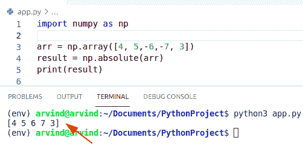

Python numpy absolute value

另一种检查 numpy 绝对值的方法是 numpy.abs()函数

*   它只有一个参数 X，X 参数使我们能够提供输入数组。
*   我们将生成一个值数组的绝对值，首先我们将创建一个 numpy 数组，然后我们可以使用一个 np。在 numpy 数组上 abs()函数。

**举例:**

```py
import numpy as np

arr = np.array([5, 6,-6,-7, 3])
result = np.abs(arr)
print(result)
```

下面是以下代码的截图

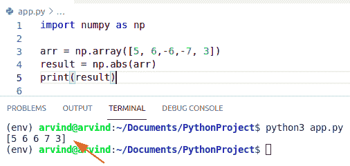

Python numpy absolute value abs method

读取:[检查 Python 中的 NumPy 数组是否为空](https://pythonguides.com/check-if-numpy-array-is-empty/)

## Python numpy 绝对值和

*   在这个方法中，我们将学习和讨论 numpy 绝对值和。
*   两个数组的和的绝对值总是等于它们的绝对值的和，只有当两个数字的符号相同时才为真，这两个数字的符号都是正数或负数。
*   在这个方法中，我们可以很容易地使用函数 numpy.absolute()来获取给定数组的绝对值。

**语法:**

下面是 numpy absolute 的语法

```py
numpy.absolute
              (
               arr,
               out=None,
               where=True,
               casting='same_kind',
               dtype=None
              )
```

**举例:**

```py
import numpy as np
arr1= np.array([2,-3,4])
arr2= np.array([4,-8,6])
def l1(arr1, arr2):

    return np.absolute(arr1 + arr2).sum()
print(l1(arr1,arr2))
```

*   在上面的代码中，我们导入了一个 numpy 库，并使用该 numpy 创建了一个数组。数组函数并在参数中赋值。
*   然后声明一个方法 l1，在该方法中分配参数 arr1 和 arr2，然后生成 np。绝对函数并打印结果。

下面是以下代码的截图

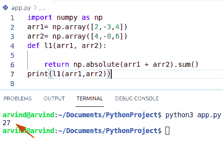

Python numpy array absolute value sum

另一种检查 numpy 绝对值和的方法是 numpy.abs()函数和 map 函数。

*   abs()函数总是返回给定数字的 abs 值，如果 no 是负数，numpy.abs()转换成正数。
*   Map()函数将给定的函数应用于可迭代序列列表和数组的每一项。
*   在本例中，我们将使用这两个函数来获得总和的绝对值。

**举例:**

```py
import numpy as np

arr1 = ([4, 5, -6, -8, 9, 1])
result = sum(map(abs, arr1))
print(result)
```

下面是以下代码的截图

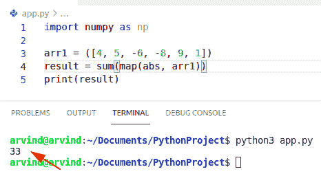

Python numpy absolute value sum abs method

阅读: [Python NumPy zeros](https://pythonguides.com/python-numpy-zeros/)

## Python numpy 绝对值排序

*   在这个方法中，我们将学习和讨论 python 中的 numpy 绝对值排序。
*   在这个方法中，我们可以使用函数 numpy.sort()和 numpy.abs()来获取排序后的元素和正值。
*   这个函数总是返回一个数组的排序副本。
*   在这个例子中，我们将使用这两个函数来获取它们的排序值和绝对值。

**举例:**

让我们举一个例子来检查如何对值进行排序和绝对

```py
import numpy as np

x = np.array([4,2,-1,3])
y = np.sort(x)
z= np.abs(y)
print(z)
```

*   在上面的代码中，我们将导入一个 numpy 库，并使用该 numpy 创建一个数组。数组函数。
*   然后创建一个变量并使用 numpy.sort()和 numpy.abs()方法。

下面是以下代码的截图

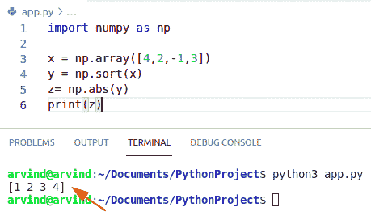

Python numpy absolute value sort

阅读 [Python NumPy max](https://pythonguides.com/python-numpy-max-with-examples/)

## Python numpy 绝对值无函数

*   **在这个方法中，我们将学习和讨论 Python 中不带函数的 numpy 绝对值。**
*   在这个方法中，我们首先声明数字的平方。
*   然后测量计算值的平方根。

**举例:**

```py
num = -8
value = (num`2)`0.5

print(num)
print(value)
```

下面是以下代码的截图

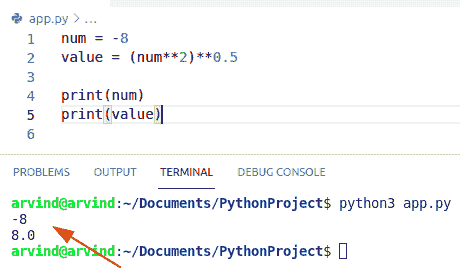

Python numpy absolute value without function

阅读 [Python NumPy Sum +示例](https://pythonguides.com/python-numpy-sum/)

## Python numpy 绝对值元组

*   在这个方法中，我们将学习和讨论 numpy 绝对值元组。
*   在这个方法中，我们可以很容易地使用函数 np.absolute()来获得正值元组。
*   如果我们应用 numpy 绝对值，它将定义数组中每个值的绝对值。
*   它用于在单个变量中包含多个对象。
*   除非列表和元组使用左括号，否则不能更改此方法，而列表使用方括号。

**举例:**

```py
import numpy as np
tup = ([1,-2,-3,-4,-5])
res = np.absolute(tup)
print(res)
```

下面是以下代码的截图

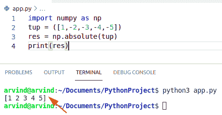

Python numpy absolute value tuple

阅读 [Python Numpy 阶乘](https://pythonguides.com/python-numpy-factorial/)

## Python numpy 绝对值熊猫

*   用这种方法，我们将学习和讨论熊猫的数量。
*   在这种方法中，我们可以使用 pandas 软件包进行绝对值分析。
*   Dataframe.abs()是使用 pandas dataframe 函数的最简单的方法之一。它总是返回具有正值的项，并且仅适用于全是数值的项。
*   该函数将返回给定表达式的指定数目的正绝对值。
*   为了理解 np.abs()方法，我们将求解示例并获得数据帧的绝对值。
*   为了找到正值，我们还需要在数据帧中有负值。

**语法:**

```py
Dataframe.abs()
```

*   此方法仅适用于全是数字的值。
*   它将返回包含每个元素的正值的序列。

**举例:**

```py
import pandas as pd
a = pd.Series([1,14,-19,-15,6])
res = a.abs()
print(res)
```

下面是以下代码的截图

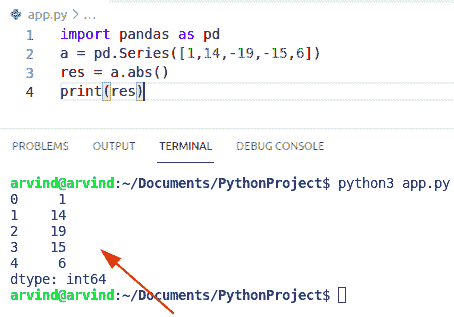

Python numpy absolute value pandas

阅读: [Python NumPy arange +示例](https://pythonguides.com/python-numpy-arange/)

## Python numpy 绝对值复数

*   在这个方法中，我们将学习和讨论 Python 中的 numpy 绝对值复数。
*   在 Python 中，可以使用赋值语句声明复数。
*   当我们使用两个实数时，通常使用复数。
*   在这个方法中，我们可以很容易地使用 numpy.abs()函数来获得正值。
*   对于复数，numpy.abs()函数仅返回幅度部分。
*   复数的正值是作为复平面中各点之间的距离产生的。
*   为了理解 numpy.abs()方法，我们将求解示例并获得复数的绝对值。

**语法:**

```py
numpy.abs
         (
          arr,
          out=None,
          where=True,
          casting='same_kind',
          dtype=None
          )
```

**举例:**

```py
import numpy as np
compl = ([2+3j,2-4j,-4-5j])
res = np.abs(compl)
print(res)
```

下面是以下代码的截图

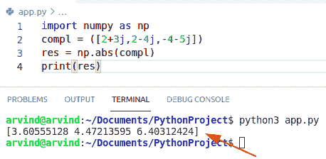

Python numpy absolute value complex number

传统上检查 numpy 绝对值复数的另一种方法。

**举例:**

```py
x=complex(input("Enter complex number in form a+bj: "))

import cmath
y=cmath.sqrt((x.real)`2+(x.imag)`2)

print("The modulus of ",x," is", y.real)
```

下面是以下代码的截图

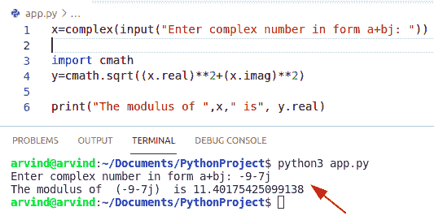

Python numpy absolute value complex number alternative method

阅读: [Python NumPy append + 9 示例](https://pythonguides.com/python-numpy-append/)

## Python numpy 元素级绝对值

*   在这个方法中，我们将学习和讨论 Python 中 numpy 元素的正值。
*   为了找到 numpy 数组的元素绝对值，我们使用 numpy.absolute()函数。
*   这是一个统计函数，帮助用户计算数组中每个元素的绝对值。
*   简单地说，Numpy 正值计算数组中值的绝对值。
*   我们在一个数组中有一些数字，一些是负数，一些是正数，输出将以正数的形式返回。

**语法:**

```py
numpy.absolute
              (
               arr,
               out=None,
               where=True,
               casting='same_kind',
               dtype=None
              )
```

**举例:**

```py
import numpy as np

arr1 = np.array([[4, -5, 6],
                  [-1, 2, -9]])

# find element-wise
# absolute value
result = np.absolute(arr1)
print(result)
```

下面是以下代码的截图

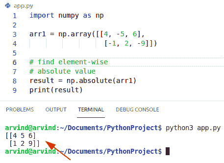

Python numpy element-wise absolute value

检查 numpy 元素绝对值的另一种方法

*   在这个方法中，我们必须使用函数 numpy.fabs()。
*   它用于按元素生成绝对值。
*   它将总是以正的幅度返回正值。
*   它总是返回浮点十进制数据类型的数字。

**语法:**

下面是 numpy fabs()的语法

```py
numpy.fabs
         (
          arr,
          out=None,
          where=True,
          casting='same_kind',
          dtype=None
          )
```

**举例:**

```py
import numpy as np

arr1 = np.array([[3, -4, 6],
                  [-1, 2, -9]])

# find element-wise
# absolute value
result = np.fabs(arr1)
print(result)
```

下面是以下代码的截图

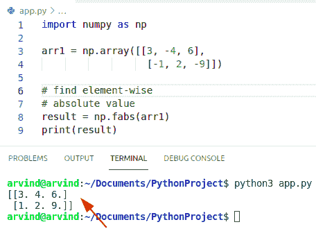

Python numpy element-wise absolute value fabs method

阅读: [Python NumPy 矩阵](https://pythonguides.com/python-numpy-matrix/)

## Python numpy 绝对值差

*   在这个方法中，我们将学习讨论 Python numpy 绝对值差。
*   在这个方法中，我们必须使用函数 numpy.absolute()。
*   如果您想要数组之间的绝对元素差异，您可以很容易地用 numpy 减去它们，并使用 numpy.absolute()函数。
*   在这个例子中，首先，我们将导入一个 numpy 库并创建两个矩阵。
*   取一个变量，赋一个 numpy 绝对函数，并显示结果。

**语法:**

```py
numpy.absolute
              (
               arr,
               out=None,
               where=True,
               casting='same_kind',
               dtype=None
              )
```

**举例:**

```py
import numpy as np

X = [[-4,-6,3],
[4 ,-5,7],
[3 ,-8,7]]

Y = [[4,2,-1],
[6,-9,-3],
[4,-5,9]]

result = np.absolute(np.array(X) - np.array(Y))
print(result)
```

下面是以下代码的截图

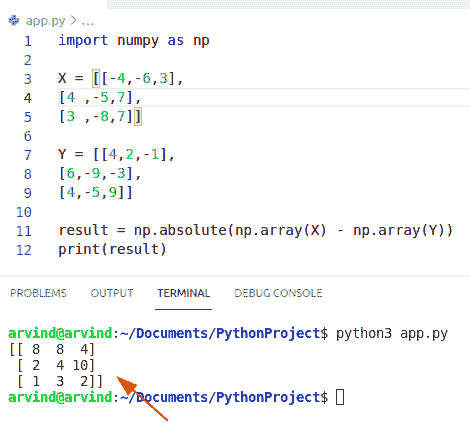

Python numpy absolute value difference

检查 **numpy 绝对值差**的替代方法

**举例:**

```py
import numpy as np

X = [[-4,-6,3],
[4 ,-5,7],
[3 ,-8,7]]

Y = [[4,2,-1],
[6,-9,-3],
[4,-5,9]]
result = [[abs(a-b) for a, b in zip(xrow, yrow)]
          for xrow, yrow in zip(X,Y)]
print(result)
```

下面是以下代码的截图

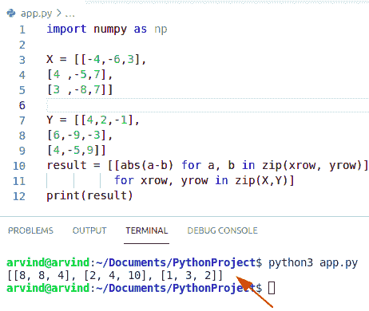

Python numpy absolute value difference abs

读: [Python NumPy argsort](https://pythonguides.com/python-numpy-argsort/)

## Python 熊猫中列的 numpy 绝对值

*   在这一节中，我们将讨论 pandas 中列的 numpy 绝对值。
*   我们将看到如何获得熊猫数据帧中一列的绝对值。以及熊猫中数列的绝对值。
*   首先，我们将创建一个 dataframe 模块并赋值。

**举例:**

```py
import pandas as pd
a = pd.Series([2,6,-29,-15,6])
res = a.abs()
print(res)
```

下面是以下代码的截图

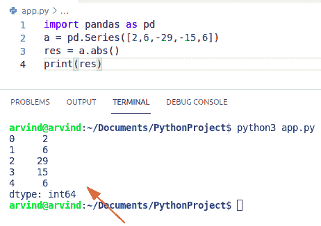

Python numpy absolute value of a column in pandas

您可能会喜欢以下 python 教程:

*   [Python NumPy square](https://pythonguides.com/python-numpy-square/)
*   [Python NumPy 索引](https://pythonguides.com/python-numpy-indexing/)
*   [Python NumPy to list](https://pythonguides.com/python-numpy-to-list/)
*   [Python NumPy 规格化](https://pythonguides.com/python-numpy-normalize/)
*   [Python NumPy 读取 CSV](https://pythonguides.com/python-numpy-read-csv/)

在本 Python 教程中，我们将讨论 **Python NumPy 绝对值**，并涵盖以下示例:

*   Python numpy 绝对值和
*   Python numpy 绝对值排序
*   没有函数的 Python numpy 绝对值
*   Python numpy 绝对值元组
*   Python numpy 绝对值熊猫
*   Python numpy 绝对值复数
*   Python numpy 元素的绝对值
*   Python numpy 绝对值差
*   熊猫中列的 Python numpy 绝对值

[Bijay Kumar](https://pythonguides.com/author/fewlines4biju/)

Python 是美国最流行的语言之一。我从事 Python 工作已经有很长时间了，我在与 Tkinter、Pandas、NumPy、Turtle、Django、Matplotlib、Tensorflow、Scipy、Scikit-Learn 等各种库合作方面拥有专业知识。我有与美国、加拿大、英国、澳大利亚、新西兰等国家的各种客户合作的经验。查看我的个人资料。

[enjoysharepoint.com/](https://enjoysharepoint.com/)[](https://www.facebook.com/fewlines4biju "Facebook")[](https://www.linkedin.com/in/fewlines4biju/ "Linkedin")[](https://twitter.com/fewlines4biju "Twitter")