# Python NumPy 添加教程

> 原文：<https://pythonguides.com/python-numpy-add/>

[](https://sharepointsky.teachable.com/p/python-and-machine-learning-training-course)

在这个 [Python 教程](https://pythonguides.com/python-hello-world-program/)中，我们将学习**如何在** Python 中添加 NumPy 数组。通过 **Python NumPy 添加函数**，我们将涵盖这些主题。

*   Python numpy 向数组添加元素
*   Python numpy 向数组添加列
*   Python numpy 添加维度
*   Python numpy 添加两个数组
*   Python numpy 向数组添加行
*   Python numpy 添加多个数组
*   Python numpy 向列表添加元素
*   Python numpy 追加不起作用
*   Python numpy 数组在开头添加元素
*   Python np.add.reduce
*   Python numpy 平方和
*   Python np.add.at
*   python NP . save txt append(python NP . save txt 附录)
*   Python 将 numpy 数组添加到字典中
*   Python 将 numpy 数组添加到数据帧中
*   Python numpy 添加高斯噪声

如果您是 NumPy 的新手，请查看 [Python Numpy](https://pythonguides.com/numpy/) 以了解如何使用 Python Numpy。

目录

[](#)

*   [Python numpy add](#Python_numpy_add "Python numpy add")
*   [Python numpy 向数组添加元素](#Python_numpy_add_element_to_array "Python numpy add element to array")
*   [Python numpy 向数组添加列](#Python_numpy_add_column_to_array "Python numpy add column to array")
*   [Python numpy 添加维度](#Python_numpy_add_dimension "Python numpy add dimension")
*   [Python numpy 添加两个数组](#Python_numpy_add_two_arrays "Python numpy add two arrays")
*   [Python numpy 向数组添加行](#Python_numpy_add_row_to_array "Python numpy add row to array")
*   [Python numpy 添加多个数组](#Python_numpy_add_multiple_arrays "Python numpy add multiple arrays ")
*   [Python numpy 向列表添加元素](#Python_numpy_add_element_to_list "Python numpy add element to list")
*   [Python numpy 数组在开头添加元素](#Python_numpy_array_add_element_at_beginning "Python numpy array add element at beginning")
*   [Python np.add.reduce](#Python_npaddreduce "Python np.add.reduce")
*   [Python numpy 平方和](#Python_numpy_sum_of_squares "Python numpy sum of squares")
*   [Python np.add.at](#Python_npaddat "Python np.add.at")
*   [Python np.savetxt 追加](#Python_npsavetxt_append "Python np.savetxt append")
*   [Python 向字典添加 numpy 数组](#Python_add_numpy_array_to_dictionary "Python add numpy array to dictionary")
*   [Python 向数据帧添加 numpy 数组](#Python_add_numpy_array_to_dataframe "Python add numpy array to dataframe")
*   [Python numpy 添加高斯噪声](#Python_numpy_add_gaussian_noise "Python numpy add gaussian noise")

## Python numpy add

*   在本节中，我们将讨论如何使用 Python 中的 `numpy.add()` 函数在 numpy 数组中添加元素。
*   在 Python 中， `numpy.add()` 函数用于将 numpy 数组中的值或元素相加。如果两个 numpy 数组的形状不同，它将检查该条件，然后这些形状必须可扩展为一个公共形状。
*   在这个函数中，我们需要相同大小的数组，具有相同数量的行和列。如果我们要在 `numpy.add()` 函数中使用同样大小的数组，那么第二个数组元素与第一个数组元素相加要容易得多。

**语法:**

让我们看一下语法并理解 python `numpy.add()` 函数的工作原理

```py
numpy.add
         (
          x1,
          x2,
           /,
          out=None,
          *,
          where=True,
          casting='same_kind',
          order='K',
          dtype=None,
          subok=True
          )
```

*   它由几个参数组成
    *   **x1，x2:** 该参数表示第一个和第二个输入数组，这些输入是我们在 `numpy.add()` 函数中使用的 numpy 数组，如果形状数组不同，则默认情况下它们必须是可广播的。
    *   **out:** 该参数指定了 `np.add()` 函数的输出，该函数包含 numpy 数组的值的项和。
    *   **dtype:** 这是一个可选参数，默认情况下，它不取值。
    *   **Return:**`x1`和 `x2` 的逐元素相加。

**举例:**

让我们举一个例子，了解如何使用 Python 中的 numpy.add()函数在 numpy 数组中添加元素

**源代码:**

```py
import numpy as np

array1=np.array([13,23,45,67])
array2=np.array([43,12,15,17])
result= np.add(array1,array2)
print("add elements:",result)
```

在上面的代码中， `numpy.add()` 函数将**‘数组 1’**的元素添加到另一个 numpy 数组**‘数组 2’**中。一旦您将打印**‘result’**，那么输出将在一个数组中显示添加的元素。

下面是以下代码的截图

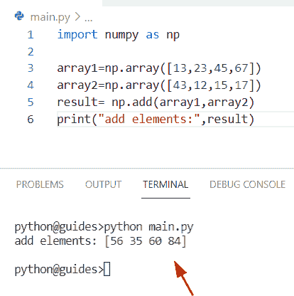

Python numpy add

另外，检查: [Python NumPy Divide](https://pythonguides.com/python-numpy-divide/)

## Python numpy 向数组添加元素

*   让我们看看如何在 python 中向 numpy 数组添加一个柠檬。
*   为了执行这个特定的任务，我们将使用 `np.insert()` 函数。在 Python 中, `numpy.insert()` 函数用于在数组中沿着轴插入元素。如果未定义轴，则默认情况下，数组是扁平的。
*   这个方法在 NumPy 包模块中可用，我们将在给定的索引之前插入元素。执行此操作有几个参数。

**语法:**

下面是 numpy.insert()函数的语法

```py
numpy.insert
            (
             arr,
             obj,
             values,
             axis=None
            )
```

*   它由几个参数组成
    *   **arr:** 该参数表示需要执行操作并插入值的 numpy 数组。
    *   **obj:** 指定索引，可以是整数值。
    *   **值:**数组中要插入的值。
    *   **axis:** 这是一个可选参数，默认情况下，它不取值，帮助我们在特定的给定轴上添加值。

**举例:**

让我们举一个例子来理解 Python 中 numpy.insert()函数的工作原理

**源代码:**

```py
import numpy as np

new_arr=np.array([[15,17,13],
                  [23,26,28]])
result=np.insert(new_arr,2,78)
print("Add new element to array:",result)
```

在上面的代码中，我们导入了 numpy 库，然后通过使用 `np.array()` 函数定义了 numpy 数组。在使用 `numpy.insert()` 函数时，我们已经插入了数组名**‘new _ arr’**和索引号**‘2’**，它们表示需要插入的值，而**‘78’**表示需要插入的值。

下面是以下给定代码的执行过程

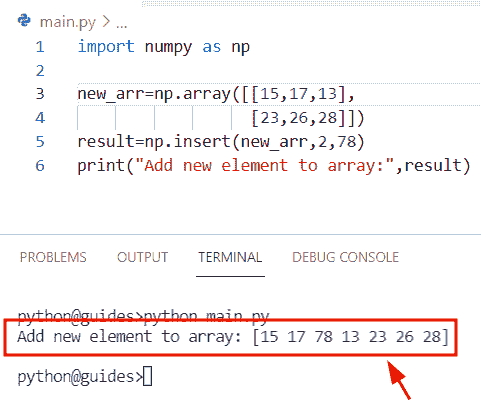

Python numpy add an element to array

阅读: [Python NumPy diff](https://pythonguides.com/python-numpy-diff/)

## Python numpy 向数组添加列

*   在这个程序中，我们将学习如何使用 Python `numpy.insert()` 函数在 NumPy 数组中添加新列。
*   通过使用 `numpy.insert()` 函数，我们可以轻松地执行这个特定的任务，并在数组中添加新列。首先，我们将导入一个 numpy 库，然后使用 `np.array()` 函数初始化一个数组。
*   之后，我们声明了一个变量‘add _ col ’,它代表了我们想要添加到数组中的元素。
*   现在使用 `numpy.insert()` 函数，并将轴、数组和索引号指定为参数。一旦您将打印**‘new _ output’**，那么输出将显示给定数组中新添加的列元素。

**语法:**

下面是 Python `numpy.insert()` 函数的语法

```py
numpy.insert
            (
             arr,
             obj,
             values,
             axis=None
            )
```

**举例:**

让我们举一个例子，看看如何在 Numpy 数组 Python 中添加新列

**源代码:**

```py
import numpy as np

new_values=np.array([[47,89,897],
                  [156,267,345]])
add_col=[12,67]
new_output=np.insert(new_values,2,add_col,axis=1)
print("Add new column to array:",new_output)
```

下面是以下给定代码的实现

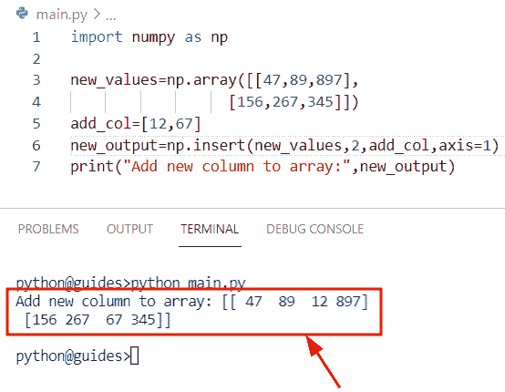

Python numpy add a column to array

我们还可以使用 numpy.append()函数在数组中添加一个新列。但是我们已经在 [Python numpy append()](https://pythonguides.com/python-numpy-append/) 的帖子中讨论了这个话题。您可以在 Python numpy append column 主题中轻松查看解决方案。

## Python numpy 添加维度

*   在本节中，我们将讨论如何在 Python Numpy 数组中添加维度。
*   为了完成这个任务，我们将使用 `numpy.expand_dims()` 函数。在 Python 中，该函数用于在 numpy 数组中添加新的维度，或者我们可以说它将通过在该函数中添加新的轴来扩展数组。
*   该方法在 numpy 模块包中可用，它采用两个参数来扩展数组形状，并返回一个具有额外维度的新数组。

**语法:**

让我们看一下语法并理解 numpy.expand_dims()函数的工作原理

```py
numpy.expand
            (
             a,
             axis
            )
```

*   它由几个参数组成:
    *   **a:** 该参数表示输入数组
    *   **轴:**该参数表示要添加轴的位置

**举例:**

让我们举一个例子，看看如何在 NumPy 数组 Python 中添加维度

**源代码:**

```py
import numpy as np

new_arr = np.array([15,17,29,17,18])
print("One-dimensional array shape:",new_arr.shape)
result = np.expand_dims(new_arr, axis = 0)
print("Added new dimension:",result.shape) 
```

在上面的代码中，我们导入了 numpy 库，然后使用 `np.array()` 函数创建了一个数组。之后，我们应用了 `np.expand_dims()` 函数，在这个函数中，我们将轴指定为一个参数。

你可以参考下面的截图

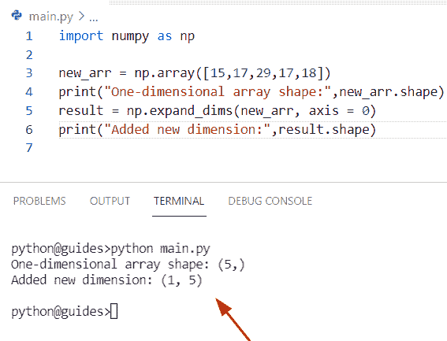

Python numpy add dimension

正如您在屏幕截图中看到的，输出显示了新的维度。

读: [Python NumPy argsort](https://pythonguides.com/python-numpy-argsort/)

## Python numpy 添加两个数组

*   在这一节中，我们将讨论如何在 Python 中添加两个 NumPy 数组。
*   通过使用 numpy.add()函数，我们可以很容易地解决这个问题，得到两个数组相加的解。在 Python 中， `numpy.add()` 函数用于将 numpy 数组中的值或元素相加。
*   这个方法将帮助用户将第一个数组元素与第二个数组元素相加，并返回一个新的数组。

**语法:**

下面是 Python `numpy.add()` 函数的语法

```py
numpy.add
         (
          x1,
          x2,
           /,
          out=None,
          *,
          where=True,
          casting='same_kind',
          order='K',
          dtype=None,
          subok=True
          )
```

**举例:**

```py
import numpy as np

new_arr1=np.array([78,189,219,456])
new_arr2=np.array([43,58,932,178])
new_result= np.add(new_arr1,new_arr2)
print("adding two arrays:",new_result)
```

在上面的代码中，我们使用了 `numpy.add()` 函数，并将数组指定为一个参数。一旦您将打印**‘结果’**，那么输出将显示一个数组中新添加的元素。

下面是下面给出的代码的截图。

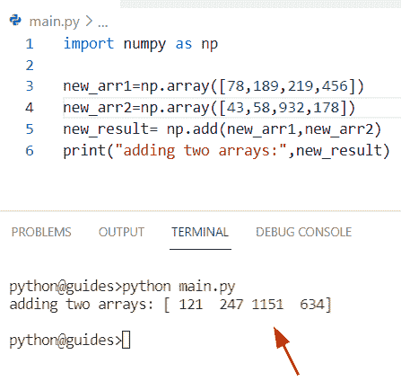

Python numpy add two arrays

阅读: [Python NumPy 索引](https://pythonguides.com/python-numpy-indexing/)

## Python numpy 向数组添加行

*   在本节中，我们将讨论如何在 Python numpy 数组中添加一行。
*   为了完成这项任务，我们将应用 `np.vstack()` 方法在现有数组中添加新行。在 Python 中，该函数用于按行添加输入数组序列，并使它们成为一维数组。
*   该方法在 NumPy 包模块中可用，并且总是返回堆叠给定数组的数组。

**语法:**

让我们看一下语法并理解 `numpy.vstack()` 函数的工作原理

```py
numpy.vstack
            (
             tup
            )
```

注意:它只包含一个代表输入数组的参数**‘tup’**。

**举例:**

让我们举一个例子，看看如何使用 `np.vstack()` 函数在 Python NumPy 数组中添加一行

**源代码:**

```py
import numpy as np

new_array = np.array([[23,27,29],[67,34,98]])
add_row = np.array([45,94,117])
result = np.vstack([new_array,add_row])
print("Adding new row:",result)
```

在上面的程序中，我们垂直添加了一个数组。首先我们导入 numpy 库，然后使用函数 `np.array()` 初始化一个数组。之后，通过 `np.vstack()` 函数我们在其中添加了一维数组**‘add _ row’**。一旦打印出**‘result’**，输出将显示新的数组元素。

下面是以下给定代码的实现

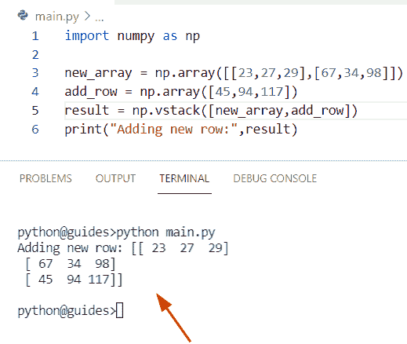

Python numpy add row to array

阅读: [Python Numpy 未找到–如何修复](https://pythonguides.com/python-numpy-not-found/)

## Python numpy 添加多个数组

*   在这个程序中，我们将讨论如何在 Python 中添加多个 NumPy 数组。
*   通过使用 `np.vstack()` 函数，我们可以轻松地执行这个特定的任务，并在 Python 中添加多个数组。
*   在 Python 中， `np.stack()` 用于在数组中按行添加新元素。例如，假设我们有一个包含整数值的列表。现在我们必须将这些列表添加到 `np.vstack()` 函数中，它将返回 numpy 数组。

**举例:**

让我们举一个例子，看看如何在 Python 中添加多个数组

**源代码:**

```py
import numpy as np

new_arr1 = [15, 78, 92]
new_arr2 = [167, 897, 923]
new_arr3 = [423, 107, 289]
new_result = (new_arr1, new_arr2, new_arr3)
d = np.vstack(new_result)
print("adding multiple arrays:",d)
```

你可以参考下面的截图

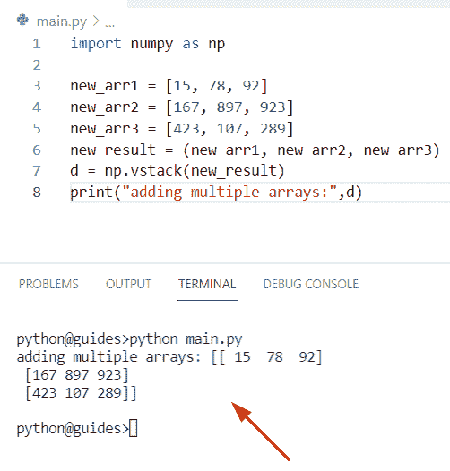

Python numpy add multiple arrays

阅读: [Python NumPy 删除](https://pythonguides.com/python-numpy-delete/)

## Python numpy 向列表添加元素

*   在这个程序中，我们将讨论如何在 Python 中向列表添加元素。
*   为了执行这个特定的任务，我们将使用 `append()` 函数在列表中添加新元素。此方法只接受一个参数，不返回值。
*   该方法在 Python 模块包中可用，它不创建任何新列表。它只修改原始列表。例如，假设我们有一个只包含国家名称字符串的列表。现在我们想更新这个列表，并添加一些新的国家名称。为此，我们将应用 `list.append()` 函数。

**语法:**

下面是 `list.append()` 函数的语法

```py
list.append
           (
            item
           )
```

让我们看一下这个例子，理解一下 `list.append()` 函数的工作原理

**源代码:**

```py
Country_name = ["France", "Japan","Russia"]

Country_name.append("China")
print("Added new element in list:",Country_name)
```

下面是以下给定代码的执行过程

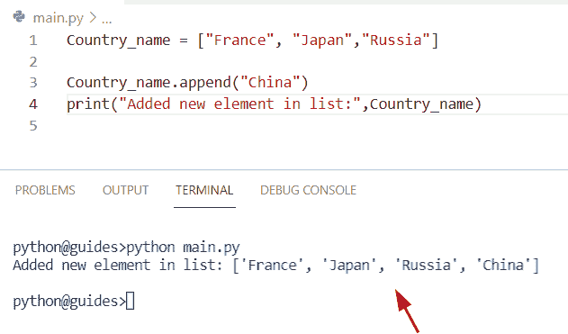

Python numpy add an element to list

另外，查看: [Python NumPy 最小教程](https://pythonguides.com/python-numpy-minimum/)

## Python numpy 数组在开头添加元素

*   在本节中，我们将讨论如何在 NumPy 数组 Python 的开头添加元素。
*   为了完成这项任务，我们将使用 `numpy.insert()` 函数在数组的开头添加元素。在 Python 中, `numpy.insert()` 函数用于在数组中沿着轴插入元素。如果未定义轴，则默认情况下，数组是扁平的。
*   在这个例子中，我们通过使用 `np.array()` 函数创建了一个简单的数组。之后，我们声明了一个变量**‘new _ output’**，并赋了一个 `nu` mpy.insert()函数。在这个函数中，我们传递了一个数组和索引号**‘0’**作为参数。

**举例:**

```py
import numpy as np

new_values=np.array([[156,278,945,178,923,190]])
new_output=np.insert(new_values,0,78)
print("Add new element at beginning:",new_output)
```

你可以参考下面的截图

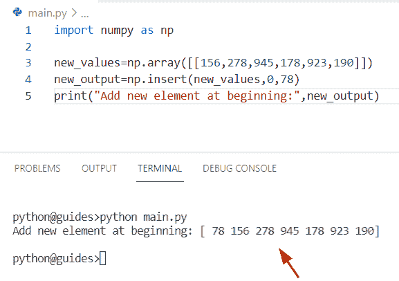

Python numpy array add element at beginning

正如您在屏幕截图中看到的，输出显示了位于数组开头的元素。

阅读: [Python NumPy 栈](https://pythonguides.com/python-numpy-stack/)

## Python np.add.reduce

*   在本节中，我们将讨论如何在 Python 中使用 `np.add.reduce()` 函数。
*   在 Python 中，该函数用于通过应用加、乘、减、除等通用函数进行归约，用 unfunc.reduce 表示。
*   在这个程序中，我们必须减少数组的维数并产生一组标量作为输出。
*   在这个方法中， `np.add()` 函数接受两个参数并返回一个输出参数。

**语法:**

下面是 Python`numpy . ufunc . reduce(`)函数的语法

```py
ufunc.reduce
            (
             array,
             axis=0,
             dtype=None,
             out=None,
             keepdims=False,
             initial=<no value>,
             where=True
            )
```

*   它由几个参数组成
    *   **数组:**这个参数表示我们要处理的数组。
    *   **轴:**默认情况下，它采用代表 numpy 数组第一维缩减的**‘0’**值。如果该参数不取值，则在所有轴上执行缩减。
    *   **dtype:** 此类型代表中间结果。
    *   **Out:** 这是一个可选参数，它采用 none 值来表示存储结果的位置。如果没有提供任何值，则返回新分配的数组。
    *   **keepdims:** 这也是一个可选参数，默认设置为**【false】**，被缩减的尺寸在结果中是正确的尺寸。

**举例:**

我们举个例子，了解一下 `numpy.ufunc.reduce()` 函数的工作原理。在本例中，我们将使用 add universal 函数

**源代码:**

```py
import numpy as np

new_arr=np.array([[2,3],
                [14,27],
                [56,78]])
print("Creation of array:",new_arr)
result1=np.add.reduce(new_arr, 0)
result2=np.add.reduce(new_arr,1)
print("Reduction of array along axis=0:",result1)
print("Reduction of array along axis=1:",result2)
```

在上面的程序中，我们使用 np.array()函数创建了一个数组。之后，我们声明了一个变量**‘结果 1’**和**结果 2’。**现在我们已经分配了 `np.add.reduce()` 通用函数，在这个函数中，我们分配了数组和**轴=0，1** 。一旦您将打印**‘结果 1’**和**‘结果 2’**，输出将根据条件显示简化的数组。

下面是以下给定代码的实现

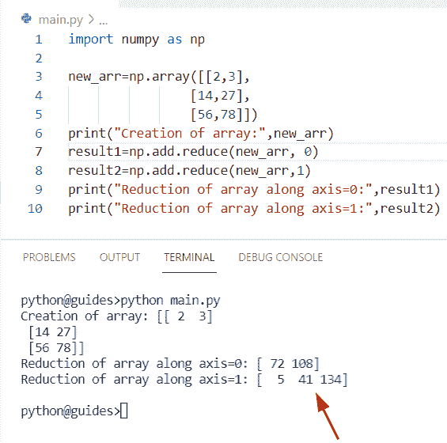

Python np add reduce

阅读: [Python Numpy 阶乘](https://pythonguides.com/python-numpy-factorial/)

## Python numpy 平方和

*   在本期节目中，我们将学习如何在 NumPy Python 中求平方和。
*   在这个程序中，我们必须得到元素的平方，然后将它们相加。为了完成这个任务，我们将使用 `np.sum()` 函数。在 Python 中，该函数用于对给定轴上的所有元素求和。
*   这个方法在 numpy 包模块中可用，它将指定数组的每一行和每一列。
*   要获得关于这个主题的详细信息，你可以参考我们的文章 [Python NumPy Sum](https://pythonguides.com/python-numpy-sum/)

**源代码:**

```py
import numpy as np

new_arr=np.array([[16,29],
                [78,18],
                [25,36]])
result = np.sum(new_arr**2,axis=0)
print("Column-wise sum of square elements:",result)
```

在上面的程序中，我们使用了 np.sum()函数，在该函数中，我们将数组和轴一起作为参数。现在我们已经使用了代表所有元素平方的 `new_arr`2** 方法

你可以参考下面的截图

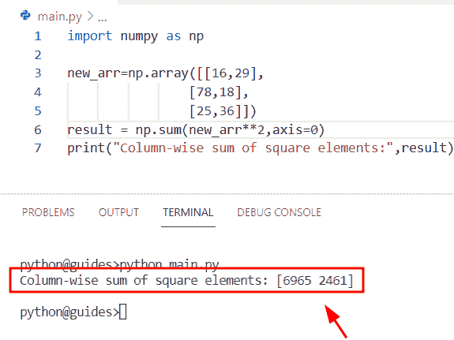

Python numpy sum of squares

正如您在屏幕截图中看到的，输出显示 sum 的平方[6965 2461]。

阅读: [Python NumPy round](https://pythonguides.com/python-numpy-round/)

## Python np.add.at

*   这里我们可以看到如何在 Python 中使用 numpy.add.at()函数。在这个例子中，我曾经为 numpy 数组提供了一个索引，对于加法 ufunc，这个函数相当于**a【indexes】+= b**。
*   该方法在 numpy 包模块中可用，并且该方法将仅递增第一个值，其原因是缓冲。

**语法:**

让我们看一下语法并理解 np.ufunc.at()函数的工作原理

```py
ufunc.at
        (
         a,
         indices,
         b=None,
          /
        )
```

*   它由几个参数组成
    *   **a:** 该参数表示执行某种操作的输入数组。
    *   **索引:**索引可以是像切片对象一样的 numpy 数组的元组。

**举例:**

```py
import numpy as np

new_array1 = np.array([17, 21, 67, 98])
new_array2 = np.array([21, 67])
np.add.at(new_array1, [0, 1], new_array2)
print(new_array1)
```

在上面的代码中，我们导入了 numpy 库，然后使用 `np.array()` 函数创建了一个数组。现在我们的任务是将最后的 `2` 元素与前 2 个元素相加。为了完成这个任务，我们使用了 `np.add.at()` 函数。

在这个函数中，我们设置了数组和索引号，它代表了我们想要在数组中增加的元素。

下面是以下给定代码的实现

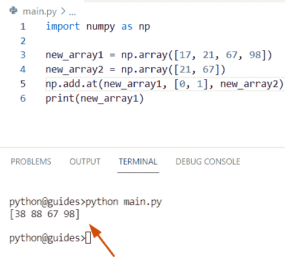

Python np add at

阅读: [Python Numpy unique](https://pythonguides.com/python-numpy-unique/)

## Python np.savetxt 追加

*   在本节中，我们将讨论如何在 Python 中使用 `np.savetxt()` 函数。
*   通过使用 np.savetxt，我们可以很容易地追加输入数组。在 Python 中， `numpy.savetxt()` 函数用于将 numpy 数组保存到一个 CSV 或文本文件中，并使用不同的分隔符。
*   这个方法在 NumPy 模块包中可用，它有两个参数，即需要保存在 CSV 文件中的文件名和数组名。

**语法:**

下面是 numpy.savetxt()函数的语法

```py
numpy.savetxt
             (
              fname,
              X,
              fmt='%.18e',
              delimiter= ' ',
              newline='\n',
              header= ' ',
              footer= ' ',
              comments='#',
              encoding=None
             )
```

*   它由几个参数组成
    *   **fname:** 该参数表示最终名称，文件名以. gz 结尾。
    *   **X:** 用于在文本或 CSV 文件中包含数组数据。
    *   **fmt:** 默认取 **'%.18e'** 值，表示格式的顺序或多格式字符串。
    *   **分隔符:**该参数表示分隔列**'，'。**可选参数。
    *   **newline:** 用于换行。
    *   **头:**这个参数会写在文件的开头。
    *   **页脚:**该参数将被写在文件的末尾。

**举例:**

让我们举个例子，了解一下 `numpy.savetxt()` 函数的工作原理

**源代码:**

```py
import numpy as np        

m=open('final.csv','a')
new_arr1 = np.array([15, 16, 19])
new_arr2 = np.array([21, 28, 31])
new_arr3 = np.array([67, 56, 87])
np.savetxt(m, new_arr1,  delimiter=", ",fmt='%d')
m.write("\n")
np.savetxt(m, new_arr2,  delimiter=", ",fmt='%d')
m.write("\n")
np.savetxt('final.csv', new_arr3,  delimiter=", ", fmt='%d')
m.write("\n")
m.close()
```

下面是以下给定代码的执行过程

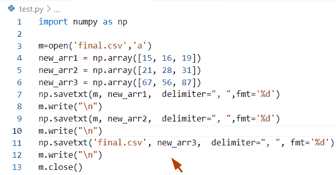

Python np savetxt append

CSV 屏幕快照文件

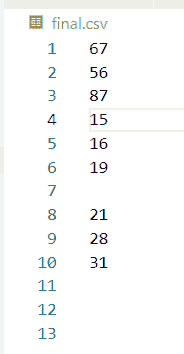

Python np savetxt append CSV

阅读: [Python NumPy 数据类型](https://pythonguides.com/python-numpy-data-types/)

## Python 向字典添加 numpy 数组

*   在这个程序中，我们将讨论如何在 Python 中向字典添加一个 numpy 数组。
*   为了执行这个特定的任务，我们将使用 `zip()` 函数的概念。在 Python 中，这个函数用于组合给定的可重复项，如列表和数组。

**语法:**

下面是 Python 字典 `zip()` 函数的语法

```py
zip(*iterable)
```

**举例:**

```py
import numpy as np

new_array1 = np.array([67, 145, 28, 190])
new_array2 = np.array([93,89,43,109])
result= dict(zip(new_array1,new_array2))
print("Added numpy values to dictionary:",result)
```

在上面的例子中，我们通过使用 **np.array()函数**定义了两个 numpy 数组，我们需要将这些数组添加到字典中。第一个数组将被视为字典的键，第二个数组项将被视为值。之后，我们声明了一个变量**‘结果’**，并分配了用于返回迭代器的 `zip()` 函数。

下面是以下代码的截图

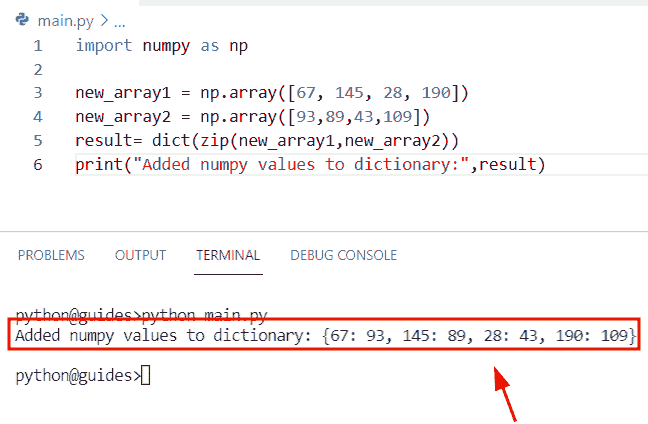

Python add numpy array to a dictionary

阅读: [Python NumPy 2d 数组](https://pythonguides.com/python-numpy-2d-array/)

## Python 向数据帧添加 numpy 数组

*   这里我们可以看到如何在 Python Pandas 数据帧中添加 numpy 数组。
*   在这个例子中，我们将使用 `np.array()` 函数来创建一个数组，然后创建一个列表**‘new _ indexes’**来表示索引号。
*   现在使用 `pd.dataframe()` 函数将数组添加到数据帧中。在 Python Pandas 中，数据帧是二维的，并且是表格形式(行和列)。

**语法:**

让我们看一下语法并理解 Pandas.dataframe()方法的工作原理

```py
pandas.dataframe
                (
                 data=None,
                 index=None,
                 columns=None,
                 dtype=None,
                 copy=None
                )
```

*   它由几个参数组成
    *   **数据:**该参数表示数组、列表、字典等不同的数据形式。
    *   **index:** 默认为可选参数，用于结果。
    *   **dtype:** 该参数代表每一列的数据类型。

**举例:**

```py
import pandas as pd
import numpy as np

new_arr = np.array([['George', 178], ['John', 456],
				['William', 34], ['Smith', 16],['Peter',78]])

new_indices = [2,3,4,5,6]

new_output = pd.DataFrame(data = new_arr,
				index = new_indices,
				)
print(new_output)
```

在上面的代码中，我们导入了 numpy 和 pandas 库，然后初始化了一个数组。现在通过使用 `pd.dataframe()` 函数，我们可以很容易地在 dataframe 中添加 numpy 数组。

下面是以下给定代码的输出

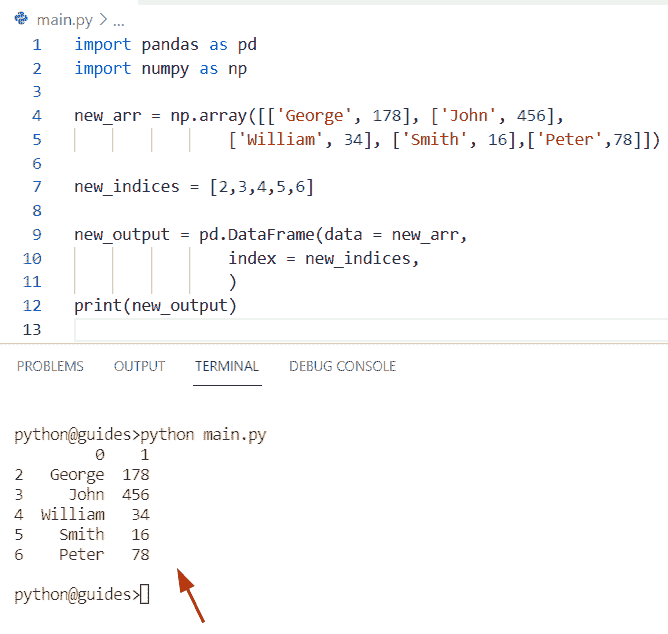

Python add numpy array to dataframe

阅读: [Python NumPy 3d 数组](https://pythonguides.com/python-numpy-3d-array/)

## Python numpy 添加高斯噪声

*   在本节中，我们将讨论如何在 NumPy 数组 Python 中添加高斯噪声。
*   为了执行这个特定的任务，我们将使用 `np.random.normal()` 函数并向其传递整数值。本例中**‘1’**表示正态分布从开始，**‘2’**表示标准差。

**语法:**

下面是 `numpy.random.normal()` 函数的语法

```py
random.normal
             (
              loc=0.0,
              scale=1.0,
              size=None
             )
```

**举例:**

```py
import numpy as np

new_array = np.random.normal(1,2,50)
print("Adding gaussian noise:",new_array)
```

下面是以下给定代码的实现

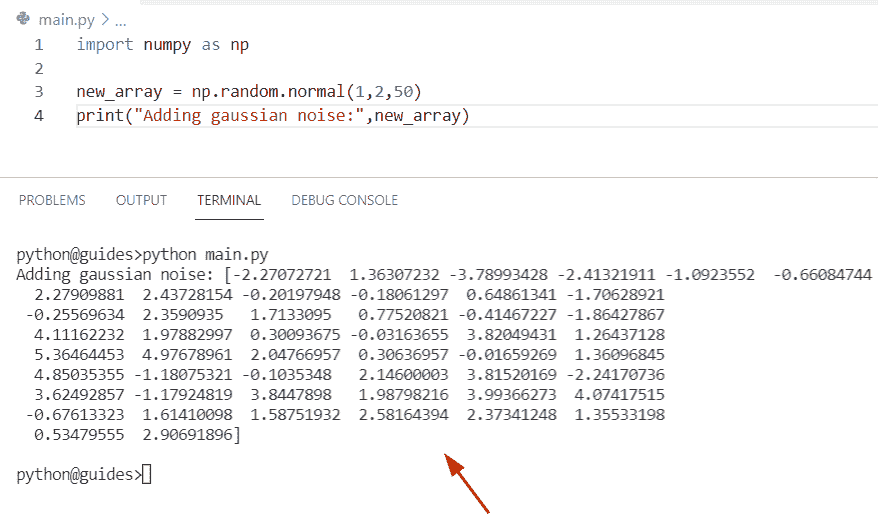

Python numpy add gaussian noise

您可能还想阅读以下关于 Python Numpy 的教程。

*   [Python NumPy Split + 11 示例](https://pythonguides.com/python-numpy-split/)
*   [Python NumPy Savetxt +示例](https://pythonguides.com/python-numpy-savetxt/)
*   [Python NumPy Normalize +示例](https://pythonguides.com/python-numpy-normalize/)
*   [Python NumPy max 带示例](https://pythonguides.com/python-numpy-max-with-examples/)
*   [Python NumPy 矩阵乘法](https://pythonguides.com/python-numpy-matrix-multiplication/)

在这篇 Python 教程中，我们学习了如何在 Python 中添加 NumPy 数组。通过 **Python NumPy add 函数**，我们将涵盖这些主题。

*   Python numpy 向数组添加元素
*   Python numpy 向数组添加列
*   Python numpy 添加维度
*   Python numpy 添加两个数组
*   Python numpy 向数组添加行
*   Python numpy 添加多个数组
*   Python numpy 向列表添加元素
*   Python numpy sum 其中
*   Python numpy 追加不起作用
*   Python numpy 数组在开头添加元素
*   Python np.add.reduce
*   Python numpy 平方和
*   Python np.add.at
*   python NP . save txt append(python NP . save txt 附录)
*   Python 将 numpy 数组添加到字典中
*   Python 将 numpy 数组添加到数据帧中
*   Python numpy 添加高斯噪声

[Bijay Kumar](https://pythonguides.com/author/fewlines4biju/)

Python 是美国最流行的语言之一。我从事 Python 工作已经有很长时间了，我在与 Tkinter、Pandas、NumPy、Turtle、Django、Matplotlib、Tensorflow、Scipy、Scikit-Learn 等各种库合作方面拥有专业知识。我有与美国、加拿大、英国、澳大利亚、新西兰等国家的各种客户合作的经验。查看我的个人资料。

[enjoysharepoint.com/](https://enjoysharepoint.com/)[](https://www.facebook.com/fewlines4biju "Facebook")[](https://www.linkedin.com/in/fewlines4biju/ "Linkedin")[](https://twitter.com/fewlines4biju "Twitter")