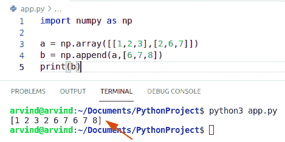
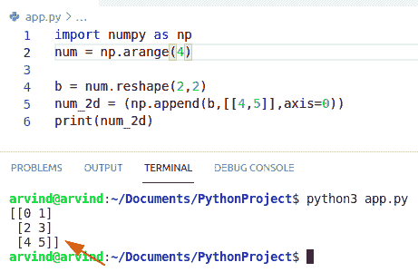
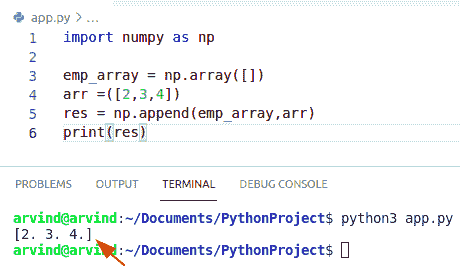
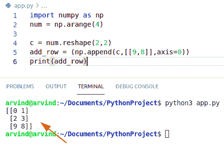
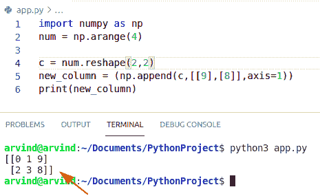
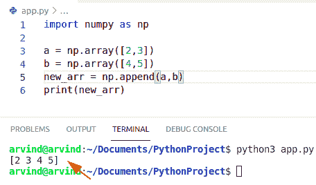
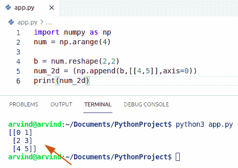
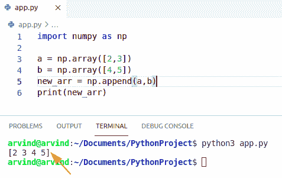
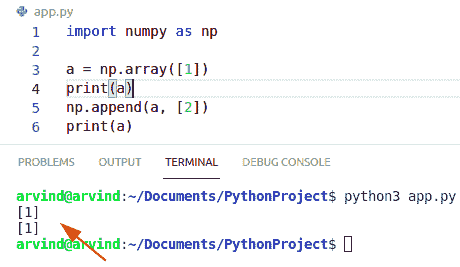
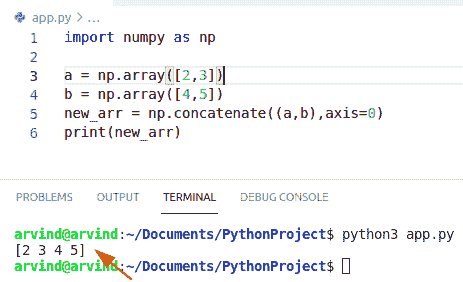

# Python NumPy 附加+ 9 个示例

> 原文：<https://pythonguides.com/python-numpy-append/>

[](https://sharepointsky.teachable.com/p/python-and-machine-learning-training-course)

在这个 Python Numpy 教程中，我们将通过下面几个例子讨论 `Python NumPy append` :

*   Python NumPy append 2d 阵列
*   Python NumPy 追加到空数组
*   python num py append row(python num py append row)-python num py append row(python num py append row)(python num py append row)(python num py append row)(python num py append row)
*   Python NumPy 追加列
*   Python NumPy 追加两个数组
*   python num py append axis(python num py 附录轴)
*   Python NumPy 将数组追加到数组
*   Python NumPy 向数组追加一个元素
*   Python NumPy 追加不起作用

如果您是 NumPy 的新手，请查看 [Python Numpy](https://pythonguides.com/numpy/) 以了解如何使用 Python Numpy。

目录

[](#)

*   [Python NumPy append](#Python_NumPy_append "Python NumPy append")
*   [Python numpy 追加 2d 数组](#Python_numpy_append_2d_array "Python numpy append 2d array")
*   [Python numpy 追加到空数组](#Python_numpy_append_to_empty_array "Python numpy append to empty array")
*   [Python numpy 追加行](#Python_numpy_append_row "Python numpy append row")
*   [Python NumPy 追加列](#Python_NumPy_append_column "Python NumPy append column")
*   [Python numpy 追加两个数组](#Python_numpy_append_two_arrays "Python numpy append two arrays")
*   [Python NumPy 追加轴](#Python_NumPy_append_axis "Python NumPy append axis")
*   [Python NumPy 向数组追加一个元素](#Python_NumPy_append_an_element_to_array "Python NumPy append an element to array")
*   [Python NumPy 追加不起作用](#Python_NumPy_append_not_working "Python NumPy append not working")
*   [Python NumPy 将数组追加到数组](#Python_NumPy_append_array_to_array "Python NumPy append array to array")

## Python NumPy append

*   在本节中，我们将了解 `Python NumPy append` 。
*   Numpy append 方法允许我们将新值插入到现有 Numpy 数组的最后一个数组中。
*   这个函数总是返回一个现有 numpy 数组的副本，其中的值附加到给定的轴上。
*   我们将从创建一个新的脚本开始，将 NumPy 库作为 np 导入。
*   接下来，我们将通过调用 np.arange()并以整数数据类型传递值来导入一个名为 data 或 numbers 的新 numpy 数组。
*   这个方法将创建一个整数 NumPy 数组。
*   现在我们将通过使用 np 来轻松使用 append 函数。追加()。
*   它用于将值追加到给定 numpy 数组的末尾。

**语法:**

下面是 numpy append 函数的语法

```py
numpy.append
            (
             arr,
             values,
             axis=None
            )
```

**举例:**

让我们举一个例子来检查 numpy append 函数在 Python 中是如何使用的

```py
import numpy as np

a = np.array([[1,2,3],[2,6,7]])
b = np.append(a,[6,7,8])
print(b)
```

下面是下面给出的代码的截图。



Python numpy append

你可能喜欢: [Python NumPy zeros](https://pythonguides.com/python-numpy-zeros/)

## Python numpy 追加 2d 数组

*   在这一节中，我们将了解到 `python numpy append 2d array` 。
*   Numpy append 函数允许我们在现有 Numpy 数组的末尾添加新元素。
*   二维 Numpy 数组是指一个列表的列表中的数据集合。它也被称为矩阵。在 2D 数组中，你必须使用两个方括号，这就是为什么它表示列表的列表。
*   我们将使用函数 np.reshape()。该方法将把 numbers numpy 数组的形状改为给定的行数和列数。
*   在 NumPy append() 2dimension 中，我们可以很容易地使用整形函数。此 reshapes 方法允许在不更改 numpy 数组数据的情况下为其添加新形状。

**语法:**

```py
numpy.append
            (
             arr,
             values,
             axis=None
            )
```

1.  **数组**:输入数组
2.  **值**:数组中要添加的值。
3.  **轴**:我们要计算总值的轴。

**举例:**

```py
import numpy as np
num = np.arange(4)

b = num.reshape(2,2)
num_2d = (np.append(b,[[4,5]],axis=0))
print(num_2d)
```

以下是给定代码的截图



Python numpy append 2d array

阅读: [Python 排序 NumPy 数组](https://pythonguides.com/python-sort-numpy-array/)

## Python numpy 追加到空数组

*   在这一节中，我们将了解到 **python NumPy 追加到空数组**中。
*   Numpy append 方法允许我们在 Numpy 数组的末尾插入新值。
*   为了在 Python 中[创建一个空数组，我们使用了 empty 函数。它返回给定形状和类型的数组，而不初始化数组的条目。](https://pythonguides.com/check-if-numpy-array-is-empty/)
*   理解这一点非常重要，因为与 zero 不同，empty 不会将数组值设置为零，因此数组的性能会比 zero 函数更快。
*   它要求用户手动设置数组的所有值。
*   现在我们将通过调用 `np.append()` 来使用 append 函数。它用于将值追加到给定数组的末尾。

**语法:**

```py
numpy.append
            (
             arr,
             values,
             axis=None
            )
```

**举例:**

```py
import numpy as np

emp_array = np.array([])
arr =([2,3,4])
res = np.append(emp_array,arr)
print(res)
```

下面是以下代码的截图。



Python numpy append to empty array

阅读: [Python NumPy Sum](https://pythonguides.com/python-numpy-sum/) +示例

## Python numpy 追加行

*   在这一节中，我们将了解到 `python numpy append row` 。
*   我们将使用函数 numpy.reshape()。该方法将把 numbers numpy 数组的形状改变为行和列的给定值。
*   在 numpy append 2d 中，我们可以很容易地使用 np 的函数。重塑。这个 reshapes 函数给 numpy 数组一个新的形状，而不改变它的数据。

**语法:**

```py
numpy.append
            (
             arr,
             values,
             axis=None
            )
```

**举例:**

```py
import numpy as np
num = np.arange(4)

c = num.reshape(2,2)
add_row = (np.append(c,[[9,8]],axis=0))
print(add_row)
```

下面是下面给出的代码的截图。



Python numpy append row

这是一个 **Python numpy 追加行**的例子。

阅读: [Python NumPy to list](https://pythonguides.com/python-numpy-to-list/)

## Python NumPy 追加列

*   在本节中，我们将了解到 **python numpy 追加列**。
*   我们将使用 np.reshape()方法。这个函数将把 numpy 数组的形状改变为指定的给定行数和列数。
*   在 NumPy append 2d 中，我们可以很容易地使用 np.reshape()函数。
*   这个函数给 numpy 数组一个新的形状，而不改变它的数据。
*   为了在 numpy 数组中追加一列，我们使用了 np.append()方法。

**语法:**

```py
numpy.append
            (
             arr,
             values,
             axis=None
            )
```

1.  **数组**:输入数组
2.  **值**:数组中要添加的值。
3.  **轴**:我们要求解总值的轴。

**举例:**

```py
import numpy as np
num = np.arange(4)

c = num.reshape(2,2)
new_column = (np.append(c,[[9],[8]],axis=1))
print(new_column)
```

下面是下面给出的代码的截图。



Python numpy append column

这是 Python NumPy 追加列的一个例子。

阅读: [Python NumPy arange](https://pythonguides.com/python-numpy-arange/)

## Python numpy 追加两个数组

*   在这一节中，我们将了解到`python NumPy append two array`。
*   要使用这个函数，您必须确保两个 numpy 数组具有相同的长度和大小。
*   axis 参数指定新轴的索引。
*   我们将从用 NumPy 库声明一个新脚本开始。
*   接下来，我们将通过调用 np 来创建一个名为 numbers 或 data 的新 numpy 数组。arange()并传入整数。
*   这个函数将声明一个整数数组。现在我们将通过使用 np 来使用 append 函数。追加()。

**语法:**

```py
numpy.append
            (
             arr,
             values,
             axis=None
            )
```

**举例:**

```py
import numpy as np

a = np.array([2,3])
b = np.array([4,5])
new_arr = np.append(a,b)
print(new_arr)
```

下面是以下代码的截图。



Python numpy append two arrays

这就是如何在 Python NumPy 中**追加两个数组。**

读取 [Python NumPy 平均值](https://pythonguides.com/python-numpy-average/)

## Python NumPy 追加轴

*   在本节中，我们将了解到 **python NumPy 附加轴**。
*   我们将使用函数 n.reshape()。此方法会将 numbers numpy 数组的形状更改为指定的给定行数和列数。
*   在 numpy append 2d 中，我们可以很容易地使用 np.reshape()函数。
*   这个 NP . shape()函数给 numpy 数组一个新的形状，而不改变它的数据。

**语法:**

```py
numpy.append
            (
             arr,
             values,
             axis=None
            )
```

1.  **数组**:输入数组
2.  **值**:数组中要添加的值。
3.  **轴**:我们要计算总值的轴。

**举例:**

```py
import numpy as np
num = np.arange(4)

b = num.reshape(2,2)
num_2d = (np.append(b,[[4,5]],axis=0))
print(num_2d)
```

下面是下面给出的代码的截图。



Python numpy append axis

## Python NumPy 向数组追加一个元素

*   在这一节中，我们将了解到 **python numpy 向数组**追加一个元素。
*   这些值将连接在 numpy 数组的末尾，并将返回一个包含新值和旧值的新 numpy 维度数组。
*   我们将从创建一个新的脚本开始，将 NumPy 库作为 np 导入。
*   接下来，我们将通过调用 np.arange()并传递整数值来创建一个名为 numbers 或 data 的 numpy 数组。
*   这个函数将声明一个整数 NumPy 数组。

**语法:**

```py
numpy.append
            (
             arr,
             values,
             axis=None
            )
```

**举例:**

```py
import numpy as np

a = np.array([2,3])
b = np.array([4,5])
new_arr = np.append(a,b)
print(new_arr)
```

下面是下面给出的代码的截图。



Python numpy append an element to the array

这就是如何在 Python NumPy 中将元素追加到数组中。

## Python NumPy 追加不起作用

*   在本节中，我们将了解 python numpy append 不起作用。
*   要使用这种方法，您必须确保两个 numpy 数组具有相同的长度和大小。

**举例:**

```py
import numpy as np

a = np.array([1])
print(a)
np.append(a, [2])
print(a)
```

下面是以下代码的截图。



Python numpy append not working

## Python NumPy 将数组追加到数组

*   在这一节中，我们将了解到 **python numpy 将数组追加到数组**中。
*   axis 参数指定给定轴的索引。
*   我们将从用 NumPy 库声明一个新脚本开始。
*   接下来，我们将创建一个名为 numbers 的新 numpy 数组，方法是使用 numpy.arange()并传入一个整型值，该值将声明一个包含整数的 numpy 数组。
*   现在，我们将通过 numpy.conctenate()来使用 append 函数。

**语法:**

```py
numpy.conctenate
               (
               arr,
               values,
               axis=None
               )
```

**举例:**

```py
import numpy as np

a = np.array([2,3])
b = np.array([4,5])
new_arr = np.concatenate((a,b),axis=0)
print(new_arr)
```

下面是以下代码的截图。



Python numpy append array to array

这是 Python NumPy 将数组追加到数组的一个例子。

您可能喜欢:

*   [Python NumPy 矩阵](https://pythonguides.com/python-numpy-matrix/)
*   [Python NumPy 拆分](https://pythonguides.com/python-numpy-split/)
*   [Python NumPy 替换](https://pythonguides.com/python-numpy-replace/)

在这个 Python Numpy 教程中，我们将讨论 `Python NumPy append` ，并给出如下几个例子:

*   Python numpy append 2d 阵列
*   Python numpy 追加到空数组
*   python num py append row(python num py append row)-python num py append row(python num py append row)(python num py append row)(python num py append row)(python num py append row)
*   Python numpy 追加列
*   Python numpy 追加两个数组
*   python num py append axis(python num py 附录轴)
*   Python numpy 将数组追加到数组
*   Python numpy 向数组追加一个元素
*   Python numpy 追加不起作用

[Bijay Kumar](https://pythonguides.com/author/fewlines4biju/)

Python 是美国最流行的语言之一。我从事 Python 工作已经有很长时间了，我在与 Tkinter、Pandas、NumPy、Turtle、Django、Matplotlib、Tensorflow、Scipy、Scikit-Learn 等各种库合作方面拥有专业知识。我有与美国、加拿大、英国、澳大利亚、新西兰等国家的各种客户合作的经验。查看我的个人资料。

[enjoysharepoint.com/](https://enjoysharepoint.com/)[](https://www.facebook.com/fewlines4biju "Facebook")[](https://www.linkedin.com/in/fewlines4biju/ "Linkedin")[](https://twitter.com/fewlines4biju "Twitter")