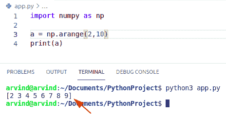
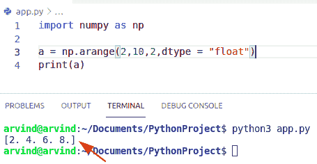
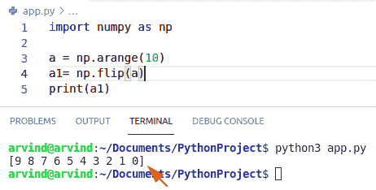
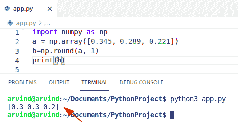
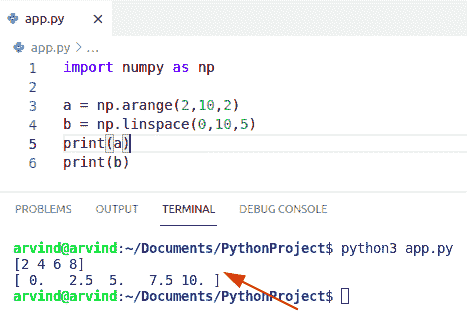
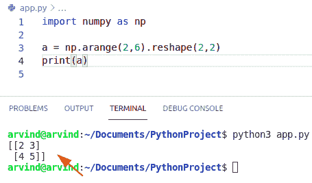
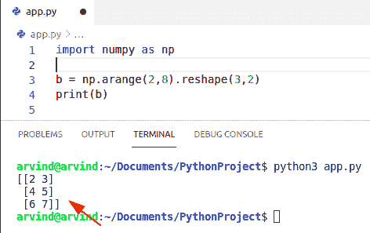
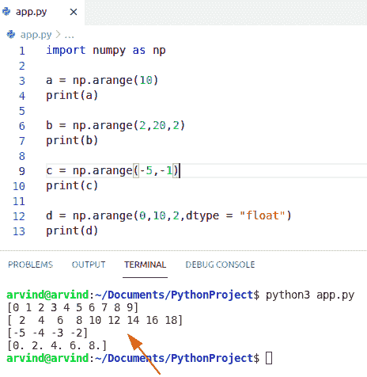
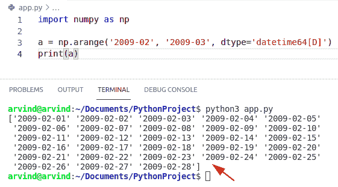

# Python NumPy arange +示例

> 原文：<https://pythonguides.com/python-numpy-arange/>

[](https://sharepointsky.teachable.com/p/python-and-machine-learning-training-course)

在本 [Python 教程](https://pythonguides.com/python-download-and-installation/)中，我们将讨论 **Python 数量范围**，并涵盖以下几点:

*   python numpy 一个范围浮点数
*   python numpy 范围反转
*   python numpy 一个范围轮
*   python numpy a range vs linspace
*   Python NumPy 橙色 2d
*   python numpy a range reshape(python numpy a range reshape)的缩写
*   python numpy 一个范围示例
*   python numpy arange datetime

目录

[](#)

*   [python num py arang](#Python_numpy_arange "Python numpy arange")
*   [python num py arang float](#Python_numpy_arange_float "Python numpy arange float")
*   [Python numpy arange reverse](#Python_numpy_arange_reverse "Python numpy arange reverse")
*   [Python numpy arange round](#Python_numpy_arange_round "Python numpy arange round")
*   [Python numpy arange vs linspace](#Python_numpy_arange_vs_linspace "Python numpy arange vs linspace")
*   [python num py arang 2d](#Python_numpy_arange_2d "Python numpy arange 2d")
*   [python num py arang reshape](#Python_numpy_arange_reshape "Python numpy arange reshape")
*   [Python numpy 数组示例](#Python_numpy_arange_example "Python numpy arange example")
*   [python num py arang datetime](#Python_numpy_arange_datetime "Python numpy arange datetime")

## python num py arang

如果您是 Python NumPy 的新手，请查看 [Python Numpy](https://pythonguides.com/numpy/) 。

*   在这一节中，我们将了解到 `Python numpy arange` 。
*   Numpy arange 函数基于声明时指定的开始和停止间隔生成一个 Numpy 数组，数组中的值间隔相等。
*   为了使用 arange 函数，我们将使用作为 np 导入的 NumPy 库创建一个新脚本。
*   接下来，我们将声明一个新的变量编号，并将其设置为等于 np。arange()。
*   当我们使用 type 函数将变量 numbers 的数据类型打印到控制台时，我们看到它的数据类型是 numpy 数组。
*   当我们只向 arange 函数传递一个参数时，这个值就是不包含在结果数组中的最终值。
*   此函数的默认范围从 0 开始(包括在内)，到指定为参数的值结束(不包括在内)。

**语法:**

下面是 numpy.arange()的语法

```py
numpy.arange(
             [start],
             stop,
             [step],
             dtype=None
            )
```

**举例:**

```py
import numpy as np

a = np.arange(2,10)
print(a)
```

下面是以下代码的截图。



Python numpy arange

阅读: [Python NumPy to list](https://pythonguides.com/python-numpy-to-list/)

## python num py arang float

*   在本节中，我们将了解到 `Python numpy arange float` 。
*   Numpy arange 函数生成一个 [NumPy 数组](https://pythonguides.com/python-numpy-array/)，其中的值根据声明中指定的开始和停止间隔均匀分布。
*   在 NumPy arange float 中，我们可以很容易地使用函数 np.arange 来获得浮点数的范围。
*   这是一个内置的 range()函数。
*   为了使用 arange 函数，我们将使用作为 np 导入的 NumPy 库创建一个新脚本。

**语法:**

下面是 numpy 范围浮动的语法

```py
numpy.arange(
             [start],
             stop,
             [step],
             dtype=float
            )
```

1.  **开始**:默认值为 0。所以这是可选值，如果你没有定义起始值，它会取默认值 0。
2.  `Stop` :它也是区间的最后一个数字，不包括这个值，内置的 range 函数也是如此，不包括 Stop，但在某些特殊情况下，比如这个特例，它会包括当步长不是一个整数值和浮点轮次时，影响 out 的长度。
3.  **第**步:任意输出的值之间的间距是两个相邻值之间的距离。
4.  `Dtype` :代表数据类型，如果其他输入参数中没有给出 Dtype 的数据类型，则输出 numpy 数组的类型。
5.  **返回**:返回 ndarray。

**举例:**

```py
import numpy as np

a = np.arange(2,10,2,dtype = "float")
print(a)
```

下面是以下代码的截图。



Python numpy arange float

阅读:[Python NumPy Random+Examples](https://pythonguides.com/python-numpy-random/)

## Python numpy arange reverse

*   在本节中，我们将学习 Python numpy arange reverse。
*   要反转数组中元素的数量，我们可以很容易地使用函数 numpy。翻转()。
*   数组的形状保持不变，但元素被重新排序。
*   为了使用 arange 函数，我们将使用作为 np 导入的 numpy 库创建一个新脚本。

**语法:**

下面是 numpy.flip()函数的语法

```py
numpy.flip(
           a,
           axis=None
          )
```

**例子**

```py
import numpy as np

a = np.arange(10)
a1= np.flip(a)
print(a1)
```

下面是下面给出的代码的截图。



Python numpy arange reverse

## Python numpy arange round

*   在本节中，我们将了解到 `Python numpy arange round` 。
*   numpy.round()是一个帮助用户将 numpy 数组舍入到给定小数位数的方法。
*   为了使用 arange 方法，我们将使用 numpy 库创建一个新的脚本。
*   舍入值最接近于偶数。

**语法:**

下面是 numpy.round()的语法

```py
numpy.round(
            arr,
            decimals,
            out=None
           )
```

**例子**

```py
import numpy as np
a = np.array([0.345, 0.289, 0.221])
b=np.round(a, 1)
print(b) 
```

下面是以下代码的截图



Python numpy arange round

Read: [检查 Python + Examples 中的 NumPy 数组是否为空](https://pythonguides.com/check-if-numpy-array-is-empty/)

## Python numpy arange vs linspace

*   在本节中，我们将了解`Python NumPy arange vs linspace`。
*   numpy.linspace()和 numpy.arange()方法非常相似，因为 np.linspace()方法也声明了一个在给定区间内等间距值的可迭代序列。
*   它还在指定的给定区间内给出值，并且元素像 numpy.arange()函数一样均匀分布。
*   np.linspace()函数将返回一个在特定间隔上等距值的可迭代序列。

**语法:**

```py
np.linspace(
            start,
            stop,
            endpoint=True,
            dtype=None,
            axis=0
            )
```

**举例:**

```py
import numpy as np

a = np.arange(2,10,2)
b = np.linspace(0,10,5)
print(a)
print(b)
```

下面是以下代码的截图



Python numpy arange vs linspace

*   [Python NumPy 拆分](https://pythonguides.com/python-numpy-split/)

## python num py arang 2d

*   在本节中，我们将了解到 `Python numpy arange 2d` 。
*   二维数组是指一个列表中同质数据或数字的集合。它也被称为 numpy 矩阵。在二维数组中，你必须使用两个方括号，这就是为什么它被称为列表的列表。
*   在 numpy arange 2d 中，我们可以很容易地使用 np.reshape()函数。
*   这个 NP . shape()函数给 numpy 数组一个新的形状和大小，而不改变它的数据。
*   为了使用 arange 函数，我们将使用 numpy 库声明一个新的脚本。

**语法:**

下面是 numpy arange 2d 的语法

```py
numpy.arange(
             [start],
             stop,
             [step],
             dtype=None
            )
```

**举例:**

```py
import numpy as np

a = np.arange(2,6).reshape(2,2)
print(a)
```

下面是下面给出的代码的截图。



Python numpy arange 2d

阅读: [Python NumPy zeros +示例](https://pythonguides.com/python-numpy-zeros/)

## python num py arang reshape

*   在本节中，我们将学习和讨论 `Python NumPy arange reshape` 。
*   通过整形，我们可以添加或删除维度，或者改变每个维度中的值的数量。
*   要使用 numpy.arange()方法和 numpy.reshape()函数，我们将创建一个新脚本，其中 numpy 库作为 np 导入。

**语法:**

以下是 numpy a range reshape 的语法

```py
numpy.arange(
             [start],
             stop,
             [step],
             dtype=None
            )
            reshape()
```

**举例:**

```py
import numpy as np

b = np.arange(2,8).reshape(3,2)
print(b)
```

下面是以下代码的截图。



Python numpy arange reshape

## Python numpy 数组示例

*   在这一节中，我们将了解到 `Python numpy arange` 。
*   接下来，我们将声明一个新的变量编号，并将其设置为等于 np。arange()。
*   当我们使用 type 函数将变量 numbers 的数据类型打印到控制台时，我们看到它的数据类型是 numpy 数组。
*   当我们只向 arange 函数传递一个参数时，这个值就是不包含在结果数组中的最终值。
*   此函数的默认范围从 0 开始(包括在内)，到指定为参数的值结束(不包括在内)。

**语法:**

下面是 numpy.arange()的语法

```py
numpy.arange(
             [start],
             stop,
             [step],
             dtype=None
            )
```

**举例:**

```py
import numpy as np

a = np.arange(10)
print(a)

b = np.arange(2,20,2)
print(b)

c = np.arange(-5,-1)
print(c)

d = np.arange(0,10,2,dtype = "float")
print(d)
```

下面是下面代码的截图。



Python numpy arange examples

## python num py arang datetime

*   在本节中，我们将了解`Python NumPy arange datetime`。
*   Numpy arange 函数基于声明时指定的开始和停止间隔生成一个 Numpy 数组，数组中的值间隔相等。
*   datetime 类型适用于许多常见的数字，例如，arange 可用于生成一系列日期函数。
*   为了使用 arange 函数，我们将使用作为 np 导入的 NumPy 库创建一个新脚本。

**举例:**

```py
import numpy as np

a = np.arange('2009-02', '2009-03', dtype='datetime64[D]')
print(a)
```

以下是给定代码的截图



Python numpy arange datetime

您可能会喜欢以下 Python 教程:

*   [Python NumPy Sum +示例](https://pythonguides.com/python-numpy-sum/)
*   [Python NumPy 矩阵乘法](https://pythonguides.com/python-numpy-matrix-multiplication/)
*   [Python Tkinter 主循环示例](https://pythonguides.com/python-tkinter-mainloop/)
*   [Python Tkinter 滚动条–如何使用](https://pythonguides.com/python-tkinter-scrollbar/)
*   [检查 Python + Examples 中的 NumPy 数组是否为空](https://pythonguides.com/check-if-numpy-array-is-empty/)

在本 Python 教程中，我们将讨论 `Python numpy arange` ，并涵盖以下示例:

*   python numpy 一个范围浮点数
*   Python NumPy arange 反转
*   python numpy 一个范围轮
*   python numpy a range vs linspace
*   Python NumPy 橙色 2d
*   python numpy a range reshape(python numpy a range reshape)的缩写
*   python numpy 一个范围示例
*   python numpy arange datetime

[Bijay Kumar](https://pythonguides.com/author/fewlines4biju/)

Python 是美国最流行的语言之一。我从事 Python 工作已经有很长时间了，我在与 Tkinter、Pandas、NumPy、Turtle、Django、Matplotlib、Tensorflow、Scipy、Scikit-Learn 等各种库合作方面拥有专业知识。我有与美国、加拿大、英国、澳大利亚、新西兰等国家的各种客户合作的经验。查看我的个人资料。

[enjoysharepoint.com/](https://enjoysharepoint.com/)[](https://www.facebook.com/fewlines4biju "Facebook")[](https://www.linkedin.com/in/fewlines4biju/ "Linkedin")[](https://twitter.com/fewlines4biju "Twitter")