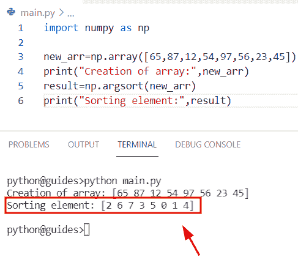
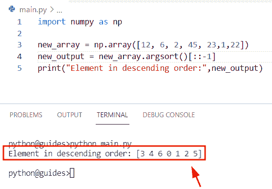
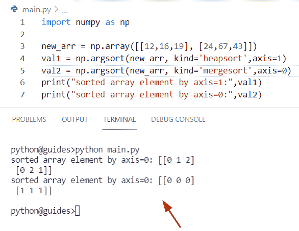
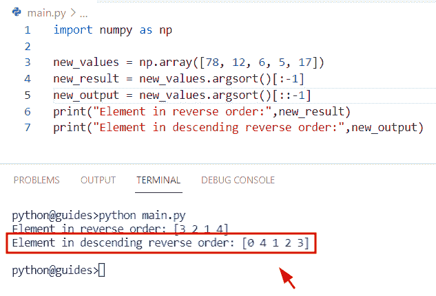
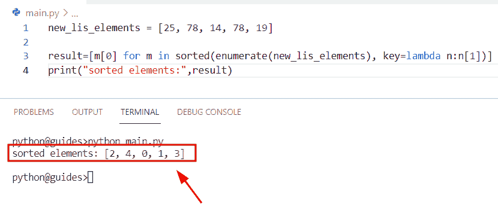
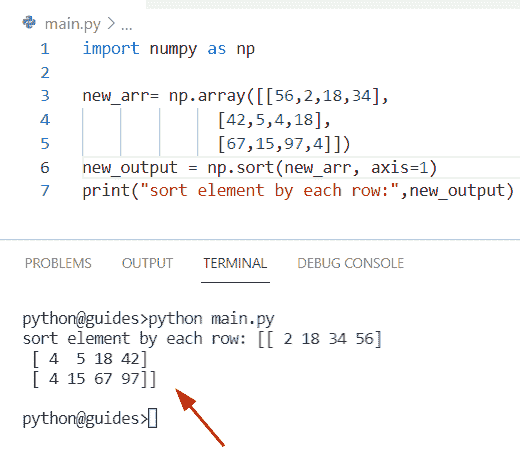
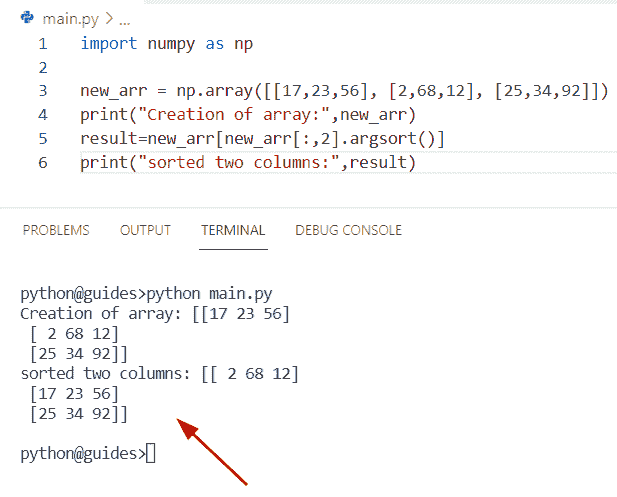

# Python NumPy argsort + 7 个例子

> 原文:# t0]https://pythongguide . com/python-numpy-argsort/

[](https://sharepointsky.teachable.com/p/python-and-machine-learning-training-course)

在本 [Python 教程](https://pythonguides.com/python-hello-world-program/)中，我们将学习**如何在 NumPy 数组** Python 中使用 argsort 函数。此外，我们将涵盖这些主题。

*   Python NumPy argsort 降序
*   Python numpy argsort 示例
*   Python np.argsort aescending
*   Python np.argsort 反向
*   没有 numpy 的 Python argsort
*   Python numpy 对每行进行排序
*   Python numpy 数组按两列排序

目录

[](#)

*   [Python numpy argsort](#Python_numpy_argsort "Python numpy argsort")
*   [Python NumPy argsort 降序](#Python_NumPy_argsort_descending "Python NumPy argsort descending")
*   [Python numpy argsort 示例](#Python_numpy_argsort_example "Python numpy argsort example")
*   [Python NP . argsort AES cending](#Python_npargsort_aescending "Python np.argsort aescending")
*   [Python np.argsort 反向](#Python_npargsort_reverse "Python np.argsort reverse")
*   [没有 numpy 的 Python arg sort](#Python_argsort_without_numpy "Python argsort without numpy")
*   [Python numpy 排序每一行](#Python_numpy_sort_each_row "Python numpy sort each row")
*   [Python numpy 数组按两列排序](#Python_numpy_array_sort_by_two_columns "Python numpy array sort by two columns")

## Python numpy argsort

*   本节我们将讨论如何在 numpy 数组 Python 中使用 `numpy.argsort()` 函数。
*   在 Python 中，这个函数在 numpy 模块包中可用，并且总是返回一个索引数组。在 Numpy Python 中，argsort 意味着对具有相同形状的给定轴的数组元素进行排序。

**语法:**

让我们看看语法，了解如何在 NumPy Python 中使用 `numpy.argsort()` 函数

```py
numpy.argsort
             (
              a,
              axis= -1,
              kind=None,
              order=None
             )
```

*   它由几个参数组成
    *   **a:** 这个参数表示我们要排序的 numpy 数组。
    *   **轴:**默认取 `-1` 值，定义我们要排序的轴。
    *   **kind:** 这是一个可选参数，表示要像快速排序和合并排序一样使用的排序算法。
    *   **order:** 此参数指定比较字段的顺序。

**举例:**

让我们举个例子来理解 numpy.argsort()函数的工作原理

**源代码:**

```py
import numpy as np  

new_arr=np.array([65,87,12,54,97,56,23,45])  
print("Creation of array:",new_arr)
result=np.argsort(new_arr)  
print("Sorting element:",result) 
```

在上面的程序中，我们导入了 numpy 库，然后通过使用 `np.array()` 函数创建了一个数组**‘new _ arr’**。之后，我们声明了一个变量**‘result’**，并为函数 `np.argsort()` 赋值，在这个方法中，我们传递了数组**‘new _ arr’**。一旦您将打印**‘result’**，那么输出将显示一个排序元素的索引。

下面是以下代码的截图



Python numpy argsort

另外，检查: [Python NumPy 平均值和示例](https://pythonguides.com/python-numpy-average/)

## Python NumPy argsort 降序

*   在这个程序中，我们将讨论如何通过使用 `numpy.argsort()` 函数以降序获取元素。
*   通过使用 `numpy.argsort()` 函数，我们可以轻松地对给定数组**‘new _ array’**的索引进行降序排序。随着这种用法，语法排名 **[::-1]** 为逆序排名。
*   在 Python 中 **[::-1]** 的意思是我们将在 `-1` 返回最后一个元素的地方检查开始和结束的元素。

**举例:**

让我们举一个例子，看看如何使用 numpy.argsort()函数来获取降序元素的索引

**源代码:**

```py
import numpy as np  

new_array = np.array([12, 6, 2, 45, 23,1,22])
new_output = new_array.argsort()[::-1]
print("Element in descending order:",new_output)
```

你可以参考下面的截图



Python NumPy argsort descending

阅读: [Python NumPy 绝对值](https://pythonguides.com/python-numpy-absolute-value/)

## Python numpy argsort 示例

*   在本节中，我们将讨论如何使用 `numpy.argsort()` 函数以及使用在**‘kind’**参数中指定的算法的 axis。
*   为了完成这项任务，首先我们将使用 `np.array()` 函数初始化一个数组。之后，我们将使用 `numpy.argsort()` 函数，在这个方法中，我们将传递数组 **'new_arr'** ，kind =**' merge sort and heap sort '**作为参数以及**轴=0，1** 。

**举例:**

```py
import numpy as np  

new_arr = np.array([[12,16,19], [24,67,43]])
val1 = np.argsort(new_arr, kind='heapsort',axis=1)
val2 = np.argsort(new_arr, kind='mergesort',axis=0)
print("sorted array element by axis=1:",val1)
print("sorted array element by axis=0:",val2)
```

下面是以下给定代码的实现



Python numpy argsort example

正如您在屏幕截图中看到的，输出显示了排序元素的索引。

阅读: [Python NumPy square 举例](https://pythonguides.com/python-numpy-square/)

## Python NP . argsort AES cending

*   这里我们可以看到如何使用 NumPy array Python 使用 `numpy.argsort()` 函数对元素进行升序排序。
*   为了执行这个特定的任务，我们将使用 `numpy.argsort()` 函数，该函数将给定数组**‘array _ elements’**的索引按升序排序。
*   之后声明一个变量并赋值给 `ndarray.argsort()` 函数，在这个方法中使用语法 ranked **[:-1]** 来反转 ranked。

**源代码:**

```py
import numpy as np  

array_elements = np.array([16, 7, 8, 45, 29])
new_result = array_elements.argsort()[:-1]
print("Element in aescending order:",new_result)
```

下面是以下给定代码的执行过程


Python np argsort ascending

正如您在屏幕截图中看到的，输出显示了升序元素的索引。

阅读: [Python NumPy to list](https://pythonguides.com/python-numpy-to-list/)

## Python np.argsort 反向

*   在这一节中，我们将讨论如何通过使用 `np.argsort()` 函数来反转 numpy 数组中的元素。
*   通过使用 `numpy.argsort()` 函数，我们可以很容易地解决这个问题。在 Python 中， `numpy.argsort()` 函数用于构造排序数组并返回索引数组。

**语法:**

下面是 numpy.argsort()函数的语法

```py
numpy.argsort
             (
              a,
              axis= -1,
              kind=None,
              order=None
             )
```

**举例:**

我们举一个例子，检查如何使用 `numpy.argsort()` 函数在 numpy Python 中获取逆序

**源代码:**

```py
import numpy as np  

new_values = np.array([78, 12, 6, 5, 17])
new_result = new_values.argsort()[:-1]
new_output = new_values.argsort()[::-1]
print("Element in reverse order:",new_result)
print("Element in descending reverse order:",new_output)
```

下面是以下给定代码的输出



Python np argsort reverse

读取: [Python NumPy 读取 CSV](https://pythonguides.com/python-numpy-read-csv/)

## 没有 numpy 的 Python arg sort

*   在本节中，我们将讨论如何在 Python 中不使用 Numpy 的情况下对元素进行排序。
*   为了完成这项任务，我们将首先创建一个包含整数值的列表**‘new _ lis _ elements’**。现在声明一个变量**‘结果’**并使用列表理解方法。在这个方法中，我们将通过使用 enumerator 方法来迭代排序函数中的值。

**举例:**

```py
new_lis_elements = [25, 78, 14, 78, 19]

result=[m[0] for m in sorted(enumerate(new_lis_elements), key=lambda n:n[1])]
print("sorted elements:",result)
```

下面是以下代码的截图



Python argsort without numpy

正如您在屏幕截图中看到的，输出在一个新列表中显示了排序后的元素。

阅读: [Python NumPy 日志+示例](https://pythonguides.com/python-numpy-log/)

## Python numpy 排序每一行

*   在这个程序中，我们将学习如何对 NumPy 数组 Python 中的每一行进行排序。
*   这里我们可以应用 `np.sort()` 函数的概念。在 Python 中，这个函数用于对数组中的元素进行排序。假设您有一个包含 6 个随机排列的整数值的一维数组。现在，如果您想按降序或升序对这些元素进行排序，那么您可以很容易地使用 `numpy.sort()` 函数。
*   在这个方法中，我们将设置**轴=1** ,表示行元素已经在数组中排序。

**源代码:**

```py
import numpy as np

new_arr= np.array([[56,2,18,34],
              [42,5,4,18],
              [67,15,97,4]])
new_output = np.sort(new_arr, axis=1)
print("sort element by each row:",new_output)
```

下面是以下给定代码的实现



Python numpy sort each row

正如您在屏幕截图中看到的，输出显示了排序后的数组。

阅读:[Python NumPy where with examples](https://pythonguides.com/python-numpy-where/)

## Python numpy 数组按两列排序

*   在本节中，我们将讨论如何对 Numpy 数组 Python 中的两列进行排序。
*   为了执行这个特定的任务，我们将使用数组条件 **[:，2]** 来表示用于反转排序的语法。一旦您将打印**‘结果’**，那么输出将显示排序后的两列元素。

**举例:**

```py
import numpy as np

new_arr = np.array([[17,23,56], [2,68,12], [25,34,92]])
print("Creation of array:",new_arr)
result=new_arr[new_arr[:,2].argsort()]   
print("sorted two columns:",result)
```

下面是以下给定代码的输出



Python numpy array sort by two columns

您可能还想阅读以下主题。

*   [Python NumPy linspace +示例](https://pythonguides.com/python-numpy-linspace/)
*   [Python NumPy 过滤器+ 10 个例子](https://pythonguides.com/python-numpy-filter/)
*   [Python NumPy 删除](https://pythonguides.com/python-numpy-delete/)
*   [Python NumPy 添加教程](https://pythonguides.com/python-numpy-add/)
*   [Python NumPy Divide](https://pythonguides.com/python-numpy-divide/)
*   [Python NumPy 最小教程](https://pythonguides.com/python-numpy-minimum/)

在这篇 Python 教程中，我们学习了如何在 NumPy array Python 中使用 argsort 函数。此外，我们已经讨论了这些主题。

*   Python NumPy argsort 降序
*   Python numpy argsort 示例
*   Python np.argsort aescending
*   Python np.argsort 反向
*   没有 numpy 的 Python argsort
*   Python numpy 对每行进行排序
*   Python numpy 数组按两列排序

[Bijay Kumar](https://pythonguides.com/author/fewlines4biju/)

Python 是美国最流行的语言之一。我从事 Python 工作已经有很长时间了，我在与 Tkinter、Pandas、NumPy、Turtle、Django、Matplotlib、Tensorflow、Scipy、Scikit-Learn 等各种库合作方面拥有专业知识。我有与美国、加拿大、英国、澳大利亚、新西兰等国家的各种客户合作的经验。查看我的个人资料。

[enjoysharepoint.com/](https://enjoysharepoint.com/)[](https://www.facebook.com/fewlines4biju "Facebook")[](https://www.linkedin.com/in/fewlines4biju/ "Linkedin")[](https://twitter.com/fewlines4biju "Twitter")