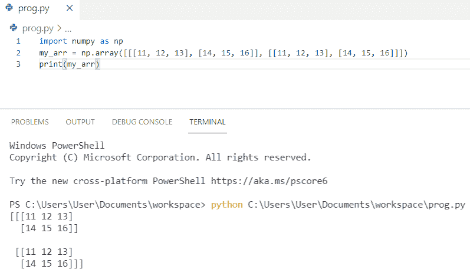

# Python NumPy 数组+示例

> 原文：<https://pythonguides.com/python-numpy-array/>

[](https://sharepointsky.teachable.com/p/python-and-machine-learning-training-course)

在这个 [Python NumPy 教程](https://pythonguides.com/numpy/)中，你将学习 **python numpy 数组**，如何**使用 Python NumPy** 创建一个数组，我们还将检查 **:**

*   Numpy 数组创建
*   Numpy.empty 方法
*   Numpy.zeros 方法
*   Numpy.ones 方法
*   Numpy.reshape 方法
*   Python Numpy 数组示例
*   Python numpy 数组大小
*   创建 Numpy ndarray 对象
*   什么是数组维数
*   Numpy 中的 0 维数组
*   Numpy 中的一维数组
*   Numpy 中的二维数组
*   Numpy 中的三维数组
*   Numpy 数组和 python 列表有什么区别？

目录

[](#)

*   [如何创建 Numpy 数组](#How_to_create_Numpy_array "How to create Numpy array")
*   [Numpy.empty 方法](#Numpyempty_method "Numpy.empty method")
*   [Numpy.zeros 方法](#Numpyzeros_method "Numpy.zeros method")
*   [Numpy.ones 方法](#Numpyones_method "Numpy.ones method")
*   [NumPy.reshape 方法](#NumPyreshape_method "NumPy.reshape method")
*   [Python NumPy 数组示例](#Python_NumPy_array_example "Python NumPy array example")
*   [Python numpy 数组大小](#Python_numpy_array_size "Python numpy array size")
*   [创建 NumPy ndarray 对象](#Create_NumPy_ndarray_object "Create NumPy ndarray object")
*   [Python NumPy 数组维度](#Python_NumPy_array_dimensions "Python NumPy array dimensions")
*   [Numpy 中的 0 维数组](#0-D_arrays_in_Numpy "0-D arrays in Numpy")
*   [Numpy 中的一维数组](#1-D_arrays_in_Numpy "1-D arrays in Numpy")
*   [Numpy 中的二维数组](#2-D_arrays_in_Numpy "2-D arrays in Numpy")
*   [Numpy 中的三维数组](#3-D_arrays_in_Numpy "3-D arrays in Numpy")
*   【NumPy 数组和 Python 列表的区别

## 如何创建 Numpy 数组

NumPy 提供了许多在 Python 中用初始占位符内容创建数组的函数。此外，它最大限度地减少了增加阵列的必要性，而增加阵列是一项昂贵的操作。例如 NumPy.empty、NumPy.zeros 方法，我们可以使用 NumPy 在 Python 中创建数组，等等。

## Numpy.empty 方法

让我们看看用 Python 创建数组的 **Numpy.empty 方法**。

`np.empty()` 方法用于**创建指定形状和数据类型的指定数组的未初始化数组**。它包含垃圾值。

```py
import numpy as np  
my_arr = np.empty((2,2), dtype = int)  
print(my_arr) 
```

您可以参考下面的截图来查看 **Numpy.empty 方法**的输出。


Numpy.empty methods

这就是如何使用 NumPy 在 Python 中**创建一个未初始化的数组。**

阅读: [Python 程序打印数组中的元素](https://pythonguides.com/python-program-to-print-element-in-an-array/)

## Numpy.zeros 方法

让我们看看 Python NumPy 中的 **Numpy.zeros 方法**来创建数组。

`numpy.zeros()` 用于**创建具有指定形状**的 numpy 数组，其中每个 NumPy 数组项初始化为 0。

```py
import numpy as np  
my_arr = np.zeros((3,3), dtype = int)  
print(my_arr) 
```

您可以参考下面的截图来查看 **Numpy.zeros 方法**的输出。


Numpy.zeros method

这就是我们如何使用 **Python Numpy.zeros 方法**来创建数组。

阅读:[Python NumPy Random+Examples](https://pythonguides.com/python-numpy-random/)

## Numpy.ones 方法

现在，我们将看到用 Python 创建 Numpy 数组的方法。

`np.ones()` 用于创建具有指定形状的 NumPy 数组，其中每个 NumPy 数组项被初始化为 1。

```py
import numpy as np  
my_arr = np.ones((3,3), dtype = int)  
print(my_arr) 
```

您可以参考下面的截图来查看 **Numpy.ones 方法**的输出


Numpy.ones methods

这就是如何在 Python 中用指定的形状**创建一个 NumPy 数组。**

阅读: [Python 串联数组](https://pythonguides.com/python-concatenate-arrays/)

## NumPy.reshape 方法

让我们看看，如何在 Python 中使用**numpy . shape 方法**。

`numpy . shape()`方法用于在不改变数组数据的情况下对数组进行整形。具有 2 行 3 列的形状数组。

```py
import numpy as np  
my_arr = np.arange(6).reshape(2, 3)
print("\nArray reshaped with 2 rows and 3 columns : \n", my_arr)
```

你可以参考下面的截图来查看**numpy . shape 方法**的输出


NumPy.reshape method

这就是我们如何在 Python 中使用，**numpy . shape 方法**。

这些是各种各样的 **python numpy 数组函数**。

## Python NumPy 数组示例

我们来看看 **Python NumPy 数组例子**。

*   首先我们需要**将 NumPy 作为 np** 导入。
*   然后我们将变量声明为 **my_arr = np.array([101，102，103，104，105])**
*   最后得到输出 **print(my_arr)。**

**举例:**

```py
import numpy as np
my_arr = np.array([101, 102, 103, 104, 105])
print(my_arr)
```

您可以参考下面的截图来查看 **Python NumPy 数组示例**的输出。


Python NumPy array example

在这里，我们看到了一个简单的例子 **Python NumPy 数组**。

阅读:[如何将 Python 数组写入 CSV](https://pythonguides.com/python-write-array-to-csv/)

## Python numpy 数组大小

在这里，我们将看到 **Python numpy 数组大小**。

为了获得 numpy 数组的大小(所有元素的数量),我们将使用 `size` 属性来获得输出中的数组大小。

**举例:**

```py
import numpy as np
my_arr = np.array([0,1,2], dtype=np.float64)
print("Size of the array: ", my_arr.size)
```

你可以参考下面的截图来看看 **python numpy 数组大小**的输出


Python numpy array size

这就是如何获得 **Python NumPy 数组大小**的方法。

## 创建 NumPy ndarray 对象

现在，我们将看到如何用 Python 创建 NumPy ndarray 对象。

`Numpy` 用于处理数组，Numpy 中的数组对象称为 ndarray。

```py
import numpy as np
my_arr = np.array([5,6,7,8,9])
print(my_arr)
print(type(my_arr))
```

您可以参考下面的截图来查看**创建 NumPy ndarray 对象**的输出


Create NumPy ndarray object

这就是如何在 Python 中使用 **NumPy ndarray。**

阅读: [Python 数组的形状](https://pythonguides.com/python-shape-of-an-array/)

## Python NumPy 数组维度

维度是可以改变数组元素规格的方向。数组中的维数是数组深度的一个级别。让我们看几个 **python numpy 数组维度**的例子。

## Numpy 中的 0 维数组

让我们看看如何在 Numpy 中创建一个**零维数组。**

*   Numpy 中的 **0 维数组**是标量数组，它们不能通过索引来访问。
*   首先我们将**把 numpy 作为 np** 导入。
*   **0 维数组**是数组中的元素。此外，数组中的每个值都是一个 0 维数组。

```py
import numpy as np
my_arr = np.array(50)
print(my_arr)
```

你可以参考下面的截图来查看 Numpy 中的 **0 维数组的输出。**


0-D arrays in Numpy

这就是如何在 Numpy `python` 中使用**零维数组。**

## Numpy 中的一维数组

现在，我们将在 Numpy python 中看到 **1-D 数组。**

*   numpy 中的一维数组是一维的，可以看作是一个列表，你可以在索引的帮助下访问其中的元素。
*   首先我们将**把 numpy 作为 np** 导入。
*   以 0 维数组为元素的数组称为 1 维数组。

```py
import numpy as np
my_arr = np.array([10, 11, 12, 13, 14])
print(my_arr)
```

你可以参考下面的截图来查看 Numpy 中的**一维数组的输出。**


1-D arrays in Numpy

这就是如何在 python 的 Numpy 中使用**一维数组**

## Numpy 中的二维数组

现在，我们将看看如何在 Python 的 Numpy 中创建一个**二维数组。**

*   **numpy 中的二维数组**是二维数组，可以根据使用的方括号数量来区分。
*   首先我们将**把 numpy 作为 np** 导入。
*   以一维数组为元素的数组称为二维数组。

```py
import numpy as np
my_arr = np.array([[11, 12, 13], [14, 15, 16]])
print(my_arr)
```

你可以参考下面的截图来查看 Numpy 中的**二维数组的输出。**


2-D arrays in Numpy

这就是如何在 Numpy `python` 中使用**二维数组。**

阅读: [Python 数组与示例](https://pythonguides.com/python-array/)

## Numpy 中的三维数组

在这里，您将看到 Numpy python 中的**三维数组**

*   numpy 中的**三维数组**是可以和 numpy 数组有三个方括号的三维数组。
*   首先我们将**把 numpy 作为 np** 导入。
*   以二维数组为元素的数组称为三维数组。

```py
import numpy as np
my_arr = np.array([[[11, 12, 13], [14, 15, 16]], [[11, 12, 13], [14, 15, 16]]])
print(my_arr)
```

你可以参考下面的截图来查看 Numpy 中的**三维数组的输出**



3-D arrays in Numpy

这就是如何在 Numpy `python` 中使用**三维数组。**

## 【NumPy 数组和 Python 列表的区别

| **NumPy 数组** | **Python 列表** |
| Numpy 阵列更快、更紧凑。 | Python 列表并没有快多少，也不紧凑。 |
| 在一个数组中，任何时候只能存储一种数据类型。 | 能够在同一个列表中存储不同的数据类型。 |
| NumPy 提供了大量快速有效的方法来创建数组并在数组中操作数值数据。 | 而 python 列表可以在单个列表中包含不同的数据类型。 |

NumPy array vs Python list or python numpy array vs list

您可能会喜欢以下 Python 教程:

*   [如何将 Python 字符串转换成字节数组并举例](https://pythonguides.com/python-string-to-byte-array/)
*   [在 Python 中创建一个空数组](https://pythonguides.com/create-an-empty-array-in-python/)
*   [在 Python 中把字符串转换成浮点数](https://pythonguides.com/convert-string-to-float-in-python/)
*   [检查 Python 中的 NumPy 数组是否为空](https://pythonguides.com/check-if-numpy-array-is-empty/)
*   [Python NumPy 0+示例](https://pythonguides.com/python-numpy-zeros/)

在这个 **python numpy 数组教程**中，我们学习了 **Python NumPy 数组**，也看到了如何使用它:

*   Numpy 数组创建
*   Numpy.empty 方法
*   Numpy.zeros 方法
*   Numpy.ones 方法
*   Numpy.reshape 方法
*   Python Numpy 数组示例
*   Python numpy 数组大小
*   创建 Numpy ndarray 对象
*   python 中的数组维数是什么
*   Numpy 中的 Python 0-D 数组
*   Numpy 中的 Python 一维数组
*   Numpy 中的 Python 二维数组
*   Numpy 中的 Python 三维数组
*   Numpy 数组和 python 列表的区别

[Bijay Kumar](https://pythonguides.com/author/fewlines4biju/)

Python 是美国最流行的语言之一。我从事 Python 工作已经有很长时间了，我在与 Tkinter、Pandas、NumPy、Turtle、Django、Matplotlib、Tensorflow、Scipy、Scikit-Learn 等各种库合作方面拥有专业知识。我有与美国、加拿大、英国、澳大利亚、新西兰等国家的各种客户合作的经验。查看我的个人资料。

[enjoysharepoint.com/](https://enjoysharepoint.com/)[](https://www.facebook.com/fewlines4biju "Facebook")[](https://www.linkedin.com/in/fewlines4biju/ "Linkedin")[](https://twitter.com/fewlines4biju "Twitter")