# Python NumPy 平均值及示例

> 原文：<https://pythonguides.com/python-numpy-average/>

[](https://sharepointsky.teachable.com/p/python-and-machine-learning-training-course)

在本 [Python 教程](https://pythonguides.com/learn-python/)中，我们将讨论 **Python NumPy 平均值**，并涵盖以下示例:

*   Python numpy 平均值与平均值
*   Python numpy 列的平均值
*   Python numpy 平均二维数组
*   Python numpy 平均函数
*   Python numpy 平均忽略 nan
*   矩阵的 Python numpy 平均值
*   Python numpy 移动平均过滤器
*   Python numpy 平均值

目录

[](#)

*   [Python numpy 平均值](#Python_numpy_average "Python numpy average")
*   [Python numpy 平均值 vs 均值](#Python_numpy_average_vs_mean "Python numpy average vs mean")
*   [Python numpy 列的平均值](#Python_numpy_average_of_columns "Python numpy average of columns")
*   [Python numpy 平均二维数组](#Python_numpy_average_2d_array "Python numpy average 2d array")
*   [Python numpy 平均函数](#Python_numpy_average_function "Python numpy average function")
*   [Python numpy 平均忽略 nan](#Python_numpy_average_ignore_nan "Python numpy average ignore nan")
*   [Python numpy 矩阵的平均值](#Python_numpy_average_of_matrix "Python numpy average of matrix")
*   [Python numpy 平均过滤器](#Python_numpy_average_filter "Python numpy average filter")
*   [Python numpy 平均值](#Python_numpy_average_value "Python numpy average value")

## Python numpy 平均值

*   在本节中，我们将学习和讨论 Python numpy 平均值。
*   要查找 numpy 数组的平均值，可以使用 numpy.average()函数。
*   Python 的 numpy 库提供了一个名为 np 的函数。average()，用于计算沿指定轴的加权平均值。

**语法:**

下面是 NumPy 平均值的语法

```py
numpy.average
             (
              arr,
              axis=None,
              Weights=None,
              returned=False
             )
```

*   它由几个参数组成
    *   `arr` :存储待平均数据的数组。
    *   **轴:**轴，沿其对 a 进行平均。缺省值 axis=None 将对输入数组的所有值进行平均。如果轴是负的，它将从第一个轴的末端开始计数。
    *   **权重:**可选参数。中的每个值根据其给定的权重对平均值有所贡献。
    *   **Returns:** 返回给定坐标轴的平均值。当平均值为真时，平均值作为第一个元素，权重之和作为第二个元素。

**举例:**

下面举个例子来检查一下**如何在 python** 中计算 numpy 平均值。

```py
import numpy as np

arr = np.arange(1, 5)
avg = np.average(arr)
print(avg)
```

在上面的代码中，我们将导入一个 NumPy 库，并使用函数 numpy.arange 创建一个数组。

下面是以下代码的截图

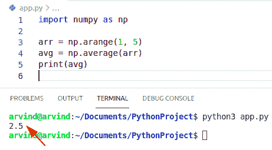

Python numpy average

阅读 [Python NumPy 绝对值示例](https://pythonguides.com/python-numpy-absolute-value/)

## Python numpy 平均值 vs 均值

*   在这种方法中，我们将学习和讨论 numpy 平均值与平均值。
*   这两个函数都可以用来计算算术值和统计值，以找到平均值。
*   np.mean()函数可以有许多其他参数，如 dtype、out、where 等，这些参数在 np.average()函数中是不可用的。
*   如果提供了权重参数，此函数可以计算加权平均值。
*   np.average 不考虑布尔掩码，所以它将生成整个数据集的平均值。而 mean 的情况考虑到布尔掩码，所以只计算非掩码值的平均值。

**举例:**

```py
import numpy as np

arr = np.arange(1, 5)
avg = np.average(arr)
mea = np.mean(arr)
print(avg)
print(mea)
```

下面是以下代码的截图

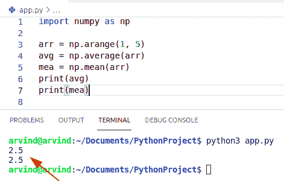

Python numpy average vs mean

阅读 [Python NumPy square 示例](https://pythonguides.com/python-numpy-square/)

## Python numpy 列的平均值

*   在这个方法中，我们将学习和讨论 Python numpy 列平均值。
*   函数的作用是计算数组中所有维度的平均值。
*   它将返回沿给定轴的所有值的 numpy 数组的平均值。
*   x 等于 0，然后等于 1，计算 numpy 模块中每一列和每一行的平均值

**语法:**

```py
numpy.average
             (
              arr,
              axis=None,
              Weights=None,
              returned=False
             )
```

**举例:**

```py
import numpy as np

arr = np.array([[2,3,4],
                [3,6,7],
                [5,7,8]])
a= np.average(arr,axis=0)
print(a)
```

下面是以下代码的截图

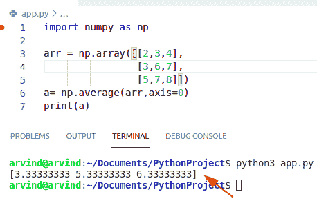

Python numpy average of columns

阅读 [Python NumPy 以列出示例](https://pythonguides.com/python-numpy-to-list/)

## Python numpy 平均二维数组

*   在这个方法中，我们将学习和讨论 Python numpy 平均 2d 数组。
*   若要计算名为 matrix 的二维 NumPy 数组中所有值的平均值，请使用 numpy.average(matrix)函数。
*   输出将显示一个 numpy 数组，该数组有三个平均值，输入给定数组的每一列有一个平均值。

**语法:**

下面是 numpy 平均值的语法

```py
numpy.average
             (
              arr,
              axis=None,
              Weights=None,
              returned=False
             )
```

**举例:**

```py
import numpy as np

arr = np.array([[4,5,6],
                [4,6,7]])# 2D array

a= np.average(arr)
print(a)
```

下面是以下代码的截图

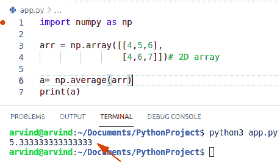

Python numpy average 2d array

读取 [Python NumPy 读取 CSV](https://pythonguides.com/python-numpy-read-csv/)

## Python numpy 平均函数

*   在这种方法中，我们将学习和讨论 numpy 平均函数
*   Python 的 numpy 库提供了一个名为 numpy.average()的函数。基本上，它用于计算沿给定轴的加权平均值。
*   要找到 numpy 数组的平均值，可以使用 np.average()统计函数。
*   这些权重将与这些值相乘，然后计算结果的平均值。

**语法:**

下面是 **NumPy 平均函数**的语法

```py
numpy.average
             (
              arr,
              axis=None,
              Weights=None,
              returned=False
             )
```

**举例:**

```py
import numpy as np

c = np.array([2, 3, 4, 7]).reshape(2,2)
d = np.average(c, axis=0, weights=[0.3,0.7])# average along axis=0
print(d)
```

下面是以下代码的截图

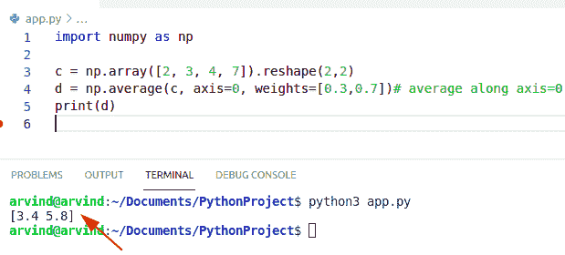

Python numpy average function

阅读 [Python NumPy 日志](https://pythonguides.com/python-numpy-log/)

## Python numpy 平均忽略 nan

*   **在这个方法中，我们将学习和讨论 numpy 平均忽略 nan。**
*   如果 numpy 数组有一个 NaN 值，我们可以很容易地找出平均值，而不受 NaN 值的影响。axis:我们可以使用 axis=1 表示行方式或列方式。
*   在这个方法中，我们将计算加权平均值并创建一个 numpy 数组。
*   numpy.average 考虑了掩码，因此它将生成整个数据集的平均值。而在平均的情况下考虑布尔掩码，所以只计算非掩码值的平均值。

**举例:**

```py
import numpy as np

avg = np.array([[4,5,6], [7,8,np.NaN], [np.NaN,6,np.NaN], [0,0,0]])
data = np.ma.masked_array(avg, np.isnan(avg))
weights = [1, 1, 1]
average = np.ma.average(data, axis=1, weights=weights)
result = average.filled(np.nan)
print(result)
```

下面是以下代码的截图

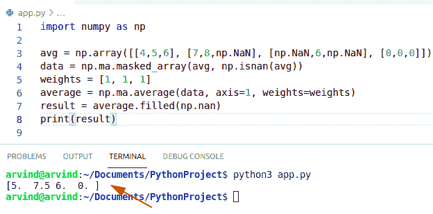

Python numpy average ignore nan

阅读 [Python NumPy where 示例](https://pythonguides.com/python-numpy-where/)

## Python numpy 矩阵的平均值

*   在这种方法中，我们将学习和讨论 numpy 平均矩阵。
*   要单独计算二维矩阵每一列的平均值，请使用函数调用 numpy。average(array，axis=0)将轴参数设置为 0。
*   它将总是返回矩阵的平均值。
*   在这个方法中，我们可以很容易地使用函数 np.average()。

**举例:**

```py
import numpy as np

x = np.matrix(np.arange(12).reshape((3, 4)))
y = np.average(x)
print(y)
```

下面是以下代码的截图

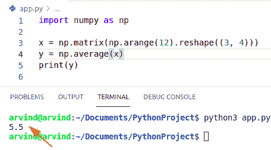

Python numpy average of matrix

阅读 [Python NumPy linspace](https://pythonguides.com/python-numpy-linspace/)

## Python numpy 平均过滤器

*   在这个方法中，我们将学习和讨论 numpy 移动平均滤波器。
*   在 Python 中 np。average()用于时间序列数据，以给定的时间间隔测量数据的平均值。
*   在这种方法中，我们可以很容易地使用函数 numpy.convolve 来测量 numpy 数组的移动平均值。

**举例:**

```py
import numpy as np

def moving_average(x, w):
    return np.convolve(x, np.ones(w), 'valid') / w

data = np.array([2,3,8,4,6,7,8,11,14,17,9,7])

print(moving_average(data,4))
```

下面是以下代码的截图

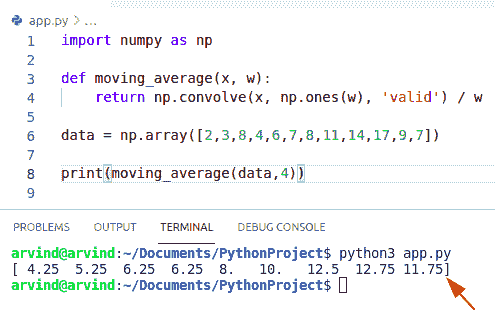

Python numpy average filter

使用 scipy.convolve()函数计算 NumPy 数组平均值的另一种方法。

scipy.convolve()以同样的方式运行。就是消耗的快一点。使用 Python 模块检查移动平均值的另一种方法是使用 cumsum()函数。

**举例:**

```py
import numpy as np

def average(a, n) :
    ret = np.cumsum(a, dtype=float)
    ret[n:] = ret[n:] - ret[:-n]
    return ret[n - 1:] / n

data = np.array([5,4,3,2,10,11,13,14,15,16,19,7])

print(average(data,4))
```

以下是给定代码的屏幕截图

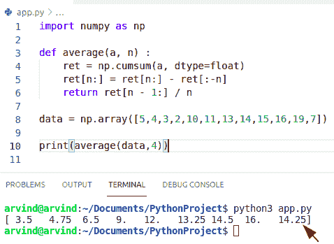

Python numpy average moving filter

使用瓶颈来计算 NumPy 数组的移动平均值**的另一种方法。**

瓶颈模块是快速数字模块的汇编。这个模块有 move_average()函数，可以返回一些数据的移动平均值。

**举例:**

```py
import numpy as np
import bottleneck as bn
import numpy as np
def rollavg_bottlneck(a,n):
    return bn.move_mean(a, window=n,min_count = None)

data = np.array([10,5,8,9,15,22,26,11,15,16,18,7])

print(rollavg_bottlneck(data, 4))
```

下面是以下代码的截图

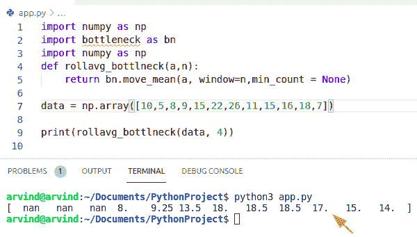

Python NumPy moving average bottleneck

阅读 [Python NumPy concatenate + 9 示例](https://pythonguides.com/python-numpy-concatenate/)

## Python numpy 平均值

*   在这种方法中，我们将学习和讨论 numpy 平均值。
*   在这个方法中，我们将检查如何使用函数 np.average()来计算给定数组的平均值。
*   这个函数返回数组中元素的算术统计平均值。
*   在给定的轴上，计算 float 64 数据类型，返回值用于整数输入。

**语法:**

下面是 **NumPy 平均值**的语法

```py
numpy.average
             (
              arr,
              axis=None,
              Weights=None,
              returned=False
             )
```

**举例:**

```py
import numpy as np

arr = np.array([[1,2,4],
                [3,4,7],
                [5,7,8]])
a= np.average(arr,axis=0)
print(a)
```

下面是以下代码的截图

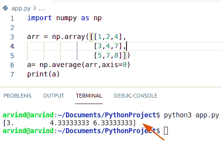

Python numpy average value

您可能会喜欢以下 Python NumPy 文章:

*   [Python 排序 NumPy 数组](https://pythonguides.com/python-sort-numpy-array/)
*   [Python NumPy 计数](https://pythonguides.com/python-numpy-count/)
*   [Python Numpy 独一无二](https://pythonguides.com/python-numpy-unique/)
*   [Python NumPy 删除](https://pythonguides.com/python-numpy-delete/)
*   [Python 绝对值](https://pythonguides.com/python-absolute-value/)
*   [Python Numpy 阶乘](https://pythonguides.com/python-numpy-factorial/)

在本 Python 教程中，我们将讨论 `Python NumPy Average` ，并涵盖以下示例:

*   Python numpy 平均值与平均值
*   Python numpy 列的平均值
*   Python numpy 平均二维数组
*   Python numpy 平均函数
*   Python numpy 平均忽略 nan
*   矩阵的 Python numpy 平均值
*   Python numpy 移动平均过滤器
*   Python numpy 平均值

[Bijay Kumar](https://pythonguides.com/author/fewlines4biju/)

Python 是美国最流行的语言之一。我从事 Python 工作已经有很长时间了，我在与 Tkinter、Pandas、NumPy、Turtle、Django、Matplotlib、Tensorflow、Scipy、Scikit-Learn 等各种库合作方面拥有专业知识。我有与美国、加拿大、英国、澳大利亚、新西兰等国家的各种客户合作的经验。查看我的个人资料。

[enjoysharepoint.com/](https://enjoysharepoint.com/)[](https://www.facebook.com/fewlines4biju "Facebook")[](https://www.linkedin.com/in/fewlines4biju/ "Linkedin")[](https://twitter.com/fewlines4biju "Twitter")