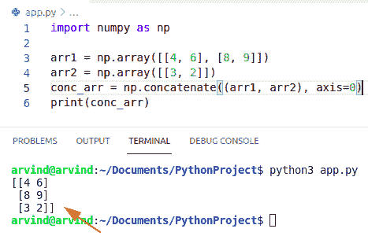
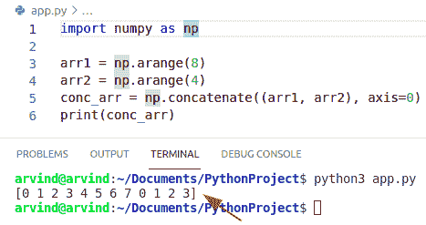
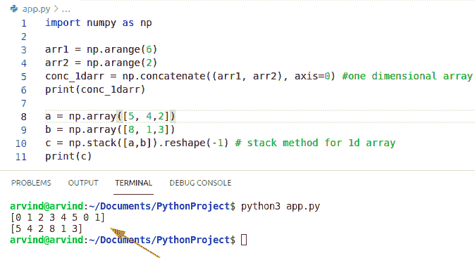
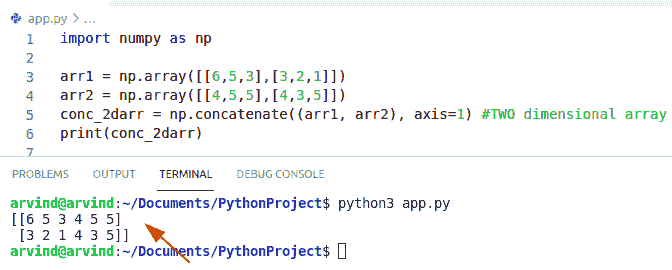
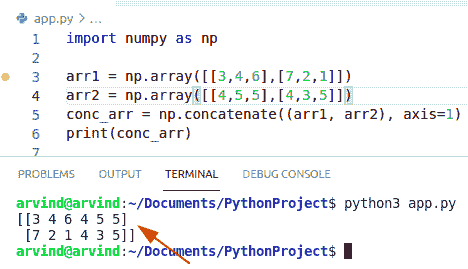
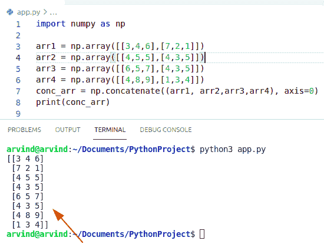
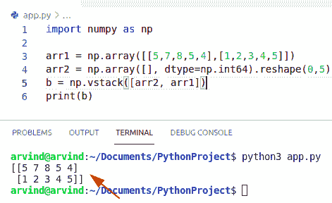
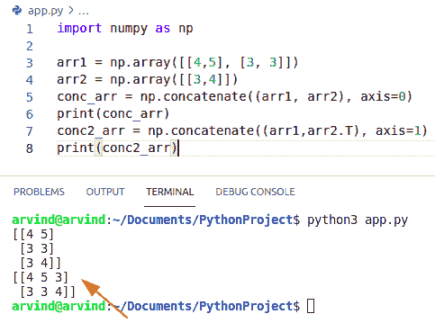
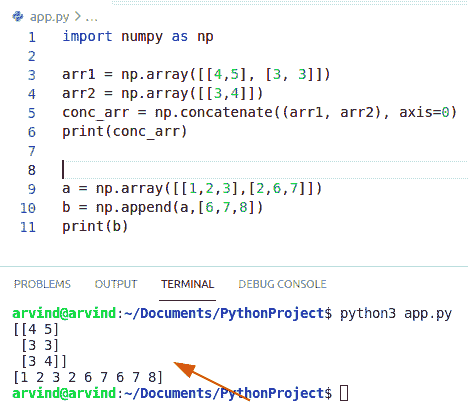
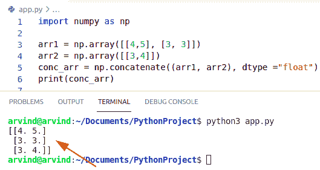

# Python NumPy concatenate + 9 个示例

> 原文：<https://pythonguides.com/python-numpy-concatenate/>

[](https://sharepointsky.teachable.com/p/python-and-machine-learning-training-course)

在本 [Python NumPy 教程](https://pythonguides.com/numpy/)中，我们将讨论 `Python NumPy concatenate` 并涵盖以下示例:

*   Python NumPy 连接数组
*   Python NumPy 连接 1d 数组
*   Python NumPy 连接 2d 数组
*   Python NumPy 连接两个数组
*   Python NumPy 连接多个数组
*   Python NumPy 连接空数组
*   Python NumPy 连接 3d 数组
*   Python NumPy 连接与追加
*   Python NumPy 连接浮点

目录

[](#)

*   [Python NumPy 串接](#Python_NumPy_concatenate "Python NumPy concatenate")
*   [Python NumPy 连接数组](#Python_NumPy_concatenate_arrays "Python NumPy concatenate arrays")
*   [Python NumPy 串联 1d 数组](#Python_NumPy_concatenate_1d_arrays "Python NumPy concatenate 1d arrays")
*   [Python NumPy 串联 2d 数组](#Python_NumPy_concatenate_2d_arrays "Python NumPy concatenate 2d arrays")
*   [Python NumPy 连接 2 个数组](#Python_NumPy_concatenate_2_arrays "Python NumPy concatenate 2 arrays")
*   [Python NumPy 串联多个数组](#Python_NumPy_concatenate_multiple_arrays "Python NumPy concatenate multiple arrays")
*   [Python NumPy 连接空数组](#Python_NumPy_concatenate_empty_array "Python NumPy concatenate empty array")
*   [Python NumPy 连接 3d 数组](#Python_NumPy_concatenate_3d_arrays "Python NumPy concatenate 3d arrays")
*   [Python 数字拼接 vs 追加](#Python_NumPy_concatenation_vs_append "Python NumPy concatenation vs append")
*   [Python NumPy concatenate float](#Python_NumPy_concatenate_float "Python NumPy concatenate float")

## Python NumPy 串接

*   在本节中，我们将了解 `python NumPy concatenate` 。
*   Concatenate 是指沿现有轴连接一系列数组。
*   在 `NumPy concatenate` 中我们可以很容易地使用函数 `np.concatenate()` 。
*   此函数用于沿现有轴连接两个或多个给定的 NumPy 数组。
*   我们需要使用包含三个参数的 NumPy.concatenate 方法，第一个是数组。
*   这里您需要提到您想要加入或连接的数组。
*   但是在取数组的时候，你应该记住你不能连接不同维度的数组
*   数组的维数应该相同。

**语法:**

下面是 numpy concatenate 的语法

```py
numpy.concatenate
                 (
                  arrays,
                  axis=0,
                  out=None
                 )
```

1.  **数组:**数组必须具有相同的形状，除了与轴对应的维度。(默认情况下是第一个)。
2.  **轴:**你想沿着哪个轴连接 [NumPy 数组](https://pythonguides.com/python-numpy-array/)，缺省值为 0，除了第一个轴什么都没有。所以在一个维度中，它只包含一个维度，基于那个轴，你可以连接 NumPy 个数组。当您将轴设为 none 时，它将首先展平给定的 NumPy 数组，然后连接这些数组。
3.  **Out:** 缺省值为 none，如果这是放置结果的目的地，你可以将连接数组存储在另一个数组或任何其他目的地。

**举例:**

```py
import numpy as np

arr1 = np.array([[4, 6], [8, 9]])
arr2 = np.array([[3, 2]])
conc_arr = np.concatenate((arr1, arr2), axis=0)
print(conc_arr)
```

以下是给定代码的截图



Python numpy concatenate

这就是 NumPy concatenate 的工作方式。

阅读:[Python NumPy Random+Examples](https://pythonguides.com/python-numpy-random/)

## Python NumPy 连接数组

*   在这一节中，我们将了解到 **Python NumPy concatenate 数组**。
*   在 numpy concatenate 数组中，我们可以很容易地使用函数 np.concatenate()。
*   它可用于连接两个按行或按列排列的数组。
*   Concatenate 函数可以接受两个或更多相同形状的数组，默认情况下，它按行连接，这意味着 axis=0。
*   首先，我们从排列函数中创建一个数组。所以如果我想加入两个给定的数组，我需要提到 np。连接函数。
*   当您将轴设为 none 时，它将首先展平给定的 NumPy 数组，然后连接这些数组。

**语法:**

下面是 **numpy 连接数组**的语法

```py
numpy.concatenate
                 (
                  arrays,
                  axis=0,
                  out=None
                 )
```

**举例:**

```py
import numpy as np

arr1 = np.arange(8)
arr2 = np.arange(4)
conc_arr = np.concatenate((arr1, arr2), axis=0)
print(conc_arr)
```

以下是给定代码的截图



Python numpy concatenate arrays

上面的代码我们可以用来在 Python NumPy 中**连接数组。**

阅读 [Python NumPy nan](https://pythonguides.com/python-numpy-nan/)

## Python NumPy 串联 1d 数组

*   在本节中，我们将学习 python numpy concatenate 1d 数组。
*   一维数组是指单行中同质数据的集合。它也被称为矢量。当它是单行或 1D 数组时，您只需要使用一个方括号。
*   在 numpy concatenate 1d 数组中，我们可以很容易地使用函数 np.concatenate()。
*   在这个方法中，取两个一维数组并将它们连接成一个数组序列。
*   所以你必须在 concatenate 函数中传递数组，因为 concatenate 函数是用来连接数组序列的。
*   我们也可以使用 numpy 函数。stack()来联接数组序列。

**语法:**

下面是 numpy concatenate 1d 数组的语法

```py
numpy.concatenate
                 (
                  arrays,
                  axis=0,
                  out=None
                 )
```

**举例:**

```py
import numpy as np

arr1 = np.arange(6)
arr2 = np.arange(2)
conc_1darr = np.concatenate((arr1, arr2), axis=0) #one dimensional array
print(conc_1darr)

a = np.array([5, 4,2])
b = np.array([8, 1,3])
c = np.stack([a,b]).reshape(-1) # stack method for 1d array
print(c)
```

以下是给定代码的截图



Python numpy concatenate 1d arrays

这就是如何在 Python NumPy 中连接 1d 数组。

读取:[检查 Python 中的 NumPy 数组是否为空](https://pythonguides.com/check-if-numpy-array-is-empty/)

## Python NumPy 串联 2d 数组

*   在本节中，我们将学习 python numpy concatenate 2d 数组。
*   二维数组是指一个列表的列表中同质数据的集合。它也被称为矩阵。在 2D 数组中，你必须使用两个方括号，这就是为什么它表示列表的列表。
*   在二维空间中，它包含两个基于轴的轴，您可以连接 numpy 数组。
*   在 numpy concatenate 2d 数组中，我们可以很容易地使用函数 np.concatenate()。
*   在此方法中，轴值为 1，以连接按列排列的元素。

**语法:**

下面是 numpy concatenate 2d 数组的语法

```py
numpy.concatenate
                 (
                  arrays,
                  axis=1,
                  out=None
                 )
```

**举例:**

```py
import numpy as np

arr1 = np.array([[6,5,3],[3,2,1]])
arr2 = np.array([[4,5,5],[4,3,5]])
conc_2darr = np.concatenate((arr1, arr2), axis=1) #TWO dimensional array
print(conc_2darr)
```

以下是给定代码的截图



Python NumPy concatenate 2d arrays

这就是如何使用 Python NumPy 来**连接 2d 数组。**

阅读 [Python NumPy shape 示例](https://pythonguides.com/python-numpy-shape/)

## Python NumPy 连接 2 个数组

*   在本节中，我们将了解到 **python NumPy concatenate 2 数组**。
*   我们可以用函数 np 来连接两个数组。串联。
*   要按行或列连接两个数组，我们可以使用轴参数。
*   我们还可以使用另一种方法 Vstack，意思是垂直堆叠。在这种情况下，元素将以垂直方式添加。
*   在此方法中，轴值为 1，以连接按列排列的元素。

**语法:**

下面是 numpy concatenate 2 数组的语法

```py
numpy.concatenate
                 (
                  arrays,
                  axis=1,
                  out=None
                 )
```

**举例:**

```py
import numpy as np

arr1 = np.array([[3,4,6],[7,2,1]])
arr2 = np.array([[4,5,5],[4,3,5]])
conc_arr = np.concatenate((arr1, arr2), axis=1) 
print(conc_arr)
```

以下是给定代码的截图



Python numpy concatenate 2 arrays

这就是如何在 Python NumPy 中连接两个数组。

阅读: [Python NumPy zeros](https://pythonguides.com/python-numpy-zeros/)

## Python NumPy 串联多个数组

*   在本节中，我们将了解到 **python numpy 连接多个数组**。
*   在多个数组中，我们可以很容易地使用 np 方法。连接()。
*   这个函数本质上结合了一个 NumPy 数组。
*   这个函数可以垂直和水平操作，这意味着我们可以水平或垂直地将数组连接在一起。

**语法:**

下面是 numpy 连接多个数组的语法

```py
numpy.concatenate
                 (
                  arrays,
                  axis=1,
                  out=None
                 )
```

**举例**:

```py
import numpy as np

arr1 = np.array([[3,4,6],[7,2,1]])
arr2 = np.array([[4,5,5],[4,3,5]])
arr3 = np.array([[6,5,7],[4,3,5]])
arr4 = np.array([[4,8,9],[1,3,4]])
conc_arr = np.concatenate((arr1, arr2,arr3,arr4), axis=0) 
print(conc_arr)
```

以下是给定代码的截图



Python numpy concatenate multiple arrays

在上面的例子中，我们看到了如何使用 Python NumPy 连接多个数组。

读取 [Python 数字堆栈](https://pythonguides.com/python-numpy-stack/)

## Python NumPy 连接空数组

*   在这一节中，我们将了解到 **python NumPy concatenate 空数组**。
*   在这个方法中，我们可以很容易地使用函数 np.stack()。
*   函数的作用是:垂直按行顺序堆叠数组
*   在空数组中，它将以 ndarray 的形式返回输出。
*   Empty 与创建没有元素的空数组没有任何关系。

**语法:**

下面是 numpy 连接空数组的语法

```py
numpy.vstack
            (
            arrays,
            axis=0,
            out=None
            )
```

**举例:**

```py
import numpy as np

arr1 = np.array([[5,7,8,5,4],[1,2,3,4,5]])
arr2 = np.array([], dtype=np.int64).reshape(0,5)
b = np.vstack([arr2, arr1])
print(b)
```

以下是给定代码的截图



Python numpy concatenate empty array

这就是如何在 Python NumPy 中连接空数组。

阅读: [Python NumPy Sum +示例](https://pythonguides.com/python-numpy-sum/)

## Python NumPy 连接 3d 数组

*   在本节中，我们将了解到 **Python NumPy concatenate 3d 数组**。
*   在这个方法中，我们可以很容易地使用 np.concatenate()函数。
*   三维数组由 3 个嵌套层次的数组组成，每个维度一个
*   在此方法中，轴值为 0 和 1，用于连接列和行元素。

**语法:**

```py
numpy.concatenate
                 (
                  arrays,
                  axis=1,
                  out=None
                 )
```

**举例:**

```py
import numpy as np

arr1 = np.array([[4,5], [3, 3]])
arr2 = np.array([[3,4]])
conc_arr = np.concatenate((arr1, arr2), axis=0)
print(conc_arr)
conc2_arr = np.concatenate((arr1,arr2.T), axis=1)
print(conc2_arr)
```

以下是给定代码的截图



Python numpy concatenate 3d arrays

这就是如何使用 Python NumPy 连接 3d 数组。

读取[未找到 Python 编号](https://pythonguides.com/python-numpy-not-found/)

## Python 数字拼接 vs 追加

*   在这一节中，我们将了解 **NumPy 连接与追加**。
*   Numpy append 函数允许我们向现有 Numpy 数组的末尾添加新值。
*   此函数返回一个现有数组的副本，其值附加到指定的轴上。
*   在串联中，它可以用来串联两个数组，无论是按行还是按列。
*   在这个方法中，我们可以同时使用 np.append()和 np.concatenate()方法。
*   append 方法将在数组末尾添加一个项，而 Concatenation 函数将允许我们将两个数组加在一起。
*   在 concatenate 函数中，输入可以是任何维度，而在 append 函数中，所有输入必须是同一维度。
*   在 Concatenate 中，输出数组将是 n 维的，而在 append 函数的情况下，输出将是(n+1)维数组。

**语法:**

下面是 concatenate 函数的语法

```py
numpy.concatenate
                 (
                  arrays,
                  axis=1,
                  out=None
                 )
```

下面是 append 函数的语法

```py
numpy.append
            (
             arrays,
             axis=0,
             out=None
            )
```

**举例:**

```py
import numpy as np

arr1 = np.array([[4,5], [3, 3]])
arr2 = np.array([[3,4]])
conc_arr = np.concatenate((arr1, arr2), axis=0)
print(conc_arr)

a = np.array([[1,2,3],[2,6,7]])
b = np.append(a,[6,7,8])
print(b)
```

以下是给定代码的截图



Python numpy concatenate vs append

阅读: [Python NumPy arange +示例](https://pythonguides.com/python-numpy-arange/)

## Python NumPy concatenate float

*   在本节中，我们将了解到 `NumPy concatenate float` 。
*   在 NumPy concatenate 中，函数头中 dtype 参数的默认值是 None。
*   如果要手动指定数据类型，可以使用 dtype 参数。
*   在这种情况下，当我们设置 dtype = float 时，concatenate 函数产生一个 nd。数组对象。

**语法:**

下面是 concatenate float 函数的语法

```py
numpy.concatenate
                 (
                  arrays,
                  axis=1,
                  dtype=float
                  out=None
                 )
```

**举例:**

```py
import numpy as np

arr1 = np.array([[4,5], [3, 3]])
arr2 = np.array([[3,4]])
conc_arr = np.concatenate((arr1, arr2), dtype ="float")
print(conc_arr)
```

以下是给定代码的截图



Python numpy concatenate float

这就是如何使用 Python NumPy 连接 float。

您可能还会喜欢以下 Python 教程:

*   [Python NumPy append + 9 示例](https://pythonguides.com/python-numpy-append/)
*   [Python NumPy 矩阵](https://pythonguides.com/python-numpy-matrix/)
*   [Python Numpy 独一无二](https://pythonguides.com/python-numpy-unique/)
*   [Python 排序 NumPy 数组](https://pythonguides.com/python-sort-numpy-array/)

在本 python 教程中，我们将讨论 `Python numpy concatenate` ，并涵盖以下示例:

*   Python numpy 连接数组
*   Python numpy 连接 1d 数组
*   Python numpy 连接 2d 数组
*   Python numpy 连接两个数组
*   Python numpy 连接多个数组
*   Python numpy 连接空数组
*   Python numpy 连接 3d 数组
*   Python numpy 连接与追加
*   Python numpy 连接浮点

[Bijay Kumar](https://pythonguides.com/author/fewlines4biju/)

Python 是美国最流行的语言之一。我从事 Python 工作已经有很长时间了，我在与 Tkinter、Pandas、NumPy、Turtle、Django、Matplotlib、Tensorflow、Scipy、Scikit-Learn 等各种库合作方面拥有专业知识。我有与美国、加拿大、英国、澳大利亚、新西兰等国家的各种客户合作的经验。查看我的个人资料。

[enjoysharepoint.com/](https://enjoysharepoint.com/)[](https://www.facebook.com/fewlines4biju "Facebook")[](https://www.linkedin.com/in/fewlines4biju/ "Linkedin")[](https://twitter.com/fewlines4biju "Twitter")