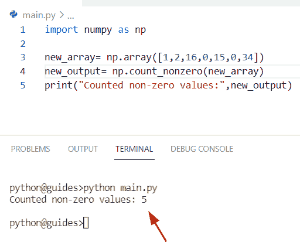
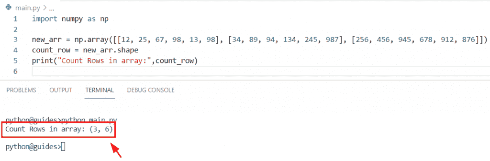

# Python NumPy 计数–有用的指南

> 原文：<https://pythonguides.com/python-numpy-count/>

[](https://sharepointsky.teachable.com/p/python-and-machine-learning-training-course)

在本 [Python NumPy 教程](https://pythonguides.com/numpy/)中，我们将学习**如何计算 NumPy 数组** Python 中值的个数。通过 **Python NumPy 计数函数**，我们将涵盖这些主题。

*   Python numpy 计数出现次数
*   Python numpy 计数值
*   Python numpy 计数非零
*   Python numpy 计算数组中的值
*   Python numpy 计数为真
*   Python numpy 计数 nan
*   Python numpy 计数零
*   Python numpy 计数为正
*   Python numpy 计数行
*   Python numpy 计数在哪里
*   列表中的 Python numpy 计数元素
*   Python numpy 计算唯一值
*   Python numpy 计数函数

目录

[](#)

*   [Python NumPy 计数](#Python_NumPy_count "Python NumPy count")
*   [Python numpy 计数出现次数](#Python_numpy_count_occurrences "Python numpy count occurrences")
*   [Python numpy 计数值](#Python_numpy_count_values "Python numpy count values")
*   [Python numpy 计数非零](#Python_numpy_count_nonzero "Python numpy count nonzero")
*   [Python numpy 数组中的计数值](#Python_numpy_count_values_in_array "Python numpy count values in array")
*   [Python numpy count true](#Python_numpy_count_true "Python numpy count true")
*   [Python numpy 计数 nan](#Python_numpy_count_nan "Python numpy count nan")
*   [Python numpy 计数零](#Python_numpy_count_zeros "Python numpy count zeros")
*   [Python numpy 计数正数](#Python_numpy_count_positive "Python numpy count positive")
*   [Python numpy 计数行数](#Python_numpy_count_rows "Python numpy count rows")
*   [Python numpy count where](#Python_numpy_count_where "Python numpy count where")
*   [Python numpy 计数列表中的元素](#Python_numpy_count_element_in_list "Python numpy count element in list")
*   [Python numpy 计数唯一值](#Python_numpy_count_unique_values "Python numpy count unique values")
*   [Python numpy 计数函数](#Python_numpy_count_function "Python numpy count function")

## Python NumPy 计数

*   在本节中，我们将讨论如何计算 Python NumPy 数组中值的数量。
*   为了完成这个任务，我们将使用 `numpy.char.count()` 函数。在 Python 中，该函数用于返回给定字符串的出现次数。这个方法有四个参数，可以在 NumPy 包模块中找到。
*   在 Python 中，我们在 NumPy 包中没有 count 函数。因此，我们将使用实际的函数，即 `numpy.char.count()` ，它将始终返回一个 numpy 数组，其中包含列表中每个单词的非重叠出现次数。

**语法:**

让我们看一下语法并理解 Python`numpy . char . count()`的工作原理

```py
char.count
          (
           a,
           sub,
           start=0,
           end=None
          )
```

*   它由几个参数组成
    *   **a:** 该参数表示输入数组，也可以是输入字符串，数据类型为字符串或数组。
    *   **sub:** 这是一个参数，表示要在提供的输入数组中搜索的子字符串。
    *   start:默认情况下，它采用 `0` 值，用于设置要搜索的子字符串内部的边界。开始和结束参数根据给定的需求单独使用。

**举例:**

让我们举一个例子，看看如何计算 NumPy 数组中值的数量

**源代码:**

```py
import numpy as np

new_array = np.array(['yquwwi','wwibgf','asdwwij','wbsbwwikl','wwidvhgqqd'])
print("Creation of array:",new_array)
result =np.char.count(new_array,'wwi')
print("Count numbers:",result)
```

在上面的代码中，我们导入了 numpy 模块，然后我们必须无限制地搜索子串。在这个例子中，NumPy 数组中有五个字符串，我们必须对**‘WWI’**子字符串进行计数。

下面是以下给定代码的执行过程


Python NumPy count

另外，查看: [Python NumPy 最小教程](https://pythonguides.com/python-numpy-minimum/)

## Python numpy 计数出现次数

*   在这个程序中，我们将学习如何计算 Python NumPy 数组中元素的出现次数。
*   为了执行这个特定的任务，我们将使用 `bincount()` 函数。在 Python **中，numpy.bincount()** 用于计算 numpy 数组中每个元素出现的次数。该方法有三个参数，numpy 数组中的所有值都必须是整数数据类型。
*   out 的长度等于 `np.amax(x)+1` 。例如，假设我们有一个包含整数值**【2，23，45，6，7，8】**的数组，那么 bin 的大小将是 46，因为 `45` 是数组中的最大数。

**语法:**

让我们看一下语法并理解 Python `numpy.bincount()` 函数的工作原理

```py
numpy.bincount
              (
               x,
               weights=None,
               minlength=0
              )
```

*   它由几个参数组成
    *   **x:** 该参数表示输入数组。
    *   **weights:** 默认取 none 值，是一个相同形状的附加数组。
    *   **minlength:** 表示输出数组的最小箱数。

**举例:**

让我们举一个例子，看看如何计算数组中元素的出现次数

**源代码:**

```py
import numpy as np

new_array = np.array([24, 15,27,38,15,16,25,38,485,15,16,15])
result = np.bincount(new_array)
count_num= result[15]
print("count occurrence:",count_num)
```

在上面的程序中，我们必须计算 numpy 数组中值**‘15’**的出现次数。通过使用 `numpy.bincount()` 函数，我们可以很容易地返回数组中元素**‘15’**的出现次数。一旦您将打印 **'count_num'** ，那么输出将显示 **'4'** 。

下面是以下给定代码的实现


Python numpy count occurrences

阅读: [Python NumPy 栈示例](https://pythonguides.com/python-numpy-stack/)

## Python numpy 计数值

*   让我们看看如何使用 `collection.counter()` 方法对 Python numpy 数组中的值进行计数。
*   在本例中，我们将导入集合模块以使用 `collection.counter()` 函数。在 Python 中，这个函数用于计算类似容器的数组中的每个元素，它是无序的集合，存储的值作为字典键，计数作为值。
*   该方法在收集模块包中可用，也可以将 iterable 用作创建计数器对象的参数。

**源代码:**

```py
import numpy as np
import collections

new_values = np.array([16,34,56,16,56,72,16,56,34,72,16])
result=collections.Counter(new_values)
print("Count values in array:",result)
```

在上面的程序中，我们有一个包含整数值的数组，当你在数组中使用 `counter()` 函数时，它会计算数组值重复出现的次数。

下面是以下代码的截图


Python numpy count values

阅读: [Python NumPy round + 13 示例](https://pythonguides.com/python-numpy-round/)

## Python numpy 计数非零

*   在本节中，我们将讨论如何对 Python numpy 数组中的非零值进行计数。
*   在 Python count **中，非零()**表示对给定 numpy 数组中的非零值进行计数。为了执行这个特定的任务，我们将使用 `numpy.count_zero()` 函数。这个方法将帮助用户找到输入数组中非零元素的计数。
*   这个方法在 numpy 包模块中可用，它有三个参数，并且总是返回 numpy 数组中的非零值的总数。

**语法:**

下面是 Python**numpy . count _ 非零()**函数的语法

```py
numpy.count
           (
            a,
            axis=None,
            *,
            keepdims=False,
           )
```

*   它由几个参数组成
    *   **答:**这个参数表示我们要计算非零值的输入数组。
    *   **轴:**默认取 none 值，表示非零值将与展平数组一起计数。
    *   **keepdims:** 这是一个可选参数，代表布尔值。默认情况下，它将被视为右侧的轴设置为“假”。

**举例:**

让我们举个例子，了解一下**numpy . count _ 非零()**函数的工作原理

**源代码:**

```py
import numpy as np

new_array= np.array([1,2,16,0,15,0,34])
new_output= np.count_nonzero(new_array)
print("Counted non-zero values:",new_output)
```

在上面的代码中，我们导入了 numpy 库，然后使用 `numpy.array()` 函数初始化了一个数组。之后，我们声明了一个变量**‘new _ output’**，然后赋了一个函数**NP . count _ 非零()**。一旦您将打印**‘new _ output’**，那么输出将显示非零值的计数。

下面是以下给定代码的实现



Python numpy count nonzero

读: [Python NumPy argsort](https://pythonguides.com/python-numpy-argsort/)

## Python numpy 数组中的计数值

*   在本期节目中，我们将讨论如何对 NumPy 数组 Python 中的值进行计数。
*   通过使用数组条件和 `sum()` 方法，我们可以轻松地执行这个特定的任务。首先，我们将使用 `np.array()` 函数创建一个数组，并为其分配整数值。
*   现在我们将声明一个变量**‘z’**并应用条件，如果**‘18’**值在数组中可用，那么它将计算这些值。

**举例:**

```py
import numpy as np

array_values = np.array([12,14,15,12,14,17,18,19,21,12,18])
z=(array_values == 18).sum()
print("Count values:",z)
```

下面是以下给定代码的输出


Python numpy count values in an array

阅读: [Python NumPy 重复](https://pythonguides.com/python-numpy-repeat/)

## Python numpy count true

*   在本节中，我们将讨论如何在 NumPy 数组 Python 中计数时获取真值。
*   为了执行这个特定的任务，我们将使用 `numpy.count_zero()` 函数。这个方法将帮助用户找到输入数组中非零元素的计数。
*   在这个例子中，我们将非零数字视为**‘真’**，而零数字视为**‘假’**。一旦你将打印“结果”，那么输出将显示数字**‘5’**，表明在一个给定的数组中有多少真值可用。

**源代码:**

```py
import numpy as np

new_array = np.array([True, False,True, False, False, True, True, True, False])
result = np.count_nonzero(new_array)
print("Count true values:",result)
```

你可以参考下面的截图


Python numpy count true

阅读: [Python NumPy 数据类型](https://pythonguides.com/python-numpy-data-types/)

## Python numpy 计数 nan

*   让我们看看如何通过使用 np.count_zero()函数对 NumPy 数组 Python 中的 nan 值进行计数。
*   在这个例子中，我们将使用 `numpy.array()` 函数初始化一个数组，并在其中包含 integer 和 nan 值。现在我们只想对给定数组中的 nan 值进行计数。
*   为了完成这个任务，我们将使用**NP . count _ 非零()**函数，并将 array 指定为一个参数。打印“新结果”后，将显示 nan 值的计数。

**语法:**

下面是**NP . count _ 非零()**函数的语法

```py
numpy.count
           (
            a,
            axis=None,
            *,
            keepdims=False,
           )
```

**举例:**

```py
import numpy as np

new_values= np.array([np.nan,np.nan,np.nan,0,np.nan,0,np.nan])
new_result= np.count_nonzero(new_values)
print("Counted nan values:",new_result)
```

下面是以下给定代码的执行过程


Python numpy count nan

阅读: [Python NumPy 2d 数组](https://pythonguides.com/python-numpy-2d-array/)

## Python numpy 计数零

*   在本节中，我们将讨论如何计算 Python NumPy 数组中的零值。
*   为了完成这项任务，我们将创建一个数组，并为其分配整数值。之后，我们使用了**NP . count _ 非零()**函数，并设置了条件 `new_values==0` ，表明当我们执行该程序时，它将检查数组中有多少个零可用的条件。

**源代码:**

```py
import numpy as np

new_values= np.array([0,1,12,0,24,0,8,0])
result= np.count_nonzero(new_values==0)
print("Count zero values:",result)
```

下面是以下给定代码的实现


Python numpy count zeros

阅读: [Python NumPy 拆分](https://pythonguides.com/python-numpy-split/)

## Python numpy 计数正数

*   在这一节中，我们将讨论 tp 如何计算 Python numpy 数组中的正值。
*   通过使用 np.sum()方法，我们可以很容易地解决这个问题。在 Python 中，此方法用于生成所有值的总和。在这个例子中，我们刚刚创建了一个数组，并分配了正值和负值。
*   现在声明一个变量**‘d’**并应用 `np.sum()` 函数。在这个函数中，我们指定了**条件> 0** 来表示正值的计数。

**举例:**

```py
import numpy as np

new_array = np.array([[15, 26, 78, 84, -76, 32], [17, 24, 83, -47, -93, 29], [123, 65, 39, 99, -26, 162]])
d= np.sum((new_array) >= 0, axis=0)
print(d)
```

下面是以下代码的截图


Python numpy count positive

阅读: [Python NumPy 3d 数组](https://pythonguides.com/python-numpy-3d-array/)

## Python numpy 计数行数

*   在这个程序中，我们将讨论如何计算 Python NumPy 数组中的行数。
*   为了完成这个任务，我们将使用 `numpy.shape()` 方法。在 Python 中，该方法用于检查给定数组的形状和大小，它将以整数元组的形式返回。
*   这个方法在 numpy 包模块中可用，它将显示 numpy 数组的长度。

**语法:**

下面是 Python `numpy.shape()` 的语法

```py
numpy.shape(a)
```

**举例:**

```py
import numpy as np

new_arr = np.array([[12, 25, 67, 98, 13, 98], [34, 89, 94, 134, 245, 987], [256, 456, 945, 678, 912, 876]])
count_row = new_arr.shape
print("Count Rows in array:",count_row)
```

在上面的代码中，我们导入了 numpy 库，然后使用 `numpy.array()` 函数初始化了一个数组。之后，我们声明一个变量，并给 n `umpy.shape()` 函数赋值。一旦您将打印**‘count _ row’**，那么输出将显示计数的行。

下面是以下代码的截图



Python numpy count rows

阅读: [Python NumPy Replace +示例](https://pythonguides.com/python-numpy-replace/)

## Python numpy count where

*   在本期节目中，我们将讨论如何在 numpy**count _ 非零()**函数中使用 where 条件。
*   这个方法将帮助用户找到输入数组中非零元素的计数。

**语法:**

下面是 numpy count_nonzer()函数的语法

```py
numpy.count
           (
            a,
            axis=None,
            *,
            keepdims=False,
           )
```

**源代码:**

```py
import numpy as np

new_array = np.array([24, 15,27,38,15,16,25,38,485,15,16,15])
print(np.count_nonzero(new_array < 45))
```

下面是以下代码的截图


Python numpy count where

阅读: [Python NumPy 矩阵乘法](https://pythonguides.com/python-numpy-matrix-multiplication/)

## Python numpy 计数列表中的元素

*   在本节中，我们将讨论如何对 Python 列表中的元素进行计数。
*   为了完成这个任务，我们将使用 `len()` 函数。在 Python 中， `len()` 是 Python 中的一个内置函数，它用于获取列表的长度或计数。
*   这个方法将总是返回列表的长度，它将帮助用户轻松地获得 Python 列表中的数字计数。

**举例:**

```py
new_list = [45, 67, 98,145, 28]

lis_count = len(new_list)
print("Counted numbers in list:",lis_count)
```

下面是以下给定代码的实现


Python numpy count element in a list

现在我们将看到列表中 Python numpy count 元素的另一个例子

*   通过使用 list `count()` 函数，我们可以轻松地执行这个特定的任务，而 `count()` 是 Python 中的一个内置函数。
*   在 Python 中，该方法用于获取 Python 列表中给定元素的计数，该函数用于列表和字符串中。
*   该方法只接受一个参数，并且总是返回 Python 列表中给定值的计数。

**语法:**

下面是 `list count()` 方法的语法

```py
list.count(element)
```

**举例:**

让我们看看这个例子，理解 list count()方法的工作原理

**源代码:**

```py
lis_ele = [156, 245, 345,896, 28,98,98]

lis_count = lis_ele.count(98)
print("Counted numbers in list:",lis_count)
```

在下面的代码中，我们创建了一个只包含整数值的列表。接下来，我们声明了一个变量**‘lis _ count’**，并分配了 `list.count()` 函数。

你可以参考下面的截图


Python numpy count element in a list

阅读: [Python NumPy 添加教程](https://pythonguides.com/python-numpy-add/)

## Python numpy 计数唯一值

*   在本节中，我们将讨论如何计算 Python 中的唯一值。
*   为了完成这项任务，我们将应用 `numpy.unique()` 函数的概念。获取 numpy 唯一函数的详细信息。你可以参考我们的 [Python numpy unique](https://pythonguides.com/python-numpy-unique/) 文章。

**源代码:**

```py
import numpy as np

new_array = [16,16,17,16,27,27,18,17,18]
result=np.array(np.unique(new_array, return_counts=True)).T
print("Count unique values:",result)
```

在下面的代码中，我们导入了 numpy 库，然后使用 `np.array()` 函数初始化了一个数组。接下来，我们使用了 `np.unique()` 函数，并将 return_counts 作为参数传递。一旦你将打印**‘结果’**，那么输出显示计数的唯一值的数字。

下面是以下给定代码的执行过程


Python numpy count unique values

阅读: [Python NumPy 索引](https://pythonguides.com/python-numpy-indexing/)

## Python numpy 计数函数

*   在这个程序中，我们将学习如何在 Python numpy 数组中使用 `count()` 函数。
*   通过使用 `np.char.count()` 函数，我们可以解决这个问题，这个函数将总是返回一个 numpy 数组，其中包含列表中每个单词的非重叠出现次数。

**语法:**

下面是 `numpy.char.count()` 函数的语法

```py
char.count
          (
           a,
           sub,
           start=0,
           end=None
          )
```

**举例:**

```py
import numpy as np

new_values = np.array(['16723','787224','8972876','244523'])
print("Creation of array:",new_values)
new_output =np.char.count(new_values,'72')
print("Count numbers:",new_output)
```

在上面的代码中，我们导入了 numpy 库，然后使用 `np.array()` 函数创建了一个 NumPy 数组。接下来，我们使用了 np.char.count()函数，在这个例子中，NumPy 数组中有四个字符串，我们必须对【T2 72】子字符串进行计数。

下面是以下给定代码的输出


Python numpy count function

另外，看看更多关于 Python NumPy 的教程。

*   [Python NumPy 过滤器+ 10 个例子](https://pythonguides.com/python-numpy-filter/)
*   [Python 复制 NumPy 数组](https://pythonguides.com/python-copy-numpy-array/)
*   [Python NumPy 删除–完整教程](https://pythonguides.com/python-numpy-delete/)
*   [Python NumPy Normalize +示例](https://pythonguides.com/python-numpy-normalize/)
*   [Python NumPy Savetxt +示例](https://pythonguides.com/python-numpy-savetxt/)
*   [Python NumPy Median +示例](https://pythonguides.com/python-numpy-median/)
*   [Python NumPy genfromtxt()–完整教程](https://pythonguides.com/python-numpy-genfromtxt/)

在这个 Python NumPy 教程中，我们已经学习了**如何计算 NumPy 数组** Python 中值的个数。此外，我们还讨论了这些主题。

*   Python numpy 计数出现次数
*   Python numpy 计数值
*   Python numpy 计数非零
*   Python numpy 计算数组中的值
*   Python numpy 计数为真
*   Python numpy 计数 nan
*   Python numpy 计数零
*   Python numpy 计数为正
*   Python numpy 计数行
*   Python numpy 计数在哪里
*   列表中的 Python numpy 计数元素
*   Python numpy 计算唯一值
*   Python numpy 计数函数

[Bijay Kumar](https://pythonguides.com/author/fewlines4biju/)

Python 是美国最流行的语言之一。我从事 Python 工作已经有很长时间了，我在与 Tkinter、Pandas、NumPy、Turtle、Django、Matplotlib、Tensorflow、Scipy、Scikit-Learn 等各种库合作方面拥有专业知识。我有与美国、加拿大、英国、澳大利亚、新西兰等国家的各种客户合作的经验。查看我的个人资料。

[enjoysharepoint.com/](https://enjoysharepoint.com/)[](https://www.facebook.com/fewlines4biju "Facebook")[](https://www.linkedin.com/in/fewlines4biju/ "Linkedin")[](https://twitter.com/fewlines4biju "Twitter")