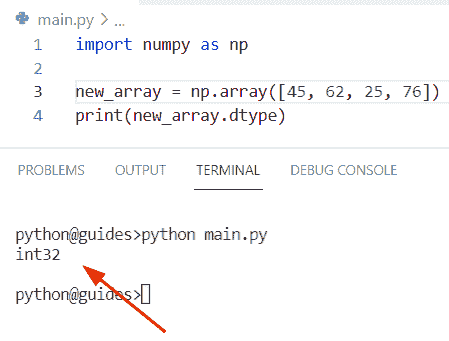
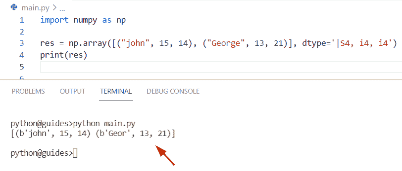
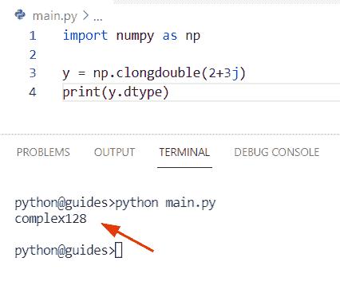

# Python NumPy 数据类型

> 原文：<https://pythonguides.com/python-numpy-data-types/>

[](https://sharepointsky.teachable.com/p/python-and-machine-learning-training-course)

在本 Python 教程中，我们将学习**如何在 NumPy Python** 中使用数据类型。此外，我们将涵盖这些主题。

*   NumPy 数据类型字符串
*   NumPy 数据类型大小
*   NumPy 数据类型浮点型
*   NumPy 数据类型列表
*   NumPy 数据类型日期时间
*   NumPy 数据类型更改
*   Numpy 数据类型范围
*   Numpy 数据类型检查
*   NumPy 数据类型及示例
*   具有不同数据类型的 Numpy 数组
*   混合数据类型的 NumPy 数组
*   NumPy 空数据类型
*   NumPy 随机数据类型
*   NumPy 数据类型元组
*   为文本命名两种 numpy 数据类型
*   NumPy 数据类型 uint8
*   Numpy 更改数据类型 uint8
*   无法理解 NumPy 数据类型字符串
*   Pandas 中的 NumPy 数据类型
*   NumPy loadtxt 中的数据类型
*   Numpy 获取元素的数据类型
*   NumPy 更改列的数据类型
*   NumPy 数据类型溢出
*   Numpy 数据类型必须提供项目大小
*   NumPy 添加数据类型
*   Numpy 结构化数组数据类型
*   astypes 数据类型 numpy
*   相同数据类型的数量
*   NumPy 数据类型浮点 32
*   Numpy genfromtxt 多种数据类型
*   NumPy 数据类型层次结构
*   NumPy 复杂数据类型
*   Numpy 数据类型长度
*   NumPy 数据类型自定义
*   Numpy 数据类型 void
*   Numpy 数据类型最大值
*   Numpy 数据类型二进制
*   Numpy 数据类型 bool
*   Numpy 数字数据类型
*   无法理解 Numpy 矢量化数据类型
*   Numpy 数据类型内存大小

目录

[](#)

*   [Python Numpy 数据类型](#Python_Numpy_Data_types "Python Numpy Data types")
*   [NumPy DataType](#NumPy_DataType "NumPy DataType")
*   [NumPy 数据类型字符串](#NumPy_data_types_string "NumPy data types string")
*   [NumPy 数据类型大小](#NumPy_data_types_size "NumPy data types size")
*   [NumPy 数据类型浮点型](#NumPy_data_types_float "NumPy data types float")
*   [NumPy 数据类型列表](#NumPy_data_types_list "NumPy data types list")
*   [NumPy 数据类型日期时间](#NumPy_data_types_datetime "NumPy data types datetime")
*   [NumPy 数据类型改变](#NumPy_data_types_change "NumPy data types change")
    *   [另一个改变 NumPy 数组中数据类型的例子](#Another_example_to_change_the_data_type_in_the_NumPy_array "Another example to change the data type in the NumPy array")
*   [Numpy 数据类型范围](#Numpy_data_types_range "Numpy data types range")
*   [Numpy 数据类型检查](#Numpy_data_types_check "Numpy data types check")
*   [NumPy 数据类型示例](#NumPy_data_types_with_examples "NumPy data types with examples")
*   [不同数据类型的 Numpy 数组](#Numpy_array_with_different_data_types "Numpy array with different data types")
*   [混合数据类型的 NumPy 数组](#NumPy_array_with_mixed_data_types "NumPy array with mixed data types")
*   [NumPy 空数据类型](#NumPy_empty_data_types "NumPy empty data types")
*   [NumPy 随机数据类型](#NumPy_random_data_types "NumPy random data types")
*   [NumPy 数据类型元组](#NumPy_data_types_tuple "NumPy data types tuple")
*   [为文本命名两种 numpy 数据类型](#Name_two_numpy_data_types_for_text "Name two numpy data types for text")
*   num py 数据类型 uint8
*   [NumPy 数据类型字符串未被理解](#NumPy_data_type_string_not_understood "NumPy data type string not understood")
*   [熊猫的 NumPy 数据类型](#NumPy_data_types_in_Pandas "NumPy data types in Pandas")
*   [NumPy load txt 中的数据类型](#Data_types_in_NumPy_loadtxt "Data types in NumPy loadtxt")
*   [Numpy 获取元素](#Numpy_get_datatype_of_element "Numpy get datatype of element")的数据类型
*   [NumPy 改变列](#NumPy_change_datatype_of_column "NumPy change datatype of column")的数据类型
*   [NumPy 数据类型溢出](#NumPy_data_types_overflow "NumPy data types overflow")
*   [Numpy 数据类型必须提供项目大小](#Numpy_datatype_must_provide_an_itemsize "Numpy datatype must provide an itemsize")
*   [NumPy 添加数据类型](#NumPy_add_data_types "NumPy add data types")
*   [Numpy 结构化数组数据类型](#Numpy_structured_array_data_types "Numpy structured array data types")
*   [astypes 数据类型 numpy](#astypes_data_types_numpy "astypes data types numpy")
*   [数量相同的数据类型](#Numpy_same_datatypes "Numpy same datatypes")
*   [NumPy 数据类型浮点 32](#NumPy_data_types_float_32 "NumPy data types float 32")
*   [Numpy genfromtx 多种数据类型](#Numpy_genfromtxt_multiple_data_types "Numpy genfromtxt multiple data types")
*   [NumPy 数据类型层次](#NumPy_data_type_hierarchy "NumPy data type hierarchy")
*   [NumPy 复杂数据类型](#NumPy_complex_data_types "NumPy complex data types")
*   [Numpy 数据类型长度](#Numpy_data_type_length "Numpy data type length")
*   [NumPy 数据类型自定义](#NumPy_data_type_custom "NumPy data type custom")
*   [Numpy 数据类型 void](#Numpy_data_type_void "Numpy data type void")
*   [Numpy 数据类型最大值](#Numpy_data_type_max_value "Numpy data type max value")
*   [numpy 数据类型最小值示例](#Example_of_numpy_data_type_min_value "Example of numpy data type min value")
*   num py 数据类型 bool
*   [Numpy 数字数据类型](#Numpy_numeric_data_type "Numpy numeric data type")
*   [Numpy 无法理解的矢量化数据类型](#Numpy_vectorize_data_type_not_understood "Numpy vectorize data type not understood")
*   [Numpy 数据类型内存大小](#Numpy_data_types_memory_size "Numpy data types memory size")

## Python Numpy 数据类型

*   在本节中，我们将讨论如何在 Python 中使用 Numpy 数据类型。
*   在 Python 中，NumPy 模块提供了一个数字数据类型对象，它用于实现固定大小的数组。数据类型主要用于定义特定类型的变量。
*   Python 中主要有三种数据类型。
    *   NumPy 数字类型
    *   NumPy 字符串类型
    *   NumPy 定标器类型

*   NumPy Python 支持的几种主要数据类型是:
    *   **np.bool_:** 该类型用于返回布尔值 like(真或假)。
    *   **np.int:** 是默认类型的 integer 和 C 型 long。
    *   **intc:** 类似于 C 整数，表示 32 或 64 位整数。
    *   **intp:** 该类型表示用于索引。
    *   **int8:** 默认情况下其取值范围是-128 到 127。
    *   **int16:** 它是一个 16 位的整数，默认情况下它的取值范围是(-32768 到 32767)。
    *   **int32:** 用于设置 32 位整数，取值范围为(-2147483648 至 2147483647)。
    *   **int64:** 默认情况下其值设置为(-9223372036854775808 到 9223372036854775807)。
    *   **uint 8:**8 位整数，取值范围为(0 到 255)。
    *   **uint16:** 为 16 位无符号整数，取值范围为(0 到 65535)。
    *   **uint32:** 这是一个 32 位的无符号整数，其值为(0 到 4294967295)。
    *   **uint64:** 为 8 字节无符号整数，取值范围为(0 到 18446744073709551615)。

## NumPy DataType

Numpy 数据类型用于 Python 编程，数据类型对象执行固定大小的内存，数组的元素具有相同的数据类型。

**语法:**

下面是 dtype 对象的语法

```py
numpy.dtype
           (
            object,
            align,
            copy
           )
```

**举例:**

让我们举个例子，了解一下数组的数据类型

```py
import numpy as np

new_array = np.array([45, 62, 25, 76])
print(new_array.dtype)
```

在上面的代码中，我们使用了 `np.array()` 函数来创建一个数组，然后在 print 语句中将 dtype 作为参数。

下面是以下代码的截图



Python Numpy Data type

正如您在截图中看到的，输出是 int32 数据类型对象

在 NumPy Python 中检查数据类型对象的另一个例子

**源代码:**

```py
import numpy as np 

my_arr = np.dtype('i4')
print (my_arr)
```

你可以参考下面的截图


Python Numpy data type

阅读: [Python NumPy 数组](https://pythonguides.com/python-numpy-array/)

## NumPy 数据类型字符串

*   这里我们可以讨论如何在 NumPy Python 中使用数据类型 string。
*   在本例中，我们将使用 `np.array()` 函数创建一个数组，然后使用 dtype 作为 print 语句中的参数，并允许我们定义字符串数据类型**‘U6’**来表示无符号整数。

**举例:**

```py
import numpy as np

new_array = np.array(['Micheal', 'John', 'George'])
print(new_array.dtype)
```

下面是以下给定代码的实现


NumPy data types string

读取:[检查 Python 中的 NumPy 数组是否为空](https://pythonguides.com/check-if-numpy-array-is-empty/)

## NumPy 数据类型大小

*   在本期节目中，我们将讨论如何在 NumPy Python 中使用数据类型 size。
*   在这里，我们可以使用 `ndarray.size()` 方法来获取数组中沿着给定轴的项目总数。

**语法:**

下面是 numpy.size()方法的语法

```py
ndarray.size()
```

**源代码:**

```py
import numpy as np

new_val = np.array([[98,45,67],[17,28,35]])
result= new_val.size
print(result)
```

在上面的代码中，我们使用 np.array()函数创建了一个 numpy 数组，然后使用 ndarray.size()方法，它将计算数组中的项数。

你可以参考下面的截图


NumPy data types size

阅读: [Python NumPy zeros](https://pythonguides.com/python-numpy-zeros/)

## NumPy 数据类型浮点型

*   在本节中，我们将讨论如何在 NumPy Python 中检查 float 数据类型。
*   首先在这个例子中，我们将使用 np.array 函数创建一个数组，并将十进制数赋给它。现在使用 dtype 作为 print 语句中的参数。
*   一旦您将打印**‘new _ array’**，那么输出将显示给定数组的数据类型。

**举例:**

```py
import numpy as np

new_array = np.array([89.9, 17.9, 45.1])
print(new_array.dtype)
```

下面是以下给定代码的执行过程


NumPy data types float

正如你在截图中看到的，输出是**‘float 64’**

阅读: [Python NumPy Sum](https://pythonguides.com/python-numpy-sum/)

## NumPy 数据类型列表

我们已经在 Python NumPy 数据类型中讨论了这个主题。

## NumPy 数据类型日期时间

*   在本期节目中，我们将讨论如何在 NumPy Python 中使用 datatime 数据类型。
*   在 Python 中， `datetime()` 方法用于以年-月-日格式获取数组中的日期。

**语法:**

下面是 `numpy.datetime()` 方法的语法

```py
numpy.datetime64(date)
```

**注意:**该方法总是以**‘yyy-mm-DD’**的格式返回日期

**源代码:**

```py
import numpy as np

new_array = np.array(np.datetime64('1998-06-14'))
print(new_array) 
```

在上面的代码中，我们首先导入了一个 numpy 库，然后通过使用 np.array()函数创建了一个 numpy 数组，在该函数中我们分配了一个 datetime64()方法。一旦您将打印**‘new _ array’**，那么输出将显示相同的日期。

下面是以下给定代码的输出


NumPy data type datetime

阅读: [Python NumPy arange](https://pythonguides.com/python-numpy-arange/)

## NumPy 数据类型改变

*   在本节中，我们将讨论如何在 numpy Python 中更改数据类型。
*   为了执行这个特定的任务，我们将使用 ndarray.astype()方法。例如，假设我们有一个 float64 类型的数组，现在我们想通过使用 astype()方法将其转换为 int32。
*   该方法接受一个作为目标数据类型的参数，并且该函数是一个类型转换。

**语法:**

下面是 astype()方法的语法

```py
ndarray.astype
              (
               dtype,
               order='K',
               casting='unsafe',
               subok=True,
               copy=True
              )
```

**举例:**

```py
import numpy as np

new_arr = np.array([78.3, 17.5, 15.2, 17.1, 19.2])
new_result = new_arr.astype('i')
print(new_result)
```

在上面的代码中，我们通过使用 `np.array()` 方法创建了一个 numpy 数组。现在我们要通过使用 `astype()` 函数将浮点数转换成整数，在这个方法中，我们传递了**‘I’**作为参数。

你可以参考下面的截图


NumPy data types change

### 另一个改变 NumPy 数组中数据类型的例子

在这个程序中，我们将使用 `np.arange()` 方法来创建一个数组，在这个方法中，我们必须指定 datatype ='int64 '。现在使用视图和切片方法，获得浮点数形式的数据类型。

**源代码:**

```py
import numpy as np

new_arr = np.arange(8, dtype='int64')
result = new_arr.view('float64')
result[:] = new_arr
print(result)
```

下面是以下给定代码的输出


NumPy data types change

阅读: [Python NumPy 追加](https://pythonguides.com/python-numpy-append/)

## Numpy 数据类型范围

*   这里我们可以看到 NumPy Python 中数据类型的范围。
*   为了完成这个任务，我们将使用 `np.iinfo()` 方法。在 Python 中， `np.iinfo()` 方法显示了整数数据类型的机器限制。

**语法:**

下面是 np.iinfo()方法的语法

```py
numpy.info(dtype)
```

**源代码:**

```py
import numpy as np

a=np.iinfo(np.uint64).max
print(a)
```

在上面的代码中，我们首先创建了一个变量**‘a’**，然后使用 `np.iinfo()` 方法获取数组的最大范围。

下面是以下代码的截图


Numpy data types range

阅读: [Python NumPy 矩阵](https://pythonguides.com/python-numpy-matrix/)

## Numpy 数据类型检查

*   让我们看看如何在 NumPy Python 中检查数据类型。
*   为了执行这个特定的任务，我们使用 `np.array()` 方法创建了一个 numpy 数组，然后使用 `dtype()` 方法检查 Python 中的数据类型。

**源代码:**

```py
import numpy as np

new_array = np.array([78, 145, 193, 223, 892, 956])
print( new_array.dtype)
```

下面是以下代码的截图


Numpy data types check

阅读: [Python 排序 NumPy 数组](https://pythonguides.com/python-sort-numpy-array/)

## NumPy 数据类型示例

*   让我们看看如何在 NumPy Python 中使用数据类型，我们还将讨论相关的例子。
*   在本例中，我们将使用 dtype 方法中的无符号整数作为参数，我们还将使用 int 8，它将被替换为**‘i1’**。

**源代码:**

```py
import numpy as np 

arr1 = np.dtype('i4')
new_arr = np.dtype(np.int64) 
new_val = np.dtype([('John',np.int8)])
print(arr1)
print(new_arr)
print(new_val)
```

你可以参考下面的截图


NumPy data types with examples

阅读: [Python NumPy concatenate](https://pythonguides.com/python-numpy-concatenate/)

## 不同数据类型的 Numpy 数组

*   在本节中，我们将讨论如何使用 Python 在 NumPy 数组中应用不同的数据类型。
*   现在我们将创建一个例子，在这个例子中，我们将使用整数数据类型来表示数值。之后，我们使用 `astype()` 方法将小数值转换成整数。
*   现在我们将应用 bool 数据类型，它将返回一个布尔值，该值为真或假。

**举例:**

```py
import numpy as np

new_arr1 = np.array(['16', '7', '19'], dtype='i')# int datatype
print(new_arr1)
new_arr2 = np.array([98.7, 45.2, 89.4])# astype data type
result = new_arr2.astype(int)
print(result)
new_val = np.array([4, 2, 5])
new_output = new_val.astype(bool) # bool datatype
print(new_output)
```

下面是以下给定代码的执行过程


Numpy array with different data types

阅读: [Python NumPy linspace](https://pythonguides.com/python-numpy-linspace/)

## 混合数据类型的 NumPy 数组

*   在本节中，我们将讨论如何使用 Python 在 NumPy 数组中混合数据类型。
*   我们已经在之前的主题(不同类型的 NumPy 数组)中介绍过这个例子。在本例中，我们创建了一个简单的 numpy 数组，并为其分配了整数、字符串值。
*   现在使用数据类型**‘S4’，‘i4’**，一旦打印出**‘RES’**，输出将显示相同的输入数组。

**举例:**

```py
import numpy as np

res = np.array([("john", 15, 14), ("George", 13, 21)], dtype='|S4, i4, i4')
print(res)
```

下面是以下给定代码的实现



NumPy array with mixed data types

阅读: [Python NumPy 日志](https://pythonguides.com/python-numpy-log/)

## NumPy 空数据类型

*   这里我们可以通过使用 Python 来使用 NumPy 数组中的 empty 方法。
*   在 Python 中， `empty()` 函数用于初始化一个数组，而不给出任何形状，它总是返回一个带有随机值的新形状。Python numpy 模块包中提供了这个方法。

**举例:**

```py
import numpy as np  

new_arr = np.empty([4, 3])  
print(new_arr)
```

下面是以下代码的截图


NumPy empty data types

阅读:[Python NumPy where with examples](https://pythonguides.com/python-numpy-where/)

## NumPy 随机数据类型

*   在这个程序中，我们将通过使用 NumPy Python 来讨论如何在 random 方法中使用数据类型。
*   在 Python 中， `random()` 方法用于生成给定形状的随机数。此方法将始终返回包含随机值的数组。

**源代码:**

```py
import numpy as np  

new_arr = np.random.randn(4, 5).astype('f')
print(new_arr)
```

下面是以下给定代码的执行过程


NumPy random data types

读取: [Python NumPy 读取 CSV](https://pythonguides.com/python-numpy-read-csv/)

## NumPy 数据类型元组

*   让我们通过使用 NumPy Python 来看看如何在 tuple 中使用数据类型。
*   在这个例子中，我们将在 numpy 数组中使用元组和数据类型。

**举例:**

```py
import numpy as np  

new_arr= np.array([('pos', (78, 15, 28)), ('sop', (10, 26, 87))], dtype='3a, 3i')
print(new_arr)
```

下面是以下给定代码的执行过程


NumPy data types tuple

阅读: [Python NumPy to list](https://pythonguides.com/python-numpy-to-list/)

## 为文本命名两种 numpy 数据类型

*   在这一节中，我们将讨论如何在 Python 中使用两种 numpy 数据类型。
*   通过使用数据类型**S’**和**‘i4’**，我们将创建一个示例并显示结果。“s”和“i4”是 numpy Python 中的数字数据类型。

**举例:**

```py
import numpy as np

new_array1 = np.array([89, 45, 21, 98], dtype='S')
new_array2 = np.array([91, 22, 87, 65], dtype='i4')
print(new_array1.dtype)
print(new_array2.dtype)
```

下面是以下给定代码的输出


Name two numpy data types for text

正如你在截图中看到的，输出是‘int 32’和‘S2’。

阅读: [Python NumPy square](https://pythonguides.com/python-numpy-square/)

## num py 数据类型 uint8

*   这里我们可以讨论如何在 NumPy 数组 Python 中使用 uint8 数据类型。
*   在 Python 中，uint8 数据类型表示无符号整数，由 8 位组成，取值范围从 0 到 255。
*   该数据类型存储关于类型字节顺序和位宽的信息，带有“C”无符号字符。

**源代码:**

```py
import numpy as np 

new_arr = np.dtype('uint8') 
print (new_arr)
new_val = np.array([87, 45, 12, 98], dtype='uint8')
print(new_val.dtype)
```

你可以参考下面的截图


NumPy data types uint8

阅读: [Python NumPy 绝对值](https://pythonguides.com/python-numpy-absolute-value/)

## NumPy 数据类型字符串未被理解

*   在这个程序中，我们将讨论如何解决 numpy 数据类型字符串不理解的问题。
*   为了完成这项任务，我们首先要使用 numpy.loadtxt()函数，该方法用于从 CSV 或文本文件中加载数据，在该函数中，我们分配了 CSV 文件 **'final.csv'** 和 dtype='string '。
*   一旦您将打印 **'new_val'** ，那么输出将产生错误数据类型 **'string'** 不理解，表明数据类型不能理解字符串类型。

**举例:**

```py
import numpy

new_val = numpy.loadtxt ('final.csv', dtype= 'string', delimiter=',')
print (new_val)
```

下面是以下代码的截图


NumPy data type string not understood

**解决方案**

在这个例子中，我们将把数据类型**‘string’**改为**‘str’**，因为 `np.str()` 只在 Python3 中有效。

**源代码:**

```py
import numpy

new_val = numpy.loadtxt ('final.csv', dtype= 'str', delimiter=',')
print (new_val)
```

下面是以下给定代码的输出


Solution NumPy data type string not understood

阅读: [Python NumPy 平均值](https://pythonguides.com/python-numpy-average/)

## 熊猫的 NumPy 数据类型

*   在这一节中，我们将讨论如何通过使用 Python 在 Pandas 中使用 numpy 数据类型。
*   为了执行这个特定的任务，我们将使用 `pd.dataframe()` 方法来创建一个数据帧，并为其分配整数和字符串值。现在使用 `dtype()` 属性，它将显示 numpy `dtype()` 类。

**举例:**

```py
import pandas as pd

df = pd.DataFrame({'M': [17,'N',98.4]})
c=df['M'].dtype
f=type(df['M'].dtype)
print(c)
print(f)
```

你可以参考下面的截图


NumPy data types in Pandas

阅读: [Python NumPy nan](https://pythonguides.com/python-numpy-nan/)

## NumPy load txt 中的数据类型

*   在这里，我们可以看到如何通过 Python 使用 Numpy 数组中的 `loadtxt()` 函数以及数据类型。
*   在 Python 中，numpy 包提供了一个名为 `loadtxt()` 的函数，它用于从 CSV 或文本文件中加载数据。

**语法:**

下面是 numpy.loadtxt()方法的语法

```py
numpy.loadtxt
             (
              fname,
              dtype=<class 'float'>,
              comments='#',
              delimiter=None,
              converters=None,
              skiprows=0,
              usecols=None,
              unpack=False,
              ndim=0,
              encoding='bytes',
              max_rows=None,
              like=None
             )
```

**举例:**

```py
import numpy

new_array = numpy.loadtxt ('final.csv', dtype= 'int', delimiter=',')
print(new_array)
```

在上面的代码中，我们创建了**‘new _ array’**，并分配了一个 CSV 文件**‘final . CSV’**，以及数据类型为**‘int’**。一旦打印出**‘new _ array’**，输出将只显示整数值。

你可以参考下面的截图


Data types in NumPy loadtxt

阅读: [Python NumPy 空数组](https://pythonguides.com/python-numpy-empty-array/)

## Numpy 获取元素的数据类型

*   在这一节中，我们将讨论如何在 Numpy Python 中获取元素的数据类型。
*   通过使用 `dtype()` 方法，我们可以很容易地得到每个元素的数据类型。在这个例子中，我们在一个参数中只接受整数。一旦您打印了变量**‘m’‘d’**和**‘u’**，那么输出将显示 numpy 数据类型。

**源代码:**

```py
import numpy as np

c=np.array([1])
m=c.dtype
print(m)

d= type(c)
print(d)

u= type(c[0])
print(u)
z=type(c[0].item())
print(z)
```

下面是以下代码的截图


Numpy get datatype of element

阅读: [Python NumPy 形状](https://pythonguides.com/python-numpy-shape/)

## NumPy 改变列的数据类型

*   在本节中，我们将讨论如何更改特定列的数据类型。
*   通过使用 `np.ones()` 方法，我们可以很容易地创建一个数组，并传递**‘f’**作为一个参数，表示值将以十进制数表示。现在更改特定的列，并迭代切片 **[:]** 方法。

**举例:**

```py
import numpy as np
import pandas as pd

y = np.ones((2, 2), dtype='f')
y[:, 1] = y[:, 1].astype('i')
print(type(y[:, 1][0]))

y_pd = pd.DataFrame(y)
y_pd[1] = y_pd[1].astype(np.int16)
print(type(y_pd[1][0]))
```

你可以参考下面的截图


NumPy change the datatype of a column

阅读: [Python NumPy Random](https://pythonguides.com/python-numpy-random/)

## NumPy 数据类型溢出

*   让我们看看如何在 NumPy Python 中溢出数据类型。
*   在 Python 中，整数的大小是灵活的，每种数据类型都可以在一定程度上存储，当值超过其限制时，就会发生溢出。解决方法是改变数据类型。

**举例:**

```py
import numpy as np

a=np.arange(4000000,dtype='int64').reshape(4000,1000)
print(a) 
```

在上面的代码中，我们首先导入了一个 numpy 库，然后使用 np.arange()函数来创建一个 numpy 数组，在这个数组中，我们指定了一个类型和 np.reshape()。

下面是以下给定代码的输出


NumPy data types overflow

阅读: [Python NumPy 拆分](https://pythonguides.com/python-numpy-split/)

## Numpy 数据类型必须提供项目大小

*   在本节中，我们将讨论如何解决“NumPy 数据类型必须提供 itemsize”这一错误。
*   在这个例子中我们将使用 `np.matrix` 的概念和 `np.transpose()` 的方法。
*   在 Python 中，矩阵就像一个数组对象，我们可以通过使用 `np.array()` 方法生成数组，而 `transpose()` 方法用于将列项变为行项。

**举例:**

```py
 import numpy as np

arr = np.array([['1', '2'], ['3', '4']])
new_val = np.matrix(arr)
result = new_val.transpose()
print(new_val*result)
```

在上面的代码中，我们创建了一个数组，然后用转置的方法来改变元素。一旦您将打印 **'new_val*result'** ，那么输出将显示错误“数据类型必须提供一个 itemsize”。现在我们要解决这个错误。

下面是以下代码的截图


Numpy datatype must provide an itemsize

**解决方案:**

在 Python 中，当我们使用转置方法并且矩阵元素是字符串形式时，就会产生错误，所以我们必须将矩阵元素从字符串转换成整数。

**代码片段:**

```py
import numpy as np

arr = np.array([[1, 2], [3, 4]])
new_val = np.matrix(arr)
result = new_val.transpose()
print(new_val*result) 
```

下面是以下给定代码的输出


Solution Numpy datatype must provide an itemsize

将[张量流张量读取到 numpy](https://pythonguides.com/tensorflow-tensor-to-numpy/)

## NumPy 添加数据类型

*   在这一节中，我们将讨论如何在 NumPy Python 中添加数据类型。
*   为了执行这个特定的任务，我们将使用 `ndarray.astype()` 方法。例如，假设我们有一个 int32 类型的数组，现在我们想通过使用 `astype()` 方法将它转换成 float32，在这个函数中，我们给它分配了一个**‘f’**关键字。

**源代码:**

```py
import numpy as np

my_array = np.array([65, 34, 19, 81, 79])
new_output = my_array.astype('f')
print(new_output)
```

你可以参考下面的截图


NumPy add data types

读取 [Python NumPy 中值](https://pythonguides.com/python-numpy-median/)

## Numpy 结构化数组数据类型

*   这里我们可以看到如何在 NumPy Python 中创建一个结构化数组和数据类型。
*   在 Python 中，结构化数组存储任何类型和大小的数据。它基本上是同质的，创建一个包含元素的 numpy 数组，数组中的每一项都应该是一个结构。

**举例:**

```py
import numpy as np

new_arr = np.array([('William', 67, 95.9), ('Micheal', 43, 11.2)],
	dtype=[('Stu_name', ('str', 15)), ('stu_id', 'i'), ('stu_marks', 'f')])

print("Structured array:",new_arr)
```

下面是以下给定代码的实现


Numpy structured array data types

读取 [Python 复制 NumPy 数组](https://pythonguides.com/python-copy-numpy-array/)

## astypes 数据类型 numpy

*   在本期节目中，我们将讨论如何在 NumPy Python 中使用 `astype()` 函数。
*   在 Python **中，astype()** 函数用于改变 NumPy 数组中的数据类型。例如，假设我们在 numpy 数组中有 nan 和 decimal 值。现在我们想用整数来改变 nan 和 decimal 值。
*   为了完成这个任务，我们将应用 `astype()` 方法，在这个方法中，我们分配了一个 int 属性来获取整数值。

**举例:**

```py
import numpy as np

new_arr = np.array([[71.2, np.nan], [786.3, np.nan], [1875.46, np.inf]])

result = new_arr.astype(int)
print(result)
```

下面是以下给定代码的输出


astypes data types numpy

阅读 [Python NumPy genfromtxt()](https://pythonguides.com/python-numpy-genfromtxt/)

## 数量相同的数据类型

*   在这一节中，我们将讨论如何在 NumPy Python 中使用相同的数据类型。
*   在这个例子中，我们将使用代表 32 位整数的 `np.int32` ,这个数据类型可以存储两种类型的值负的和正的。
*   现在我们将创建一个数组，并将整数值作为一个参数，数据类型为**‘i4’**。一旦你打印了**‘arr 1’**和**‘arr 2 . dtype’**，那么它将显示相同的数据类型‘int 32’。

**源代码:**

```py
import numpy as np  

arr1 = np.dtype(np.int32) 
arr2 = np.array([54,34,33],dtype='i4')  
print(arr1)  
print(arr2.dtype)
```

下面是以下给定代码的实现


Numpy same datatypes

读 [Python NumPy Savetxt](https://pythonguides.com/python-numpy-savetxt/)

## NumPy 数据类型浮点 32

*   让我们看看如何在 NumPy Python 中使用 float32 数据类型。
*   在 Python 中，float32 通过使用小数点来指示动态范围值，例如，假设您有一个数组，您必须在其中分配一个整数值。现在 float32 datatype()方法将有助于将一个数字(整数)转换成一个浮点数。

**举例:**

```py
import numpy as np 

new_val = np.dtype([('info',np.float32)]) 
new_arr = np.array([(45,),(78,),(93,)], dtype = new_val) 
print(new_arr)

print(new_arr.dtype)
```


NumPy data types float 32

正如您在屏幕截图中看到的，输出显示的是十进制数字

读取 [Python NumPy 计数](https://pythonguides.com/python-numpy-count/)

## Numpy genfromtx 多种数据类型

*   在本节中，我们将通过使用 NumPy Python 来讨论如何在 `genfromtxt()` 方法中使用多种数据类型。
*   在 Python 中， `genfromtext()` 用于从 CSV 或文本文件中加载数据，该函数总是以数组形式返回元素，如果您将参数中的 usemask 设置为 true，那么它将返回一个被屏蔽的数组。

**语法:**

下面是 genfromtext()方法的语法

```py
numpy.genfromtxt
                (
                 fname,
                 dtype=<class 'float'>,
                 comments='#',
                 delimiter=None,
                 skip_header=0,
                 skip_footer=0,
                 convertors=None,
                 missing_values=None,
                 filling_values=None,
                 usecols=None,
                 names=None,
                 excludelist=None,
                )
```

**源代码:**

```py
import numpy as np

new_val = np.genfromtxt("test9.txt", dtype=None, encoding=None)
print(new_val)

print(new_val.dtype)
```

在上面的代码中，我们使用了 np **。genfromtext()** 方法，在该方法中，我们分配了一个 CSV 文件“test9.txt”以及数据类型。一旦您打印了**‘new _ val . dtype’**，那么输出将显示带有输入值的数据类型

下面是以下代码的截图


Numpy genfromtxt multiple data types

阅读 [Python NumPy 替换](https://pythonguides.com/python-numpy-replace/)

## NumPy 数据类型层次

*   在本期节目中，我们将讨论如何在 NumPy Python 中使用 hierarchy 数据类型。
*   在本例中，我们将使用不同的浮点数据类型，如 **float16、float32、float64** 。在 Python 中，这些浮点数据类型用于将整数值更改为十进制值。

**举例:**

```py
import numpy as np

d = np.float16("56.7")
c = np.float32(d)
m = np.float64(c)
print(d == c == m)
print(d, c, m)
```

你可以参考下面的截图


NumPy data type hierarchy

阅读 [Python NumPy 矩阵乘法](https://pythonguides.com/python-numpy-matrix-multiplication/)

## NumPy 复杂数据类型

*   在本期节目中，我们将讨论 NumPy Python 中的数据类型 complex。
*   通过使用 `np.clongdouble()` 我们可以执行这个任务。在 Python 中，这个函数表示实部和虚部(复数)的扩展精度浮点。

**源代码:**

```py
import numpy as np

y = np.clongdouble(2+3j)
print(y.dtype)
```

在上面的代码中，我们使用了 `np.clongdouble()` 方法，并为其分配了复数。一旦你将打印**‘y . dtype’**，那么输出将显示该复数的数据类型。

你可以参考下面的截图



NumPy complex data types

读取 [Matplotlib Plot NumPy 数组](https://pythonguides.com/matplotlib-plot-numpy-array/)

## Numpy 数据类型长度

*   在本节中，我们将讨论如何在 NumPy Python 中测量数据类型的长度。
*   在这个例子中，我们将使用 `size()` 和 `itemsize()` 方法。在 Python 中， `itemsize()` 用于以字节为单位的数组元素的大小。简单地说，我们可以说它将以字节为单位返回 numpy 数组中每一项的长度。

**语法:**

下面是 itemsize()方法的语法

```py
narray.itemsize()
```

**举例:**

```py
import numpy as np

new_value = np.array([167,342,986,554],dtype='i4')

print(new_value.size)
print(new_value.itemsize)
```

在上面的代码中，我们通过使用 `np.array()` 方法创建了一个数组，在该方法中，我们指定了数据类型和整数值。现在我们想通过使用 `item.size()` 方法来检查数组的长度。

下面是以下给定代码的实现


Numpy data type length

阅读 [Python NumPy 添加教程](https://pythonguides.com/python-numpy-add/)

## NumPy 数据类型自定义

*   这里我们可以看到如何在 NumPy Python 中定制数据类型。
*   在 Python 中，str()方法用于自定义对象来更新输出，它是我们自定义对象的可读版本。而在 repr()方法的情况下，它将总是以字符串格式返回对象表示，并用于再次重建对象。
*   在这个例子中，如果您正确地声明了一个 repr()，那么 eval()方法将创建一个新的自定义对象。

**源代码:**

```py
class Person:
    def __init__(self, stu_name, stu_age):
        self.stu_name = stu_name
        self.stu_age = stu_age

    def __str__(self):
        return f'Person({self.stu_name})'

    def __repr__(self):
        return f"Person(name='{self.stu_name}', age={self.stu_age})"
new_val = Person('Micheal', stu_age=65)
print(repr(new_val))
```

下面是以下给定代码的实现


NumPy data type custom

阅读 [Python NumPy diff 示例](https://pythonguides.com/python-numpy-diff/)

## Numpy 数据类型 void

*   在这个程序中，我们将讨论如何在 NumPy Python 中使用 void 数据类型。
*   在 Python void 数据类型中，没有操作和值。在这个例子中，我们在 `dtype()` 属性中使用了**‘V4’**。一旦打印出‘a’，输出将显示**‘V4’**数据类型。

**举例:**

```py
import numpy as np 

a = np.dtype('V4')
print (a)
```

下面是以下给定代码的输出


Numpy data type void

阅读 [Python NumPy Divide](https://pythonguides.com/python-numpy-divide/)

## Numpy 数据类型最大值

*   在本节中，我们将讨论如何通过使用 NumPy Python 中的数据类型来获得最大值。
*   为了完成这项任务，我们将使用 `np.iinfo()` 方法，它将帮助用户获得最大值。在 Python 中，此函数用于机器整数限制，默认情况下，其最大值为 2147483647。

**源代码:**

```py
import numpy as np 

new_array = np.array([78, 145, 193, 223, 892, 956])
print(new_array.dtype)
result = np.iinfo(new_array.dtype).max
print (result)
```

下面是以下给定代码的实现


Numpy data type max value

正如您在截图中看到的，输出是 int32 以及默认的最大值

## numpy 数据类型最小值示例

在这个程序中，我们将使用相同的 `np.iinfo()` 函数和 `np.min()` 方法。

**源代码:**

```py
import numpy as np 

new_val = np.array([34,23,12,45,67])
print(new_val.dtype)
new_output = np.iinfo(new_val.dtype).min
print (new_output)
```

在上面的代码中，我们通过使用 `np.array()` 方法创建了一个数组。现在创建一个变量**‘new _ output’**，并在其中分配一个函数 `np.iinfo()` 。一旦您将打印**‘new _ output’**，那么输出将显示缺省最小值，即-2147483648。

下面是以下代码的截图


Numpy data type min value

## num py 数据类型 bool

*   在这一节中，我们将讨论如何在 NumPy Python 中使用 bool 数据类型。
*   在 Python 中，bool 表示值将为真或假，这可以用作数据类型，它将始终返回真值。
*   在这个例子中，我们用 build type(bool)方法检查了 True 或 False 的类型。

**举例:**

```py
import numpy as np

new_val = np.array([15, 0, 0])
result = new_val.astype(bool)
print(result)
```

在上面的代码中，我们创建了一个数组，并在其中赋了一个整数值。现在使用 astype(bool)方法，它将检查条件，如果值为 0，那么它将返回**‘False’**，否则返回**‘True’**。

下面是以下给定代码的执行过程


Numpy data type bool

## Numpy 数字数据类型

*   让我们看看如何在 NumPy Python 中使用数字数据类型。
*   通过使用 `dtype()` 方法，我们可以执行这个特定的任务，在这个方法中，我们将使用 `np.uint8` 来表示有符号的整数值。

**举例:**

```py
import numpy as np

new_val = np.array([11, 56, 43],dtype=np.uint8)
print(new_val.dtype)
```

你可以参考下面的截图


Numpy numeric data type

正如您在截图中看到的，输出是“uint8”

## Numpy 无法理解的矢量化数据类型

*   在本节中，我们将讨论 Python 中无法理解的错误问题 NumPy 矢量化数据类型。
*   在这个例子中，我们将使用 `np.zeros()` 函数来创建一个数组。在 Python 中，这个方法将总是返回一个用零填充的数组。

**语法:**

下面是 `np.zeros()` 函数的语法

```py
np.zeros
        (
         shape,
         dtype=None,
         order='C'
        )
```

*   它由几个参数组成
    *   **shape:** 该参数表示数组的大小，用于我们想要声明数组的形状，如(4，3)。
    *   **dtype:** 可选参数，默认为 float64。
    *   **订单:**该参数定义订单，默认情况下其值为‘C’。

**源代码:**

```py
import numpy as np

b= np.zeros(3,4)
print(b)
```


Numpy vectorize data type not understood

正如您在屏幕截图中看到的，输出显示**‘4’**无法解释为代表不可理解的数据类型的数据类型

**解决方案**

在上面的代码中，问题是我们没有在参数中提到元组形状。现在我们要在一个论点中使用()括号。一旦你打印了**‘b’**,那么输出将显示填充了零值的新数组。

**举例:**

```py
import numpy as np

b= np.zeros((3,4))
print(b)
```

你可以参考下面的截图


Solution Numpy vectorize data type not understood

## Numpy 数据类型内存大小

*   在这个程序中，我们将讨论如何在 NumPy Python 中检查数据类型的大小。
*   在这个例子中，我们将使用 `size()` 和 `itemsize()` 方法。我们已经在“数据类型长度”和“numpy 数据类型项目大小”中介绍了这个示例。

**源代码:**

```py
import numpy as np

new_arr = np.array([54,82,189,765,456])

print(new_arr.size)
print(new_arr.itemsize)
result= new_arr.size * new_arr.itemsize
print(result)
```

下面是以下代码的截图


Numpy data type memory size

在这篇 Python 教程中，我们学习了如何在 NumPy Python 中使用数据类型。此外，我们已经讨论了这些主题。

*   NumPy 数据类型字符串
*   NumPy 数据类型大小
*   NumPy 数据类型浮点型
*   NumPy 数据类型列表
*   NumPy 数据类型日期时间
*   NumPy 数据类型更改
*   Numpy 数据类型范围
*   Numpy 数据类型检查
*   NumPy 数据类型及示例
*   具有不同数据类型的 Numpy 数组
*   混合数据类型的 NumPy 数组
*   NumPy 空数据类型
*   NumPy 随机数据类型
*   NumPy 数据类型元组
*   为文本命名两种 numpy 数据类型
*   NumPy 数据类型 uint8
*   Numpy 更改数据类型 uint8
*   无法理解 NumPy 数据类型字符串
*   Pandas 中的 NumPy 数据类型
*   NumPy loadtxt 中的数据类型
*   Numpy 获取元素的数据类型
*   NumPy 更改列的数据类型
*   NumPy 数据类型溢出
*   numpy 数据类型必须提供项目大小
*   NumPy 添加数据类型
*   Numpy 结构化数组数据类型
*   astypes 数据类型 numpy
*   相同数据类型的数量
*   NumPy 数据类型浮点 32
*   Numpy genfromtxt 多种数据类型
*   NumPy 数据类型层次结构
*   NumPy 复杂数据类型
*   NumPy 计数数据类型
*   Numpy 数据类型长度
*   NumPy 数据类型自定义
*   Numpy 数据类型 void
*   Numpy 数据类型最大值
*   Numpy 数据类型二进制
*   Numpy 数据类型 bool
*   Numpy 数字数据类型
*   无法理解 Numpy 矢量化数据类型
*   Numpy 数据类型内存大小

[Bijay Kumar](https://pythonguides.com/author/fewlines4biju/)

Python 是美国最流行的语言之一。我从事 Python 工作已经有很长时间了，我在与 Tkinter、Pandas、NumPy、Turtle、Django、Matplotlib、Tensorflow、Scipy、Scikit-Learn 等各种库合作方面拥有专业知识。我有与美国、加拿大、英国、澳大利亚、新西兰等国家的各种客户合作的经验。查看我的个人资料。

[enjoysharepoint.com/](https://enjoysharepoint.com/)[](https://www.facebook.com/fewlines4biju "Facebook")[](https://www.linkedin.com/in/fewlines4biju/ "Linkedin")[](https://twitter.com/fewlines4biju "Twitter")