# Python NumPy 删除–完整教程

> 原文：<https://pythonguides.com/python-numpy-delete/>

[](https://sharepointsky.teachable.com/p/python-and-machine-learning-training-course)

在本 [Python 教程](https://pythonguides.com/python-download-and-installation/)中，我们将学习**如何在 Python** 中删除 Numpy 数组。此外，我们将涵盖这些主题。

*   Python numpy 删除重复
*   Python NumPy 删除元素
*   Python NumPy 删除行
*   Python NumPy 删除多行
*   Python NumPy 删除数组
*   Python NumPy 删除维度
*   Python NumPy 按索引删除元素
*   Python NumPy 删除最后一列
*   Python numpy 通过值移除元素
*   Python NumPy 从列表中移除元素
*   Python NumPy 删除最后一个元素
*   Python NumPy 删除零行
*   Python NumPy 删除 nan 行
*   Python numpy 用 0 替换 nan

目录

[](#)

*   [Python NumPy 删除](#Python_NumPy_delete "Python NumPy delete")
*   [删除 Python NumPy 中数组的元素](#Delete_elements_from_Array_in_Python_NumPy "Delete elements from Array in Python NumPy")
*   [Python Numpy 删除重复](#Python_Numpy_delete_repeat "Python Numpy delete repeat")
*   [Python NumPy 删除元素](#Python_NumPy_delete_element "Python NumPy delete element")
*   [Python NumPy 删除行](#Python_NumPy_delete_row "Python NumPy delete row")
*   [Python NumPy 删除多行](#Python_NumPy_delete_multiple_rows "Python NumPy delete multiple rows")
*   [在 NumPy Python 中删除多行](#Deleting_multiple_rows_in_NumPy_Python "Deleting multiple rows in NumPy Python")
*   [Python NumPy 删除数组](#Python_NumPy_delete_array "Python NumPy delete array")
*   [Python NumPy 删除维度](#Python_NumPy_delete_dimension "Python NumPy delete dimension")
*   [从 NumPy 数组中删除维度-另一种方法](#Delete_dimension_from_NumPy_array_-_Another_method "Delete dimension from NumPy array – Another method")
*   [Python NumPy 按索引删除元素](#Python_NumPy_delete_element_by_index "Python NumPy delete element by index")
*   [Python NumPy 删除最后一列](#Python_NumPy_delete_last_column "Python NumPy delete last column")
*   [Python numpy 通过值移除元素](#Python_numpy_remove_element_by_value "Python numpy remove element by value")
*   [Python NumPy 从列表中删除元素](#Python_NumPy_remove_element_from_list "Python NumPy remove element from list")
*   [Python NumPy 删除最后一个元素](#Python_NumPy_delete_last_element "Python NumPy delete last element")
*   [从 NumPy 数组中删除最后一个元素](#Delete_last_element_from_NumPy_array "Delete last element from NumPy array")
*   [Python NumPy 删除零行](#Python_NumPy_delete_zero_rows "Python NumPy delete zero rows")
*   [Python NumPy 移除 nan 行](#Python_NumPy_remove_nan_rows "Python NumPy remove nan rows")
*   [Python numpy 用 0 替换 nan](#Python_numpy_replace_nan_with_0 "Python numpy replace nan with 0")

## Python NumPy 删除

*   在这一节中，我们将讨论 NumPy Python 中删除函数的工作原理。
*   在 Python 中， `np.delete()` 函数用于从 [NumPy 数组](https://pythonguides.com/python-numpy-array/)中移除元素。这个函数在 NumPy 模块中可用，它总是返回一个带有指定子数组和提到的轴的数组。

**语法:**

下面是 np.delete()函数的语法

```py
numpy.delete
            (
             arr,
             obj,
             axis=None
            )
```

*   它由几个参数组成
    *   **arr:** 该参数指定输入数组中我们想要删除的元素。
    *   它可以是子数组或数字
    *   **轴:**默认为无，表示从数组中删除的轴。

**举例:**

让我们举一个例子，看看如何使用 `np.delete()` 函数删除元素

```py
import numpy as np

new_array = np.array([36,89,245,865,934,178,278,643])
result = np.delete(new_array,3)
print("Deleting item at index position at 3:", result)
```

在上面的代码中，我们首先导入了一个 NumPy 库，然后使用了 `numpy.delete()` 函数，在该函数中，我们指定了数组以及我们想要从给定数组中删除的索引位置。

下面是以下代码的截图

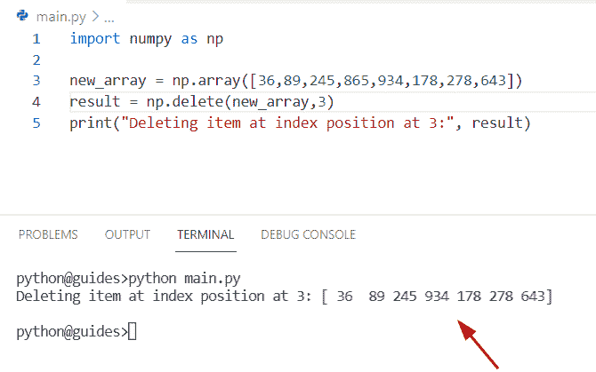

Python NumPy delete

读取 [Python 数字堆栈](https://pythonguides.com/python-numpy-stack/)

## 删除 Python NumPy 中数组的元素

让我们看看，如何在 Python NumPy 中**从数组中删除元素。**

**源代码:**

```py
import numpy as np

new_arr = np.array([56, 33, 49, 93, 21, 19, 83, 77, 65, 46])
new_obj = [1, 4, 6]
new_output = np.delete(new_arr, new_obj)
print(new_output)
```

在上面的程序中，我们使用了 `np.delete()` 函数，并将**‘arr’**和**‘new _ obj’**指定为参数，其中**‘new _ obj’**是一个整数列表。这些数字表示我们要从数组中删除的项目的索引。

下面是以下给定代码的输出

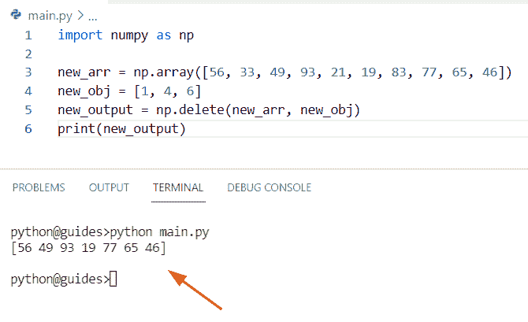

Python NumPy delete

这就是如何在 Python NumPy 中**从数组中删除元素。**

阅读 [Python NumPy round](https://pythonguides.com/python-numpy-round/)

## Python Numpy 删除重复

*   为了从 numpy 数组中删除重复元素，我们可以很容易地使用 np.unique() Python 函数。
*   在 Python 中， `numpy.unique()` 函数用于查找数组的唯一项，并将这些唯一项作为排序的 numpy 数组返回。

**语法:**

下面是 Python 中 `np.unique()` 函数的语法

```py
numpy.unique
            (
             ar,
             return_index=False,
             return_inverse=False,
             return_counts=False,
             axis=None
            )
```

**举例:**

```py
import numpy as np

values = np.array([[345,167,267,189,897],
                 [345,167,867,987,897],
                 [345,167,945,234,897]])

z = np.unique(values)
print(z)
```

在上面的代码中，我们使用了 `np.unique()` 函数，并在其中分配了数组**‘值’**。一旦您将打印**‘z’**，那么输出将显示唯一的值。

下面是以下给定代码的执行过程

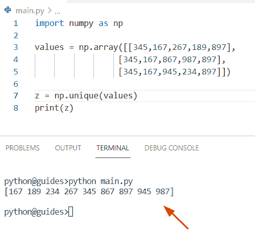

Python NumPy delete repeat

这是一个 **Python NumPy 删除重复**的例子。

又念， [Python Numpy unique](https://pythonguides.com/python-numpy-unique/)

## Python NumPy 删除元素

*   在这一节中，我们将讨论如何在 Python 中从 NumPy 数组中删除一个元素。
*   在本例中，我们将使用 `np.delete()` 函数，并传递**‘new _ arr’，**对象和轴作为参数。

**例:**

```py
import numpy as np

new_arr = np.array([[67 ,156, 986, 67],
                  [56, 156, 345, 897],
                  [45, 219, 456, 976]])
result = np.delete(new_arr, 2, axis=1)
print(result)
```

下面是以下给定代码的实现

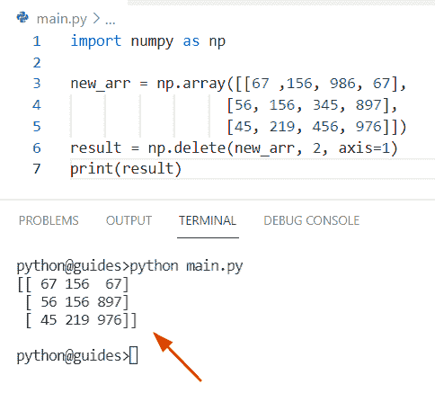

Python NumPy delete element

这就是如何**从 Python NumPy 数组**中删除一个元素。

阅读 [Python NumPy 重复](https://pythonguides.com/python-numpy-repeat/)

## Python NumPy 删除行

*   在本节中，我们将讨论如何在 Python 中**删除 Numpy 数组中的行。**
*   通过使用 `np.delete()` 函数，我们可以执行这个特定的任务。在 Python 中，这个函数用于从 numpy 数组中删除任何行或列。我们只需指定轴和索引位置作为参数。

**源代码:**

```py
import numpy as np

new_arr = np.array([[14, 56, 67], [34, 67, 89], [65, 116, 32]])
z=[1,2]
result = np.delete(new_arr,z, axis=0)
print(result)
```

在上面的代码中，我们导入了 numpy 库，然后使用 `np.array()` 方法初始化了一个数组。现在使用 `numpy.delete()` 函数，并传递函数中的所有参数。一旦你将打印**‘结果’**，那么输出将显示一维数组。

你可以参考下面的截图

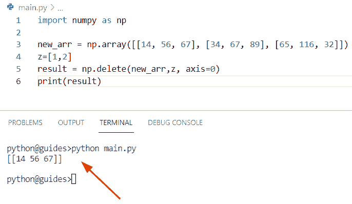

Python NumPy delete row

这就是如何从 Python NumPy 数组中删除一行。

读取 [Python NumPy 数据类型](https://pythonguides.com/python-numpy-data-types/)

## Python NumPy 删除多行

*   在本节中，我们将讨论如何在 NumPy Python 中**删除多行。**
*   为了执行这个特定的任务，我们将使用 `arange()` 函数来创建一个数组，然后应用切片方法 **[:]** 。在这个例子中，我们已经提到我们想要从给定的数组中删除最后的 `3` 行。

**源代码:**

```py
import numpy as np

new_arr = np.arange(48).reshape(8, 6)
print("Initailized array:",new_arr)
new_output = new_arr[:3]
print("Deleted multiple rows:",new_output)
```

你可以参考下面的截图

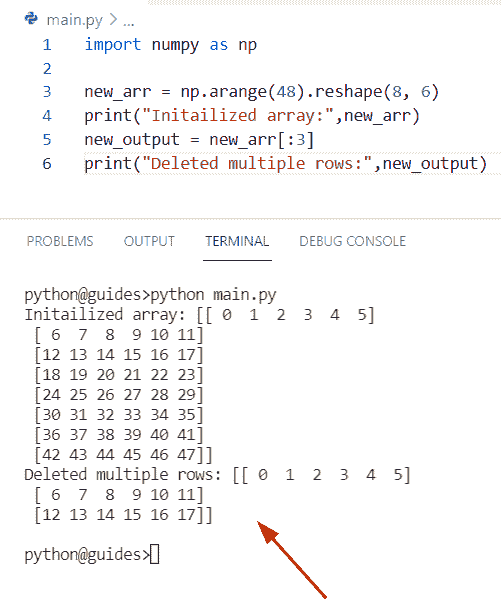

Python NumPy delete multiple rows

正如您在屏幕截图中看到的，输出显示了更新后的 NumPy 数组。这就是如何在 Python NumPy 中删除多行。

读取 [Python NumPy 2d 数组](https://pythonguides.com/python-numpy-2d-array/)

## 在 NumPy Python 中删除多行

通过使用 `np.delete()` 函数我们可以解决这个问题。在本例中，我们将指定对象和轴，而对象代表我们要从数组中删除的索引号列表。

**语法:**

下面是 np.delete()函数的语法

```py
numpy.delete
            (
             arr,
             obj,
             axis=None
            )
```

**源代码:**

```py
import numpy as np

ini_arr = np.arange(36).reshape(6, 6)
print("Initailized array:",ini_arr)
z= np.delete(ini_arr, [2, 4, 1], axis=0)
print("Deleted multiple rows:",z)
```

下面是以下给定代码的输出

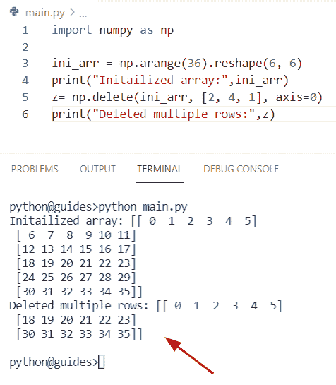

Python NumPy delete multiple rows

正如您在屏幕截图中看到的，输出显示了只包含前 3 行的新数组。

读取 [Python NumPy 3d 数组](https://pythonguides.com/python-numpy-3d-array/)

## Python NumPy 删除数组

*   在这个程序中，我们将讨论如何在 NumPy Python 中删除数组。
*   为了完成这项任务，我们将应用 `np.setdiff1d()` 函数。在 Python 中，这个函数用于设置两个 numpy 数组的差异，或者我们可以说，我们必须根据参数的条件从第一个数组中找到第二个数组中不可用的值。

**语法:**

下面是 np.setdiff1d()方法的语法

```py
numpy.setdiff1d
               (
                ar1,
                ar2,
                assume_unique=False
               )
```

*   它由几个参数组成
    *   **ar1:** 该参数表示输入数组。
    *   **ar2:** 这指定了我们想要与另一个数组进行比较的 numpy 数组。
    *   **assume_unique:** 默认情况下，它采用**‘False’**值，如果为真，则表明这两个数组都被假定为唯一的。

**举例:**

我们举个例子，了解一下 NumPy Python 中 np.s `etdiff1d()` 函数的工作原理

```py
import numpy as np

new_arr = np.arange(49).reshape(7, 7)
del_ele = [33, 42, 16]
final_output = np.setdiff1d(new_arr, del_ele)
print(final_output)
```

在上面的代码中，我们导入了一个 numpy 库，然后通过使用 `np.arange()` 函数以 **(7，7)的顺序初始化一个数组。**

现在声明一个变量**‘final _ output’**并赋一个函数 `np.setdiff1d()` 。一旦你将打印**‘最终输出’**，那么结果将显示新的数组。

下面是以下代码的截图

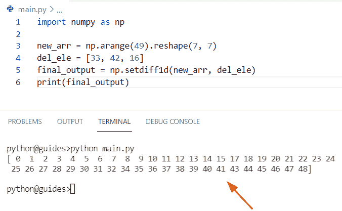

Python NumPy delete array

正如您在屏幕截图中看到的，输出显示列表[33，42，16]已经从 NumPy 数组中删除。

阅读 [Python NumPy Split](https://pythonguides.com/python-numpy-split/)

## Python NumPy 删除维度

*   在本节中，我们将讨论如何使用 Python 删除 NumPy 数组中的维度轴。
*   在这个例子中，我们将与轴一起使用 `np.delete()` 函数。在该方法中，如果**轴=0** ，则表示第一维度的行，如果**轴=1** ，则表示第二维度的列。
*   现在我们要从 `numpy.delete()` 函数中删除轴。首先，我们将使用 **(new_arr，2，0)** 从给定的数组中删除第三行。一旦你将打印**‘rem _ ele’**，那么输出将显示新的数组。

**举例:**

```py
import numpy as np
#creation of array
new_arr = np.array([[2,3,4,5],
              [45,23,11,76],
              [67,84,108,96],
              [12,34,67,89]])
print(new_arr)
# delete third row
rem_ele = np.delete(new_arr, 2, 0)
print(rem_ele)
# delete third column
rem_ele2 = np.delete(new_arr,2, 1)
print(rem_ele2)
```

你可以参考下面的截图

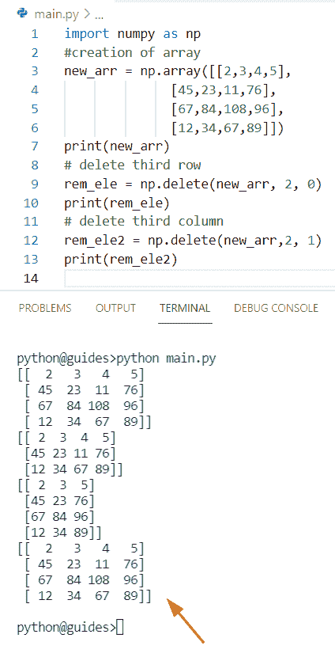

Python NumPy delete a dimension

这是一个 Python NumPy 删除维度的例子。

读取 [Python NumPy 规格化](https://pythonguides.com/python-numpy-normalize/)

## 从 NumPy 数组中删除维度-另一种方法

为了执行这个特定的任务，我们将使用 `np.ones()` 函数来创建一个数组，然后使用切片方法来删除 `np.ones()` 函数中的轴。

**语法:**

下面是 np.ones()函数的语法

```py
numpy.ones
          (
           shape,
           dtype=None,
           order='C',
           *,
           like=None
          )
```

让我们举一个例子，看看如何使用 th `e np.ones()` 函数沿着轴创建一个数组

**举例:**

```py
import numpy as np

arr = np.ones((6, 6, 2))
print("Creation of array:",arr)
z = arr[:, :, 0]
print("Deleting dimension from array:",z.shape)
```

下面是以下给定代码的实现

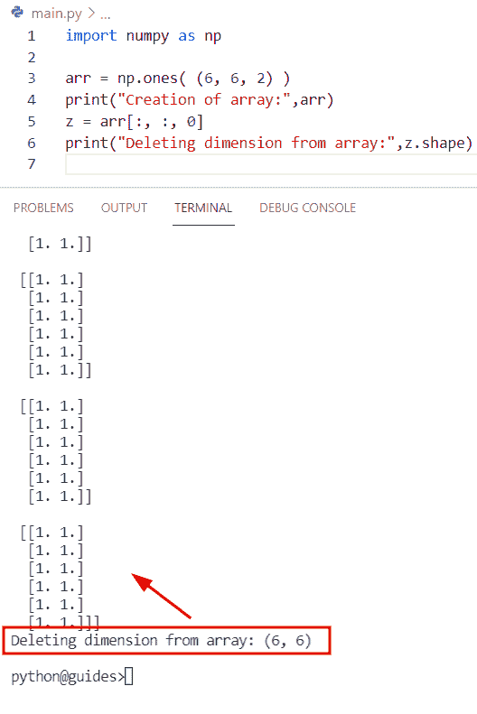

Python NumPy delete a dimension

结帐， [Python NumPy Random](https://pythonguides.com/python-numpy-random/)

## Python NumPy 按索引删除元素

*   让我们看看如何在 NumPy Python 中通过索引位置删除元素。
*   在这个程序中，我们将首先导入一个 numpy 库，然后使用 `arange()` 函数初始化一个数组。之后声明一个变量**‘z’**来表示对象，并在其中分配一个数字列表。现在使用 `np.delete()` 函数并传递一个数组**‘new _ val’**作为参数。

**举例:**

```py
import numpy as np

new_val = np.arange(12)
z=[0,4,2]
result = np.delete(new_val, z)
print("Deleted elements at specific index:",result)
```

下面是以下给定代码的执行过程

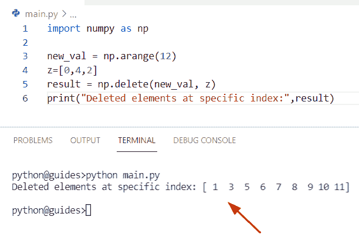

Python NumPy delete element by index

正如您在屏幕截图中看到的，输出显示了新的阵列。这就是如何从 Python NumPy 数组中通过索引删除元素。

读取 [Python NumPy 零](https://pythonguides.com/python-numpy-zeros/)

## Python NumPy 删除最后一列

*   在本节中，我们将讨论如何使用 Python 删除 NumPy 数组中的最后一列。
*   为了执行这个特定的任务，我们将使用 `np.arange()` 函数创建一个简单的数组，并在这个函数中传递整数值**‘12’**以及形状和大小。现在我们想从给定的数组中删除最后一列。
*   通过使用 `numpy.delete()` 函数，我们可以通过将轴和对象指定为参数来轻松删除最后一列。

**源代码:**

```py
import numpy as np

new_val = np.arange(36).reshape(6,6)
print("Creation of array:",new_val)
result = np.delete(new_val,5,1)
print("Deleted last column from array:",result)
```

在上面的代码中，我们使用了函数 `numpy.delete()` 并设置了索引号**‘5’**，它指示最后一列将从给定的数组中删除。

你可以参考下面的截图

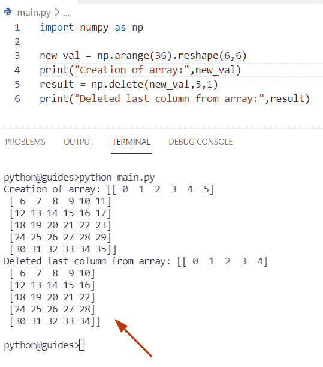

Python NumPy delete the last column

正如您在屏幕截图中看到的，输出显示使用 `numpy.delete()` 函数从 Numpy 数组中删除了最后一列。

这就是如何删除 Python NumPy 中的最后一列。

读取[检查 Python 中的 NumPy 数组是否为空](https://pythonguides.com/check-if-numpy-array-is-empty/)

## Python numpy 通过值移除元素

*   在本期节目中，我们将讨论如何使用 NumPy Python 基于值条件移除元素。
*   在这个例子中，我们将使用 `np.array()` 函数创建一个数组，并在这个方法中传递一个整数值。现在应用条件！=并分配整数**‘369’**。一旦您将打印**‘结果’**，那么输出将显示**‘369’**数字已从数组中删除。

**举例:**

```py
import numpy as np

new_array = np.array([23,45,98,369,23,86,987,145,369,954,467,369])
result = new_array[new_array != 369]
print("Deleted item based on value:",result)
```

下面是以下给定代码的实现

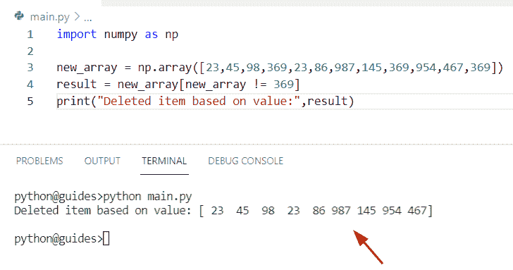

Python NumPy remove element by value

这就是如何从 Python NumPy 数组中按值移除元素。

读取 [Python NumPy 读取 CSV](https://pythonguides.com/python-numpy-read-csv/)

## Python NumPy 从列表中删除元素

*   让我们看看如何使用 Python 从列表中删除元素。通过使用 remove()函数，我们可以很容易地从列表中删除一个条目。在这个程序中，我们想从列表中删除元素 `98` 。
*   为了从列表中删除元素，我们还可以应用 `del` 关键字。在 Python 中，这用于移除数组元素。在本例中，我们想要删除索引**‘3’**处的元素。

**举例:**

```py
new_lis = [23, 67, 48, 98, 145, 897, 956, 345, 109, 654]

z= new_lis.remove(98)
del new_lis[3]
print(z)
print(" After removing element from list:",new_lis)
```

下面是以下代码的截图

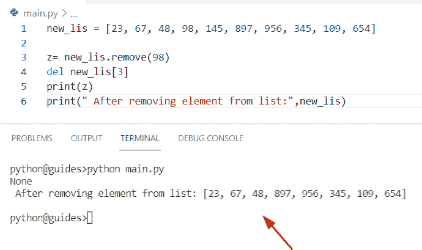

Python NumPy remove an element from a list

正如你在截图中看到的,' 98 '已经从列表中删除。这是如何在 Python 中从列表中移除元素。

阅读 [Python NumPy 日志](https://pythonguides.com/python-numpy-log/)

## Python NumPy 删除最后一个元素

*   在本节中，我们将讨论如何使用 Python 从 NumPy 数组中删除最后一个元素。
*   为了完成这个任务，我们将首先创建一个简单的数组**‘new _ array’**，然后使用 `np.delete()` 函数，并在这个函数中传递数组和**’-1’**作为参数。这是一个从数组中删除最后一个元素的简单逻辑。

**源代码:**

```py
import numpy as np

new_array = np.array([6,34,45,67,89])
result= np.delete(new_array, -1)
print(result)
```

下面是以下给定代码的实现

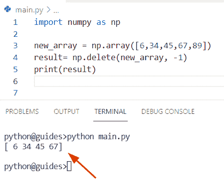

Python NumPy delete the last element

正如您在截图中看到的，最后一个元素已经从数组中删除了

阅读 [Python NumPy where 示例](https://pythonguides.com/python-numpy-where/)

## 从 NumPy 数组中删除最后一个元素

通过使用 `numpy.resize()` 方法我们可以解决这个问题。在 Python 中， `numpy.resize()` 方法用于定义要将多少列和多少行转换成一个维度。

假设我们有一个包含 6 个元素的一维数组，现在我想改变它的维数，我们将传递 **(values，4)** 作为 `resize()` 方法的参数，而值代表数组名。

**语法:**

下面是 `numpy.resize()` 方法的语法

```py
numpy.resize
            (
             a,
             new_shape
            )
```

**源代码:**

```py
import numpy as np

values = np.array([54,118,78,145,768])
new_output= np.resize(values,4)
print("Deleted last element:",new_output)
```

下面是以下给定代码的执行过程


Python NumPy delete the last element

正如您在屏幕截图中看到的，输出显示最后一个元素已经从数组中删除。这就是如何从 NumPy 数组中删除最后一个元素。

阅读 [Python NumPy linspace](https://pythonguides.com/python-numpy-linspace/)

## Python NumPy 删除零行

*   这里我们可以看到如何使用 Python 删除 NumPy 数组中的零行。
*   要删除数组中特定的零行，我们必须使用 `np.array()` 方法初始化一个 numpy 数组，在这个函数中，我们将分配零数组和数值数组。
*   现在使用 `numpy.delete()` 函数，并在函数内设置**轴=0** 。一旦你打印了**‘结果’**，零行将从数组中删除。

**举例:**

```py
import numpy as np
# creation of array
new_val = np.array ([[0,0,0,0],[67,78,19,46],[0,0,0,0],[13,54,23,20]])
#object creation
z=[0,2]
result = np.delete(new_val, z, axis=0)
print("Deleted zero rows:",result)
```

下面是以下给定代码的实现

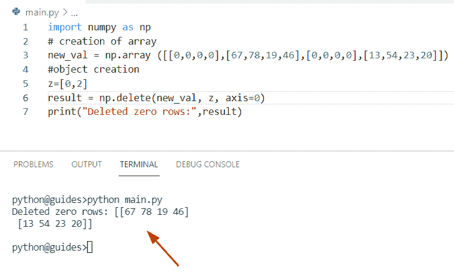

Python NumPy delete zero rows

这是 Python NumPy 删除零行的一个例子。

又念， [Python NumPy concatenate](https://pythonguides.com/python-numpy-concatenate/)

## Python NumPy 移除 nan 行

*   在这一节中，我们将讨论如何使用 Python 从 NumPy 数组中删除 nan 行。
*   在这个例子中，我们将使用 `np.array()` 函数来创建一个数组，在这个函数中，我们将 np.nan 值与整数值一起赋值。现在声明一个变量**‘m’**并创建一个数字列表来表示我们想要从数组中移除的索引位置。

**源代码:**

```py
import numpy as np
# Initialize array
new_array = np.array ([[np.nan,np.nan,np.nan,np.nan],[np.nan,np.nan,np.nan,np.nan],[12,78,54,156],[np.nan,np.nan,np.nan,np.nan]])
#object creation
m=[0,1,3]
new_output = np.delete(new_array, m, axis=0)
print("Deleted nan rows:",new_output)
```

下面是以下代码的截图

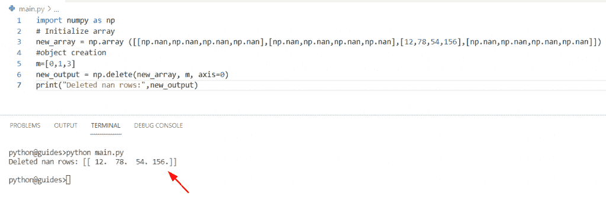

Python NumPy remove nan rows

正如你在截图中看到的， `np.nan` 值已经通过使用 `numpy.delete()` 函数从数组中移除

读取 [Python 排序 NumPy 数组](https://pythonguides.com/python-sort-numpy-array/)

## Python numpy 用 0 替换 nan

*   在本节中，我们将讨论如何使用 NumPy Python 将 nan 值替换为零。
*   通过使用 `np.nan_to_num()` 方法，我们可以执行这个特定的任务。在 Python 中， `np.nan_to_num()` 方法用于将 nan 值替换为零。

**语法:**

下面是 `numpy.nan_to_num()` 方法的语法

```py
numpy.nan_to_num
                (
                 x,
                 copy=True,
                 nan=0.0,
                 posinf=None,
                 neginf=None
                )
```

**源代码:**

```py
import numpy as np

new_arr = np.array([[np.NaN, 14, 34,np.nan], [np.NaN, np.NaN, 89,156]])
result = np.nan_to_num(new_arr)
print("Replace np.nanvalue with zero:",result)
```

你可以参考下面的截图

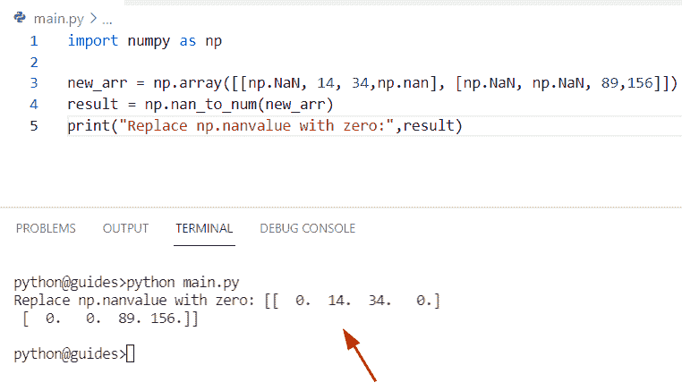

Python NumPy replace nan with 0

相关 NumPy 教程:

*   [Python NumPy 矩阵](https://pythonguides.com/python-numpy-matrix/)
*   [Python NumPy append](https://pythonguides.com/python-numpy-append/)
*   [python num py arang](https://pythonguides.com/python-numpy-arange/)
*   [Python NumPy Sum](https://pythonguides.com/python-numpy-sum/)
*   [Python NumPy 列举示例](https://pythonguides.com/python-numpy-to-list/)

在这个 Python 教程中，我们学习了**如何使用 Python** 删除 Numpy 数组。此外，我们将涵盖这些主题。

*   Python numpy 删除重复
*   Python NumPy 删除元素
*   Python NumPy 删除行
*   Python NumPy 删除多行
*   Python NumPy 删除数组
*   Python NumPy 删除维度
*   Python NumPy 按索引删除元素
*   Python NumPy 删除最后一列
*   Python numpy 通过值移除元素
*   Python NumPy 从列表中移除元素
*   Python NumPy 删除最后一个元素
*   Python NumPy 删除零行
*   Python NumPy 删除 nan 行
*   Python numpy 用 0 替换 nan

[Bijay Kumar](https://pythonguides.com/author/fewlines4biju/)

Python 是美国最流行的语言之一。我从事 Python 工作已经有很长时间了，我在与 Tkinter、Pandas、NumPy、Turtle、Django、Matplotlib、Tensorflow、Scipy、Scikit-Learn 等各种库合作方面拥有专业知识。我有与美国、加拿大、英国、澳大利亚、新西兰等国家的各种客户合作的经验。查看我的个人资料。

[enjoysharepoint.com/](https://enjoysharepoint.com/)[](https://www.facebook.com/fewlines4biju "Facebook")[](https://www.linkedin.com/in/fewlines4biju/ "Linkedin")[](https://twitter.com/fewlines4biju "Twitter")