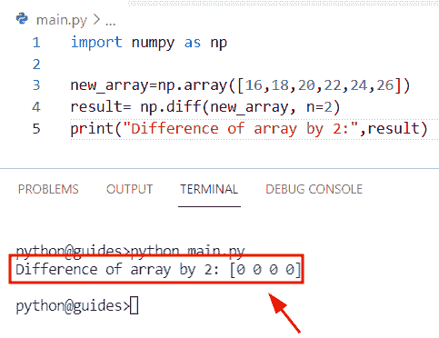
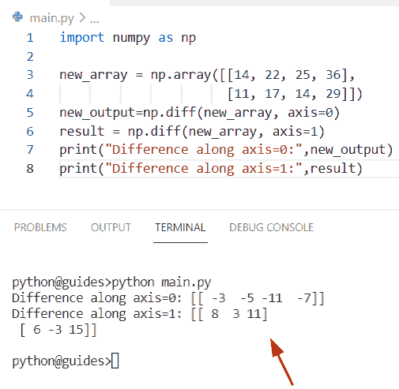
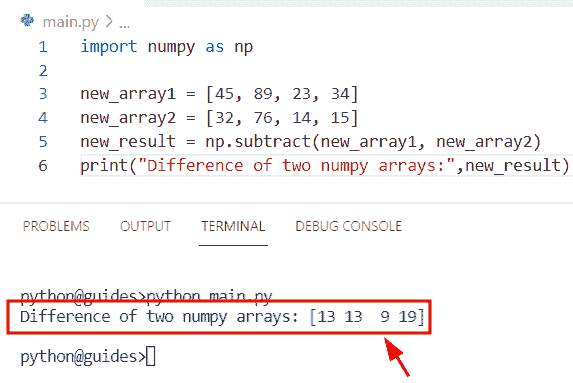
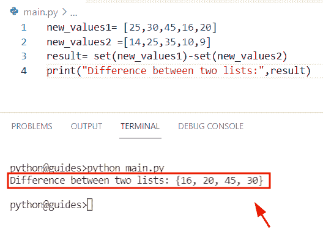
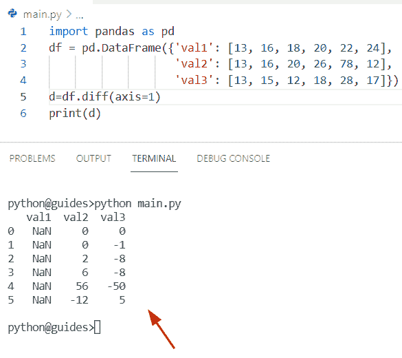
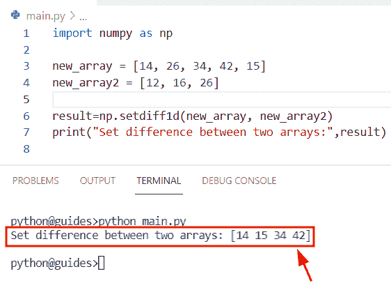
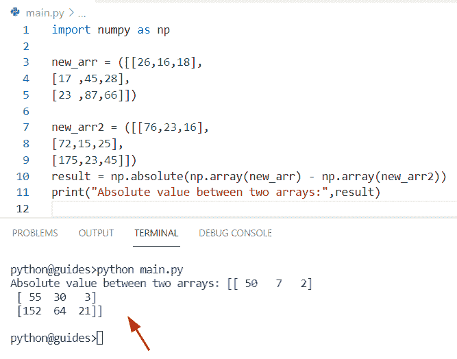
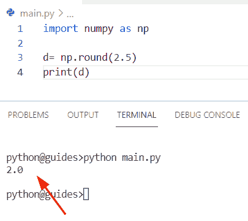
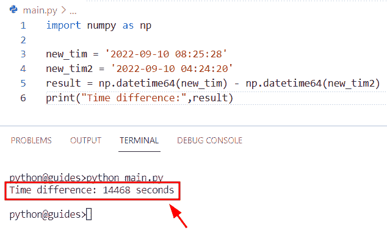
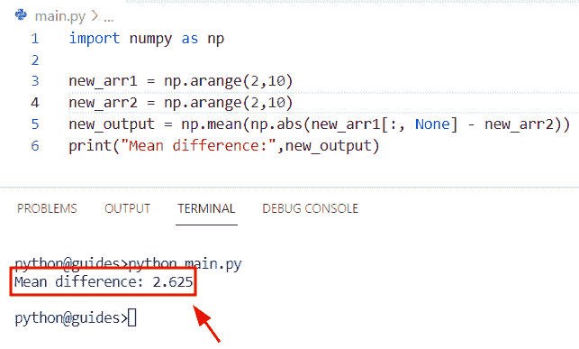

# Python 数字差异示例

> 原文：<https://pythonguides.com/python-numpy-diff/>

[](https://sharepointsky.teachable.com/p/python-and-machine-learning-training-course)

在这个 Python 教程中，我们将学习**如何在** Python 中找出两个 NumPy 数组的区别。通过 `Python NumPy diff` ，我们将涵盖这些主题。

*   Python NumPy 差分函数
*   两个数组之间的 Python numpy 差异
*   两个列表之间的 Python 数字差异
*   Python numpy np.diff
*   Python 数字熊猫差异
*   Python numpy 集合差异
*   Python numpy 绝对差值
*   Python numpy 轮差
*   Python numpy 时差
*   Python numpy 平均差

目录

[](#)

*   [Python 数字差异](#Python_numpy_diff "Python numpy diff")
*   [Python numpy diff 函数](#Python_numpy_diff_function "Python numpy diff function ")
*   [两个数组之间的 Python numpy 差异](#Python_numpy_difference_between_two_arrays "Python numpy difference between two arrays")
*   [两个列表之间的 Python numpy 差异](#Python_numpy_difference_between_two_lists "Python numpy difference between two lists")
*   [Python numpy np.diff](#Python_numpy_npdiff "Python numpy np.diff")
*   [Python numpy 熊猫 diff](#Python_numpy_pandas_diff "Python numpy pandas diff")
*   [Python numpy 设置差异](#Python_numpy_set_difference "Python numpy set difference")
*   [Python numpy 绝对差值](#Python_numpy_absolute_difference "Python numpy absolute difference")
*   [Python numpy 轮差](#Python_numpy_round_difference "Python numpy round difference")
*   [Python numpy 时差](#Python_numpy_time_difference "Python numpy time difference")
*   [Python numpy 均值差](#Python_numpy_mean_difference "Python numpy mean difference")

## Python 数字差异

*   在本节中，我们将讨论如何在 [NumPy 数组 Python](https://pythonguides.com/python-numpy-array/) 中找到差异。
*   为了执行这个特定的任务，我们将使用 `numpy.diff()` 函数。在 Python 中， `numpy.diff()` 函数用于计算数组中给定轴上的值之间的差。
*   该方法在 NumPy 模块包中可用，用于计算沿给定轴的第 n 个离散差。

**语法:**

让我们看一下语法并理解 `numpy.diff()` 方法的工作原理

```py
numpy.diff
          (
           a,
           n=1,
           axis=-1,
           prepend=<no value>,
           append=<no value>
          )
```

*   它由几个参数组成
    *   **a:** 该参数表示我们要计算的值为**第 n 个**离散的输入数组。
    *   **n:** 可选参数，默认取 `1` 值。如果没有提供值，它将检查条件，然后默认设置为 `0` 。
    *   **轴:**该参数表示沿待取差值的轴。

**举例:**

我们举个例子，检查一下 Python 中 NumPy 数组的区别是怎么得到的。

**源代码:**

```py
import numpy as np

new_array=np.array([16,18,20,22,24,26])
result= np.diff(new_array, n=2)
print("Difference of array by 2:",result)
```

在上面的代码中，我们导入了 NumPy 库，然后使用 `np.array()` 函数定义了一个数组。之后，我们在 `np.diff()` 函数中声明了 `n=2` 作为参数，其中‘n’表示值被求差的次数。

以下是给定代码的屏幕截图



Python numpy diff

阅读 [Python NumPy Divide](https://pythonguides.com/python-numpy-divide/)

## Python numpy diff 函数

*   在本期节目中，我们将讨论如何在 Python 中使用 **numpy diff 函数。**
*   在 Python 中 `numpy.diff()` 函数基本上是通过 **out[i]=arr[i+1]-arr[i]** 来计算的。例如，假设我们有一个包含整数值的一维数组。现在我们想通过在循环中使用 diff 来计算差异，或者我们将提供指示行和列的差异的轴。

**语法:**

下面是 Python numpy diff 函数的语法

```py
numpy.diff
          (
           a,
           n=1,
           axis=-1,
           prepend=<no value>,
           append=<no value>
          )
```

**源代码:**

```py
import numpy as np

new_array = np.array([[14, 22, 25, 36], 
                      [11, 17, 14, 29]])
new_output=np.diff(new_array, axis=0)
result = np.diff(new_array, axis=1)
print("Difference along axis=0:",new_output)
print("Difference along axis=1:",result)
```

上面的程序使用了一个 numpy 库，然后我们可以在 numpy.diff()函数中执行轴操作，而不是使用**‘n’**参数。一旦你将打印**‘新输出’**和**‘结果’**，那么输出将显示数组的差异。

下面是以下给定代码的执行过程



Python numpy diff function

读 [Python NumPy argsort](https://pythonguides.com/python-numpy-argsort/)

## 两个数组之间的 Python numpy 差异

*   在这一节中，我们将讨论如何在 Python 中找到两个 numpy 数组的区别。
*   通过使用 `numpy.subtract()` 函数，我们可以执行这个特定的任务。在 Python 中， `numpy.subtract()` 函数用于计算两个 numpy 数组之间的差异，它需要多个参数来解决这个问题。
*   这个方法在 NumPy 模块包中可用，它总是根据输入数组返回类型，或者是 scaler，或者是 ndarray。

**语法:**

让我们看一下语法并理解 `numpy.subtract()` 函数的工作原理

```py
numpy.subtract
              (
               x1,
               x2,
                /,
               out=None,
                *,
               where=True,
               casting='same_kind',
               order='K',
               dtype=None,
               subok=True,
              )
```

*   它由几个参数组成
    *   **x1:** 此参数表示用于计算差值的第一个 numpy 数组，它必须是一个可广泛转换为通用形状的数组。
    *   **x2:** 这是第二个 numpy 数组。
    *   **out:** 该参数表示存储结果输出的位置，默认情况下不取值。
    *   **其中:**如果该参数为真，则表示计算 ufunc 结果。

**举例:**

让我们以 `numpy.subtract()` 函数为例，检查它是如何工作的

**源代码:**

```py
import numpy as np

new_array1 = [45, 89, 23, 34]
new_array2 = [32, 76, 14, 15]
new_result = np.subtract(new_array1, new_array2) 
print("Difference of two numpy arrays:",new_result)
```

在上面的代码中，我们通过使用 `numpy.array()` 函数使用了两个 numpy 数组。之后，我们应用了 `np.subtract()` 函数，它会找出**数组 1** 和**数组 2** 之间的差异。

下面是以下给定代码的实现



Python numpy difference between two arrays

阅读 [Python NumPy 索引](https://pythonguides.com/python-numpy-indexing/)

## 两个列表之间的 Python numpy 差异

*   在这一节中，我们将讨论如何在 Python 中找到两个列表之间的差异。
*   通过使用 set()函数我们可以解决这个问题。在 Python 中， `set()` 函数用于声明一个 set 对象，可以转换任何可迭代的序列项。
*   在本例中，我们将首先创建一个列表并为其分配整数值，然后从列表中创建一个集合，并通过使用 `set(list)` 将我们的列表转换为集合。之后，我们可以减去这些给定的集合。

**举例:**

让我们举一个例子，看看如何在 Python 中得到两个列表的区别

```py
new_values1= [25,30,45,16,20]
new_values2 =[14,25,35,10,9]
result= set(new_values1)-set(new_values2)
print("Difference between two lists:",result)
```

你可以参考下面的截图



Python numpy difference between two lists

阅读 [Python NumPy 过滤器+ 10 个例子](https://pythonguides.com/python-numpy-filter/)

## Python numpy np.diff

我们已经在 `Python numpy diff` 主题中使用了这个函数。

## Python numpy 熊猫 diff

*   在本期节目中，我们将讨论如何在 Python 中使用 `pandas.diff()` 函数。
*   在 Python 中，此函数用于计算一个数据帧值与 Pandas 数据帧中另一个值的差异。

**语法:**

下面是 `pandas.diff()` 函数的语法

```py
DataFrame.diff
              (
               periods=1,
               axis=0
              )
```

*   它由几个参数组成
    *   **周期:**该参数表示计算差值的移位，默认取**‘1’**值。
    *   **轴:**默认取 `0` 值，表示行和列。

**来源` `代号**:

```py
import pandas as pd
df = pd.DataFrame({'val1': [13, 16, 18, 20, 22, 24],
                   'val2': [13, 16, 20, 26, 78, 12],
                   'val3': [13, 15, 12, 18, 28, 17]})
d=df.diff(axis=1)
print(d)
```

在上面的代码中，我们使用了 Pandas 库，并在 dataframe 中分配了整数值。之后，我们声明了一个变量**‘d’**，并指定了 `df.diff()` 函数。一旦您将打印**‘d’**，那么输出将显示数据帧中的差值。

下面是以下代码的截图



Python numpy pandas diff

读取[未找到 Python 编号](https://pythonguides.com/python-numpy-not-found/)

## Python numpy 设置差异

*   在这一节中，我们将讨论如何在 NumPy Python 中找到两个数组之间的集合差异。
*   为了完成这个特定的任务，我们将使用 `numpy.setdiff1d()` 。在 Python 中， `numpy.setdiff1d()` 函数用于查找两个 numpy 数组的集合差，该函数采用两个参数**数组 1** 和**数组 2** 。
*   该方法在 numpy 模块包中可用，并且总是返回 numpy `array1` 中的唯一值。

**语法:**

让我们看一下语法并理解 `numpy.setdiff1d()` 函数的工作原理

```py
numpy.setdiff1d
               (
                ar1,
                ar2,
                assume_unique=False
               )
```

*   它由几个参数组成
    *   ar1:该参数表示输入数组。
    *   **ar2:** 要与另一个数组进行比较的数组。
    *   **assume_unique:** 默认情况下，它采用**‘false’**值，如果该值为 true，则假定数组是唯一的。

**举例:**

让我们举一个例子，看看如何找出两个 numpy 数组之间的差异

```py
import numpy as np

new_array = [14, 26, 34, 42, 15]
new_array2 = [12, 16, 26]

result=np.setdiff1d(new_array, new_array2)
print("Set difference between two arrays:",result)
```

在上面的代码中，我们使用了 numpy 库，然后通过使用 `np.array()` 函数初始化一个数组。之后，我们声明了一个变量**‘结果’**，并指定了 np.setdiff1d()函数。一旦您将打印**‘结果’**，那么输出将显示不在**数组 2** 中的数组 1 元素**【14，15，34，42】**。

下面是以下给定代码的执行过程



Python numpy set difference

阅读 [Python NumPy 删除](https://pythonguides.com/python-numpy-delete/)

## Python numpy 绝对差值

*   在这个程序中，我们将讨论如何通过使用 `numpy.absolute()` 函数返回正值来找出 numpy 数组中的差。
*   在 Python 中，这是一个数学函数，测量数组中每一项的绝对值并返回正值。
*   这个方法在 NumPy 模块包中可用，它有三个参数。例如，假设我们有一个包含一些数字的数组，现在我们想用另一个数组做减法，它将返回一些负值，正值。
*   如果我们应用 Python `numpy.absolute()` 函数，那么该方法的输出将是一个具有正值的新 numpy 数组。

**语法:**

下面是 Python `numpy.absolute()` 的语法

```py
numpy.absolute
              (
               x,
               /,
               out=None,
               *,
               where=True,
               casting='same_kind',
               order='K',
               dtype=None,
               subok=True
              )
```

**举例:**

让我们举个例子，了解一下 Python `numpy.absolute()` 函数的工作原理

**源代码:**

```py
import numpy as np

new_arr = ([[26,16,18],
[17 ,45,28],
[23 ,87,66]])

new_arr2 = ([[76,23,16],
[72,15,25],
[175,23,45]])
result = np.absolute(np.array(new_arr) - np.array(new_arr2))
print("Absolute value between two arrays:",result) 
```

下面是以下给定代码的输出



Python numpy absolute difference

阅读 [Python NumPy 最小教程](https://pythonguides.com/python-numpy-minimum/)

## Python numpy 轮差

*   这里我们可以看到如何在 NumPy Python 中通过使用 `numpy.round()` 函数来获取轮差。
*   为了完成这项任务，我们将使用 numpy.round()函数，这是一个数学函数，用于将数字舍入到最接近的整数值。
*   该方法在 NumPy 模块包中可用，并且总是返回四舍五入的数字。例如，假设您有一个整数**‘2.5’**，然后您应用了 `numpy.round()` 函数来获取最接近的值。

**语法:**

下面是 Python `numpy.round()` 函数的语法

```py
numpy.round
           (
            a,
            decimals=0,
            out=None
           )
```

**源代码:**

```py
import numpy as np

d= np.round(2.5)
print(d)
```

下面是以下代码的截图



Python numpy round difference

正如您在屏幕截图中看到的，输出显示舍入值“2.0”

阅读 [Python Numpy 阶乘](https://pythonguides.com/python-numpy-factorial/)

## Python numpy 时差

*   在本节中，我们将讨论如何使用 NumPy Python 来查找时差。
*   为了完成这项任务，我们将使用 `np.datetime64()` 方法。在 Python 中，这个方法用于获取日期时间格式，日期单位是**年(“y”)、月(“m”)、日(“d”)。**
*   在这个例子中，我们可以看到如何获得日期时间的差异，并返回时间秒。

**语法:**

让我们看一下语法，理解一下 `numpy.datetime64()` 方法的工作原理

```py
numpy.datetime64(date)
```

**举例:**

```py
import numpy as np

new_tim = '2022-09-10 08:25:28'
new_tim2 = '2022-09-10 04:24:20'
result = np.datetime64(new_tim) - np.datetime64(new_tim2)
print("Time difference:",result)
```

在上面的代码中，我们使用了 numpy 库，然后创建了变量**‘new _ Tim’，new _ Tim 2’**，并分配了日期时间值。之后，我们使用了一个 `np.datetime64()` 函数，并将数组作为参数传递。一旦您将打印**‘结果’**，那么输出将显示两个给定日期时间字符串之间的时间差。

你可以参考下面的截图



Python numpy time difference

读取 [Python 数字堆栈](https://pythonguides.com/python-numpy-stack/)

## Python numpy 均值差

*   在本期节目中，我们将讨论如何在 NumPy Python 中求均值差。
*   通过使用 `np.mean()` 函数，我们可以轻松地执行这项任务。在 Python 中， `np.mean()` 函数用于生成给定轴或多个轴的算术平均值。
*   在 Python 中，这个函数在 NumPy 包模块中可用，它返回数组元素的算术值。

**语法:**

下面是 `numpy.mean()` 函数的语法

```py
numpy.mean
          (
           a,
           axis=None,
           dtype=None,
           out=None,
           keepdims=<no value>,
           where=<no value>
          )
```

**源代码:**

```py
import numpy as np

new_arr1 = np.arange(2,10)
new_arr2 = np.arange(2,10)
new_output = np.mean(np.abs(new_arr1[:, None] - new_arr2))
print("Mean difference:",new_output)
```

在上面的代码中，我们通过使用 `np.arange()` 函数创建了一个数组，然后应用 `np.mean()` 函数，并将 `np.abs()` 与数组一起作为参数赋值。一旦您将打印**‘新输出’**，输出将显示平均值。

下面是以下给定代码的实现



Python numpy mean difference

正如您在截图中看到的，输出将**‘2.625’**显示为平均值

您可能会喜欢以下 Python NumPy 教程:

*   [Python NumPy 回合](https://pythonguides.com/python-numpy-round/)
*   [Python Numpy 独一无二](https://pythonguides.com/python-numpy-unique/)
*   [Python NumPy 重复](https://pythonguides.com/python-numpy-repeat/)
*   [Python NumPy 数据类型](https://pythonguides.com/python-numpy-data-types/)
*   [Python NumPy 添加教程](https://pythonguides.com/python-numpy-add/)
*   [Python NumPy 矩阵乘法](https://pythonguides.com/python-numpy-matrix-multiplication/)
*   [Python NumPy 2d 数组+示例](https://pythonguides.com/python-numpy-2d-array/)

在这个 Python 教程中，我们将学习**如何在** Python 中找出两个 NumPy 数组的区别。此外，我们将涵盖这些主题。

*   Python NumPy 差分函数
*   两个数组之间的 Python numpy 差异
*   两个列表之间的 Python 数字差异
*   Python numpy np.diff
*   Python 数字熊猫差异
*   Python numpy 集合差异
*   Python numpy 绝对差值
*   Python numpy 轮差
*   Python numpy 时差
*   Python numpy 平均差

[Bijay Kumar](https://pythonguides.com/author/fewlines4biju/)

Python 是美国最流行的语言之一。我从事 Python 工作已经有很长时间了，我在与 Tkinter、Pandas、NumPy、Turtle、Django、Matplotlib、Tensorflow、Scipy、Scikit-Learn 等各种库合作方面拥有专业知识。我有与美国、加拿大、英国、澳大利亚、新西兰等国家的各种客户合作的经验。查看我的个人资料。

[enjoysharepoint.com/](https://enjoysharepoint.com/)[](https://www.facebook.com/fewlines4biju "Facebook")[](https://www.linkedin.com/in/fewlines4biju/ "Linkedin")[](https://twitter.com/fewlines4biju "Twitter")