# Python 数字除法

> 原文：<https://pythonguides.com/python-numpy-divide/>

[](https://sharepointsky.teachable.com/p/python-and-machine-learning-training-course)

在本 [Python 教程](https://pythonguides.com/python-hello-world-program/)中，我们将学习**如何划分 NumPy 数组** Python 中的元素。此外，我们将涵盖这些主题。

*   Python numpy 按元素划分
*   Python numpy 除以零
*   Python numpy 通过缩放器划分数组
*   Python numpy 将数组除以向量
*   Python np.divide vs /
*   Python numpy 数组划分每个元素
*   Python numpy true_divide
*   Python np.split 示例
*   Python numpy 随机拆分
*   Python numpy 拆分字符串
*   Python np.log 除以零

目录

[](#)

*   [Python numpy divide](#Python_numpy_divide "Python numpy divide")
*   [Python numpy 按元素划分](#Python_numpy_divide_element-wise "Python numpy divide element-wise")
*   [Python numpy 除以零](#Python_numpy_divide_by_zero "Python numpy divide by zero")
*   [Python numpy 用 scaler 除数组](#Python_numpy_divide_array_by_scaler "Python numpy divide array by scaler")
*   [Python numpy 将数组除以向量](#Python_numpy_divide_array_by_vector "Python numpy divide array by vector")
*   [Python np.divide vs /](#Python_npdivide_vs "Python np.divide vs /")
*   [Python numpy 数组划分每个元素](#Python_numpy_array_divide_each_element "Python numpy array divide each element")
*   [Python numpy true_divide](#Python_numpy_true_divide "Python numpy true_divide")
*   [Python np.split 示例](#Python_npsplit_example "Python np.split example")
*   [Python numpy 随机拆分](#Python_numpy_random_split "Python numpy random split")
*   [Python numpy 拆分字符串](#Python_numpy_split_string "Python numpy split string")
*   [Python np.log 除以零](#Python_nplog_divide_by_zero "Python np.log divide by zero")

## Python numpy divide

*   在这一节中，我们将讨论如何在 NumPy 数组 Python 中按元素划分。
*   为了执行这个特定的任务，我们将使用 `numpy.divide()` 函数。在 Python 中，此函数用于计算两个 numpy 数组之间的除法，此方法提供了几个参数，允许用户指定算法。
*   我们也可以使用 `/` 操作符来划分数组中的每一项。例如，假设您有两个包含整数值的 numpy 数组，我们希望使用 `numpy.divide()` 函数和 `/` 运算符将第一个 numpy 数组的每个值除以第二个数组的值。

**语法:**

让我们看一下语法并理解 `numpy.divide()` 函数的工作原理

```py
numpy.divide
            (
             x1,
             x2,
              /,
             out=None,
             *,
             where=True,
             casting='same_kind',
             order='K',
             dtype=None,
             subok=True
            )
```

*   它由几个参数组成
    *   **x1:** 此参数表示带有被除数值的数组。
    *   **x2:** 输入用于计算除法的数组值。
    *   **Out:** 默认情况下，它采用 none 值，表示结果已存储，如果没有提供 none 值，则返回一个新分配的数组。

**举例:**

让我们举个例子，看看如何在 NumPy Python 中划分两个数组

**源代码:**

```py
import numpy as np

new_val = np.array([12,24,36])
new_val2 = np.array([2,12,4])
result=np.divide(new_val,new_val2)
print("Division of two arrays:",result)
```

在上面的代码中，我们首先导入了 numpy 库，然后创建了两个数组，其中被除数数组**‘new _ val’**和除数数组**‘new _ val 2’**。之后，我们声明了一个变量**‘结果’**，并在其中分配了 `numpy.divide()` 函数。一旦你将打印“结果”，然后输出将显示分割元素的结果。

下面是以下代码的截图

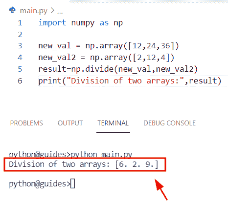

Python numpy divide

阅读: [Python NumPy 数据类型](https://pythonguides.com/python-numpy-data-types/)

## Python numpy 按元素划分

*   在这个程序中，我们将学习如何使用 `/` 操作符在 NumPy 数组 Python 中按元素划分。
*   在 Python 中， `/` 运算符用于将一个 numpy 数组除以另一个数组，除法运算符/传递数组和常量作为操作数，并将两个 numpy 数组存储在第三个变量中。

**语法:**

下面是用于数组除法的 `/` 算术运算符的语法

```py
arr3=arr1/arr2
```

**举例:**

让我们举个例子，了解一下 `/` 运算符的工作原理

**源代码:**

```py
import numpy as np

new_arr = np.array([49,25,36])
new_arr2 = np.array([7,5,6])

new_output = new_arr/new_arr2
print(new_output)
```

下面是以下给定代码的实现

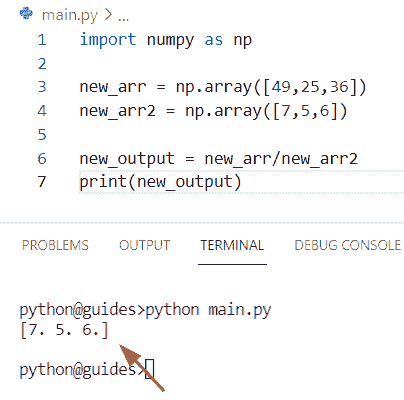

Python numpy divide element-wise

正如您在截图中看到的，输出显示了 `new_array` 。

阅读: [Python NumPy 2d 数组](https://pythonguides.com/python-numpy-2d-array/)

## Python numpy 除以零

*   在这一节中，我们将讨论如何在 Python 中将 numpy 数组除以零值。
*   通过使用 `/` 操作符，我们可以执行这个特定的任务。在 Python 中， `/` 操作符用于将一个数组中的元素与另一个数组中的元素分开。在这个程序中，我们首先创建了一个只包含整数值的数组。之后，我们通过使用 `np.array()` 函数声明另一个数组 **'new_arr2'** ，并在其中赋值 `0` 。
*   现在使用 `/` 运算符，将结果存储到**‘新输出’**中，它将显示**‘INF’**值。但是我们想从 numpy 数组中得到零值。为了解决这个问题，我们可以使用 `np.inf()` 函数，它将帮助用户获得零值。

**源代码:**

```py
import numpy as np

new_arr = np.array([49,25,36])
new_arr2 = np.array([0,0,0])

new_output = new_arr/new_arr2
new_output[new_output == np.inf] = 0
print("Division by zero:",new_output)
```

下面是以下给定代码的输出

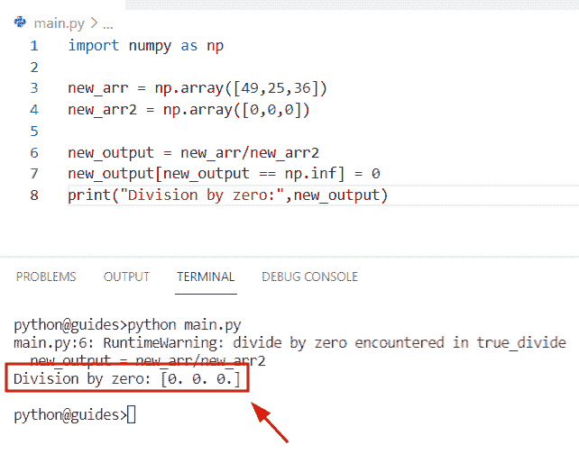

Python numpy divide by zero

阅读: [Python NumPy 3d 数组](https://pythonguides.com/python-numpy-3d-array/)

## Python numpy 用 scaler 除数组

*   在本节中，我们将讨论如何用 scaler 值除 numpy 数组元素。
*   在本例中，我们将采用一个名为**‘new _ val’**的数组，该数组执行被除数的方法，并且标量值是指示除数的 `2` 。现在我们必须在 `numpy.divide()` 函数中传递数组和标量值作为参数。

**源代码:**

```py
import numpy as np

new_val = np.arange(2,6).reshape(2,2)
result=np.divide(new_val, 2)
print(result)
```

下面是以下给定代码的执行过程

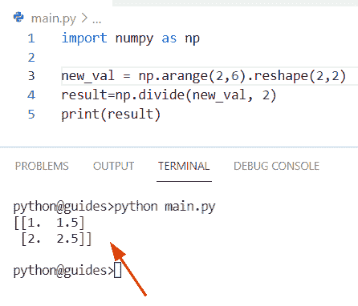

Python numpy divide array by scaler

正如您在屏幕截图中看到的，输出显示了新的阵列。

阅读: [Python NumPy Split + 11 示例](https://pythonguides.com/python-numpy-split/)

## Python numpy 将数组除以向量

*   在这个程序中，我们将讨论如何在 Python 中将 numpy 数组除以 vector。
*   为了执行这个特定的任务，我们将使用 `/` 操作符将数组除以向量。首先，我们将使用 `np.array()` 函数创建一个数组，并分配整数值。之后声明一个变量**‘new _ vector’**，并在其中赋值。

**举例:**

```py
import numpy as np

new_val = np.array([[11,11,11],[25,25,25],[19,19,19]])
new_vector = np.array([11,25,19])

new_result = new_val / new_vector[:,None]
print(new_result)
```

下面是以下代码的截图

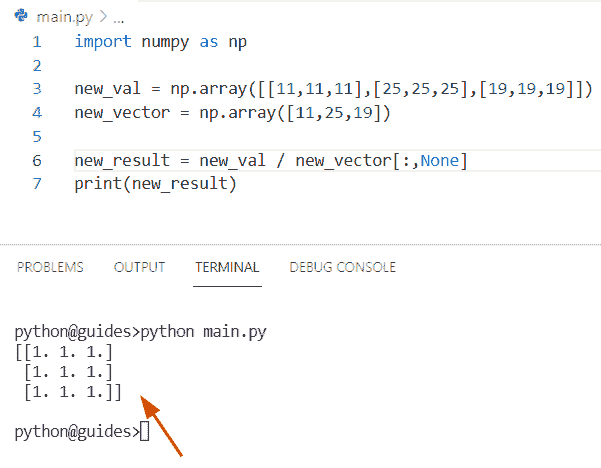

Python numpy divide array by vector

阅读: [Python NumPy 规格化](https://pythonguides.com/python-numpy-normalize/)

## Python np.divide vs /

*   在本节中，我们将讨论 numpy divide 和 Python divide `/` 运算符之间的区别。
*   在 Python 中， `np.divide()` 函数用于将第一个数组的元素除以第二个数组的值，该函数在 numpy 模块包中可用，它接受两个数组作为参数。而在 `/` 运算符的情况下，它用于将左边的数除以右边的值。
*   `/` 运算符操作数并将两个 numpy 数组存储在第三个变量中。而在**的情况下，numpy.divide()** 函数总是返回与输入数组相同的大小。

**举例:**

```py
import numpy as np

new_val = np.array([55,66,77])
new_val2 = np.array([5,11,7])
result=np.divide(new_val,new_val2)
print("Division of two array by using divide function:",result)

val_ele = np.array([36,24,16])
val_ele2 = np.array([3,2,4])

new_output = val_ele/val_ele2
print("Division of arrays by using / operator:",new_output)
```

下面是以下给定代码的执行过程

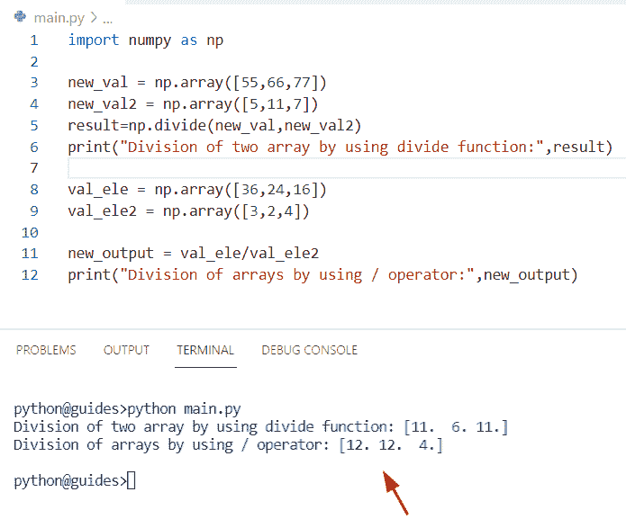

Python np divide vs divide operator

阅读: [Python NumPy max 带示例](https://pythonguides.com/python-numpy-max-with-examples/)

## Python numpy 数组划分每个元素

*   在本节中，我们将学习如何在 NumPy 数组 Python 中划分每个元素。
*   这里我们可以使用 `/` 操作符来执行这个特定的任务。在使用 `/` 操作数的同时，我们也可以应用 **[: None]** 来表示 NumPy 数组上的元素除法。
*   在下面的例子中，我们将划分**数组 new_arr/ result** 。首先，我们将导入一个 numpy 库，然后使用 `np.array()` 函数创建一个数组。之后，我们将创建一个变量**‘结果’**来表示除数。

**来源` `代号:**

```py
import numpy as np

new_arr = np.array([
   [99, 99, 99],
   [55, 55, 55],
   [30, 30, 30]
])
result = np.array([99, 55, 30])
z=new_arr / result[: , None]
print("Divide each element:",z)
```

你可以参考下面的截图

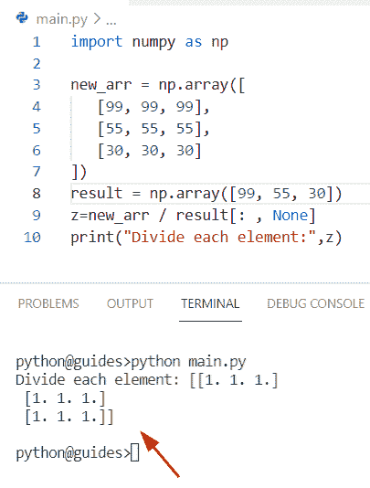

Python numpy array divide each element

正如您在屏幕截图中看到的，输出显示了新的阵列。

阅读:[Python NumPy Random【30 例】](https://pythonguides.com/python-numpy-random/)

## Python numpy true_divide

*   在本期节目中，我们将讨论如何在 Python 中使用 numpy `true_divide()` 函数。
*   在 Python 中，如果我们想要划分两个相同大小的 numpy 数组，那么我们可以很容易地使用 numpy `true_divide()` 函数，这个方法将帮助用户将第二个数组的元素除以第一个数组的元素。
*   该方法在 NumPy 包模块中可用，并且总是返回输入数组元素的真实除法。

**语法:**

让我们看一下语法，理解一下 `numpy true_divide()` 函数的工作原理

```py
numpy.true_divide
                 (
                  x1,
                  x2,
                   /,
                  out=None,
                   *,
                  where=True,
                  casting='same_kind',
                  order='K',
                  dtype=None,
                  subok=True
                 )
```

*   它由几个参数组成
    *   **x1:** 该参数表示带有被除数值的输入数组。
    *   **x2:** 这指定了除数数组，并且必须是相同的形状。
    *   **out:** 这是一个可选参数，默认情况下，它采用 none 值，如果没有提供 none 值，则返回一个新分配的数组。

**举例:**

让我们举个例子，看看如何在 Python 中使用 `numpy true_divide()` 函数

**源代码:**

```py
import numpy as np

new_array1 = np.array([50, 36, 72, 49])
print("First array shape:",new_array1.shape)
new_array2 = np.array([10, 3, 9, 7])
print("Second array shape:", new_array2.shape)
#Divide two arrays
new_result = np.true_divide(new_array1, new_array2)
print(new_result)
print("Resultant array shape:",new_result.shape) 
```

在上面的程序中，我们采用了两个由整数值组成的数组' `new_array1` 和' new_array2 '。之后，我们在 numpy `true_divide` ()函数中传递了这两个 numpy 数组作为参数。一旦你将打印' `new_result` ，那么输出将显示具有相同形状的新数组。

下面是以下给定代码的实现

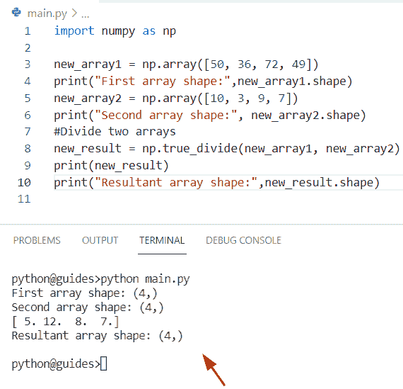

Python numpy true_divide

已读: [Python NumPy 形状示例](https://pythonguides.com/python-numpy-shape/)

## Python np.split 示例

*   在本节中，我们将学习如何使用 `numpy.split()` 函数来划分数组。
*   在 Python 中，如果您想将数组分割成子数组，那么您可以很容易地将 `numpy.split()` 函数与 axis 一起使用。这个方法将帮助用户将子数组列表作为视图返回到一个数组中。
*   在 Python 中，这个函数在 NumPy 模块包中是可用的，最重要的一点是这个函数不会在等分中返回。

**语法:**

下面是 numpy.split()函数的语法

```py
numpy.split
           (
            ary,
            indices_or_sections,
            axis=0
           )
```

*   它由几个参数组成
    *   **ary:** 该参数表示我们要拆分的数组。
    *   **indexes _ or _ sections:**指定数组元素必须是整数，数组将沿着指定的轴拆分成 N 个相等的数组。如果数组不相等，那么它将引发一个错误。
    *   **轴:**缺省值为 0，表示要分割的轴。

**举例:**

让我们举个例子来理解 Python 中 numpy.split()函数的工作原理

**源代码:**

```py
import numpy as np

new_array = np.array([12,13,14,15,16,17,18,19,20])
result= np.split(new_array, 3)
print("Spliiting arrays:",result)
```

在上面的代码中，我们首先导入了 numpy 库，然后使用 `np.array()` 函数来创建一个 NumPy 数组。之后，我们声明了一个变量“result”并分配了 `np.split()` 函数，其中我们传递了数组以及 split `number = 3` ，这表示数组将被分成 3 个相等的部分。

下面是以下给定代码的执行过程

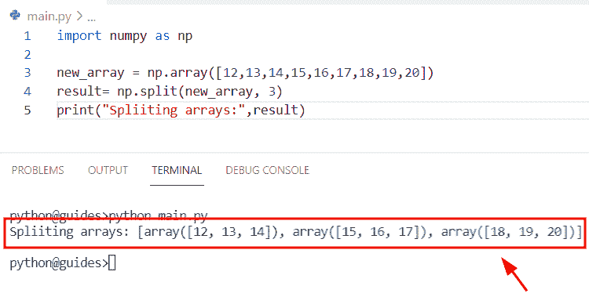

Python np split example

阅读: [Python 反向 NumPy 数组](https://pythonguides.com/python-reverse-numpy-array/)

## Python numpy 随机拆分

我们已经在 [Python NumPy split](https://pythonguides.com/python-numpy-split/) 的帖子中讨论过这个话题。

## Python numpy 拆分字符串

*   在本节中，我们将讨论如何在 NumPy 数组 Python 中拆分字符串。
*   在 Python 中拆分字符串，我们可以很容易地使用 `numpy.char.split()` 函数，这个方法将按照指定的分隔符返回输入字符串中的单词列表。

**语法:**

让我们看一下语法并理解 numpy.char.split()函数的工作原理

```py
numpy.char.split
                (
                 a,
                 sep=None,
                 maxsplit=None
                )
```

*   它由几个参数组成
    *   **a:** 该参数指定输入数组
    *   默认情况下，它采用 none 值，分隔符可以是任何空白字符串。
    *   **maxsplit:** 如果没有给定这个参数，那么默认情况下它没有值。

**举例:**

让我们举一个例子，看看如何在 NumPy Python 中拆分字符串

**源代码:**

```py
import numpy as np

new_arr="John is a good boy"
new_result = np.char.split(new_arr)
print("Split input string into sub-string:",new_result)
```

在上面的代码中，我们取了一个名为**‘new _ arr’**的输入字符串。之后，我们声明了一个变量**‘new _ result’**，并分配了 `np.char.split()` 函数，在这个方法中，我们将数组作为参数传递。一旦您将打印“new_arr ”,那么输出将显示分割输入字符串。

下面是以下代码的截图

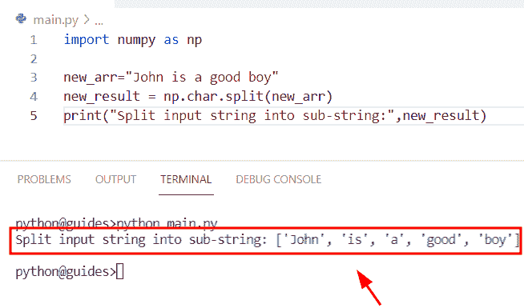

Python numpy split string

阅读: [Python NumPy 索引–详细指南](https://pythonguides.com/python-numpy-indexing/)

## Python np.log 除以零

*   在本期节目中，我们将讨论如何在 Python 中用零除 `np.log()` 函数。

**举例:**

```py
import numpy as np 

d= np.log(0)/0
print(d)
```

在 Python 中，没有定义除以零的对数(log ),因为你永远不能用除以零来除 log0。

下面是以下代码的截图

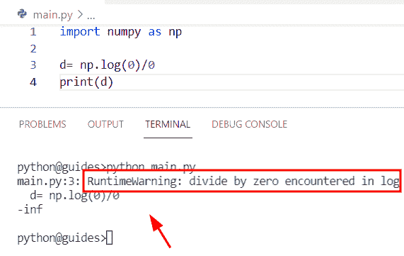

Python np log divide by zero

你可能也喜欢阅读下面的相关教程。

*   [Python NumPy 过滤器+ 10 个例子](https://pythonguides.com/python-numpy-filter/)
*   [Python NumPy 删除–完整教程](https://pythonguides.com/python-numpy-delete/)
*   [Python NumPy 最小教程](https://pythonguides.com/python-numpy-minimum/)
*   [Python NumPy 栈示例](https://pythonguides.com/python-numpy-stack/)

在这个 Python 教程中，我们已经学习了**如何划分 NumPy 数组**中的元素。此外，我们已经讨论了这些主题。

*   Python numpy 按元素划分
*   Python numpy 除以零
*   Python numpy 通过缩放器划分数组
*   Python numpy 将数组除以向量
*   Python numpy 除列
*   Python np.divide vs /
*   Python numpy 数组划分每个元素
*   Python numpy true_divide
*   Python np.split 示例
*   Python numpy 随机拆分
*   Python numpy 拆分字符串
*   Python np.log 除以零

[Bijay Kumar](https://pythonguides.com/author/fewlines4biju/)

Python 是美国最流行的语言之一。我从事 Python 工作已经有很长时间了，我在与 Tkinter、Pandas、NumPy、Turtle、Django、Matplotlib、Tensorflow、Scipy、Scikit-Learn 等各种库合作方面拥有专业知识。我有与美国、加拿大、英国、澳大利亚、新西兰等国家的各种客户合作的经验。查看我的个人资料。

[enjoysharepoint.com/](https://enjoysharepoint.com/)[](https://www.facebook.com/fewlines4biju "Facebook")[](https://www.linkedin.com/in/fewlines4biju/ "Linkedin")[](https://twitter.com/fewlines4biju "Twitter")