# Python NumPy 空数组及示例

> 原文：<https://pythonguides.com/python-numpy-empty-array/>

[](https://sharepointsky.teachable.com/p/python-and-machine-learning-training-course)

在本 Python 教程中，我们将讨论 **Python NumPy 空数组**，并给出如下几个例子:

*   Python numpy 空数组追加
*   Python numpy 数组空检查
*   没有形状的 Python 空 numpy 数组
*   Python numpy 空 2d 数组
*   Python numpy 连接空数组
*   Python numpy 声明空数组
*   Python numpy 空字符串数组
*   Python numpy 空 3d 数组
*   Python 填充空 numpy 数组
*   Python 创建空 Numpy 数组并追加行
*   Python 创建空的 Numpy 数组并追加列

目录

[](#)

*   [Python numpy 空数组](#Python_numpy_empty_array "Python numpy empty array")
*   [使用 numpy 空数组函数](#Using_numpy_empty_array_function "Using numpy empty array function")
*   [使用 numpy zero 的数组函数](#Using_numpy_zeros_array_function "Using numpy zero’s array function")
*   [Python numpy 空数组追加](#Python_numpy_empty_array_append "Python numpy empty array append")
*   [Python numpy 空数组追加示例](#Python_numpy_empty_array_append_example "Python numpy empty array append example")
*   [Python numpy 数组空检查](#Python_numpy_array_empty_check "Python numpy array empty check")
*   [没有形状的 Python 空 numpy 数组](#Python_empty_numpy_array_without_shape "Python empty numpy array without shape")
*   [Python numpy 空 2d 数组](#Python_numpy_empty_2d_array "Python numpy empty 2d array")
*   [Python numpy 连接空数组](#Python_numpy_concatenate_empty_array "Python numpy concatenate empty array")
*   [Python numpy 声明空数组](#Python_numpy_declare_empty_array "Python numpy declare empty array")
*   [在 Python 中声明 numpy 空数组](#Declare_numpy_empty_array_in_Python "Declare numpy empty array in Python")
*   [Python numpy 空字符串数组](#Python_numpy_empty_string_array "Python numpy empty string array")
*   [Python numpy 空 3d 数组](#Python_numpy_empty_3d_array "Python numpy empty 3d array")
*   [Python 填充空 numpy 数组](#Python_fill_empty_numpy_array "Python fill empty numpy array")
*   [Python 创建一个空的 Numpy 数组并追加行](#Python_Create_an_Empty_Numpy_array_and_append_rows "Python Create an Empty Numpy array and append rows")
*   [Python 创建空 Numpy 数组并追加列](#Python_Create_Empty_Numpy_array_and_append_Columns "Python Create Empty Numpy array and append Columns")

## Python numpy 空数组

*   本节我们将讨论 **Python numpy 空数组**，特别是如何使用 [Python NumPy](https://pythonguides.com/numpy/) 创建空数组。
*   在这个方法中，我们可以很容易地使用函数 np.empty()。
*   NumPy empty()函数用于创建给定形状和类型的数组，不需要初始化值。
*   为了处理数组，python 提供了一个 numpy 空数组函数。它用于根据用户条件创建一个空数组，即给定数组的数据类型和形状，而不初始化值。
*   它只允许形状和数据类型作为参数。如果没有提供 datatype 参数，那么返回数组中所有值的默认数据类型将是 float。

**语法:**

下面是 `numpy.empty()` 的语法

```py
numpy.empty
           (
            shape,
            dtype=float,
            order='C'
           )
```

*   它由几个参数组成。
    *   **形状:**空数组的形状，例如:(4，3)
    *   **dtype:** 它是一个可选参数，缺省值为 float。
    *   **顺序:**是否按行列方式存储多维 numpy 数组数据。

**举例:**

*   让我们举一个例子来检查如何实现一个 numpy 空数组
*   基本上有两种方法来检查 numpy 空数组。
    *   使用 numpy 空数组函数。
    *   使用 numpy zero 的数组函数

阅读 [Python 数字过滤器](https://pythonguides.com/python-numpy-filter/)

## 使用 numpy 空数组函数

在这个例子中，我们实现了一个数组空函数。但是空函数并不意味着数组值将为零。

```py
import numpy as np

arr = np.empty(5)
print(arr)
```

在上面的代码中，我们实现了一个简单的 NumPy 空数组，它总是返回带有形状和数据类型的未初始化的值。

下面是以下代码的截图

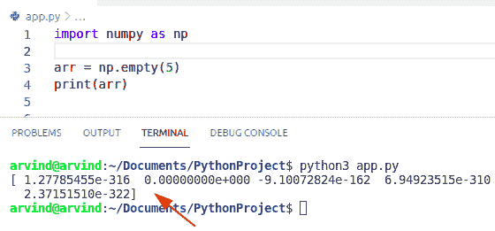

Python numpy empty array

要创建一个空数组，我们可以很容易地将空列表传递给 numpy。array()方法，它将创建一个空数组。

**举例:**

```py
import numpy as np

list = []
arr = np.array(list)
print(arr)
```

下面是以下代码的截图

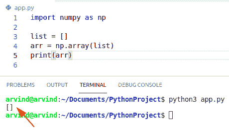

Create numpy empty array

这就是如何使用 Python NumPy 创建一个空数组。

## 使用 numpy zero 的数组函数

*   在这个方法中，我们实现了一个 **numpy zero 的数组函数**。
*   此方法返回给定形状和数据类型的新数组，带有零。

**语法:**

下面是 numpy zeros()函数的语法

```py
numpy.zeros
           (
            shape,
            dtype = None, 
            order = 'C' 
           )
```

**举例:**

```py
import numpy as np

arr = np.zeros([2,2],dtype='int')
print(arr)
```

下面是以下代码的截图

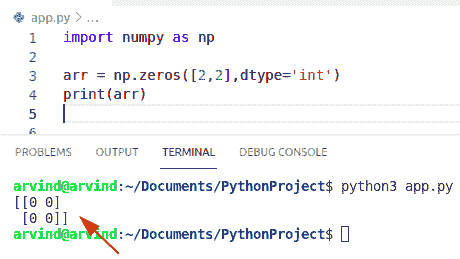

Python numpy empty array by using zeros

这是如何使用零创建一个 NumPy 数组。

阅读 [Python NumPy Random +示例](https://pythonguides.com/python-numpy-random/)

## Python numpy 空数组追加

*   在本节中，我们将讨论 **Python numpy 空数组追加**。
*   在这个方法中，我们可以很容易地使用函数 numpy.append()。
*   国民党。append()函数允许我们在现有 NumPy 数组的末尾包含新值。
*   此方法返回当前数组的副本，其中的值连接到指定的轴。
*   如果我们有一个数组，并想在一个循环中向它追加行，我们可以很容易地使用 np。empty()函数。
*   现在，我们可以用 numpy.append()函数向空数组追加新行。

**举例:**

让我们举一个例子来检查如何用 append 实现一个 **numpy 空数组。**

```py
import numpy as np

arr = np.empty((0,3), int)

arr2 = np.append(arr, np.array([[2,4,5]]), axis=0)
array = np.append(arr2, np.array([[7,8,9]]), axis=0)

print(array)
```

在上面的代码中，我们将使用函数 numpy 创建一个空的 numpy 数组。empty()并定义其数据类型。现在，我们可以通过使用函数 np.append()轻松地沿 0 轴追加两行

下面是以下代码的截图

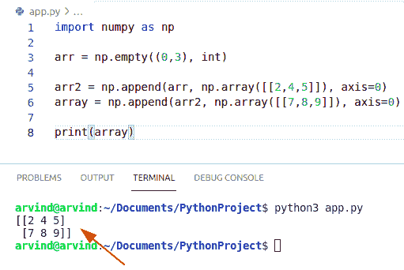

Python numpy empty array append

读取 [Python NumPy 零](https://pythonguides.com/python-numpy-zeros/)

## Python numpy 空数组追加示例

*   在本节中，我们将讨论 numpy 空数组追加。
*   在这个例子中，我们可以很容易地使用函数 numpy。追加()。
*   名单。append()方法将一个元素连接到列表的最后。
*   然后我们可以使用 np 将这个列表转换成一个 numpy 数组。array()函数。

**举例:**

```py
import numpy as np

list = []
list.append([2,4,6])
list.append([9,5,7])
arr2 = np.array(list)
print(arr2)
```

下面是以下代码的截图

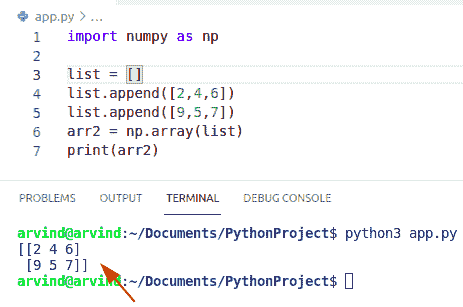

Python numpy empty array append list method

## Python numpy 数组空检查

如果你想检查一个 NumPy 数组是否为空，那么就按照一篇关于[用 Python](https://pythonguides.com/check-if-numpy-array-is-empty/) 检查 NumPy 数组是否为空的文章。

## 没有形状的 Python 空 numpy 数组

*   在本节中，我们将讨论没有形状的 **Python 空 numpy 数组。**
*   在这个例子中，我们可以很容易地使用函数 np。append()获取没有形状的空 numpy 数组。
*   首先，我们将创建一个列表，并将其转换为一个数组，并获取一个可迭代的变量 y。
*   它不接受形状和数据类型作为参数。

**举例:**

```py
import numpy as np
y=[]
a = np.array([2,3,4,5])
for x in y:
    a = np.append(a, x)
print(y)
```

下面是以下代码的截图

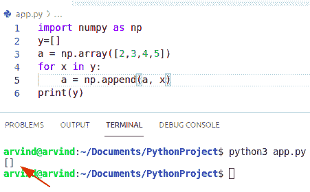

Python empty numpy array without shape

上面的代码我们可以用来**在 Python** 中创建没有形状的空 NumPy 数组。

阅读 [Python NumPy nan](https://pythonguides.com/python-numpy-nan/)

## Python numpy 空 2d 数组

*   在本节中，我们将讨论 **Python numpy 空 2d 数组**。
*   要创建一个空的二维数组，我们可以将 2D 数组的形状(即行和列)作为一个元组传递给 empty()函数。
*   在这个例子中，我们可以很容易地使用函数 np。空()。
*   它只接受形状和数据类型作为参数。
*   它返回一个包含行和列的空二维数组，但该二维数组中的所有元素都没有初始化。
*   在这个例子中，默认情况下我们没有提供数据类型作为参数，而是将值作为浮动值。

**语法:**

```py
numpy.empty
           (
            shape,
            dtype=float,
            order='C'
           )
```

**举例:**

```py
import numpy as np
arr = np.empty((4, 3), int)
print('Empty 2D Numpy array:')
print(arr)
```

在上面的代码中，我们将导入 numpy 库，创建一个 4 行 3 列的空二维 numpy 数组，并打印结果。

下面是以下代码的截图

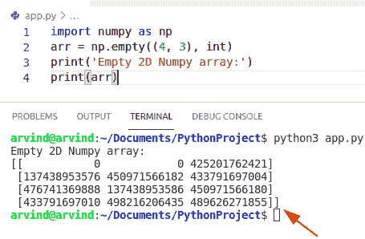

Python numpy empty 2d array method

这就是如何在 Python 中创建一个空的 2D Numpy 数组。

读取[值错误:用序列](https://pythonguides.com/valueerror-setting-an-array-element-with-a-sequence/)设置数组元素

## Python numpy 连接空数组

*   在本节中，我们将讨论 **Python numpy concatenate 空数组**。
*   我们需要创建一个指定大小为 m*n 的数组，其中 m 是行数，n 是用空值填充的列数，这样当我们向该数组追加值时，初始值就存在了。
*   在这个方法中，我们可以很容易地使用函数 numpy.concatenate()。
*   该方法用于沿轴连接两个或多个给定的数组。
*   numpy。concatenate()函数将一个元素连接到列表的最后。
*   在这个方法中，我们可以很容易地使用两个函数 np。concatenate 和 np。empty()获取空数组。

示例:

```py
import numpy as np
a = np.empty([2,2])  
b = np.array([[4,5],[6,7]])    
arr = np.concatenate((a,b)) 
print(arr) 
```

下面是以下代码的截图

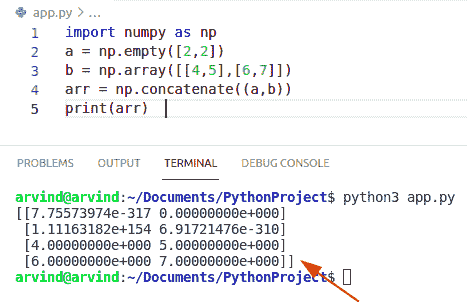

Python numpy concatenate empty array

上面的代码我们可以用来连接 Python NumPy 中的空数组。

阅读 [Python NumPy 平均值及示例](https://pythonguides.com/python-numpy-average/)

## Python numpy 声明空数组

*   在这一节中，我们将讨论 Python numpy 声明空数组。
*   在这个方法中，我们可以很容易地使用函数 numpy.empty()。
*   函数的作用是:创建一个给定形状和类型的新数组，不需要初始化条目。

**语法:**

下面是 numpy.empty()的语法

```py
numpy.empty
           (
            shape,
            dtype=float,
            order='C'
           )
```

**举例:**

要创建某种指定数据类型的空 NumPy 数组，我们可以在 empty()函数中将该数据类型作为 dtype 参数传递。

```py
import numpy as np
a = np.empty([2,2], dtype= complex) 
print(a) 
```

在上面的代码中，我们将创建一个空的复数 numpy 数组，我们需要在 numpy.empty()函数中将复数值作为 dtype 参数传递。

下面是以下代码的截图

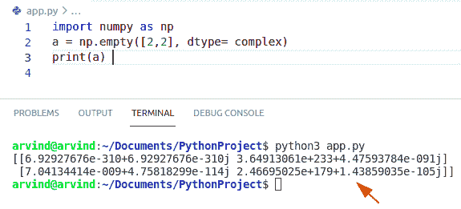

Python numpy declare empty array

这就是如何使用 Python NumPy 声明空数组。

## 在 Python 中声明 numpy 空数组

为了创建一个空的整数数组，我们需要在 np 中传递一个整数作为 dtype 参数。empty()函数。

**举例:**

```py
import numpy as np
a = np.empty([3,3], dtype= 'int') 
print(a) 
```

在上面的代码中，我们将创建一个空的整数数组，我们需要在 NumPy.empty()函数中将 int 作为 dtype 参数传递。

下面是以下代码的截图

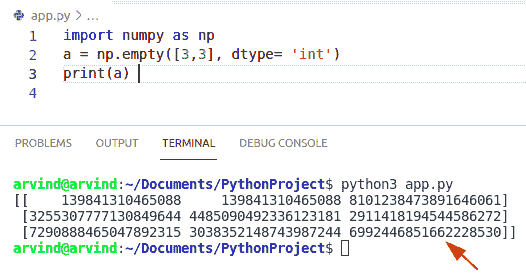

Python numpy declare empty array integer method

这就是如何**创建一个空的整数数组**。

阅读 [Python NumPy 绝对值示例](https://pythonguides.com/python-numpy-absolute-value/)

## Python numpy 空字符串数组

*   在本节中，我们将讨论 **Python numpy 空字符串数组**。
*   为了创建一个空的字符串数组，我们可以很容易地使用函数 np。空()。
*   要创建 4 个字符串的空数组(大小为 3)，我们需要在 np 中传递“S3”作为 dtype 参数。empty()函数。
*   它只接受形状和数据类型作为参数。

**举例:**

让我们举一个例子来检查如何创建一个 numpy 空字符串数组

```py
import numpy as np

array = np.empty(4, dtype='S3')
print(array)
```

这里的“S3”表示“长度为 3 的 Unicode 字符串”

下面是以下代码的截图

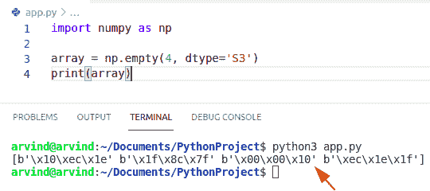

Python numpy empty string array

上面的代码我们可以用 NumPy 在 Python 中创建一个空的字符串数组。

## Python numpy 空 3d 数组

*   在本节中，我们将讨论 **Python numpy 空 3d 数组**。
*   要创建一个空的三维数组，我们可以将三维数组的形状作为一个左括号传递给 empty()函数。
*   在这个例子中，我们可以很容易地使用函数 np.empty()来获得空的三维数组。
*   让我们创建一个 3 行 3 列的空三维数组。
*   在这个函数中，我们没有提供任何数据类型作为参数。但是三维数组中的所有值都没有初始化。

**举例:**

```py
import numpy as np

array = np.empty((1, 3, 3)) # where 1 is the length of matrix
print(array)
```

在上面的示例代码中，我们将导入一个库并创建一个空的 numpy 数组，在该数组中，我们将一个参数指定为矩阵的长度(1)以及若干行和列。

下面是以下代码的截图

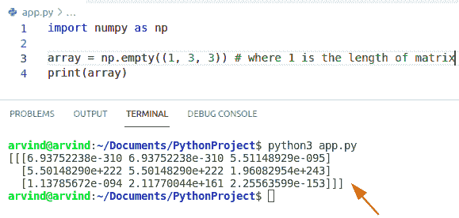

Python numpy empty 3d array

这是一个 **Python NumPy 空 3d 数组**的例子。

阅读 [Python NumPy square 示例](https://pythonguides.com/python-numpy-square/)

## Python 填充空 numpy 数组

*   在本节中，我们将讨论 **Python 填充空 numpy 数组**。
*   在这个方法中，我们可以很容易地使用函数 numpy.empty()。
*   用 numpy 创建数组时。空，则需要使用 shape 参数在输出中指定相同的 shape 参数。
*   让我们创建一个空数组并使用方法 a.fill()。
*   fill()方法用于用标量和向量值填充数组。
*   在这个方法中，如果我们使用 fill()函数，就不需要使用循环来初始化 numpy 数组。

**举例:**

```py
import numpy as np

a = np.empty(4)
a.fill(3)
print(a)
```

下面是以下代码的截图

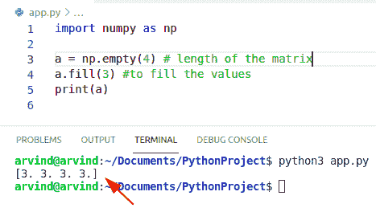

Python fill empty numpy array

上面的代码我们可以用 Python 来填充空的 NumPy 数组。

## Python 创建一个空的 Numpy 数组并追加行

*   在本节中，我们将讨论**空 Numpy 数组和追加行**。
*   在这个方法中，首先，我们将创建一个 4 列 0 行的空 numpy 数组。
*   现在，要将新行连接到这个空的二维数组，我们可以使用 numpy。追加()。
*   但是我们只需要将行作为相同形状的数组传递，并传递 axis=0，这样它就可以沿着列连接起来。

**举例:**

```py
import numpy as np

arr = np.empty((0, 4), int)
print('Empty 2D Numpy array:')
print(arr)
# Append a row to the 2D numpy array
emp_arr = np.append(arr, np.array([[4, 3, 6, 7]]), axis=0)
# Append 2nd rows to the 2D Numpy array
emp_arr = np.append(emp_arr, np.array([[2, 6, 9, 10]]), axis=0)
print('2D Numpy array:')
print(emp_arr)
```

在上面的代码中，我们的二维数组有 4 列，因此要插入一个新行，我们需要将该行作为一个单独的二维数组(2，4)传递。

下面是以下代码的截图

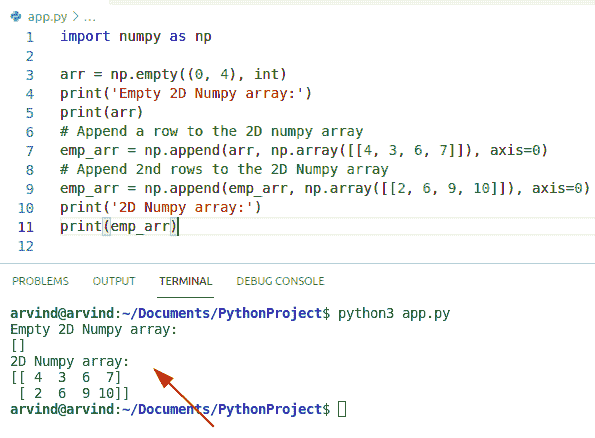

Python Create an Empty Numpy array and append rows

上面的代码我们可以用来创建一个空的 Numpy 数组，并在 Python 中追加行。

阅读 [Python NumPy 以列出示例](https://pythonguides.com/python-numpy-to-list/)

## Python 创建空 Numpy 数组并追加列

*   在这一节中，我们将讨论空 Numpy 数组和追加列。
*   在这个方法中，首先，我们将创建一个 0 列 4 行的空 numpy 数组。
*   现在，要将一个新列连接到这个空的二维数组，我们可以很容易地使用 np。追加()。
*   但是我们需要将列作为一个相同形状的 numpy 数组传递，只有一个参数 axis=1，这样它就可以沿着列追加。

**举例:**

```py
import numpy as np

arr = np.empty((4, 0), int)
print('Empty 2D Numpy array:')
print(arr)
# Column list1
emp_arr = np.append(arr, np.array([[4, 3, 6, 7]]).transpose(), axis=1)

print('2D Numpy array:')
print(emp_arr)
```

在上面的代码中，我们的空 numpy 数组有 4 行和 0 列，所以要插入一个新列，我们需要将这个列作为一个单独的 2 维数组传递，维度为(4，1)。

下面是以下代码的截图

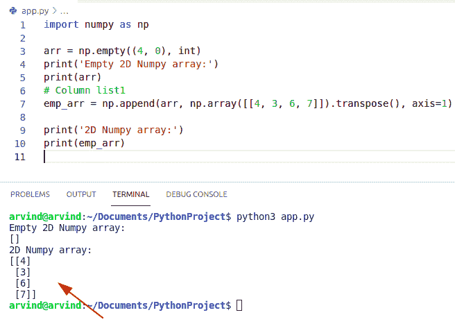

Python Create Empty Numpy array and append Columns

我们可以使用上面的代码**创建一个空的 Numpy 数组，并在 Python** 中追加列。

您可能会喜欢以下 Python 教程:

*   [Python NumPy 读取 CSV](https://pythonguides.com/python-numpy-read-csv/)
*   [如何在 Python 中把列表转换成字符串](https://pythonguides.com/python-convert-list-to-string/)
*   [在 Python 中检查列表是否为空](https://pythonguides.com/check-if-a-list-is-empty-in-python/)

在本 Python 教程中，我们将讨论 **Python NumPy 空数组**，并给出如下几个例子:

*   Python numpy 空数组追加
*   Python numpy 数组空检查
*   没有形状的 Python 空 numpy 数组
*   Python numpy 空 2d 数组
*   Python numpy 连接空数组
*   Python numpy 声明空数组
*   Python numpy 空字符串数组
*   Python numpy 空 3d 数组
*   Python 填充空 numpy 数组
*   Python 创建空 Numpy 数组并追加行
*   Python 创建空的 Numpy 数组并追加列

[Bijay Kumar](https://pythonguides.com/author/fewlines4biju/)

Python 是美国最流行的语言之一。我从事 Python 工作已经有很长时间了，我在与 Tkinter、Pandas、NumPy、Turtle、Django、Matplotlib、Tensorflow、Scipy、Scikit-Learn 等各种库合作方面拥有专业知识。我有与美国、加拿大、英国、澳大利亚、新西兰等国家的各种客户合作的经验。查看我的个人资料。

[enjoysharepoint.com/](https://enjoysharepoint.com/)[](https://www.facebook.com/fewlines4biju "Facebook")[](https://www.linkedin.com/in/fewlines4biju/ "Linkedin")[](https://twitter.com/fewlines4biju "Twitter")