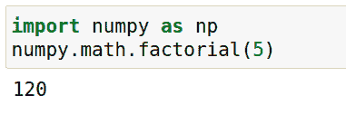
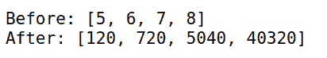
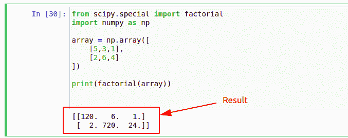

# Python Numpy 阶乘

> 原文：<https://pythonguides.com/python-numpy-factorial/>

[](https://sharepointsky.teachable.com/p/python-and-machine-learning-training-course)

在本 [Python 教程](https://pythonguides.com/python-hello-world-program/)中，我们将学习 **Python numpy 阶乘**。此外，我们将涵盖这些主题。

*   Python Numpy 阶乘
*   数组的 Python Numpy 阶乘
*   使用 Numpy 阶乘
*   Numpy 阶乘函数
*   Numpy 阶乘向量
*   Numpy 双因子
*   Numpy 阶乘示例

目录

[](#)

*   [Python Numpy 阶乘](#Python_Numpy_Factorial "Python Numpy Factorial")
*   [Python 数组的 Numpy 阶乘](#Python_Numpy_Factorial_of_Array "Python Numpy Factorial of Array")
*   [使用 Numpy 阶乘](#Using_Numpy_Factorial "Using Numpy Factorial")
*   [Numpy 阶乘函数](#Numpy_Factorial_Function "Numpy Factorial Function")
*   [Numpy 阶乘向量](#Numpy_Factorial_Vector "Numpy Factorial Vector")
*   [Numpy 双阶乘](#Numpy_Double_Factorial "Numpy Double Factorial")
*   [Numpy 阶乘示例](#Numpy_Factorial_Example "Numpy Factorial Example")

## Python Numpy 阶乘

在这一节中，我们将学习如何找到 python numpy 阶乘。阶乘的公式是 **`n! = n(n-1) (n-2) (n-3) .... n`** 。这里 n 是要计算其阶乘的数字。

*   阶乘是整数和它下面所有整数的乘积。例如，5 的阶乘是 1x2x3x4x5 = 120。
*   Factorial 显示执行任务或从集合中选择一个项目的可能性数量。
*   下面是计算 python numpy 阶乘的语法。这里 number 是要计算其阶乘的值。

```py
numpy.math.factorial(number)
```

**源代码:**

在这段代码中，我们导入了 python numpy 模块，然后使用`numpy.math.factorial()`方法计算了数字 5 的阶乘。

```py
import numpy as np

numpy.math.factorial(5)
```

**输出:**

在这个输出中，5 的阶乘计算为 5x4x3x2x1= `120` 。我们已经在 jupyter 笔记本上执行了此操作。如果您在任何其他代码编辑器上执行它，那么使用`print()` 函数来显示结果。



Python Numpy Factorial

阅读 [Python NumPy 删除](https://pythonguides.com/python-numpy-delete/)

## Python 数组的 Numpy 阶乘

在本节中，我们将学习如何计算数组的 python numpy 阶乘。数组是同质数据的集合。

*   我们只能在 factorial()函数中传递正整数，数组可以有相同的数据类型。
*   所以所有的条件似乎都对我们有利。我们将创建 Python Numpy 阶乘
*   数组的 Numpy 阶乘
*   数组的 Python Numpy 阶乘
*   使用 Numpy 阶乘
*   Numpy 阶乘函数一个整数数组或 python 列表，然后计算数组中每一项的阶乘。
*   使用 numpy 我们可以计算 python 列表或一维数组的阶乘。
*   在处理多维数组时，我们必须使用 python scikit-learn epts 正整数作为输入。
*   使用这种方法，我们可以在 python 中计算 Numpy 阶乘。
*   为了在多个数字上执行它，我们可以通过循环传递这些数字，并在每个数字上继续应用这个函数。
*   在我们的例子中，我们取了数字' 67895 '。结果将是 verlibrary 执行一个数组的阶乘。请参阅我们的使用 Numpy 阶乘部分以了解演示。

**源代码:**

在这段代码中，我们使用 `nump.math.factorial()` 计算并显示了数组中每个数字的阶乘。

```py
import numpy

**#array of numbers**
arr = [5, 6, 7, 8]

**#empty array**
new_arr = []

**#loop through each item in array (arr)**
for num in arr:

    **#calculate factorial of each item**
    res = numpy.math.factorial(num)

    **#add result in new_arr**
    new_arr.append(res)

**#display result**
print('Before:',arr)
print('After:',new_arr) 
```

**输出:**

在这个输出中，第一个数组是我们传递给程序的数组，在下一个数组中，显示了 Python Numpy Factorial of Array。



Python Numpy Factorial of Array

阅读 [Python NumPy 栈示例](https://pythonguides.com/python-numpy-stack/)

## 使用 Numpy 阶乘

在这一节中，我们将学习在 python 中使用 numpy factorial。在我们的其他部分，我们已经展示了如何计算 python numpy 阶乘。但是在这一节中，我们将做一些不同的事情。我们将计算多维数组的阶乘。

*   我们将学习使用 python numpy 阶乘来计算多维数组。
*   Numpy 提供了一个模块 **`numpy.math.factorial(int)`** ，但是它不能计算数组。所以我们将使用另一个模块来计算多维数组的阶乘。
*   Scipy 模块提供了一个方法 **`scipy.math.factorial(int/array)`** ，我们可以用它来计算一个数组的向量。
*   请注意，大数会产生非常大的阶乘，所以如果你是新手，请使用小数。
*   Scipy 可以使用 conda 或 pip 安装。下面是安装 scipy 模块的代码。

```py
**# for pip users**
pip install scipy

**# conda users**
conda install scipy
```

*   在我们的例子中，我们已经计算了二维数组的阶乘。这是我们示例的源代码。

```py
**# importing modules**
from scipy.special import factorial
import numpy as np

**# creating 2D array**
array = np.array([
    [5,3,1],
    [2,6,4]
])

**# printing factorial**
print(factorial(array)) 
```

**输出:**

在这个输出中，我们使用 numpy 创建了一个二维数组，然后使用 scipy 计算了一个数组的阶乘。



Using Numpy Factorial

阅读 [Python NumPy round](https://pythonguides.com/python-numpy-round/)

## Numpy 阶乘函数

在本节中，我们将了解 python numpy 阶乘函数。Numpy 提供了一个内置的函数 **`numpy.math.factorial()`** ，使用它我们可以计算一个数的阶乘。

*   Python numpy **`numpy.math.factorial(num)`** 方法接受正整数作为参数。
*   如果你得到一个下面的错误，这意味着你输入了负数。阶乘只能在正整数上执行。

```py
ValueError: factorial() not defined for negative values
```

*   如果出现以下错误，这意味着您输入了一个字符串、字母数字或带小数(浮点数)的数字。将其更改为正整数以修复此错误。

```py
ValueError: factorial() only accepts integral values
```

**源代码:**

在我们的示例中，我们创建了 python numpy numpy . math . factorial()方法的简单演示，其中我们计算了数字 6 的阶乘。此外，我们还试图寻找负数和非整数值的阶乘。

```py
import numpy

**#factorial of integer number** 
numpy.math.factorial(6)

**#factorial of negative number**
numpy.math.factorial(-6)

**#factorial of float number**
numpy.math.factorial(6.5)

**#factorial of string**
numpy.math.factorial("6.5")
```

**输出:**

这是在 jupyter 笔记本上执行的输出。在这个输出中，我们试图通过提供输入变量来计算阶乘。只有当我们在第 2 行输入一个正整数时，正确的答案才会显示出来，其余的测试用例都抛出了一个错误。