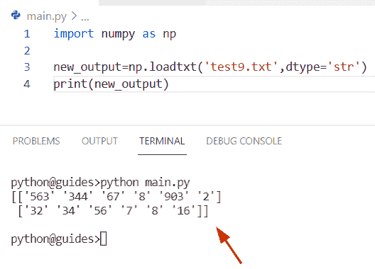

# python NumPy genfromtxt()–完整教程

> 原文：<https://pythonguides.com/python-numpy-genfromtxt/>

[](https://sharepointsky.teachable.com/p/python-and-machine-learning-training-course)

在本 [Python NumPy 教程](https://pythonguides.com/numpy/)中，我们将学习**如何在 NumPy 数组** Python 中使用 numpy genfromtxt()函数。通过 **Python NumPy genfromtxt 函数**，我们将涵盖这些主题。

*   Python numpy genfromtxt CSV
*   Python numpy genfromtxt converters
*   Python numpy genfromtxt columns
*   Python numpy loadtxt
*   Python numpy loadtxt 字符串
*   Python numpy loadtxt 跳过首行
*   Python numpy loadtxt 示例
*   Python numpy loadtxt dtype
*   Python numpy loadtxt skip column
*   Python numpy loadtxt usecol
*   Python numpy loadtxt dtype integer
*   Python numpy loadtxt 跳过最后几行
*   Python numpy loadtxt skip 头
*   Python numpy loadtxt 无法将字符串转换为浮点型

目录

[](#)

*   [Python numpy genfromtxt](#Python_numpy_genfromtxt "Python numpy genfromtxt")
*   [Python numpy genfromtxt CSV](#Python_numpy_genfromtxt_CSV "Python numpy genfromtxt CSV")
*   [Python numpy genfromtxt converters](#Python_numpy_genfromtxt_converters "Python numpy genfromtxt converters")
*   [Python numpy genfromtxt columns](#Python_numpy_genfromtxt_columns "Python numpy genfromtxt columns")
*   [Python numpy loadtxt](#Python_numpy_loadtxt "Python numpy loadtxt")
*   [Python numpy loadtxt 字符串](#Python_numpy_loadtxt_string "Python numpy loadtxt string")
*   [Python numpy loadtxt 跳过第一行](#Python_numpy_loadtxt_skip_first_row "Python numpy loadtxt skip first row")
*   [Python numpy loadtxt 示例](#Python_numpy_loadtxt_example "Python numpy loadtxt example")
*   [python num py load txt dttype](#Python_numpy_loadtxt_dtype "Python numpy loadtxt dtype")
*   [Python numpy loadtxt 跳过列](#Python_numpy_loadtxt_skip_column "Python numpy loadtxt skip column")
*   [Python numpy loadtxt usecol](#Python_numpy_loadtxt_usecol "Python numpy loadtxt usecol")
*   [python num py load txt dttype integer](#Python_numpy_loadtxt_dtype_integer "Python numpy loadtxt dtype integer")
*   [Python numpy loadtxt 跳过最后几行](#Python_numpy_loadtxt_skip_last_rows "Python numpy loadtxt skip last rows")
*   [Python numpy load txt skip header](#Python_numpy_loadtxt_skip_header "Python numpy loadtxt skip header")
*   [Python numpy loadtxt 无法将字符串转换为浮点数](#Python_numpy_loadtxt_could_not_convert_string_to_float "Python numpy loadtxt could not convert string to float")
    *   [解决方案:Python numpy loadtxt 无法将字符串转换为浮点数](#Solution_Python_numpy_loadtxt_could_not_convert_string_to_float "Solution:  Python numpy loadtxt could not convert string to float ")

## `Python numpy genfromtxt`

*   在本节中，我们将讨论如何使用 Python`numpy . genfromtxt()`函数从文本文件中加载数据。
*   在 Python 中，这个函数用于从一个文本文件中生成一个数组，该文本文件包含缺失值和不同的数据类型，如 **float、string** object 等。
*   该方法在 NumPy 包模块中可用，它用于将包含数据类型的文件读入数组格式。

**语法:**

让我们看一下语法并理解 Python numpy `genfromtxt()` 函数的工作原理

```py
numpy.genfromtxt
                (
                 fname,
                 dtype=<class 'float'>,
                 comments='#',
                 delimiter=None,
                 skip_header=0,
                 skip_footer=0,
                 converters=None,
                 missing_values=None,
                 filling_values=None,
                 usecols=None,
                 names=None,
                 excludelist=None,
                 replace_space='_',
                 autostrip=False,
                 case_sensitive=True,
                 unpack=None,
                 loose=True,
                 invalid_raise=True,
                 max_rows=None,
                 encoding='bytes',
                 like=None,
                )
```

*   它由几个参数组成
    *   **fname:** 该参数表示文件扩展名为 gz 或 bz2 的文件名，该文件通过 `genfromtxt()` 函数传递。
    *   **dtype:** 用于数组的数据类型，如果我们将 dtype 称为**‘无’**，那么它将根据该列的值自动生成数据类型。
    *   **注释:**这是一个可选参数，表示一个数组中注释的开始。
    *   **分隔符:**默认情况下，它没有值，如果我们想要分割值，那么我们可以很容易地使用这个参数。
    *   **skip_header:** 可选参数，表示从文件开始我们要跳过的行数。
    *   **skip_footer:** 该参数表示我们必须从文件结尾开始跳过的行数。
    *   **converters:** 用于将一列的数据转换为一个值，也为缺失值提供默认值。
    *   **missing_values:** 也是可选参数，是缺失数据对应的字符串集合。
    *   **filling_values:** 该参数在输入数据缺失时默认使用。
    *   **usecols:** 缺省情况下不取值，如果取值为 `0` ，则用于读取列值。

**举例:**

让我们举一个例子，看看如何使用 Python`numpy . genfromtxt()`函数从文本文件加载数据

**源代码:**

```py
from io import StringIO
import numpy as np

new_string = StringIO("15.9,20,Japan")
new_result = np.genfromtxt(new_string, dtype= 'S5', encoding = None, delimiter=",")
print("File data:",new_result)
```

在上面的代码中，我们导入了 `StringIO` 和 numpy 库，然后使用 `stringIO()` 方法创建了一个字符串，该方法用于对数据中的字符串进行 Unicode 处理。之后，我们声明了变量**‘new _ result’**，并分配了一个 `numpy.genfromtext()` 函数，在这个函数中，我们传递了字符串、数据类型和分隔符作为参数。

下面是以下给定代码的实现


Python numpy genfromtxt

另外，检查:[Python NumPy Normalize+Examples](https://pythonguides.com/python-numpy-normalize/)

## Python numpy genfromtxt CSV

*   在这个程序中，我们将讨论如何使用 Python`numpy . genfromtxt()`函数读取 CSV 文件。
*   为了完成这项任务，首先我们将创建一个 CSV 文件，我们将在其中插入整数。现在我们想在输出数据中加载这些数字。在这个程序中，我们首先为 `numpy.genfromtxt()` 函数导入了 numpy 库。
*   在这个函数中，我们将把 CSV 文件指定为一个参数。一旦您将打印**‘new _ data’**，那么输出将显示数据数组。

**源代码:**

```py
import numpy as np

new_data = np.genfromtxt('final.csv', delimiter = ',',dtype='int64')
print(new_data)
```

下面是以下代码的截图


Python numpy genfromtext CSV

同样，read: [Python NumPy read CSV](https://pythonguides.com/python-numpy-read-csv/)

## Python numpy genfromtxt converters

*   在本节中，我们将讨论如何在 Python`numpy genfromtx()`函数中转换字符串序列。
*   为了执行这个特定的任务，我们将使用 converter 概念，它用于将列的数据转换为值。
*   默认情况下，它的语法是**converters = { 3:lambda s:float(s 或 0))** 。在这个例子中，我们必须将输入字符串转换成数组值。在这种情况下，我们应该声明转换方法和 strip 参数。

**语法:**

下面是 Python`numpy . genfromtxt()`函数的语法

```py
numpy.genfromtxt
                (
                 fname,
                 dtype=<class 'float'>,
                 comments='#',
                 delimiter=None,
                 skip_header=0,
                 skip_footer=0,
                 converters=None,
                 missing_values=None,
                 filling_values=None,
                 usecols=None,
                 names=None,
                 excludelist=None,
                 replace_space='_',
                 autostrip=False,
                 case_sensitive=True,
                 unpack=None,
                 loose=True,
                 invalid_raise=True,
                 max_rows=None,
                 encoding='bytes',
                 like=None,
                )
```

**源代码:**

```py
 import numpy as np
from io import StringIO

new_info = "15,5.6,0, 18, 23.4, 9"

new_conv = lambda y: int(y.strip() or 0)
new_result=np.genfromtxt(StringIO(new_info), delimiter=",")
print("Conversion orf string to array:",new_result)
```

下面是以下给定代码的实现


Python numpy genfromtext converters

阅读: [Python NumPy Savetxt +示例](https://pythonguides.com/python-numpy-savetxt/)

## Python numpy genfromtxt columns

*   在这里我们可以看到如何在 Python`numpy . genfromtext()`函数中设置列。
*   为了完成这项任务，我们将使用 `usecols()` 参数，该参数将一系列整数值作为列的索引。在本例中，第一列的索引为 `0` ，表示我们只想显示第一列的元素。
*   在这个参数中，我们使用负整数作为常规索引，表示我们只想显示最后一列元素。

**举例:**

```py
import numpy as np
from io import StringIO

new_data = u"29,5,18, 56, 98, 23"
result=np.genfromtxt(StringIO(new_data), usecols=(0, -1))
print(result)
```

下面是以下给定代码的输出


Python numpy genfromtext columns

读: [Python NumPy argsort](https://pythonguides.com/python-numpy-argsort/)

## Python numpy loadtxt

*   在本节中，我们将学习如何使用 numpy.loadtxt()函数在 Python numpy 数组中加载文本文件。
*   在 Python 中， `numpy.loadtxt()` 函数用于从文本文件中加载数据，该方法在 numpy 包模块中可用。
*   在这个方法中，文本文件中的每一行都必须有相同数量的值。

**语法:**

让我们看一下语法并理解 Python `numpy.loadtxt()` 函数的工作原理

```py
numpy.loadtxt
             (
              fname,
              dtype=<class 'float'>,
              comments='#',
              delimiter=None,
              converters=None,
              skiprows=0,
              usecols=None,
              unpack=False,
              ndim=0,
              encoding='bytes',
              max_rows=None,
              like=None
             )
```

**举例:**

让我们举一个例子，看看如何在 Python numpy 数组中加载文本文件

**源代码:**

```py
import numpy as np

new_result=np.loadtxt('test9.txt',dtype='float')
print(new_result)
```

在下面的代码中，我们使用数据类型(dtype)参数将文本文件加载到 NumPy 数组中。在这个例子中，我们在参数中提到了 float 数据类型。一旦您将打印**' new _ re suit '**，那么输出将在一个数组中显示浮点值。

你可以参考下面的截图


Python numpy loadtxt

阅读:[Python NumPy Delete–完整教程](https://pythonguides.com/python-numpy-delete/)

## Python numpy loadtxt 字符串

*   在这个程序中，我们将讨论如何使用 string 参数将文本文件加载到 numpy 数组中。
*   在本例中，我们必须对 `NumPy.loadtxt()` 函数使用 dtype 参数，该参数定义了结果数组的数据类型，即字符串。
*   为了执行这个任务，我们将首先导入 numpy 库，然后声明一个变量**‘new-output’**。现在通过使用 `numpy.loadtxt()` 函数，我们将传递文本文件和 **dtype='str'** 作为参数。

**源代码:**

```py
import numpy as np

new_output=np.loadtxt('test9.txt',dtype='str')
print(new_output)
```

下面是以下给定代码的实现



Python numpy loadtxt string

正如您在屏幕截图中看到的，输出在一个数组中显示字符串值。

阅读: [Python NumPy 最小教程](https://pythonguides.com/python-numpy-minimum/)

## Python numpy loadtxt 跳过第一行

*   在本节中，我们将讨论如何在 Python `numpy.loadtxt()` 函数中使用 skip rows 参数。
*   在此函数中，skiprows 参数值为 `0` ，用于跳过第一行。
*   在这个例子中，我们使用了 `numpy.loadtxt()` 函数，在这个函数中，我们应用了 CSV 文件和 skiprows 作为参数。
*   打印“new_data”后，输出将显示数组，但第一个元素已从输入数组中删除。

**举例:**

```py
import numpy as np

new_data = np.loadtxt('final.csv',delimiter=',',skiprows=1,dtype='int64')
print("Skipped rows from array:",new_data)
```

下面是以下给定代码的执行过程


Python numpy loadtxt skip first row

阅读: [Python NumPy 数据类型](https://pythonguides.com/python-numpy-data-types/)

## Python numpy loadtxt 示例

*   在本节中，我们将讨论如何在 Python 中使用 `numpy.loadtxt()` 函数。
*   在本例中，我们将在 Python numpy.loadtxt()函数中应用特定的参数。为了完成这项任务，我们将首先导入 numpy，然后使用 `StringIO` 函数创建一个字符串。
*   现在创建一个变量**‘new _ result’**，并分配 `numpy.loadtxt()` 函数。在函数中，我们使用了字符串、分隔符、usecols、dtype 和 `unpack=True` 作为参数。

**举例:**

让我们举一个例子，检查如何在 `NumPy.loadtxt()` 函数中使用这些参数

**源代码:**

```py
from io import StringIO   
import numpy as np

new_string = StringIO("16, 8, 97, \n14, 17")
new_result =np.loadtxt(new_string, delimiter =', ', usecols =(0, 1),unpack = True,dtype='int64')
print(new_result)
```

下面是以下给定代码的输出


Python numpy loadtxt example

阅读: [Python Numpy unique](https://pythonguides.com/python-numpy-unique/)

## python num py load txt dttype

*   这里我们可以看到如何在 Python `numpy.loadtxt()` 函数中使用 datatype 参数。
*   该参数定义 numpy 数组的数据类型，默认情况下，它采用 float 数据类型。根据条件，如果我们在字符串中取浮点值，那么默认情况下，结果将显示为十进制值。
*   每一行都被解释为 NumPy 数组的一个值，并且许多字段必须与 dtype 参数中的列数相匹配。

**语法:**

下面是 Python `numpy.loadtxt()` 函数的语法

```py
numpy.loadtxt
             (
              fname,
              dtype=<class 'float'>,
              comments='#',
              delimiter=None,
              converters=None,
              skiprows=0,
              usecols=None,
              unpack=False,
              ndim=0,
              encoding='bytes',
              max_rows=None,
              like=None
             )
```

**举例:**

让我们举个例子，看看如何在 Python `numpy.loadtxt()` 函数中使用 type 参数

**源代码:**

```py
from io import StringIO   
import numpy as np

new_str = StringIO("F 32 86 Oliva\nM 45 32 John")
result=np.loadtxt(new_str, dtype={'names': ('stu_gender', 'student_age', 'student_id','student_name'),
                     'formats': ('S1', 'i4', 'f4','S5')})
print(result)
```

下面是以下给定代码的输出


Python numpy loadtxt dtype

阅读: [Python NumPy 计数–实用指南](https://pythonguides.com/python-numpy-count/)

## Python numpy loadtxt 跳过列

*   在这一节中，我们将讨论如何在 Python 中从没有第一列的文本文件中加载数据。
*   这里我们可以使用 Python `numpy.loadtxt()` 函数的概念，在这个函数中，我们使用了 usecols 参数来跳过第一列元素。
*   该参数定义了要读取的列，默认情况下，它对所有要读取的列都取 none 值，如果您想要提取特定的列，那么我们必须在函数中提到 usecols 参数。

```py
import numpy as np

new_values = np.loadtxt('test9.txt', usecols=(1, 2), unpack=True)
print("Skipped columns from array:",new_values)
```

在上面的代码中，我们导入了 numpy 库，然后使用 numpy.loadtxt()函数，在该函数中，我们将文本文件和 `usecols()` 指定为参数。一旦你打印了**‘new _ values’**，结果就会显示第一列已经被删除的数组。

下面是以下代码的截图


Python numpy loadtxt skip column


input array text file for Python loadtxt skipcol

阅读: [Python NumPy 替换](https://pythonguides.com/python-numpy-replace/)

## Python numpy loadtxt usecol

*   在本期节目中，我们将讨论如何在 `NumPy.loadtxt()` 函数中应用 usecol 参数。
*   我们已经在 Python numpy loadtxt 跳过列主题中讨论了这个参数。

## python num py load txt dttype integer

*   这里我们可以使用 type 参数，并在 Python numpy.loadtxt()函数中分配 integer 数据类型。
*   这个参数定义了产生的数组数据类型，默认情况下它被设置为 float，但是在这个例子中，我们将设置 **dtype='integer'** 。
*   在这个程序中，我们必须使用 `numpy.loadtxt()` 函数中的 dtype 参数来加载文本文件。

**举例:**

让我们举一个例子，检查如何使用 `Numpy.loadtxt()` 函数中的类型参数

**源代码:**

```py
import numpy as np

result=np.loadtxt('test9.txt',dtype='int')
print(result)
```

你可以参考下面的截图


Python numpy loadtxt dtype integer

阅读: [Python NumPy 矩阵乘法](https://pythonguides.com/python-numpy-matrix-multiplication/)

## Python numpy loadtxt 跳过最后几行

*   在本节中，我们将讨论如何在 Python `numpy.loadtxt()` 函数中跳过最后一行。
*   这里我们将排除文本文件的最后一行。为了完成这个任务，我们将使用 `numpy.loadtxt()` 函数，在这个函数中，我们必须使用 open()函数以阅读模式打开文本文件。
*   我们必须使用切片方法 **[:-1]** 来跳过给定数组中的最后一行。一旦你将打印**‘新数据’**，那么输出显示更新后的数组。

**举例:**

```py
import numpy as np

new_data = np.loadtxt(open('test9.txt','rt').readlines()[:-1],dtype='int64')
print("Skipped last row from array:",new_data)
```

**输入数组**


input array text file for Python loadtxt skip last row

下面是以下给定代码的执行过程


Python numpy loadtxt skip last rows

正如您在截图中看到的，最后一行已经从数组中删除。

阅读: [Python 数字差异示例](https://pythonguides.com/python-numpy-diff/)

## Python numpy load txt skip header

*   在这一节中，我们将讨论如何使用 Python `numpy.loadtxt()` 函数跳过数组中的 header 部分。
*   通过使用 `numpy.loadtxt()` 函数我们可以很容易地解决这个问题。在这个例子中，我们必须考虑文本文件的第一行将是标题，然后，我们将使用 skiprows 参数并赋值 `1` 。一旦您将打印**‘ski _ head’**，那么输出将显示更新后的数组，数组的第一行已被删除。

**语法:**

下面是 Python `numpy.loadtxt()` 函数的语法

```py
numpy.loadtxt
             (
              fname,
              dtype=<class 'float'>,
              comments='#',
              delimiter=None,
              converters=None,
              skiprows=0,
              usecols=None,
              unpack=False,
              ndim=0,
              encoding='bytes',
              max_rows=None,
              like=None
             )
```

**举例:**

```py
import numpy as np

ski_head = np.loadtxt('test9.txt',dtype='int64',skiprows=1)
print("Skipped header from array:",ski_head)
```

你可以参考下面的截图


Python numpy loadtxt skip header

阅读: [Python NumPy 索引](https://pythonguides.com/python-numpy-indexing/)

## Python numpy loadtxt 无法将字符串转换为浮点数

*   在本节中，我们将讨论如何使用 Python `numpy.loadtxt()` 函数解决值错误**“无法将 string 转换为 float”**。
*   为了完成这个任务，我们将导入 numpy 库，然后使用 `numpy.loadtxt()` 函数，在这个函数中，我们将应用 delimiter 参数，它用于分隔值。
*   在本例中，我们刚刚创建了一个文本文件并插入了值。现在我们必须从文本文件中加载数据。

**源代码:**

```py
import numpy as np

new_values = np.loadtxt('test9.txt',delimiter=';')
print(new_values)
```

下面是以下给定代码的实现


Python numpy loadtxt could not convert string to float

正如你在截图中看到的，错误发生在无法将字符串转换为浮点型:“数组值”

### 解决方案:Python numpy loadtxt 无法将字符串转换为浮点数

以下是无法将字符串转换为浮点数的解决方案

在本例中，我们刚刚用一个 CSV 文件更新了文本文件

**源代码:**

```py
import numpy as np

new_result =np.loadtxt('final.csv', delimiter=';')
print(new_result)
```

下面是以下代码的截图


Solution of Python could not convert string to float

正如您在屏幕截图中看到的，输出显示了数组值。

您可能还想阅读以下关于 Python NumPy 的教程。

*   [Python NumPy append + 9 示例](https://pythonguides.com/python-numpy-append/)
*   [Python NumPy 矩阵+示例](https://pythonguides.com/python-numpy-matrix/)
*   [Python NumPy Sum +示例](https://pythonguides.com/python-numpy-sum/)
*   [Python NumPy Median +示例](https://pythonguides.com/python-numpy-median/)
*   [Python NumPy Arange +示例](https://pythonguides.com/python-numpy-arange/)
*   [Python 复制 NumPy 数组](https://pythonguides.com/python-copy-numpy-array/)

因此，在本教程中，我们已经学习了如何在 NumPy array Python 中使用 numpy genfromtext()函数。此外，使用 **Python NumPy genfromtext 函数**，我们已经涵盖了这些例子。

*   Python numpy genfromtxt CSV
*   Python numpy genfromtxt converters
*   Python numpy genfromtxt columns
*   Python numpy loadtxt
*   Python numpy loadtxt 字符串
*   Python numpy loadtxt 跳过首行
*   Python numpy loadtxt 示例
*   Python numpy loadtxt dtype
*   Python numpy loadtxt skip column
*   Python numpy loadtxt usecol
*   Python numpy loadtxt dtype integer
*   Python numpy loadtxt 跳过最后几行
*   Python numpy loadtxt skip 头
*   Python numpy loadtxt 无法将字符串转换为浮点型

[Bijay Kumar](https://pythonguides.com/author/fewlines4biju/)

Python 是美国最流行的语言之一。我从事 Python 工作已经有很长时间了，我在与 Tkinter、Pandas、NumPy、Turtle、Django、Matplotlib、Tensorflow、Scipy、Scikit-Learn 等各种库合作方面拥有专业知识。我有与美国、加拿大、英国、澳大利亚、新西兰等国家的各种客户合作的经验。查看我的个人资料。

[enjoysharepoint.com/](https://enjoysharepoint.com/)[](https://www.facebook.com/fewlines4biju "Facebook")[](https://www.linkedin.com/in/fewlines4biju/ "Linkedin")[](https://twitter.com/fewlines4biju "Twitter")