# Python NumPy 索引–详细指南

> 原文：<https://pythonguides.com/python-numpy-indexing/>

[](https://sharepointsky.teachable.com/p/python-and-machine-learning-training-course)

在本 [Python 教程](https://pythonguides.com/python-hello-world-program/)中，我们将学习**如何获取 NumPy 数组** Python 中的索引号。此外，我们将涵盖这些主题。

*   Python NumPy 索引数组
*   Python numpy 值索引
*   最大值的 Python NumPy 索引
*   元素的 Python NumPy 索引
*   Python NumPy 最小索引
*   Python NumPy 索引条件
*   Python NumPy 索引函数
*   Python NumPy 索引列表
*   Python NumPy 索引搜索
*   Python NumPy 索引，其中
*   Python NumPy 获取值为真的索引
*   Python NumPy 索引排序
*   Python NumPy 排除索引
*   Python NumPy 返回最大值的索引
*   Python NumPy 移除索引
*   Python NumPy 随机索引
*   Python NumPy 重置索引
*   Python NumPy 唯一索引
*   Python NumPy 获取最小值的索引
*   Python NumPy 逻辑索引
*   Python NumPy 布尔索引
*   Python np.ravel_multi_index

目录

[](#)

*   [Python NumPy 索引](#Python_NumPy_indexing "Python NumPy indexing")
*   [Python NumPy 索引数组](#Python_NumPy_indexing_array "Python NumPy indexing array")
*   [Python numpy 值的索引](#Python_numpy_index_of_value "Python numpy index of value")
*   [Python NumPy 索引的最大值](#Python_NumPy_index_of_max_value "Python NumPy index of max value")
*   [元素的 Python NumPy 索引](#Python_NumPy_index_of_element "Python NumPy index of element")
*   [Python NumPy 索引的最小值](#Python_NumPy_index_of_minimum "Python NumPy index of minimum")
*   [Python NumPy 索引条件](#Python_NumPy_index_condition "Python NumPy index condition")
*   [Python NumPy 索引函数](#Python_NumPy_index_function "Python NumPy index function")
*   [Python NumPy 索引列表](#Python_NumPy_index_list "Python NumPy index list")
*   [Python NumPy 索引其中](#Python_NumPy_index_where "Python NumPy index where")
*   [带索引的 Python NumPy 排序](#Python_NumPy_sort_with_index "Python NumPy sort with index")
*   [Python NumPy 排除索引](#Python_NumPy_exclude_index "Python NumPy exclude index")
*   [Python NumPy 返回索引的最大值](#Python_NumPy_return_index_of_max_value "Python NumPy return index of max value")
*   [Python NumPy 移除索引](#Python_NumPy_remove_index "Python NumPy remove index")
*   [Python NumPy 随机索引](#Python_NumPy_random_index "Python NumPy random index")
*   [Python NumPy 重置索引](#Python_NumPy_reset_index "Python NumPy reset index")
*   [Python NumPy 唯一索引](#Python_NumPy_unique_index "Python NumPy unique index")
*   [Python NumPy 获取索引的最小值](#Python_NumPy_get_index_of_min_value "Python NumPy get index of min value")
*   [Python NumPy 逻辑索引](#Python_NumPy_logical_indexing "Python NumPy logical indexing")
*   [Python NumPy 布尔索引](#Python_NumPy_boolean_indexing "Python NumPy boolean indexing")
*   [Python NP . ravel _ multi _ index](#Python_npravel_multi_index "Python np.ravel_multi_index")

## Python NumPy 索引

*   在这一节中，我们将讨论如何在 Python 中找到 NumPy 数组中某个值的索引。
*   为了执行这个特殊的任务，我们将使用 `slicing()` 方法。在 Python 中，切片方法用于表示如何对数组中的序列进行切片。例如，我们有一个由 `1000` 个元素组成的数组，现在我们只想从数组中选择特定的值，那么我们可以很容易地使用切片方法，从数组中获得选定的值。
*   这个方法有三个参数，在这个函数中，我们必须将停止、步进和开始参数传递给内置的切片函数。

让我们看看**语法**并理解切片的工作原理

```py
slice
     (
      start,
      stop,
      step
     )
```

**举例:**

```py
import numpy as np 

new_arr = np.arange(16) 
result = slice(2) 
print("Slicing elements:",new_arr[result])
```

在上面的代码中，我们创建了一个 arrange 函数，然后用值**‘2’**定义了一个 slice 对象。之后，切片对象被设置在一个数组中。一旦您将打印' new_arr'[result]，那么输出将显示 **[0，1]** 切片元素。

下面是以下代码的截图

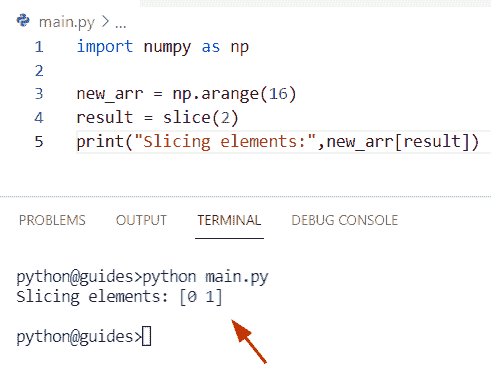

Python NumPy indexing

另外，检查: [Python NumPy 2d 数组](https://pythonguides.com/python-numpy-2d-array/)

## Python NumPy 索引数组

*   在这个程序中，我们将讨论如何在 Python 中获取 NumPy 数组的索引。
*   为了完成这项任务，我们将使用数组条件 **[]** ，在其中我们将指定索引号并获取输出中的元素。
*   在这个例子中，我们将使用函数 np.array()创建一个 NumPy 数组。之后，我们将使用 print 语句，并将 new _ array**【1，3】**设置为参数。

**源代码:**

```py
import numpy as np

new_array = np.array([[12,23,65,16,82], [54,16,17,23,98]])

print("Indexing element:", new_array[1, 3]) 
```

下面是以下给定代码的实现

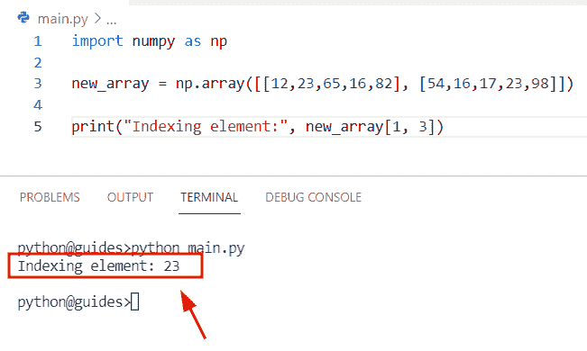

Python NumPy indexing array

正如您在屏幕截图中看到的，输出显示了第 2 行的第 4 个元素。

阅读: [Python NumPy 3d 数组](https://pythonguides.com/python-numpy-3d-array/)

## Python numpy 值的索引

*   在这一节中，我们将讨论如何在 Python 中获得 Numpy 数组元素的索引号。
*   通过使用 `np.where()` 函数，我们可以很容易地找到数组中给定值的索引号。在 Python 中， `np.where()` 函数用于从给定数组中选择元素，它总是返回元素的索引。
*   例如，我们有一个有多个值的数组，我们的条件可能是 `x` 和 `y` 参数没有被传递，只有条件参数被传递，它将在根据条件过滤后返回一个新的数组。

让我们看看如何在我们的程序中应用这个函数

**语法:**

```py
numpy.where
           (
            condition
            [,
            x,
            y
            ]
           )
```

**举例:**

让我们举一个例子，看看如何获得 NumPy 数组中的索引值

**源代码:**

```py
import numpy as np

new_array = np.array([23, 27,31, 47, 36, 78, 85, 18, 34, 39])

new_output = np.where(new_array > 36)
print("Index value:",new_output)
```

下面是以下给定代码的输出

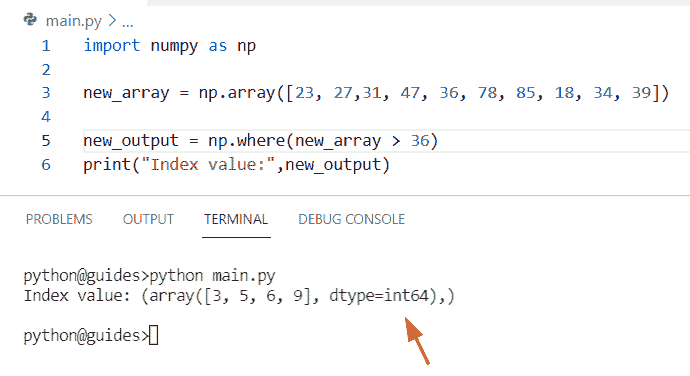

Python numpy index of a value

阅读: [Python NumPy Normalize +示例](https://pythonguides.com/python-numpy-normalize/)

## Python NumPy 索引的最大值

*   在本节中，我们将讨论如何在 Python 中获取 NumPy 数组中最大值的索引。
*   为了执行这个特定的任务，我们将使用 `np.argmax()` 函数。在 Python 中，该函数用于获取最大数目的索引，并检索与最大值相关联的索引。
*   这个方法将一个数组和一个轴作为参数，这个函数在 NumPy 包模块中可用。

让我们看一下语法，了解一下 `np.argmax()` 函数

```py
numpy.argmax
            (
             a,
             axis=None,
             out=None
            )
```

*   它由几个参数组成
    *   **a:** 该参数表示输入数组
    *   **轴:**这是一个可选参数，默认情况下，它没有值。

**举例:**

```py
import numpy as np

new_array = np.array([23,45,3,6,12,34,56,78,97,34,2,5,])
print("Creation of array:",new_array)
result= new_array.argmax(axis=0)
print("index no of max value:",result)
```

在上面的代码中，我们导入了 numpy 库，然后使用 `np.array()` 函数初始化了一个数组。之后，我们声明了一个变量**‘结果’**，并为轴=0 指定了 `np.argmax()` 函数。一旦您将打印**‘结果’**，那么输出将显示最大值的索引号

你可以参考下面的截图

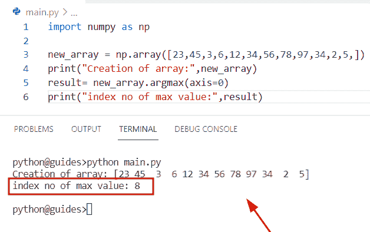

Python NumPy index of max value

阅读: [Python NumPy Split + 11 示例](https://pythonguides.com/python-numpy-split/)

## 元素的 Python NumPy 索引

*   让我们看看如何在 NumPy 数组 Python 中找到元素的索引。
*   在这个程序中，我们将使用 `index()` 方法的概念，它将返回所选元素的位置。
*   我们也使用了它们 `to.list()` 的方法将数组转换成列表。一旦你打印“结果”，输出将显示**“89”的索引号。**

**举例:**

```py
import numpy as np

new_arr = np.array([14,21,36,89,167,234,987,345,189])
result= new_arr.tolist().index(89)
print("Index number of selected element:",result)
```

你可以参考下面的截图

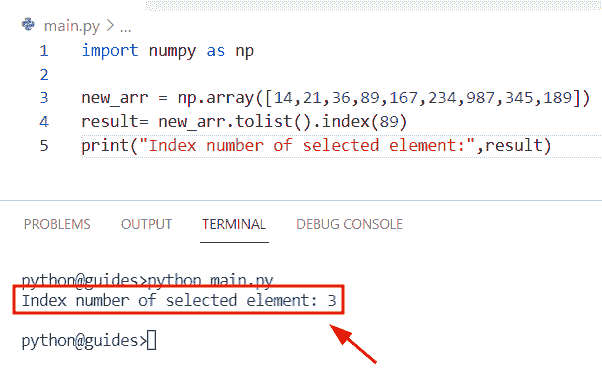

Python NumPy index of an element

阅读: [Python NumPy Random](https://pythonguides.com/python-numpy-random/)

## Python NumPy 索引的最小值

*   在本节中，我们将讨论如何获取 NumPy 数组 Python 中最小值的索引号。
*   为了完成这个任务，我们将使用 `np.argmin()` 函数，它将返回最小值的索引号。在 Python 中， `np.argmin()` 函数在 NumPy 包中可用，该方法与 `numpy.minimum()` 函数非常相似，但不是返回最小值。它将总是返回最小值的索引号。

**语法:**

下面是 numpy.argmin()函数的语法

```py
numpy.argmin
            (
             a,
             axis=None,
             out=None
            )
```

**源代码:**

```py
import numpy as np

new_values = np.array([17,56,14,19,23,78,34,15,8,7,14,19])
print("Creation of array:",new_values)
new_output= new_values.argmin(axis=0)
print("index number of minimum value:",new_output)
```

在上面的代码中，我们导入了 numpy 库，然后使用 `np.array()` 函数初始化了一个数组。现在声明一个变量**‘new _ output’**，并给 `np.argmin()` 函数赋值，同时 `axis=0` 。

下面是以下给定代码的执行过程

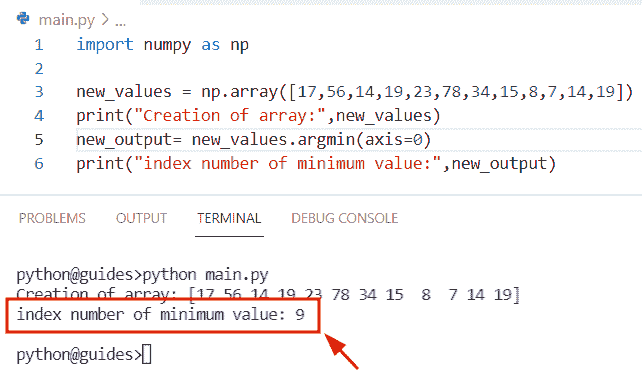

Python NumPy index of minimum

正如您在屏幕截图中看到的，输出显示了索引号“9”

阅读: [Python NumPy max 带示例](https://pythonguides.com/python-numpy-max-with-examples/)

## Python NumPy 索引条件

*   在本期节目中，我们将讨论如何利用 numpy 数组 Python 中的条件来获取元素的索引号。
*   为了完成这个任务，我们将使用 `np.where()` 函数。在 Python 中， `np.where()` 函数用于从给定数组中选择元素，它总是返回元素的索引。

**语法:**

下面是 numpy.where()函数的语法

```py
numpy.where
           (
            condition
            [,
            x,
            y
            ]
           )
```

**举例:**

```py
import numpy as np

new_values = np.array([78, 13, 34, 28, 86, 58, 64, 18])

final_result = np.where(new_values < 58)
print("Index value based on condition:",final_result)
```

在上面的程序中，我们使用了 `numpy.where()` 函数，它将检查条件，如果数组元素小于**‘58’**，那么它将显示该元素的索引号。

下面是以下给定代码的实现

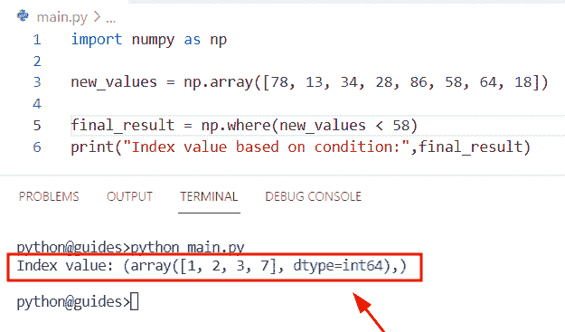

Python NumPy index condition

阅读: [Python NumPy 形状示例](https://pythonguides.com/python-numpy-shape/)

## Python NumPy 索引函数

*   让我们看看如何在 NumPy 数组 Python 中使用 `index()` 函数。
*   在这个例子中，我们将使用 index 函数来获取特定元素的索引值。我们也使用了它们 `to.list()` 的方法将数组转换成列表。

**举例:**

```py
import numpy as np

values = np.array([22,14,17,18,8,17,74,28,109])
new_output= values.tolist().index(17)
print("Index number:",new_output)
```

你可以参考下面的截图

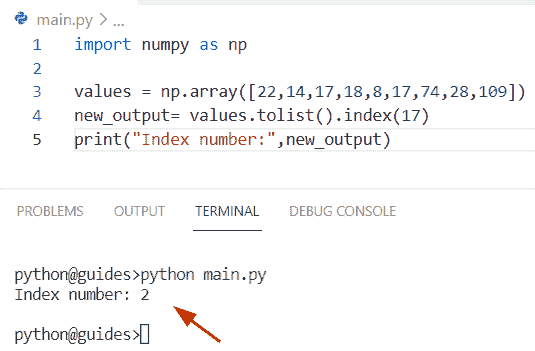

Python NumPy index function

正如您在屏幕截图中看到的，输出显示了索引号“2”。

阅读: [Python 反向 NumPy 数组](https://pythonguides.com/python-reverse-numpy-array/)

## Python NumPy 索引列表

*   在这一节中，我们将讨论如何使用 NumPy Python 来获取索引列表。
*   为了完成这项任务，我们将使用数组条件并向其传递一个整数值。一旦您将打印**‘结果’**，那么输出将显示索引列表编号。

**举例:**

```py
import numpy as np

new_arr = np.arange(12)
result= new_arr[4]
print("Index list number:",result)
```

下面是以下给定代码的执行过程

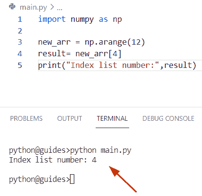

Python NumPy index list

阅读: [Python NumPy 空数组示例](https://pythonguides.com/python-numpy-empty-array/)

## Python NumPy 索引其中

*   在本节中，我们将讨论如何在 Python 中使用 numpy.where()函数来获取索引值。
*   首先在这个例子中，我们将使用 `np.array()` 函数创建一个数组。之后，我们将使用 `np.where()` 函数，并设置数组值小于 `32` 的条件，这些数据值将被替换为 true。否则，它将返回 false。

**源代码:**

```py
import numpy as np 

new_array = np.array([[55,65,85], [23,32,37]]) 
result=np.where(new_array<32,True,False) 
print(result)
```

下面是以下给定代码的执行过程

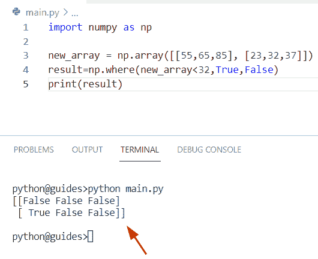

Python NumPy index where

阅读: [Python NumPy nan](https://pythonguides.com/python-numpy-nan/)

## 带索引的 Python NumPy 排序

*   在这个程序中，我们将讨论如何在 Python 中使用 index 对 numpy 数组进行排序。
*   为了完成这个任务，我们将使用 `np.lexsort(` )函数。在 Python 中，这个函数用于返回一个 numpy 数组，该数组带有按照给定轴对键进行排序的索引。
*   在这个方法中，keys 参数必须是一个可迭代的对象序列，可以转换为相同形状的 NumPy 数组。
*   让我们举个例子，了解一下 `np.lexsort()` 函数的工作原理

```py
import numpy as np

new_array = np.array([16, 75, 8,18,3,1,45])
new_val = np.array([3,4,5,0,1,2,7])
final_output = np.lexsort((new_array, new_val))        
print(final_output)
```

在上面的代码中，我们导入了 numpy 库，然后使用 `np.array()` 函数初始化了一个数组。之后，我们使用 `np.lexsort()` 函数并在其中分配数组。

你可以参考下面的截图

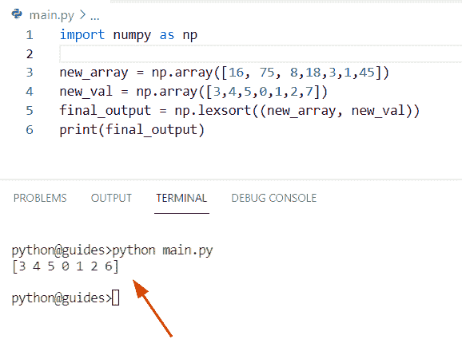

Python NumPy sort with index

阅读: [Python NumPy 过滤器+ 10 个例子](https://pythonguides.com/python-numpy-filter/)

## Python NumPy 排除索引

*   在本期节目中，我们将讨论在 NumPy 数组 Python 中排除索引。
*   通过使用 `np.delete()` 函数，我们可以轻松地解决这个任务，并返回只包含特定值的 numpy 数组。在 Python 中， `np.delete()` 函数用于删除给定数组中的元素。
*   在这个程序中，我们使用了列表中的索引号来表示要从数组中排除的元素。

**语法:**

下面是 numpy.delete()函数的语法

```py
numpy.delete
            (
             arr,
             obj,
             axis=None
            )
```

**举例:**

```py
import numpy as np

new_arr = np.array([15, 16, 23, 98, 156, 17, 19, 45, 90])
print("Creation of array:",new_arr)
exc_ind = [4, 0, 3]

result = np.delete(new_arr, exc_ind)
print("After excluding specific index:",result)
```

在上面的代码中，我们使用了 np **。delete()** 函数，在这个方法中，我们分配了数组和索引列表 **'exc_ind'** 。一旦你将打印**‘结果’**，那么输出将显示更新后的数组。

下面是以下给定代码的实现

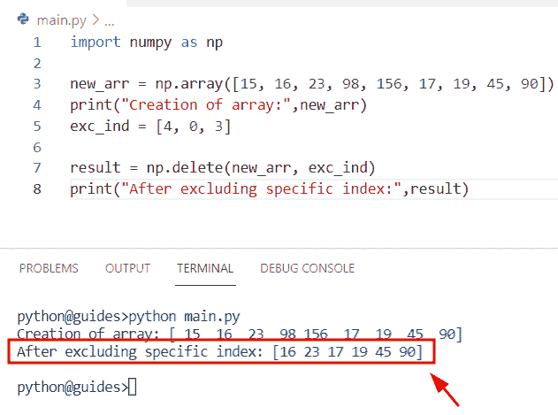

Python NumPy exclude index

阅读: [Python NumPy 最小教程](https://pythonguides.com/python-numpy-minimum/)

## Python NumPy 返回索引的最大值

*   让我们看看如何返回 NumPy 数组 Python 中最大值的索引。
*   为了执行这个特定的任务，我们将使用 `np.max()` 函数。在 Python 中，numpy.max()用于从 numpy 数组和指定的轴中获取最大值，该函数在 numpy 模块包中可用。
*   在这个程序中，我们必须找到最大值的索引号。为了完成这项任务，我们首先声明一个数组，并使用存储数组**‘新值’**的 `max()` 函数。之后声明一个变量**‘结果’**并使用列表理解方法。

**语法:**

下面是 numpy.argmax()函数的语法

```py
numpy.max
         (
          axis=None,
          out=None,
          keepdims=False,
          initial=<no value>,
          where=True
         )
```

**举例:**

让我们举一个例子，看看如何在 Python 中返回最大值的索引

**源代码:**

```py
import numpy as np

new_values= ([15,67,28,55,3,2,65,43,23,9,76,2])
print("maximum value in array:",(np.max(new_values)))
ret_ind = max(new_values)
result = [i for i in range(0,len(new_values)) if new_values[i] == ret_ind]
print("Index number of maximum value:",result)
```

下面是以下给定代码的输出

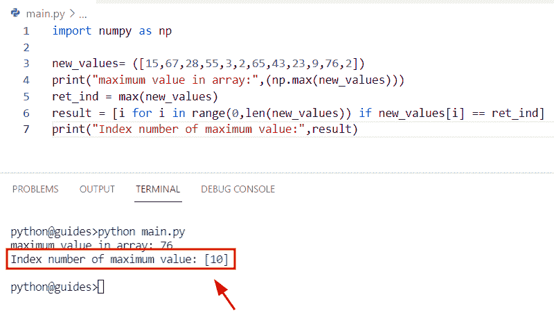

Python NumPy return an index of max value

正如您在屏幕截图中看到的，输出显示了索引号“10”。

阅读: [Python NumPy 删除](https://pythonguides.com/python-numpy-delete/)

## Python NumPy 移除索引

*   在本节中，我们将讨论如何在 NumPy 数组 Python 中移除索引。
*   为了执行这个特定的任务，我们将使用 `np.delete()` 函数从具有指定索引的数组中删除特定的元素。在 Python 中，np.delete()函数用于从给定数组中移除元素。

**语法:**

下面是 numpy.delete()函数的语法

```py
numpy.delete
            (
             arr,
             obj,
             axis=None
            )
```

**举例:**

```py
import numpy as np

new_values = np.array([56, 89, 167, 345, 987, 156, 345, 178, 256, 706])
new_ind = [4, 2, 1]
new_output = np.delete(new_values, new_ind)
print(new_output)
```

在上面的代码中，我们首先导入 numpy 库，然后使用 `np.array()` 函数初始化一个数组。之后，我们声明了一个变量**‘new _ ind’**，并指定了一个数字列表，该列表指定了我们想要从数组中移除的元素。一旦你将打印**‘new _ output’**，那么结果将显示更新后的新数组。

下面是以下给定代码的实现

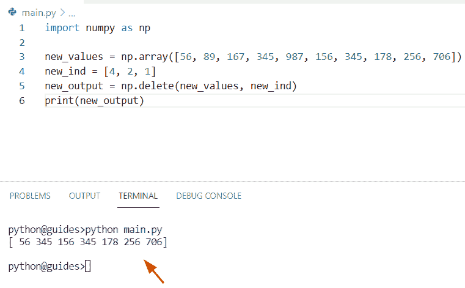

Python NumPy remove index

阅读: [Python NumPy 栈示例](https://pythonguides.com/python-numpy-stack/)

## Python NumPy 随机索引

*   在本节中，我们将讨论如何在 NumPy Python 中获取 random 的索引。
*   通过使用 `random.choice()` 函数，我们可以执行这个特定的任务。在 Python 中， `random()` 选项总是从指定的序列中返回一个随机值，该序列可以是数组、列表或元组。
*   该方法只接受一个参数，即您要从中选择元素的列表。
*   让我们看一下例子，了解一下 `random.choice()` 函数的工作原理。

```py
import numpy as np
import random 

new_arr = [16,12,76,14,15,11,25,34]
b=random.choice(list(enumerate(new_arr)))[0]
print("index number:",b)
```

下面是以下代码的截图

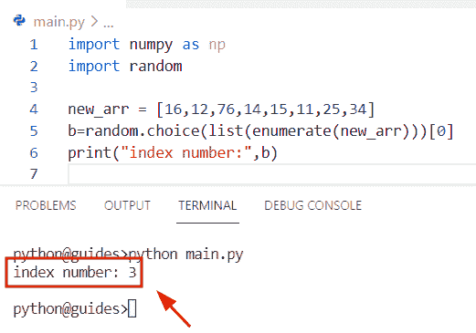

Python NumPy random index

阅读: [Python Numpy unique](https://pythonguides.com/python-numpy-unique/)

## Python NumPy 重置索引

*   在本期节目中，我们将讨论如何在 numpy 数组 Python 中重置索引。
*   为了执行这个特定的任务，我们将使用 `np.broadcast()` 方法。在 Python **中，np.broadcast()** 用于相互广播输入参数。

**语法:**

下面是 `numpy.broadcast()` 方法的语法

```py
class numpy.broadcast()
```

**源代码:**

```py
import numpy as np

new_arr1 = np.array([12, 25, 78])
new_arr2 = np.array([[89], [45], [17]])
result = np.broadcast(new_arr1, new_arr2)
print(result.index) 
```

你可以参考下面的截图

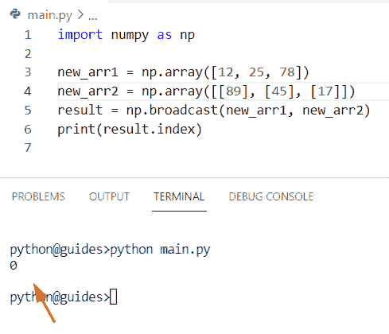

Python NumPy reset an index

阅读: [Python NumPy 数据类型](https://pythonguides.com/python-numpy-data-types/)

## Python NumPy 唯一索引

*   在这里，我们可以看到如何从 numpy 数组 Python 中获取唯一的索引号。
*   通过使用 `np.delete()` 函数，我们可以轻松地解决这个任务，并返回只包含特定值的 numpy 数组。
*   在这个例子中，我们将使用 `numpy.delete()` 的概念，这将帮助用户从数组中获取唯一的元素。

**语法:**

以下是 numpy.delete()方法的语法

```py
numpy.delete
            (
             arr,
             obj,
             axis=None
            )
```

**举例:**

```py
import numpy as np

values = np.array([15, 16, 16, 98, 156, 17, 156, 45, 90])
print("Initialize array:",values)
uni_ind = [1, 4]

result = np.delete(values, uni_ind)
print("After getting unique index:",result)
```

下面是以下给定代码的实现

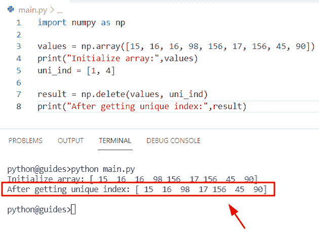

Python NumPy unique index

阅读: [Python NumPy 重复](https://pythonguides.com/python-numpy-repeat/)

## Python NumPy 获取索引的最小值

*   在本节中，我们将讨论如何返回 NumPy 数组 Python 中最小值的索引。
*   为了完成这个任务，我们将使用 `np.min()` 函数。在 Python 中，numpy.min()用于从 numpy 数组和指定的轴中获取最小值，该函数在 numpy 模块包中可用。
*   在这个程序中，我们必须找到索引号的最小值。为了完成这项任务，我们首先声明一个数组，并使用存储数组**‘新值**’的 `min()` 函数。之后声明一个变量**‘结果’**并使用列表理解方法。

**源代码:**

```py
import numpy as np

array_elements= ([6,14,76,189,145,876,198,923,2,3,76,1])
print("minimum value in array:",(np.min(array_elements)))
ret_ind = min(array_elements)
result = [i for i in range(0,len(array_elements)) if array_elements[i] == ret_ind]
print("Index number of minimum value:",result)
```

下面是以下给定代码的执行过程

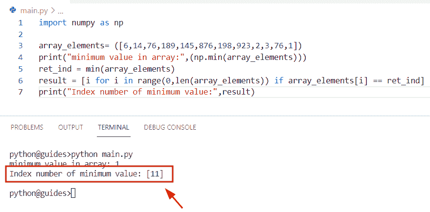

Python NumPy get an index of min value

阅读: [Python NumPy 平均值及示例](https://pythonguides.com/python-numpy-average/)

## Python NumPy 逻辑索引

*   在本节中，我们将讨论如何在 numpy 数组 Python 中使用 `np.logical()` 函数。
*   在 Python 中， `np.logical_or()` 函数用于生成 arr1 或 arr2 的真值。

**语法:**

下面是 numpy.logical_or()方法的语法

```py
numpy.logical_or
                (
                 arr1,
                 arr2,
                 /,
                 out=None,
                 *,
                 where=True,
                 casting='same_kind',
                 order='K',
                 dtype=None,
                 subok=true,
                ) 
```

**举例:**

```py
import numpy as np

new_arr = np.array([22,34,78,82,94])
result = np.logical_or(new_arr < 22, new_arr > 78)
print(result)
```

下面是以下代码的截图

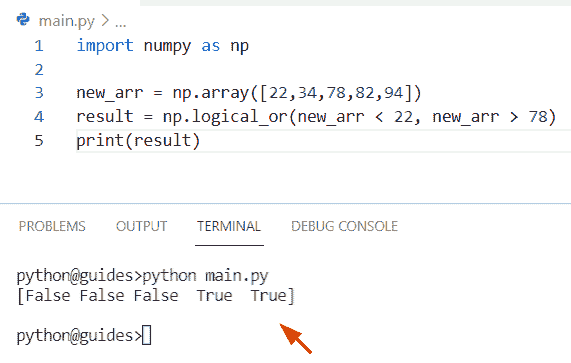

Python NumPy logical indexing

正如您在屏幕截图中看到的，输出显示了布尔值索引。

阅读: [Python NumPy square 举例](https://pythonguides.com/python-numpy-square/)

## Python NumPy 布尔索引

*   在这一节中，我们将讨论如何从布尔值中获取索引号。
*   通过使用数组条件，我们可以执行这个特定的任务并获得索引号。为了完成这项任务，我们将首先使用 `np.array()` 函数创建一个数组，并为其分配整数值。

**举例:**

```py
import numpy as np

new_arr1 = np.array([15, 78, 91])
new_arr2 = np.array([True, False, True])
print("Boolean value index:",new_arr1[new_arr2])
```

下面是以下给定代码的执行过程

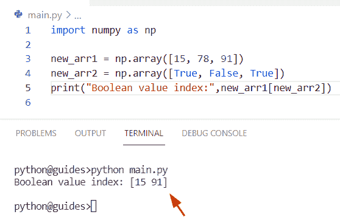

Python NumPy boolean indexing

正如您在屏幕截图中看到的，输出显示了这些值。

阅读: [Python NumPy 列举示例](https://pythonguides.com/python-numpy-to-list/)

## Python NP . ravel _ multi _ index

*   在本节中，我们将讨论如何在 numpy 数组 Python 中使用 np.ravel_multi_index()函数。
*   在 Python 中，此函数用于转换平面索引数组中的索引数组元组。

让我们来看看 `np.ravel_multi_index()` 方法的语法

```py
numpy.ravel_multi_index
                       (
                        multi_index,
                        dims,
                        mode='raise',
                        order='C'
                       )
```

**源代码:**

```py
import numpy as np

arr = np.array([[3,6,6],[4,5,1]])
d=np.ravel_multi_index(arr, (7,6))
print(d)
```

下面是以下代码的截图

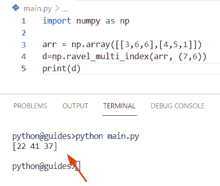

Python np ravel multi-index

在这个 Python 教程中，我们已经学习了如何获取 NumPy 数组中的索引号。此外，我们已经讨论了这些主题。

*   Python NumPy 索引数组
*   Python numpy 值索引
*   最大值的 Python NumPy 索引
*   元素的 Python NumPy 索引
*   Python NumPy 最小索引
*   Python NumPy 索引条件
*   Python NumPy 索引函数
*   Python NumPy 索引列表
*   Python NumPy 索引搜索
*   Python NumPy 索引，其中
*   Python NumPy 获取值为真的索引
*   Python NumPy 索引排序
*   Python NumPy 排除索引
*   Python NumPy 返回最大值的索引
*   Python NumPy 移除索引
*   Python NumPy 随机索引
*   Python NumPy 重置索引
*   Python NumPy 唯一索引
*   Python NumPy 获取最小值的索引
*   Python NumPy 逻辑索引
*   Python NumPy 布尔索引
*   Python np.ravel_multi_index

[Bijay Kumar](https://pythonguides.com/author/fewlines4biju/)

Python 是美国最流行的语言之一。我从事 Python 工作已经有很长时间了，我在与 Tkinter、Pandas、NumPy、Turtle、Django、Matplotlib、Tensorflow、Scipy、Scikit-Learn 等各种库合作方面拥有专业知识。我有与美国、加拿大、英国、澳大利亚、新西兰等国家的各种客户合作的经验。查看我的个人资料。

[enjoysharepoint.com/](https://enjoysharepoint.com/)[](https://www.facebook.com/fewlines4biju "Facebook")[](https://www.linkedin.com/in/fewlines4biju/ "Linkedin")[](https://twitter.com/fewlines4biju "Twitter")