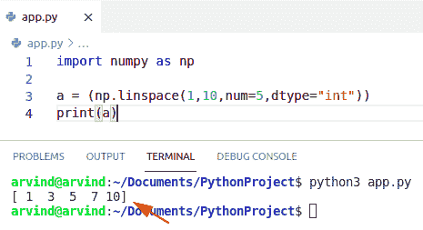

# Python NumPy linspace +示例

> 原文：<https://pythonguides.com/python-numpy-linspace/>

[](https://sharepointsky.teachable.com/p/python-and-machine-learning-training-course)

在本 [Python NumPy 教程](https://pythonguides.com/numpy/)中，我们将讨论 `Python NumPy linspace` 并涵盖以下示例:

*   Python NumPy linspace
*   Python NumPy linspace integer
*   Python NumPy linspace 2d
*   Python NumPy linspace 示例
*   Python NumPy linspace 对数
*   Python NumPy linspace datetime
*   Python NumPy linspace int
*   Python NumPy linspace 向量
*   python numpy a range vs linspace
*   Python NumPy linspace float

目录

[](#)

*   [Python NumPy linspace](#Python_NumPy_linspace "Python NumPy linspace")
*   [Python NumPy linspace 整数](#Python_NumPy_linspace_integer "Python NumPy linspace integer")
*   [Python NumPy linspace 2d](#Python_NumPy_linspace_2d "Python NumPy linspace 2d")
*   [Python NumPy linspace 示例](#Python_NumPy_linspace_example "Python NumPy linspace example")
*   [Python NumPy linspace 对数](#Python_NumPy_linspace_logarithmic "Python NumPy linspace logarithmic")
*   [Python NumPy linspace datetime](#Python_NumPy_linspace_datetime "Python NumPy linspace datetime")
*   [Python NumPy linspace int](#Python_NumPy_linspace_int "Python NumPy linspace int")
*   [Python NumPy linspace 矢量](#Python_NumPy_linspace_vector "Python NumPy linspace vector")
*   [Python NumPy arange vs linspace](#Python_NumPy_arange_vs_linspace "Python NumPy arange vs linspace")
*   [Python NumPy linspace float](#Python_NumPy_linspace_float "Python NumPy linspace float")

## Python NumPy linspace

Python NumPy linspace 函数总是根据给定的间隔返回均匀分布的数字。默认情况下，间隔包括第一个值和最后一个值，但是可以选择从结果中排除结束值。

*   为了使用 linspace 方法，我们将使用 NumPy 库声明一个新脚本。
*   接下来，我们将通过使用 `numpy.linspace()` 来使用 linspace 函数。
*   在函数中，我们将添加两个参数。
*   第一个参数是序列的起始值，第二个参数是序列的结束值。

**语法:**

下面是 numpy linspace 的语法

```py
np.linspace(
            start,
            stop,
            endpoint=True,
            dtype=None,
            axis=0
            )
```

1.  **开始:**默认开始值为 0。所以这是可选值，如果你没有提到起始值，它将取默认值 0。
2.  `Stop` :它也是一个不包含该值的区间结束数，与内置的 range 函数非常相似，不包含 Stop，它是唯一的，但在某些情况下，如这种特殊情况，它将包含当步长不是整数和浮点轮次时的输出长度。
3.  **Dtype:** 代表数据类型，如果没有从其他输入参数中给定数据类型的 d-type，则输出数组的类型
4.  **返回**:返回 ndarray。

**举例:**

```py
import numpy as np

a = (np.linspace(1,5))
print(a)
```

下面是以下代码的截图


Python numpy linspace

阅读: [Python NumPy concatenate](https://pythonguides.com/python-numpy-concatenate/)

## Python NumPy linspace 整数

*   让我们看看更多关于，`Python NumPy linspace integer`。
*   在 Python NumPy linspace 中，函数头中 dtype 参数的默认值是 None。
*   如果要手动指定数据类型，可以使用 dtype 参数。
*   在这种情况下，当我们设置 `datatype = integer` 时，linspace 函数产生一个 numpy 维的对象数组。

语法:

下面是 NumPy linspace integer 的语法。

```py
np.linspace(
            start,
            stop,
            dtype=int,
            axis=0
            )
```

**举例:**

```py
import numpy as np

a = (np.linspace(1,10,num=5,dtype="int"))
print(a)
```

以下是给定代码的屏幕截图:



Python numpy linspace integer

阅读: [Python 排序 NumPy 数组](https://pythonguides.com/python-sort-numpy-array/)

## Python NumPy linspace 2d

*   在这一节中，我们将了解到 `Python NumPy linspace 2d` 。
*   二维数字意味着在一个列表的列表中同质数据的集合。它也被称为矩阵。在 2D 数组中，你必须使用两个方括号，这就是为什么它表示列表的列表。
*   为了创建一个二维数组，关键的变化是提供多个起点和终点。每个首尾配对在数组中声明一个新的维度。

**语法:**

```py
np.linspace(
            start,
            stop,
            dtype=None,
            axis=0
            )
```

**举例:**

以下代码为每个 starts 和 stops 参数分配一个数字列表。因为 start 和 stop 是由两个元素组成的列表，所以会创建一个 2d 数组。

```py
import numpy as np

a = (np.linspace([2,3],[4,6],num=3))
print(a)
```

下面是以下代码的截图


Python numpy linspace 2d

阅读: [Python NumPy 矩阵+示例](https://pythonguides.com/python-numpy-matrix/)

## Python NumPy linspace 示例

*   在这一节中，我们将了解到 **Python NumPy linspace 示例**。
*   这个 linspace 函数还在定义的区间内创建一个等间距值序列。
*   它还给出指定范围内的值，这些值像一个函数一样均匀分布。
*   numpy.linspace 函数将返回一个在该区间内等间距元素的可迭代序列。
*   在这个例子中，首先，我们创建一个函数并传递参数，其中我们指定了数据类型、开始和停止参数。
*   它将接受一个参数，即要生成的样本数，默认值是 50

**语法:**

```py
np.linspace(
            start,
            stop,
            dtype,
            axis=0
            )
```

**举例:**

```py
import numpy as np

a = (np.linspace(4,8,num=3)) #start and stop
print(a)

b = (np.linspace(1,5,num=3,dtype="int")) #data type
print(b)

c = (np.linspace(3,9,num=4,endpoint=False))
print(c)

d = (np.linspace(4,8,num=3,retstep=True))
print(d)
```

以下是给定代码的截图


Python numpy linspace examples

阅读: [Python NumPy 追加](https://pythonguides.com/python-numpy-append/)

## Python NumPy linspace 对数

*   在本节中，我们将了解 **Python NumPy linspace 对数**。
*   对数函数 np.log()用于计算用户求 x 的自然对数，其中 x 属于所有输入数组元素。
*   它是指数方法的逆方法，也是元素式实对数。
*   在 linspace 对数中，我们可以很容易地使用函数 np.logspace()。
*   Logspace 返回对数刻度值上的偶数。Logspace 与 numpy.linspace 具有相同的参数。
*   在 logspace 中，可迭代序列从基数的 start 次方开始，以基数 stop 结束。

**语法:**

下面是 logspace()的语法

```py
np.logspace(
            start,
            stop,
            dtype,
            axis=0,
            base
            )
```

**举例:**

```py
import numpy as np

a = (np.logspace(4,8,num=3,base=2)) #start and stop
print(a)
```

以下是给定代码的截图


Python numpy linspace logarithmic

读取[未找到 Python 编号](https://pythonguides.com/python-numpy-not-found/)

## Python NumPy linspace datetime

*   在本节中，我们将了解`Python NumPy linspace datetime`。
*   Python Numpy 的核心数组数据类型本身支持 datetime 功能。dtype 称为“timestamp ”,这样命名是因为“datetime”在 Python 的 datetime 库中已经可用。

**举例:**

```py
import pandas as pd
import numpy as np
start = pd.Timestamp('2012-02-02')
end = pd.Timestamp('2012-04-04')
new_t = np.linspace(start.value, end.value, 10)
new_t = pd.to_datetime(new_t)
print(new_t)
```

以下是给定代码的截图


Python numpy linspace datetime

阅读: [Python NumPy arange](https://pythonguides.com/python-numpy-arange/) +示例

## Python NumPy linspace int

*   在本节中，我们将了解 `Python NumPy linspace int` 。
*   在 linspace integer 中，我们可以很容易地使用函数 np.linspace。
*   我们必须在参数中指定数据类型。

语法:

下面是 numpy linspace integer 的语法

```py
np.linspace(
            start,
            stop,
            dtype=int,
            axis=0
            )
```

**举例:**

```py
import numpy as np

a = (np.linspace(1,6,num=3,dtype="int"))
print(a)
```

下面是以下代码的截图


Python numpy linspace int

阅读 [Python NumPy 删除](https://pythonguides.com/python-numpy-delete/)

## Python NumPy linspace 矢量

*   在本节中，我们将了解到`Python NumPy linspace vector`。
*   向量是指整个数组中的操作过程，简洁而高效。
*   Numpy 也更喜欢向量化操作为“numpy 数组”。
*   在区间中创建一个等距点向量。

语法:

下面是 `NumPy linspace integer` 的语法。

```py
np.linspace(
            start,
            stop,
            dtype,
            axis=0
            )
```

**举例:**

```py
import numpy as np

y = (np.linspace(-5,5,7))
print(y)
```

以下是给定代码的截图


Python numpy linspace vector

阅读: [Python NumPy Sum](https://pythonguides.com/python-numpy-sum/) +示例

## Python NumPy arange vs linspace

*   在本节中，我们将了解`Python NumPy arange vs linspace`。
*   Numpy arange 函数基于声明时指定的开始和停止间隔生成一个具有均匀间隔值的 Numpy 数组。
*   numpy.linspace()和 numpy.arange()函数是相同的，因为 linspace 函数也创建一个在定义的间隔内等间距值的可迭代序列。
*   它还给出给定范围内的值，这些值像平均法一样均匀分布。
*   国民党。linspace()函数将返回一个在该区间上等距值的可迭代序列。
*   可以排除给定区间的最后一点。

**语法:**

```py
np.linspace(
            start,
            stop,
            endpoint=True,
            dtype=None,
            axis=0
            )
```

**举例:**

```py
import numpy as np

a = np.arange(2,10,2)
b = np.linspace(0,10,5)
print(a)
print(b)
```

下面是下面给出的代码的截图。


Python numpy arrange vs linspace

阅读 [Python Numpy 阶乘](https://pythonguides.com/python-numpy-factorial/)

## Python NumPy linspace float

*   在这一节中，我们将学习关于 Python NumPy linspace float 的知识。
*   在 linspace 中，dtype 参数的默认值是 None。
*   在这种情况下，当我们设置 dtype = float 时，linspace 函数产生一个 nd。数组对象。

语法:

下面是 numpy linspace integer 的语法

```py
np.linspace(
            start,
            stop,
            dtype=float,
            axis=0
            )
```

**举例:**

```py
import numpy as np

b = (np.linspace(1,5,num=5,dtype="float"))
print(b)
```

以下是给定代码的截图


Python numpy linspace float

您可能会喜欢以下 Python 教程:

*   [使用蟒蛇龟绘制彩色填充形状](https://pythonguides.com/draw-colored-filled-shapes-using-python-turtle/)
*   [python](https://pythonguides.com/python-list-comprehension-using-if-else/)[o](https://pythonguides.com/python-list-comprehension-using-if-else/)[n 列表理解使用 if-else](https://pythonguides.com/python-list-comprehension-using-if-else/)
*   [Python Tkinter Stopwatch](https://pythonguides.com/python-tkinter-stopwatch/)
*   [Python](https://pythonguides.com/python-read-a-binary-file/) [](https://pythonguides.com/python-read-a-binary-file/)[读取二进制文件(示例)](https://pythonguides.com/python-read-a-binary-file/)
*   [如何使用 Turtle 在 python 中绘制形状](https://pythonguides.com/turtle-programming-in-python/)

在本 Python 教程中，我们将讨论 `Python NumPy linspace` 并涵盖以下示例:

*   Python numpy linspace
*   Python numpy linspace integer
*   Python numpy linspace 2d
*   Python numpy linspace 示例
*   Python numpy linspace 对数
*   Python numpy linspace datetime
*   Python numpy linspace int
*   Python numpy linspace 向量
*   python numpy a range vs linspace

[Bijay Kumar](https://pythonguides.com/author/fewlines4biju/)

Python 是美国最流行的语言之一。我从事 Python 工作已经有很长时间了，我在与 Tkinter、Pandas、NumPy、Turtle、Django、Matplotlib、Tensorflow、Scipy、Scikit-Learn 等各种库合作方面拥有专业知识。我有与美国、加拿大、英国、澳大利亚、新西兰等国家的各种客户合作的经验。查看我的个人资料。

[enjoysharepoint.com/](https://enjoysharepoint.com/)[](https://www.facebook.com/fewlines4biju "Facebook")[](https://www.linkedin.com/in/fewlines4biju/ "Linkedin")[](https://twitter.com/fewlines4biju "Twitter")