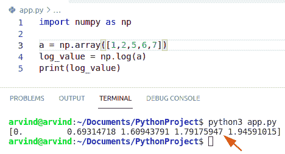
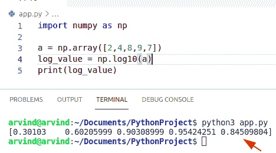
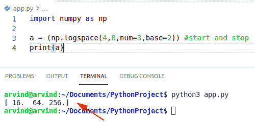
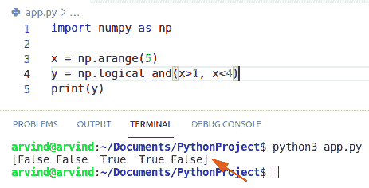
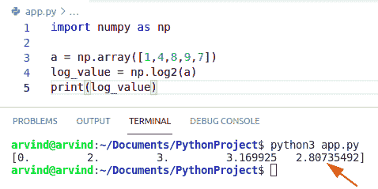
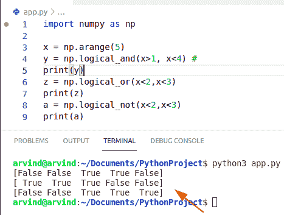
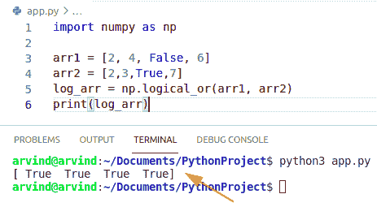
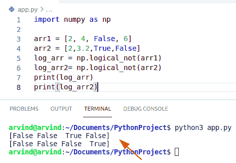
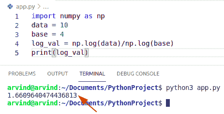
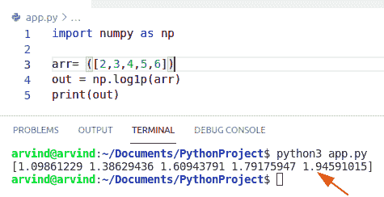

# Python NumPy 日志+示例

> 原文：<https://pythonguides.com/python-numpy-log/>

[](https://sharepointsky.teachable.com/p/python-and-machine-learning-training-course)

在本 [Python NumPy 教程](https://pythonguides.com/numpy/)中，我们将讨论 **Python NumPy 日志**并涵盖以下示例:

*   Python NumPy log10
*   Python NumPy 日志空间
*   Python NumPy 逻辑与
*   Python NumPy log base 2
*   Python NumPy 逻辑运算符
*   Python NumPy 逻辑或
*   Python NumPy 逻辑非
*   Python NumPy 日志库
*   Python NumPy 日志 1p

目录

[](#)

*   [Python NumPy 日志](#Python_NumPy_log "Python NumPy log")
*   [Python NumPy log10](#Python_NumPy_log10 "Python NumPy log10")
*   [Python NumPy 日志空间](#Python_NumPy_logspace "Python NumPy logspace")
*   [Python NumPy 逻辑与](#Python_NumPy_logical_and "Python NumPy logical and")
*   [Python NumPy log base 2](#Python_NumPy_log_base_2 "Python NumPy log base 2")
*   [Python NumPy 逻辑运算符](#Python_NumPy_logical_operators "Python NumPy logical operators")
*   [Python NumPy 逻辑 or](#Python_NumPy_logical_or "Python NumPy logical or")
*   [Python NumPy 逻辑非](#Python_NumPy_logical_not "Python NumPy logical not")
*   [Python NumPy 日志库](#Python_NumPy_log_base "Python NumPy log base")
*   [Python NumPy 日志 1p](#Python_NumPy_log_1p "Python NumPy log 1p")

## Python NumPy 日志

*   在本节中，我们将了解到 **Python NumPy 日志**。
*   对数函数用于计算用户找到的 x 的真实对数，其中 x 属于所有的输入数组值。
*   它是指数法的逆方法，也是元素式自然对数。
*   在对数中，我们可以很容易地使用函数 np.logspace()。
*   在 logspace 中，可迭代序列从基数的 start 次方开始，一直持续到基数的 stop。
*   自然对数是指数法的逆运算，所以 X 的指数的对数值将给出 X，所以以 E 为底的对数称为自然对数。
*   在 log 函数中，我们将提供一个数值数组，NumPy log 函数将为这些元素生成对数。
*   array_like 输入值。

**语法:**

下面是 **python numpy 日志**的语法

```py
numpy.log 
         (
          x,
          out=None,
          where=True,
          casting='same_kind',
          order='K',
          dtype=None
         )
```

*   它由几个参数组成。
    *   **X:** array_like(输入值)
    *   **OUT:** ndarray(存储结果的位置。如果提供的话，它应该具有输入所提供的形状。如果未提供或没有，则返回新分配的数组)。
    *   **其中:** array_like，可选(该条件通过输入广播。在条件为真的位置，输出数组将被设置为函数结果。在其他地方，输出数组的初始值总是精确的)。
    *   **返回:**x 的自然对数，逐元素

**举例:**

```py
import numpy as np

a = np.array([1,2,5,6,7])
log_value = np.log(a)
print(log_value)
```

下面是以下代码的截图



Python numpy log

阅读:[Python NumPy where with examples](https://pythonguides.com/python-numpy-where/)

## Python NumPy log10

*   在本节中，我们将了解到 `Python NumPy log10` 。
*   这是一个统计函数，帮助用户计算 x 的以 10 为底的对数，其中 x 是一个数组输入值。
*   它用于获取任何以 10 为底的对象或项目的自然对数。
*   对于实值输入数据类型，log 10 总是返回实值输出。对于每个不能用实数表示的值。

**语法:**

下面是 `Python numpy log10` 的语法

```py
numpy.log10
         (
          x,
          out=None,
          where=True,
          casting='same_kind',
          order='K',
          dtype=None
         )
```

**举例:**

```py
import numpy as np

a = np.array([2,4,8,9,7])
log_value = np.log10(a)
print(log_value)
```

下面是以下代码的截图



Python numpy log10

阅读: [Python NumPy linspace](https://pythonguides.com/python-numpy-linspace/)

## Python NumPy 日志空间

*   在这一节中，我们将了解到 **Python NumPy 日志空间**。
*   它返回对数标度上均匀间隔的数字空间。
*   该序列从底部的 start 次方开始，以底部的 stop 结束。
*   Log space 总是返回对数标度上的偶数。日志空间有相同的参数

**语法:**

下面是 NumPy 日志空间的语法

```py
numpy.logspace
              (
               start,
               stop,
               num,
               endpoint=True,
               base,
               dtype=None
              )
```

**举例:**

```py
import numpy as np

a = (np.logspace(4,8,num=3,base=2)) #start and stop
print(a)
```

下面是以下代码的截图



Python numpy logspace

读取 [Python NumPy 空数组](https://pythonguides.com/python-numpy-empty-array/)

## Python NumPy 逻辑与

*   在本节中，我们将学习 **Python NumPy logical_and()和**。
*   在这种方法中，我们可以很容易地使用逻辑运算符来使用 np.logical_and()方法的多个条件
*   逻辑“与”用于定义条件。第一个 logical_and()函数已应用于一维数组，该数组将返回输入数组的索引数组，其中条件将返回 true。
*   它有助于用户找出 arr1 和 arr2 元件的真实值。两个 numpy 数组应该具有相同的形状。

**语法:**

下面是 NumPy 逻辑 _and 的语法

```py
numpy.logical_and
                 (
                  x1,
                  x2,
                  out=None,
                  Where=True,
                  casting='same-kind'
                  dtype=None
                 )
```

*   它由几个参数组成
    *   **X1:** array_like(输入 _ 数组)
    *   **OUT:** ndarray(存储结果的位置。如果提供的话，它应该具有输入所提供的形状。如果未提供或没有，则返回新分配的数组)。
    *   **返回:**应用于元素 x1 和 x2 的逻辑与运算的布尔结果；形状确定了。

**举例:**

```py
import numpy as np

x = np.arange(5)
y = np.logical_and(x>1, x<4)
print(y)
```

下面是以下代码的截图



Python numpy logical and

阅读: [Python NumPy concatenate + 9 个例子](https://pythonguides.com/python-numpy-concatenate/)

## Python NumPy log base 2

*   在这一节中，我们将学习 Python NumPy log base 2。
*   它帮助用户计算 x 的以 2 为底的对数，其中 x 是一个数组输入值。
*   它用于获取任何以 2 为底的对象的自然对数。
*   它返回 x 的以 2 为底的对数。如果 x 是标量，则它是标量。

**语法:**

```py
numpy.log2
         (
          x,
          out=None,
          where=True,
          casting='same_kind',
          order='K',
          dtype=None
         )
```

**举例:**

```py
import numpy as np

a = np.array([1,4,8,9,7])
log_value = np.log2(a)
print(log_value)
```

下面是以下代码的截图



Python numpy log base 2

阅读 [Python NumPy 重复](https://pythonguides.com/python-numpy-repeat/)

## Python NumPy 逻辑运算符

*   在本节中，我们将学习 **Python NumPy 逻辑运算符**。
*   Python NumPy 逻辑运算符使用真值表计算真值，即表示布尔值
*   Numpy 逻辑运算符是 logical_and logical_not。
*   在本例中，我们首先声明一个 NumPy 数组，并根据给定条件使用 python NumPy 逻辑运算符计算每个元素的真值。

**语法:**

```py
numpy.log 
         (
          x,
          out=None,
          where=True,
          casting='same_kind',
          order='K',
          dtype=None
         )
```

**举例:**

```py
import numpy as np

x = np.arange(5)
y = np.logical_and(x>1, x<4) #
print(y)
z = np.logical_or(x<2,x<3)
print(z)
a = np.logical_not(x<2,x<3)
print(a)
```

下面是以下代码的截图



Python numpy logical operators

阅读: [Python 排序 NumPy 数组](https://pythonguides.com/python-sort-numpy-array/)

## Python NumPy 逻辑 or

*   在本节中，我们将学习 **Python NumPy 逻辑或**。
*   这是一个逻辑函数，有助于用户找出 arr1 或 arr2 元件的真实值。
*   但是最重要的一点是数组必须是相同的形状。
*   它对 arr1 和 arr2 的元素进行逻辑或运算，返回与 arr1 和 arr2 形状相同的布尔结果。

**语法:**

以下是逻辑或的语法

```py
numpy.logical_or
                (
                  x1,
                  x2,
                  out=None,
                  Where=True,
                  casting='same-kind'
                  dtype=None
                 )
```

**举例:**

```py
import numpy as np

arr1 = [2, 4, False, 6]
arr2 = [2,3,True,7]
log_arr = np.logical_or(arr1, arr2)
print(log_arr)
```

下面是以下代码的截图



Python numpy logical or

读取 [Python NumPy 绝对值](https://pythonguides.com/python-numpy-absolute-value/)

## Python NumPy 逻辑非

*   在这一节中，我们将学习 **Python NumPy 逻辑 not。**
*   这是一个逻辑函数，它帮助用户计算非 arr 元素的真值。
*   它返回非数组元素的布尔结果。

**语法:**

这里是逻辑 not 的语法

```py
numpy.logical_and
                 (
                  arr1,
                  arr2,
                  out=None,
                  Where=True,
                  casting='same-kind'
                  dtype=None
                 )
```

**举例:**

```py
import numpy as np

arr1 = [2, 4, False, 6]
arr2 = [2,3.2,True,False]
log_arr = np.logical_not(arr1)
log_arr2= np.logical_not(arr2)
print(log_arr)
print(log_arr2)
```

下面是以下代码的截图



Python numpy logical not

阅读: [Python NumPy 矩阵+示例](https://pythonguides.com/python-numpy-matrix/)

## Python NumPy 日志库

*   在本节中，我们将了解到 **Python NumPy 日志库**。
*   Numpy log()函数提供了查找关于用户定义的基数的对数值的可能性。
*   自然对数是指数函数的倒数，所以 X 的指数的对数将给出 X，所以以 E 为底的对数称为自然对数。

**语法:**

```py
numpy.log 
         (
          x,
          out=None,
          where=True,
          casting='same_kind',
          order='K',
          dtype=None
         )
```

**举例:**

```py
import numpy as np
data = 10
base = 4
log_val = np.log(data)/np.log(base)
print(log_val)
```

在上面的例子中，我们已经计算了以 4 为底的 10 的对数值。

下面是下面给出的代码的截图。



Python numpy log base

## Python NumPy 日志 1p

*   在本节中，我们将了解到 `Python NumPy log 1p` 。
*   它是一个统计函数，用于获得自然对数值 x+1，其中 x 是 numpy 数组的值。
*   log1p 是 exp(x)-1 的倒数。
*   numpy.log1p()方法接受两个参数，即 arr 和 out 参数，并返回给定数组值的元素的值 x+1 的自然对数的 numpy 数组。

**语法:**

```py
numpy.log1p
          (
          arr,
          out=None,
          where=True
         )
```

*   它由两个参数组成:
    *   **ARR:** 是要计算日志的对象。
    *   **OUT:** 它是存储结果的位置。

**举例:**

```py
import numpy as np

arr= ([2,3,4,5,6])
out = np.log1p(arr)
print(out)
```

下面是以下代码的截图



Python numpy log 1p

您可能会喜欢以下 Python 教程:

*   [Python NumPy arange +示例](https://pythonguides.com/python-numpy-arange/)
*   [Python NumPy Sum +示例](https://pythonguides.com/python-numpy-sum/)
*   [Python Tkinter 颜色+示例](https://pythonguides.com/python-tkinter-colors/)
*   [python tkinter auto complete](https://pythonguides.com/python-tkinter-autocomplete/)
*   [11 Python 列表方法](https://pythonguides.com/python-list-methods/)
*   [Python NumPy square 示例](https://pythonguides.com/python-numpy-square/)

在本 Python NumPy 教程中，我们讨论了 **Python NumPy 日志**，还涵盖了以下示例:

*   Python NumPy log10
*   Python NumPy 日志空间
*   Python NumPy 逻辑与
*   Python NumPy log base 2
*   Python NumPy 逻辑运算符
*   Python NumPy 逻辑或
*   Python NumPy 逻辑非
*   Python NumPy 日志库
*   Python NumPy 日志 1p

[Bijay Kumar](https://pythonguides.com/author/fewlines4biju/)

Python 是美国最流行的语言之一。我从事 Python 工作已经有很长时间了，我在与 Tkinter、Pandas、NumPy、Turtle、Django、Matplotlib、Tensorflow、Scipy、Scikit-Learn 等各种库合作方面拥有专业知识。我有与美国、加拿大、英国、澳大利亚、新西兰等国家的各种客户合作的经验。查看我的个人资料。

[enjoysharepoint.com/](https://enjoysharepoint.com/)[](https://www.facebook.com/fewlines4biju "Facebook")[](https://www.linkedin.com/in/fewlines4biju/ "Linkedin")[](https://twitter.com/fewlines4biju "Twitter")