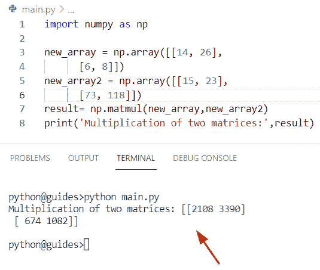
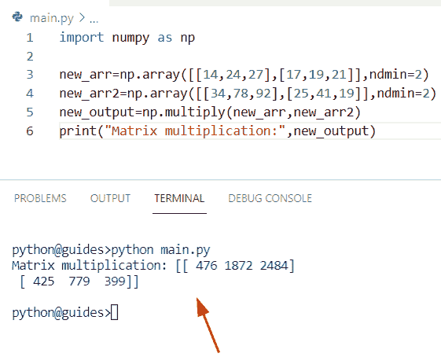
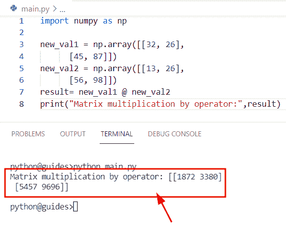
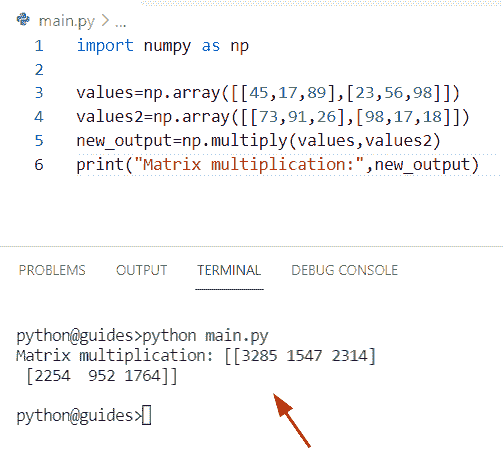
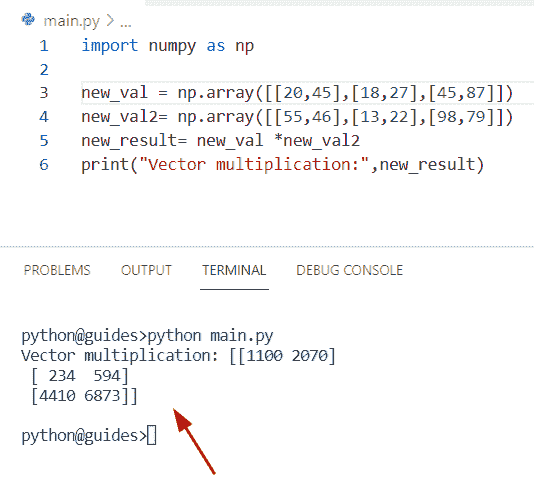
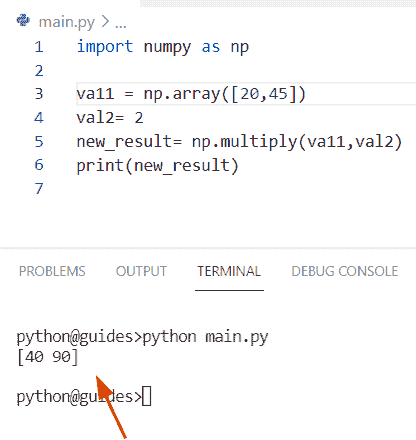
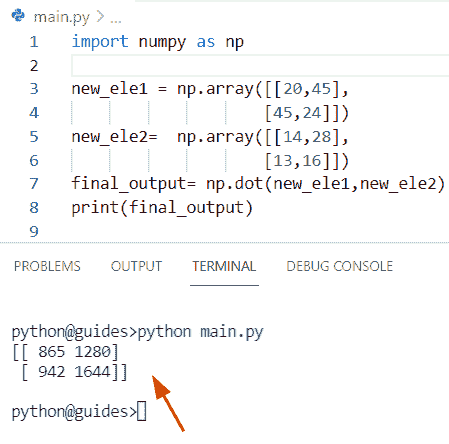
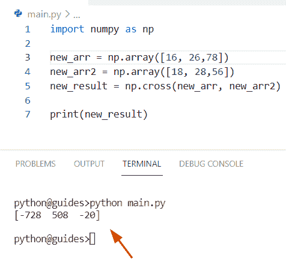
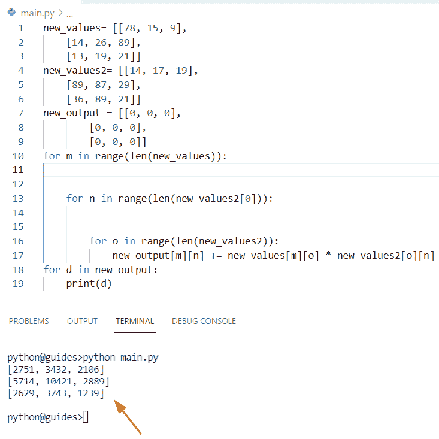

# Python NumPy 矩阵乘法

> 原文：<https://pythonguides.com/python-numpy-matrix-multiplication/>

[](https://sharepointsky.teachable.com/p/python-and-machine-learning-training-course)

在本 [Python 教程](https://pythonguides.com/python-hello-world-program/)中，我们将学习**如何在 NumPy 数组** Python 中做矩阵乘法。通过 **Python NumPy 添加函数**，我们将涵盖这些主题。

*   Python numpy 矩阵逐元素乘法
*   Python numpy 矩阵乘法运算符
*   Python numpy 矩阵乘法函数
*   Python numpy 矩阵乘向量
*   Python numpy 用缩放器乘矩阵
*   Python numpy 矩阵点积
*   Python numpy 矩阵叉积
*   无 numpy 的 Python 矩阵乘法

目录

[](#)

*   [Python NumPy 矩阵乘法](#Python_NumPy_matrix_multiplication "Python NumPy matrix multiplication ")
*   [Python NumPy 矩阵逐元素乘法](#Python_NumPy_matrix_multiplication_element-wise "Python NumPy matrix multiplication element-wise")
*   [Python numpy 矩阵乘法运算符](#Python_numpy_matrix_multiplication_operator "Python numpy matrix multiplication operator")
*   [Python numpy 矩阵乘法函数](#Python_numpy_matrix_multiplication_function "Python numpy matrix multiplication function")
*   [Python numpy 矩阵乘向量](#Python_numpy_matrix_multiply_vector "Python numpy matrix multiply vector")
*   [Python numpy 乘矩阵乘标量](#Python_numpy_multiply_matrix_by_scaler "Python numpy multiply matrix by scaler")
*   [Python numpy 矩阵点积](#Python_numpy_matrix_dot_product "Python numpy matrix dot product")
*   [Python numpy 矩阵叉积](#Python_numpy_matrix_cross_product "Python numpy matrix cross product")
*   [Python 无 numpy 矩阵乘法](#Python_matrix_multiplication_without_numpy "Python matrix multiplication without numpy")

## Python NumPy 矩阵乘法

*   在本期节目中，我们将讨论如何在 Python 中实现两个 NumPy 矩阵相乘。
*   为了解决这个问题，我们将使用 `numpy.matmul()` 函数并返回两个输入数组的矩阵乘积。在 Python 中, `numpy.matmul()` 函数用于找出两个数组的矩阵乘法。
*   在这个函数中，我们不能对输入数组使用标量值。当我们使用一个二维数组时，它将返回一个简单的乘积，如果矩阵大于 2-d，那么它被认为是一个矩阵堆栈。

**语法:**

让我们看一下语法并理解 `numpy.matmul()` 函数的工作原理

```py
numpy.matmul
            (
             x1,
             x2
              /,
             out=None,
             *,
             casting='same_kind',
             order='K',
             dtype=None,
             subok=True
            [,
             signature,
             extobj,
             axes,
             axis
            ]
           )
```

**注意:**该函数只取三个参数，其他为可选参数。我们将只把第一个和第二个输入数组作为参数。

**举例:**

让我们举一个例子，看看如何使用 `numpy.matmul()` 函数在 Python 中将两个 numpy 数组相乘

**源代码:**

```py
import numpy as np

new_array = np.array([[14, 26],
      [6, 8]])
new_array2 = np.array([[15, 23],
      [73, 118]])
result= np.matmul(new_array,new_array2)
print('Multiplication of two matrices:',result)
```

在上面的程序中，我们导入了 numpy 库，然后我们取了两个名为**‘new _ array’和‘new _ array 2**’的输入数组。现在我们要显示两个矩阵的乘积。为此，我们将使用 numpy.matmul()函数，结果将显示新的数组。

下面是以下代码的截图



Python NumPy matrix multiplication

另外，查看: [Python NumPy 添加教程](https://pythonguides.com/python-numpy-add/)

## Python NumPy 矩阵逐元素乘法

*   在这一节中，我们将讨论如何在 NumPy Python 中按元素乘矩阵。
*   在 Python 中，矩阵的乘法是一种操作，我们将两个 numpy 矩阵作为输入，如果您想要逐项乘法，那么您可以很容易地使用 `multiply()` 函数。
*   在 Python 中， `numpy.multiply()` 函数用于计算两个 numpy 数组之间的乘法，它是 numpy 包模块中的一个通用函数。
*   这个方法有几个参数，两个输入数组必须有相同的形状，它们有相同数量的列和行。

**语法:**

让我们看一下语法并理解 Python `numpy.multiply()` 函数的工作原理

```py
numpy.multiply
              (
               x1,
               x2,
               /,
               out=None,
               *,
               where=True,
               casting='same_kind',
               order='K',
               dtype=None,
               subok=True
              )
```

*   它由几个参数组成
    *   **x1，x2** :该参数表示要相乘的第一个输入数组。
    *   **out:** 默认情况下，它不接受任何值，也不接受存储结果的位置。
    *   **其中:**该参数将检查条件是否为真，out 数组将被设置为 ufunc 结果。
    *   **dtype:** 默认情况下不取值，为 optionbal 参数。

**举例:**

让我们举个例子，看看如何在 NumPy Python 中进行矩阵乘法

**源代码:**

```py
import numpy as np  

new_arr=np.array([[14,24,27],[17,19,21]],ndmin=2)  
new_arr2=np.array([[34,78,92],[25,41,19]],ndmin=2)  
new_output=np.multiply(new_arr,new_arr2)  
print("Matrix multiplication:",new_output)
```

在上面的代码中，我们导入了 numpy 库，然后使用 `np.array()` 函数初始化了一个数组。之后，我们应用了 `np.multiply()` 函数来计算**‘new _ arr’**和**‘new _ arr 2’**之间的乘积。一旦您将打印“new_output ”,那么结果将显示一个新的数组。

下面是以下给定代码的实现



Python NumPy matrix multiplication element-wise

阅读: [Python 数字差异示例](https://pythonguides.com/python-numpy-diff/)

## Python numpy 矩阵乘法运算符

*   在这一节中，我们将讨论如何在 Python 中使用 **@** 操作符进行两个 numpy 数组的乘法运算。
*   在 Python 中， **@** 运算符在 `Python3.5` 版本中使用，它与在 `numpy.matmul()` 函数中工作是一样的，但是在这个例子中，我们将把运算符改为 infix @ operator。此方法主要用于常规矩阵，返回两个输入数组的矩阵乘积。

**举例:**

让我们举一个例子，检查如何使用 infix@运算符将两个输入矩阵相乘

**源代码:**

```py
import numpy as np

new_val1 = np.array([[32, 26],
      [45, 87]])
new_val2 = np.array([[13, 26],
      [56, 98]])
result= new_val1 @ new_val2
print("Matrix multiplication by operator:",result)
```

下面是以下给定代码的执行过程



Python Numpy matrix multiplication operator

阅读: [Python NumPy Divide](https://pythonguides.com/python-numpy-divide/)

## Python numpy 矩阵乘法函数

*   在本节中，我们将学习如何通过使用 `numpy.multiply()` 函数来获得两个 numpy 数组的矩阵乘法。
*   为了执行这个特定的任务，我们将使用 `numpy.multiply()` 函数。在 Python 中，此函数用于计算两个 numpy 数组之间的乘法，并且它必须具有指定相同列数和行数的相同形状。
*   当两个阵列兼容时，乘法矩阵是可能的。例如，假设我们有两个 numpy 数组**‘array 1’**和**‘array 2’**，如果我们想得到 `array1` 和 `array2` 的结果矩阵。我们只是简单地用数学概念 m *n 矩阵***【array 1】***搭配一个 n* p 矩阵**【array 2】**。之后，当我们执行程序时，输出可以是顺序为**‘m * p**’的**‘array 3’**。
*   让我们通过一个使用 `numpy.multiply()` 函数的例子来详细理解这个概念。

**语法:**

下面是 `numpy.multiply()` 函数的语法

```py
numpy.multiply
              (
               x1,
               x2,
               /,
               out=None,
               *,
               where=True,
               casting='same_kind',
               order='K',
               dtype=None,
               subok=True
              )
```

**举例:**

让我们举个例子，了解一下 Python `numpy.multiply()` 函数的工作原理

```py
import numpy as np  

values=np.array([[45,17,89],[23,56,98]])  
values2=np.array([[73,91,26],[98,17,18]])  
new_output=np.multiply(values,values2)  
print("Matrix multiplication:",new_output)
```

你可以参考下面的截图



Python numpy matrix multiplication function

读: [Python NumPy argsort](https://pythonguides.com/python-numpy-argsort/)

## Python numpy 矩阵乘向量

*   在本期节目中，我们将讨论如何在 NumPy Python 中实现向量相乘。
*   为了执行这个特定的任务，我们将使用 `*` 运算符来计算两个向量的乘积。在 Python 中，这个操作数用于产生输入数组的乘积。
*   该运算符主要用于给定输入的乘法运算，在 Python 包模块中提供。

**举例:**

让我们举一个例子，看看如何使用 `*` 操作符在 Python 中乘以向量

**源代码:**

```py
import numpy as np  

new_val = np.array([[20,45],[18,27],[45,87]])  
new_val2= np.array([[55,46],[13,22],[98,79]])  
new_result= new_val *new_val2 
print("Vector multiplication:",new_result)
```

在上面的代码中，我们导入了 numpy 库，然后使用 np.array()函数初始化了一个数组。之后，我们声明了变量“new_result ”,在这个变量中，我们使用*运算符将两个数组相乘。

下面是以下给定代码的输出



Python numpy matrix multiply vector

阅读: [Python NumPy 索引](https://pythonguides.com/python-numpy-indexing/)

## Python numpy 乘矩阵乘标量

*   在这一节，我们将讨论如何在 Python 中用 scaler 乘矩阵。
*   为了完成这项任务，我们将使用 `np.array()` 函数，然后初始化一个标量值**‘2’**。现在我们想通过使用 `numpy.multiply()` 函数得到 scaler an 数组的乘积。

**举例:**

```py
import numpy as np  

va11 = np.array([20,45])  
val2= 2 
new_result= np.multiply(va11,val2) 
print(new_result) 
```

下面是以下给定代码的实现



Python numpy multiply matrix by scaler

阅读: [Python NumPy 过滤器](https://pythonguides.com/python-numpy-filter/)

## Python numpy 矩阵点积

*   在本期节目中，我们将学习如何在 Python 中使用 numpy 点积法进行矩阵相乘。
*   在 Python 中，该函数用于执行两个矩阵的点积。此方法采用两个相等的 numpy 矩阵，并返回一个矩阵。
*   在 Python 中，该方法将两个 numpy 矩阵作为参数，并返回两个给定矩阵的乘积。

**语法:**

让我们看一下语法并理解 `numpy.dot()` 函数的工作原理

```py
numpy.dot
         (
          a,
          b,
          out=None
         )
```

*   它由几个参数组成
    *   **a，b:** 这个参数表示我们要计算的第一个和第二个输入数组。
    *   **out:** 默认情况下，它没有值，并且必须是 C 连续的。如果 arr1 和 arr2 是标量或 1-d，此方法将返回一个标量，否则它将返回一个 numpy 数组。

**举例:**

让我们举一个例子，看看如何使用 `numpy.dot()` 函数来乘矩阵

**源代码:**

```py
import numpy as np  

new_ele1 = np.array([[20,45],
                    [45,24]])  
new_ele2=  np.array([[14,28],
                    [13,16]])
final_output= np.dot(new_ele1,new_ele2) 
print(final_output) 
```

下面是以下给定代码的执行过程



Python Numpy matrix dot product

也可以参考我们关于 [Python 点积](https://pythonguides.com/python-dot-product/)的详细文章。

## Python numpy 矩阵叉积

*   这里我们将讨论如何用叉积法在 Python 中求两个矩阵的乘法。
*   在 Python 中，叉积也称为向量积，用符号 `X` 表示。该方法在 NumPy 包模块中可用，也用于线性代数和矩阵。
*   这个方法将总是返回两个给定矩阵的叉积，它被定义为包含叉积的 C 轴。

**语法:**

下面是 Python numpy.cross()方法的语法

```py
numpy.cross
           (
            a,
            b,
            axisa=-1,
            axisb=-1,
            axisc=-1,
            axis=None
           )
```

*   它由几个参数组成
    *   **a，b:** 该参数表示第一个和第二个向量。
    *   **轴:**这是一个可选参数，默认取最后一个轴。

**举例:**

让我们举个例子来理解 Python numpy.cross()方法的工作原理

**源代码:**

```py
import numpy as np

new_arr = np.array([16, 26,78])
new_arr2 = np.array([18, 28,56])
new_result = np.cross(new_arr, new_arr2)

print(new_result)
```

下面是以下给定代码的实现



Python numpy matrix cross product

阅读: [Python NumPy 删除](https://pythonguides.com/python-numpy-delete/)

## Python 无 numpy 矩阵乘法

*   在这一节中，我们将讨论如何在没有 numpy 的情况下用 Python 对矩阵进行乘法运算。
*   为了执行这个特定的任务，我们将使用 `for loop()` 方法，并在 Python 中获得矩阵乘法。

**源代码:**

```py
new_values= [[78, 15, 9],
    [14, 26, 89],
    [13, 19, 21]]
new_values2= [[14, 17, 19],
    [89, 87, 29],
    [36, 89, 21]]
new_output = [[0, 0, 0],
        [0, 0, 0],
        [0, 0, 0]]
for m in range(len(new_values)):

    for n in range(len(new_values2[0])):

        for o in range(len(new_values2)):
            new_output[m][n] += new_values[m][o] * new_values2[o][n]
for d in new_output:
    print(d)
```

下面是以下给定代码的实现



Python matrix multiplication without numpy

您可能也喜欢阅读以下关于 Python NumPy 的文章。

*   [Python NumPy 栈示例](https://pythonguides.com/python-numpy-stack/)
*   [Python NumPy Replace +示例](https://pythonguides.com/python-numpy-replace/)
*   [Python NumPy round + 13 例](https://pythonguides.com/python-numpy-round/)
*   [Python NumPy 计数–实用指南](https://pythonguides.com/python-numpy-count/)
*   [Python 复制 NumPy 数组](https://pythonguides.com/python-copy-numpy-array/)
*   [Python Numpy unique–完整教程](https://pythonguides.com/python-numpy-unique/)
*   [Python NumPy 2d 数组+示例](https://pythonguides.com/python-numpy-2d-array/)

在这个 Python 教程中，我们将学习如何在 NumPy array Python 中做矩阵乘法。通过 **Python NumPy add 函数**，我们将涵盖这些主题。

*   Python numpy 矩阵逐元素乘法
*   Python numpy 矩阵乘法运算符
*   Python numpy 矩阵乘法函数
*   Python numpy 矩阵乘向量
*   Python numpy 用缩放器乘矩阵
*   Python numpy 矩阵点积
*   Python numpy 矩阵叉积
*   无 numpy 的 Python 矩阵乘法

[Bijay Kumar](https://pythonguides.com/author/fewlines4biju/)

Python 是美国最流行的语言之一。我从事 Python 工作已经有很长时间了，我在与 Tkinter、Pandas、NumPy、Turtle、Django、Matplotlib、Tensorflow、Scipy、Scikit-Learn 等各种库合作方面拥有专业知识。我有与美国、加拿大、英国、澳大利亚、新西兰等国家的各种客户合作的经验。查看我的个人资料。

[enjoysharepoint.com/](https://enjoysharepoint.com/)[](https://www.facebook.com/fewlines4biju "Facebook")[](https://www.linkedin.com/in/fewlines4biju/ "Linkedin")[](https://twitter.com/fewlines4biju "Twitter")