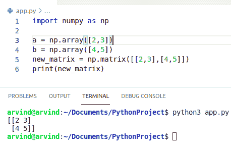
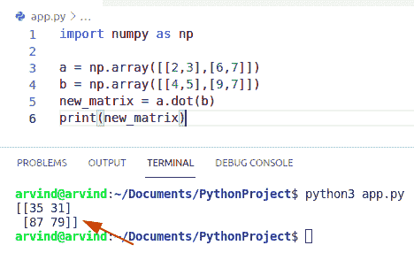
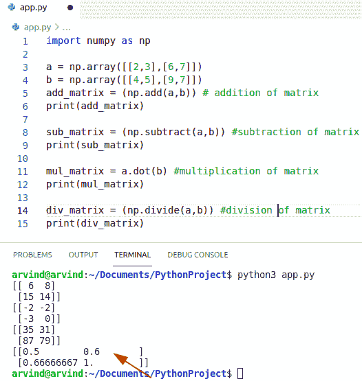
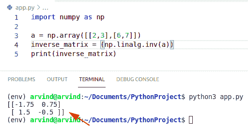
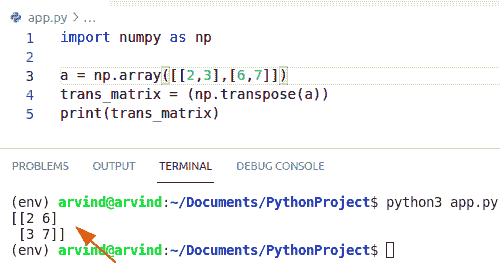
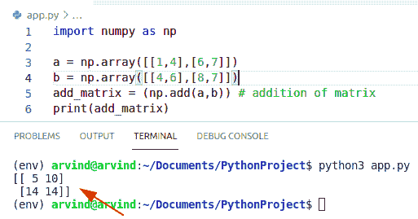
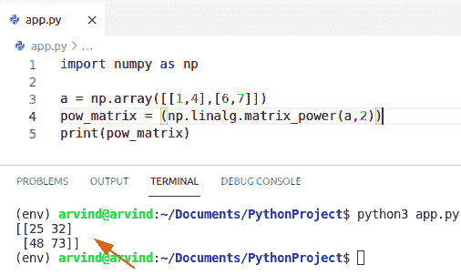
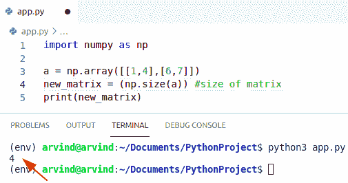
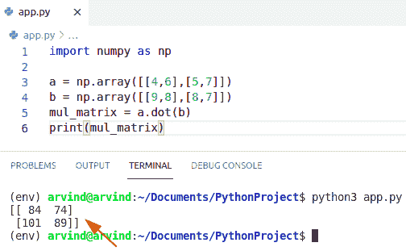
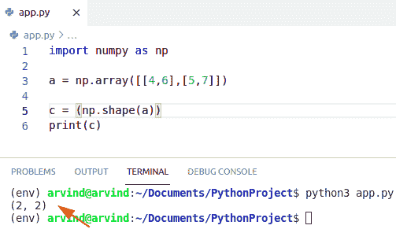

# Python NumPy 矩阵+示例

> 原文：<https://pythonguides.com/python-numpy-matrix/>

[](https://sharepointsky.teachable.com/p/python-and-machine-learning-training-course)

在本 [Python NumPy 教程](https://pythonguides.com/python-numpy-stack/)中，我们将讨论 **Python numpy 矩阵**并涵盖以下示例:

*   Python NumPy 矩阵乘法
*   Python NumPy 矩阵运算
*   Python NumPy 矩阵求逆
*   Python NumPy 矩阵转置
*   Python NumPy 矩阵加法
*   Python NumPy 矩阵幂
*   Python NumPy 矩阵大小
*   Python NumPy 矩阵逐元素乘法
*   Python NumPy 矩阵形状

如果您是 Python NumPy 的新手，请查看一下[Python](https://pythonguides.com/numpy/)中的 NumPy 是什么。

目录

[](#)

*   [Python NumPy 矩阵](#Python_NumPy_matrix "Python NumPy matrix")
*   [Python NumPy 矩阵乘法](#Python_NumPy_matrix_multiplication "Python NumPy matrix multiplication")
*   [Python NumPy 矩阵运算](#Python_NumPy_matrix_operation "Python NumPy matrix operation")
*   [Python NumPy 矩阵求逆](#Python_NumPy_matrix_inverse "Python NumPy matrix inverse")
*   [Python NumPy 矩阵转置](#Python_NumPy_matrix_transpose "Python NumPy matrix transpose")
*   [Python NumPy 矩阵加法](#Python_NumPy_matrix_addition "Python NumPy matrix addition")
*   [巨蟒 NumPy 矩阵力量](#Python_NumPy_matrix_power "Python NumPy matrix power")
*   [Python NumPy 矩阵大小](#Python_NumPy_matrix_size "Python NumPy matrix size")
*   [Python NumPy 矩阵逐元素乘法](#Python_NumPy_matrix_multiplication_element-wise "Python NumPy matrix multiplication element-wise")
*   [Python NumPy 矩阵形状](#Python_NumPy_matrix_shape "Python NumPy matrix shape")

## Python NumPy 矩阵

*   在本节中，我们将学习 Python numpy 矩阵。
*   矩阵是数据的矩形排列，换句话说，我们可以说它是数据的矩形数组。矩阵中的水平值称为行，垂直项称为列。
*   在 Python 中，我们可以使用嵌套列表或 numpy 数组，或者使用 numpy 库中名为 matrix 的类来实现这个矩阵。
*   首先，我们将讨论数组和矩阵，因为这属于 numpy 库。
*   Numpy 是一个允许我们创建多维数组的库。
*   二维数组意味着在一个列表的列表中同质数据的集合。它也被称为 numpy 矩阵。在二维数组中，我们可以很容易地使用两个方括号，这就是为什么它表示列表的列表。

**语法:**

以下是 python numpy 矩阵的语法

```py
numpy.matrix
            (
             data,
             dtype=None
            )
```

**举例:**

```py
import numpy as np

a = np.array([2,3])
b = np.array([4,5])
new_matrix = np.matrix([[2,3],[4,5]])
print(new_matrix)
```

下面是以下代码的截图



Python numpy matrix

这就是如何使用 Python NumPy 矩阵。

阅读:[Python NumPy a](https://pythonguides.com/python-numpy-append/)[p](https://pythonguides.com/python-numpy-append/)[pend](https://pythonguides.com/python-numpy-append/)

## Python NumPy 矩阵乘法

*   在本节中，我们将学习 Python numpy 矩阵乘法。
*   矩阵是数据或数字的矩形排列，或者换句话说，我们可以说它是数据的矩形阵列。矩阵中的水平项称为行，垂直项称为列。
*   矩阵乘法和数组乘法是不同的，对于数组乘法，我们使用这个符号，也就是乘法符号，但是要执行矩阵乘法，我们需要使用一个叫做点的方法。
*   为了执行矩阵乘法，我们需要使用点方法。
*   它是一种将两个矩阵作为输入并生成单个矩阵的操作。

**语法:**

下面是矩阵乘法的语法

```py
np.dot
      (
       a,
       b,
       out=None
      )
```

1.  `a` : array_like(它是第一个参数)
2.  **b:** array_like(这是第二个参数)
3.  **out:** 输出自变量。如果不使用它，它必须具有将返回的确切值。特别是，它必须具有正确的数据类型，必须是连续的，并且其 dtype 必须是为 dotmatrix(a，b)返回的数据类型。

**举例:**

让我们举个例子来检查如何执行矩阵乘法。

```py
import numpy as np

a = np.array([[2,3],[6,7]])
b = np.array([[4,5],[9,7]])
new_matrix = a.dot(b)
print(new_matrix)
```

以下是给定代码的截图



Python numpy matrix multiplication

阅读: [Python NumPy arange](https://pythonguides.com/python-numpy-arange/)

## Python NumPy 矩阵运算

*   在本节中，我们将学习 **Python numpy 矩阵运算**。
*   矩阵是数据或数字的矩形排列，换句话说，我们可以说它是数据的矩形数组。给定矩阵中的水平值称为行，垂直值称为列。
*   我们讨论加法、乘法和减法这三种运算。
*   对于矩阵加法，我们将使用符号加，因此，如果 A 是一个数组，B 是另一个数组，我们可以很容易地将这个矩阵 a+b 相加。它类似于其他加法，它将执行逐值加法。
*   矩阵乘法和数组乘法是不同的，对于数组乘法，我们使用这个符号，也就是乘法符号，但是为了得到矩阵乘法，我们需要使用一种叫做点阵的方法。
*   对于矩阵减法，我们将使用 numpy.subtract()来减去两个矩阵的值。它按值返回矩阵 1 和矩阵 2 的减法。
*   Numpy 是一个允许我们创建多维数组的库。

**语法:**

```py
numpy.matrix
            (
             data,
             dtype=None
            )
```

**举例:**

```py
import numpy as np

a = np.array([[2,3],[6,7]])
b = np.array([[4,5],[9,7]])
add_matrix = (np.add(a,b)) # addition of matrix
print(add_matrix)

sub_matrix = (np.subtract(a,b)) #subtraction of matrix
print(sub_matrix)

mul_matrix = a.dot(b) #multiplication of matrix
print(mul_matrix)

div_matrix = (np.divide(a,b)) #division of matrix
print(div_matrix)
```



Python numpy matrix operation

阅读: [Python NumPy Sum +示例](https://pythonguides.com/python-numpy-sum/)

## Python NumPy 矩阵求逆

*   在本节中，我们将了解到 **Python numpy 矩阵的逆矩阵**。
*   矩阵是数据或数字的矩形排列，或者换句话说，我们可以说它是数据的矩形阵列。矩阵中的水平项称为行，垂直项称为列。
*   对于矩阵求逆的方法，我们需要使用 np.linalg.inv()函数。
*   这个函数将对给定的矩阵求逆。
*   它由一个参数组成，该参数是 A，A 可以是一个矩阵。
*   Python 提供了一种简单的方法来计算矩阵的逆矩阵。该函数帮助用户检查 numpy.linalg.inv()在 Python 库中是否可用。

**语法:**

```py
numpy.linalg.inv(a)
```

**举例:**

```py
import numpy as np

a = np.array([[2,3],[6,7]])
inverse_matrix = (np.linalg.inv(a))
print(inverse_matrix)
```

以下是给定代码的截图



Python numpy matrix inverse

阅读: [Python NumPy zeros](https://pythonguides.com/python-numpy-zeros/)

## Python NumPy 矩阵转置

*   在本节中，我们将了解 **Python NumPy 矩阵转置**。
*   矩阵是元素或数字的矩形排列。换句话说，我们可以说它是一个矩形的数据数组，矩阵中的水平值称为行，垂直项称为列。
*   首先，我们将学习和讨论 numpy 数组和矩阵，因为这属于 NumPy 库。
*   Numpy 是一个库，它总是允许我们声明或创建多维数组。
*   这个函数将重新排列给定 NumPy 数组的维数。
*   给定矩阵的转置是一种通过对角元素翻转或反转矩阵的操作。
*   a[i][j]行和列的转置是通过交换到 a[j][i]来获得的。
*   对于矩阵转置法，我们需要使用 np.transpose()函数。

**语法:**

```py
numpy.transpose
               (
                arr,
                axis=None
               )
```

**举例:**

```py
import numpy as np

a = np.array([[2,3],[6,7]])
trans_matrix = (np.transpose(a))
print(trans_matrix)
```

下面是以下代码的截图



Python numpy matrix transpose

读取:[检查 Python 中的 NumPy 数组是否为空](https://pythonguides.com/check-if-numpy-array-is-empty/)

## Python NumPy 矩阵加法

*   在本节中，我们将了解到 **Python NumPy 矩阵加法**。
*   这是一个矩形数字排列。换句话说，我们可以说它是一个矩形的数据数组，矩阵中的水平项称为行，垂直值称为列。
*   对于矩阵加法，我们将使用加号，因此，如果 A 是任何矩阵，B 是另一个矩阵，我们可以将这个矩阵 a+b 相加。它类似于其他加法，它将执行元素的元素相加。
*   对于矩阵加法，我们需要使用 numpy.add()函数。
*   当我们要计算两个数组的相加时，就要用到 add()函数。
*   Numpy 是一个允许我们创建多维数组的库。

**语法:**

下面是矩阵加法的语法

```py
numpy.add
         (
          arr,
          dtype=None
         )
```

**举例:**

```py
import numpy as np

a = np.array([[1,4],[6,7]])
b = np.array([[4,6],[8,7]])
add_matrix = (np.add(a,b)) # addition of matrix
print(add_matrix)
```

下面是以下代码的截图



Python numpy matrix addition

阅读:[Python NumPy Random+Examples](https://pythonguides.com/python-numpy-random/)

## 巨蟒 NumPy 矩阵力量

*   在本节中，我们将了解 `Python NumPy matrix power` 。
*   它是数据的矩形排列。换句话说，我们可以说它是一个 numpy 数据数组，矩阵中的水平值称为行，垂直项称为列。
*   用来求矩阵幂的函数叫做矩阵幂。
*   对于矩阵幂，我们需要使用 numpy.linalg.matrix_power()。
*   它由两个参数 array 和 power(n)组成。
*   如果你取 n=0，那么我们将很容易得到识别矩阵。
*   如果你取 n>0，那就是正值。
*   如果 n 为负，则产生倒数，然后提升到绝对值 n。
*   Numpy 是一个总是允许我们创建多维 numpy 数组的库。

**语法:**

这是矩阵幂的语法

```py
numpy.linalg.matrix_power
                        (
                         arr,
                         power(n)
                        )
```

**举例:**

```py
import numpy as np

a = np.array([[1,4],[6,7]])
pow_matrix = (np.linalg.matrix_power(a,2))
print(pow_matrix)
```

下面是以下代码的截图



Python numpy matrix power

阅读: [Python NumPy 数组](https://pythonguides.com/python-numpy-array/)

## Python NumPy 矩阵大小

*   在本节中，我们将了解 **Python NumPy 矩阵大小**。
*   矩阵是元素的矩形排列，或者换句话说，我们会说它是数据的矩形阵列，矩阵中的水平项称为行，垂直项称为列。
*   它表示数组中元素的数量。
*   对于矩阵大小，我们需要使用 numpy.size()函数。
*   首先，我们将学习和讨论 numpy 数组和矩阵，因为这属于 NumPy 库包。
*   Numpy 是一个总是允许我们创建多维 numpy 数组的库。

**举例:**

```py
import numpy as np

a = np.array([[1,4],[6,7]])
new_matrix = (np.size(a)) #size of matrix
print(new_matrix)
```

下面是下面给出的代码的截图。



Python numpy matrix size

阅读: [Python NumPy to list](https://pythonguides.com/python-numpy-to-list/)

## Python NumPy 矩阵逐元素乘法

*   在这一节中，我们将学习 **Python NumPy 矩阵逐元素乘法**。
*   矩阵乘法和数组乘法是不同的，对于数组乘法，我们使用这个符号，也就是乘法符号，但是要执行矩阵乘法，我们需要使用一个叫做点的方法。
*   为了执行矩阵乘法，我们需要使用点方法。
*   它是一种将两个矩阵作为输入并生成单个矩阵的操作。

**语法:**

下面是矩阵乘法的语法

```py
np.dot
      (
       a,
       b,
       out=None
      )
```

1.  `a` : array_like(第一个参数)
2.  **b:** array_like(第二个参数)
3.  **out:** 输出自变量。这必须有确切的值，如果它没有被使用，将返回。在某些特定情况下，它应该具有正确的数据类型，必须是连续的，并且它的数据类型必须是为 matrix dot(a，b)返回的数据类型。

**举例:**

让我们举个例子来检查如何执行矩阵乘法。

```py
import numpy as np

a = np.array([[4,6],[5,7]])
b = np.array([[9,8],[8,7]])
mul_matrix = a.dot(b)
print(mul_matrix)
```

下面是以下代码的截图



Python numpy matrix multiplication element wise

阅读: [Python 排序 NumPy 数组](https://pythonguides.com/python-sort-numpy-array/)

## Python NumPy 矩阵形状

*   在本节中，我们将了解 **Python NumPy 矩阵形状**。
*   矩阵是数据或数字的矩形排列，或者换句话说，我们可以说它是数据的矩形阵列。矩阵中的水平项称为行，垂直项称为列。
*   numpy 数组的形状是每个维度中元素的数量。
*   对于矩阵形状，我们需要使用 numpy.shape()方法。

**举例:**

```py
import numpy as np

a = np.array([[4,6],[5,7]])

c = (np.shape(a))
print(c)
```

下面是下面给出的代码的截图。



Python numpy matrix shape

您可能会喜欢以下 Python 教程:

*   [python tkinter auto complete](https://pythonguides.com/python-tkinter-autocomplete/)
*   [Python pip 不被识别为内部或外部命令](https://pythonguides.com/python-pip-is-not-recognized/)
*   [Python 将元组转换为列表](https://pythonguides.com/python-convert-tuple-to-list/)
*   [python 中的百分号是什么意思](https://pythonguides.com/percent-sign-mean-in-python/)
*   [Python 内置函数示例](https://pythonguides.com/python-built-in-functions/)
*   [Python NumPy where with examples](https://pythonguides.com/python-numpy-where/)
*   [Python NumPy 平均值](https://pythonguides.com/python-numpy-average/)
*   [Python NumPy 最小值](https://pythonguides.com/python-numpy-minimum/)

在本 Python 教程中，我们将讨论 **Python NumPy 矩阵**，并涵盖以下示例:

*   Python numpy 矩阵乘法
*   Python numpy 矩阵运算
*   Python numpy 矩阵求逆
*   Python numpy 矩阵转置
*   Python numpy 矩阵加法
*   Python numpy 矩阵幂
*   Python numpy 矩阵大小
*   Python numpy 矩阵逐元素乘法
*   Python numpy 矩阵形状

[Bijay Kumar](https://pythonguides.com/author/fewlines4biju/)

Python 是美国最流行的语言之一。我从事 Python 工作已经有很长时间了，我在与 Tkinter、Pandas、NumPy、Turtle、Django、Matplotlib、Tensorflow、Scipy、Scikit-Learn 等各种库合作方面拥有专业知识。我有与美国、加拿大、英国、澳大利亚、新西兰等国家的各种客户合作的经验。查看我的个人资料。

[enjoysharepoint.com/](https://enjoysharepoint.com/)[](https://www.facebook.com/fewlines4biju "Facebook")[](https://www.linkedin.com/in/fewlines4biju/ "Linkedin")[](https://twitter.com/fewlines4biju "Twitter")