# Python NumPy 最小教程

> 原文：<https://pythonguides.com/python-numpy-minimum/>

[](https://sharepointsky.teachable.com/p/python-and-machine-learning-training-course)

在这个 [Python 教程](https://pythonguides.com/python-download-and-installation/)中，我们将学习如何**在 Python 中找到 NumPy 数组**中的最小元素。此外，我们将涵盖这些主题。

*   Python numpy 数组的最小值
*   Python numpy 最小索引
*   Python numpy 最小浮点
*   Python numpy 最少两个值
*   Python numpy 函数最小值
*   Python numpy 最小元素
*   Python numpy 最小列
*   Python np.where min
*   Python numpy 元素智能最小值
*   Python Numpy 最小二乘法示例
*   Python numpy 最少两个数组
*   Python numpy 最小值和最大值

目录

[](#)

*   [Python NumPy 最小值](#Python_NumPy_minimum "Python NumPy minimum")
*   [Python numpy 数组的最小值](#Python_numpy_minimum_of_array "Python numpy minimum of array")
*   [Python numpy 最小索引](#Python_numpy_minimum_index "Python numpy minimum index")
*   [Python numpy 最小浮点数](#Python_numpy_minimum_float "Python numpy minimum float")
*   [Python numpy 两个值的最小值](#Python_numpy_minimum_of_two_values "Python numpy minimum of two values")
*   [Python numpy 函数的最小值](#Python_numpy_minimum_of_function "Python numpy minimum of function")
*   [Python numpy 最小元素](#Python_numpy_minimum_element "Python numpy minimum element")
*   [Python numpy 最小列](#Python_numpy_minimum_column "Python numpy minimum column")
*   [Python np.where min](#Python_npwhere_min "Python np.where min")
*   [Python numpy 元素智能最小值](#Python_numpy_element_wise_min "Python numpy element wise min")
*   [Python Numpy 最小二乘法示例](#Python_Numpy_least_square_example "Python Numpy least square example")
*   [Python numpy 最少两个数组](#Python_numpy_minimum_of_two_arrays "Python numpy minimum of two arrays")
*   [如何在 Python 中检查两个数组的最小值](#How_to_check_minimum_value_of_two_arrays_in_Python "How to check minimum value of two arrays in Python")
*   [Python numpy 最小值和最大值](#Python_numpy_min_and_max "Python numpy min and max")

## Python NumPy 最小值

*   在这一节中，我们将讨论如何通过使用 NumPy Python 来获得数组的元素最小值。
*   为了执行这个特定的任务，我们将使用 numpy.minimum()方法。在 Python 中， `numpy.minimum()` 方法用于比较 Python 中的两个 numpy 数组，并且总是返回一个新的 numpy 数组，该数组存储元素最小值。
*   如果被比较的值之一是一个 `Nan` ( **不是一个数字)**，那么这个方法将检查这个条件，结果中总是返回该项。而在这种情况下，如果两个值都是 nan，则返回第一个值。

**语法:**

下面是 numpy.minimum()方法的语法

```py
numpy.minimum
             (
              x1,
              x2,
              /,
              out=None,
              *,
              where=True,
              casting='same_kind',
              order='K',
              dtype=None,
              subok=True
              [,
              signature,
              extobj
              ]
             )
```

*   它由几个参数组成:
    *   **x1，x2:** 该参数表示要比较哪些元素，并且必须是相同的形状。
    *   **out:** 默认情况下，它接受**‘None’**值，如果没有提供 None 值，那么它将返回一个新分配的数组。
    *   **其中:**默认情况下，条件为真表示输出数组，将设置为 ufunc 结果。
*   让我们举个例子来理解一下 `numpy.minimum()` 方法的工作原理

```py
import numpy as np

new_arr = np.array([45,12,13])
new_arr2 = np.array([53,13,15])
final_result=np.minimum(new_arr,new_arr2)
print("Minimum array element:",final_result)
```

在上面的代码中，我们首先导入一个 NumPy 库，然后使用 `np.array()` 创建一个数组。现在声明一个变量**‘最终结果’**，并赋一个函数 numpy.minimum()。

一旦您将打印**‘final _ result’**，那么输出将显示只包含最小值的新数组。

下面是以下代码的截图

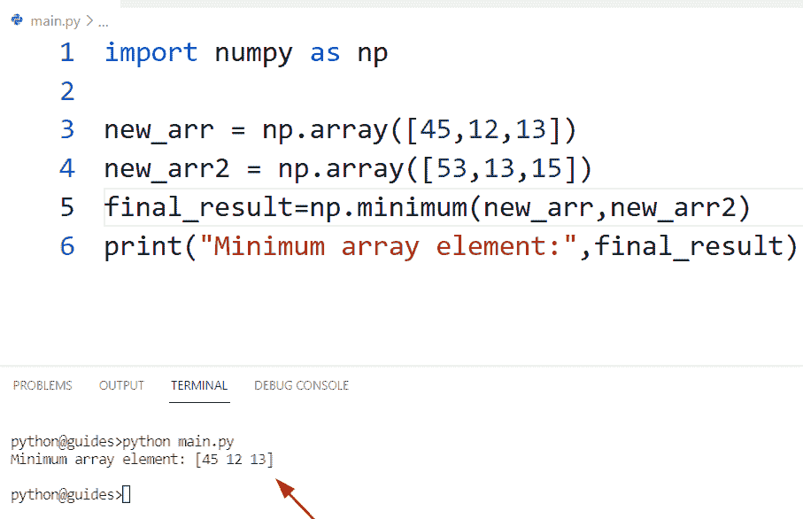

Python NumPy minimum

阅读 [Python Numpy 未找到–如何修复](https://pythonguides.com/python-numpy-not-found/)

## Python numpy 数组的最小值

*   在这里，我们可以看到如何使用 Python 找到 NumPy 数组中的最小值。
*   为了完成这个任务，我们可以很容易地使用函数 np.min()。在 Python 中，这个函数用于沿着指定的轴查找数组中的最小值。这个方法在 NumPy 模块中总是可用的。
*   在 Python 中，此方法返回 ndarray 对象的最小值，并且也基于给定的轴。

**语法:**

下面是 `numpy.min()` 方法的语法

```py
numpy.min
         (
          input_array,
          axis=None,
          out=None,
          keepdims=None,
          initial=None,
          where=None
         ) 
```

*   它由几个参数组成
    *   **input_array:** 该参数表示我们希望在 `numpy.min()` 函数中使用哪些数组。
    *   **轴:**这是一个可选参数，默认情况下，它不取值，也用于多维数组。
    *   **keepdims:** 此参数表示布尔值。

**举例:**

让我们举一个例子，看看如何使用 NumPy Python 找到数组中的最小值

**源代码:**

```py
import numpy as np

new_val= np.arange(20)
result= np.min(new_val)
print("Minimum value:",result)
```

在上面的代码中，我们导入了一个 NumPy 库，然后使用 n `p.arange()` 方法。现在使用 `np.min()` 方法，并在该函数中传递**‘new _ val’**数组作为参数。一旦打印出**‘result’**，输出将显示给定数组中的最小值。

下面是以下给定代码的实现

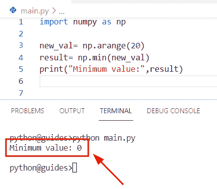

Python numpy minimum of an array

正如您在屏幕截图中看到的，输出显示最小值“0”

阅读 [Python NumPy 删除](https://pythonguides.com/python-numpy-delete/)

## Python numpy 最小索引

*   在本期节目中，我们将讨论如何使用 NumPy Python 来寻找最小值的索引。
*   为了执行这个特定的任务，我们将应用方法 `numpy.argmin()` 。在 Python 中， `numpy.argmin()` 用于从 numpy 数组中沿着指定的轴获取最小值的索引号。
*   该方法将一个数组作为输入，并总是返回最小值的索引，该数组可以是**二维**、**一维**，或者我们可以说是执行该任务的多维数组。
*   假设我们有一个包含整数值的数组，数组中的每个位置都有一个索引。为了找到最小值的索引，我们必须使用 `numpy.argmin()` 函数。

**语法:**

下面是 numpy.argmin()方法的语法

```py
numpy.argmin
            (
             a,
             axis=None,
             out=None
            )
```

*   它由几个参数组成
    *   **a:** 该参数表示你要操作的数组并找到了索引号。
    *   **axis:** 这是一个可选参数，默认情况下，它不取值，如果 `axis=1` 它将检查条件，然后它将按行查找索引，否则按列查找。
    *   **out:** 如果指定了，那么 `np.argmin()` 函数的输出将被存储到这个数组中，并且它应该具有适当的形状和大小。

**举例:**

让我们举个例子，了解一下 `numpy.argmin()` 函数的工作原理

**源代码:**

```py
import numpy as np

new_array= np.arange(2,6)
print("Creation of array:",new_array)
result= np.argmin(new_array)
print("Index number of minimum valuwe:",result)
```

*   在上面的代码中，我们导入了 numpy 库，初始化了一个变量，并将数组存储到其中。
*   现在使用 `numpy.argmin()` 函数并传递数组**‘new _ array’**作为参数。一旦您将打印**‘结果’**，则输出显示最小数字的索引号。

下面是以下代码的截图

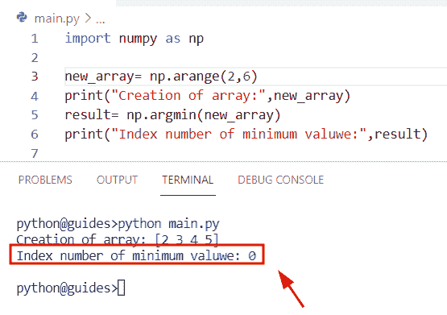

Python numpy minimum index

阅读 [Python Numpy 阶乘](https://pythonguides.com/python-numpy-factorial/)

## Python numpy 最小浮点数

*   在本节中，我们将讨论如何使用 Python 找到 NumPy 数组中的最小浮点值。
*   在这个例子中，我们将使用 `numpy.min()` 函数从数组中获取最小十进制值。在 Python 中, `np.min()` 用于沿着指定的轴寻找数组中的最小值。

**语法:**

下面是 numpy.min()函数的语法

```py
numpy.min
         (
          input_array,
          axis=None,
          out=None,
          keepdims=None,
          initial=None,
          where=None
         ) 
```

**举例:**

```py
import numpy as np

new_val= np.array([14.5,11.2,8.7,22.3,45.6])
new_output= np.min(new_val)
print("Minimum floating value:",new_output)
```

*   在本例中，我们将使用 `numpy.min()` 函数从数组中获取最小十进制值。在 Python 中， `np.min()` 用于沿着指定的轴查找数组中的最小值。
*   一旦你将打印**‘new _ output’**，那么结果将显示来自给定数组的最小浮点值。

下面是以下给定代码的输出

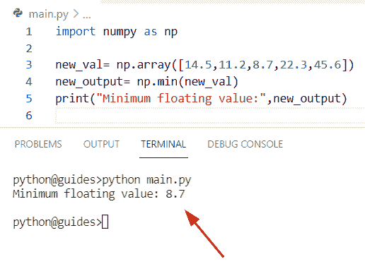

Python numpy minimum float

阅读 [Python NumPy 栈示例](https://pythonguides.com/python-numpy-stack/)

## Python numpy 两个值的最小值

*   在本节中，我们将讨论如何使用 NumPy Python 找到两个值之间的最小值。
*   为了完成这项任务，我们可以很容易地使用 numpy.minimum()函数的概念以及 np.cos()函数。在 Python 中， `numpy.minimum()` 用于获取数组值的元素最小值，并总是返回一个存储元素最小值的新 numpy 数组。
*   在 Python 中， `Numpy.cos()` 函数用于计算所有值的三角余弦。在这个例子中，我们将应用这个函数来获取两个值之间的最小值。

**语法:**

下面是 numpy.cos()函数的语法

```py
numpy.cos
         (
          x,
          /,
          out=None,
          *,
          where=True,
          casting='same_kind',
          order='K',
          dtype=None,
         )
```

**举例:**

让我们举一个例子，看看如何找到两个值之间的最小数

**源代码:**

```py
import numpy as np

new_arr = np.array([16,18,20,22,24])

result = np.minimum(np.cos(2*new_arr*np.pi), 4/2)
print("Minimum of two values:",result)
```

下面是以下给定代码的执行过程

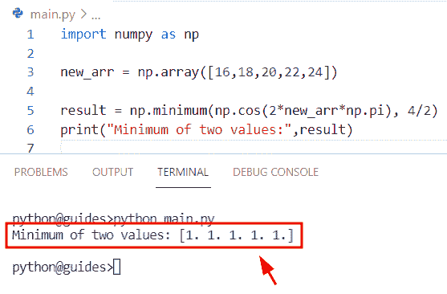

Python numpy minimum of two values

阅读 [Python NumPy round](https://pythonguides.com/python-numpy-round/)

## Python numpy 函数的最小值

*   在本节中，我们将讨论如何在 NumPy Python 中使用 `np.amin()` 函数。
*   在 Python 中，此方法用于从 n 维数组中查找最小值，这是一个统计函数，在 numpy 模块中始终可用，并返回最小值数组。
*   如果我们在程序中使用二维或三维数组，那么我们必须找到每一行和每一列的最小值。这个函数有四个参数和轴参数。

**语法:**

下面是 `numpy.amin()` 函数的语法

```py
numpy.amin
          (
           a,
           axis=None,
           out=None,
           keepdims=<no value>,
           initial=<no value>,
           where=<no value>
          )
```

*   它由几个参数组成
    *   **a:** 该参数指定输入数据，从中我们可以很容易地找到最小值。
    *   **轴:**默认情况下，它设置值**‘无’**，如果**轴=0** 它将检查条件，然后它将按列查找索引，否则按行查找。
    *   **out:** 这是一个可选参数，指定要放置输出的输出数组。

**举例:**

让我们举个例子，了解一下 `numpy.amin()` 函数的工作原理

**源代码:**

```py
import numpy as np

new_val= np.arange(16).reshape((4,4))
print("Creation of array:",new_val)
output= np.amin(new_val)
print("Minimum value:",output)
```

在上面的代码中，我们导入了 numpy 库，然后通过使用 `np.arange()` 函数和`NP . shape()`来初始化一个数组。

一旦你将打印**‘new _ val’**，那么输出将显示新的数组。现在使用 `np.amin()` 并传递一个数组作为参数。

你可以参考下面的截图

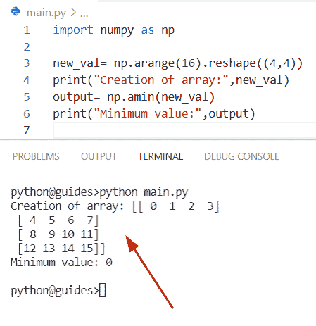

Python numpy minimum of a function

正如您在屏幕截图中看到的，输出显示最小值“0”

阅读 [Python Numpy unique](https://pythonguides.com/python-numpy-unique/)

## Python numpy 最小元素

*   在本期节目中，我们将讨论如何使用 Python 来寻找 NumPy 数组中的最小元素。
*   在这个例子中，我们将使用 `np.min()` 函数从给定的数组中获取最小元素。

**语法:**

下面是 `np.min()` 方法的语法

```py
numpy.min
         (
          input_array,
          axis=None,
          out=None,
          keepdims=None,
          initial=None,
          where=None
         ) 
```

**源代码:**

```py
import numpy as np

values= np.array([23,14,7,8,34])
new_result= np.min(values)
print("Minimum value:",new_result)
```

下面是以下给定代码的执行过程

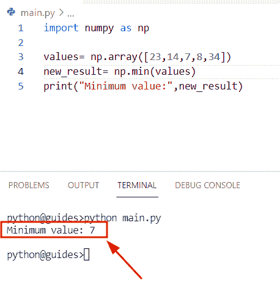

Python numpy minimum element

您可以在屏幕截图中看到，输出显示最小值“7”

阅读 [Python NumPy 重复](https://pythonguides.com/python-numpy-repeat/)

## Python numpy 最小列

*   在这一节中，我们将讨论如何使用 Python 找到 NumPy 数组中每一列的最小值。
*   为了执行这个特定的任务，我们将使用 `numpy.minimum()` 函数以及表示列值的 `axis=0` 。

**举例:**

```py
import numpy as np

a = np.array([[12,5], [1,1], [16,8]])
b= np.min(a,axis=0)
print("Minimum values from column:",b)
```

*   在上面的代码中，我们导入了 numpy 库，然后使用 `np.array()` 函数来创建一个数组。
*   现在使用 `np.min()` 函数，并在这个方法中赋值 `axis=0` 。一旦你将打印**‘b’**，那么输出将显示每一列的最小值。

下面是以下给定代码的实现

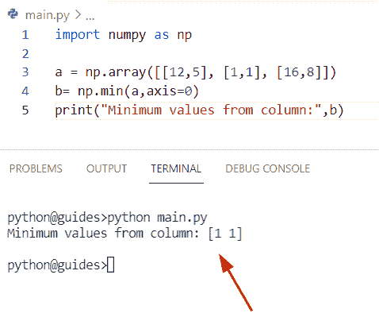

Python numpy minimum column

也可阅读， [Python NumPy 数据类型](https://pythonguides.com/python-numpy-data-types/)

## Python np.where min

*   在本节中，我们将讨论如何在 NumPy Python 中使用 `np.where()` 函数
*   在这个例子中，我们将使用 `numpy.array()` 函数创建一个数组，然后使用 `np.min()` 函数，它将获得最小的数，之后我们将应用 `np.where()` 函数。

**语法:**

下面是 `numpy.where()` 方法的语法

```py
numpy.where
           (
            condition
            [,
            x,
            y
            ]
           )
```

**举例:**

```py
import numpy as np

new_array=np.array([15,56 ,4,  9, 65])
m = np.min(new_array)
u = np.where(new_array == m)
z=new_array[u]
print(z)
```

下面是以下给定代码的输出

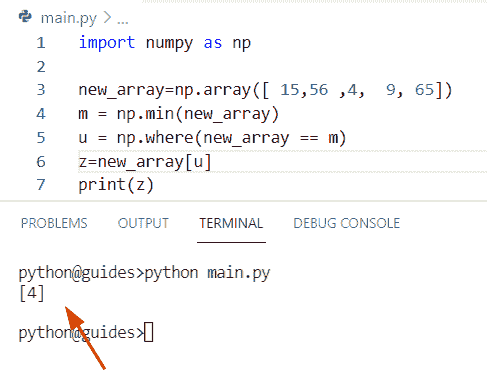

Python np where min

读取 [Python NumPy 2d 数组](https://pythonguides.com/python-numpy-2d-array/)

## Python numpy 元素智能最小值

*   在这个程序中，我们将讨论如何使用 Python 来获取 NumPy 数组中的最小元素。
*   在本例中，我们将使用 `np.min()` 函数并将数组作为参数传递。一旦你将打印**‘新 _ 输出’**，那么结果将显示最小值。

**举例:**

```py
import numpy as np

array= np.array([13,10,45,87,67,19])
new_output= np.min(array)
print("Minimum value element-wise:",new_output)
```

下面是以下代码的截图

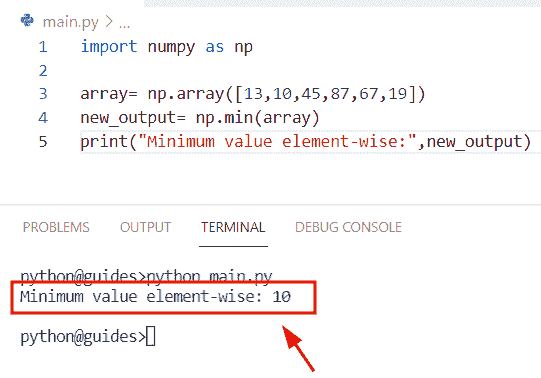

Python numpy element-wise min

阅读 [Python NumPy 3d 数组+示例](https://pythonguides.com/python-numpy-3d-array/)

## Python Numpy 最小二乘法示例

*   在本节中，我们将讨论如何使用 Python 获得 NumPy 数组中的最小平方。
*   为了执行这个特定的任务，我们将使用 `numpy.linalg.lstsq()` 方法。在 Python 中，这种方法用于获得矩阵方程 `ax=b` 的最小平方。
*   该函数在 NumPy 模块中可用，该方法将矩阵作为参数，并总是返回解。它将检查条件，如果它是一个**二维数组**，那么结果在 x 的第 K 列。

**语法:**

下面是 numpy.linalg()函数的语法

```py
numpy.linalg.lstsq
                  (
                   a,
                   b,
                   rcond='warn'
                  )
```

*   它由几个参数组成
    *   `a` ， **b:** 此参数表示矩阵，它将检查条件，如果是一个自变量中的二维数组，则为 K 列中的每一列测量最小值。
    *   **rcond:** 默认情况下，该值采用**‘警告’**值，它应该是一个奇异值，并被视为零。

**源代码:**

```py
import numpy as np

arr1=[[5,5,5,5],[5,5,5,5],[5,5,5,5],[5,5,5,5],[5,5,4,4]]
arr2=[5,5,5,5,5]
new_result=np.linalg.lstsq(arr1, arr2, rcond = -1)
print("Least square number:",new_result[0]) 
```

在上面的代码中，我们导入了 numpy 库，然后使用矩阵方程 `ax=b` 以及 `np.linalg.lstsq()` 方法，在这个函数中我们传递了数组。一旦你将打印**‘new _ result[0]’**，那么输出将显示最小二乘解。

下面是以下代码的截图

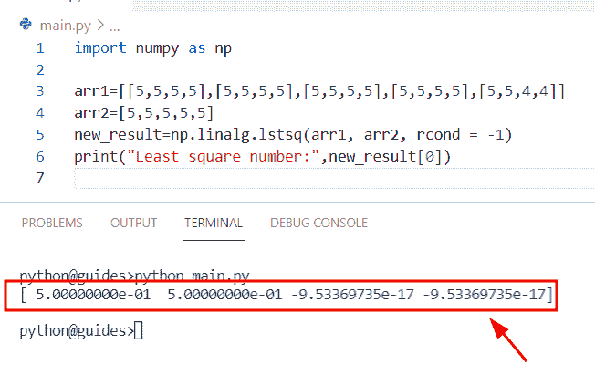

Python Numpy least-square example

阅读 [Python NumPy 追加](https://pythonguides.com/python-numpy-append/)

## Python numpy 最少两个数组

*   在这个程序中，我们将讨论如何使用 NumPy Python 获取两个数组之间的最小元素。
*   通过使用 `numpy.min()` 函数，我们可以很容易地从两个给定的数组中获得最小值。为了完成这个任务，我们首先要导入 numpy 模块，然后使用 `np.array()` 函数初始化一个数组。
*   现在声明一个变量**‘final _ output’**，并指定一个函数 min 作为参数，在这个函数中，我们设置了数组**‘new _ arr 1’**和**‘new _ arr 2’**。

**源代码:**

```py
import numpy as np

new_arr1=np.array([23,45,67])
new_arr2=np.array([64,12,6])
final_output = min(min(new_arr1),min(new_arr2))
print("Minimum value of two arrays:",final_output)
```

下面是以下给定代码的实现

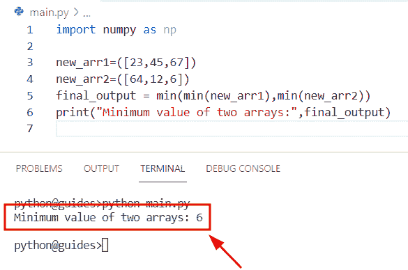

Python numpy minimum of two arrays

正如您在屏幕截图中看到的，输出显示了两个数组的最小值

阅读 [Python NumPy 数组](https://pythonguides.com/python-numpy-arange/)

## 如何在 Python 中检查两个数组的最小值

通过使用 `np.minimum()` 函数我们可以解决这个问题。在 Python 中， `numpy.minimum()` 用于比较两个 numpy 数组，并且总是返回一个新的 numpy 数组。

**语法:**

下面是 numpy.minimum()函数的语法

```py
numpy.minimum
             (
              x1,
              x2,
              /,
              out=None,
              *,
              where=True,
              casting='same_kind',
              order='K',
              dtype=None,
              subok=True
              [,
              signature,
              extobj
              ]
             )
```

**源代码:**

```py
import numpy as np

new_values1= np.array([45,21,29])
new_values2= np.array([85,32,12])
result = np.minimum(new_values1,new_values2)
print("Minimum value:",result)
```

在上面的代码中，我们导入了 numpy 库，然后使用了 `np.minimum()` 函数，在该函数中，我们将数组**‘新值 1’**和**‘新值’**指定为参数。

一旦打印出**‘result’**，输出将显示两个数组中的最小值，并将它们存储到一个新的数组中。

下面是以下代码的截图

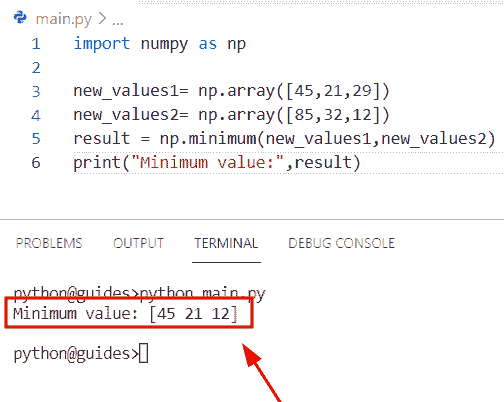

Python numpy minimum of two arrays

阅读 [Python NumPy Sum](https://pythonguides.com/python-numpy-sum/)

## Python numpy 最小值和最大值

*   在本节中，我们将讨论如何在 NumPy Python 中找到最大值和最小值。
*   在 Python 中, `max()` 函数用于查找给定轴的最大值，该函数只包含数组中的数值，在该函数中有几个参数，如 **axis，arr，keepdims** 。
*   在 Python 中，min()函数用于查找指定轴的最小值。

**举例:**

我们举个例子，检查一下如何在 NumPy Python 中求最大值和最小值。

**源代码:**

```py
import numpy as np

new_array=np.array([23,4,6,16,72,95,44])
z= np.max(new_array)
print("Maximum value:",z)
d= np.min(new_array)
print("Minimum value:",d)
```

下面是以下给定代码的执行过程

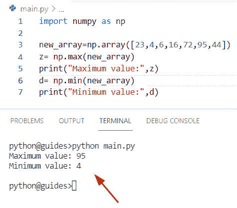

Python numpy min and max

相关 Python NumPy 教程:

*   [Python NumPy 绝对值举例](https://pythonguides.com/python-numpy-absolute-value/)
*   [Python NumPy square 示例](https://pythonguides.com/python-numpy-square/)
*   [Python NumPy 列举示例](https://pythonguides.com/python-numpy-to-list/)
*   [Python NumPy 读取 CSV](https://pythonguides.com/python-numpy-read-csv/)
*   [Python 排序 NumPy 数组](https://pythonguides.com/python-sort-numpy-array/)

在这个 Python 教程中，我们学习了如何使用 Python 在 NumPy 数组中找到最小元素。此外，我们将涵盖这些主题。

*   Python numpy 数组的最小值
*   Python numpy 最小索引
*   Python numpy 最小浮点
*   Python numpy 最少两个值
*   Python numpy 函数最小值
*   Python numpy 最小元素
*   Python numpy 最小列
*   Python np.where min
*   Python numpy 元素智能最小值
*   Python Numpy 最小二乘法示例
*   Python numpy 最少两个数组
*   Python numpy 最小值和最大值

[Bijay Kumar](https://pythonguides.com/author/fewlines4biju/)

Python 是美国最流行的语言之一。我从事 Python 工作已经有很长时间了，我在与 Tkinter、Pandas、NumPy、Turtle、Django、Matplotlib、Tensorflow、Scipy、Scikit-Learn 等各种库合作方面拥有专业知识。我有与美国、加拿大、英国、澳大利亚、新西兰等国家的各种客户合作的经验。查看我的个人资料。

[enjoysharepoint.com/](https://enjoysharepoint.com/)[](https://www.facebook.com/fewlines4biju "Facebook")[](https://www.linkedin.com/in/fewlines4biju/ "Linkedin")[](https://twitter.com/fewlines4biju "Twitter")