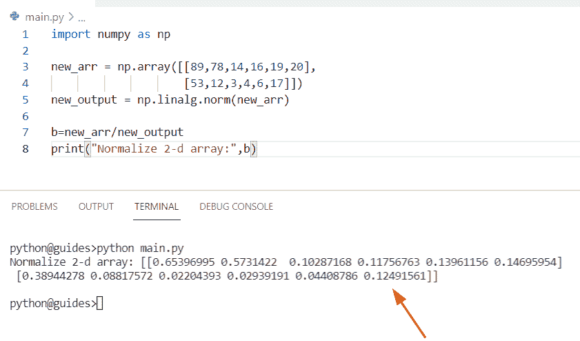
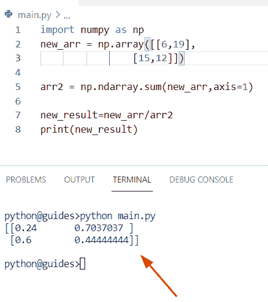

# Python NumPy 规范化+示例

> 原文：<https://pythonguides.com/python-numpy-normalize/>

[](https://sharepointsky.teachable.com/p/python-and-machine-learning-training-course)

在这个 [Python 教程中，](https://pythonguides.com/python-hello-world-program/)我们将学习**如何规范化 Python** 中的 NumPy 数组。此外，我们将涵盖这些主题。

*   Python numpy 在 0 和 1 之间正常化
*   Python numpy 归一化向量
*   Python Numpy 规范化数组
*   Python NumPy 规范化 2d 数组
*   Python NumPy 将每一行规范化
*   Python NumPy 归一化角度
*   Python Numpy 归一化互相关
*   Python NumPy 归一化直方图
*   Python 规范化不带 NumPy 的矢量
*   Python NumPy 规范化列表
*   Python NumPy 规范化数据
*   Python NumPy 归一化矩阵

目录

[](#)

*   [Python NumPy 规格化](#Python_NumPy_normalize "Python NumPy normalize")
    *   [检查 NumPy 数组中规格化的另一种方法](#Another_approach_to_check_the_normalize_in_NumPy_array "Another approach to check the normalize in NumPy array")
*   [Python numpy 在 0 和 1 之间正常化](#Python_numpy_normalize_between_0_and_1 "Python numpy normalize between 0 and 1")
*   [Python numpy 规格化向量](#Python_numpy_normalize_vector "Python numpy normalize vector")
*   [Python Numpy 规格化数组](#Python_Numpy_normalize_array "Python Numpy normalize array")
*   [Python NumPy 规格化 2d 数组](#Python_NumPy_normalize_2d_array "Python NumPy normalize 2d array")
*   [Python NumPy 规格化每一行](#Python_NumPy_normalize_each_row "Python NumPy normalize each row")
*   [Python NumPy 归一化角度](#Python_NumPy_normalize_angle "Python NumPy normalize angle")
*   [Python Numpy 归一化互相关](#Python_Numpy_normalized_cross_correlation "Python Numpy normalized cross correlation")
*   [Python NumPy 归一化直方图](#Python_NumPy_normalized_histogram "Python NumPy normalized histogram")
*   [Python 规格化不带 NumPy 的矢量](#Python_normalize_vector_without_NumPy "Python normalize vector without NumPy")
*   [Python NumPy 规格化列表](#Python_NumPy_normalize_list "Python NumPy normalize list")
*   [Python NumPy 规格化数据](#Python_NumPy_normalize_data "Python NumPy normalize data")
*   [Python NumPy 归一化矩阵](#Python_NumPy_normalize_matrix "Python NumPy normalize matrix")

## Python NumPy 规格化

*   在这个程序中，我们将讨论如何在 Python 中规范化一个 [NumPy 数组](https://pythonguides.com/python-numpy-array/)。
*   在 Python 中，Normalize 意味着数组的正常值有一个向量大小，我们必须将数组转换为所需的范围。为了完成这项任务，我们将使用 numpy.linalg.norm()方法。
*   这种方法基本上用于计算不同的向量范数，或者我们可以说是不同的矩阵范数，这个函数有三个重要的参数。

**语法:**

下面是 numpy.linalg.norm()方法的语法

```py
linalg.norm
           (
            x,
            ord=None,
            axis=None,
            keepdims=False
```

*   它由几个参数组成
    *   **x:** 该参数表示 n 维的输入数组
    *   **ord:** 它指定了我们希望如何获得范数的阶，默认情况下，它不取值。
    *   **轴:**该参数检查轴是否为整数值，然后为 x 轴生成向量值，如果轴为 none，则返回向量范数。
    *   **keepdims:** 它将检查条件，如果该参数为真，则轴在输出中被赋范到左侧。

**举例:**

让我们举一个例子，了解如何找到一个数组的范式

**源代码:**

```py
import numpy as np

arr = np.array([89,78,14,16,19,20])
result = np.linalg.norm(arr)

new_output=arr/result
print(new_output)
```

在上面的代码中，我们使用了 numpy 数组，然后创建了一个变量“result ”,在该变量中，我们分配了一个函数 np.linalg.norm 来计算正常值，并将每个项划分到一个数组中。

下面是以下给定代码的执行过程


Python NumPy normalize

### 检查 NumPy 数组中规格化的另一种方法

通过使用列表理解方法，我们可以很容易地从给定的列表中创建一个新列表。在本例中，我们必须对给定的列表“my_lis”进行规范化。在列表中，我们必须将每个项目除以所有项目的总和。

**源代码:**

```py
my_lis = [[14,27,34,24]]

result = [m / sum(n) for n in my_lis for m in n]
print(result)
```

下面是以下代码的截图


Python NumPy normalize

这就是如何在 Python 中规范化 numpy 数组。

阅读: [Python 查找列表中元素的索引](https://pythonguides.com/python-find-index-of-element-in-list/)

## Python numpy 在 0 和 1 之间正常化

*   在这一节中，我们将讨论如何使用 Python 规范化 0 和 1 之间的 numpy 数组。
*   在这里，您可以通过从最小值中减去数据来归一化 0 和 1 之间的数据，在该程序中，我们使用 np.random.rand()函数的概念，该方法从给定的采样中生成，并返回指定形状的数组。
*   在创建 numpy 数组时，我们应用了 np.min 和 np.ptp 的概念。在 Python 中， `ptp` 代表峰到峰，这种方法有利于用户返回一系列值。在本例中，范围是(5，4)。

**语法:**

下面是 np.ptp()方法的语法

```py
numpy.ptp
         (
          a,
          axis=None,
          out=None,
          keepdims=<no value>
         )
```

**举例:**

让我们举一个例子，看看如何在 0 和 1 之间规范化一个 numpy 数组

**源代码:**

```py
import numpy as np

arr1 = np.random.rand(5,4)
result = (arr1 - np.min(arr1))/np.ptp(arr1)
print(result)
```

在上面的代码中，一旦打印“result ”,输出将显示规范化的数组，numpy 数组中的最小值将始终规范化为 0，最大值为 1。

下面是以下给定代码的实现


Python numpy normalize between 0 and 1

阅读: [Python NumPy Random](https://pythonguides.com/python-numpy-random/)

## Python numpy 规格化向量

这里我们可以看到如何将一个 numpy 数组规范化为一个单位向量。在这个例子中，我们通过使用 np.square root 创建了一个向量范数，这个方法将对数组中的元素之和求平方。

**源代码:**

```py
import numpy as np

arr1 = np.random.random((3, 2))

new_output = arr1 / np.sqrt(np.sum(arr1**2))
print(new_output)
```

在上面的代码中，我们使用 np.sqrt()函数划分数据，同时将 np.sum()函数作为参数。一旦您将打印“new_output ”,那么输出将显示 numpy 数组的单位向量。

下面是以下给定代码的输出


Python numpy normalize a vector

阅读: [Python NumPy max](https://pythonguides.com/python-numpy-max-with-examples/)

## Python Numpy 规格化数组

*   在这一节中，我们将讨论如何使用 Python 来规范化 NumPy 数组。
*   通过使用 sklearn normalize，我们可以执行这一特定任务，该方法将帮助用户将样本单独转换为单位标准，该方法仅采用一个参数，其他参数是可选的。
*   在本例中，我们设置 axis =0，表示每个要素都将被规范化，如果 axis=1，则数据将被单独规范化，同时我们将应用 np.axis 来返回 numpy 数组中的所有行。

**语法:**

下面是 sklearn 规范化模块的语法

```py
sklearn.preprocessing.normalize
                               (
                                X,
                                norm=l2,
                                *,
                                axis=1,
                                copy=True,
                                return_norm=False
                               )
```

**源代码:**

```py
import numpy as np
from sklearn.preprocessing import normalize

new_arr = np.array([12,45,23,45,10,13,12])*5
new_output = normalize(new_arr[:,np.newaxis], axis=0)

print(new_output)
```

你可以参考下面的截图


Python Numpy normalize array

阅读: [Python NumPy 形状](https://pythonguides.com/python-numpy-shape/)

## Python NumPy 规格化 2d 数组

*   在这个程序中，我们将讨论如何使用 Python 规范化一个 numpy 二维数组。
*   在这种情况下，我们必须规范化一个 2 维数组，该数组包含由 np.array 函数生成的随机值。现在，要完成这项任务，我们必须使用 numpy.linalg.norm()方法。这种方法基本上用来计算不同的向量范数。

**举例:**

```py
import numpy as np

new_arr = np.array([[89,78,14,16,19,20],
                    [53,12,3,4,6,17]])
new_output = np.linalg.norm(new_arr)

b=new_arr/new_output
print("Normalize 2-d array:",b)
```

在上面的代码中，我们首先导入了 numpy 库，然后创建了一个数组‘new _ arr’。现在使用 np.linalg.norm()函数来规范化 numpy 二维数组。

下面是以下代码的截图



Python NumPy normalize 2d array

阅读: [Python 反向 NumPy 数组](https://pythonguides.com/python-reverse-numpy-array/)

## Python NumPy 规格化每一行

*   在这里，我们可以看到如何使用 Python 规范化 Numpy 数组中的每一行。
*   在这个程序中，我们应用了 numpy ndarray sum 来计算数组中的每一行。这个方法是用向量规范化 numpy 数组的另一种方式。
*   在本例中，我们设置 axis=1，表示数据将单独标准化，同时我们将“new_arr”指定为参数。

**举例:**

```py
import numpy as np
new_arr = np.array([[6,19],
                [15,12]])

arr2 = np.ndarray.sum(new_arr,axis=1)

new_result=new_arr/arr2
print(new_result)
```

下面是以下给定代码的实现



Python NumPy normalize each row

这就是如何用 Python 中的每一行来规范化 numpy 数组。

阅读: [Python NumPy 空数组](https://pythonguides.com/python-numpy-empty-array/)

## Python NumPy 归一化角度

*   在本节中，我们将讨论如何使用 Python 中的 np.angle()函数来规范化 numpy 数组。
*   在这个例子中，我们要找出浮点和复数值的角度。为了完成这个任务，我们将使用 Numpy.angle()函数，这个方法还会将 Numpy 数组值转换为 normalize。

**语法:**

下面是 np.angle()函数的语法

```py
numpy.angle
           (
            z,
           deg=false
           )
```

*   它由几个参数组成
    *   **z:** 该参数表示我们要计算的复数。
    *   **deg:** 默认情况下，它是一个可选参数，采用“false”值，返回以弧度为单位的角度。

**源代码:**

```py
import numpy as np

new_arr = np.array([[6.0,19.0j],
                [15+1j,12.0]])
new_result= np.angle(new_arr) 
print(new_result)
```

下面是以下代码的截图


Python NumPy normalize angle

阅读: [Python NumPy nan](https://pythonguides.com/python-numpy-nan/)

## Python Numpy 归一化互相关

*   在这个程序中，我们将讨论如何使用 Python 中的关联方法来规范化一个普通数组。
*   在 Python 中，相关方法表示一维向量之间的互相关，并且还定义了单个处理文本 c _ { av }[k]= sum _ na[n+k]* conj(v[n])。

**语法:**

下面是 numpy.correlation()方法的语法

```py
numpy.correlate 
               (
                a,
                v,
                mode='valid'
               )
```

**源代码:**

```py
import numpy as np

arr1 =np.array([6,3,4])
arr2 =np.array([2,6,7])
m = (arr1 - np.mean(arr1)) / (np.std(arr1) * len(arr1))
n = (arr2 - np.mean(arr2)) / (np.std(arr2))
new_result = np.correlate(m, n, 'full')
print(new_result)
```

在上面的代码中，我们通过使用名为“arr1”和“arr2”的 np.array()函数获得了两个 numpy 数组。之后，我们通过使用每个模式的互相关值来显示输出。

你可以参考下面的截图


Python Numpy normalized cross-correlation

阅读: [Python NumPy 平均值](https://pythonguides.com/python-numpy-average/)

## Python NumPy 归一化直方图

*   在本节中，我们将讨论如何使用 Python 中的直方图来规范化 numpy 数组。
*   这里我们可以使用 pyplot.hist()方法的概念和这个函数显示样本数据的形状。在本例中，我们将数据加载到一个 numpy 数组中，然后使用 pyplot 实例并调用 hist()方法来绘制直方图。
*   在这个程序中，我们还使用 pyplot.xtricks()方法来设置 x 轴的当前刻度位置和标签。

**语法:**

下面是 matplotlib.pyplot.hist()方法的语法

```py
matplotlib.pyplot.hist
                      (
                       x,
                       bins=None,
                       range=None,
                       density=False,
                       weights=None,
                       cumulative=False,
                       bottom=None,
                       histtype='bar'
                      )
```

**举例:**

```py
import matplotlib.pyplot as plt
import numpy as np

m=(4,4,4,4)
v, bins, o=plt.hist(m, density=True)  

plt.xticks( np.arange(8) ) 
plt.show() 
```

下面是以下代码的截图


Python NumPy normalized histogram

代码截图


Python NumPy normalized histogram

阅读: [Python NumPy 绝对值](https://pythonguides.com/python-numpy-absolute-value/)

## Python 规格化不带 NumPy 的矢量

*   让我们看看如何在不使用 Python NumPy 的情况下规范化一个向量。
*   在 Python 中，如果不使用 Numpy 模块，我们就无法规范化向量，因为我们必须按照单个单位范数来测量输入向量。

## Python NumPy 规格化列表

*   在这一节中，我们将讨论如何使用 Python Numpy 来规范化 list。
*   在本例中，我们首先创建了一个列表“my_new_lis ”,然后声明了一个变量“new_output ”,并使用列表理解方法将每一项除以所有项的总和。

**举例:**

```py
my_new_lis = [[21,12,4,5]]

new_output = [s / sum(t) for t in my_new_lis for s in t]
print(new_output)
```


Python NumPy normalize list

这就是如何使用 Python NumPy 来规范化一个列表。

阅读: [Python NumPy square](https://pythonguides.com/python-numpy-square/)

## Python NumPy 规格化数据

*   在本节目中，我们将讨论如何使用 Python NumPy 来规范化数据。
*   我们已经在不同的例子中介绍了这种方法，你可以参考前面的主题。

**源代码:**

```py
import numpy as np

new_arr = np.random.random((4, 5))

new_result = new_arr / np.sqrt(np.sum(new_arr**2))
print(new_result)
```

下面是以下代码的截图


Python NumPy normalize data

阅读: [Python NumPy to list](https://pythonguides.com/python-numpy-to-list/)

## Python NumPy 归一化矩阵

*   这里我们可以看到如何使用 NumPy Python 来规范化矩阵。
*   为了完成这个任务，我们将使用 numpy.linalg.norm()方法，这个函数主要用于计算不同的向量范数。

**举例:**

```py
import numpy as np

arr = np.array([21,2,5,8,4,2])
result = np.linalg.norm(arr)

new_output=arr/result
print(new_output)
```

在上面的代码中，我们使用了 numpy 数组“arr ”,然后声明了一个变量“result ”,在该变量中，我们分配了一个函数 `np.linalg.norm` 来计算法线值，并将每个项划分到一个数组中。一旦您将打印“新输出”,那么输出将显示标准化的单位向量。

你可以参考下面的截图


Python NumPy normalize matrix

你可能也喜欢阅读下面的 Numpy 教程。

*   [Python NumPy 读取 CSV](https://pythonguides.com/python-numpy-read-csv/)
*   [Python NumPy 日志](https://pythonguides.com/python-numpy-log/)
*   [Python NumPy 2d 数组](https://pythonguides.com/python-numpy-2d-array/)
*   [Python NumPy 3d 数组](https://pythonguides.com/python-numpy-3d-array/)
*   [Python NumPy where](https://pythonguides.com/python-numpy-where/)
*   [Python NumPy linspace](https://pythonguides.com/python-numpy-linspace/)
*   [Python NumPy 串接](https://pythonguides.com/python-numpy-concatenate/)

在这篇 Python 教程中，我们已经学习了如何在 Python 中规范化 NumPy 数组。此外，我们已经讨论了这些主题。

*   Python numpy 在 0 和 1 之间正常化
*   Python numpy 归一化向量
*   Python Numpy 规范化数组
*   Python NumPy 规范化 2d 数组
*   Python NumPy 将每一行规范化
*   Python NumPy 归一化角度
*   Python Numpy 归一化互相关
*   Python NumPy 归一化直方图
*   Python 规范化不带 NumPy 的矢量
*   Python NumPy 规范化列表
*   Python NumPy 规范化数据
*   Python NumPy 归一化矩阵

[Bijay Kumar](https://pythonguides.com/author/fewlines4biju/)

Python 是美国最流行的语言之一。我从事 Python 工作已经有很长时间了，我在与 Tkinter、Pandas、NumPy、Turtle、Django、Matplotlib、Tensorflow、Scipy、Scikit-Learn 等各种库合作方面拥有专业知识。我有与美国、加拿大、英国、澳大利亚、新西兰等国家的各种客户合作的经验。查看我的个人资料。

[enjoysharepoint.com/](https://enjoysharepoint.com/)[](https://www.facebook.com/fewlines4biju "Facebook")[](https://www.linkedin.com/in/fewlines4biju/ "Linkedin")[](https://twitter.com/fewlines4biju "Twitter")