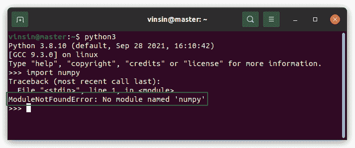
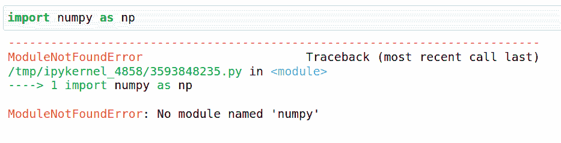
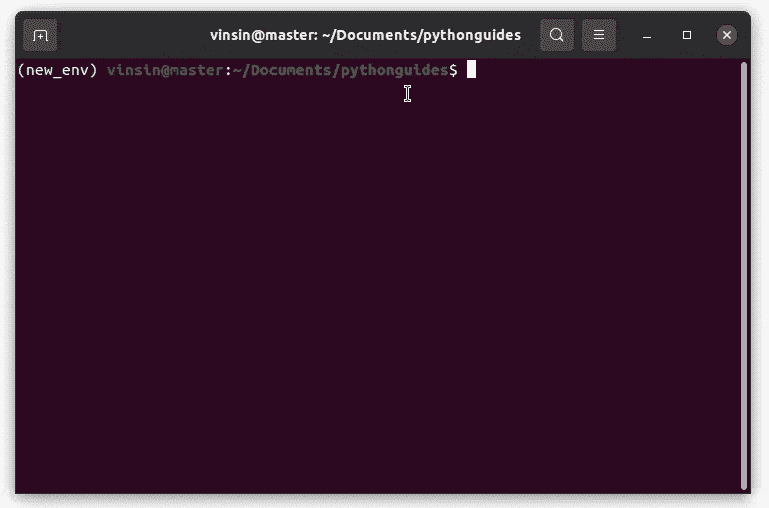
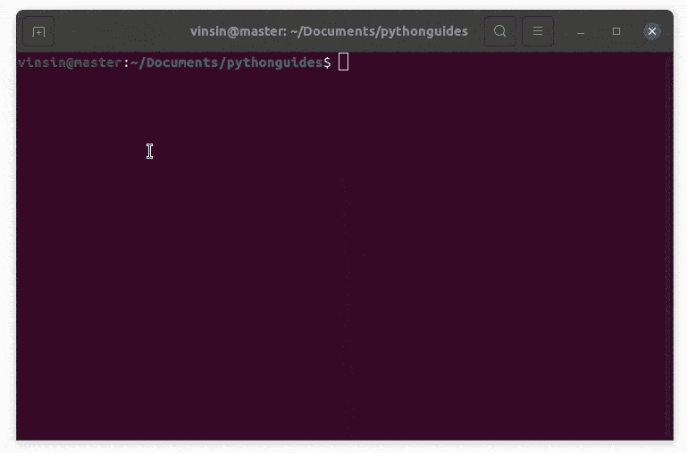
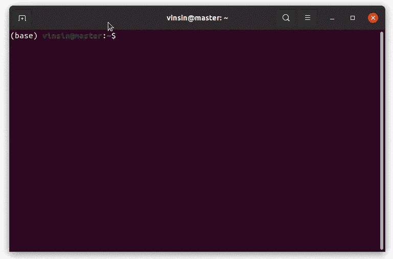
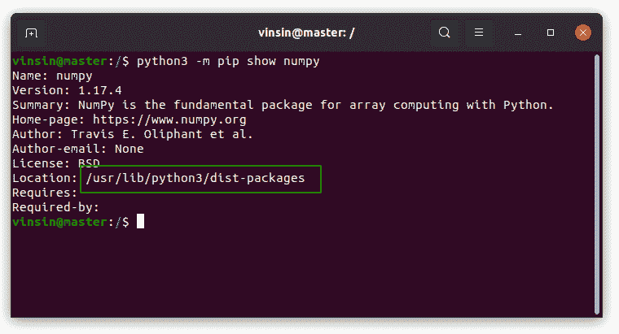
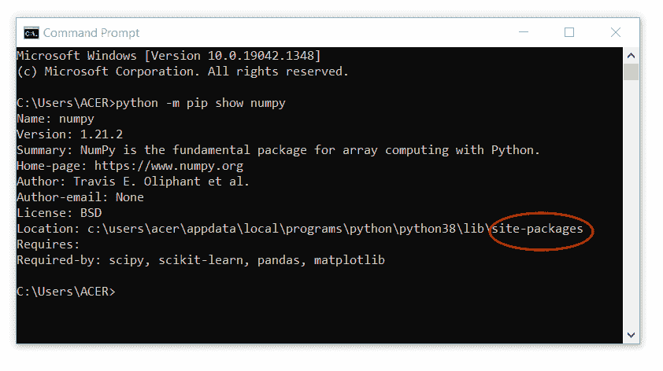
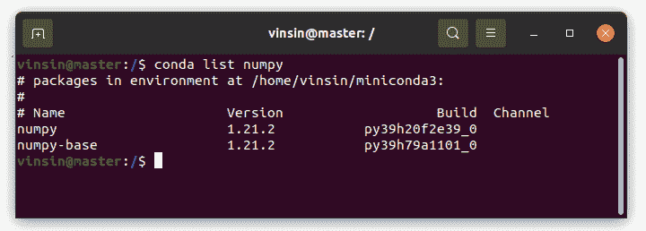
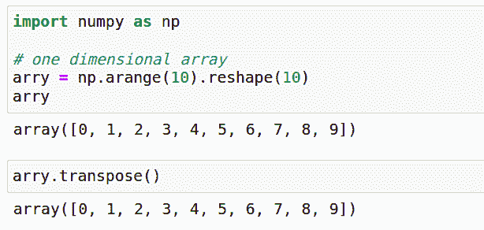
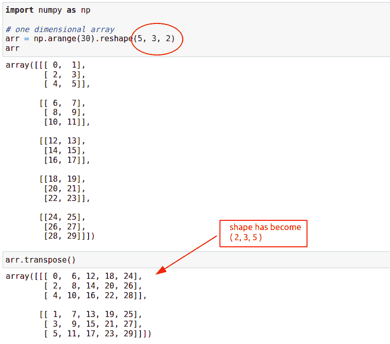

# 找不到 python Numpy–如何修复

> 原文：<https://pythonguides.com/python-numpy-not-found/>

[](https://sharepointsky.teachable.com/p/python-and-machine-learning-training-course)

在这个 [Python NumPy 教程](https://pythonguides.com/numpy/)中，我们将学习如何修复 **python NumPy 未找到**错误。此外，我们将涵盖这些主题。

*   未找到 Python Numpy
*   找不到 Ubuntu Python 编号
*   找不到 Anaconda Python 编号
*   未找到 Vscode Python 编号
*   找不到 Python Numpy dll
*   Python Numpy 包含路径-未找到
*   Python 导入数字不起作用
*   Python Numpy 转置不起作用

有时，错误如下所示:



Python Numpy Not Found

目录

[](#)

*   [未找到 Python 编号](#Python_Numpy_Not_Found "Python Numpy Not Found")
*   [未找到 Ubuntu Python Numpy】](#Ubuntu_Python_Numpy_Not_Found "Ubuntu Python Numpy Not Found")
*   [未找到蟒蛇巨蟒编号](#Anaconda_Python_Numpy_Not_Found "Anaconda Python Numpy Not Found")
*   [未找到 Vscode Python 编号](#Vscode_Python_Numpy_Not_found "Vscode Python Numpy Not found")
*   [Python Numpy dll 未找到](#Python_Numpy_dll_Not_Found "Python Numpy dll Not Found")
*   [Python Numpy 包含路径-未找到](#Python_Numpy_Include_Path-Not_Found "Python Numpy Include Path-Not Found")
*   [Python 导入数字不工作](#Python_Import_Numpy_Not_Working "Python Import Numpy Not Working")
*   [Python Numpy 转置不起作用](#Python_Numpy_Transpose_Not_Working "Python Numpy Transpose Not Working")

## 未找到 Python 编号

在本节中，我们将学习修复错误 **Python NumPy 未找到或没有名为‘NumPy’**的模块。



Python Numpy Not found

*   当模块未安装在当前工作环境中时，未找到 Python numpy 或未出现名为“numpy”的模块错误。
*   使用 `pip` 或 `conda` 安装模块以解决此问题。但是请确保您已经在当前的工作环境中安装了它。

```py
**# installation using pip**
pip install numpy

**# installation using conda**
conda install numpy
```

*   即使在 jupyter 笔记本上工作，您也可以安装 numpy 模块。在 jupyter 笔记本上使用下面的语法，并在导入 numpy 模块之前运行它。

```py
 !pip install numpy

# or

!conda install numpy
```

在下面的实现中，当我们试图访问 numpy 模块`import numpy`时，它抛出了一个错误**没有名为‘numpy’**的模块。然后，我们已经安装了模块使用画中画现在它没有任何错误。



Python Numpy Not Found

读取[检查 Python 中的 NumPy 数组是否为空](https://pythonguides.com/check-if-numpy-array-is-empty/)

## 未找到 Ubuntu Python Numpy】

在这一节中，我们将学习如何修复在 Ubuntu 操作系统中找不到的错误 python numpy。

*   Ubuntu 是一个基于 linux 的操作系统，它的文件系统不同于 windows 操作系统。
*   但是使用 `pip` 或 `conda` 我们可以弥合这种差异，并且可以在任何操作系统(Linux、Windows、macOS)上独立使用 numpy。
*   使用 Ubuntu 机器中的 apt 包管理器，我们可以安装 numpy。下面是这样做的命令。

```py
sudo apt install python3-numpy
```

*   请注意，这个命令将在默认情况下可以访问的系统上安装 numpy。但是如果你创造了一个新的环境，它就不起作用了。停用该环境或在该环境上安装 numpy 以访问 numpy。
*   在下面的演示中，我们已经在系统上安装了 numpy。然后，我们创建了一个虚拟环境来检查它是否也在那里工作。它不能在新的虚拟环境中工作。



Ubuntu Python Numpy Not Found

读取 [Python NumPy 零](https://pythonguides.com/python-numpy-zeros/)

## 未找到蟒蛇巨蟒编号

在本节中，我们将学习如何修复 anaconda 中的 python NumPy not found 错误。

*   Anaconda 是一个专门用于数据科学模块的包管理和部署软件。
*   anaconda 提供的数据科学软件包兼容 Linux、Macintosh (macOS)和 windows 操作系统。
*   当 anaconda 安装在系统上时，像 jupyter notebbok、pandas、numpy、matplotlib 等基本包已经可用。
*   如果你不想要这些预安装的软件包，那么你可以删除它们或者选择 miniconda3，它是 anaconda 的一个较轻的版本，没有预安装的软件包。
*   在我们的例子中，我们已经演示了如何修复 anaconda python numpy not found 错误或没有名为“numpy”的模块。如果您已经安装了 numpy，但它不工作，请重新安装。
*   下面是从 anaconda 包管理器中卸载 numpy 模块的代码。

```py
conda remove numpy
```

*   下面是在 anaconda 包管理器中安装 numpy 模块的代码。

```py
conda install numpy
```

下面是用 python 在 anaconda 上卸载和安装 numpy 的演示。



Anaconda Python Numpy Not Found Solution

阅读 [Python NumPy 数组](https://pythonguides.com/python-numpy-arange/)

## 未找到 Vscode Python 编号

在本节中，我们将了解如何修复 vscode 中的 Python NumPy not found 错误。

*   通过在 vscode 中安装 numpy 模块扩展，可以修复 vscode 中的 Python Numpy 未找到或未找到模块“Numpy”错误。
*   我们也可以使用 `pip` 或 `conda` 包管理器来解决这个问题。如果你已经安装了模块，仍然出现同样的错误，这意味着必须激活专用环境。
*   使用下面的代码在 vscode 上安装 python numpy。如果您已经安装了它，但无法访问它，那么跳到下一点。

```py
pip install numpy
```

*   在 vscode 中，大多数时候我们忘记检查我们正在工作的环境。vscode 上存在多种环境，如虚拟环境(自行创建)、conda 基本环境、conda 其他环境(如果有)、全局环境等。
*   您可能已经在全局模块上安装了 numpy 模块，但现在您正在自己创建的虚拟环境中工作。
*   除此之外，检查一下你系统中安装的 python 解释器。确保您选择了安装 numpy 时使用的同一解释器。
*   找不到 Vscode Python Numpy 的主要原因有。

阅读 [Python Numpy 阶乘](https://pythonguides.com/python-numpy-factorial/)

## Python Numpy dll 未找到

在本节中，我们将学习如何修复 python numpy dll 未找到错误。

```py
ImportError: DLL load failed while importing path: The specified module could not be found.

or

ImportError: DLL load failed: The specified module could not be found.
```

*   DLL 是由 windows 计算机上的多个程序使用的动态链接库。
*   Python numpy dll 未找到错误可以通过在计算机/环境中重新安装 numpy 来解决。
*   如果问题仍未解决，请下载 [Visual C++可再发行版 Visual Studio 2015](https://www.microsoft.com/en-in/download/details.aspx?id=48145) 。
*   一旦你安装了它，重新启动你的电脑，并尝试再次运行该程序。
*   如果问题仍然存在，请在本博客的评论区留下准确的错误信息。

阅读 [Python NumPy 删除](https://pythonguides.com/python-numpy-delete/)

## Python Numpy 包含路径-未找到

在本节中，我们将学习如何修复 python numpy include path-not-found 错误。本节还将介绍 Python 检查 Numpy——未找到。

*   所有安装的模块都必须放在所有操作系统的 site-packages 文件夹中，以便该模块能够顺利运行。
*   如果在手动安装 numpy 时，您没有将模块放入 windows 机器中的 `site-package` 文件夹以及 linux 和 macOS 中的 `dist-packages` 文件夹，那么可能会出现 python numpy include path not found 错误。
*   此外，您的系统中可能安装了多个版本的 python，在执行程序时可能会选择错误的解释器。这样你也不能访问 numpy 模块。
*   下面我们展示了查看 numpy 模块当前安装路径的方法。

```py
**# using pip**
python -m pip show numpy
```



Python Numpy Installed Path-in-Linux



Python Numpy Installed Path-in-Windows

```py
**# using anaconda**
conda list numpy
```



Python Numpy Installed Path-in-Linux using anaconda

阅读 [Python NumPy Sum](https://pythonguides.com/python-numpy-sum/)

## Python 导入数字不工作

在本节中，我们将学习如何修复 python import numpy 不工作错误。

*   Python import numpy 不工作，这意味着该模块未安装或者该模块已损坏。
*   要修复损坏的模块，请先卸载它，然后重新安装。

```py
# pip users follow these steps

pip uninstall numpy
pip install numpy

# conda users follow these steps
conda remove numpy
conda install numpy
```

*   如果你得到一个错误“没有找到模块”然后使用 `pip` 或 `conda` 包管理器安装模块。

```py
pip install numpy

or 

conda install numpy
```

*   如果你没有使用软件包管理器，想在裸机上安装 numpy，windows 用户可以从这个 **[网站](https://sourceforge.net/projects/numpy/files/NumPy/)** 下载 numpy，linux 或 macOS 用户可以遵循下面的命令。

```py
**# Linux Debian (ubuntu)**
sudo apt install numpy

**# Linux RHEL**
yum install numpy

**# macOS** 
brew install numpy 
```

阅读 [Python NumPy square 示例](https://pythonguides.com/python-numpy-square/)

## Python Numpy 转置不起作用

在本节中，我们将学习如何修复 python numpy transpose 不工作的错误。

*   Transpose 指的是在 python numpy 中改变数组中值的位置。
*   使用 python numpy 中的 **`numpy.transpose()`** 方法我们可以转置一个数组。
*   Python numpy transpose 方法反转数组的形状。假设数组的形状是(5，2，3)，那么在应用转置函数后，它将变成(3，2，5)。
*   如果数组是 1D 的，那么转置方法的效果将不会显示。
*   在我们的例子中，我们已经显示了 1D 和多维数组。

**源代码:**

在这个源代码中，我们使用一维和多维数组执行了 python numpy 转置。

```py
import numpy as np

# one dimensional array
arry = np.arange(10).reshape(10)
arry.transpose()

# multiple dimensional array
arr = np.arange(30).reshape(5, 3, 2)
arr.transpose() 
```

**输出:**

在此输出中，我们演示了一维数组上的转置。当转置方法反转 numpy 数组的形状时，没有观察到任何变化。因为它只有一个形状，所以不能反转。



Python Numpy Transpose with one-dimensional array

在此输出中，创建了一个多维数组，当我们对该数组应用转置方法时，形状从(5，3，2)反转为(2，3，5)。



Python Numpy Transpose with multiple dimensional array

相关 Python NumPy 教程:

*   [Python 绝对值](https://pythonguides.com/python-absolute-value/)
*   [Python NumPy Divide](https://pythonguides.com/python-numpy-divide/)
*   [Python NumPy 添加教程](https://pythonguides.com/python-numpy-add/)
*   [Python NumPy 计数–实用指南](https://pythonguides.com/python-numpy-count/)
*   [Python NumPy 列举示例](https://pythonguides.com/python-numpy-to-list/)
*   [Python NumPy 读取 CSV](https://pythonguides.com/python-numpy-read-csv/)
*   [Python NumPy 日志](https://pythonguides.com/python-numpy-log/)
*   [Python NumPy where with examples](https://pythonguides.com/python-numpy-where/)

在这个 Python 教程中，我们学习了如何修复 **python numpy not found 错误**。此外，我们已经讨论了这些主题。

*   未找到 Python Numpy
*   找不到 Ubuntu Python 编号
*   找不到 Anaconda Python 编号
*   未找到 Vscode Python 编号
*   找不到 Python Numpy dll
*   Python Numpy 包含路径-未找到
*   Python 导入数字不起作用
*   Python Numpy 转置不起作用

[Bijay Kumar](https://pythonguides.com/author/fewlines4biju/)

Python 是美国最流行的语言之一。我从事 Python 工作已经有很长时间了，我在与 Tkinter、Pandas、NumPy、Turtle、Django、Matplotlib、Tensorflow、Scipy、Scikit-Learn 等各种库合作方面拥有专业知识。我有与美国、加拿大、英国、澳大利亚、新西兰等国家的各种客户合作的经验。查看我的个人资料。

[enjoysharepoint.com/](https://enjoysharepoint.com/)[](https://www.facebook.com/fewlines4biju "Facebook")[](https://www.linkedin.com/in/fewlines4biju/ "Linkedin")[](https://twitter.com/fewlines4biju "Twitter")