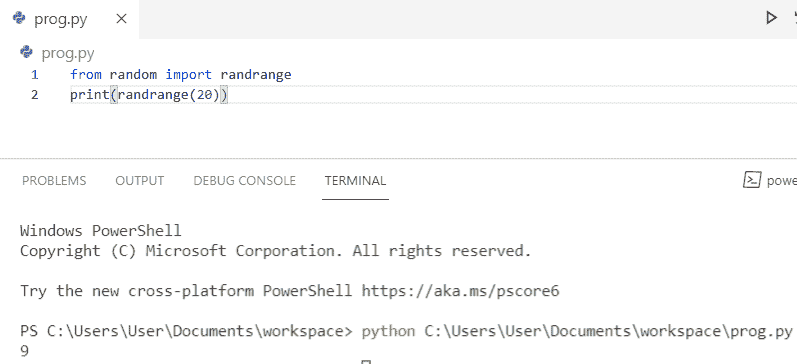
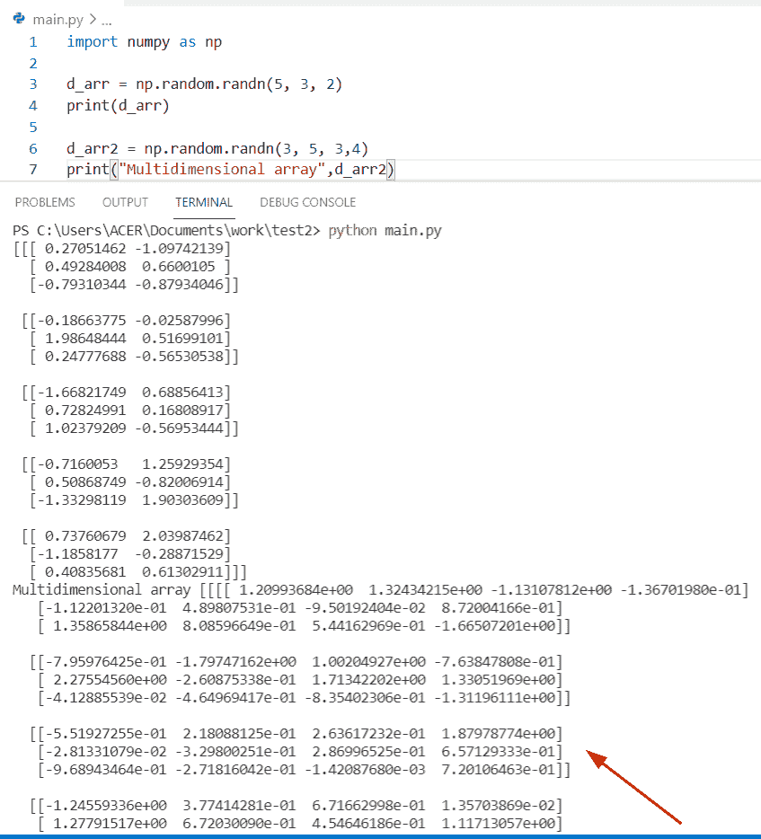
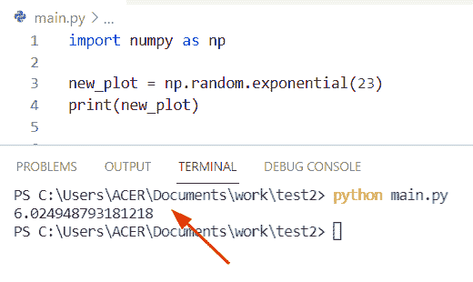
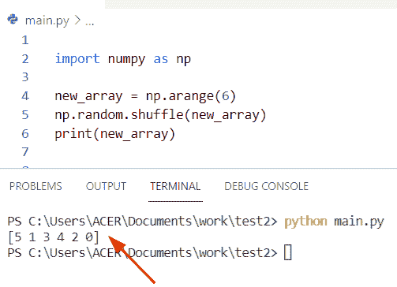

# Python NumPy Random [30 个示例]

> 原文：<https://pythonguides.com/python-numpy-random/>

[](https://sharepointsky.teachable.com/p/python-and-machine-learning-training-course)

在本 [python 教程中，](https://pythonguides.com/python-hello-world-program/)你将了解到 `Python NumPy Random` 。让我们看看如何使用 NumPy 在 Python 中生成随机数。

具体来说，我们将通过示例涵盖以下主题。

*   什么是随机数？
*   Python NumPy 随机数
*   如何在 Python 中生成随机浮点数
*   Python NumPy 随机数组
*   Python NumPy 随机整数
*   如何在 Python 中从数组生成随机数
*   Python NumPy 随机选择
*   Python NumPy random randn
*   Python NumPy 随机样本
*   Python NumPy 随机均匀
*   Python NumPy 范围内的随机数
*   Python NumPy 两个数字之间的随机数
*   0 和 1 之间的 Python NumPy random
*   1 到 10 之间的 python NumPy 随机数
*   Python numpy 随机种子
*   Python numpy 随机选择
*   Python numpy 随机整数
*   Python numpy 随机法线
*   Python numpy 随机均匀
*   Python numpy 随机样本
*   Python numpy random randn
*   Python numpy 随机数生成器
*   Python numpy 随机指数
*   Python numpy.random.randomstate
*   Python numpy 随机排列
*   Python numpy 随机洗牌
*   Python numpy 随机二项式

目录

[](#)

*   [python numpy 中的随机数是什么？](#What_is_random_number_in_python_numpy "What is random number in python numpy?")
*   [Python numpy random](#Python_numpy_random "Python numpy random")
*   [Python numpy 随机数](#Python_numpy_random_number "Python numpy random number")
*   [Python 生成一个随机浮点数](#Python_generate_a_random_float "Python generate a random float")
*   [Python NumPy 随机数组](#Python_NumPy_random_array "Python NumPy random array")
*   [Python NumPy 随机整数](#Python_NumPy_random_integer "Python NumPy random integer")
*   [Python 从数组中生成一个随机数](#Python_generate_a_random_number_from_an_array "Python generate a random number from an array")
*   [Python numpy 随机选择](#Python_numpy_random_choice "Python numpy random choice")
*   [Python NumPy random randn](#Python_NumPy_random_randn "Python NumPy random randn")
*   [Python NumPy 随机样本](#Python_NumPy_random_sample "Python NumPy random sample")
*   [Python NumPy 随机均匀](#Python_NumPy_random_uniform "Python NumPy random uniform")
*   [Python NumPy 范围内的随机数](#Python_NumPy_random_number_in_range "Python NumPy random number in range")
*   [Python NumPy 两数之间随机](#Python_NumPy_random_between_two_numbers "Python NumPy random between two numbers")
*   [Python NumPy 在 0 和 1 之间随机](#Python_NumPy_random_between_0_and_1 "Python NumPy random between 0 and 1")
*   [Python Numpy 1 到 10 之间的随机数](#Python_Numpy_random_number_between_1_and_10 "Python Numpy random number between 1 and 10")
*   [Python numpy 随机种子](#Python_numpy_random_seed "Python numpy random seed")
*   [Python numpy 随机选择](#Python_numpy_random_choice-2 "Python numpy random choice")
*   [另一个使用 random choice()函数生成统一样本的例子](#Another_example_to_generate_a_uniform_sample_by_using_the_random_choice_function "Another example to generate a uniform sample by using the random choice() function")
*   [Python numpy 随机整数](#Python_numpy_random_integer "Python numpy random integer")
*   [Python numpy 随机正常](#Python_numpy_random_normal "Python numpy random normal")
*   [检查如何在 Python 中使用随机正态函数的另一种方法](#Another_way_to_check_how_to_use_the_random_normal_functions_in_Python "Another way to check how to use the random normal functions in Python")
*   [Python numpy 随机均匀](#Python_numpy_random_uniform "Python numpy random uniform")
*   [检查如何在 Python 中实现 numpy 随机统一函数的替代方法](#Alternative_way_to_check_how_to_implement_numpy_random_uniform_function_in_Python "Alternative way to check how to implement numpy random uniform function in Python")
*   [Python numpy 随机样本](#Python_numpy_random_sample "Python numpy random sample")
*   [Python numpy random randn](#Python_numpy_random_randn "Python numpy random randn")
*   [Python numpy 随机数生成器](#Python_numpy_random_number_generator "Python numpy random number generator")
*   [Python numpy 随机指数](#Python_numpy_random_exponential "Python numpy random exponential")
*   [Python numpy random . random state](#Python_numpy_randomrandomstate "Python numpy random.randomstate")
*   [Python numpy 随机排列](#Python_numpy_random_permutation "Python numpy random permutation")
*   [Python numpy 随机洗牌](#Python_numpy_random_shuffle "Python numpy random shuffle")
*   [Python numpy 随机二项式](#Python_numpy_random_binomial "Python numpy random binomial")

## python numpy 中的随机数是什么？

**随机数**是返回随机整数的数字。随机数并不意味着每次都是不同的数字。随机是指逻辑上无法预测的事情。

阅读:[Python 中的 NumPy 是什么](https://pythonguides.com/numpy/)

## Python numpy random

*   在 Python 中，random 是 NumPy 库中可用的一个模块。这个模块返回一个指定形状的数组，并用随机的浮点数和整数填充它。
*   它基于伪随机数生成，这意味着它是一种生成一系列近似随机数的数学方法
*   基本上，它是一个位生成器和一个生成器的组合。在 Python 中，随机值是由生成器生成的，并且起源于位生成器。

**语法:**

下面是 NumPy random 的语法

```py
numpy.random.random(size=None)
```

*   它只包含一个参数
    *   **大小:**默认为无
    *   **Return:** 在 Python 中，它总是返回一个介于下限和上限之间的随机整数或浮点数。

**例子:**

让我们举一个例子，看看如何在 Python 中实现随机数

```py
import random
import numpy as np

result = np.random.randint(4)
print(result)
```

首先在上面的代码中，我们将从 NumPy 库中导入一个随机模块。之后，我创建了一个名为**‘result’**的变量，并赋予了一个 **np。random()** 函数，并生成一个整数数字**‘4’。**现在使用 print 语句来检查哪个数字将显示在输出中。

下面是以下给定代码的执行过程


Python numpy random

## Python numpy 随机数

*   这里我们可以看到如何在 numpy Python 中**生成一个随机数。**
*   为了在 Python 中获得随机数，我们可以很容易地使用 `randint()` 函数。
*   在 Python 中，numpy 库提供了一个名为 random 的模块，帮助用户生成一个随机数。
*   在 Python 中， `randint()` 函数总是返回一个介于下限和上限之间的随机整数。这两个限制都是 randint()函数的参数。

**语法:**

下面是 `randint()` 函数的语法

```py
random.randint
             (
             low,
             high=None,
             size=None,
             dtype=int
             )
```

*   它由几个参数组成
    *   **低:**建立起始范围，仅取整数值作为参数。
    *   **高:**可选参数，显示从分布中抽取的整数。
    *   **dtype:** 默认情况下其值为 int。
    *   **Out:** 它解释了区间的结束。

**举例:**

让我们举一个例子，看看如何在 Python numpy 中获得一个随机数

**源代码:**

```py
import random
import numpy as np

new_out= random.randint(2,6)
print(new_out)
```

在上面的代码中，我们将首先导入一个随机模块，然后使用 `randint()` 函数，并使用 print 命令显示输出，它将显示 **2 到 6 之间的数字。**如你所见，我的输出随机数是**‘5’。**

下面是以下代码的截图


Python numpy random number

让我们看另一个例子，如何在 python NumPy 中**获得一个随机数。我们可以使用 NumPy randint()方法在 Python 中生成一个随机数。**

```py
from numpy import random
val = random.randint(50)
print(val)
```

你可以参考下面的截图来看看 **Python numpy 随机数**的输出。


Python numpy random number

阅读: [Python NumPy 数组](https://pythonguides.com/python-numpy-array/)

## Python 生成一个随机浮点数

现在，我们将看到**如何在 python** 中生成随机浮点数。我们可以使用 `Python NumPy rand()` 方法**在 Python** 中生成一个随机的浮点数。

```py
from numpy import random
val = random.rand()
print(val)
```

你可以参考下面的截图来看看 **Python 生成一个随机浮动**的输出。


Python generates a random float

阅读: [Python NumPy Sum](https://pythonguides.com/python-numpy-sum/)

## Python NumPy 随机数组

让我们看看，如何在 Python 中使用 **Python numpy 随机数组**。我们可以在 NumPy 中使用带有 Size 参数的 randint()方法在 Python 中创建一个随机数组。

```py
from numpy import random
val = random.randint(50, size=(5))
print(val)
```

你可以参考下面的截图来看看 **Python numpy 随机数组**的输出。


Python numpy random array

阅读: [Python 程序打印数组中的元素](https://pythonguides.com/python-program-to-print-element-in-an-array/)

## Python NumPy 随机整数

在这里，我们将看到 **Python numpy 随机整数**。下面的代码，我们可以使用下面的代码在 Python NumPy 中创建一个随机整数。

```py
from random import randrange
print(randrange(20))
```

你可以参考下面的截图来看看 **Python numpy 随机整数**的输出。



Python numpy random integer

## Python 从数组中生成一个随机数

让我们看看**如何在 python 中从数组**生成随机数。

```py
from numpy import random
val = random.choice([3, 5, 7, 9])
print(val)
```

你可以参考下面的截图来看看 **Python 从数组**生成随机数的输出


Python generates a random number from the array

上面的代码，我们可以用 Python NumPy 从一个数组中创建一个随机数。

阅读: [Python 串联数组](https://pythonguides.com/python-concatenate-arrays/)

## Python numpy 随机选择

现在，我们将看到 **Python numpy 随机选择**。

```py
import numpy as np
randm_num = np.random.choice(18)
print( "The random choice number : ")
print( randm_num )
```

你可以参考下面的截图来看看 **Python numpy 随机选择**的输出


Python numpy random choice

## Python NumPy random randn

现在，我们将看到 `Python numpy random randn` ，一个使用 Python randn()方法创建随机数的例子。

```py
import numpy as np

random_num = np.random.randn(4)
print(random_num)
```

你可以参考下面的截图来看看 `Python numpy random randn` 的输出。


Python NumPy random randn

阅读: [Python Tkinter 网格](https://pythonguides.com/python-tkinter-grid/)

## Python NumPy 随机样本

`numpy.random.sample` ()是 Python NumPy 中进行随机采样的函数之一。使用。随机抽样()方法。下面是一个随机样本的例子:

```py
import numpy as np

random_num = np.random.random_sample(4)
print(random_num)
```

您可以参考下面的截图来查看 **Python numpy 随机样本**的输出。


Python NumPy random sample

## Python NumPy 随机均匀

现在，我们将使用 `Python NumPy random uniform` ，它创建一个填充了数值的 NumPy **数组。其中大小=0，下限=1，上限=10。这些数值是从由低到高指定的指定范围内提取的。**

```py
import numpy as np

random_num = np.random.uniform(0,1,10)
print(random_num)
```

你可以参考下面的截图来看看 **Python numpy 随机均匀**的输出。


Python NumPy random uniform

阅读: [Python Tkinter 选项菜单](https://pythonguides.com/python-tkinter-optionmenu/)

## Python NumPy 范围内的随机数

**Python NumPy 范围内的随机数**是一个可以使用 randint()函数生成随机整数的函数。它需要三个参数。现在让我们举一个(3，8)之间的随机范围的例子。

```py
import numpy as np

random_num = np.random.randint(3,size=8)
print(random_num)
```

您可以参考下面的截图，查看 `Python numpy random** `数在**范围内的输出


Python NumPy random number in the range

## Python NumPy 两数之间随机

`Python NumPy random` 是 random 模块的一个函数，用于生成介于低和高之间的 np.int 类型的随机整数，其中 3 是较低值，8 是较高值，大小是 10。

```py
import numpy as np

random_num = np.random.randint(3,size=(8,10))
print(random_num)
```

你可以参考下面的截图来看看两个数之间的`Python numpy random`T2 的输出


Python NumPy random between two numbers

阅读:[在 Python 中把字符串转换成浮点数](https://pythonguides.com/convert-string-to-float-in-python/)

## Python NumPy 在 0 和 1 之间随机

在这个例子中，我们将使用 **NumPy np.random.seed()函数**来显示 0 和 1 之间的随机数。

Random(3)指定 0 和 1 之间的随机数是关键字的大小。Np.random.seed(number)设置 NumPy 所谓的全局随机种子。

```py
import numpy as np 
np.random.seed(32)
random_num = np.random.random(3)
print(random_num)
```

你可以用上面的代码进行`Python NumPy random`0 到 1 之间的**。**

## Python Numpy 1 到 10 之间的随机数

在本例中，我们将使用 `NumPy randint()` 函数生成一个介于 1 和 10 之间的随机数。

```py
import numpy as np
random_num = np.random.randint(1,10)
print(random_num)
```

上面的 Python 代码，我们可以用 1 到 10 之间的为 **Python NumPy 随机。**

## Python numpy 随机种子

*   让我们看看如何在 Python 中使用 numpy 随机种子。
*   Numpy 随机种子用于设置种子并生成伪随机数。伪随机数是对随机进行排序的数字，但它们并不是真正的随机。
*   在 Python 中，种子值是生成器实现的前一个数值。如果第一次没有先前的值，则使用工作系统时间。
*   随机种子背后的主要逻辑是为给定的种子获得相同的随机数集。

**语法:**

下面是 numpy 随机种子的语法

```py
random.seed
           (
            self,
            seed=None
           )
```

**例子:**

这里我们将看到如何使用相同的种子值来执行随机数

```py
import random
import numpy as np
np.random.seed(5)
new_val = np.random.randint(2,6)
print(new_val)
```

在这个例子中，我们使用了**随机数。seed()** 函数并传递**‘5**’作为参数。之后，我在 **2 到 6 之间生成一个随机数。**

下面是以下给定代码的实现


Python numpy random seed

## Python numpy 随机选择

*   在 Python 中要生成一个随机样本，我们可以使用 **random 的概念。选择()。**该功能在 numpy 库中可用。
*   该函数通常用于数据科学和数据分析。
*   该方法接受四个参数并返回数组的随机样本。随机样本在数据相关领域非常有用。

**语法:**

下面是 numpy 随机选择的语法

```py
numpy.choice(
             a,
             size=None,
             replace=True,
             p=None
            )
```

*   它由几个参数组成:
    *   **a:** numpy 数组，它包含数字。
    *   **Size:** 默认情况下其值为 None，输出数组形状。
    *   **替换:**默认为真，一个值可以多次选择。

**举例:**

让我们举一个例子，看看如何使用 random choice()函数生成一个随机样本

```py
import numpy as np

new_rand = np.random.choice(15, 2)
print(new_rand) 
```

下面是以下给定代码的输出


Python numpy random choice

## 另一个使用 random choice()函数生成统一样本的例子

**源代码:**

```py
 import numpy as np
import matplotlib.pyplot as plt

new_samp = np.random.choice(16, 3000)

num, b, i = plt.hist(new_samp, 21, density = True)
plt.show()
```

下面是以下给定代码的输出


Python numpy random choice sample

## Python numpy 随机整数

*   让我们看看如何在 Python numpy 中生成随机整数。
*   为了创建随机整数，我们可以很容易地使用 `randint()` 函数。这个函数返回一个指定的形状，它接受三个参数范围的上限和下限。
*   来自指定数据类型的离散一致的随机整数。

**语法:**

```py
random.randint(
               low,
               high=None,
               size=None,
               dtype=int
              )
```

**举例:**

让我们举一个例子，看看如何在 Python numpy 中使用随机整数

```py
import numpy as np

res_new = np.random.randint(low = 0, high = 4, size = 6)
print(res_new) 
```

在上面的代码中，我们首先导入 numpy 库，然后使用 np。随机()函数。之后，我们将 **low、high 和 size** 变量作为参数传递。

下面是以下给定代码的执行过程


Python numpy random integer

## Python numpy 随机正常

*   这里我们可以看到如何在 Python numpy 中应用 normal random。
*   在这个例子中，我们可以应用 numpy random `normal()` 函数的概念。此函数使您能够声明一个存储正态分布数据的 numpy 数组。
*   正态分布因其形状和大小也称为曲线，这些分布可用于数据分析，也是高斯分布的一部分。

**语法:**

下面是 random normal()的语法

```py
random.normal
             (
              loc=0.0,
              Scale=1.0,
              size=None
             )
```

*   它由几个参数组成:
    *   **loc:** 可选参数，默认为 `0.0` ，代表分布的均值。
    *   **标度:**该参数指定分布的标准差，默认为 `1` ，必须为非负。
    *   **Size:** 该参数指定给定数组的形状，数组可以是**一维、二维或多维。**

**例子:**

这里我们将讨论如何在 Python 中实现一个随机正态函数

```py
import numpy as np

new_res= np.random.normal(size = 4)

print(new_res)
```

在上面的代码中，我们将首先导入一个 numpy 库，然后我们将使用 `random.normal()` 函数的概念以及 `size=4` 作为参数，输出将显示为大小为 **5 的数组。**

下面是以下给定代码的执行过程


Python numpy random normal

## 检查如何在 Python 中使用随机正态函数的另一种方法

**源代码:**

```py
import numpy as np

from matplotlib import pyplot as plt

new_out = np.random.normal( size = 300 )

print( new_out )
num,x,y = plt.hist( new_out, 40)
plt.show()
```

这里我们会用到 random 模块的 `normal()` 方法。现在我想显示 normal()函数中的 300 个随机样本数，并将 `size=300` 作为参数传递。在这个例子中，我还将使用 `matplotlib` 包在绘图中显示随机样本。

**输出:**


Python numpy random normal matplotlib


Python numpy random normal matplotlib graph

如您所见，输出样本数分布呈钟形曲线

## Python numpy 随机均匀

*   让我们看看如何在 Python 中使用 numpy 随机均匀。
*   numpy 随机均匀函数创建均匀分布的值，并通过使用该函数将随机样本作为数组返回。在 Python 中，均匀分布意味着它是一种概率，prob 总是给出不同的结果。
*   在这个方法中，有一个范围，我们可以用低和高来声明。

**语法:**

下面是 numpy 随机统一的语法

```py
random.uniform
              (
               low=0.0,
               high=1.0,
               size=None
              )
```

*   它由几个参数组成。
    *   **下限:**该参数是范围的起点，默认为 0，大于等于下限。
    *   **上限:**该参数是范围的端点，结果值将小于上限，默认情况下，其值为 **1.0。**
    *   **Size:** 该参数指定给定数组的形状。

**举例:**

```py
import numpy as np

new_result = np.random.uniform(0, 6, size=3)
print(new_result)
```

下面是以下给定代码的执行过程


Python numpy random uniform

## 检查如何在 Python 中实现 numpy 随机统一函数的替代方法

**源代码:**

```py
import numpy as np
import matplotlib.pyplot as plt

new_val = np.random.uniform(-4, 4, 3000)

plt.hist(new_val, bins = 40, density = True)
plt.show()
```

在这个例子中，我们可以使用 np。 `random.uniform()` 从分布值中获取随机样本的方法。

下面是以下代码的截图


## Python numpy 随机样本

*   这里我们可以用 Python 生成一个 numpy 随机样本。
*   在 Python 中，numpy 模块提供了一个 np.random.sample()函数，用于在数组中进行随机采样。此方法将随机浮点值的范围指定为一维数组。
*   它总是返回一个在**【0.0，1.0】范围内的随机浮点数组。**

**语法:**

下面是 numpy 随机样本的语法

```py
numpy.random.sample(
                    size=None
                   )
```

**源代码:**

```py
import numpy as np

new_res_arr = np.random.sample(size =(2, 2))
print (new_res_arr)
```

在上面的代码中，我们生成了一个**随机数。sample()** 函数，其中我们将传递大小 **(2，2)** 作为参数。

**输出:**


Python numpy random sample

## Python numpy random randn

*   让我们看看如何在 Python 中使用 Numpy random randn()函数。
*   在 Python 中， `random randn()` 方法创建一个 numpy 数组并返回一个样本分布。这个方法采用数组的形式并用随机值填充它。
*   该函数返回具有浮点值的分布平均值中的所有值。

**语法:**

下面是 numpy random randn()函数的语法

```py
numpy.random.randn(d0,d1,....dn)
```

这里 **do，d1，…dn** 这些是可选参数，如果没有给定参数，它将检查条件，返回一个浮点数。数组的维数必须是非负的。这个函数生成一个用浮点值填充的形状。

**例子:**

让我们举一个例子，看看如何在 Python 中使用 numpy random randn()函数

```py
import numpy as np

new_arr = np.random.randn(2, 3)
print(new_arr)
```

下面是以下给定代码的执行过程


Python numpy random randn

正如您在输出中看到的，这些值是浮点形式的

另一个使用 random randn()函数创建三维数组的例子

**源代码:**

```py
import numpy as np

d_arr = np.random.randn(5, 3, 2)
print(d_arr)

d_arr2 = np.random.randn(3, 5, 3,4)
print("Multidimensional array",d_arr2) 
```

您可以参考下面的截图来查看输出



Python numpy random randn

## Python numpy 随机数生成器

*   在 Python 中，生成器提供了进入大范围正态分布的入口，并被替换为随机状态。
*   这是一种数学方法，它生成一个近乎随机数的序列，生成器依靠一个附加的位生成器来控制随机位数。在 Python 中，随机值是由生成器生成的，并且起源于一个位生成器。

**语法:**

下面是 numpy 随机生成器的语法

```py
numpy.random.default_rng()
```

**注意:**默认情况下，位生成器接受一个值 `(PCG64)` ，如果你想初始化位生成器，那么使用其中的种子参数，它将返回初始化的生成器对象。

**举例:**

```py
import numpy as np

gen_new = np.random.default_rng(4567)
print(gen_new)
new_val = gen_new.random()
print(new_val)
```

下面是以下给定代码的执行过程


Python numpy random number generator

## Python numpy 随机指数

*   这里我们可以看到如何在 Python 中生成指数随机样本。
*   在 Python 中，指数分布可以获取样本并返回 numpy 数组。

概率密度函数为

```py
 f(x;1/β)= 1/βexp(-x/β)
```

**注:** x > 0，β是速率参数λ=1/β的倒数

语法:

下面是 numpy 随机**指数**的语法

```py
random.exponential(
                   scale=1.0,
                   size=None
                  )
```

示例:

这里我们将使用**随机指数()**方法生成一个指数分布的随机样本

```py
import numpy as np

new_plot = np.random.exponential(23)
print(new_plot)
```

**输出:**



Python numpy random exponential method

## Python numpy random . random state

*   这里我们将看到如何访问 numpy random 模块中的 randomstate 方法。
*   在 Python 中，randomstate 为随机生成器提供种子，并用于继承播种算法，当前使用 **randomstate()的方法重置 `MT19937` 的状态。**

**语法:**

以下是给定代码的语法

```py
numpy.random.randomstate(
                         seed=None
                        )
```

在这个函数中，seed 参数初始化伪数字生成器，可以是一个整数。

示例:

```py
import numpy as np

new_plot = np.random.RandomState(4)
print(new_plot) 
```

下面是以下给定代码的实现


Python numpy randomstate

## Python numpy 随机排列

*   让我们看看如何在 Python 中使用 numpy 置换。这个方法随机生成一个序列，并在 Python 中得到一个随机排列的范围。
*   如果 x 是多维 numpy 数组，并且它与第一个索引混合。

**语法:**

下面是 numpy 随机排列的语法

```py
random.permutation(x)
```

**注意:**这里 x 是一个整数值，它随机置换并且总是返回随机序列数组范围。

**NP 的例子**。随机排列

```py
import numpy as np

new_output = np.random.permutation(6)
print(new_output)
```

先在上面的代码中，我们将输入 x 取为**‘6’。**之后使用 `random.permutation()` 函数，得到随机序列值。

下面是以下给定代码的执行过程


Python numpy random permutation

## Python numpy 随机洗牌

*   这里我们可以看到如何在 Python 中使用 numpy 随机洗牌。
*   在 Python 中，shuffle 意味着排列对象，这个方法将帮助用户修改 Numpy 数组中元素的位置。
*   在这个例子中，我们将随机打乱数组中的所有值。

**语法:**

下面是 numpy 随机洗牌的语法

```py
np.random.shuffle
```

**注意:**这里 X 是数组或修改序列，它将返回混洗后的数组。

**源代码:**

```py
 import numpy as np

new_array = np.arange(6)
np.random.shuffle(new_array)
print(new_array) 
```

在这个例子中，我们使用了 numpy 函数 np.arange()。在 Python 中，np.arange()方法创建一个 ndarray，其值在间隔或给定限制内。之后，我们使用随机洗牌函数，并将“new_array”变量作为参数传递，并打印结果。

**输出:**



Python numpy random shuffle

## Python numpy 随机二项式

*   让我们看看如何在 numpy Python 中使用随机二项式函数。
*   在 Python 中，二项式变量是固定的试验次数，它返回两个结果。随机样本是从具有给定自变量的分布中抽取的。

**语法:**

```py
np.random.binomial(
                   n,
                   p,
                   size=None
                  )
```

*   它由几个参数组成
    *   **n:** 试验次数和分配值大于等于 0。
    *   **p:** 该参数范围在 **> =0 到< =1** 之间
    *   **大小:**默认为无。

**源代码:**

```py
import numpy as np
import random

arr = np.random.binomial(n=8, p=0.5, size=15)
print(arr) 
```

下面是以下给定代码的实现


Python numpy random binomial

您可能会喜欢以下 Python 教程:

*   [将 float 转换为 int Python + Examples](https://pythonguides.com/convert-float-to-int-python/)
*   [Python NumPy 零](https://pythonguides.com/python-numpy-zeros/)
*   [Python NumPy 3d 数组](https://pythonguides.com/python-numpy-3d-array/)
*   [PdfFileMerger Python 示例](https://pythonguides.com/pdffilemerger-python-examples/)
*   [追加到字符串 Python +示例](https://pythonguides.com/append-to-a-string-python/)
*   [将字符串添加到 Python +示例列表中](https://pythonguides.com/add-string-to-list-python/)
*   [Python zip()函数示例](https://pythonguides.com/python-zip/)
*   [检查 Python 中的 NumPy 数组是否为空](https://pythonguides.com/check-if-numpy-array-is-empty/)

在本 Python 教程中，我们学习了关于 `Python NumPy Random` 的示例:

*   Python NumPy 随机数
*   Python 生成一个随机浮点数
*   Python NumPy 随机数组
*   Python NumPy 随机整数
*   Python 从数组中生成一个随机数
*   Python NumPy 随机选择
*   Python NumPy random randn
*   Python NumPy 随机样本
*   Python NumPy 随机均匀
*   Python NumPy 范围内的随机数
*   Python NumPy 两个数字之间的随机数
*   0 和 1 之间的 Python NumPy random
*   1 到 10 之间的 python NumPy 随机数
*   Python numpy 随机种子
*   Python numpy 随机选择
*   Python numpy 随机整数
*   Python numpy 随机法线
*   Python numpy 随机均匀
*   Python numpy 随机样本
*   Python numpy random randn
*   Python numpy 随机数生成器
*   Python numpy 随机指数
*   Python numpy.random.randomstate
*   Python numpy 随机排列
*   Python numpy 随机洗牌
*   Python numpy 随机二项式

[Bijay Kumar](https://pythonguides.com/author/fewlines4biju/)

Python 是美国最流行的语言之一。我从事 Python 工作已经有很长时间了，我在与 Tkinter、Pandas、NumPy、Turtle、Django、Matplotlib、Tensorflow、Scipy、Scikit-Learn 等各种库合作方面拥有专业知识。我有与美国、加拿大、英国、澳大利亚、新西兰等国家的各种客户合作的经验。查看我的个人资料。

[enjoysharepoint.com/](https://enjoysharepoint.com/)[](https://www.facebook.com/fewlines4biju "Facebook")[](https://www.linkedin.com/in/fewlines4biju/ "Linkedin")[](https://twitter.com/fewlines4biju "Twitter")