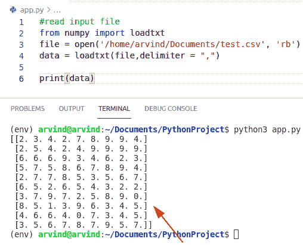
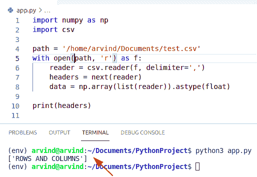
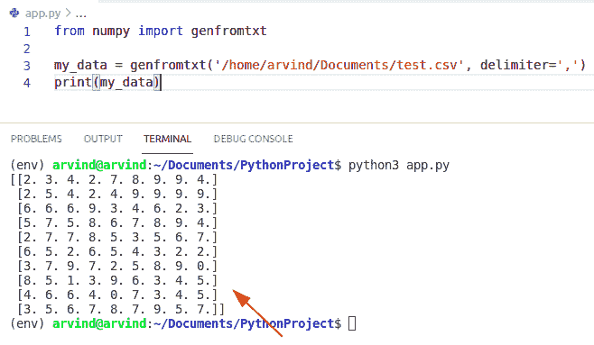
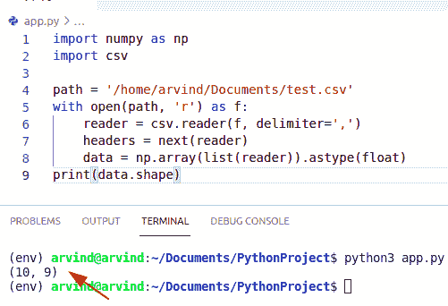
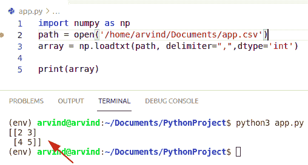
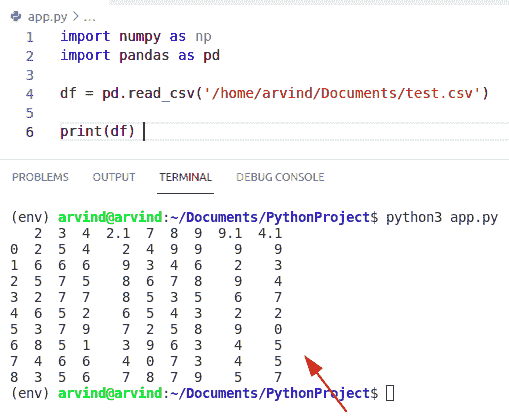
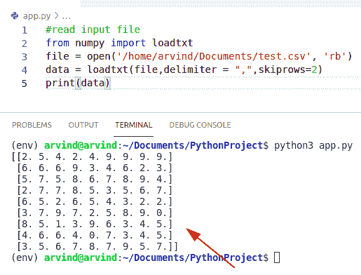
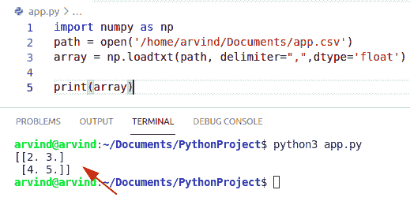
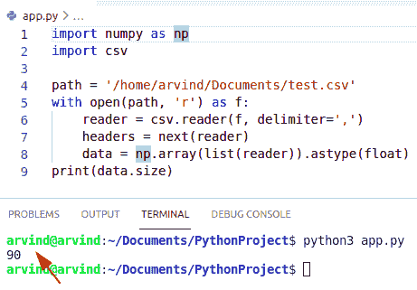

# Python NumPy 读取 CSV

> 原文：<https://pythonguides.com/python-numpy-read-csv/>

[](https://sharepointsky.teachable.com/p/python-and-machine-learning-training-course)

在本 [Python NumPy 教程](https://pythonguides.com/numpy/)中，我们将讨论 `Python NumPy read CSV` ，我们还将涵盖以下示例:

*   Python NumPy 读取带标题的 CSV
*   Python NumPy 读取 CSV 文件
*   Python NumPy 读取 CSV 形状
*   Python NumPy 将 CSV 读入 2d NumPy 数组
*   Python NumPy 读 CSV 熊猫
*   Python NumPy 读取 CSV skip_rows
*   Python NumPy 读取 CSV 数据类型
*   Python NumPy 读取 CSV 大小

目录

[](#)

*   [Python NumPy 读取 CSV](#Python_NumPy_read_CSV "Python NumPy read CSV")
*   [Python NumPy 读取带头的 CSV 文件](#Python_NumPy_read_CSV_with_header "Python NumPy read CSV with header")
*   [Python NumPy 读取 CSV 文件](#Python_NumPy_read_CSV_file "Python NumPy read CSV file")
*   [Python NumPy 读取 CSV 形状](#Python_NumPy_read_CSV_Shape "Python NumPy read CSV Shape")
*   [Python NumPy 将 CSV 读入 2d NumPy 数组](#Python_NumPy_read_CSV_into_2d_NumPy_array "Python NumPy read CSV into 2d NumPy array")
*   [Python NumPy 读 CSV 熊猫](#Python_NumPy_read_CSV_pandas "Python NumPy read CSV pandas")
*   [Python NumPy 读取 CSV skip_rows](#Python_NumPy_read_CSV_skip_rows "Python NumPy read CSV skip_rows")
*   [Python NumPy 读取 CSV 数据类型](#Python_NumPy_read_CSV_Data_type "Python NumPy read CSV Data type")
*   [Python NumPy 读取 CSV 大小](#Python_NumPy_read_CSV_Size "Python NumPy read CSV Size")

## Python NumPy 读取 CSV

*   CSV 基本上代表公共分离值。它用于在电子表格或数据库中存储表格数据。
*   现在，文件的每一行被称为一个记录，每个记录由逗号分隔的文件组成，逗号也称为分隔符。
*   文本文件的每个记录也是该文件的一部分。
*   数据基本上是一种非结构化的形式，它更好地组织了大量的数据。
*   其中一个有用的用法是 CSV 格式。由于 CSV 文件是纯文本格式，它基本上使网站开发者非常容易和漂亮。
*   CSV 操作基本上包括读取 CSV、写入 CSV 文件。
*   CSV 文件总是用 Python 的内置函数以文本文件格式打开，该函数返回一个 file 对象。

**举例:**

让我们举一个例子来检查如何在 Python 中读取 csv 文件

```py
#read input file
from numpy import loadtxt
file = open('/home/arvind/Documents/test.csv', 'rb')
data = loadtxt(file,delimiter = ",")

print(data)
```

*   在上面的代码中，我们使用 open()方法在阅读模式下打开了 output.csv 文件。
*   然后是文件。read()函数用于读取文件，该文件返回一个可迭代的序列读取对象。
*   在给定的示例中，您必须提供自己的 CSV 文件路径。

下面是以下代码的截图



Python numpy read csv

阅读: [Python NumPy Random](https://pythonguides.com/python-numpy-random/)

## Python NumPy 读取带头的 CSV 文件

*   在这一节中，我们将学习 NumPy read CSV 和 header。
*   我们在这个方法中需要的模块是带有 CSV 阅读器的 CSV 模块。
*   首先，我们需要用 open()函数打开文件，这个函数给我们一个 file 对象。
*   然后，该文件用于 CSV.reader，它可以遍历所有行，为每一行返回一个字符串形式的项目列表。
*   它以 NumPy 数组的形式返回文件的头元素。

**举例:**

```py
import numpy as np
import csv

path = '/home/arvind/Documents/test.csv'
with open(path, 'r') as f:
    reader = csv.reader(f, delimiter=',')
    headers = next(reader)
    data = np.array(list(reader)).astype(float)

print(headers)
```

以下是给定代码的截图



Python numpy read csv with header

阅读: [Python NumPy square](https://pythonguides.com/python-numpy-square/)

## Python NumPy 读取 CSV 文件

*   在本节中，我们将学习如何通过读取 CSV 文件来读取数据。
*   要将 CSV 数据读入 Numpy 数组中的记录，可以使用 Numpy 库 genfromtxt()函数，在该函数的参数中，需要将分隔符设置为逗号。
*   在 Python 中，经常使用 genfromtxt()函数从文本文件中加载数据。
*   我们可以使用这个函数从 CSV 文件中读取数据，并将其存储到 NumPy 数组中。

**语法:**

下面是 genfromtxt()函数的语法

```py
numpy.genfromtxt
                (
                 fname
                )
```

**举例:**

```py
from numpy import genfromtxt

my_data = genfromtxt('/home/arvind/Documents/test.csv', delimiter=',')
print(my_data)
```

在上面的例子中，我们将数据存储在变量 my_data 中，该变量将通过传递文件名来返回 ndarray。

下面是以下代码的截图



Python numpy read csv file

阅读: [Python NumPy 数组+示例](https://pythonguides.com/python-numpy-array/)

## Python NumPy 读取 CSV 形状

*   在本节中，我们将了解 `NumPy read CSV shape` 。
*   命令 data.shape 将返回一个元组，向我们显示 numpy 数据数组中的行数和列数。
*   然后，该文件用于 CSV.reader，它可以遍历所有行，为每一行返回一个字符串形式的项目列表。
*   输出 will (10，9)告诉我们，我们有一个 10 行 9 列的数据数组。

**举例:**

```py
import numpy as np
import csv

path = '/home/arvind/Documents/test.csv'
with open(path, 'r') as f:
    reader = csv.reader(f, delimiter=',')
    headers = next(reader)
    data = np.array(list(reader)).astype(float)
print(data.shape)
```

以下是给定代码的截图



Python numpy read csv shape

阅读 [Python NumPy 重复](https://pythonguides.com/python-numpy-repeat/)

## Python NumPy 将 CSV 读入 2d NumPy 数组

*   在本节中，我们将了解到 **NumPy 将 CSV 读入一个 2d NumPy 数组**。
*   load.txt()和 open()函数用于将 CSV 文件加载到二维 NumPy 数组中。调用 open file 打开 CSV 文本文件使用 numpy.loadtxt( CSV file，delimiter)将文件作为上一步的结果，并将分隔符作为“，”返回二维 numpy 中的数据。
*   二维数字意味着在一个列表的列表中同质数据的集合。它也被称为矩阵。在 2D 数组中，你必须使用两个方括号，这就是为什么它表示列表的列表。

**举例:**

```py
import numpy as np
path = open('/home/arvind/Documents/app.csv')
array = np.loadtxt(path, delimiter=",",dtype='int')

print(array)
```

下面是以下代码的截图



Python numpy read CSV into 2d numpy array

阅读: [Python NumPy 日志](https://pythonguides.com/python-numpy-log/)

## Python NumPy 读 CSV 熊猫

*   在本节中，我们将了解 `NumPy read CSV pandas` 。
*   CSV 文件包含纯文本，是一种众所周知的格式，每个人都可以阅读，包括熊猫。
*   `Pandas` 是一个 python 库，用于数据操作分析和清理。Python 熊猫非常适合不同类型的数据，比如我们可以处理表格数据。
*   在这个例子中，我们首先创建一个 dataframe 变量，我们必须在其中读取一个 CSV 文件

**举例:**

```py
import numpy as np
import pandas as pd

df = pd.read_csv('/home/arvind/Documents/test.csv')

print(df) 
```

下面是以下代码的截图。



Python numpy read csv pandas

阅读: [Python 熊猫 CSV 教程](https://pythonguides.com/python-pandas-csv/)

## Python NumPy 读取 CSV skip_rows

*   在本节中，我们将了解到 `NumPy read CSV skip_rows` 。
*   如果我们将 skiprows 参数作为一个整数元组传递，那么它将跳过 CSV 中指定索引处的行。
*   例如，如果我们想在读取 CSV 文件和初始化 NumPy 数组时跳过索引 0，3 处的行。
*   我们创建一个变量并使用 NumPy 模块 loadtxt，在其中传递参数分隔符和 skiprows。

**举例:**

```py
#read input file
from numpy import loadtxt
file = open('/home/arvind/Documents/test.csv', 'rb')
data = loadtxt(file,delimiter = ",",skiprows=2)
print(data)
```

以下是给定代码的截图



Python numpy read csv skip_rows

阅读: [Python 写列表到 CSV](https://pythonguides.com/python-write-a-list-to-csv/)

## Python NumPy 读取 CSV 数据类型

*   在本节中，我们将了解 **NumPy read CSV 数据类型**。
*   首先，我们必须**创建一个 NumPy 模块**，在其中我们必须传递一个参数数据类型。
*   在 Python 中，NumPy 包含使用其自身类型的值，这与 float 和 integer 等 Python 类型截然不同。

**举例:**

```py
import numpy as np
path = open('/home/arvind/Documents/app.csv')
array = np.loadtxt(path, delimiter=",",dtype='float')

print(array)
```

下面是以下代码的截图



Python numpy read CSV Datatype

阅读:[如何将 Python 数组写入 CSV](https://pythonguides.com/python-write-array-to-csv/)

## Python NumPy 读取 CSV 大小

*   在本节中，我们将了解 `NumPy read CSV size` 。
*   它返回一个表示该对象中元素数量的整数。
*   它需要一个参数 `ndarray.size` (数组中元素的数量)。

**举例:**

```py
import numpy as np
import csv

path = '/home/arvind/Documents/test.csv'
with open(path, 'r') as f:
    reader = csv.reader(f, delimiter=',')
    headers = next(reader)
    data = np.array(list(reader)).astype(float)
print(data.size)
```

以下是给定代码的截图



Python numpy read csv size

您可能会喜欢以下 Python 教程:

*   [Python 读取 CSV 文件并写入 CSV 文件](https://pythonguides.com/python-read-csv-file/)
*   [Python 替换文件中的字符串](https://pythonguides.com/python-3-string-replace/)
*   [检查 Python 中的 NumPy 数组是否为空](https://pythonguides.com/check-if-numpy-array-is-empty/)
*   [Python Tkinter 颜色+示例](https://pythonguides.com/python-tkinter-colors/)
*   [Python NumPy 空数组](https://pythonguides.com/python-numpy-empty-array/)

在本 Python NumPy 教程中，我们学习了 `Python NumPy read CSV` ，我们还将介绍以下示例:

*   Python NumPy 读取带标题的 CSV
*   Python NumPy 读取 CSV 文件
*   Python NumPy 读取 CSV 形状
*   Python NumPy 将 CSV 读入 2d NumPy 数组
*   Python NumPy 读 CSV 熊猫
*   Python NumPy 读取 CSV skip_rows
*   Python NumPy 读取 CSV 数据类型
*   Python NumPy 读取 CSV 大小

[Bijay Kumar](https://pythonguides.com/author/fewlines4biju/)

Python 是美国最流行的语言之一。我从事 Python 工作已经有很长时间了，我在与 Tkinter、Pandas、NumPy、Turtle、Django、Matplotlib、Tensorflow、Scipy、Scikit-Learn 等各种库合作方面拥有专业知识。我有与美国、加拿大、英国、澳大利亚、新西兰等国家的各种客户合作的经验。查看我的个人资料。

[enjoysharepoint.com/](https://enjoysharepoint.com/)[](https://www.facebook.com/fewlines4biju "Facebook")[](https://www.linkedin.com/in/fewlines4biju/ "Linkedin")[](https://twitter.com/fewlines4biju "Twitter")