# Python 数字重复

> 原文：<https://pythonguides.com/python-numpy-repeat/>

[](https://sharepointsky.teachable.com/p/python-and-machine-learning-training-course)

在本 [Python 教程](https://pythonguides.com/python-hello-world-program/)中，我们将学习**如何在 Python** 中使用 NumPy repeat。让我们在 `Python NumPy repeat` 上看到各种例子。此外，我们将涵盖这些主题。

*   Python NumPy 重复数组
*   Python NumPy 重复数据
*   Python 数字重复 2d
*   Python NumPy 重复示例
*   Python NumPy 重复每一行
*   Python NumPy 删除重复
*   Python NumPy 重复数组 n 次
*   Python NumPy 重复元素
*   Python NumPy 在行上循环
*   Python numpy 循环遍历数组
*   Python numpy 切片函数
*   Python numpy 重复向量

目录

[](#)

*   [Python NumPy 重复](#Python_NumPy_repeat "Python NumPy repeat")
*   [Python NumPy 重复数组](#Python_NumPy_repeat_array "Python NumPy repeat array")
*   [Python NumPy 重复数据](#Python_NumPy_repeat_data "Python NumPy repeat data")
*   [Python NumPy 重复 2d](#Python_NumPy_repeat_2d "Python NumPy repeat 2d")
*   [Python NumPy 重复示例](#Python_NumPy_repeat_example "Python NumPy repeat example")
*   [Python NumPy 重复每一行](#Python_NumPy_repeat_each_row "Python NumPy repeat each row")
*   [Python NumPy 删除重复](#Python_NumPy_delete_repeat "Python NumPy delete repeat")
*   [Python NumPy 重复数组 n 次](#Python_NumPy_repeat_array_n_times "Python NumPy repeat array n times")
*   [Python NumPy 重复元素](#Python_NumPy_duplicate_elements "Python NumPy duplicate elements")
*   [Python NumPy 循环遍历行](#Python_NumPy_loop_over_rows "Python NumPy loop over rows")
*   [Python numpy 循环遍历数组](#Python_numpy_loop_through_array "Python numpy loop through array")
*   [Python numpy tile 函数](#Python_numpy_tile_function "Python numpy tile function")
*   [Python numpy 重复向量](#Python_numpy_repeat_vector "Python numpy repeat vector")

## Python NumPy 重复

*   在这一节中，我们将讨论如何在 Python 中使用 NumPy repeat。
*   在 Python 中，如果想要多次重复 [NumPy 数组](https://pythonguides.com/python-numpy-array/)中的元素，那么可以使用 `numpy.repeat()` 函数。
*   在 Python 中，该方法在 [NumPy](https://pythonguides.com/numpy/) 模块中可用，该函数用于返回重复项的 NumPy 数组以及轴，如 0 和 1。
*   假设您想在二维数组中应用这个函数，那么默认情况下，这些值在一维数组中设置。

**语法:**

下面是 numpy.repeat()函数的语法

```py
numpy.repeat
            (
             a,
             repeats,
             axis=None
            )
```

*   它由几个参数组成
*   这些论点很重要，所以让我们来看看。
    *   **a:** 这个参数指定了我们要用作这个函数的输入的数组。
    *   **重复:**该参数表示 numpy 数组的一个项目需要重复多少次。
    *   **axis:** 默认情况下，它的值为 None，它指定了您将沿其重复项目的轴。

**例子:**

现在让我们看看如何在 Python 示例中使用 np.repeat()函数

```py
import numpy as np

new_arr=[56,156,83,20]
result=np.repeat(new_arr,3)
print(result)
```

在上面，我们已经导入了一个 numpy 库，然后定义了一个数组**‘new _ arr’**。之后，我们使用了 `np.repeat()` 函数来重复元素。

在这个例子中，我们希望元素重复三次。一旦您将打印**‘result’**，那么输出将显示重复的元素。

下面是以下代码的截图

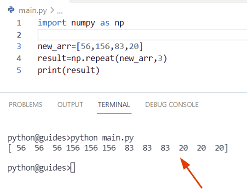

Python NumPy repeat

另一个重复二维数组元素的例子

在这个程序中，我们将使用 `np.array()` 函数创建一个二维数组，并为其分配四个整数值。现在使用 `np.repeat()` 函数来重复 numpy 数组的项目。

**下面是源代码:**

```py
import numpy as np

new_values = np.array([[53,167],[97,83]])
new_output=np.repeat(new_values,2)
print(new_output)
```

一旦您将打印**‘new _ output’**，那么输出将显示重复元素 2 次，并将其放入一维数组中。

下面是以下给定代码的执行过程

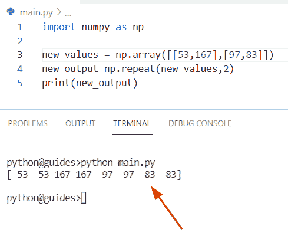

Python NumPy repeat

读取 [Python NumPy 2d 数组](https://pythonguides.com/python-numpy-2d-array/)

## Python NumPy 重复数组

*   在这个程序中，我们将讨论如何在 Numpy 数组中重复元素**。**
*   为了执行这个特定的任务，我们将使用 `np.tile()` 方法。在 Python 中，该函数用于重复 NumPy 数组中可用的项数。
*   在该方法中，**‘A’**参数表示由‘重复’参数表示的次数。

**语法:**

下面是 np.tile()方法的语法

```py
numpy.tile
          (
           A,
           reps
          )
```

**举例:**

```py
import numpy as np

new_val = np.array([76,23,17])
re_elements = 2
new_output = np.tile(new_val, (re_elements, 1))
print(new_output)
```

在上面的代码中，我们使用 `np.array()` 创建了一个数组，该数组包含三个数字。现在我们已经应用了 `np.tile()` 方法，并将值设置为 `2` 。

你可以参考下面的截图

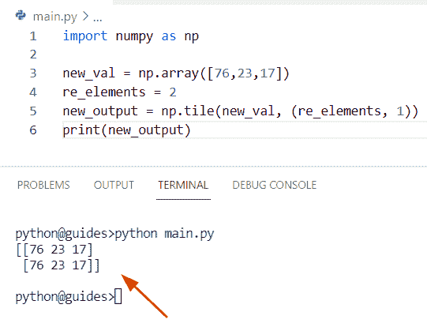

Python NumPy repeat array

正如您在屏幕截图中看到的，输出数组存储给定的输入数组 76、23、17 两次。

读取 [Python NumPy 数据类型](https://pythonguides.com/python-numpy-data-types/)

## Python NumPy 重复数据

*   本节我们将讨论**如何在 NumPy Python** 中重复数据。
*   通过使用 `np.repeat()` 函数，我们将重复数组中可用的元素。在这个例子中，我们已经提到了沿其重复值的轴。
*   在这个例子中，我们将使用 axis 参数来指定元素重复的方向。例如，假设我们有一个 2 维数组，现在我们想在各行之间水平重复这些元素，所以我们将设置**轴=1** 。

**举例:**

```py
import numpy as np

new_arr = np.array([[12,34], [21,87]])
z = np.repeat(new_arr, 5)
result=np.repeat(new_arr, 5, axis=1)
print(result)
```

下面是以下给定代码的输出

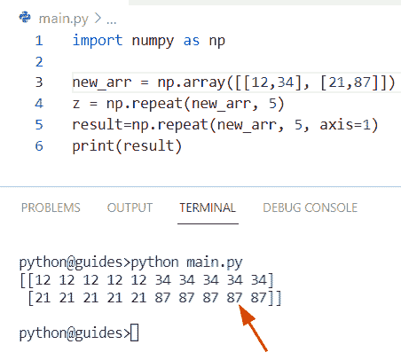

Python NumPy repeat data

正如您在截图中看到的，输出将显示一个新的二维数组。

读取 [Python NumPy 3d 数组](https://pythonguides.com/python-numpy-3d-array/)

## Python NumPy 重复 2d

*   让我们看看**如何在 NumPy Python** 中重复二维数组。
*   为了完成这项任务，我们首先将使用 `np.array()` 方法创建一个二维数组，然后使用 numpy `repeat()` 函数，如果在示例中没有提到轴参数，它将展平 numpy 数组。
*   在这个例子中，我们将设置**轴=0** ,这表示数组的项目将沿着行重复。

**语法:**

下面是 np.repeat()函数的语法

```py
numpy.repeat
            (
             a,
             repeats,
             axis=0
            )
```

**举例:**

让我们举一个例子，了解如何在 Python 中重复二维数组

**下面是源代码:**

```py
import numpy as np

elements = np.array([[98,76], [178,145]])
result=np.repeat(elements, 4, axis=0)
print(result)
```

你可以参考下面的截图

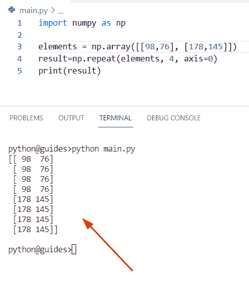

Python NumPy repeat 2d

阅读 [Python NumPy Split](https://pythonguides.com/python-numpy-split/)

## Python NumPy 重复示例

*   在这个例子中，我们将使用一个 **1-d，2-d** numpy 数组以及 Python 中的一个轴。
*   为了执行这个特定的任务，我们可以很容易地使用 `numpy.repeat()` 函数返回重复项的 numpy 数组以及轴，例如 0 和 1。

**举例:**

```py
import numpy as np

new_arr = np.repeat(18, 6)
print("One-d array:",new_arr)

new_arr2 = np.array([[76, 34], [45, 68], [13, 99]])

output = np.repeat(new_arr2, 3)

print("2-d array:",output)
val_ax = np.repeat(new_arr2, 3, axis=0)
print("Along with axis:",val_ax)

val_ax2 = np.repeat(new_arr2, 3, axis=1)
print("Along with axis1:",val_ax2) 
```

下面是以下代码的截图

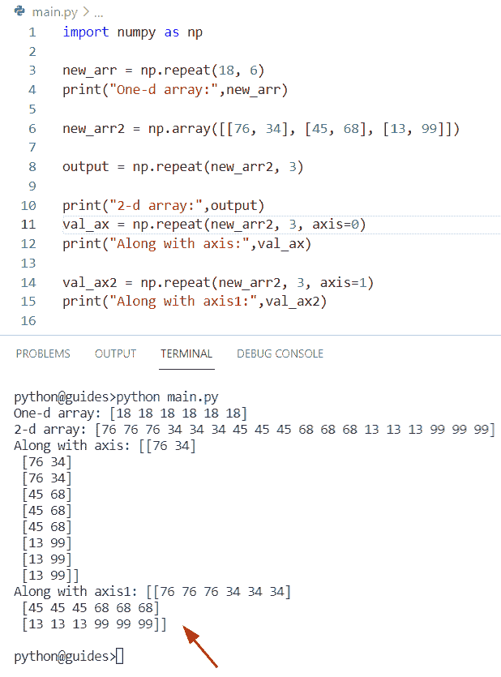

Python NumPy repeat example

正如您在截图中看到的，输出将显示重复的项目

看看， [Python NumPy 规格化](https://pythonguides.com/python-numpy-normalize/)

## Python NumPy 重复每一行

*   在这一节中，我们将讨论在 NumPy Python 中每一行重复元素的**。**
*   通过使用 `np.tile()` 方法，我们可以解决这个特殊的任务。在 Python 中， `numpy.tile()` 用于根据条件重复多次来创建一个新数组。

**语法:**

下面是 np.tile()方法的语法

```py
numpy.tile
          (
           A,
           reps
          )
```

**源代码:**

```py
import numpy as np

arr_elements = np.array([85,34,88])
final_res = np.tile(arr_elements, (4, 1))
print(final_res)
```

在上面的代码中，我们首先创建了一个一维数组，然后使用了 `np.tile()` 函数，在该函数中，我们分配了两个参数(4，1 ),以指示我们在每行中重复元素的次数。

下面是以下给定代码的执行过程

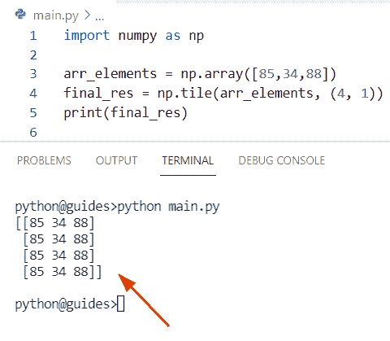

Python NumPy repeat each row

阅读[Python NumPy Random【30 个例子】](https://pythonguides.com/python-numpy-random/)

## Python NumPy 删除重复

*   本节我们将讨论如何在 NumPy 数组 Python 中删除重复元素。
*   为了完成这项任务，我们将使用 np.unique 方法。在 Python 中， `np.unique()` 方法用于标识 numpy 数组的唯一项，并总是以排序数组的形式返回唯一元素。

**语法:**

下面是 np.unique()函数的语法

```py
numpy.unique
            (
             ar,
             return_index=False,
             return_inverse=False,
             return_count=False,
             axis=None
            )
```

**源代码:**

```py
import numpy as np

new_arr = np.array([[67,55,43,21,89],
                 [67,55,9,30,89],
                 [67,55,2,21,89]])

b= np.unique(new_arr)
print(b) 
```

下面是以下代码的截图

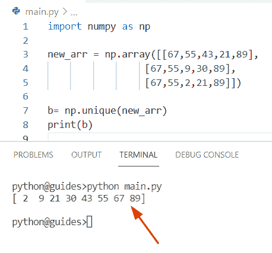

Python NumPy delete repeat

阅读 [Python NumPy max](https://pythonguides.com/python-numpy-max-with-examples/)

## Python NumPy 重复数组 n 次

*   这里可以看到如何在 Python 中 n 次重复 numpy 数组。在这个例子中,“n”表示我们在 Python 中重复数组的次数。
*   在这个例子中，我们将使用 `np.vstack()` 方法。在 Python 中， `np.vstack()` 函数用于将 numpy 数组的序列以 tuple 的形式与 vertical 一起堆叠。
*   这个方法在 NumPy 模块包中可用，名为 np.vstack()。

**语法:**

下面是 np.vstack()方法的语法

```py
numpy.vstack
            (
             tup
            )
```

**注意:**它仅由参数组成，在本例中，我们需要提供我们想要组合的数组的名称，并且该数组必须包含在元组形式中。

**源代码:**

```py
import numpy as np

new_arr = np.array([76,23,189,98])
N = 11
result=np.vstack([new_arr]*N)
print(result)
```

在上面的代码中，我们通过使用 `np.array()` 函数创建了一个数组，然后声明了一个表示重复次数的变量**‘N’**。

现在使用 np.vstack()方法并将数组与' N '组合。一旦你将打印**‘结果’**，那么输出将显示数组 `11` 次。

你可以参考下面的截图

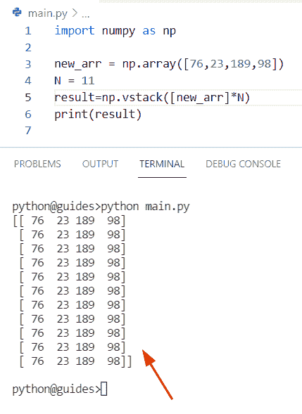

Python NumPy repeat array n times

阅读 [Python NumPy nan](https://pythonguides.com/python-numpy-nan/)

## Python NumPy 重复元素

*   在本期节目中，我们将讨论**如何使用 Python** 在 NumPy 数组中寻找重复元素。
*   在 Python 中，计数器就像一个容器，存储容器中每个可用项目的计数。

**源代码:**

```py
import numpy as np
from collections import Counter

new_arr = np.array([56, 83, 56, 83, 90, 56, 19])
b= [item for item, count in Counter(new_arr).items() if count > 1]
print(b)
```

下面是以下给定代码的实现

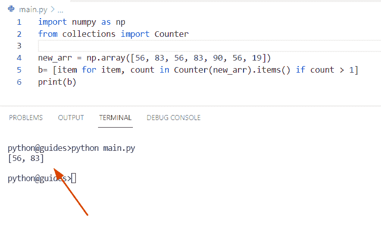

Python NumPy duplicate elements

正如您在屏幕截图中看到的，输出将显示数组中存在的重复元素

读取[值错误:用序列](https://pythonguides.com/valueerror-setting-an-array-element-with-a-sequence/)设置数组元素

## Python NumPy 循环遍历行

*   在本节中，我们将讨论**如何在 Python** 中使用 loop 方法来迭代行。
*   为了执行这个特定的任务，我们将使用带有`NP . shape()`方法的 `np.arange()` 。在 Python 中， `arange()` 方法用于创建一个具有给定间隔的数组，它基于数值范围。
*   在 Python 中,`numpy . shape()`函数用于整形数据，它只接受一个表示数组新形状的参数。

**举例:**

```py
import numpy as np

new_arr = np.arange(8).reshape(4,2)
for m in new_arr:
    print(m)
```

通过使用 for 循环，我们迭代了给定数组中的行

下面是以下代码的截图

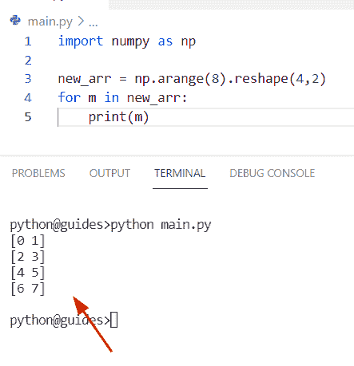

Python NumPy loop over rows

读取[检查 Python 中的 NumPy 数组是否为空](https://pythonguides.com/check-if-numpy-array-is-empty/)

## Python numpy 循环遍历数组

*   在本期节目中，我们将讨论如何在 Python NumPy 中 ***迭代循环遍历一个数组。***
*   通过使用 `np.nditer()` 方法，我们可以轻松地执行这个特定的任务。在 Python 中， `nditer()` 用于迭代对象的 numpy 数组，我们也可以很容易地获得数组的转置，表示将列转换为行。

**语法:**

下面是 np.nditer()方法的语法

```py
numpy.nditer
            (
             op,
             flags=None,
             op_flags=None,
             op_dtypes=None,
             order='K',
             casting='safe',
             op_axes=None,
             itershape=None,
             buffersize=0
            )
```

**源代码:**

```py
import numpy as np

new_arr = np.arange(8).reshape(2,4)
for new_arr in np.nditer(new_arr):
    print(new_arr, end=' ')
```

你可以参考下面的截图

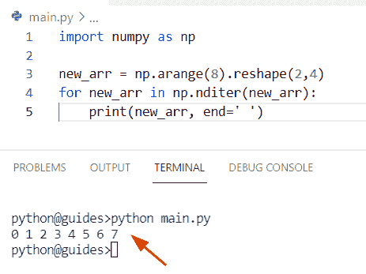

Python numpy loop through an array

读取 [Python NumPy 零](https://pythonguides.com/python-numpy-zeros/)

## Python numpy tile 函数

*   在本节中，我们将讨论如何在 Python 中使用 **tile()函数。**
*   在 Python 中， `numpy.tile()` 函数用于重复数组中可用项目的数量。
*   在该方法中，**‘A’**参数表示由‘重复’参数表示的次数。

**语法:**

下面是 np.tile()方法的语法

```py
np.tile
       (
        A,
        reps
       )
```

**注意:**这个函数采用两个参数来控制方法的工作方式。

*   **A:** 该参数将输入作为数组。
*   **Reps:** 该参数指示如何重复输入数组，如果设置 reps=2，它将产生一个带有两个 numpy 数组实例的输出。

**源代码:**

```py
import numpy as np

new_values = np.array([34, 44, 56])
result = np.tile(new_values, (4,4))
print(result)
```

在上面的代码中，我们使用 np.array()方法创建了一个数组，然后使用 np.tile()方法并分配 reps=4。一旦您将打印“结果”,那么输出将显示四次重复。

你可以参考下面的截图

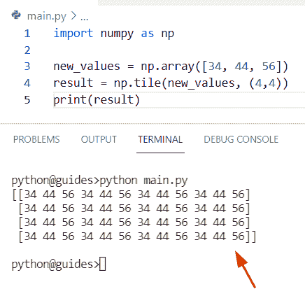

Python numpy tile function

读取 [Python NumPy 平均值](https://pythonguides.com/python-numpy-average/)

## Python numpy 重复向量

*   本节我们将讨论**如何在 NumPy Python** 中重复 vector。
*   在这个例子中，我们将使用 `np.tile()` 方法，并在其中分配 `numpy.transpose()` 方法。

**举例:**

```py
import numpy as np

arr=np.array(([[67,83,92]]))
new_output = np.tile(arr.transpose(), (2, 3))
print(new_output)
```

下面是以下代码的截图

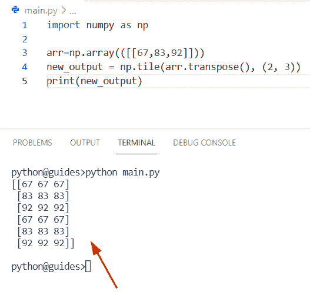

Python numpy repeat vector

您可能会喜欢以下 Python NumPy 教程:

*   [Python NumPy Sum](https://pythonguides.com/python-numpy-sum/)
*   [python num py arang](https://pythonguides.com/python-numpy-arange/)
*   [Python NumPy 绝对值举例](https://pythonguides.com/python-numpy-absolute-value/)
*   [Python NumPy square](https://pythonguides.com/python-numpy-square/)
*   [Python NumPy 列举示例](https://pythonguides.com/python-numpy-to-list/)

在这个 Python 教程中，我们将学习**如何在 Python** 中使用 NumPy repeat。此外，我们将涵盖这些主题。

*   Python NumPy 重复数组
*   Python NumPy 重复数据
*   Python 数字重复 2d
*   Python NumPy 重复示例
*   Python NumPy 重复每一行
*   Python NumPy 删除重复
*   Python NumPy 重复数组 n 次
*   Python NumPy 重复元素
*   Python NumPy 在行上循环
*   Python numpy 循环遍历数组
*   Python numpy 切片函数
*   Python numpy 重复向量

[Bijay Kumar](https://pythonguides.com/author/fewlines4biju/)

Python 是美国最流行的语言之一。我从事 Python 工作已经有很长时间了，我在与 Tkinter、Pandas、NumPy、Turtle、Django、Matplotlib、Tensorflow、Scipy、Scikit-Learn 等各种库合作方面拥有专业知识。我有与美国、加拿大、英国、澳大利亚、新西兰等国家的各种客户合作的经验。查看我的个人资料。

[enjoysharepoint.com/](https://enjoysharepoint.com/)[](https://www.facebook.com/fewlines4biju "Facebook")[](https://www.linkedin.com/in/fewlines4biju/ "Linkedin")[](https://twitter.com/fewlines4biju "Twitter")