# Python NumPy 替换+示例

> 原文：<https://pythonguides.com/python-numpy-replace/>

[](https://sharepointsky.teachable.com/p/python-and-machine-learning-training-course)

在这个 [Python NumPy 教程](https://pythonguides.com/numpy/)中，我们将学习**如何替换 NumPy 数组** Python 中的值。通过 **Python NumPy 替换函数**，我们将涵盖这些主题。

*   Python numpy 用 0 替换 nan
*   Python numpy 替换数组中的值
*   Python numpy 用 1 替换 0
*   Python numpy 替换数组中的所有值
*   Python numpy 用 0 替换 inf
*   Python numpy 替换行
*   Python numpy 替换列
*   Python numpy 用零替换负值
*   Python numpy 替换数组中的字符串
*   Python np.where 替换
*   Python numpy 移除最后一个元素
*   Python numpy 随机选择替换
*   Python numpy 移除重复
*   Python numpy 从数组中移除列
*   Python numpy 通过索引移除元素

目录

[](#)

*   [Python numpy 替换](#Python_numpy_replace "Python numpy replace")
*   [Python numpy 用 0 替换 nan](#Python_numpy_replace_nan_with_0 "Python numpy replace nan with 0")
*   [Python numpy 替换数组中的值](#Python_numpy_replace_values_in_array "Python numpy replace values in array")
*   [Python numpy 用 1 替换 0](#Python_numpy_replace_0_with_1 "Python numpy replace 0 with 1")
*   [Python numpy 替换数组](#Python_numpy_replace_all_values_in_array "Python numpy replace all values in array")中的所有值
*   [Python numpy 用 0 替换 INF](#Python_numpy_replace_inf_with_0 "Python numpy replace inf with 0")
*   [Python numpy 替换行](#Python_numpy_replace_row "Python numpy replace row")
*   [Python numpy 替换列](#Python_numpy_replace_column "Python numpy replace column")
*   [Python numpy 用零替换负值](#Python_numpy_replace_negative_values_with_zeros "Python numpy replace negative values with zeros")
*   [Python numpy 替换数组中的字符串](#Python_numpy_replace_string_in_array "Python numpy replace string in array")
*   [Python np.where 替换](#Python_npwhere_replace "Python np.where replace")
*   [Python numpy 移除最后一个元素](#Python_numpy_remove_last_element "Python numpy remove last element")
*   [Python numpy 随机选择替换](#Python_numpy_random_choice_replace "Python numpy random choice replace")
*   [Python numpy 移除重复](#Python_numpy_remove_duplicates "Python numpy remove duplicates")
*   [Python numpy 从数组中移除列](#Python_numpy_remove_column_from_array "Python numpy remove column from array")
*   [Python numpy 通过索引移除元素](#Python_numpy_remove_element_by_index "Python numpy remove element by index")

## Python numpy 替换

*   在本节中，我们将讨论如何替换 [Python NumPy 数组](https://pythonguides.com/python-numpy-array/)中的值。
*   为了执行这个特定的任务，我们将使用 `numpy.clip()` 函数，这个方法返回一个 numpy 数组，其中小于指定限制的值被替换为一个下限。
*   在 Python 中， `numpy.clip()` 函数指定间隔，间隔之外的元素被裁剪到间隔边缘。
*   这个方法基本上是 Python `numpy.minimum()` 和 `numpy.maximum()` 函数的组合。

**语法:**

让我们看一下语法并理解 `numpy.clip()` 函数的工作原理

```py
numpy.clip
          (
           a,
           a_min,
           a_max,
           out=None,
          )
```

*   它由几个参数组成
    *   **a:** 该参数表示包含要裁剪元素的输入数组。
    *   **a_min:** 该参数指定了定义间隔的下限值。它将检查 a_min 值是否为 none 的情况，然后不会在下边缘上执行裁剪。
    *   **a_max:** 该参数表示定义区间的最大值。
    *   **out:** 默认情况下，它不取值，表示存储结果的数组，out 必须是正确的形状。

**举例:**

让我们举个例子，看看如何替换 NumPy 数组 Python 中的值

**源代码:**

```py
import numpy as np

new_array = np.array([12,15,17,18,23,26,45])

out = np.clip(new_array, 12, 16)
print("The clipped array:", out)
```

在上面的代码中，我们已经导入了 numpy 模块，然后使用了 `numpy.array()` 函数来创建数组。

之后，我们使用 numpy.clip()函数来限制下限区间和上限区间。在这个例子中，我们使用了三个参数 **a_min=12，a_max=16** 。

所以现在下限将是 `12` ，上限将是‘16’。在该程序中，所有小于**‘16’**的值将保持不变，如果大于 `16` ，则用 `16` 翻转。

下面是以下代码的截图

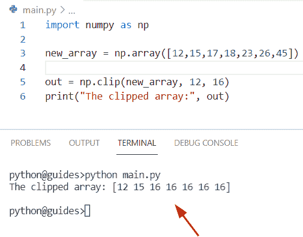

Python numpy replace

阅读[检查 Python 中的 NumPy 数组是否为空](https://pythonguides.com/check-if-numpy-array-is-empty/)

## Python numpy 用 0 替换 nan

*   在本期节目中，我们将学习如何在 Python 中用 `0` 替换 nan 值。
*   在 Python 中用零替换 nan 值，我们可以很容易地使用 `numpy.nan_to_num()` 函数。该函数将帮助用户用 0 代替 nan 值，用大的有限数代替无穷大。

**语法:**

下面是 Python`numpy . nan _ to _ num()`函数的语法

```py
numpy.nan_to_num
                (
                 x,
                 copy=True,
                 nan=0.0,
                 posinf=None,
                 neginf=None
                )
```

*   它由几个参数组成
    *   **x:** 该参数表示输入数组。
    *   **copy:** 默认情况下，它采用“True”值，当强制转换为数组不需要副本时会出现这种情况。
    *   **nan:** 该参数将检查条件，如果没有传递值，则 nan 值将被替换为 `0` 。默认情况下，它将 `0` 值作为函数中的参数。
    *   **posinfo:**该参数指定填充正无穷大值。

**举例:**

我们举个例子，了解一下 `numpy.nan_to_num()` 函数的工作原理

**源代码:**

```py
import numpy as np

new_arr = np.array([[13, np.nan, 16,np.nan], [17, np.NaN, 14,np.nan]])
print("Creation of array:",new_arr)
new_output = np.nan_to_num(new_arr)
print("Replace nan with zero:",new_output)
```

在上面的代码中，我们使用了 `np.array()` 函数来创建一个包含整数和数值的数组。现在我们想通过使用 `numpy.nan_to_num` 将 nan 值替换为零。在这个函数中，我们将数组作为参数传递。

下面是以下给定代码的执行过程

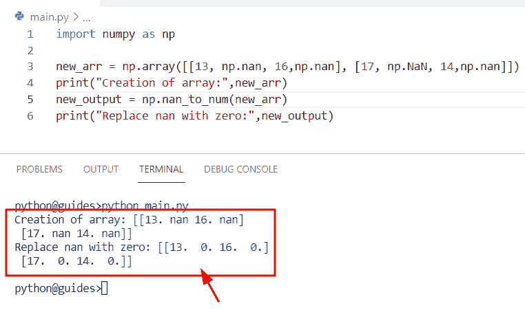

Python numpy replace nan with 0

正如您在屏幕截图中看到的，输出显示了新更新的阵列。

读取 [Python NumPy 零](https://pythonguides.com/python-numpy-zeros/)

## Python numpy 替换数组中的值

*   这里我们将讨论如何替换 Python numpy 数组中的值。
*   通过使用 `np.where()` 函数，我们可以轻松地执行这项任务。在 Python np.where 中，函数用于根据条件从 numpy 数组中选择元素。
*   在这个例子中，我们将创建一个包含整数值的数组，通过使用 `np.where()` 函数，我们将给出一个条件，如果值**‘19’**小于包含值的数组，那么它将被替换为**‘69’**。

**语法:**

下面是 `numpy.where()` 函数的语法

```py
numpy.where
           (
            condition
            [,
            x,
            y
            ]
           )
```

**举例:**

```py
import numpy as np

new_arr_ele = np.array([15, 25, 44, 56, 74, 2, 19])
result = np.where(new_arr_ele < 19, 69, new_arr_ele)
print("Replace value:",result)
```

下面是以下给定代码的实现

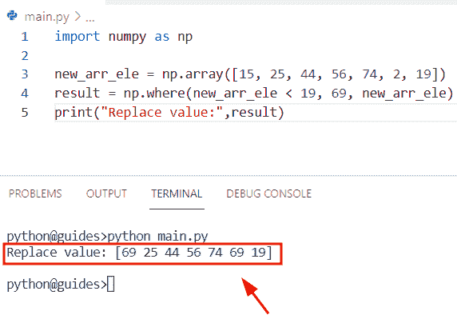

Python Numpy replace values in an array

如果你想获得关于 numpy.where()函数的详细信息。可以参考我们的文章 [Python numpy where](https://pythonguides.com/python-numpy-where/) 。

## Python numpy 用 1 替换 0

*   在本节中，我们将讨论如何在 NumPy Python 中用 `1` 替换 `0` 值。
*   为了完成这个任务，我们将使用 `numpy.place()` 。在 Python 中， `numpy.place()` 用于根据条件改变 numpy 数组中的值，必须使用放入 numpy 数组的前 N 个值。
*   这个方法在 numpy 包模块中可用，可以由 numpy 库作为 np 导入，并且总是返回作为输入数组给出的更新后的数组。

**语法:**

下面是 `NumPy.place()` 方法的语法

```py
NumPy.place
           (
            arr,
            mask,
            vals
           )
```

**举例:**

```py
import numpy as np

new_array = np.array([0,1,2,3,4,5,6,7,8])
np.place(new_array, new_array<1, [1])
print("Replace 0 with 1:",new_array)
```

在上面的代码中，我们导入了 numpy 库，然后使用 `np.array()` 函数初始化了一个数组。之后，我们使用了 `np.place()` 函数，并指定数组条件:如果值小于 `1` ，那么它将替换 `1` 。

根据条件，值为 `0` 小于 1，将被替换为 1

下面是以下代码的截图

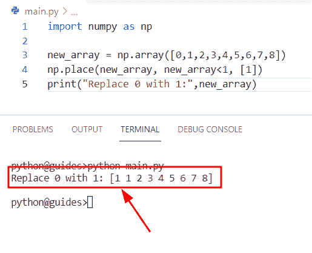

Python numpy replace 0 with 1

阅读 [Python NumPy Sum](https://pythonguides.com/python-numpy-sum/)

## Python numpy 替换数组中的所有值

*   在本节中，我们将讨论如何替换 Python NumPy 数组中的所有值。
*   为了解决这个问题，我们将使用 `numpy.clip()` 函数，这个方法返回一个 numpy 数组，其中小于指定限制的值被替换为一个下限。
*   在这个例子中，我们导入了 numpy 库，然后使用 `np.array()` 函数创建了一个数组。之后，我们声明了一个变量**‘新结果’**，并指定了 `np.clip()` 函数。它将检查条件，如果该值大于 `16` ，则它将替换为 `16` 值。

**源代码:**

```py
import numpy as np

new_val_element = np.array([8,4,17,18,45,78,98])
new_result= np.clip(new_val_element, 17, 16)
print("Replace all values:", new_result)
```

你可以参考下面的截图

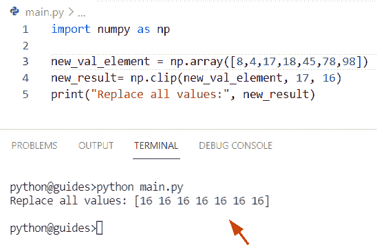

Python numpy replace all values in the array

查看 [Python NumPy Random](https://pythonguides.com/python-numpy-random/)

## Python numpy 用 0 替换 INF

*   在本期节目中，我们将讨论如何使用 `numpy.where()` 函数在 Python 中用 `0` 替换 numpy.inf 值。
*   在 Python 中，inf 代表 numpy 中的正无穷大，它是一个无穷大的数，主要用于算法的计算。它将检查条件，如果输入值是 numpy.inf，那么它将返回一个正无穷大。
*   在这个例子中，我们必须用 `0` 替换 inf 值。为了完成这个任务，我们将使用 **np，where()** 函数，它将设置条件 `arr===np.inf` 然后替换为 0。

**举例:**

```py
import numpy as np
from numpy import inf

new_array = np.array([np.inf,15,np.inf,17,np.inf])
result= np.where(new_array==np.inf, 0, new_array) 
print(result)
```

下面是以下给定代码的实现

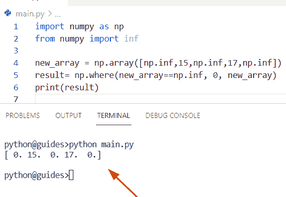

Python numpy replace inf with 0

阅读 [Python NumPy max](https://pythonguides.com/python-numpy-max-with-examples/)

## Python numpy 替换行

*   在本节中，我们将讨论如何在 Python numpy 数组中替换 row。
*   为了替换数组中的一行，我们将使用切片和 `*` 操作符方法。它将帮助用户替换行元素。首先我们将导入 numpy 库，然后使用 `np.array()` 函数创建一个 numpy 数组。
*   现在，我们将使用数组条件并创建一个切片来选择行，然后我们将选择的行乘以 `4` 。它将更新 `3` 行的所有元素。

**举例:**

```py
import numpy as np

new_array = np.array([[15, 17, 35],
                   [18, 22, 34],
                   [78, 84, 34]])
new_array[2:,] = new_array[2:,] * 4
print(new_array) 
```

下面是以下代码的截图

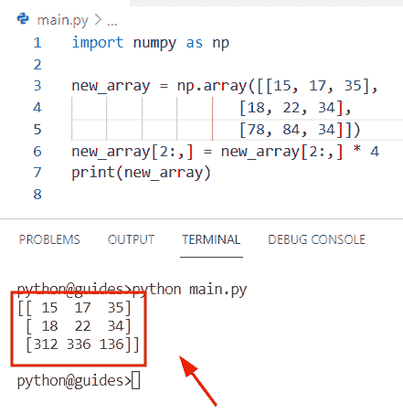

Python numpy replace row

阅读 [Python NumPy shape 示例](https://pythonguides.com/python-numpy-shape/)

## Python numpy 替换列

*   在本节中，我们将讨论如何替换 Python numpy 数组中的列。
*   为了完成这项任务，我们将使用切片方法。首先我们将导入 numpy 库，然后使用 `np.ones()` 函数初始化一个数组。一旦你执行这个函数，它将显示只包含一个值的数组。
*   现在我们想替换数组中的一列，并用零替换一的值，为了完成这个任务，我们将应用切片方法。

**举例:**

```py
import numpy as np

new_arr = np.ones((3,3))
print("Creation of array:",new_arr)
new_arr[:, 1] =  0
print("Replace column from array:",new_arr) 
```

下面是以下给定代码的执行过程

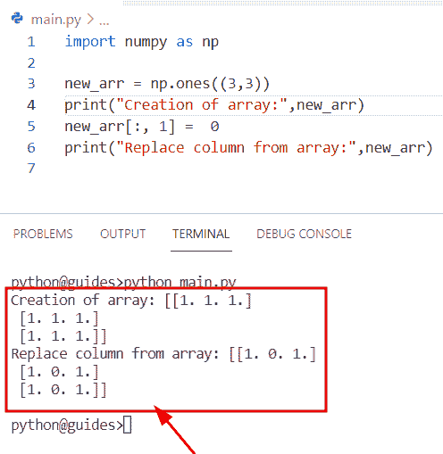

Python numpy replace column

读取 [Python 反向 NumPy 数组](https://pythonguides.com/python-reverse-numpy-array/)

## Python numpy 用零替换负值

*   在本期节目中，我们将讨论如何在 NumPy Python 中用零替换负值。
*   为了执行这个特定的任务，我们将使用 `np.place()` 函数，它用于根据条件在 numpy 数组中进行更改，并且必须使用放入 NumPy 数组的前 N 个值。

**语法:**

下面是 Python numpy.place()函数的语法

```py
NumPy.place
           (
            arr,
            mask,
            vals
           )
```

**源代码:**

```py
import numpy as np

new_values = np.array([0,1,2,-7,4,-5,6,-7,8])
np.place(new_values, new_values<0, [0])
print("Replace negative values with 0:",new_values)
```

你可以参考下面的截图

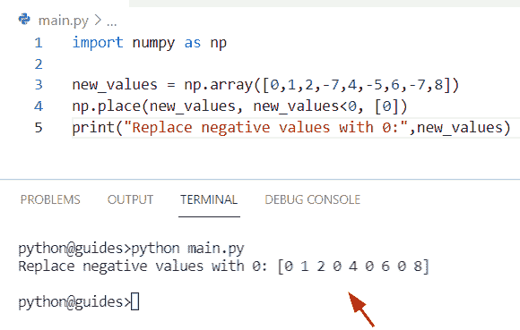

Python numpy replace negative values with zeros

阅读 [Python NumPy 空数组示例](https://pythonguides.com/python-numpy-empty-array/)

## Python numpy 替换数组中的字符串

*   让我们看看如何使用 numpy.char.replace()方法替换 Python numpy 数组中的字符串。
*   在 Python 中，该函数用于返回字符串的 numpy 数组的副本，该方法在 NumPy 包模块中可用。在 Python 中，如果给定了参数计数，该方法将检查条件，然后只替换第一个计数出现的情况。

**语法:**

让我们看一下语法并理解 `numpy.char.replace()` 方法的工作原理

```py
char.replace
            (
             a,
             old,
             new,
             count=None
            )
```

*   它由几个参数组成
    *   **a:** 该参数表示输入的数组字符串。
    *   **旧:** str 或 inicode
    *   **count:** 默认情况下，它不取值，它是一个可选参数，如果给定了 count，则替换第一次出现的计数。

**举例:**

让我们举个例子，看看如何在 NumPy Python 中替换一个字符串

**源代码:**

```py
import numpy as np 

new_str= "John is a Python developer"
result= np.char.replace (new_str, 'is', 'was')
print("Replacing string character:",result)
```

在上面的程序中，我们导入了 numpy 库，然后创建了一个名为‘new _ str’的字符串。之后，我们声明了一个变量“result”并分配了 np.char.replace()函数，在这个函数中，我们将数组和替换元素作为参数传递。一旦您将打印“结果”,那么输出将显示新更新的字符串。

下面是以下给定代码的实现

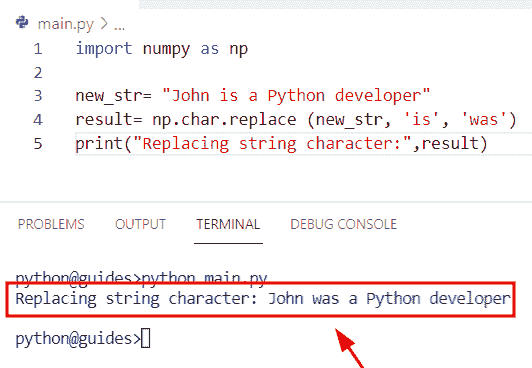

Python numpy replace a string in an array

阅读 [Python NumPy nan](https://pythonguides.com/python-numpy-nan/)

## Python np.where 替换

*   在本节中，我们将讨论如何使用 `np.where()` 函数替换 NumPy Python 中的值。
*   在 Python 中，该函数用于根据条件返回输入数组中给出的项目索引。在这个例子中，我们将创建一个包含整数值的数组，通过使用 np.where()函数，我们将给出一个条件，如果值【T0’‘47’小于包含值的数组，那么它将替换为【T2’‘105’。

**举例:**

让我们举个例子，看看如何使用 np.where()函数替换数组中的值。

**源代码:**

```py
import numpy as np

new_elements = np.array([45, 78, 126, 78, 47, 86, 189])
print("Creation of array:",new_elements)
new_output = np.where(new_elements < 47, 105, new_elements)
print("Replacing values from array:",new_output)
```

你可以参考下面的截图

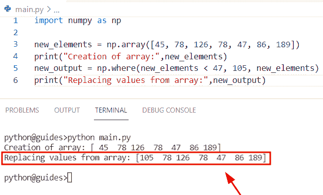

Python np where replace

读取[值错误:用序列](https://pythonguides.com/valueerror-setting-an-array-element-with-a-sequence/)设置数组元素

## Python numpy 移除最后一个元素

*   在这个程序中，我们将讨论如何移除 Python NumPy 数组中的最后一个元素。
*   要从数组中移除最后一个元素，我们可以很容易地使用 numpy.delete()函数。在 Python 中，该函数用于从 numpy 数组中移除元素以及给定的轴，并且该方法将在应用 `numpy.delete()` 函数后总是返回新更新的数组。它只是移除我们想要删除的项目。
*   要获得关于 `numpy.delete()` 函数的详细信息，可以参考我们的文章 [Python numpy delete](https://pythonguides.com/python-numpy-delete/)

**举例:**

```py
import numpy as np

new_values = np.array([16, 25, 67, 89, 167, 94, 79])
print("Creation of array:",new_values)
new_result= np.delete(new_values,6)
print("Removing last element from array:",new_result) 
```

下面是以下给定代码的输出

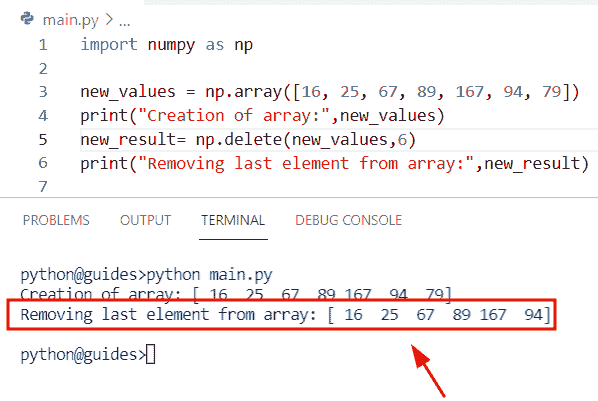

Python numpy remove the last element

阅读 [Python NumPy 平均值及示例](https://pythonguides.com/python-numpy-average/)

## Python numpy 随机选择替换

*   在本节中，我们将讨论如何使用 numpy `random.choice()` 函数替换 Python NumPy 数组中的元素。
*   为了执行这个特定的任务，我们将使用 `numpy random.choice()` 函数。在 Python 中，这个函数用于生成一个数组的随机样本，并且总是返回生成的随机样本。

**语法:**

让我们看一下语法并理解 `random.choice()` 函数的工作原理

```py
random.choice
             (
              a,
              size=None,
              replace=True,
              p=None,
             )
```

*   它由几个参数组成
    *   **a:** 这个参数表示你要操作的输入数组。
    *   **size:** 默认取 none 值，表示数组的大小。
    *   **更换:**该参数检查样品是否没有更换。
    *   与数组中的项目相关联的概率。

**举例:**

```py
import numpy as np

new_values = np.array([16, 25, 67, 89, 167, 94, 79,67])
z= np.random.choice(new_values,size=8,replace=False)
print("Random sample generate",z)
```

下面是以下代码的截图

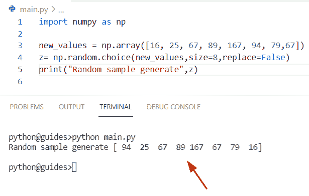

Python numpy random choice replace

阅读 [Python NumPy 绝对值示例](https://pythonguides.com/python-numpy-absolute-value/)

## Python numpy 移除重复

*   让我们看看如何删除 Python numpy 数组中的重复项。
*   为了完成这项任务，我们将使用 numpy.unique()函数从 numpy 数组中删除重复的元素。
*   在 Python numpy 中, `unique()` 函数用于查找 numpy 数组的唯一值，并且总是返回唯一值的元组和关联索引的 numpy 数组。
*   要获得关于 `numpy.delete()` 函数的详细信息，您可以参考我们的文章 [Python numpy unique](https://pythonguides.com/python-numpy-unique/)

**举例:**

```py
import numpy as np  

new_elements=np.array([156,23,18,156,28,93,156,292])  
new_output=np.unique(new_elements)
print("Remove duplicates from array:",new_output)
```

下面是以下给定代码的实现

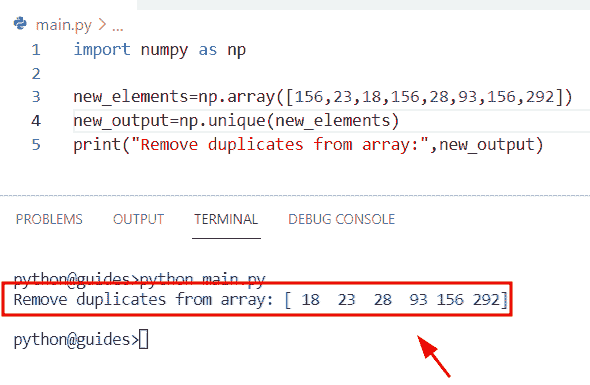

Python numpy remove duplicates

正如您在屏幕截图中看到的，输出显示已从数组中删除的重复元素。

阅读 [Python NumPy square 示例](https://pythonguides.com/python-numpy-square/)

## Python numpy 从数组中移除列

*   在这个程序中，我们将讨论如何在 Python 中从 numpy 数组中删除一列。
*   通过使用 `numpy.delete()` 函数，我们可以执行这个特定的任务，在这个函数中，我们将指定轴，帮助用户轻松地从数组中删除列元素。
*   在这个例子中，我们已经指定了轴**值=2** ，它表示将从数组中删除的 `2` 列元素。

**源代码:**

```py
import numpy as np  

new_array = np.array([[ 14,  26,  89,  43],
               [ 17,  78,  92,  34],
               [ 55,  23, 41, 77],
               ])
result = np.delete(new_array, 2,1) 
print(result) 
```

你可以参考下面的截图

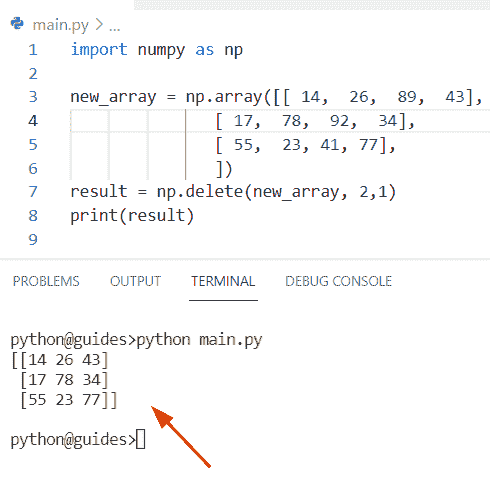

Python numpy remove column from array

## Python numpy 通过索引移除元素

我们已经在 [Python numpy 索引](https://pythonguides.com/python-numpy-indexing/)文章中讨论过这个主题。你得到了所有关于数字索引的信息

相关 Python NumPy 教程:

*   [Python NumPy 矩阵乘法](https://pythonguides.com/python-numpy-matrix-multiplication/)
*   [Python NumPy Savetxt +示例](https://pythonguides.com/python-numpy-savetxt/)
*   [Python NumPy genfromtxt()](https://pythonguides.com/python-numpy-genfromtxt/)
*   [Python NumPy 添加教程](https://pythonguides.com/python-numpy-add/)
*   [Python 数字差异示例](https://pythonguides.com/python-numpy-diff/)
*   [Python NumPy Divide](https://pythonguides.com/python-numpy-divide/)
*   [Python NumPy argsort + 7 个例子](https://pythonguides.com/python-numpy-argsort/)

在这个 Python 教程中，我们学习了**如何替换 NumPy 数组 Python** 中的值。通过 **Python NumPy replace 函数**，我们将涵盖这些主题。

*   Python numpy 用 0 替换 nan
*   Python numpy 替换数组中的值
*   Python numpy 用 1 替换 0
*   Python numpy 替换数组中的所有值
*   Python numpy 用 0 替换 inf
*   Python numpy 替换行
*   Python numpy 替换列
*   Python numpy 用零替换负值
*   Python numpy 替换数组中的字符串
*   Python np.where 替换
*   Python numpy 移除最后一个元素
*   Python numpy 随机选择替换
*   Python numpy 移除重复
*   Python numpy 从数组中移除列
*   Python numpy 通过索引移除元素

[Bijay Kumar](https://pythonguides.com/author/fewlines4biju/)

Python 是美国最流行的语言之一。我从事 Python 工作已经有很长时间了，我在与 Tkinter、Pandas、NumPy、Turtle、Django、Matplotlib、Tensorflow、Scipy、Scikit-Learn 等各种库合作方面拥有专业知识。我有与美国、加拿大、英国、澳大利亚、新西兰等国家的各种客户合作的经验。查看我的个人资料。

[enjoysharepoint.com/](https://enjoysharepoint.com/)[](https://www.facebook.com/fewlines4biju "Facebook")[](https://www.linkedin.com/in/fewlines4biju/ "Linkedin")[](https://twitter.com/fewlines4biju "Twitter")