# Python NumPy round + 13 个示例

> 原文：<https://pythonguides.com/python-numpy-round/>

[](https://sharepointsky.teachable.com/p/python-and-machine-learning-training-course)

在本 [Python 教程](https://pythonguides.com/numpy/)中，我们将学习**如何在 Python** 中舍入 Numpy 数组。此外，我们将涵盖这些主题。

*   Python NumPy 舍入
*   Python NumPy 舍入到整数
*   Python NumPy 向下舍入
*   Python NumPy 循环数组
*   Python NumPy 舍入到有效数字
*   Python NumPy round 函数
*   Python numpy round half up
*   Python numpy 舍入到最接近的 5
*   Python numpy 舍入到最接近的 10 位
*   Python np.round 不起作用
*   Python Numpy 四舍五入到小数点后两位
*   Python NumPy 舍入所有值
*   python numpy 一个范围轮
*   Python round NumPy 浮点数组
*   Python numpy 数组循环移位
*   Python numpy.ndarray 没有定义 _round_method
*   Python numpy 循环缓冲区

目录

[](#)

*   [Python NumPy 回合](#Python_NumPy_round "Python NumPy round")
*   [Python NumPy round up](#Python_NumPy_round_up "Python NumPy round up")
*   [Python NumPy 舍入到整数](#Python_NumPy_round_to_integer "Python NumPy round to integer")
*   [Python NumPy 向下舍入](#Python_NumPy_round_down "Python NumPy round down")
*   [Python NumPy 轮数组](#Python_NumPy_round_array "Python NumPy round array")
*   [Python NumPy 四舍五入到有效数字](#Python_NumPy_round_to_significant_digits "Python NumPy round to significant digits")
*   [Python NumPy round 函数](#Python_NumPy_round_function "Python NumPy round function")
*   [Python numpy 舍入到最近的 5 个](#Python_numpy_round_to_nearest_5 "Python numpy round to nearest 5")
    *   [将数字四舍五入到最接近的 5 位](#Round_number_to_nearest_5 "Round number to nearest 5")
*   [Python numpy 四舍五入到最近的 10 位](#Python_numpy_round_to_nearest_10 "Python numpy round to nearest 10")
*   [Python np.round 不起作用](#Python_npround_not_working "Python np.round not working")
*   [Python Numpy 四舍五入到小数点后两位](#Python_Numpy_round_to_2_decimal_places "Python Numpy round to 2 decimal places")
*   [Python NumPy 舍入所有值](#Python_NumPy_round_all_values "Python NumPy round all values")
*   [Python NumPy arange round](#Python_NumPy_arange_round "Python NumPy arange round")
*   [Python round NumPy 浮点数组](#Python_round_NumPy_float_array "Python round NumPy float array")
*   [Python numpy 数组循环移位](#Python_numpy_array_circular_shift "Python numpy array circular shift")
*   [Python numpy.ndarray 没有定义 _round_method](#Python_numpyndarray_doesnt_define_round_method "Python numpy.ndarray doesn’t define_round_method")
*   [Python numpy 循环缓冲区](#Python_numpy_circular_buffer "Python numpy circular buffer")

## Python NumPy 回合

*   在这一节中，我们将讨论如何在 Python 中对 NumPy 数组中的数字进行舍入。
*   为了完成这个任务，我们将使用函数 `numpy.round()` 。在 Python 中，这个函数以数学方式工作，执行舍入运算，还表示我们想要舍入的小数位数。
*   该函数将检查条件。如果没有给出浮点值，它将把值四舍五入到 1。例如，如果值达到 `0.26783` ，那么默认情况下它将返回 `1` 作为结果。

**语法:**

下面是 `numpy.round()` 函数的语法

```py
numpy.round_
            (
             a,
             decimals=0,
            )
```

*   它由几个参数组成
    *   **a:** 该参数指定我们想要舍入的值(输入数组)。
    *   **小数:**该参数表示用于四舍五入的小数位数。

**举例:**

让我们举个例子，看看如何在 Python 中使用 `numpy round()` 函数

**源代码:**

```py
import numpy as np

result=np.round(0.6789)
print("Rounded value:",result)
```

在上面的代码中，我们已经导入了 NumPy 库，然后使用 **numpy.round()函数**并分配浮点数(十进制)。打印“结果”后，输出将显示一个为 1 的舍入值。

下面是以下代码的截图

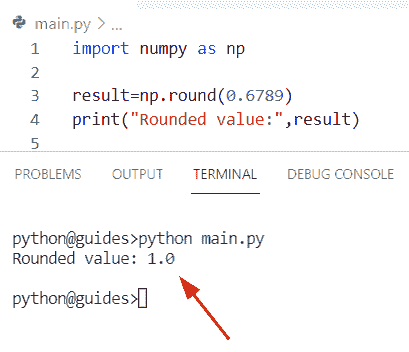

Python NumPy round

阅读: [Python 反向 NumPy 数组](https://pythonguides.com/python-reverse-numpy-array/)

## Python NumPy round up

*   在这个程序中，我们将讨论**如何用 Python** 对 NumPy 数组中的值进行四舍五入。
*   通过使用 `np.round()` 方法，我们可以很容易地舍入数组元素。在 Python 中，该方法是 NumPy 模块中可用的内置函数，并且该方法如果没有给出要舍入的浮点值，则默认情况下，它将认为是 `0` 。
*   在这个例子中，我们将理解 numpy round 方法在 Python 中是如何工作的。

**举例:**

```py
import numpy as np

new_arr = [3.67, 5.7, 1.2, 3.7, 8.6] 
new_output = np.round_(new_arr)
print ("Rounded values:", new_output)
```

在上面的例子中，我们声明了一个 numpy 数组**‘new _ arr’**作为 round 函数的输入。该函数将检查条件，如果小数点后的值为 `0.5` 或以上，则该函数将获得序列中的下一个数字。

下面是以下给定代码的执行过程

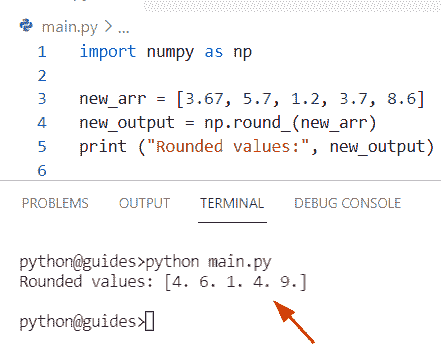

Python NumPy round up

阅读: [Python NumPy nan](https://pythonguides.com/python-numpy-nan/)

## Python NumPy 舍入到整数

*   让我们看看**如何在 NumPy Python** 中用 integer 转换 round 值。
*   为了执行这个特定的任务，我们将使用 `rint()` 方法。此方法用于将数组值舍入到最接近的整数。

**语法:**

下面是 `rint()` 方法的语法

```py
numpy.rint
          (
           x,
           /,
           out=None,
           *,
           where=True,
           casting='same_kind',
           order='K',
           dtype=None,
           subok=True
          )
```

**举例:**

```py
import numpy as np  

new_val = [4.28, 2.87, 0.65, 0.34]  
result = np.rint(new_val)  
print(result) 
```

在上面的代码中，我们导入了一个 NumPy 库，然后使用了一个 np.rint()方法，并在其中分配了一个数组**‘new _ val’**。

一旦你将打印“结果”，然后输出将显示新的整数值。

下面是以下给定代码的输出

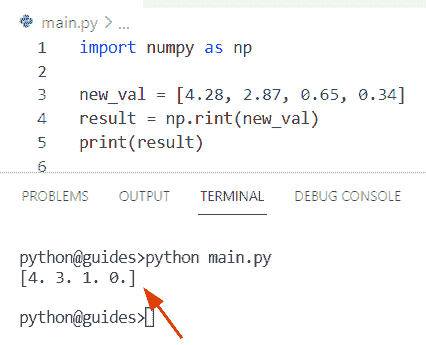

Python NumPy round to integer

阅读: [Python NumPy 平均值](https://pythonguides.com/python-numpy-average/)

## Python NumPy 向下舍入

*   在本节中，我们将讨论如何对 NumPy 数组中的数字进行舍入。
*   在这个例子中，我们将使用 `numpy.floor()` 方法。在 Python 中，该函数总是返回 numpy 数组元素值的下限。
*   该方法将检查如果 **i < =x** 则定标器 x 的底值是最大数 `i` 的条件。

**语法:**

下面是 numpy.floor()方法的语法

```py
numpy.floor
           (
            x,
            /,
            out=None,
            *,
            where=True,
            casting='same_kind',
            order='K',
            dtype=None
           )
```

让我们举一个例子来理解 floor 函数在 NumPy Python 中是如何工作

**举例:**

```py
import numpy as np  

new_arr = np.array([-4.6, -3.4, -1.3, 1.2, 0.4, 0.6])
b= np.floor(new_arr)
print(b)
```

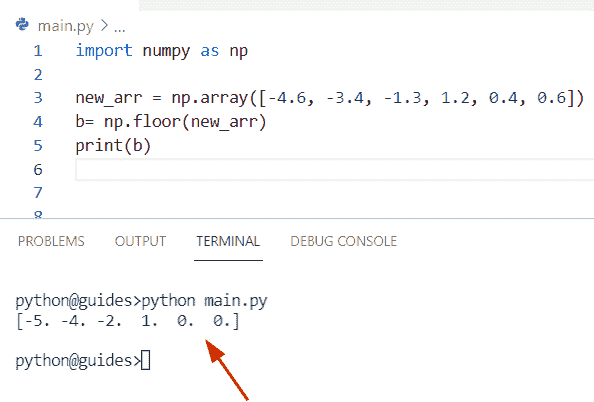

Python NumPy round down

阅读: [Python NumPy 绝对值](https://pythonguides.com/python-numpy-absolute-value/)

## Python NumPy 轮数组

*   在这个程序中，我们将讨论**如何使用 Python** 获得 NumPy 数组中的舍入值。
*   为了执行这个特定的任务，我们将使用 `np.round()` 方法，它表示我们想要舍入的小数位数。

**语法:**

下面是 numpy.round()方法的语法

```py
numpy.round_
            (
             a,
             decimals=0,
            )
```

**源代码:**

```py
import numpy as np 

new_array = np.array([3.5826945, 6.256485, 7.27384895])
z= np.round(new_array)
print(z)
```

在上面的代码中，我们使用了 n `p.array()` 方法来创建一个数组，并为其分配十进制值。一旦你将打印【T2’z’，那么输出将显示精确的正整数。

下面是以下代码的截图

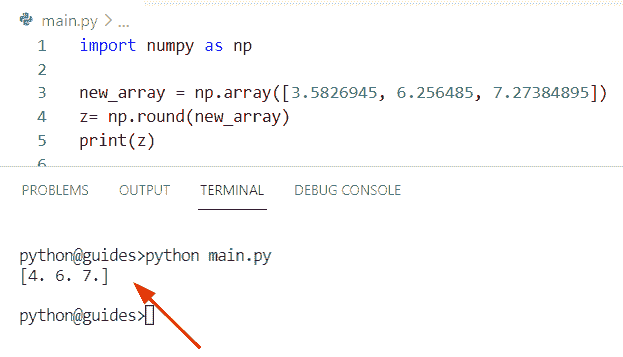

Python NumPy round array

阅读: [Python NumPy square](https://pythonguides.com/python-numpy-square/)

## Python NumPy 四舍五入到有效数字

*   在这一节中，我们将讨论如何在 Python 中用有效数字**转换舍入。**
*   在 Python 中，舍入意味着用一个接近的近似值替换一个数字。在这个例子中，我们将使用 sigfig 模块将数字舍入到有效数字，在 Python 中，sigfig 用于对值中的数字进行舍入。
*   在本模块中，我们已经指定了有效数字的整数位数，该函数主要用于浮点数。

**源代码:**

```py
from sigfig import round

b= round(4576, sigfigs = 1)
print(b)
```

你可以参考下面的截图

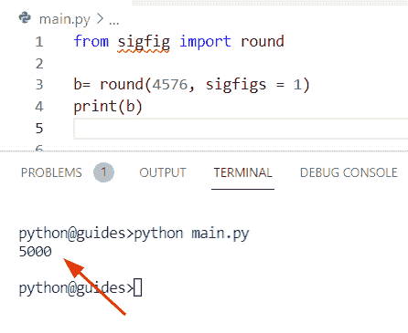

Python NumPy round to significant digits

正如您在屏幕截图中看到的，输出显示了准确的有效数字。

阅读: [Python NumPy to list](https://pythonguides.com/python-numpy-to-list/)

## Python NumPy round 函数

*   让我们看看**如何在 Python** 中使用 NumPy 数组中的 round()函数。
*   在这个例子中，我们将使用 `np.round()` 函数从输入中获取精确的数字。为了完成这项任务，我们首先要导入 numpy 库，然后声明**‘new _ values’**，并使用 `np.round()` 函数，在该函数中，我们将把十进制值作为参数传递。

**举例:**

```py
import numpy as np

new_values=np.round(0.5432)
print("Rounded value:",new_values)
```

下面是以下给定代码的实现

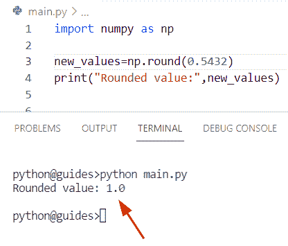

Python NumPy round function

正如您在屏幕截图中看到的，输出显示了精确的整数。

读取: [Python NumPy 读取 CSV](https://pythonguides.com/python-numpy-read-csv/)

## Python numpy 舍入到最近的 5 个

*   在这个程序中，我们将**通过使用 Python** 中的 NumPy 找到最近的值。
*   通过使用 `np.round()` 函数，我们将很容易得到最接近的值，即 `5` 。为了完成这项任务，我们将在 `np.round()` 函数中为**‘4.8’**赋值。一旦您将打印**‘b’**,那么输出将显示确切的值。

**源代码:**

```py
import numpy as np

b= np.round(4.8)
print(b)
```

下面是以下代码的截图

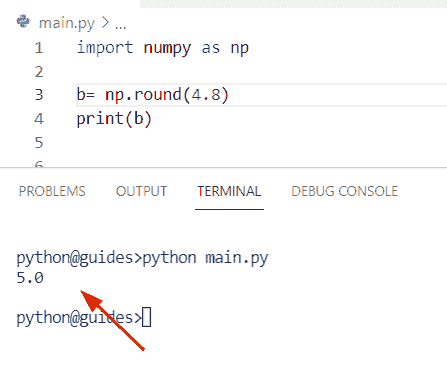

Python numpy round to nearest 5

### 将数字四舍五入到最接近的 5 位

在这个例子中，我们将讨论如何在 Python 中将数字四舍五入到最接近的 5。

为了完成这个任务，我们将使用 `round()` 函数，分配**‘new _ arr’**变量，并将该值除以 `5` ，然后再次乘以 `5` 。

**源代码:**

```py
new_arr = int(input('Enter value:'))

new_output = round(new_arr/5)*5
print("Rounded value:",new_output)
```

下面是以下给定代码的实现

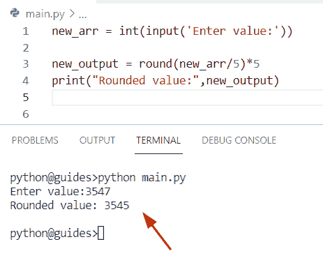

Python numpy round to nearest 5

正如您在截图中看到的，我们输入了数字“3547”，它与 5 最接近的数字是**“3545”**。

阅读: [Python NumPy 日志](https://pythonguides.com/python-numpy-log/)

## Python numpy 四舍五入到最近的 10 位

*   在这一节中，我们将讨论如何使用 NumPy Python 将数字四舍五入到最接近的 10。
*   在这个程序中，我们将从用户处读取一个值，然后使用 `round()` 函数，给**‘new _ arr’**变量赋值，并将该值除以 `10` ，再乘以 5。

**举例:**

```py
new_arr = int(input('Enter value:'))

final = round(new_arr/10)*10
print("Rounded value:",final)
```

你可以参考下面的截图

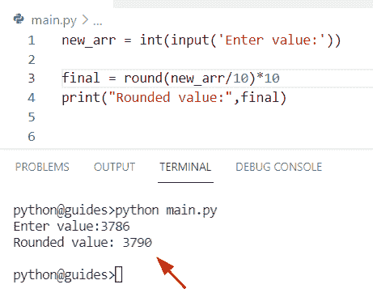

Python numpy round to nearest 10

正如你在截图中看到的，我们输入了数字**‘3786’**，它与 `5` 最接近的数字是**‘3790’**。

阅读: [Python NumPy max](https://pythonguides.com/python-numpy-max-with-examples/)

## Python np.round 不起作用

*   在本节中，我们将讨论 `np.round()` 函数在 Python 中不起作用。
*   我们已经在下面的主题中解决了这个问题。如果有人想解决这个问题，您可以使用“numpy.ndarray 不定义 _round_method”主题。
*   根据 stackoverflow 中的文档，当小数位的值小于 `5` 时，此功能不起作用，给出以下链接。
*   https://stackoverflow.com/questions/51349738/np-round-or-np-around-doesnt-work.

**举例:**

```py
import numpy as np

new_values=np.around(5.543)
print("Rounded value:",new_values)
```

下面是以下代码的截图

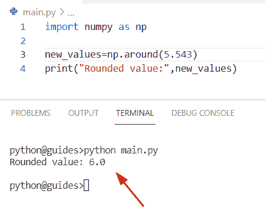

Python np round not working

阅读: [Python NumPy 形状](https://pythonguides.com/python-numpy-shape/)

## Python Numpy 四舍五入到小数点后两位

*   让我们看看**如何使用 Python** 获得 NumPy 数组中的整数。
*   通过使用 `np.round()` 函数，我们可以轻松地执行这个特定的任务，并将**‘new _ val’**分配给它。一旦你将打印**‘z’**，那么输出将显示精确的整数。

**举例:**

```py
import numpy as np 

new_val = np.array([23.58, 34.25, 67.27])
z= np.round(new_val)
print(z)
```

下面是以下给定代码的执行过程

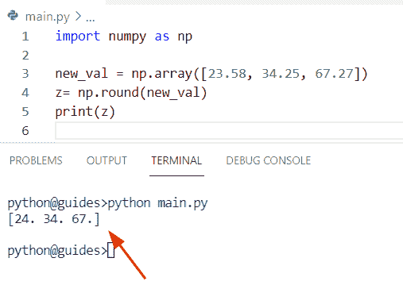

Python Numpy round to 2 decimal places

阅读: [Python NumPy 规格化](https://pythonguides.com/python-numpy-normalize/)

## Python NumPy 舍入所有值

*   在本节中，我们将讨论**如何使用 Python** 对 NumPy 数组中的所有值进行舍入。
*   首先在这个例子中，我们将创建一个列表并为其分配十进制值。现在使用带有 `round()` 函数的 for 循环方法，迭代所有值。一旦你将打印**‘输出’**，那么结果将显示精确的整数值。

**源代码:**

```py
new_arr = ([6.345, 9.389, 8.789, 3.965])

output = [round(i) for i in new_arr]
print("rounded all values:",output)
```

你可以参考下面的截图

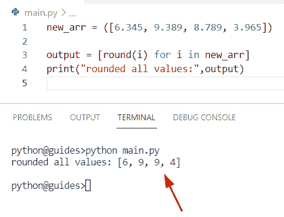

Python NumPy round all values

正如您在屏幕截图中看到的，输出显示了一个四舍五入的值。

阅读: [Python NumPy 3d 数组](https://pythonguides.com/python-numpy-3d-array/)

## Python NumPy arange round

*   在这个程序中，我们将讨论**如何在 Python** 中提取舍入值时使用 arange()函数。
*   通过使用 `numpy.round()` 方法，我们可以轻松地执行这个特定的任务。在这个例子中，我们首先声明一个变量**‘new _ array’**，并给它赋值 `np.arange()` 函数。
*   现在使用 `np.round()` 函数并传递**‘new _ array’**变量作为参数。一旦您将打印**‘z’**，那么输出将显示一个四舍五入的值。

**举例:**

```py
import numpy as np 

new_array = np.arange(5.5, 11.75)
z= np.round(new_array)
print(z)
```

下面是以下给定代码的输出

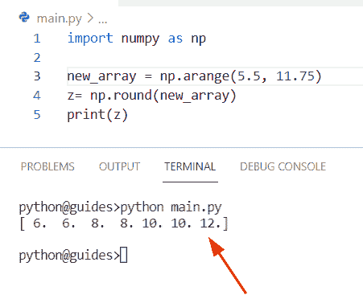

Python NumPy arange round

正如您在屏幕截图中看到的，输出显示了精确的整数。

阅读: [Python NumPy 拆分](https://pythonguides.com/python-numpy-split/)

## Python round NumPy 浮点数组

*   让我们看看如何使用 Python 在浮动数组中使用 `round()` 函数。
*   在本例中，我们将创建一个简单的数组并为其分配十进制值，然后声明一个变量**‘result’**，并为其分配数组**‘val _ of _ ele’**。

**语法:**

下面是 numpy.round()函数的语法

```py
numpy.round_
            (
             a,
             decimals=0,
            )
```

**源代码:**

```py
import numpy as np

val_of_ele = [7.344, 24.745, 89.2233, 18.734, 14.334] 
result = np.round_(val_of_ele)
print ("Rounded Floating values:", result)
```

下面是以下给定代码的实现

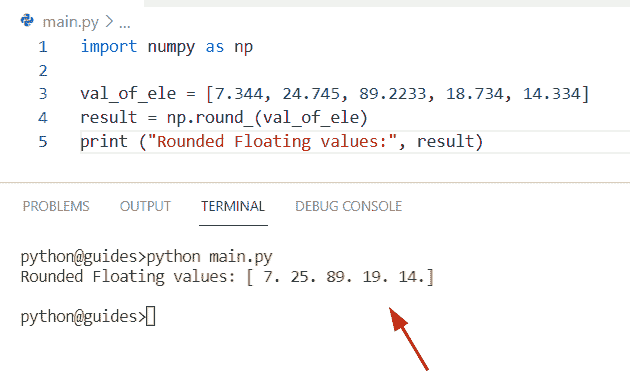

Python round NumPy float array

正如您在屏幕截图中看到的，输出显示了整数值。

阅读: [Python NumPy 数据类型](https://pythonguides.com/python-numpy-data-types/)

## Python numpy 数组循环移位

*   在本节中，我们将讨论如何使用 Python 在 NumPy 数组中循环移位。
*   为了完成这个任务，我们将使用 `numpy.roll()` 方法。在 Python 中， `numpy.roll()` 方法用于沿着指定的轴滚动数组值。如果我们必须使用一个正整数来将值向右移动，而在负整数的情况下，它会将元素向左移动。
*   简单地说，我们可以说元素从第一个位置滚动到最后一个位置，这个方法在 NumPy 模块包中可用。

**语法:**

下面是 numpy.roll()方法的语法

```py
numpy.roll
          (
           a,
           shift,
           axis=None
          )
```

**举例:**

```py
import numpy as np

new_arr = np.array([4,7,8,9,3,8,11])
b=np.roll(new_arr,2)
print(b)
```

在上面的代码中，我们使用了 `np.roll()` 函数将元素从左向右移动。

下面是以下代码的截图

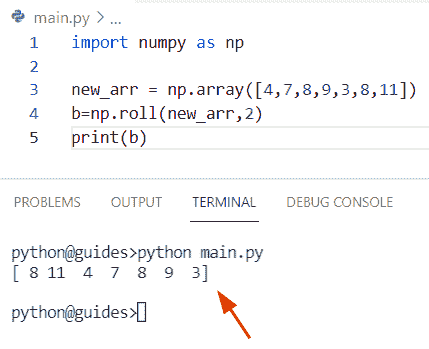

Python numpy array circular shift

阅读: [Python NumPy 重复](https://pythonguides.com/python-numpy-repeat/)

## Python numpy.ndarray 没有定义 _round_method

*   在本期节目中，我们将讨论错误问题 **'numpy.ndarray 如何不定义 _round_method** 。
*   要完成这项任务，我们首先要导入 numpy 库，然后对它使用 round 方法，并将 `np.array()` 函数作为参数传递。

**源代码:**

```py
import numpy as np

new_val = round(np.array([[4.6,7.9],[23,34],[1.8,3.45]]))
print(new_val)
```

下面是以下给定代码的执行过程

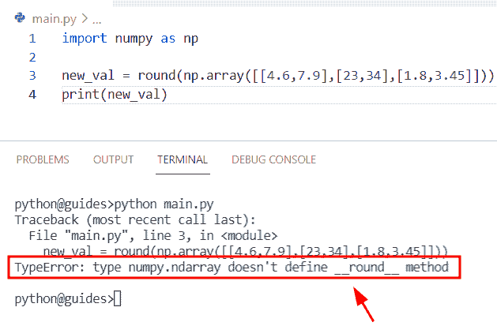

Python numpy ndarray doesn’t define_round_method

正如你在截图中看到的，输出产生了错误**‘Numpy ndarray 没有定义 _round_method**

**解决方案:**

在本例中，我们将把 round 方法改为 `np.round()` 方法，并在数组中分配十进制值。一旦你将打印**‘new _ val’**，那么输出将显示精确的整数。

**举例:**

```py
import numpy as np

new_val = np.round(np.array([[4.6,7.9],[23,34],[1.8,3.45]]))
print(new_val)
```

你可以参考下面的截图

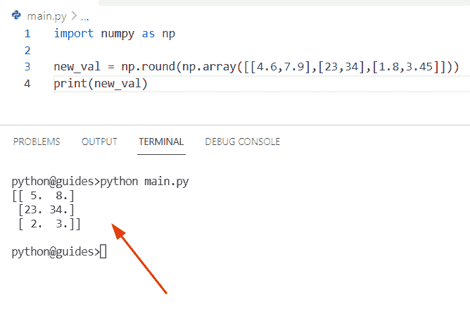

Solution Python numpy ndarray doesn’t define_round_method

阅读: [Python Numpy unique](https://pythonguides.com/python-numpy-unique/)

## Python numpy 循环缓冲区

*   在本期节目中，我们将讨论**如何在 NumPy Python** 中创建高效的循环缓冲区。
*   通过使用集合模块，我们可以很容易地使用 `collection.deque()` 方法。在 Python 中，此方法用于添加和移除左侧或右侧的值。
*   这个方法就像一个堆栈和队列，它在一个集合 Python 对象中可用。

**举例:**

```py
import collections
import numpy as np

arr = collections.deque(maxlen=8)
for z in np.arange(18):
     arr.append(z)
print(arr)
```

你可以参考下面的截图

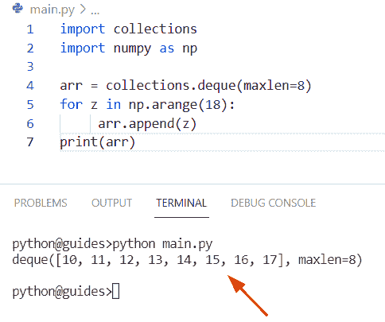

Python numpy circular buffer

您可能会喜欢以下 Python NumPy 教程:

*   [检查 Python 中的 NumPy 数组是否为空](https://pythonguides.com/check-if-numpy-array-is-empty/)
*   [Python NumPy 形状示例](https://pythonguides.com/python-numpy-shape/)
*   [Python 反向 NumPy 数组](https://pythonguides.com/python-reverse-numpy-array/)
*   [Python NumPy max 带示例](https://pythonguides.com/python-numpy-max-with-examples/)
*   [Python NumPy 空数组](https://pythonguides.com/python-numpy-empty-array/)
*   [Python NumPy nan](https://pythonguides.com/python-numpy-nan/)

所以，在这个 Python 教程中，我们学习了**如何在 Python** 中舍入 Numpy 数组。此外，我们已经讨论了这些主题。

*   Python NumPy 舍入
*   Python NumPy 舍入到整数
*   Python NumPy 向下舍入
*   Python NumPy 循环数组
*   Python NumPy 舍入到有效数字
*   Python NumPy round 函数
*   Python numpy round half up
*   Python numpy 舍入到最接近的 5
*   Python numpy 舍入到最接近的 10 位
*   Python np.round 不起作用
*   Python Numpy 四舍五入到小数点后两位
*   Python NumPy 舍入所有值
*   Python NumPy arange round
*   Python round NumPy 浮点数组
*   Python numpy 数组循环移位
*   Python numpy.ndarray 没有定义 _round_method
*   Python numpy 循环缓冲区

[Bijay Kumar](https://pythonguides.com/author/fewlines4biju/)

Python 是美国最流行的语言之一。我从事 Python 工作已经有很长时间了，我在与 Tkinter、Pandas、NumPy、Turtle、Django、Matplotlib、Tensorflow、Scipy、Scikit-Learn 等各种库合作方面拥有专业知识。我有与美国、加拿大、英国、澳大利亚、新西兰等国家的各种客户合作的经验。查看我的个人资料。

[enjoysharepoint.com/](https://enjoysharepoint.com/)[](https://www.facebook.com/fewlines4biju "Facebook")[](https://www.linkedin.com/in/fewlines4biju/ "Linkedin")[](https://twitter.com/fewlines4biju "Twitter")