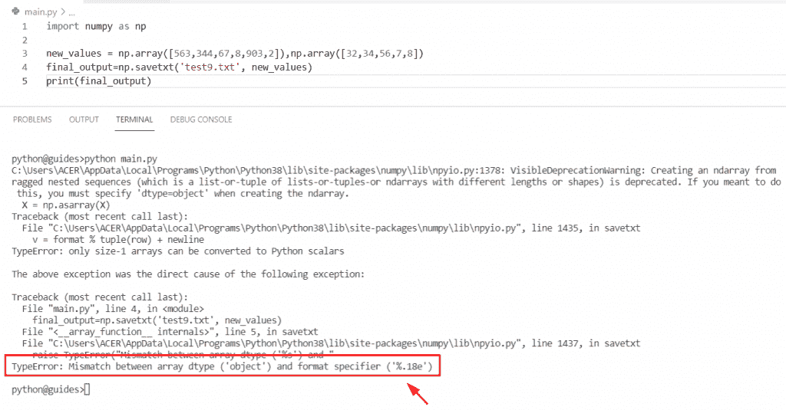

# Python NumPy Savetxt +示例

> 原文：<https://pythonguides.com/python-numpy-savetxt/>

[](https://sharepointsky.teachable.com/p/python-and-machine-learning-training-course)

在这个 [Python NumPy 教程](https://pythonguides.com/numpy/)中，我们将学习**如何在 NumPy** Python 中将数组保存到文本文件中。通过 **Python NumPy savetext 函数**，我们将涵盖这些主题。

*   Python numpy savetxt 格式
*   Python numpy savetxt 标头
*   python num py save txt append(python num py 保存文本附录)
*   Python numpy savetxt 3d 阵列
*   Python numpy savetxt fmt
*   Python numpy savetxt 多个数组
*   Python numpy savetxt csv 文件
*   Python numpy savetxt 字符串
*   Python numpy savetxt 示例
*   不带#的 Python np.savetxt 头
*   Python numpy savetxt 数组数据类型之间不匹配

目录

[](#)

*   [Python numpy savetxt](#Python_numpy_savetxt "Python numpy savetxt")
*   [Python numpy savetxt 格式](#Python_numpy_savetxt_format "Python numpy savetxt format")
    *   [文本文件截图](#Text_file_Screenshot "Text file Screenshot")
*   [Python numpy savetxt 标头](#Python_numpy_savetxt_header "Python numpy savetxt header")
*   [Python numpy savetxt 附录](#Python_numpy_savetxt_append "Python numpy savetxt append")
*   [Python numpy savetxt 3d 阵列](#Python_numpy_savetxt_3d_array "Python numpy savetxt 3d array")
*   [Python numpy savetxt fmt](#Python_numpy_savetxt_fmt "Python numpy savetxt fmt")
    *   [文本文件截图](#Text_file_Screenshot-2 "Text file Screenshot")
*   [Python numpy savetxt 多个数组](#Python_numpy_savetxt_multiple_arrays "Python numpy savetxt multiple arrays")
*   [Python numpy savetxt csv](#Python_numpy_savetxt_csv "Python numpy savetxt csv")
*   [Python numpy savetxt 字符串](#Python_numpy_savetxt_string "Python numpy savetxt string")
*   [Python numpy savetxt 示例](#Python_numpy_savetxt_example "Python numpy savetxt example")
*   [Python np.savetxt 头不带#](#Python_npsavetxt_header_without "Python np.savetxt header without #")
*   [Python 数组 dtype 之间的 numpy savetxt 不匹配](#Python_numpy_savetxt_mismatch_between_array_dtype "Python numpy savetxt mismatch between array dtype")
    *   [解决方案:](#Solution "Solution:")

## Python numpy savetxt

*   在这一节中，我们将讨论如何在 Python 中将 numpy 数组保存到文本文件中。
*   要将 numpy 数组保存到文本文件中，我们可以很容易地使用 `numpy.savetxt()` 方法。在 Python 中，这个方法在 NumPy 包模块中可用，它以 `CSV` 文件格式保存数组编号。
*   这个方法有两个参数，文件名和我们想保存在文本文件中的数据。

**语法:**

让我们看看语法，了解 `numpy.savetxt()` 函数的工作原理

```py
numpy.savetxt
             (
              fname,
               X,
              fmt='%.18e',
              delimiter=' ',
              newline='\n',
              header=' ',
              footer=' ',
              comments= '#',
              encoding=None
             )
```

*   它由几个参数组成
    *   **fname:** 该参数表示文件名，主要用于以 gz 结尾的文件，并且该文件自动保存在压缩的 gzip 中。
    *   **X:** 它是一个输入数组，用于在文本文件中存储数据。
    *   **fmt:** 默认取 **'%.18e'** ，也用于多格式字符串。
    *   **分隔符:**用于分隔列，可选参数。
    *   **newline:** 该参数用于分隔字符串**(行分隔符)**。
    *   **header:** 该参数表示可以在文件的开头写入字符串。
    *   **footer:** 表示可以写到文件末尾的字符串。
    *   **注释:**该参数使用 **'#'** 符号对所选部分进行注释。
    *   **编码:**默认为无值。

**举例:**

让我们举一个例子，看看如何将 numpy 数组保存到一个文本文件中

**源代码:**

```py
import numpy as np

new_array = np.array([24, 15,27,38,15,16,25,38,485,15,16,15])
result=np.savetxt('test9.txt', new_array, delimiter=',', fmt='%d')
print(result)
```

在下面的代码中，我们导入了 numpy 库，然后为数组和赋值声明了一个名为“new_array”的变量。接下来，我们将尝试通过使用 `numpy.savetxt()` 函数将数组元素存储到文本文件中来打印文本文件中的值。

下面是以下给定代码的实现


Python numpy savetxt

阅读: [Python NumPy Normalize +示例](https://pythonguides.com/python-numpy-normalize/)

## Python numpy savetxt 格式

*   在本期节目中，我们将讨论如何使用 Python Numpy `savetxt()` 函数中的 format 选项。
*   在本例中，我们将使用 `numpy.savetxt()` 函数，它将帮助用户将 numpy 数组保存到一个文本文件中，同时我们在函数中使用了 format 参数。
*   该参数表示单个说明符的格式序列为 **'%.4e'** ，默认情况下取 **'%.18e'** 值。

**语法:**

下面是 `numpy.savetxt()` 函数的语法

```py
numpy.savetxt
             (
              fname,
               X,
              fmt='%.18e',
              delimiter=' ',
              newline='\n',
              header=' ',
              footer=' ',
              comments= '#',
              encoding=None
             )
```

**源代码:**

```py
import numpy as np

new_array = np.array([17, 26,37,38,49,94,78,45,85,37,48,98])
new_output= np.savetxt('test9.txt', new_array, fmt='%.18e')
print(new_output)
```

下面是以下代码的截图


Python numpy savetxt format

### 文本文件截图


Python numpy savetxt format txt

阅读:[Python NumPy Random【30 例】](https://pythonguides.com/python-numpy-random/)

## Python numpy savetxt 标头

*   在本节中，我们将讨论如何在 `numpy savetxt()` 函数中使用 header 参数。
*   这里我们可以使用 `numpy.savetxt()` 函数中的 header 参数。此参数表示输入字符串可以写在文件的开头。在这个例子中，我们给出了**头值=【整数值】**。一旦您将打印**‘最终结果’**，那么输出将显示文本文件中的值以及标题名称。

**源代码:**

```py
import numpy as np

new_values = np.array([56, 156,89,27,38,45,89,189,234,356,897,456])
final_result=np.savetxt("test9.txt", new_values, delimiter=",", header="Integer values")
print(final_result)
```

下面是以下给定代码的输出


Python numpy savetxt header

以下是文本文件的输出


Python numpy savetxt header txt

## Python numpy savetxt 附录

我们已经在 [Python NumPy add](https://pythonguides.com/python-numpy-add/) 的一篇文章中讨论了这个主题。您可以获得关于 Numpy savetxt append 的所有信息。

## Python numpy savetxt 3d 阵列

*   在本节中，我们将讨论如何使用 Python `numpy.savetxt()` 函数将三维数组保存到文本文件中。
*   首先，我们将创建一个简单的 3d 数组并赋予整数值。接下来我们将声明一个变量‘final _ result’并使用 `np.savetxt()` 函数。在这个函数中，我们指定了一个数组，文本文件作为参数。
*   现在我们将执行这个程序，并检查如何将 numpy `3-d` 数组保存到一个文本文件中。

**举例:**

```py
import numpy as np

new_arr = np.array([[[45, 78], 
                     [19, 23]], 
                     [[78, 56], 
                     [98, 12]]])
print("Size of array:",new_arr.ndim)
final_result=np.savetxt("test9.txt", new_arr, delimiter=",",fmt='%d')
print("Save array into text file:",final_result)
```

下面是以下给定代码的实现


Python numpy savetxt 3d array

正如您在屏幕截图中看到的，输出显示值 Error: **“预期的 1D 或 2d 数组，而不是 3d 数组”**。出现此错误的原因可能是，根据 numpy.savetxt 文档，要保存到文本文件的数据只有 1d 和 2d 数组。

阅读: [Python NumPy max 带示例](https://pythonguides.com/python-numpy-max-with-examples/)

## Python numpy savetxt fmt

*   在本期节目中，我们将讨论如何在 Python `numpy.savetxt()` 函数中使用 fmt 参数。
*   在这个例子中，我们将使用 `numpy.savetxt()` 函数，在 fmt 参数的帮助下，我们可以很容易地得到整数、浮点或字符串顺序的解。
*   默认情况下，它采用 **fmt='%.18e'** ，但是在这个程序中，我们将赋值 **'%1.4e'** 作为参数。这个值代表文本文件中的指数符号。

**语法:**

下面是 Python `numpy.savetxt()` 函数的语法

```py
numpy.savetxt
             (
              fname,
               X,
              fmt='%.18e',
              delimiter=' ',
              newline='\n',
              header=' ',
              footer=' ',
              comments= '#',
              encoding=None
             )
```

**举例:**

让我们举一个例子，看看如何在 Python `numpy.savetxt()` 函数中使用 fmt 参数

```py
import numpy as np

new_elements = np.array([13,23,45,6,7,8,9])
print("Size of array:",new_elements.ndim)
output=np.savetxt("test9.txt", new_elements, delimiter=",",fmt='%1.4e')
print("Save array into text file:",output)
```

在上面的代码中，我们导入了 numpy 库，然后使用 np.array()函数初始化了一个数组。之后，我们使用了 `numpy.savetxt()` 函数，并将**‘fmt’**赋值为参数。一旦你将打印**‘输出’**，那么结果将显示新的指数值。

下面是以下给定代码的执行过程


Python numpy savetxt fmt

### 文本文件截图


Python numpy savetxt fmt

阅读: [Python NumPy 形状示例](https://pythonguides.com/python-numpy-shape/)

## Python numpy savetxt 多个数组

*   在本节中，我们将讨论如何使用 `numpy.savetxt()` 函数在一个文本文件中保存多个数组。
*   为了执行这个特定的任务，首先我们将使用 `np.array()` 函数创建多个数组。接下来，我们将使用 `numpy.savetxt()` 函数，在这个方法中，我们传递了多个输入数组。一旦您将打印**‘结果’**，那么输出将显示文本文件中的数组。

**源代码:**

```py
import numpy as np

new_elements = np.array([13,23,45,6,7,8,9])
new_elements2 = np.array([16,27,36,56,78,16,18])
new_elements3 = np.array([77,66,289,198,456,901,238])
result= np.savetxt('test9.txt',(new_elements,new_elements2,new_elements3),fmt='%d')
print(result)
```

你可以参考下面的截图


Python numpy savetxt multiple arrays

**输出**


Python numpy savetxt multiple arrays

阅读: [Python 反向 NumPy 数组](https://pythonguides.com/python-reverse-numpy-array/)

## Python numpy savetxt csv

*   在这个程序中，我们将学习如何在 numpy Python 中将 NumPy 数组保存到 CSV 文件中。
*   在 Python 中，CSV 文件用于存储表格数据，并且必须用。CSV 文件扩展名。在这个例子中，我们必须将 numpy 数组存储到一个 CSV 文件中。
*   要首先完成这项任务，我们必须创建一个空的 CSV 文件。接下来，我们必须创建一个程序，在这个程序中，我们必须使用 `np.array()` 函数来初始化一个数组。在这个方法中，我们指定了文件格式、分隔符、字符来得到结果。

**举例:**

```py
import numpy as np

new_array = np.array([25,78,98,56,96,178,29])
result= np.savetxt('final.csv',new_array,fmt='%d')
print(result)
```

下面是以下给定代码的执行过程


Python numpy savetxt CSV

**输出**


Python numpy savetxt CSV

正如您在屏幕截图中看到的，输出显示了阵列。

阅读: [Python NumPy 空数组](https://pythonguides.com/python-numpy-empty-array/)

## Python numpy savetxt 字符串

*   这里我们可以看到如何在 Python `numpy.savetxt()` 函数中使用字符串格式。
*   通过使用 `numpy.savetxt()` 函数我们可以很容易地解决这个问题。在这个程序中，我们将赋值 **'%s'** 值作为参数。该值表示文本文件中的字符串值。

**语法:**

下面是 `numpy.savetxt()` 函数的语法

```py
numpy.savetxt
             (
              fname,
               X,
              fmt='%.18e',
              delimiter=' ',
              newline='\n',
              header=' ',
              footer=' ',
              comments= '#',
              encoding=None
             )
```

**举例:**

让我们举一个例子，检查如何在 numpy.savetxt()方法中使用字符串格式化程序

```py
import numpy as np

values = np.array(['25','78','98','56','96','178','29'])
new_output= np.savetxt('test9.txt',values, delimiter=" ",fmt="%s")
print(new_output)
```

在下面的代码中，我们将导入 NumPy 库，然后使用 np.array()函数创建一个数组。之后，我们声明了一个变量‘new _ output’并分配了一个 numpy.savetxt()函数。在这个函数中，我们使用了字符串 fmt **的'**作为参数。


Python numpy savetxt string

**输出**


Python numpy savetxt string

阅读: [Python NumPy 平均值及示例](https://pythonguides.com/python-numpy-average/)

## Python numpy savetxt 示例

*   在本期节目中，我们将讨论如何在 numpy 数组 Python 中使用 numpy.savetxt()函数。
*   在 Python 中，这个方法在 NumPy 包模块中可用，它以文本文件格式保存数组编号。
*   在本例中，我们在 numpy.savetxt()函数中使用了 header，delimiter 参数。一旦您将打印**‘new _ output’**，那么结果将显示带有标题名称的数组编号。

**举例:**

```py
import numpy as np

new_values = np.array([12, 36,89,67,89,98,190,38,485,15,16,15])
new_output=np.savetxt('test9.txt', new_values, delimiter=',', fmt='%d',header="New elements")
print(new_output)
```

下面是以下代码的截图


Python numpy savetxt example

阅读: [Python NumPy square 举例](https://pythonguides.com/python-numpy-square/)

## Python np.savetxt 头不带#

*   在这个程序中，我们将讨论如何使用不带 **#** 的参数来注释 NumPy Python 中的特定部分。
*   为了完成这个任务，我们将使用 `np.savetxt()` 方法，在这个函数中，我们将使用 comments 参数来指示您是否想要向特定的部分添加一些内容。

**源代码:**

```py
import numpy as np

elements = np.array([78, 67,92,389,198,234,190,38,485,802,983,167])
final_output=np.savetxt('test9.txt', elements, delimiter=',', fmt='%d',header="New Numbers",comments='Add Numbers')
print(final_output)
```

下面是以下给定代码的执行过程


Python np savetxt header without #

**输出截图**


Python np savetxt header without #

正如您在屏幕截图中看到的，输出显示了阵列。

阅读: [Python NumPy 列举示例](https://pythonguides.com/python-numpy-to-list/)

## Python 数组 dtype 之间的 numpy savetxt 不匹配

*   在本节中，我们将讨论如何解决 Python 中数组类型之间的错误 numpy savetxt 不匹配。
*   在这个例子中，我们通过使用包含整数值的函数 `np.array()` 创建了一个数组。接下来，我们使用了 `numpy.savetxt()` 函数并分配了文本文件。

**举例:**

```py
import numpy as np

new_values = np.array([563,344,67,8,903,2]),np.array([32,34,56,7,8])
final_output=np.savetxt('test9.txt', new_values)
print(final_output)
```

下面是以下代码的截图



Python numpy savetxt mismatch between array type

正如您在截图中看到的，输出显示错误**“数组类型和格式说明符不匹配”**。发生这个错误是因为我们没有使用相同形状和大小的数组。在 `numpy.savetxt()` 函数中，数组必须具有相同的大小和形状。

### 解决方案:

在这个例子中，我们刚刚创建了一个大小相同的简单数组，并使用了 **fmt=%d** 作为 `numpy.savetxt()` 函数中的一个参数。

**源代码:**

```py
import numpy as np

new_values = np.array([563,344,67,8,903,2]),([32,34,56,7,8,16])
final_output=np.savetxt('test9.txt', new_values,fmt='%d')
print(final_output)
```

下面是以下给定代码的输出


Solution of Python numpy savetxt mismatch between array type

另外，看看更多关于 Python NumPy 的教程。

*   [Python NumPy 哪里有例子](https://pythonguides.com/python-numpy-where/)
*   [Python NumPy 日志+示例](https://pythonguides.com/python-numpy-log/)
*   [Python NumPy linspace +示例](https://pythonguides.com/python-numpy-linspace/)
*   [Python NumPy 矩阵+示例](https://pythonguides.com/python-numpy-matrix/)
*   [Python NumPy genfromtxt()–完整教程](https://pythonguides.com/python-numpy-genfromtxt/)

因此，在本教程中，我们学习了如何在 NumPy Python 中将数组保存到文本文件中。此外，我们还讨论了这些主题。

*   Python numpy savetxt 格式
*   Python numpy savetxt 标头
*   python num py save txt append(python num py 保存文本附录)
*   Python numpy savetxt 3d 阵列
*   Python numpy savetxt fmt
*   Python numpy savetxt 多个数组
*   Python numpy savetxt csv 文件
*   Python numpy savetxt 字符串
*   Python numpy savetxt 示例
*   不带#的 Python np.savetxt 头
*   Python numpy savetxt 数组数据类型之间不匹配

[Bijay Kumar](https://pythonguides.com/author/fewlines4biju/)

Python 是美国最流行的语言之一。我从事 Python 工作已经有很长时间了，我在与 Tkinter、Pandas、NumPy、Turtle、Django、Matplotlib、Tensorflow、Scipy、Scikit-Learn 等各种库合作方面拥有专业知识。我有与美国、加拿大、英国、澳大利亚、新西兰等国家的各种客户合作的经验。查看我的个人资料。

[enjoysharepoint.com/](https://enjoysharepoint.com/)[](https://www.facebook.com/fewlines4biju "Facebook")[](https://www.linkedin.com/in/fewlines4biju/ "Linkedin")[](https://twitter.com/fewlines4biju "Twitter")