# Python NumPy 形状及示例

> 原文：<https://pythonguides.com/python-numpy-shape/>

[](https://sharepointsky.teachable.com/p/python-and-machine-learning-training-course)

在本 Python 教程中，我们将通过如下几个例子来讨论 `Python NumPy Shape` :

*   Python numpy 形状尺寸
*   Python 数字形状 0
*   Python numpy 形状函数
*   Python 数字形状 1
*   Python 数字形状与整形
*   Python 数字形状与大小
*   Python numpy np.asarray 形状
*   Python numpy 更改数组形状
*   Python numpy 形状元组
*   python numpy 一个范围形状

目录

[](#)

*   [Python 数字形状](#Python_NumPy_Shape "Python NumPy Shape")
*   [Python numpy 外形尺寸](#Python_numpy_shape_dimensions "Python numpy shape dimensions")
*   [Python numpy shape 0](#Python_numpy_shape_0 "Python numpy shape 0")
*   [Python numpy 形状函数](#Python_numpy_shape_function "Python numpy shape function")
*   [Python numpy shape 1](#Python_numpy_shape_1 "Python numpy shape 1")
*   [Python 数字形状 vs 重塑](#Python_numpy_shape_vs_reshape "Python numpy shape vs reshape")
*   [Python 数字形状与大小](#Python_numpy_shape_vs_size "Python numpy shape vs size")
*   [Python numpy np.asarray 形状](#Python_numpy_npasarray_shape "Python numpy np.asarray shape")
*   [Python numpy 改变数组形状](#Python_numpy_change_array_shape "Python numpy change array shape")
*   [Python numpy 形状元组](#Python_numpy_shape_tuple "Python numpy shape tuple")
*   [Python 数字数组形状](#Python_numpy_arange_shape "Python numpy arange shape ")

## Python 数字形状

*   在本节中，我们将讨论 `Python NumPy shape` 。
*   NumPy 数组有一个名为 shape 的函数，它总是返回一个元组，每个索引都有相邻元素的数量。
*   Numpy 数组形状属性用于查找数组的形状。
*   在这个方法中我们可以很容易地使用 `numpy.shape()` 函数。

**语法:**

下面是 `numpy.shape()` 的语法

```py
numpy.shape
           (
            arr
           )
```

*   它由几个参数组成。
    *   **数组:**输入数组
    *   **返回:**shape 函数的值总是给出相邻 np 的长度。数组。

**举例:**

让我们举一个例子来检查如何实现 `Python NumPy shape`

```py
import numpy as np

arr2= np.array([[4, 2, 3, 2, 1, 8],
                [5, 4,6,7,8,9]])
res = np.shape(arr2)

print(res)
```

在上面的例子中，数组返回(2，6)，这意味着数组有 2 个维度，每个维度有 6 个值。

下面是以下代码的截图

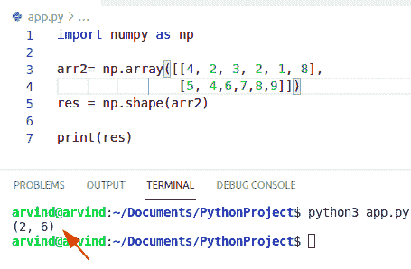

Python NumPy shape

阅读 [Python NumPy Random +示例](https://pythonguides.com/python-numpy-random/)

## Python numpy 外形尺寸

*   在本节中，我们将讨论 **Python NumPy 形状维度**。
*   np 的维数。ndarray 可以用属性 ndim 表示为整数值 int。
*   在这个方法中，我们可以很容易地使用函数 ndarray.ndim。
*   数组的轴(维度)数。
*   矩阵的维数是矩阵的行数和列数。矩阵的结构可以是列表的列表，也可以是数组的数组。

**举例:**

让我们举一个例子来检查如何实现 NumPy shape 维度。

```py
import numpy as np

a = np.array([[2,3],[3,4]])
b = a.ndim
print(b)
```

首先在上面的代码中，我们将使用函数 numpy 创建一个数组。数组。现在创建一个变量并分配一个函数 n.dim 来检查给定数组的维数。

下面是以下代码的截图

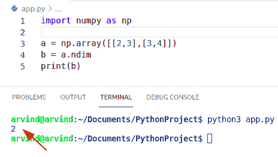

Python NumPy shape dimensions

读取 [Python 反向 NumPy 数组](https://pythonguides.com/python-reverse-numpy-array/)

## Python numpy shape 0

*   在本节中，我们将讨论 `Python NumPy shape 0` 。
*   Shape[0]是 n，Shape 是一个元组，它总是给出数组的维数。形状是一个元组，它指示数组中的维数。
*   numpy 数组的 shape 函数返回数组的维数。
*   如果 Y 有 u 行 v 列，那么 Y.shape 就是(u，v)。所以 Y.shape[0]就是 v。

**举例:**

让我们举一个例子来检查如何实现 numpy shape 0

```py
import numpy as np

a = np.array([[2,3],[3,4]])
b = np.shape(a)
c = a.shape[0]
print(c)
```

在上面的例子中，我们必须使用函数 np。要给的形状

下面是以下代码的截图

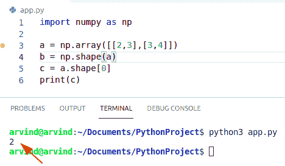

Python numpy shape 0

阅读 [Python NumPy 空数组示例](https://pythonguides.com/python-numpy-empty-array/)

## Python numpy 形状函数

*   在本节中，我们将讨论 **Python NumPy shape 函数**。
*   numpy 模块提供了一个 shape 函数来表示数组的形状和大小。数组的形状是每个维度中元素的数量。
*   在 NumPy 中，我们将使用一个名为 shape 的函数来返回一个元组，元组的元素给出了数组维数的长度。
*   shape 属性总是返回一个表示每个维度长度的元组。一维数组是一个行向量，它的形状是一个后跟逗号的单值序列。一维数组没有行和列，所以 shape 函数返回一个值元组。

**语法:**

以下是 Python numpy shape 函数的语法

```py
numpy.shape
           (
            arr
           )
```

*   它由几个参数组成。
    *   **数组:**输入数组
    *   **返回:**形状元组的值给出了相邻数组维数的长度。

**举例:**

让我们举一个例子来检查如何实现 Python NumPy shape 函数

```py
import numpy as np

arr = np.array([2,3,4,5,6,7,8])
print(arr)

print('Array Shape = ', np.shape(arr))
```

在上面的代码中，我们首先导入一个 NumPy 库并创建一个一维数组，它是一个只有一个值而不是整数值的元组。只有一个元素的元组有一个序列逗号。

下面是以下代码的截图

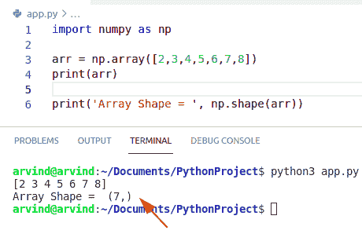

Python numpy shape function

阅读 [Python NumPy nan](https://pythonguides.com/python-numpy-nan/)

## Python numpy shape 1

*   在本节中，我们将讨论 `Python NumPy shape 1`
*   在 numpy 中，有些函数返回 shape(R，1)，但有些返回(R，)。
*   这将使矩阵乘法更加复杂，因为需要明确的整形。
*   Shape[1]是 n.shape 是一个元组，它总是给出数组的维数。shape 函数是一个元组，它给出了数组中维数的排列。
*   如果 Y 有 w 行和 z 列，那么 Y.shape 就是(w，z)。所以 Y.shape[1]就是 z。

**举例:**

让我们举个例子来检查如何实现 `Python NumPy shape 1`

```py
import numpy as np

a = np.array([[2,3],[3,4]])
b = np.shape(a)
print('Column shape=', a.shape[1])
print('Array Shape = ', np.shape(a))
```

在上面的代码中，我们将导入一个 numpy 库，并使用函数 NumPy 创建一个数组。数组。现在我们可以很容易地使用函数 np。形状，并将值 1 作为参数传递。输出将显示数组中的列。

下面是以下代码的截图

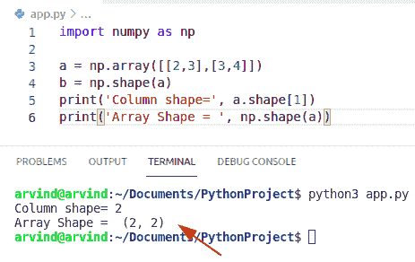

Python numpy shape 1

## Python 数字形状 vs 重塑

*   在本节中，我们将讨论`Python NumPy shape vs reshape`。
*   Np。如果不能形成正确的视图，reshape 将复制数据，而获取形状将引发错误，而不是复制数据。
*   shape 函数总是给出数组维数的元组，并且可以很容易地用来改变数组的维数。
*   reshape 函数在不改变数组值的情况下给数组一个新的形状。它创建一个数组，但不更新原始数组本身。
*   shape 函数总是返回一个元组，告诉我们每个维度的长度，而在 shape 函数的情况下，如果可能，它返回现有数据的新值，而不是创建原始数组的完整副本。

**举例:**

```py
import numpy as np

a = np.array([2,3,4,5])
print('Array Reshape',np.reshape(a,(2,2)))# Reshape function 

print('Array shape',np.shape(a)) # shape function
```

在上面的代码中，我们将导入一个 numpy 库，并使用函数 NumPy 创建一个数组。数组。现在，我们可以使用 np.reshape()函数以 2*2 矩阵的形式显示新数组。此外，我们将等同于函数，它将返回表单形状中的维度数组。

下面是以下代码的截图

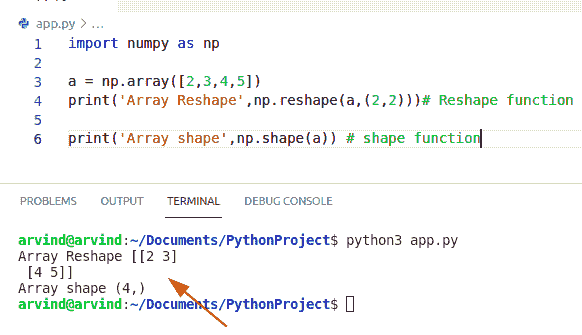

Python numpy shape vs reshape

读取[值错误:用序列](https://pythonguides.com/valueerror-setting-an-array-element-with-a-sequence/)设置数组元素

## Python 数字形状与大小

*   在本节中，我们将讨论 **Python NumPy 的形状与大小**。
*   形状与 n-darray 的尺寸大小相比较。数组的大小与数组中存储的元素数量有关。
*   国民党。size()函数的参数很少。首先是一个数组，这需要一个参数需要给一个数组。第二个是轴，默认情况下是参数。轴不存储任何值，根据条件，您可以更新它，而 Np.shape()函数包含两个参数输入数组，它将始终返回 shape 函数的元素，给出相应数组维度的长度。
*   在 np 中。size()函数计算给定轴上元素的数量，对于 numpy.shape()函数返回一个函数，其中每个索引都包含相邻元素的数量。

**举例:**

```py
import numpy as np

a = np.array([[2,3,4,5],[4,5,6,7]])

print('Array shape',np.shape(a)) # shape function

# for numpy size function
b = np.array([[4,7,8,9],[1,2,3,4]])
print('Array size',np.size(b)) # size function
```

在上面的例子中，我们将导入一个 numpy 库，并使用函数 NumPy 创建一个数组。数组。现在，我们将使用函数 np。形状来标识数组的维度。

在这个例子中，你也可以检查我们在得到一个数组的维数后创建了一个数组，并使用了函数 np。size()，它将显示一个数组的大小。

下面是以下代码的截图

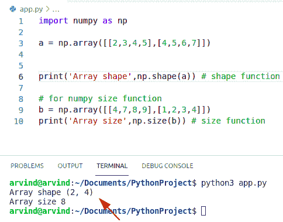

Python numpy shape vs size

阅读 [Python NumPy 平均值及示例](https://pythonguides.com/python-numpy-average/)

## Python numpy np.asarray 形状

*   在本节中，我们将讨论 **Python NumPy np.asarray 函数**。
*   当我们想要将输入转换为数组时，使用 asarray()函数。输入可以是列表、元组、n 数组等。
*   输入数据可以是列表、元组、元组列表、列表元组等形式。
*   这个函数在 python 标准库中的 numpy 模块中总是可用的。

**语法:**

下面是 **numpy.asarray()函数**的语法。

```py
numpy.asarray
             (
              arr,
              dtype=None,
              order=None,
             )
```

*   它由几个参数组成
    *   **arr:** 输入数据，可以转换成数组的任何形式。这包括列表、元组、元组的元组、列表的元组和 numpy 维数组。
    *   **dtype:** 是语法中可选的 dtype 参数。如果我们没有在语法中声明它，默认情况下它是从输入数据中定义的。
    *   **Order:** 这也是语法中的可选参数。它还决定是否使用行或列为主的内存表示。
    *   **返回:**如果输入已经是等同于 dtype 和 order 的 numpy 维数组。如果数组是 numpy 维数组的子类，则返回基类 numpy 维数组。

**举例:**

让我们举一个例子来检查如何实现 np.asarray shape

```py
import numpy as np

a = np.array([[2,3,4,5],[4,5,6,7]])
b = np.asarray(a)
print(b)
```

在上面的代码中，我们将导入一个 numpy 库，并使用该 NumPy 创建一个数组。数组函数。现在创建一个变量并分配一个 numpy 函数。阿萨瑞。可以转换为 numpy 数组的任何形式的输入数据。

下面是以下代码的截图

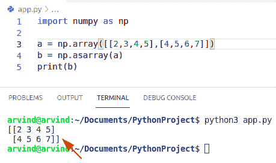

Python numpy np. asarray shape

阅读 [Python NumPy 绝对值示例](https://pythonguides.com/python-numpy-absolute-value/)

## Python numpy 改变数组形状

*   在本节中，我们将讨论 **Python NumPy 改变数组形状**。
*   在这个方法中我们可以很容易地使用**函数 numpy . shape()**。
*   它会给数组一个新的形状，而不会删除它的数据。
*   使用 shape()函数也可以改变数组的形状。如果指定的维数大于原始数组，数组中多余的空间将用原始 numpy 数组的重复副本填充。
*   重塑一个 numpy 数组仅仅意味着改变给定数组的形状，形状基本上告诉数组的值和维数的数目，通过重塑一个数组，我们可以添加或删除维数，或者改变每个维数中的元素数目。

**语法:**

下面是 numpy.reshape()函数的语法

```py
numpy.reshape
             (
              arr,
              newshape,
              order='C'
             )
```

*   它由几个参数组成
    *   **arr:** 要整形的数组。
    *   **new shape:**numpy 形状应该可以与新的原始形状压缩在一起。如果给定一个整数值，那么结果将是该长度的一维数组。
    *   **返回:**reshaved _ arr(这将是一个新的对象，如果可能的话；否则就是抄袭)。

**举例:**

```py
import numpy as np

a = np.array([[2,3,4],[4,5,6]])
b = np.shape(a)
print("array shape",b)
c= np.reshape(a,(3,2))
print("array reshape",c)
```

首先在上面的代码中，我们将创建一个 numpy 数组并使用函数 numpy。形状。之后会以 ndarray 维度的形式表示结果。

下面是以下代码的截图

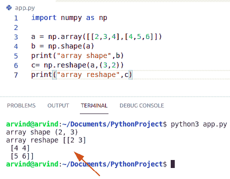

Python numpy change array shape

阅读 [Python NumPy linspace](https://pythonguides.com/python-numpy-linspace/)

## Python numpy 形状元组

*   在本节中，我们将讨论 **Python NumPy 形状元组**。
*   简单元组或列表的形状可以用内置的 len()方法获得。len()函数将返回一个整数，描述给定列表中对象的数量。
*   元组和列表是存储多个值的对象，确定元组或列表对象中元素(或形状)的数量是一项简单的任务。
*   在这个方法中，我们可以很容易地使用函数 len()来获得元组的形状。
*   对象中包含的元素的数量是从不计算的，所以 len()函数帮助用户提供元素的数量。
*   len()函数只接受一个参数:iterable 对象。

**举例:**

```py
import numpy as np

a = (2,3,4,5,6,7)
b = len(a)
print("Shape of the tuple",b)
```

下面是以下代码的截图

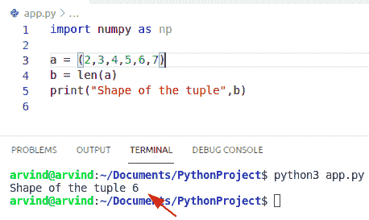

Python NumPy shape tuple

## Python 数字数组形状

*   在本节中，我们将讨论 `Python NumPy arange shape` 。
*   在这个例子中，我们可以很容易地使用函数 `numpy.arange()` 和 numpy.shape()。
*   numpy.arange()是一个 numpy 方法，该方法返回 Numpy 维数组对象，该对象包含给定范围内均匀分布的值。国民党。arange()函数接受几个参数，包括开始、步骤、停止和数据类型，并返回给定间隔内均匀分布的值。

**语法:**

```py
numpy.arange
            (
             start,
             stop,
             step,
             dtype
            )
```

*   它由几个参数组成。
    *   **start:** 可选参数。间隔的开始。
    *   **停止:**间隔结束
    *   **步骤:**可选参数。

**举例:**

```py
import numpy as np

arr = np.arange(2,10,3)
arr2 = np.shape(arr)
print(arr2)
```

下面是以下代码的截图

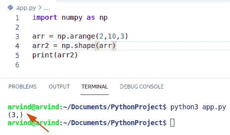

Python NumPy arange shape

您可能会喜欢以下 Python 教程:

*   [Python NumPy 列举示例](https://pythonguides.com/python-numpy-to-list/)
*   [Python 字典过滤器+示例](https://pythonguides.com/python-dictionary-filter/)
*   [Python NumPy Replace +示例](https://pythonguides.com/python-numpy-replace/)
*   [Python NumPy round + 13 例](https://pythonguides.com/python-numpy-round/)
*   [Python NumPy Divide](https://pythonguides.com/python-numpy-divide/)
*   [Python Numpy 独一无二](https://pythonguides.com/python-numpy-unique/)
*   [Python NumPy 2d 数组](https://pythonguides.com/python-numpy-2d-array/)
*   [Python NumPy 规格化](https://pythonguides.com/python-numpy-normalize/)
*   [Python 字典长度](https://pythonguides.com/python-dictionary-length/)

在这个 Python 教程中，我们通过几个例子学习了 `Python NumPy shape` 。

*   Python numpy 形状尺寸
*   Python 数字形状 0
*   Python numpy 形状函数
*   Python 数字形状 1
*   Python 数字形状与整形
*   Python 数字形状与大小
*   Python numpy np.asarray 形状
*   Python numpy 更改数组形状
*   Python numpy 形状元组
*   python numpy 一个范围形状

[Bijay Kumar](https://pythonguides.com/author/fewlines4biju/)

Python 是美国最流行的语言之一。我从事 Python 工作已经有很长时间了，我在与 Tkinter、Pandas、NumPy、Turtle、Django、Matplotlib、Tensorflow、Scipy、Scikit-Learn 等各种库合作方面拥有专业知识。我有与美国、加拿大、英国、澳大利亚、新西兰等国家的各种客户合作的经验。查看我的个人资料。

[enjoysharepoint.com/](https://enjoysharepoint.com/)[](https://www.facebook.com/fewlines4biju "Facebook")[](https://www.linkedin.com/in/fewlines4biju/ "Linkedin")[](https://twitter.com/fewlines4biju "Twitter")