# Python NumPy Split + 11 示例

> 原文：<https://pythonguides.com/python-numpy-split/>

[](https://sharepointsky.teachable.com/p/python-and-machine-learning-training-course)

在本 [Python 教程](https://pythonguides.com/python-download-and-installation/)中，我们将学习**如何在 Python** 中拆分 NumPy 数组。此外，我们将涵盖这些主题。

*   Python NumPy 分割二维数组
*   Python NumPy 拆分字符串
*   Python NumPy 拆分列
*   Python NumPy 拆分行
*   Python NumPy split 函数
*   Python 通过值分割 numpy 数组
*   Python numpy 随机拆分
*   Python numpy 按元素划分
*   Python numpy 将数组分割成块
*   Python numpy.ndarray 对象没有属性“split”
*   Python np.log 除以零

目录

[](#)

*   [Python NumPy 拆分](#Python_NumPy_split "Python NumPy split")
*   [如何在 Python 中拆分 Numpy 数组](#How_to_split_Numpy_array_in_Python "How to split Numpy array in Python")
*   [Python NumPy 拆分二维数组](#Python_NumPy_split_2d_array "Python NumPy split 2d array")
*   [如何在 Python 中拆分二维数组](#How_to_split_a_2-dimensional_array_in_Python "How to split a 2-dimensional array in Python")
*   [Python NumPy 拆分字符串](#Python_NumPy_split_string "Python NumPy split string")
*   [Python NumPy 拆分列](#Python_NumPy_split_columns "Python NumPy split columns")
*   [如何在 NumPy 数组中按列拆分](#How_to_split_column-wise_in_NumPy_array "How to split column-wise in NumPy array")
*   [Python NumPy 拆分行](#Python_NumPy_split_row "Python NumPy split row")
*   [Python NumPy 拆分函数](#Python_NumPy_split_function "Python NumPy split function")
*   [Python 按值拆分 numpy 数组](#Python_split_numpy_array_by_value "Python split numpy array by value")
*   [Python numpy 随机拆分](#Python_numpy_random_split "Python numpy random split")
*   [Python numpy 按元素划分](#Python_numpy_divide_element_wise "Python numpy divide element wise")
*   [Python numpy 将数组分割成块](#Python_numpy_split_array_into_chunks "Python numpy split array into chunks")
*   [Python numpy.ndarray 对象没有属性‘split’](#Python_numpyndarray_object_has_no_attribute_split "Python numpy.ndarray object has no attribute ‘split’")
*   [解决方案](#Solution "Solution")
*   [Python np.log 除以零](#Python_nplog_divide_by_zero "Python np.log divide by zero")

## Python NumPy 拆分

*   在本期节目中，我们将讨论**如何在 Python** 中拆分 NumPy 数组。
*   这里我们可以使用 `split()` 函数来拆分输入的字符串或整数。在 Python 中， `split()` 函数用于将数组拆分成不同的形状，该方法总是在拆分给定的字符串后返回一个子字符串列表。
*   这个方法有三个参数，数组必须分成 N 个相等的数组。

**语法:**

下面是 numpy.split()函数的语法

```py
Numpy.split
           (
            ary,
            indices_or_sections,
            axis=0
           )
```

*   它由几个参数组成
    *   **ary:** 这个参数指定了我们要拆分的数组。
    *   **indexes _ or _ sections:**该参数可以是一个整数，在这种情况下，如果数组不可能断开，那么它将产生一个错误，如果 indexes 的值是一个一维整数，那么数组将按照给定的整数进行拆分。
    *   **轴:**默认为 `0` 和要分割的轴。

**举例:**

我们举个例子，检查一下**如何在 Python** 中拆分数组。

**源代码:**

```py
import numpy as np

arr1 = np.array([3,8,15,27,15,23,15,26,11,13])
b = np.split(arr1, 5)
print("split array",b)
```

在上面的代码中，我们首先创建了一个 numpy 一维数组，然后我们想通过使用 `np.split()` 方法将数组拆分成 `5` 个不同的部分，我们可以解决这个问题。一旦你将打印**‘b’**，那么输出将显示数组的子部分。

下面是以下给定代码的实现

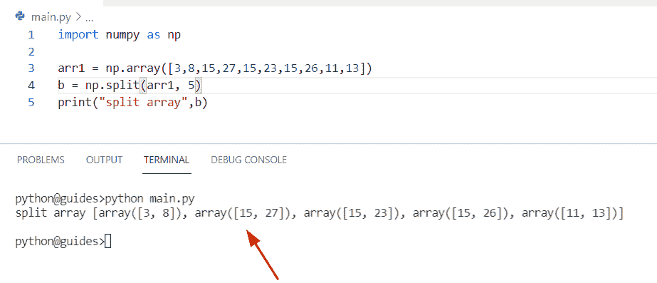

Python NumPy split

*   [Python NumPy Normalize +示例](https://pythonguides.com/python-numpy-normalize/)

## 如何在 Python 中拆分 Numpy 数组

在这个例子中，我们将对 NumPy 字符串数组使用 `np.split()` 方法。通过使用 `split()` ，我们可以很容易地将数组分成四个相等的部分。

**源代码:**

```py
import numpy as np

arr1 = np.array(['Germany', 'Australia', 'China','Japan']) 
new_result= np.split(arr1,4)
print("array split:",new_result)
```

下面是以下代码的截图

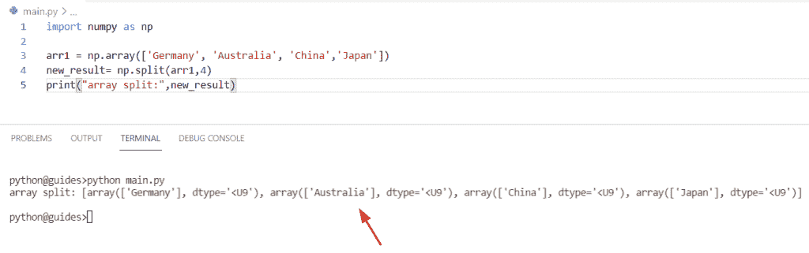

Python NumPy split

这就是 Python 中拆分 NumPy 数组的方法。

*   [Python NumPy Random](https://pythonguides.com/python-numpy-random/)

## Python NumPy 拆分二维数组

*   本节我们将讨论**如何在 Python** 中拆分 numpy 二维数组。
*   这里我们可以使用 `split()` 方法来按行或按列拆分二维数组。在这个例子中，我们已经创建了一个简单的 numpy 数组，现在我们想通过使用 `np.split()` 来打破**二维**数组。

**举例:**

```py
import numpy as np

new_arr = np.array([[34,12,31,75],

                [14,17,18,93],

                [17,21,43,88]])
b = np.split(new_arr,3)
print(b) 
```

你可以参考下面的截图

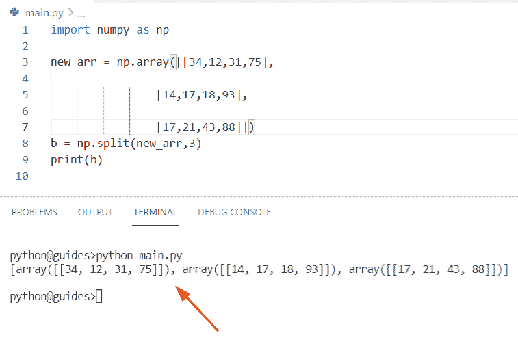

Python NumPy split 2d array

*   [Python NumPy max 带示例](https://pythonguides.com/python-numpy-max-with-examples/)

## 如何在 Python 中拆分二维数组

通过使用 random()函数，我们生成了一个数组**‘arr 1’**，并使用 `np.hsplit()` 方法来拆分 NumPy 数组。

在 Python 中，该方法用于将一个数组按列划分为多个子数组，同时我们还应用了 `np.vsplit()` 方法来拆分行元素。

**语法:**

下面是 numpy.hsplit()方法的语法

```py
numpy.hsplit
            (
             ary,
             indices_or_sections
            )
```

vsplit()方法的语法

```py
numpy.vsplit
            (
             ary,
             indices_or_section
            )
```

**源代码:**

```py
import numpy as np

arr1 = np.random.randint(2, 10, size=(9,9))
new_result = [np.hsplit(i, 3) for i in np.vsplit(arr1,3)]

print(new_result) 
```

在上面的代码中，我们结合使用了 `hsplit()` 和 `vsplit()` 方法来拆分二维数组。

下面是以下给定代码的输出

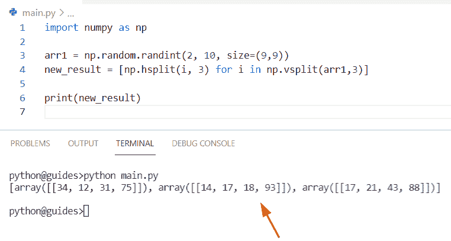

Python NumPy split 2d array

*   [Python NumPy 形状示例](https://pythonguides.com/python-numpy-shape/)

## Python NumPy 拆分字符串

*   让我们看看**如何使用 Python** 拆分 NumPy 字符串。
*   在这个例子中，我们将对 numpy 字符串数组使用 `np.split()` 方法。为了完成这个任务，我们首先要导入一个 numpy 库，然后使用 np.array 创建一个数组，在这个数组中我们接受字符串的值。现在声明一个变量**‘final _ RES’**，并分配 `np.split()` 方法将数组分割成子数组。

**举例:**

```py
import numpy as np

new_array = np.array(['John', 'Micheal', 'William','George','oliva']) 
final_res= np.split(new_array,5)
print("array split:",final_res)
```

下面是以下给定代码的执行过程

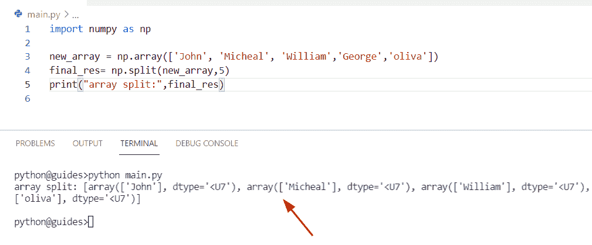

Python NumPy split string

*   [Python 反向 NumPy 数组](https://pythonguides.com/python-reverse-numpy-array/)

## Python NumPy 拆分列

*   在这一节中，我们将讨论**如何使用 Python** 在 NumPy 数组中拆分列。
*   在这个例子中，我们将使用概念数组转置。在 Python 中，转置矩阵将行的元素移动到列，将列的项目移动到行。简单地说，它将反转数组中的值。

**语法:**

下面是数组转置的语法

```py
ndarray.T
```

**举例:**

```py
import numpy as np

new_output = np.array([[63,13,15],[18,27,18],[14,94,55]])
col1, col2, col3 = new_output.T
print(col1)
print(col2)
print(col3)
```

在上面的代码中，我们创建了一个数组，并声明了名为' **col1 '，' col2 '，' col3'** 的变量，其中我们为数组 transpose `arr.T.` 赋值。

你可以参考下面的截图

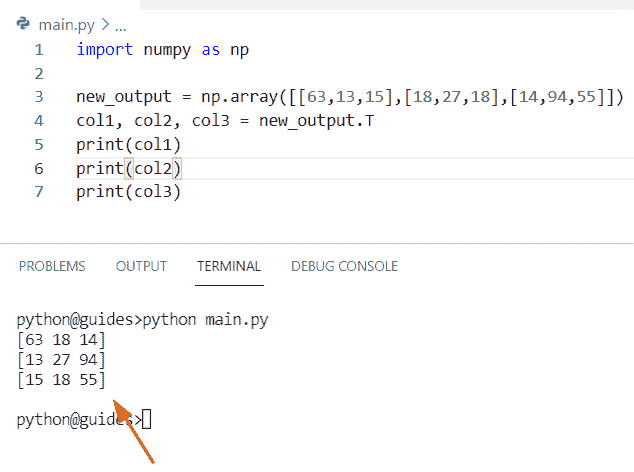

Python NumPy split columns

*   [Python NumPy 空数组示例](https://pythonguides.com/python-numpy-empty-array/)

## 如何在 NumPy 数组中按列拆分

这是另一种通过使用 `np.hsplit()` 方法来拆分数组中按列排列的元素的方法。在 Python 中，该方法用于将数组按列划分为多个子数组。

**源代码:**

```py
import numpy as np 

new_arr2 = np.array([[23,21,15],[9,5,18],[80,90,55]])
result = np.hsplit(new_arr2,3) 
print("Column-wise splitting:",result)
```

下面是以下代码的截图

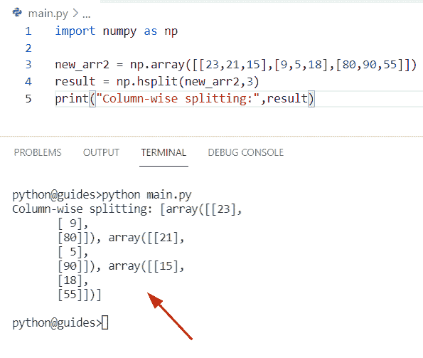

Python NumPy split columns

*   [Python NumPy nan](https://pythonguides.com/python-numpy-nan/)

## Python NumPy 拆分行

*   在这个程序中，我们将讨论**如何使用 Python** 拆分行元素。
*   为了执行这个特定的任务，我们将使用 `np.vsplit()` 方法来分解给定数组中的行元素。在 Python 中，这个方法用于将一个数组垂直分割成不同的子数组，默认情况下，它取 axis=0，但我们不会在程序中提到这个参数。

**语法:**

下面是 numpy `vsplit()` 方法的语法

```py
numpy.vsplit
            (
             ary,
             indices_or_section
            )
```

**源代码:**

```py
import numpy as np 

new_array = np.array([[63,13,15],[18,27,18],[14,94,55]])
result = np.vsplit(new_array,3) 
print("Row-wise splitting:",result)
```

在上面的程序中，我们刚刚使用 `np.array()` 创建了一个简单的 NumPy 数组，并为其分配了整数值。现在我们想通过使用 `np.split()` 方法垂直(按行)分割元素。

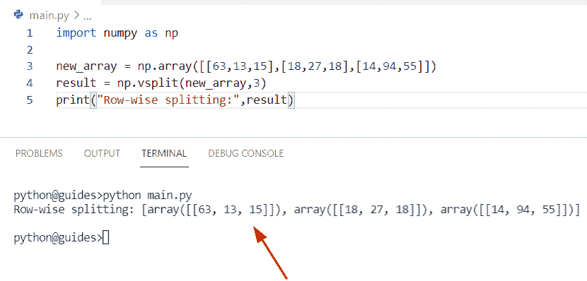

Python NumPy split row

正如您在截图中看到的，输出有三个不同的 numpy 数组

*   [值错误:用序列](https://pythonguides.com/valueerror-setting-an-array-element-with-a-sequence/)设置数组元素

## Python NumPy 拆分函数

*   这里我们可以看到**如何使用 split()函数**拆分 Python Numpy 数组。
*   我们已经在每个例子中使用了这种方法，这种方法基本上用于分裂或者我们可以将数组分成子数组。

**语法:**

下面是 split()函数的语法

```py
Numpy.split
           (
            ary,
            indices_or_sections,
            axis=0
           )
```

**举例:**

```py
import numpy as np

new_val = np.array([17, 45, 32, 15, 18, 93])
result = np.split(new_val, 2)
print(result)
```

下面是以下给定代码的实现

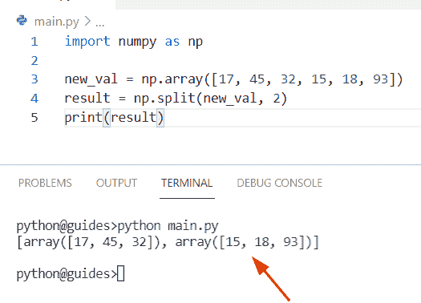

Python NumPy split function

正如您在上面的屏幕截图中看到的，输出将阵列显示为两个不同的部分

*   [Python NumPy 平均值与示例](https://pythonguides.com/python-numpy-average/)

## Python 按值拆分 numpy 数组

*   在本节中，我们将讨论如何使用 Python 基于值分割 numpy 数组。
*   在这个例子中，我们将使用 `np.arange()` 函数的概念来创建一个数组。现在使用 `np.split()` 方法根据给定的值划分数组。

**举例:**

```py
import numpy as np

new_arr = np.arange(12).reshape(4,3)
z=np.array_split(new_arr, np.where(new_arr[:, 0]== 6)[0][0])
print(z)
```

下面是以下给定代码的输出

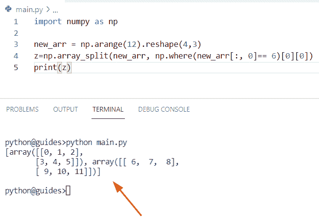

Python split numpy array by value

*   [Python NumPy 绝对值举例](https://pythonguides.com/python-numpy-absolute-value/)

## Python numpy 随机拆分

*   在本期节目中，我们将讨论**如何使用 Python** 拆分 numpy 个随机元素。
*   为了完成这个任务，我们将使用 np.random.shuffle()方法，这个函数将帮助用户沿着第一个给定的轴移动数组，它将修改 NumPy 数组中项目的位置，并且它总是返回 None。

**语法:**

下面是 `np.random.shuffle()` 方法的语法

```py
random.shuffle(x)
```

**注:**x 参数表示可变序列。

**源代码:**

```py
import numpy

arr = numpy.random.rand(10, 3)
b = numpy.random.shuffle(arr)
m, n = arr[:70,:], arr[70:,:]
print(m, n)
```

在上面的代码中，我们使用了 `np.arange()` 函数来创建一个数组，这个函数在提供的限制范围内分隔值。

你可以参考下面的截图

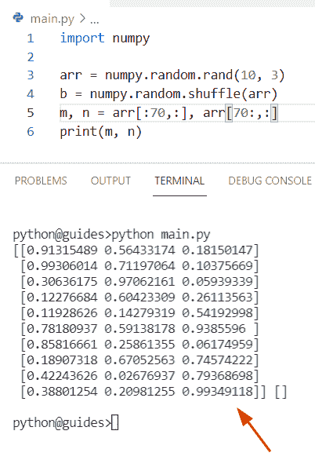

Python numpy random split

*   [Python NumPy square 示例](https://pythonguides.com/python-numpy-square/)

## Python numpy 按元素划分

*   这里我们可以看到**如何使用 Python** 按元素划分 Numpy 数组。
*   在这个例子中，我们有两个 numpy 数组，我们想用第二个数组除第一个 numpy 数组的每一项。为了完成这个任务，我们可以使用 `/` 运算符，这个操作数用于除法运算符。

**源代码:**

```py
import numpy as np

val1 = np.array([50,55,66])
val2 = np.array([5,5,6])

new_result = val1/val2
print(new_result)
```

在上面的代码中，我们使用/操作符并将结果存储在**‘new _ result’**中。一旦您将打印**‘新结果’**，那么输出将显示 val1 和 val2 的除法。

下面是以下给定代码的执行过程

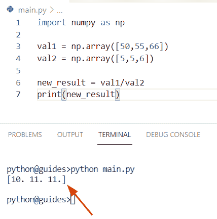

Python numpy divide element-wise

*   [Python NumPy 列举示例](https://pythonguides.com/python-numpy-to-list/)

## Python numpy 将数组分割成块

*   在这一节中，我们将讨论如何使用 Python 将数组分割成块。
*   通过使用 `split()` 函数，我们可以执行这个特定的任务，并将数组拆分成三个不同的子数组。

**举例:**

```py
import numpy as np

arr1 = np.array([5,6,7,8,9,23])
d = np.array_split(arr1, 3)
print(d)
```

下面是以下代码的截图

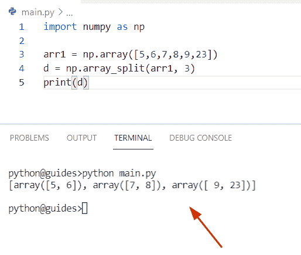

Python numpy split the array into chunks

*   [Python NumPy 读取 CSV](https://pythonguides.com/python-numpy-read-csv/)

## Python numpy.ndarray 对象没有属性‘split’

*   在本节中，我们将讨论错误显示消息 **'numpy.ndarray'** 对象没有属性 **'split'** 。
*   首先，我们创建了一个 numpy 数组，然后使用 `np.ndarray.split()` 将数组拆分成子数组，但是在这种情况下，当我们运行这个程序时，输出将显示 numpy 没有属性“split”。

**源代码:**

```py
import numpy as np

new_arr = np.arange(4)
output = np.ndarray_split(new_arr, 3)
print(output)
```

**截图:**

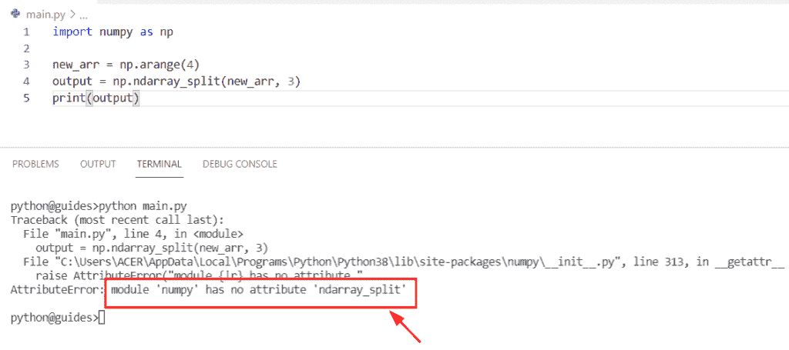

Python numpy ndarray object has no attribute split

## 解决方案

为了解决这个问题，我们将使用 `np.split()` 函数代替 `nd.array()` 来划分 NumPy 数组。

```py
import numpy as np

new_arr = np.arange(6)
output = np.split(new_arr, 3)
print(output)
```

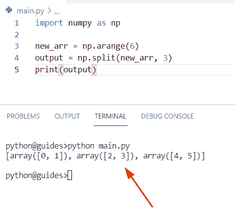

solution numpy ndarray object attribute

*   [Python NumPy 日志](https://pythonguides.com/python-numpy-log/)

## Python np.log 除以零

*   本期节目我们将讨论**如何在 Python** 中用零除 np.log。
*   在本例中，我们使用了 `np.log()` 函数，在该函数中，我们将 numpy 数组赋值为“arr1”。现在使用 np.inf 将给定值除以零。

**举例:**

```py
import numpy as np

arr1= np.random.randint(8,size=8)
ou_new = np.log(arr1)
ou_new[ou_new==-np.inf]=0
print(ou_new)
```

你可以参考下面的截图

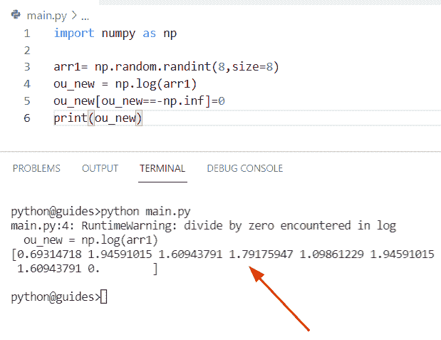

Python np log divide by zero

您可能会喜欢以下 Python 教程:

*   [Python NumPy where with examples](https://pythonguides.com/python-numpy-where/)
*   [Python NumPy linspace](https://pythonguides.com/python-numpy-linspace/)
*   [Python NumPy 数据类型](https://pythonguides.com/python-numpy-data-types/)
*   [Python NumPy 3d 数组](https://pythonguides.com/python-numpy-3d-array/)
*   [Python NumPy 串接](https://pythonguides.com/python-numpy-concatenate/)
*   [Python 排序 NumPy 数组](https://pythonguides.com/python-sort-numpy-array/)
*   [Python NumPy 矩阵](https://pythonguides.com/python-numpy-matrix/)
*   [Python 数字差异](https://pythonguides.com/python-numpy-diff/)

在这个 Python 教程中，我们将学习**如何在 Python** 中拆分 NumPy 数组。此外，我们将涵盖这些主题。

*   Python NumPy 分割二维数组
*   Python NumPy 拆分字符串
*   Python NumPy 拆分列
*   Python NumPy 拆分行
*   Python NumPy split 函数
*   Python 通过值分割 numpy 数组
*   Python numpy 随机拆分
*   Python numpy 按元素划分
*   Python numpy 将数组分割成块
*   Python numpy.ndarray 对象没有属性“split”
*   Python np.log 除以零

[Bijay Kumar](https://pythonguides.com/author/fewlines4biju/)

Python 是美国最流行的语言之一。我从事 Python 工作已经有很长时间了，我在与 Tkinter、Pandas、NumPy、Turtle、Django、Matplotlib、Tensorflow、Scipy、Scikit-Learn 等各种库合作方面拥有专业知识。我有与美国、加拿大、英国、澳大利亚、新西兰等国家的各种客户合作的经验。查看我的个人资料。

[enjoysharepoint.com/](https://enjoysharepoint.com/)[](https://www.facebook.com/fewlines4biju "Facebook")[](https://www.linkedin.com/in/fewlines4biju/ "Linkedin")[](https://twitter.com/fewlines4biju "Twitter")