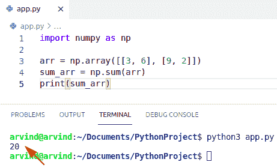
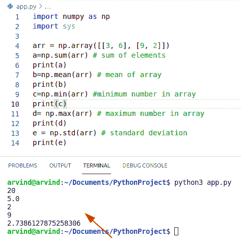
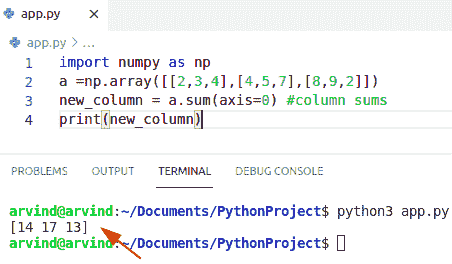
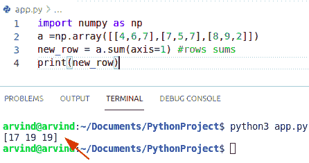
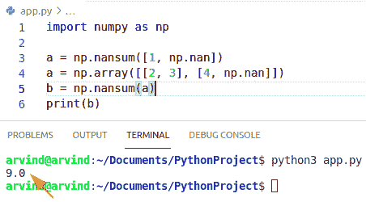
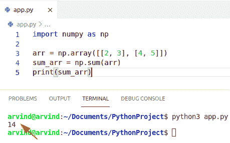
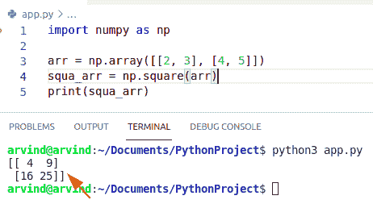
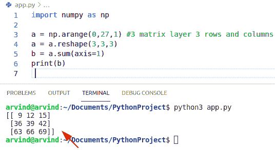

# Python NumPy Sum +示例

> 原文：<https://pythonguides.com/python-numpy-sum/>

[](https://sharepointsky.teachable.com/p/python-and-machine-learning-training-course)

在本 [Python NumPy 教程](https://pythonguides.com/numpy/)中，我们将通过如下几个例子来讨论 `Python numpy sum` :

*   Python NumPy 汇总统计
*   Python NumPy 列的总和
*   Python NumPy 对每行求和
*   Python NumPy 求和函数
*   Python NumPy 求和忽略 nan
*   Python NumPy 对两个数组求和
*   Python NumPy 平方和
*   Python NumPy sum 3d 数组

目录

[](#)

*   [Python NumPy sum](#Python_NumPy_sum "Python NumPy sum")
*   [Python numpy 汇总统计](#Python_numpy_summary_statistics "Python numpy summary statistics")
*   [Python numpy 列的总和](#Python_numpy_sum_of_columns "Python numpy sum of columns")
*   [Python numpy 对每行求和](#Python_numpy_sum_each_row "Python numpy sum each row")
*   [Python numpy 求和函数](#Python_numpy_sum_function "Python numpy sum function")
*   [Python numpy sum 忽略 nan](#Python_numpy_sum_ignore_nan "Python numpy sum ignore nan")
*   [Python numpy 求和两个数组](#Python_numpy_sum_two_arrays "Python numpy sum two arrays")
*   [Python numpy 平方和](#Python_numpy_sum_of_squares "Python numpy sum of squares")
*   [Python numpy sum 3d 数组](#Python_numpy_sum_3d_array "Python numpy sum 3d array")

## Python NumPy sum

*   在本节中，我们将了解到 `python numpy sum` 。
*   Numpy.sum()函数在 Python 的 Numpy 库中可用。
*   这个函数用于对给定数组的所有元素求和，对每行求和，对每列求和。
*   我们还可以指定 dtype 来指定返回的输出数据类型。

**语法:**

下面是 numpy.sum()的语法

```py
numpy.sum(
          arr,
          axis,
          dtype,
          out
          )
```

1.  arr:输入数组
2.  axis:要沿其计算总值的轴。
3.  dtype:我们可以指定返回的输出数据类型。
4.  out:我们想要放置结果。

**例子**

让我们举一个例子来检查如何对数组中的元素求和。

```py
import numpy as np

arr = np.array([[3, 6], [9, 2]])
sum_arr = np.sum(arr)
print(sum_arr)
```

下面是下面给出的代码的截图。



Python numpy sum

这是 Python NumPy 中 **Sum 的一个例子。**

阅读: [Python NumPy zeros](https://pythonguides.com/python-numpy-zeros/)

## Python numpy 汇总统计

汇总统计描述了一个变量值及其分布。例如，假设您在一家实时监控父母健康状况的公司工作，您需要编写一个脚本来检测危险的异常情况。

*   您可以在微批处理中生成汇总统计数据，然后使用汇总统计数据计算监控设备生成的传入数据的平均值、最大值和标准偏差。
*   当设备生成异常高或异常低的数据点时，您会生成自动警报。
*   Numpy 有很多有用的统计函数用于计算
    *   总和
    *   中位数
    *   平均
    *   最大

**例子**

让我们举一个例子来检查汇总统计数据

```py
import numpy as np
import sys

arr = np.array([[3, 6], [9, 2]])
a=np.sum(arr) # sum of elements
print(a)
b=np.mean(arr) # mean of array
print(b)
c=np.min(arr) #minimum number in array
print(c)
d= np.max(arr) # maximum number in array
print(d)
e = np.std(arr) # standard deviation
print(e)
```

下面是以下代码的截图



Python numpy summary statistics

读取:[检查 Python 中的 NumPy 数组是否为空](https://pythonguides.com/check-if-numpy-array-is-empty/)

## Python numpy 列的总和

*   在本节中，我们将了解列的总和。
*   使用 numpy.sum()函数计算矩阵列的总和。
*   这个函数用于给定数组中每一列的总和。

**语法**

下面是 numpy.sum()的语法

```py
numpy.sum(
          arr,
          axis,
          out
         ) 
```

1.  arr:输入数组
2.  axis:要沿其计算总值的轴。
3.  out:我们想要放置结果。

**例子**

让我们举一个例子来检查如何对数组中的列求和

```py
import numpy as np
a =np.array([[2,3,4],[4,5,7],[8,9,2]])
new_column = a.sum(axis=0) #column sums
print(new_column)
```

下面是以下代码的截图



Python numpy sum of columns

这就是如何在 Python NumPy 中做**一些` `的栏目。**

阅读: [Python NumPy to list](https://pythonguides.com/python-numpy-to-list/)

## Python numpy 对每行求和

*   在这一节中，我们将了解到 **python numpy 行的总和**。
*   使用 numpy.sum()函数计算矩阵中各行的总和。
*   这个函数用于给定数组中每一行的求和。

**语法:**

下面是 numpy.sum()的语法

```py
numpy.sum(
          arr,
          axis,
          out
         ) 
```

1.  arr:输入数组
2.  axis:要沿其计算总值的轴。
3.  out:我们想要放置结果。

**例子**

让我们举一个例子来检查如何对数组中的行求和

```py
import numpy as np
a =np.array([[4,6,7],[7,5,7],[8,9,2]])
new_row = a.sum(axis=1) #rows sums
print(new_row)
```

以下是给定代码的截图



Python numpy sum of rows

这就是如何在 Python NumPy 中对每一行求和。

阅读:[Python NumPy Random+Examples](https://pythonguides.com/python-numpy-random/)

## Python numpy 求和函数

*   在本节中，我们将了解到 `python numpy sum` 。
*   ***Numpy.sum()函数*** 在 Python 的 Numpy 库中可用。
*   这个函数用于对给定数组的所有元素求和，对每行求和，对每列求和。
*   我们还可以指定 dtype 来指定返回的输出数据类型。

**语法:**

下面是 numpy.sum()的语法

```py
numpy.sum(
          arr,
          axis,
          dtype,
          out
          )
```

1.  arr:输入数组
2.  axis:要沿其计算总值的轴。
3.  dtype:我们可以指定返回的输出数据类型。
4.  out:我们想要放置结果。

**例子**

让我们举一个例子来检查如何对数组中的元素求和。

```py
import numpy as np

arr = np.array([[2, 3], [6, 7]])
sum_arr = np.sum(arr)
print(sum_arr)
```

以下是给定代码的截图


Python numpy sum function

这是如何使用 **Python NumPy Sum()函数**。

## Python numpy sum 忽略 nan

*   在本节中，我们将了解到 `python numpy sum ignore nan` 。
*   nansum()函数可以用来计算数组的和，忽略 nan 值。
*   这个函数用于对给定数组的所有元素求和，对每行求和，对每列求和。

**语法:**

下面是 sum ignore nan 的语法

```py
numpy.nansum(
             arr,
             dtype=None,
             )
```

**例子**

```py
import numpy as np

a = np.nansum([1, np.nan])
a = np.array([[2, 3], [4, np.nan]])
b = np.nansum(a)
print(b)
```

以下是给定代码的截图



Python numpy sum ignore nan

阅读: [Python NumPy 数组](https://pythonguides.com/python-numpy-array/)

## Python numpy 求和两个数组

*   在本节中，我们将学习两个数组的 **python numpy sum。**
*   Numpy.sum()函数在 Python 的 Numpy 库中可用。
*   这个函数用于对给定数组的所有元素求和，对每行求和，对每列求和。
*   我们还可以指定 dtype 来指定返回的输出数据类型。

**语法:**

下面是 numpy.sum()的语法

```py
numpy.sum(
          arr,
          axis,
          dtype,
          out
          )
```

**例子**

让我们举一个例子来检查如何对数组中的元素求和。

```py
import numpy as np

arr = np.array([[2, 3], [4, 5]])
sum_arr = np.sum(arr)
print(sum_arr)
```

以下是给定代码的截图



Python numpy sum two arrays

这是如何使用 Python NumPy 对两个数组求和。

## Python numpy 平方和

*   在本节中，我们将了解到 **python numpy 平方和**。
*   Numpy。square()函数帮助用户计算数组中每个元素的平方值。
*   这个函数用于对给定数组的所有元素求和，对每行求和，对每列求和。

**语法:**

下面是 numpy.square()的语法

```py
numpy.square(
          arr,
          axis,
          dtype,
          out
          )
```

**例子**

让我们举一个例子来检查平方和

```py
import numpy as np

arr = np.array([[2, 3], [4, 5]])
squa_arr = np.square(arr)
print(squa_arr)
```

以下是给定代码的截图



Python numpy sum of squares

## Python numpy sum 3d 数组

*   在本节中，我们将了解到 **python NumPy sum 3d 数组**。
*   Numpy。Python 的 **NumPy 库中有 sum()函数。**
*   这个函数用于对给定数组的所有元素求和，对每行求和，对每列求和。
*   我们还可以指定 dtype 来指定返回的输出数据类型。

**语法:**

下面是 numpy.sum()的语法

```py
numpy.sum(
          arr,
          axis,
          dtype,
          out
          )
```

1.  arr:输入数组
2.  axis:要沿其计算总值的轴。
3.  dtype:我们可以指定返回的输出数据类型。
4.  out:我们想要放置结果。

**例子**

让我们举一个例子来检查如何对 3d 数组中的元素求和。

```py
import numpy as np

a = np.arange(0,27,1) #3 matrix layer 3 rows and columns
a = a.reshape(3,3,3)
b = a.sum(axis=1)
print(b) 
```

以下是给定代码的截图



Python numpy sum 3d array

这是如何使用 Python NumPy 对 3d 数组求和。

您可能会喜欢以下 Python 教程:

*   [python](https://pythonguides.com/python-convert-tuple-to-list/)[o](https://pythonguides.com/python-convert-tuple-to-list/)[n 将元组转换为列表](https://pythonguides.com/python-convert-tuple-to-list/)
*   [python 语法错误:函数外的“return”](https://pythonguides.com/syntaxerror-return-outside-function-python/)
*   [获取当前目录 Python](https://pythonguides.com/get-current-directory-python/)
*   [从字符串 Python 中删除字符](https://pythonguides.com/remove-character-from-string-python/)
*   [语法错误标识符 python3 中的无效字符](https://pythonguides.com/syntaxerror-invalid-character-in-identifier-python3/)

在本 Python 教程中，我们将讨论 `Python numpy sum` ，并涵盖以下示例:

*   Python numpy 汇总统计
*   Python numpy 列的总和
*   Python numpy 对每行求和
*   Python numpy 求和函数
*   Python numpy 求和忽略 nan
*   Python numpy 对两个数组求和
*   Python numpy 平方和
*   Python numpy sum 3d 数组

[Bijay Kumar](https://pythonguides.com/author/fewlines4biju/)

Python 是美国最流行的语言之一。我从事 Python 工作已经有很长时间了，我在与 Tkinter、Pandas、NumPy、Turtle、Django、Matplotlib、Tensorflow、Scipy、Scikit-Learn 等各种库合作方面拥有专业知识。我有与美国、加拿大、英国、澳大利亚、新西兰等国家的各种客户合作的经验。查看我的个人资料。

[enjoysharepoint.com/](https://enjoysharepoint.com/)[](https://www.facebook.com/fewlines4biju "Facebook")[](https://www.linkedin.com/in/fewlines4biju/ "Linkedin")[](https://twitter.com/fewlines4biju "Twitter")