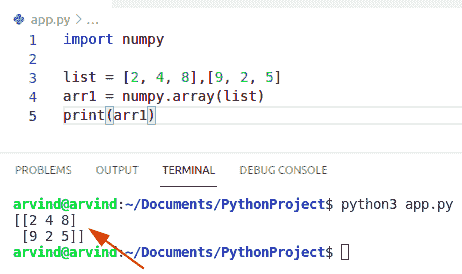

# Python NumPy 用例子列出

> 原文：<https://pythonguides.com/python-numpy-to-list/>

[](https://sharepointsky.teachable.com/p/python-and-machine-learning-training-course)

在本 [Python NumPy 教程](https://pythonguides.com/numpy/)中，我们将讨论 **Python NumPy 列表**，并涵盖以下示例:

*   Python numpy 列表到数组
*   Python numpy 列表到矩阵
*   Python numpy 列表到 ndarray
*   Python numpy 列表到字符串
*   Python numpy 列表到 CSV
*   字符串列表的 Python numpy 数组
*   Python numpy 数组到元组列表
*   要列出的 Python numpy 元组
*   Python numpy 数组到列表列表

目录

[](#)

*   [Python numpy to list](#Python_numpy_to_list "Python numpy to list")
*   [Python numpy 列表到数组](#Python_numpy_list_to_array "Python numpy list to array")
*   [Python numpy 列表到矩阵](#Python_numpy_list_to_matrix "Python numpy list to matrix")
*   [Python numpy list to ndarray](#Python_numpy_list_to_ndarray "Python numpy list to ndarray")
*   [Python numpy list to string](#Python_numpy_list_to_string "Python numpy list to string")
*   [Python numpy 列表到 CSV](#Python_numpy_list_to_CSV "Python numpy list to CSV")
*   [Python numpy 数组到字符串列表](#Python_numpy_array_to_list_of_strings "Python numpy array to list of strings")
*   [Python numpy 数组到元组列表](#Python_numpy_array_to_list_of_tuples "Python numpy array to list of tuples")
*   [Python numpy 元组列表](#Python_numpy_tuple_to_list "Python numpy tuple to list")
*   [Python numpy 数组到列表列表](#Python_numpy_array_to_list_of_lists "Python numpy array to list of lists")

## Python numpy to list

*   在这一节中，我们将学习 `python numpy to list` 。
*   Python 以几种不同的方式存储数据，但最流行的方法是列表和字典。
*   数组也是一种用于存储数据的数据结构。
*   这些数组与列表类似。
*   列表和数组都用于存储数据。
*   列表和数组都是可变的。所以我们可以在列表和数组中添加和删除元素。
*   两者都可以被索引和迭代。
*   两者都可以是切片操作。
*   列表是不同数据类型元素的容器，而数组是相同数据类型元素的容器。
*   我们可以在一个列表中存储 int，float，string，但是在数组中，我们需要存储相同类型的数据。

**语法:**

下面是 numpy 数组的语法

```py
numpy.ndarray.tolist()
```

*   它以 python 列表和可能的数组元素嵌套列表的形式返回数组数据的副本。

**举例:**

```py
import numpy as np

arr1= np.array([2, 4, 5])
list1 = arr1.tolist()
print(list1)
```

以下是给定代码的截图


Python numpy to list

上面的代码我们可以用来**在 Python 中把 NumPy 转换成 list**。

阅读: [Python 串联列表示例](https://pythonguides.com/python-concatenate-list/)

## Python numpy 列表到数组

*   在这一节中，我们将了解到`python numpy list to a array`。
*   在 python 中，可以使用 numpy 库中的两种方法将列表转换为数组。
*   在这个方法中，我们可以很容易地使用 numpy 函数。数组()。
*   首先，我们导入一个 numpy 库，然后初始化一个列表，并将列表转换成一个数组。

**举例:**

```py
import numpy

list = [2, 4, 8, 9, 2, 5, 6]
arr1 = numpy.array(list)
print(arr1)
```

下面是以下代码的截图


Python numpy list to array

## Python numpy 列表到矩阵

*   在这一节中，我们将了解到 **python 对矩阵**的 numpy 列表。
*   使用 np。array(list)函数将一个列表转换成矩阵形式。
*   国民党。array 函数接受一个 iterable 并返回一个 numpy 数组。

**举例:**

```py
import numpy

list = [2, 4, 8],[9, 2, 5]
arr1 = numpy.array(list)
print(arr1)
```

以下是给定代码的截图



Python numpy list to matrix

这就是如何在 Python 中**将 numpy 列表转换成矩阵。**

阅读: [Python NumPy 矩阵](https://pythonguides.com/python-numpy-matrix/)和[如何用 Python 制作矩阵](https://pythonguides.com/make-a-matrix-in-python/)

## Python numpy list to ndarray

*   在本节中，我们将了解到 `python numpy list to ndarray` 。
*   一个 `ndarray` 是一个(通常是固定大小的)多维容器，包含相同类型和大小的项目。
*   首先，我们必须导入一个包并声明嵌套的四维列表，然后使用 numpy.array()函数将列表转换为数组并将其包含在不同的对象中。
*   它以矩阵形式返回，并在 numpy 数组中显示结果。

**举例:**

```py
import numpy

list = [2, 4, 8,4],[9, 2, 5,4],[1,3,4,5],[3,4,5,6]
arr1 = numpy.array(list)
print(arr1)
```

以下是给定代码的截图


Python numpy list to ndarray

这是一个如何在 Python 中将 numpy 列表转换成 ndarray 的例子。

## Python numpy list to string

*   在本节中，我们将了解到 `python numpy list to string` 。
*   在这个方法中，我们使用 join()函数。
*   首先，我们必须创建一个函数列表来字符串化并初始化一个空字符串。
*   它将返回字符串。
*   该列表将包含字符串和整数作为其元素。

**举例:**

```py
import numpy as np
def lToS(list1): 

    str2 = " " 

    return (str2.join(list1))
list1 = ['John', 'GEORGE', 'MICHEAL']
print(lToS(list1))
```

以下是给定代码的截图


Python numpy list to string

*   另一种方法是通过使用 map()方法将 numpy 列表转换为字符串。
*   使用 map()方法将列表中的元素转换为字符串。

**举例:**

```py
import numpy as np

str1 = ['Mango','Onion','Apple']
listToStr = ' '.join(map(str, str1))
print(listToStr) 
```

以下是给定代码的截图


Python numpy list to string map method

这是如何在 Python 中将 numpy 列表转换成字符串。

阅读: [Python 从字符串中移除子串](https://pythonguides.com/python-remove-substring-from-a-string/)

## Python numpy 列表到 CSV

*   在本节中，我们将了解到 CSV 的 **numpy 列表。**
*   CSV 文件通过 Python 内置的 open()方法作为文件打开，该方法返回一个 file 对象。
*   在这个方法中，我们使用 dataframe 函数将列表存储在 dataframe 中，并使用 to_csv 将其导出到 CSV 文件中。

示例:

```py
import numpy as np
import pandas as pd

list = [2,3,4,5,6,7,8]
print(list)
DF = pd.DataFrame(list)
DF.to_csv('/home/arvind/Documents/test.csv')
```

以下是给定代码的截图


Python numpy list to csv


numpy list to csv

读取: [Python NumPy 读取 CSV](https://pythonguides.com/python-numpy-read-csv/)

## Python numpy 数组到字符串列表

*   在这一节中，我们将学习使用 **numpy 数组来列出字符串**。
*   在这个方法中，我们可以很容易地使用方法列表()。它将数组转换成一个列表。
*   在列表中，我们可以很容易地使用 str 字符。
*   它总是以列表形式返回 numpy 数组数据的副本。

**举例:**

```py
import numpy as np

a = np.array([['john','George', 'Micheal'], ['orange', 'apple', 'grapes']])
list1 = a.tolist()
print(list1)
```

下面是以下代码的截图


Python numpy array to list of strings

这是如何在 Python 中将 numpy 数组转换成字符串列表。

阅读: [Python sort NumPy 数组+示例](https://pythonguides.com/python-sort-numpy-array/)

## Python numpy 数组到元组列表

*   在这一节中，我们将学习用于列出元组的 numpy 数组。
*   在这个方法中，我们可以很容易地使用 map 和 tuple 函数。
*   这个函数返回给定函数应用到给定序列 iterable 的每一项后的结果的 map 对象。
*   tuple 是 Python 中的一种方法，它包含由逗号分隔并括在左括号中的项。

**举例:**

```py
import numpy as np

arr = np.array([['mango', 'apple'], ['grapes', 'orange']])
res = tuple(map(tuple, arr))
print(res) 
```

以下是给定代码的截图


Python numpy array to list of tuples

阅读: [Python 将元组与示例连接](https://pythonguides.com/python-concatenate-tuples/)

## Python numpy 元组列表

*   在这一节中，我们将了解要列出的的 **numpy 元组**
*   元组不能被改变，因为它是不可变的，但是在列表中，我们可以添加新的值和元素。
*   元组使用左括号，而列表使用方括号。
*   在 Python 中，list()方法接受可迭代序列类型，并将它们转换成列表。这用于将给定的元组转换成列表。
*   输出总是以列表的形式。

**举例:**

```py
import numpy as np
Tup = (456, 'tuv', 'mno', 'klm')
List1 = list(Tup)
print(List1)
```

在上面的例子中，我们首先创建一个 tuple，然后使用函数 list()将它们转换成 list。

以下是给定代码的截图


Python numpy tuple to list

这就是如何在 Python 中将 numpy 数组转换成元组列表。

阅读:[在 Python 中创建一个元组](https://pythonguides.com/create-a-tuple-in-python/)

## Python numpy 数组到列表列表

*   在这一节中，我们将学习列表列表的 numpy 数组。
*   在 Python 的 numpy 模块中，numpy 维数组类提供了一个函数 tolist()，该函数返回一个包含 numpy 数组中所有值的副本的列表。如果 numpy 数组是二维的，那么它返回一个列表的列表。
*   列表是具有不同数据类型的值的容器，但是 numpy 数组是相同数据类型的元素的容器。
*   输出将以列表的形式进入列表。

**举例:**

```py
import numpy as np

arr1 = np.array([[4, 5, 6, 7],
                [5, 4, 4, 9],
                [3, 4, 5, 6]])

listoflists = arr1.tolist()
print(listoflists) 
```

下面是以下代码的截图


Python numpy array to list of lists

您可能会喜欢以下 Python 教程:

*   [Python NumPy 日志](https://pythonguides.com/python-numpy-log/)
*   [Python NumPy where with examples](https://pythonguides.com/python-numpy-where/)
*   [Python NumPy linspace](https://pythonguides.com/python-numpy-linspace/)
*   [Python NumPy 串接](https://pythonguides.com/python-numpy-concatenate/)
*   [Python 排序 NumPy 数组](https://pythonguides.com/python-sort-numpy-array/)
*   [Python NumPy square 示例](https://pythonguides.com/python-numpy-square/)
*   [值错误:用序列](https://pythonguides.com/valueerror-setting-an-array-element-with-a-sequence/)设置数组元素
*   [Python NumPy nan](https://pythonguides.com/python-numpy-nan/)
*   [Python 反向 NumPy 数组](https://pythonguides.com/python-reverse-numpy-array/)

在本 Python NumPy 教程中，我们将讨论 **Python NumPy 以列出**，并涵盖以下示例:

*   Python numpy 列表到数组
*   Python numpy 列表到矩阵
*   Python numpy 列表到 ndarray
*   Python numpy 列表到字符串
*   Python numpy 列表到 CSV
*   字符串列表的 Python numpy 数组
*   Python numpy 数组到元组列表
*   要列出的 Python numpy 元组
*   Python numpy 数组到列表列表

[Bijay Kumar](https://pythonguides.com/author/fewlines4biju/)

Python 是美国最流行的语言之一。我从事 Python 工作已经有很长时间了，我在与 Tkinter、Pandas、NumPy、Turtle、Django、Matplotlib、Tensorflow、Scipy、Scikit-Learn 等各种库合作方面拥有专业知识。我有与美国、加拿大、英国、澳大利亚、新西兰等国家的各种客户合作的经验。查看我的个人资料。

[enjoysharepoint.com/](https://enjoysharepoint.com/)[](https://www.facebook.com/fewlines4biju "Facebook")[](https://www.linkedin.com/in/fewlines4biju/ "Linkedin")[](https://twitter.com/fewlines4biju "Twitter")