# 如何在 NumPy 数组 Python 中获取唯一值–完整教程

> 原文：<https://pythonguides.com/python-numpy-unique/>

[](https://sharepointsky.teachable.com/p/python-and-machine-learning-training-course)

在本 [Python 教程](https://pythonguides.com/python-hello-world-program/)中，我们将学习**如何使用 Python 从 Numpy 数组**中获取唯一值。此外，我们将涵盖这些主题。

*   Python numpy 唯一二维数组
*   Python numpy 唯一值
*   Python numpy 唯一无排序
*   Python numpy 唯一行
*   Python numpy 唯一计数
*   具有容差的 Python numpy 唯一性
*   Python numpy 唯一返回 _ 索引
*   Python numpy 唯一轴
*   没有 numpy 的唯一 Python
*   Python np 唯一 return_inverse
*   Python np.unique 字符串

目录

[](#)

*   [Python numpy 独一无二](#Python_numpy_unique "Python numpy unique")
*   [Python numpy 唯一二维数组](#Python_numpy_unique_2d_array "Python numpy unique 2d array")
*   [Python numpy 唯一值](#Python_numpy_unique_values "Python numpy unique values")
*   [Python numpy 唯一无排序](#Python_numpy_unique_without_sort "Python numpy unique without sort")
*   [Python numpy 唯一行](#Python_numpy_unique_rows "Python numpy unique rows")
*   [Python numpy 唯一计数](#Python_numpy_unique_count "Python numpy unique count")
*   [Python numpy unique with tolerance](#Python_numpy_unique_with_tolerance "Python numpy unique with tolerance")
*   [Python numpy 唯一返回 _ 索引](#Python_numpy_unique_return_index "Python numpy unique return_index")
*   [Python numpy 唯一轴](#Python_numpy_unique_axis "Python numpy unique axis")
*   [Python 唯一无 numpy](#Python_unique_without_numpy "Python unique without numpy")
*   [Python np 唯一 return_inverse](#Python_np_unique_return_inverse "Python np unique return_inverse")
*   [Python np.unique 字符串](#Python_npunique_string "Python np.unique string")

## Python numpy 独一无二

*   在这一节中，我们将讨论如何使用 Python 来查找 numpy 数组中的唯一元素。
*   在这个例子中，我们将使用 `np.unique()` 函数。在 Python 中，此方法用于标识 NumPy 数组中的唯一元素，此函数返回给出唯一元素的输入数组的索引。
*   在 Python 中，numpy 模块提供了一个 `numpy.unique()` 元素，这个函数还标识唯一的行和列。

**语法:**

下面是 np.unique()函数的语法

```py
numpy.unique
            (
             ar,
             return_index=False,
             return_inverse=False,
             return_counts=False,
             axis=None
            )
```

*   它由几个参数组成
    *   **ar:** 这个参数表示你要对哪个数组进行操作，它将被展平。
    *   **return_index:** 该参数始终返回元素的索引，默认取为**‘False’**值。
    *   **return_inverse:** 可选参数，总是返回输入数组中每个唯一值出现的次数。

**举例:**

让我们举个例子，看看如何在 Python 中使用 `numpy.unique()` 函数

**源代码:**

```py
import numpy as np  

new_val=np.array([98,34,56,89,45,56,34,20])  
result=np.unique(new_val)
print("Unique elements:",result)
```

在上面的代码中，我们导入了一个 numpy 库，然后声明了一个变量**‘new _ val’**，并分配了函数 `np.unique()` ，在这个函数中，我们设置了变量**‘new _ val’**。打印“结果”后，输出将显示唯一的元素。

下面是以下给定代码的实现

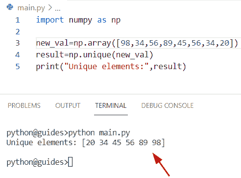

Python numpy unique

另外，检查: [Python NumPy 3d 数组](https://pythonguides.com/python-numpy-3d-array/)

## Python numpy 唯一二维数组

*   在这个程序中，我们将讨论如何在 Python 中识别二维数组中的唯一值。
*   在这个例子中，我们将使用 `np.unique()` 函数，并指定**轴=0** ，表示使用 `np.unique()` 函数的方向。
*   在这个程序中，我们在一个二维数组中创建了重复的值。现在，通过使用 `np.unique()` 函数，我们将从输入数组中获得唯一的元素。

**举例:**

```py
import numpy as np  

new_arr = np.array([[67, 98, 67], [67, 67, 5], [45, 5, 67]])  
result=np.unique(new_arr, axis=0)  
print(result)
```

下面是以下给定代码的执行过程

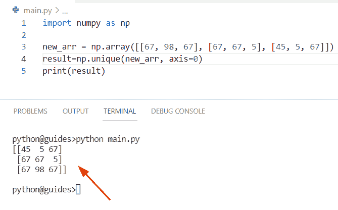

Python numpy unique 2d array

阅读: [Python NumPy 2d 数组](https://pythonguides.com/python-numpy-2d-array/)

## Python numpy 唯一值

*   让我们看看如何在 Python 中从 numpy 数组中找到唯一值。
*   通过使用 `np.unique()` 方法，我们可以很容易地从 numpy 数组中识别出唯一的值。
*   要完成这项任务，我们首先要使用 `np.array()` 函数创建一个简单的数组，然后声明一个变量**‘new _ output’**，并在其中分配一个唯一的()函数。一旦您将打印**‘新输出’**，那么结果将显示唯一的值。

**举例:**

```py
import numpy as np  

new_val=np.array([85,34,85,99,23,109,34,109])  
new_output=np.unique(new_val)
print("Unique values:",new_output)
```

下面是以下代码的截图

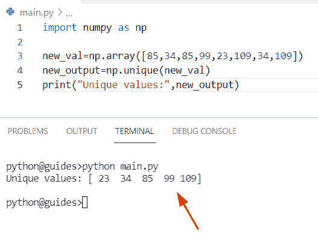

Python numpy unique values

正如您在截图中看到的，输出是生成的唯一元素。

阅读: [Python NumPy 拆分](https://pythonguides.com/python-numpy-split/)

## Python numpy 唯一无排序

*   在这一节中，我们将讨论如何在 NumPy Python 中不排序的情况下获得唯一值。
*   在这里，我们可以使用 `np.unique()` 方法，在该方法中，我们必须将**‘return _ index’**指定为参数，如果为真，则该函数将返回唯一元素第一次出现的索引。

**源代码:**

```py
import numpy as np

new_arr = [16,11,5,9,9,11,5,16]
new_values = np.unique(new_arr, return_index=True)[1]
b=[new_arr[index] for index in sorted(new_values)]
print(b)
```

下面是以下给定代码的实现

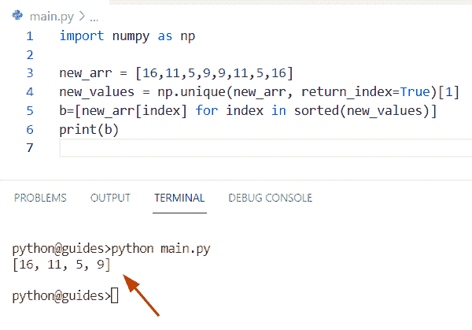

Python numpy unique without sort

正如您在屏幕截图中看到的，输出将显示唯一的值，不进行排序。

阅读: [Python NumPy 规格化](https://pythonguides.com/python-numpy-normalize/)

## Python numpy 唯一行

*   在这一节中，我们将讨论如何在 Python 中从 NumPy 数组中获取唯一的行。
*   为了从数组中获取唯一的行，我们设置**轴=0** ，np.unique 函数将帮助用户在**轴-0** 方向向下操作，如果**轴=1** ，那么它将水平操作并找到唯一的列值。
*   在这个例子中，我们将使用一个 numpy 库，然后应用 `np.array()` 函数来创建一个数组。现在声明一个变量**‘结果’**，一个赋值的 `np.unique()` 函数和轴在一起。

**源代码:**

```py
import numpy as np

new_array = np.array([[43, 43, 34, 43],
					[29, 43, 34, 43],
					[89, 43, 34, 43],
					[43, 43, 34, 43]])

result = np.unique(new_array,axis = 0)
print(result) 
```

下面是以下给定代码的实现

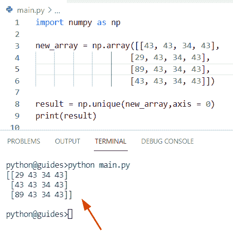

Python Numpy unique rows

正如您在屏幕截图中看到的，输出显示了唯一的行。

阅读: [Python NumPy Random](https://pythonguides.com/python-numpy-random/)

## Python numpy 唯一计数

*   在这个程序中，我们将讨论如何在 Python 中计算 numpy 数组的唯一值。
*   为了完成这个任务，我们将使用 `return_counts=True` 作为参数，这将返回每个唯一元素在 numpy 数组中出现的次数。
*   在 Python 中，numpy.column_stack 用于将作为列的一维数组转换为二维数组，它就像一个 `hstack()` 函数。

**语法:**

下面是 `numpy.column_stack()` 方法的语法

```py
numpy.column_stack
                  (
                   tup
                  )
```

**举例:**

```py
import numpy as np

new_val = np.array([75,75,54,75,54,54,67,54])

new_count = np.unique(new_val, return_counts=True)
final_output = np.column_stack((new_count)) 
print(final_output)
```

在上面的代码中，我们使用了 `np.unique()` 函数，并将数组**‘new _ val’**指定为参数。现在使用 `np.column_stack()` 方法计算唯一值。

你可以参考下面的截图

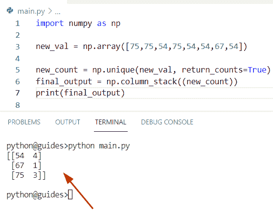

Python numpy unique count

阅读: [Python NumPy max](https://pythonguides.com/python-numpy-max-with-examples/)

## Python numpy unique with tolerance

*   在这个程序中，我们将讨论如何在 NumPy 数组中找到具有容差的唯一元素。
*   为此，首先我们将设置值 `2.0e-4` ，然后使用 `np.random()` 函数创建一个数组。现在应用 `argsort()` 方法，并在其中分配 arr**‘new _ arr’**。在 Python 中， `argsort()` 方法用于计算 NumPy 数组的间接排序。
*   现在使用 append()函数并传递 **'True'** 和 **'np.diff'** 作为参数。在 Python 中，np.diff 用于测量沿给定轴的第 n 个离散差。

**源代码:**

```py
import numpy as np

new_val = 2.0e-4
new_arr = np.random.random((8,8))
out = np.argsort(new_arr.flat)
x = np.append(True, np.diff(new_arr.flat[out]))
final_output = new_arr.flat[out[x>new_val]]
print(final_output)
```

下面是以下代码的截图

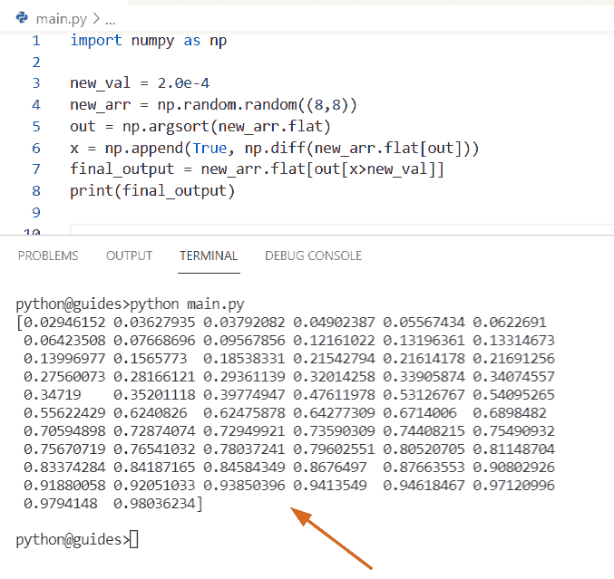

Python numpy unique with tolerance

正如您在屏幕截图中看到的，输出显示了带有值的唯一值。

阅读: [Python 反向 NumPy 数组](https://pythonguides.com/python-reverse-numpy-array/)

## Python numpy 唯一返回 _ 索引

*   在本节中，我们将讨论如何在 Python 中使用 return_index 来获取唯一值。
*   为了执行这个特定的任务，我们将使用 `np.unique()` 函数，并将 `retun_index=True` 指定为参数。在 Python 中，如果该参数设置为 True，那么 `np.unique()` 函数将总是返回 NumPy 数组的索引以及指定的轴。

**举例:**

```py
import numpy as np

new_val = np.array([65,65,71,86,95,32,65,71,86,55,76,71])
b= np.unique(new_val, return_index=True)
print(b)
```

在上面的代码中，我们首先导入了一个 numpy 库，然后使用 `np.array()` 函数来创建一个数组。现在声明一个变量**‘b’**，并传递**‘new _ val’**作为参数。一旦您将打印**‘b’**,那么输出将显示唯一值以及索引。

你可以参考下面的截图

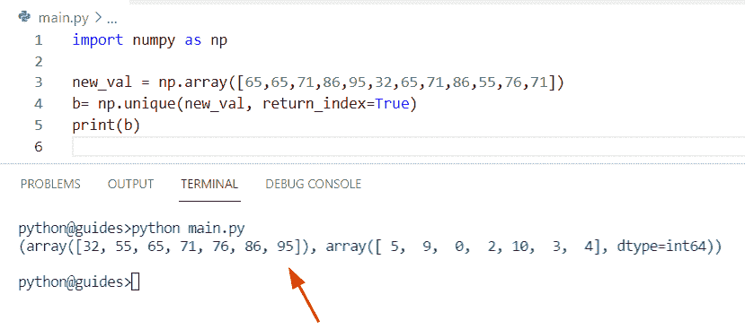

Python numpy unique return_index

阅读: [Python NumPy 形状示例](https://pythonguides.com/python-numpy-shape/)

## Python numpy 唯一轴

*   让我们看看如何使用 Python 来标识 NumPy 数组中唯一的值和轴。
*   通过使用 `np.unique()` 函数，我们可以解决这个问题。在这个程序中，我们将在 `np.unique()` 函数中设置轴参数。该参数表示使用 `numpy.unique()` 函数的方向，默认情况下不取值。
*   在这个程序中，我们设置了参数 `axis=0` 和 1，表示唯一值将垂直和水平显示。

**源代码:**

```py
import numpy as np

new_arr = np.array([[76, 29, 29], [76, 29, 29], [56, 96, 156]])
b= np.unique(new_arr, axis=0)
d= np.unique(new_arr, axis=1)
print(b)
print(d)
```

下面是以下给定代码的实现

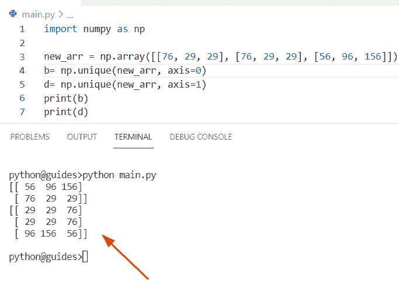

Python numpy unique axis

阅读: [Python NumPy 空数组](https://pythonguides.com/python-numpy-empty-array/)

## Python 唯一无 numpy

*   在这一节中，我们将讨论如何在不使用 numpy 的情况下获得 Python 中的唯一值。
*   在这个程序中，我们将首先创建一个列表，然后使用集合库中的 counter 函数，同时我们将使用 `counter()` 函数创建一个列表。现在，通过使用字典中的键，我们将获得唯一的值。

**举例:**

```py
from collections import Counter

new_list = [21, 63, 47, 21, 63, 99, 63, 4, 63, 99]
result = Counter(new_list).keys() 
print(result)
```

在上面的代码中，我们获取了列表**‘new _ list’**，然后应用了 `counter ()` 函数，其中元素被存储为字典键，它们的计数被视为字典值。

下面是以下代码的截图

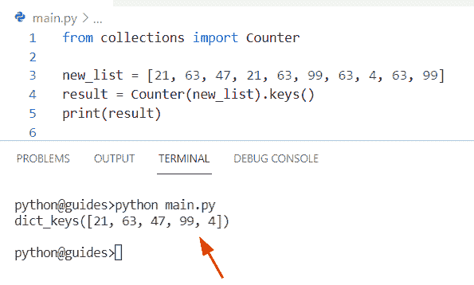

Python unique without numpy

正如您在屏幕截图中看到的，输出显示了列表中的唯一值。

阅读: [Python NumPy 平均值](https://pythonguides.com/python-numpy-average/)

## Python np 唯一 return_inverse

*   在这个程序中，我们将讨论如何通过使用 return_inverse 参数获得 NumPy Python 中的唯一值。
*   首先在这个例子中，我们将使用 `np.unique()` 函数，在这个函数中，我们将被赋值 `return_inverse=True` 作为参数。如果 `return_inverse=True` ，那么这个函数将返回唯一数组的索引，默认情况下，这个参数取值为**‘False’**。

**语法:**

下面是 np.unique()函数的语法

```py
numpy.unique
            (
             ar,
             return_index=False,
             return_inverse=False,
             return_counts=False,
             axis=None
            )
```

**举例:**

```py
import numpy as np

new_array = np.array([65,65,71,86,95,32,65,71,86,55,76,71])
result= np.unique(new_array, return_inverse=True)
print(result)
```

下面是以下给定代码的执行过程

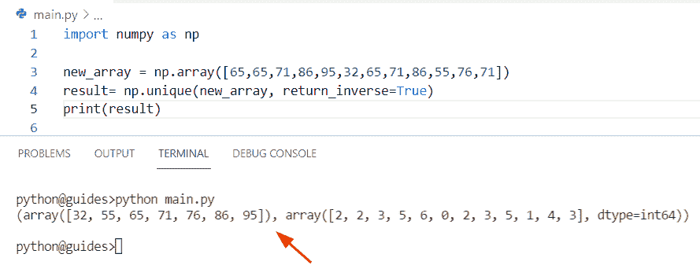

Python np unique return inverse

正如您在屏幕截图中看到的，输出显示了具有唯一值的反向索引号。

阅读: [Python NumPy square 举例](https://pythonguides.com/python-numpy-square/)

## Python np.unique 字符串

*   在本节中，我们将讨论如何使用 string 在 NumPy Python 中查找唯一值。
*   要完成这项任务，我们首先要声明一个列表，并给它分配字符串和整数值。现在使用 `np.unique()` 函数并传递 arr，return_counts 作为参数。

**源代码:**

```py
import numpy as np

my_new_arr = [('L',56,34,66),('M',21,30,97),('N',56,34,66)]
final_result = np.unique(my_new_arr,return_counts=True, axis=0)
print(final_result)
```

你可以参考下面的截图

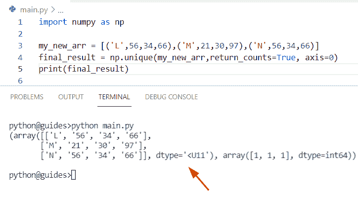

Python np unique string

正如您在屏幕截图中看到的，输出显示了包含唯一值和字符串字符的数组。

您可能还想阅读以下关于 Python Numpy 的教程。

*   [Python NumPy 列举示例](https://pythonguides.com/python-numpy-to-list/)
*   [Python NumPy round + 13 例](https://pythonguides.com/python-numpy-round/)
*   [Python NumPy where with examples](https://pythonguides.com/python-numpy-where/)
*   [Python NumPy 读取 CSV](https://pythonguides.com/python-numpy-read-csv/)
*   [Python NumPy 日志+示例](https://pythonguides.com/python-numpy-log/)

因此，在这个 Python 教程中，我们已经学习了如何使用 Python 从 Numpy 数组中获取唯一值。此外，我们已经讨论了这些主题。

*   Python numpy 唯一二维数组
*   Python numpy 唯一值
*   Python numpy 唯一无排序
*   Python numpy 唯一行
*   Python numpy 唯一计数
*   具有容差的 Python numpy 唯一性
*   Python numpy 唯一返回 _ 索引
*   Python numpy 唯一轴
*   没有 numpy 的唯一 Python
*   Python np 唯一 return_inverse
*   Python np.unique 字符串

[Bijay Kumar](https://pythonguides.com/author/fewlines4biju/)

Python 是美国最流行的语言之一。我从事 Python 工作已经有很长时间了，我在与 Tkinter、Pandas、NumPy、Turtle、Django、Matplotlib、Tensorflow、Scipy、Scikit-Learn 等各种库合作方面拥有专业知识。我有与美国、加拿大、英国、澳大利亚、新西兰等国家的各种客户合作的经验。查看我的个人资料。

[enjoysharepoint.com/](https://enjoysharepoint.com/)[](https://www.facebook.com/fewlines4biju "Facebook")[](https://www.linkedin.com/in/fewlines4biju/ "Linkedin")[](https://twitter.com/fewlines4biju "Twitter")