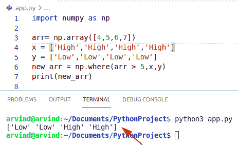
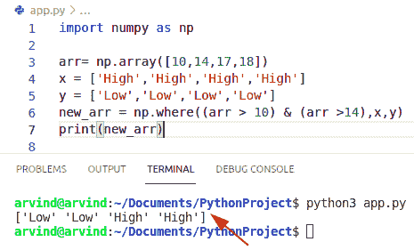
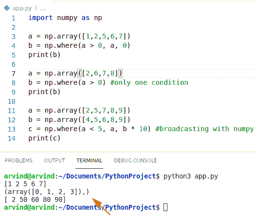
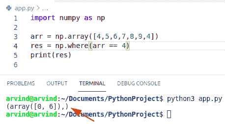
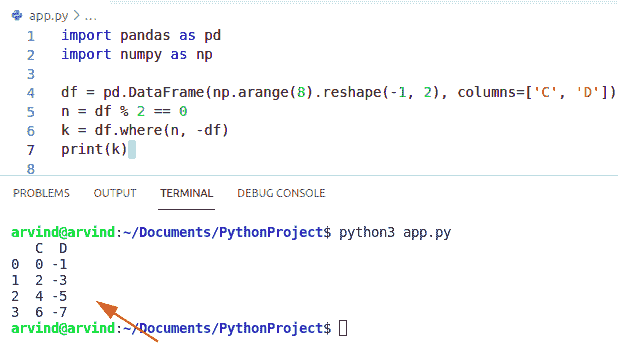
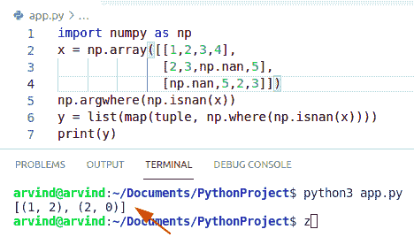
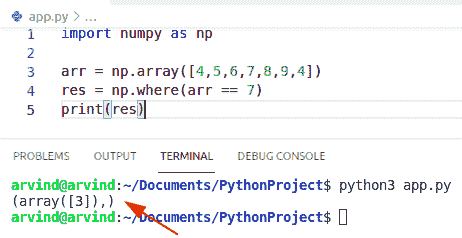
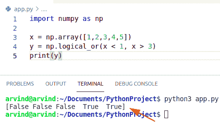
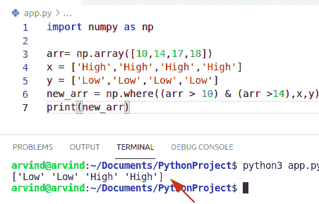
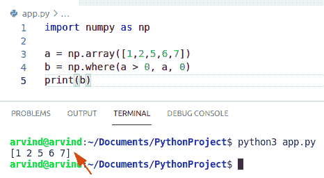

# Python NumPy where 示例

> 原文：<https://pythonguides.com/python-numpy-where/>

[](https://sharepointsky.teachable.com/p/python-and-machine-learning-training-course)

在本 [Python NumPy 教程](https://pythonguides.com/numpy/)中，我们将讨论 `Python NumPy where` ，我们还将涵盖以下示例:

*   Python NumPy，其中多个条件
*   Python NumPy where 示例
*   Python NumPy where 索引
*   Python NumPy where dataframe
*   Python NumPy where nan
*   Python NumPy where 返回索引
*   Python NumPy where or
*   Python NumPy where 和
*   Python NumPy 在列表中的位置

目录

[](#)

*   [Python NumPy where](#Python_NumPy_where "Python NumPy where")
*   [Python NumPy where 多个条件](#Python_NumPy_where_multiple_conditions "Python NumPy where multiple conditions")
*   [Python numpy where 示例](#Python_numpy_where_examples "Python numpy where examples")
*   [Python NumPy 其中的索引](#Python_NumPy_where_the_index "Python NumPy where the index")
*   [Python numpy where data frame](#Python_numpy_where_dataframe "Python numpy where dataframe")
*   [Python NumPy where nan](#Python_NumPy_where_nan "Python NumPy where nan")
*   [Python numpy where 返回索引](#Python_numpy_where_return_index "Python numpy where return index")
*   [Python numpy where or](#Python_numpy_where_or "Python numpy where or")
*   [Python numpy where 和](#Python_numpy_where_and "Python numpy where and")
*   [Python numpy 在列表中的位置](#Python_numpy_where_in_list "Python numpy where in list")

## Python NumPy where

*   在本节中，我们将了解到 `Python NumPy where` 。
*   Python NumPy 模块提供了一个函数，用于将 [NumPy 数组](https://pythonguides.com/python-numpy-array/)转换为另一个 NumPy 数组。
*   基于 NumPy 数组的条件和两个不同序列的值。
*   这是一个条件表达式，返回布尔值的 NumPy 数组。另外两个参数是 X 和 Y，它们是可选参数。这些可以是类似阵列的结构。
*   如果 X 和 Y 都被传入 **NumPy，其中**则返回基于原始数组的条件从 X 和 Y 中选择的元素。
*   因此，如果 X 和 Y 参数都被传递，那么它通过基于对原始 NumPy 数组应用条件的结果选择 X 和 Y 项，返回一个新的 NumPy 数组。
*   如果没有传递 X 和 Y 参数，则只传递 condition 参数，然后返回条件返回的布尔 NumPy 数组中为真的元素的索引。

**语法:**

下面是 Python numpy 的语法，其中:

```py
numpy.where
           (
            condition
            [
            x,
            y
            ]
            )
```

*   它由三个论点组成
    *   **条件:** array_like，布尔型
    *   **x，y** :从中选择的值。x，y 和 condition 需要是某种形状。
    *   **out:** ndarray(一个数组，其中条件为真的元素来自 x，其他位置的元素来自 y。

**举例:**

*   假设我们有一个 numpy 数组和两个 list 对象。
*   现在我们想把这个 numpy 数组转换成另一个同样大小的数组，它将包含给定列表中的值。
*   例如，数组中的值大于 5，则应在高位替换，如果小于 5 或等于 5，则应在低位替换。

我们举个例子来检查一下如何在 numpy 中使用 where 函数。

```py
import numpy as np

arr= np.array([4,5,6,7])
x = ['High','High','High','High']
y = ['Low','Low','Low','Low']
new_arr = np.where(arr > 5,x,y)
print(new_arr)
```

以下是给定代码的截图



Python numpy where

阅读: [Python NumPy Random](https://pythonguides.com/python-numpy-random/)

## Python NumPy where 多个条件

*   在这一节中，我们将了解到 **Python NumPy，其中多个条件** s。
*   在具有多个条件的 numpy 数组上使用 **numpy.where()方法**返回每个条件为真的数组的索引。
*   在这个方法中，我们使用逻辑运算符将 numpy.where()与多个条件结合使用
*   逻辑“与”用于定义条件。第一个 where()函数应用于一维数组，该数组将返回输入数组的索引数组，其中条件将返回 true。

**语法:**

下面是 Python numpy 的语法，其中

```py
numpy.where
           (
            condition
            [
            x,
            y
            ]
            )
```

**举例:**

假设我们有一个 numpy 数组。现在让我们看看如何在 `where` 函数中传递多个条件。现在有一些要点需要记住，我们第二个传递的列表的大小，第三个参数应该总是等于 numpy 数组的大小。

```py
import numpy as np

arr= np.array([10,14,17,18])
x = ['High','High','High','High']
y = ['Low','Low','Low','Low']
new_arr = np.where((arr > 10) & (arr >14),x,y)
print(new_arr)
```

以下是给定代码的截图



Python numpy where multiple condition

在这里，我们看到了一个 **NumPy 的例子，其中 Python 中的多个条件**。

读取:[检查 Python 中的 NumPy 数组是否为空](https://pythonguides.com/check-if-numpy-array-is-empty/)

## Python numpy where 示例

*   在本节中，我们将学习 Python NumPy where()示例。
*   在这种方法中，我们将查看 NumPy 的各种方式，其中函数可以用于各种用例。
*   首先我们举一个例子，用 **numpy.where()函数**替换元素。我们将使用一个 2d 随机数组，只输出正元素。
*   第二个例子是只在一个条件下使用 `numpy.where()` 。
*   第三个例子是用 numpy.where()广播。如果我们提供所有的条件 x 和 y 数组，NumPy 将一起广播它们。

**语法:**

下面是 Python numpy 的语法，其中

```py
numpy.where
           (
            condition
            [
            x,
            y
            ]
            )
```

**举例:**

```py
import numpy as np

a = np.array([1,2,5,6,7])
b = np.where(a > 0, a, 0)
print(b)

a = np.array([2,6,7,8])
b = np.where(a > 0) #only one condition
print(b)

a = np.array([2,5,7,8,9])
b = np.array([4,5,6,8,9])
c = np.where(a < 5, a, b * 10) #broadcasting with numpy 
print(c)
```

以下是给定代码的截图



Python numpy where examples

阅读: [Python NumPy zeros +示例](https://pythonguides.com/python-numpy-zeros/)

## Python NumPy 其中的索引

*   在本节中，我们将了解 `Python NumPy where() index` 。
*   在这个方法中，我们将讨论如何使用 numpy.where()在 NumPy 数组中查找值的索引。
*   数组索引是指使用方括号来索引数组值。
*   首先，我们必须创建一个 numpy 数组，搜索元素并获取值为 4 的元素的索引。

**语法:**

下面是 Python numpy 的语法，其中

```py
numpy.where
           (
            condition
            [
            x,
            y
            ]
            )
```

**举例:**

```py
import numpy as np

arr = np.array([4,5,6,7,8,9,4])
res = np.where(arr == 4)
print(res)
```

以下是给定代码的截图



Python numpy where the index

阅读: [Python NumPy Sum +示例](https://pythonguides.com/python-numpy-sum/)

## Python numpy where data frame

*   在本节中，我们将了解`Python NumPy where()data frame`。
*   首先，我们必须用随机数 0 和 100 创建一个数据帧。
*   对于调用数据帧中的每个元素，如果条件为真，则使用该元素，否则使用数据帧中的相应元素。

**语法:**

以下是 where dataframe 的语法

```py
Dataframe.where
               (
                cond,
                other=nan.
                axis=None,
                level=None,
                try_cast=false
               )
```

*   它由几个参数组成。
    *   **条件:【cond 为真的地方，保持原来的值。如果为 False，则替换为其他中的相应值。如果 cond 是可调用的，则在系列/数据帧上计算，并应返回布尔系列/数据帧或数组。**
    *   **其他:**定标器、系列/数据框架或可封装。
    *   **轴:**如果需要，对准轴。
    *   **水平:**校准水平，如果需要。

**举例:**

```py
import pandas as pd
import numpy as np

df = pd.DataFrame(np.arange(8).reshape(-1, 2), columns=['C', 'D'])
n = df % 2 == 0
k = df.where(n, -df)
print(k)
```

以下是给定代码的截图



Python numpy where dataframe

阅读: [Python NumPy arange](https://pythonguides.com/python-numpy-arange/)

## Python NumPy where nan

*   在本节中，我们将学习 Python numpy `where` () nan。
*   在这个方法中，我们将组合函数 `np.isnan` 和 `np.where()` 来替换 nan 值。
*   Nan 代表非数字，是一个数值数据类型值。
*   可以用 np。其中匹配对应于数组的 nan 值的布尔条件，并映射每个结果以生成元组列表。

**举例:**

```py
import numpy as np
x = np.array([[1,2,3,4],
              [2,3,np.nan,5],
              [np.nan,5,2,3]])
np.argwhere(np.isnan(x))
y = list(map(tuple, np.where(np.isnan(x))))
print(y)
```

以下是给定代码的截图



Python numpy where nan

## Python numpy where 返回索引

*   在本节中，我们将了解到 **Python numpy where()返回索引**。
*   在这个方法中，我们将讨论如何使用 numpy 返回 NumPy 数组中值的索引。其中()。
*   首先，我们必须创建一个 NumPy 数组，搜索元素并获取值为 7 的元素的索引。
*   结果是一个数组元组(每个轴一个),其中包含数组 arr 中值为 7 的索引。

**语法:**

下面是 Python numpy 的语法，其中

```py
numpy.where
           (
            condition
            [
            x,
            y
            ]
            )
```

**举例:**

```py
import numpy as np

arr = np.array([4,5,6,7,8,9,4])
res = np.where(arr == 7)
print(res)
```

以下是给定代码的截图



Python numpy where return index

阅读: [Python NumPy append + 9 示例](https://pythonguides.com/python-numpy-append/)

## Python numpy where or

*   在本节中，我们将了解 **Python NumPy where()或**。
*   逻辑 OR 运算符按元素计算 arr1 或 arr2 的真值。
*   它将返回应用于 arr1 和 arr2 的元素的逻辑或运算的布尔结果。

**语法:**

```py
numpy.logical_or
               (
                arr1,
                arr2,
                out=None,
                where=True,
                casting='same_kind',
                dtype=None
               )
```

**举例:**

```py
import numpy as np

x = np.array([1,2,3,4,5])
y = np.logical_or(x < 1, x > 3)
print(y)
```

以下是给定代码的截图



Python numpy where or

## Python numpy where 和

*   在本节中，我们将学习 **Python numpy where()和**。
*   在这个方法中，我们使用逻辑运算符来使用带有多个条件的 `numpy.where()`
*   逻辑“与”用于定义条件。第一个 where()函数应用于一维数组，该数组将返回输入数组的索引数组，其中条件将返回 true。

**举例:**

```py
import numpy as np

arr= np.array([10,14,17,18])
x = ['High','High','High','High']
y = ['Low','Low','Low','Low']
new_arr = np.where((arr > 10) & (arr >14),x,y)
print(new_arr)
```

以下是给定代码的截图



Python numpy where And

阅读: [Python NumPy where](https://pythonguides.com/python-numpy-where-with-examples/)

## Python numpy 在列表中的位置

*   在本节中，我们将学习 list 中的 **Python NumPy where()。**
*   首先，我们创建一个列表并使用函数 numpy.where() 。
*   在本例中，将创建一个 Python 列表和一个 Numpy 数组。将计算每个元素的大小，然后计算两个容器的总大小，并进行比较

**举例:**

```py
import numpy as np

a = np.array([1,2,5,6,7])
b = np.where(a > 0, a, 0)
print(b)
```

以下是给定代码的截图



Python numpy where in list

您可能会喜欢以下 Python 教程:

*   [Python NumPy linspace](https://pythonguides.com/python-numpy-linspace/)
*   [Python NumPy 串接](https://pythonguides.com/python-numpy-concatenate/)
*   [Python 集合的交集](https://pythonguides.com/python-intersection-of-sets/)
*   [Python 逐行读取文件示例](https://pythonguides.com/python-read-a-file-line-by-line/)
*   [用 Python 创建和修改 PDF 文件](https://pythonguides.com/create-and-modify-pdf-file-in-python/)
*   [Python NumPy 绝对值](https://pythonguides.com/python-numpy-absolute-value/)

在本 Python 教程中，我们讨论了 `Python NumPy where` ，我们还将涵盖以下示例:

*   Python NumPy，其中多个条件
*   Python NumPy where 示例
*   Python NumPy where 索引
*   Python NumPy where dataframe
*   Python NumPy where nan
*   Python NumPy where 返回索引
*   Python NumPy where or
*   Python NumPy where 和
*   Python NumPy 在列表中的位置

[Bijay Kumar](https://pythonguides.com/author/fewlines4biju/)

Python 是美国最流行的语言之一。我从事 Python 工作已经有很长时间了，我在与 Tkinter、Pandas、NumPy、Turtle、Django、Matplotlib、Tensorflow、Scipy、Scikit-Learn 等各种库合作方面拥有专业知识。我有与美国、加拿大、英国、澳大利亚、新西兰等国家的各种客户合作的经验。查看我的个人资料。

[enjoysharepoint.com/](https://enjoysharepoint.com/)[](https://www.facebook.com/fewlines4biju "Facebook")[](https://www.linkedin.com/in/fewlines4biju/ "Linkedin")[](https://twitter.com/fewlines4biju "Twitter")