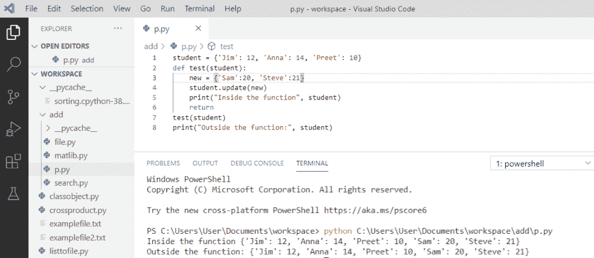
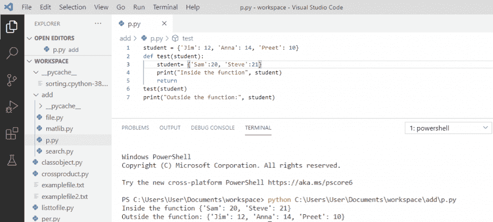
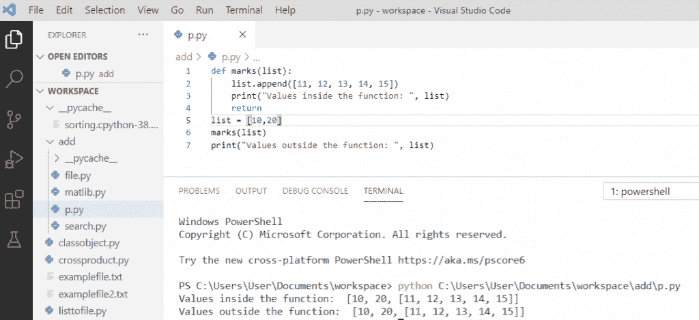
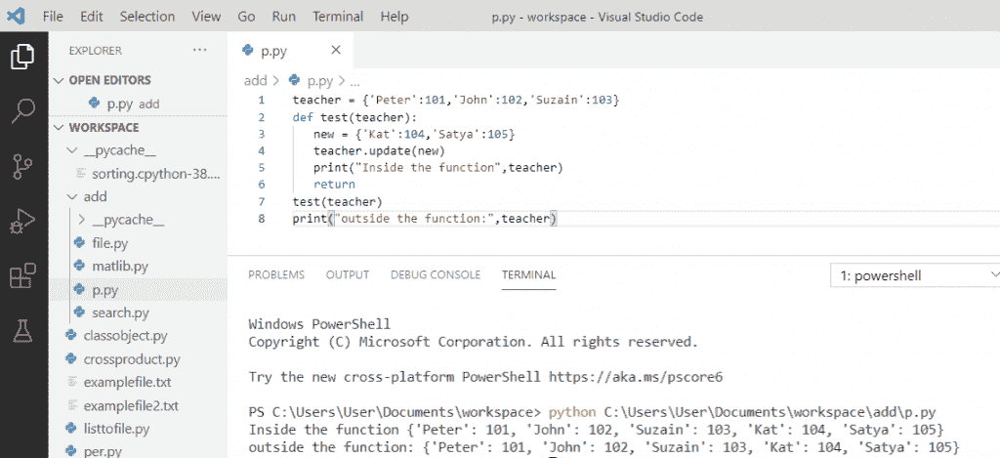
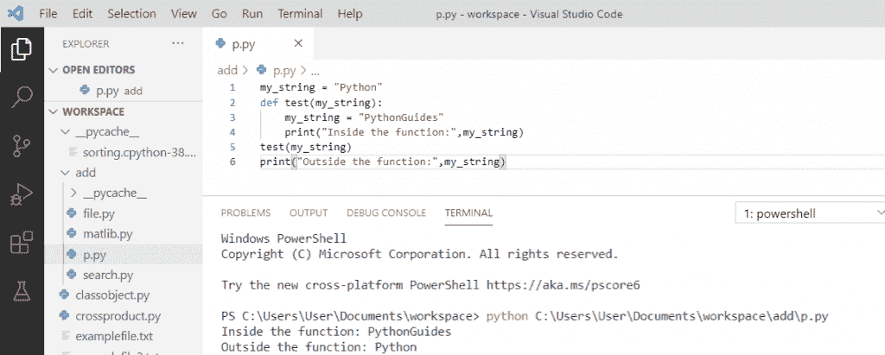

# Python 通过引用或值传递示例

> 原文：<https://pythonguides.com/python-pass-by-reference-or-value/>

[](https://sharepointsky.teachable.com/p/python-and-machine-learning-training-course)

在这个 [Python 教程](https://pythonguides.com/python-hello-world-program/)中，让我们用几个例子来讨论一下关于 **Python 通过引用或值传递**的问题。

*   Python 按引用传递与按值传递
*   Python 通过引用调用与通过值调用
*   Python 通过引用传递示例
*   Python 按值传递示例
*   python 中按引用传递 vs 值传递
*   Python 函数参数通过引用或值传递
*   Python 通过值传递字符串

目录

[](#)

*   [Python 按引用传递 vs 按值传递](#Python_pass_by_reference_vs_pass_by_value "Python pass by reference vs pass by value")
*   [通过引用调用 vs 通过值调用](#Call_by_reference_vs_call_by_value "Call by reference vs call by value")
*   [Python 通过引用传递示例](#Python_pass_by_reference_example "Python pass by reference example")
*   [Python 传值示例](#Python_pass_by_value_example "Python pass by value example")
*   [通过引用传递 vs python 中的值](#Pass_by_reference_vs_value_in_python "Pass by reference vs value in python")
*   [Python 函数参数通过引用或值传递](#Python_function_arguments_pass_by_reference_or_value "Python function arguments pass by reference or value")
*   [Python 通过值传递字符串](#Python_pass_string_by_value "Python pass string by value")

## Python 按引用传递 vs 按值传递

**通过引用传递**–在一些编程语言中使用，函数的参数值通过引用传递，这意味着传递变量的地址，然后对存储在这些地址的值进行操作。

**按值传递**–这意味着该值直接作为值传递给函数的参数。这里，操作是在值上完成的，然后值被存储在地址上。按值传递用于变量的副本。

## 通过引用调用 vs 通过值调用

| **引用调用** | **按值调用** |
| 当调用一个函数时，在编程语言中不是复制变量的值，而是使用变量的地址，这就是所谓的“引用调用” | 在调用一个函数时，当我们通过复制变量来传递值时，这就是所谓的“按值调用” |
| 在这个方法中，传递一个变量本身。 | 变量的副本通过值在调用中传递。 |
| 变量的变化也会影响函数外部的变量值。 | 在变量副本中所做的更改不会修改函数外部的变量值。 |
| 允许您通过使用函数调用来更改变量值。 | 不允许您对实际变量进行任何更改。 |
| 原始值被修改。 | 原始值未修改。 |

阅读: [Python NumPy linspace](https://pythonguides.com/python-numpy-linspace/)

## Python 通过引用传递示例

当我们通过引用传递一些东西时，我们对函数内部变量的任何改变都会反映到外部值上。

**举例:**

```py
student = {'Jim': 12, 'Anna': 14, 'Preet': 10}
def test(student):
    new = {'Sam':20, 'Steve':21}
    student.update(new)
    print("Inside the function", student)
    return 
test(student)
print("Outside the function:", student)
```

写完上面的代码后，一旦你打印出 `"student"` ，输出就会出现。在这里，我们创建了一个名为**学生**的字典，而**测试(学生)**就是这个函数。然后又有两个学生加入进来，所以我们创建了变量 `"new"` ， `student.update(new)` 用于更新字典，打印结果也将显示输出。

你可以参考下面的 **python pass by reference 示例**的截图



Python pass by reference example

## Python 传值示例

当我们通过值传递某个东西时，对函数的更改或变量的复制不会反映到调用函数中。

**举例:**

```py
student = {'Jim': 12, 'Anna': 14, 'Preet': 10}
def test(student):
    student = {'Sam':20, 'Steve':21}
    print("Inside the function", student)
    return 
test(student)
print("Outside the function:", student)
```

写完上面的代码后，一旦你打印出 `"student"` ，输出就会出现。在这里，我们创建了一个名为**学生**的字典，而**测试(学生)**就是这个函数。然后又有两个学生加入进来，所以我们创建了变量 `"new"` ，打印结果将会显示出来。我们可以看到内外函数保持不变。

关于 **python 传值示例**，可以参考下面的截图



Python pass by value example

## 通过引用传递 vs python 中的值

在下面的例子中，我们可以看到 python 语言中的所有参数都是通过引用传递的。因此，如果我们在函数中改变参数所指的内容，这种改变也会反映到调用函数中。

**举例:**

```py
def marks(list):
    list.append([11, 12, 13, 14, 15])
    print("Value inside the function: ", list)
    return
list = [10,20]
marks(list)
print("Value outside the function: ", list)
```

在这个输出中，我们可以看到我们维护了被传递对象的引用，并且值被追加到同一个对象中。你可以看到内部函数和外部函数的输出。

可以参考下面截图**通过引用传递 vs python 中的值**



Pass by reference in python

## Python 函数参数通过引用或值传递

python 语言中的参数是通过引用传递的。这意味着如果我们改变函数中的参数，这种改变也会在调用函数中反映出来。

**举例:**

```py
teacher = {'Peter':101, 'John':102, 'Suzain':103}
def test(teacher):
   new = {'kat':104, 'Satya':105}
   teacher.update(new)
   print("Inside the function",teacher)
   return
test(teacher)
print("Outside the function:",teacher)
```

写完上面的代码后，一旦你打印出 `"teacher"` ，输出就会出现。在这里，我们创建了一个名为**老师**的字典，而 `def` **test(老师)**就是这个函数。然后又有两位老师加入进来，所以我们创建了变量**“new”**，打印结果将会显示出来。我们可以看到内外函数保持不变。

可以参考下面截图 **python 函数参数传参或传值**。



Python function arguments pass by reference or value

阅读: [Python NumPy concatenate](https://pythonguides.com/python-numpy-concatenate/)

## Python 通过值传递字符串

在这个例子中，我们将字符串传递给了一个函数，字符串值是一个不可变的对象，它将被传递给函数。因此，对函数的更改或变量的复制不会反映到调用函数中。

**举例:**

```py
my_string = "Python"
def test(my_string):
    my_string = "PythonGuides"
    print("Inside the function:",my_string)
test(my_string)
print("Outside the function:",my_string)
```

在这个输出中，一旦你打印了 `"my_string"` ，输出就会出现。在这里，我们创建了名为`def``test(my _ string)`的函数。这里，传递类似于通过值传递字符串，因为我们不能改变不可变对象的值。

可以参考下面截图 **python 通过值传递字符串**。



Python pass string by value

您可能会喜欢以下 Python 教程:

*   [Python 从列表中选择+示例](https://pythonguides.com/python-select-from-a-list/)
*   [Python Tkinter Listbox–如何使用](https://pythonguides.com/python-tkinter-listbox/)
*   [Python 复制文件(示例)](https://pythonguides.com/python-copy-file/)
*   [Python 文件方法(附有用例子)](https://pythonguides.com/python-file-methods/)
*   [Python tkinter messagebox +示例](https://pythonguides.com/python-tkinter-messagebox/)
*   [集合的并集 Python +实例](https://pythonguides.com/union-of-sets-python/)
*   [如何在 Python 中把字符串转换成日期时间](https://pythonguides.com/convert-a-string-to-datetime-in-python/)
*   [Python 中的转义序列](https://pythonguides.com/escape-sequence-in-python/)

在这个 Python 教程中，我们学习了通过引用或值传递的 **python。此外，我们还讨论了以下主题:**

*   Python 按引用传递与按值传递
*   Python 通过引用调用与通过值调用
*   Python 通过引用传递示例
*   Python 按值传递示例
*   python 中按引用传递 vs 值传递
*   Python 函数参数通过引用或值传递
*   Python 通过值传递字符串

[Bijay Kumar](https://pythonguides.com/author/fewlines4biju/)

Python 是美国最流行的语言之一。我从事 Python 工作已经有很长时间了，我在与 Tkinter、Pandas、NumPy、Turtle、Django、Matplotlib、Tensorflow、Scipy、Scikit-Learn 等各种库合作方面拥有专业知识。我有与美国、加拿大、英国、澳大利亚、新西兰等国家的各种客户合作的经验。查看我的个人资料。

[enjoysharepoint.com/](https://enjoysharepoint.com/)[](https://www.facebook.com/fewlines4biju "Facebook")[](https://www.linkedin.com/in/fewlines4biju/ "Linkedin")[](https://twitter.com/fewlines4biju "Twitter")