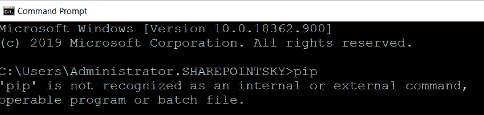
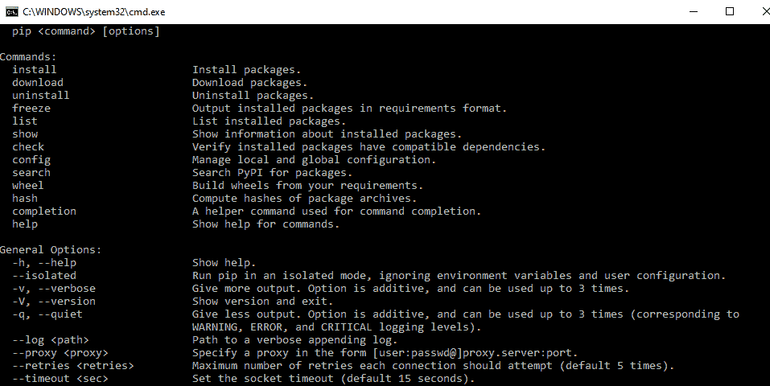

# Python pip 不被识别为内部或外部命令

> 原文：<https://pythonguides.com/python-pip-is-not-recognized/>

[](https://sharepointsky.teachable.com/p/python-and-machine-learning-training-course)

在本 [Python 教程](https://pythonguides.com/python-download-and-installation/)中，我们将讨论如何修复 Python‘pip’不被识别为内部或外部命令的问题。

## Python pip 不被识别为内部或外部命令

在 python 中，**‘pip’不被识别为内部或外部命令**当 python 和预期版本未安装时，我们会得到此错误，我们可以通过在 cmd 中写入 pip，使用 cmd 提示符来检查此错误。

**举例:**

```py
C:\Users\Administration.SHAREPOINTSKY>pip
```

编写上述代码后(python 'pip '不被识别为内部或外部命令)，您将在 cmd 提示符下编写 `"pip"` ，然后输出将显示为 **"Python 'pip '不被识别为内部或外部命令**"。

这里，没有安装 pip python 包，所以它给出了一个错误。你可以参考下面的截图 python 的‘pip’不被识别为内部或外部命令。



Python ‘pip’ is not recognized as an internal or external command

为了解决这个**错误:python‘pip’不被识别为内部或外部命令**我们需要从 python.org[安装最新版本的 python](https://python.org/)，那么 pip 在 python 中是默认存在的。

要检查是否安装了 pip，我们可以进入 cmd 提示符，通过在 cmd 提示符下写入 pip，我们可以看到所有的包。

**举例:**

```py
C:\Users\Administration.SHAREPOINTSKY>pip
```

写完上面的代码后(python 'pip '不被识别为内部或外部命令)，你将在 cmd 提示符下写 `"pip"` ，然后输出将会出现。在这里，我们可以看到 pip python 包，错误已经修复。

你可以参考下面的截图 python 的‘pip’不被识别为内部或外部命令。



windows python pip is not recognized

您可能会喜欢以下 Python 教程:

*   [Python 将元组转换为列表](https://pythonguides.com/python-convert-tuple-to-list/)
*   [python 中的百分号是什么意思](https://pythonguides.com/percent-sign-mean-in-python/)
*   [Python 内置函数示例](https://pythonguides.com/python-built-in-functions/)
*   [获取当前目录 Python](https://pythonguides.com/get-current-directory-python/)
*   [语法错误返回外部函数 python](https://pythonguides.com/syntaxerror-return-outside-function-python/)
*   [从字符串 Python 中删除字符](https://pythonguides.com/remove-character-from-string-python/)
*   [Python 类型错误:“列表”对象不可调用](https://pythonguides.com/python-typeerror-list-object-is-not-callable/)

这就是如何修复 **python pip 不被识别为内部或外部命令**错误。

[Bijay Kumar](https://pythonguides.com/author/fewlines4biju/)

Python 是美国最流行的语言之一。我从事 Python 工作已经有很长时间了，我在与 Tkinter、Pandas、NumPy、Turtle、Django、Matplotlib、Tensorflow、Scipy、Scikit-Learn 等各种库合作方面拥有专业知识。我有与美国、加拿大、英国、澳大利亚、新西兰等国家的各种客户合作的经验。查看我的个人资料。

[enjoysharepoint.com/](https://enjoysharepoint.com/)[](https://www.facebook.com/fewlines4biju "Facebook")[](https://www.linkedin.com/in/fewlines4biju/ "Linkedin")[](https://twitter.com/fewlines4biju "Twitter")