# Python 使用 Matplotlib 绘制多条线

> 原文：<https://pythonguides.com/python-plot-multiple-lines/>

[](https://sharepointsky.teachable.com/p/python-and-machine-learning-training-course)

在本 Python 教程中，我们将讨论如何使用 Python 中的 matplotlib 来**绘制多条线，我们还将涵盖以下主题:**

*   Python 在同一图表上绘制多条线
*   Python 绘制了多条不同颜色线
*   Python 使用图例绘制多条线
*   Python 从数组中绘制多行
*   Python 从数据帧绘制多条线
*   Python 为循环绘制多行
*   Python 用不同 y 轴绘制多条线
*   Python 绘制多线时间序列
*   Python 在 3D 中绘制多条线
*   Matplotlib 用相同的颜色绘制多条线。
*   Matplotlib 绘图标题多行
*   Matplotlib 在子情节中绘制多行
*   Matplotlib 绘制多条不同长度的线
*   Matplotlib 绘制多条线
*   Matplotlib 从 csv 文件中绘制多行

目录

[](#)

*   [Python 在同一图形上绘制多条线](#Python_plot_multiple_lines_on_same_graph "Python plot multiple lines on same graph")
*   [Python 绘制多条不同颜色的线条](#Python_plot_multiple_lines_of_different_color "Python plot multiple lines of different color")
*   [Python 用图例绘制多条线](#Python_plot_multiple_lines_with_legend "Python plot multiple lines with legend")
*   [Python 从数组中绘制多行](#Python_plot_multiple_lines_from_array "Python plot multiple lines from array")
*   [Python 从数据帧中绘制多条线](#Python_plot_multiple_lines_from_dataframe "Python plot multiple lines from dataframe")
*   [Python 为循环绘制多条线](#Python_plot_multiple_lines_for_loop "Python plot multiple lines for loop")
*   [Python 用不同的 y 轴绘制多条线](#Python_plot_multiple_lines_with_different_y_axis "Python plot multiple lines with different y axis")
*   [Python 绘制多行时间序列](#Python_plot_multiple_lines_time_series "Python plot multiple lines time series")
*   [Python 在 3D 中绘制多条线](#Python_plot_multiple_lines_in_3D "Python plot multiple lines in 3D")
*   [Matplotlib 用相同的颜色绘制多条线](#Matplotlib_plot_multiple_lines_with_same_color "Matplotlib plot multiple lines with same color")
*   [Matplotlib 图标题多行](#Matplotlib_plot_title_multiple_lines "Matplotlib plot title multiple lines")
*   [Matplotlib 在子情节中绘制多行](#Matplotlib_plot_multiple_lines_in_subplot "Matplotlib plot multiple lines in subplot")
*   [Matplotlib 绘制多条不同长度的线](#Matplotlib_plot_multiple_lines_different_length "Matplotlib plot multiple lines different length")
*   [Matplotlib 绘制多条线 seaborn](#Matplotlib_plot_multiple_lines_seaborn "Matplotlib plot multiple lines seaborn")
*   [Matplotlib 从 csv 文件中绘制多行](#Matplotlib_plot_multiple_lines_from_csv_files "Matplotlib plot multiple lines from csv files")

## Python 在同一图形上绘制多条线

Python 提供了 [Matplotlib 库](https://pythonguides.com/what-is-matplotlib/)，这是数据可视化最常用的包。它为有效的数据可视化提供了各种各样的绘图、工具和扩展库。您可以从列表、数组、数据帧和外部文件(CSV、JSON 等)等不同来源创建数据的 2D 和 3D 图。).

它提供了一个名为 `pyplot` 的 API(或简单的子模块),其中包含不同类型的绘图、图形和相关函数来可视化数据。折线图是一种在 X-Y 平面上显示两个量之间关系的图表/图形。

您还可以使用 python 中的 matplotlib 在同一个图表/图形上绘制多条线。您可以按照给定的步骤来完成此操作:

*   导入必要的库(来自 matplotlib 的 pyplot 用于可视化，numpy 用于数据创建和操作，pandas 用于数据框架和导入数据集，等等)。
*   定义必须可视化的数据值(定义 x 和 y 或数组或数据帧)。
*   绘制数据(多行)并在图中添加所需的特征(标题、调色板、厚度、标签、注释等)。
*   显示曲线图(图形/图表)。也可以保存剧情。

让我们用 python 绘制一个包含两条线的简单图形。因此，打开您的 IPython shell 或 Jupiter 笔记本，按照下面的代码操作:

```py
# Importing packages
import matplotlib.pyplot as plt

# Define data values
x = [7, 14, 21, 28, 35, 42, 49]
y = [5, 12, 19, 21, 31, 27, 35]
z = [3, 5, 11, 20, 15, 29, 31]

# Plot a simple line chart
plt.plot(x, y)

# Plot another line on the same chart/graph
plt.plot(x, z)

plt.show()
```

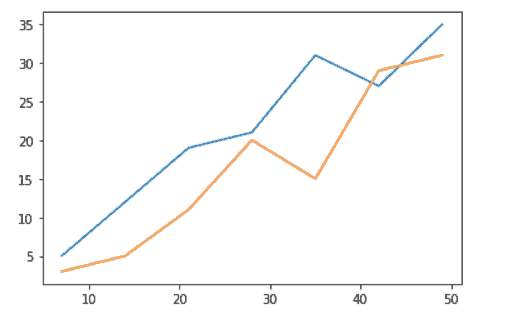

Python plot multiple lines on the same graph

在上面的示例中，数据准备为 x，y，z 列表。然后使用不同的 x，y 参数调用 `matplot.pyplot.plot()` 函数两次，以绘制两条不同的线。最后，调用 `matplot.pyplot.show()` 函数，显示包含该函数之前定义的属性的图形。

阅读:[如何安装 matplotlib](https://pythonguides.com/how-to-install-matplotlib-python/)

## Python 绘制多条不同颜色的线条

您可以使用 matplotlib 在 python 中指定图表中线条的颜色。您必须在 matplotlib.pyplot 的 `plot()` 函数中指定参数 `color` 的值

python 中有多种颜色可供选择。您可以通过名称或代码或用引号括起来的十六进制代码来指定颜色。

您可以将颜色参数指定为**位置参数**(例如，‘c’–>表示青色；y '–>表示黄色)或作为**关键字自变量**(例如，color = ' r '–>表示红色；color = ' greencolor = ' # b 026 ff '–>表示霓虹紫色)。

```py
# Importing packages
import matplotlib.pyplot as plt

# Define data values
x = [7, 14, 21, 28, 35, 42, 49]
y = [5, 12, 19, 21, 31, 27, 35]
z = [3, 5, 11, 20, 15, 29, 31]

# Plot a simple line chart
plt.plot(x, y, 'c')

# Plot another line on the same chart/graph
plt.plot(x, z, 'y')

plt.show()
```

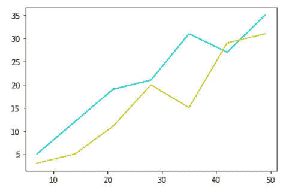

Python plot multiple lines of different color

阅读: [Matplotlib 绘制一条线](https://pythonguides.com/matplotlib-plot-a-line/)

## Python 用图例绘制多条线

通过在 matplotlib.pyplot.plot()函数中添加参数 `label` ,指定为线指定的名称，可以在 python 中使用 matplotlib 向图表添加图例以区分图表中的多条线。

绘制完所有线条后，在显示图形之前，调用`matplotlib . py plot . legend()`方法，该方法会将图例添加到图形中。

```py
# Importing packages
import matplotlib.pyplot as plt

# Define data values
x = [7, 14, 21, 28, 35, 42, 49]
y = [5, 12, 19, 21, 31, 27, 35]
z = [3, 5, 11, 20, 15, 29, 31]

# Plot a simple line chart
plt.plot(x, y, 'g', label='Line y')

# Plot another line on the same chart/graph
plt.plot(x, z, 'r', label='Line z')

plt.legend()
plt.show()
```

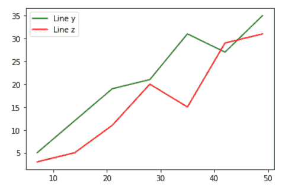

Python plot multiple lines with a legend

## Python 从数组中绘制多行

您可以使用 matplotlib 根据 python 中数组提供的数据绘制多条线。可以通过在 matplotlib.pyplot.plot()函数中将数组的不同列指定为 x 轴和 y 轴参数来实现。您可以通过对数组进行切片来选择列。

让我们首先为例子准备数据。使用 `numpy.array()` 函数创建一个数组。在下面的例子中，一个 2D 列表被传递给 numpy.array()函数。

```py
import numpy as np

# Define data values in array
arr = np.array([[7, 5, 3], [14, 12, 5], [21, 19, 11],
                [28, 21, 20], [35, 31, 15], [42, 27, 29],
                [49, 35, 31]])

print(np.shape(arr), type(arr), arr, sep='\n')
```

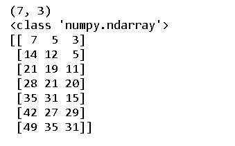

Python create 2D array

现在，绘制多条线来表示第一列与数组中其他列的关系。

```py
import matplotlib.pyplot as plt

# Plot a simple line chart
plt.plot(arr[:, 0], arr[:, 1], 'g', label='Line y')

# Plot another line on the same chart/graph
plt.plot(arr[:, 0], arr[:, 2], 'r', label='Line z')

plt.legend()
plt.show()
```

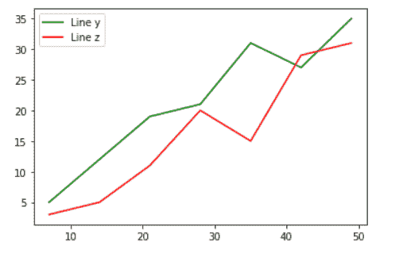

Python plot multiple lines from an array

阅读:[什么是 NumPy](https://pythonguides.com/numpy/)

## Python 从数据帧中绘制多条线

您可以使用 matplotlib 从 python 中的 `Dataframe` 提供的数据中绘制多条线。可以通过在 matplotlib.pyplot.plot()函数中将 dataframe 的不同列指定为 x 轴和 y 轴参数来实现。您可以通过对数据帧进行切片来选择列。

让我们为例子准备数据。使用**熊猫创建一个数据框。**熊猫**库的 DataFrame()** 函数。在下面的例子中，一个 2D 列表被传递给熊猫。DataFrame()函数，并且列名已被重命名为' x '，' y '，' z '。

```py
import pandas as pd
import numpy as np

# Define data values by creating a Dataframe using a n-dimensional list
df = pd.DataFrame([[7, 5, 3], [14, 12, 5], [21, 19, 11],
                   [28, 21, 20], [35, 31, 15], [42, 27, 29],
                   [49, 35, 31]])

df.rename(columns={0: 'x', 1: 'y', 2: 'z'}, inplace=True)

print(np.shape(df), type(df), df, sep='\n')
```


Python Create Dataframe using a 2D list

现在，使用 matplotlib.pyplot.plot()函数绘制多条线。

```py
import matplotlib.pyplot as plt

# Plot a simple line chart
plt.plot(df['x'], df['y'], color='g', label='Line y')

# Plot another line on the same chart/graph
plt.plot(df['x'], df['z'], color='r', label='Line z')

plt.legend()
plt.show()
```

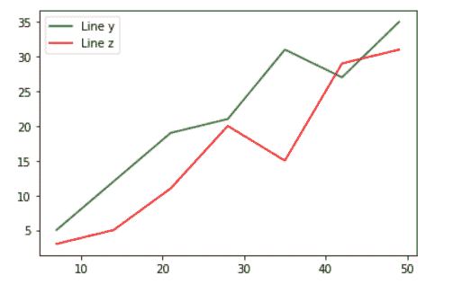

Python plot multiple lines from dataframe

阅读: [Python NumPy 数组](https://pythonguides.com/python-numpy-array/)

## Python 为循环绘制多条线

如果有这样的情况，需要从数据源(数组、数据帧、CSV 文件等)在同一图表上绘制多条线。)，那么使用 matplotlib.pyplot.plot()函数单独绘制线条就变得很耗时。

因此，在这种情况下，您可以使用 for 循环来绘制行数，只需在循环中使用一次 matplotlib.pyplotlib.plot()函数，其中 x 轴和 y 轴参数不是固定的，而是取决于循环计数器。

让我们为示例准备数据，这里创建了一个 4 列 7 行的数据帧。

```py
import pandas as pd
import numpy as np

# Define data values by creating a Dataframe using a n-dimensional list
df = pd.DataFrame([[7, 5, 3, 7], [14, 12, 5, 14], [21, 19, 11, 21],
                  [28, 21, 20, 28], [35, 31, 15, 35], [42, 27, 29, 42],
                  [49, 35, 31, 49]])

df.rename(columns={0: 'x', 1: 'y', 2: 'z', 3: 'p'}, inplace=True)

print(np.shape(df), type(df), df, sep='\n')
```


Python Create Dataframe using an n-dimensional list

在下面的代码中，循环计数器遍历 Dataframe df 的列列表。并且在图上绘制了 3 条线，表示数据帧的第一列与其他 3 列的关系。

```py
import matplotlib.pyplot as plt

for col in df.columns:
    if not col == 'x':
        plt.plot(df['x'], df[col], label='Line '+col)

plt.legend()
plt.show()
```

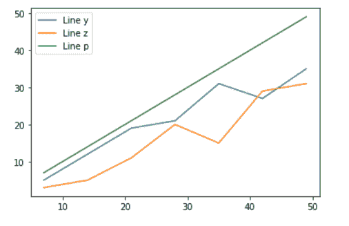

Python plot multiple lines for loop

阅读: [Matplotlib 最佳拟合线](https://pythonguides.com/matplotlib-best-fit-line/)

## Python 用不同的 y 轴绘制多条线

在某些情况下，要绘制在同一图表上的不同数据的值相差很大，当图表设置较大数据的比例时，具有较小数据值的线不会显示其实际趋势。

要解决这个问题，您可以对不同的线使用不同的比例，您可以通过使用图形轴的 `twinx()` 函数来实现，这是由`matplotlib . py plot . subplots()`函数返回的两个对象之一。

让我们通过练习一个简单的例子来使概念更加清晰:

首先，为示例准备数据。使用 python 中的字典创建一个数据框架，其中包含约 20 个国家的人口密度(每平方公里)和面积 100 平方公里。

```py
import pandas as pd

# Let's create a Dataframe using lists
countries = ['Monaco', 'Singapore', 'Gibraltar', 'Bahrain', 'Malta',
             'Maldives', 'Bermuda', 'Sint Maarten', 'Saint Martin',
             'Guernsey', 'Vatican City', 'Jersey', 'Palestine',
             'Mayotte', 'Lebnon', 'Barbados', 'Saint Martin', 'Taiwan',
             'Mauritius', 'San Marino']

area = [2, 106, 6, 97, 76, 80, 53, 34, 24, 13,
       0.49, 86, 94, 16, 17, 3, 2.1, 1.8, 8, 14]

pop_density = [19341, 8041, 5620, 2046, 1390,
               1719, 1181, 1261, 1254, 2706,
               1124.5, 1129, 1108, 1186, 1056,
               1067, 1054, 1052, 944, 954]

# Now, create a pandas dataframe using above lists
df_pop_density = pd.DataFrame(
    {'Country' : countries, 'Area(100kmsq)' : area,
    'Population Density(/kmsq)' : pop_density})

df_pop_density
```

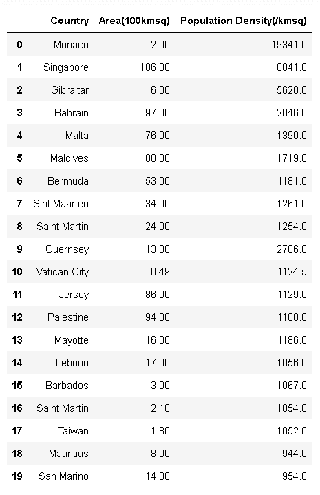

Python Create Dataframe using dictionary

让我们以常规方式绘制数据，而不单独对线条进行缩放。您可以看到，面积线与数据没有显示任何相同的趋势，因为与人口密度相比，该区域的规模非常小。

```py
import matplotlib.pyplot as plt

# Creating figure and axis objects using subplots()
fig, ax = plt.subplots(figsize=[9, 7])

ax.plot(df_pop_density['Country'],
         df_pop_density['Area(100kmsq)'],
         marker='o', linewidth=2, label='Area')
ax.plot(df_pop_density['Country'],
         df_pop_density['Population Density(/kmsq)'],
         marker='o', linewidth=2, linewidth=2, 
         label='Population Density')
plt.xticks(rotation=60)
ax.set_xlabel('Countries')
ax.set_ylabel('Area / Population Density')
plt.legend()
plt.show()
```

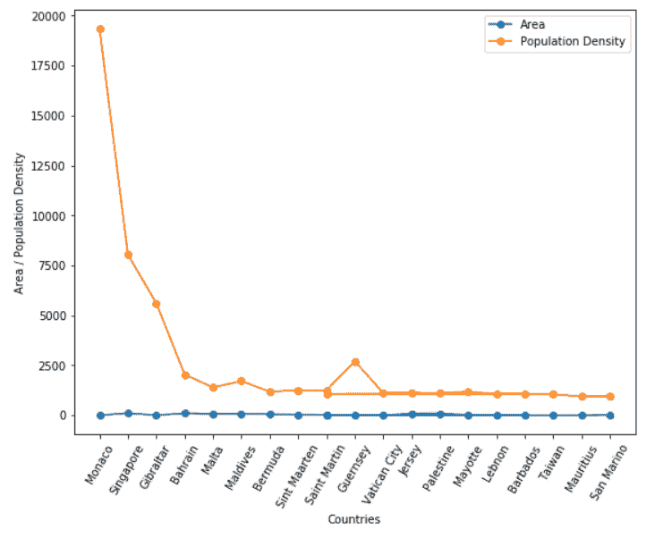

Python plot multiple lines without a different y-axis

现在，让我们使用轴的 `twinx()` 函数绘制具有不同刻度的不同 y 轴的线。您还可以设置不同 y 轴标签的颜色和字体大小。现在，你可以看到所有数据的一些相同的趋势。

```py
# Creating figure and axis objects using subplots()
fig, ax = plt.subplots(figsize=[9, 7])

# Plotting the firts line with ax axes
ax.plot(df_pop_density['Country'],
        df_pop_density['Area(100kmsq)'],
        color='b', linewidth=2, marker='o')
plt.xticks(rotation=60)
ax.set_xlabel('Countries', fontsize=15)
ax.set_ylabel('Area',  color='blue', fontsize=15)

# Create a twin axes ax2 using twinx() function
ax2 = ax.twinx()

# Now, plot the second line with ax2 axes
ax2.plot(df_pop_density['Country'],
         df_pop_density['Population Density(/kmsq)'],
         color='orange', linewidth=2, marker='o')

ax2.set_ylabel('Population Density', color='orange', fontsize=15)

plt.show()
```

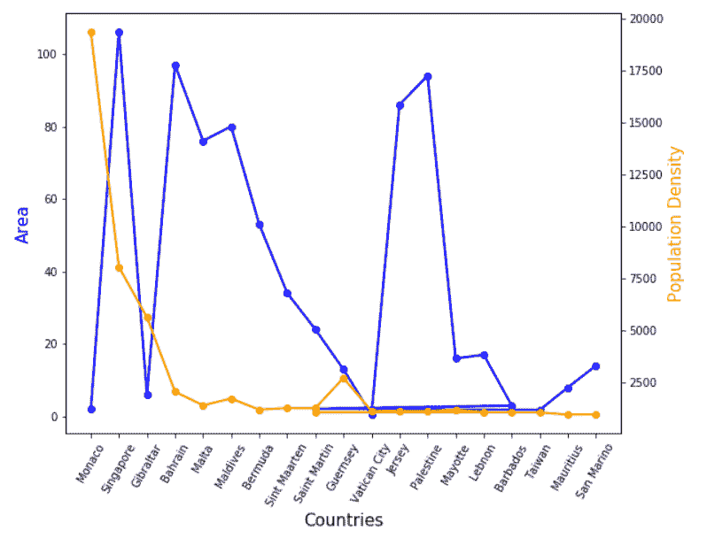

Python plot multiple lines with the different y-axis

阅读: [Matplotlib 支线剧情教程](https://pythonguides.com/matplotlib-subplot-tutorial/)

## Python 绘制多行时间序列

**时间序列**是按时间顺序列出或索引的数据值的集合。它是以连续的时间间隔获取的数据，如股票数据、公司销售数据、气候数据等。这种类型的数据通常用于分析目的。

您可以使用 matplotlib 在 python 中绘制多条线来显示时间序列数据中不同参数的趋势。

让我们导入一个数据集，显示一家公司 8 年(2010 年至 2017 年)的销售详情，您可以使用任何时间序列数据集。

导入数据集后，将日期时间列(此处为“date”)转换为 datestamp 数据类型，并按“Date”列对其进行升序排序。将“日期”列设置为索引，以便更容易绘制数据。

```py
import pandas as pd

# Importing the dataset using the pandas into Dataframe
sales = pd.read_csv('./Data/Sales_records.csv')
print(sales.head(), end='\n\n')

# Converting the Date column to the datestamp type
sales['Date'] = pd.to_datetime(sales['Date'])

# Sorting data in ascending order by the date
sales = sales.sort_values(by='Date')

# Now, setting the Date column as the index of the dataframe
sales.set_index('Date', inplace=True)

# Print the new dataframe and its summary
print(sales.head(), sales.describe(), sep='\n\n')
```

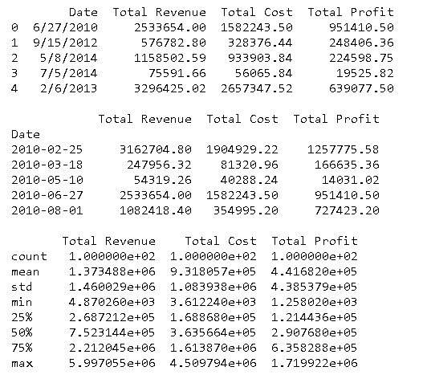

Importing CSV file in python

您可以通过下面给出的两种方法之一绘制带有索引日期时间的时间序列数据。

通过在一个循环中使用 `matplotlib.pyplot.plot()` 函数，或者通过使用 **pandas 中的 `plot()` 函数，从索引的时间序列数据中直接绘制多条线的图形。数据帧**。

在下面的代码中，rcParams 参数列表中的“figure.figsize”参数的值被设置为(15，9)以全局设置图形大小，从而避免在不同的图形中反复设置。您可以遵循下面给出的两种方法中的任何一种:

```py
import matplotlib.pyplot as plt

# setting the graph size globally
plt.rcParams['figure.figsize'] = (15, 9)

# No need of this statement for each graph: plt.figure(figsize=[15, 9])

for col in sales.columns:
    plt.plot(sales[col], linewidth=2, label=col)

plt.xlabel('Date', fontsize=20)
plt.ylabel('Sales', fontsize=20)
plt.xticks(fontsize=18)
plt.yticks(fontsize=18)
plt.legend(fontsize=18)
# plt.set_cmap('Paired') # You can set the colormap to the graph
plt.show()

# OR You can also plot a timeseries data by the following method

sales.plot(colormap='Paired', linewidth=2, fontsize=18)
plt.xlabel('Date', fontsize=20)
plt.ylabel('Sales', fontsize=20)
plt.legend(fontsize=18)
plt.show()
```

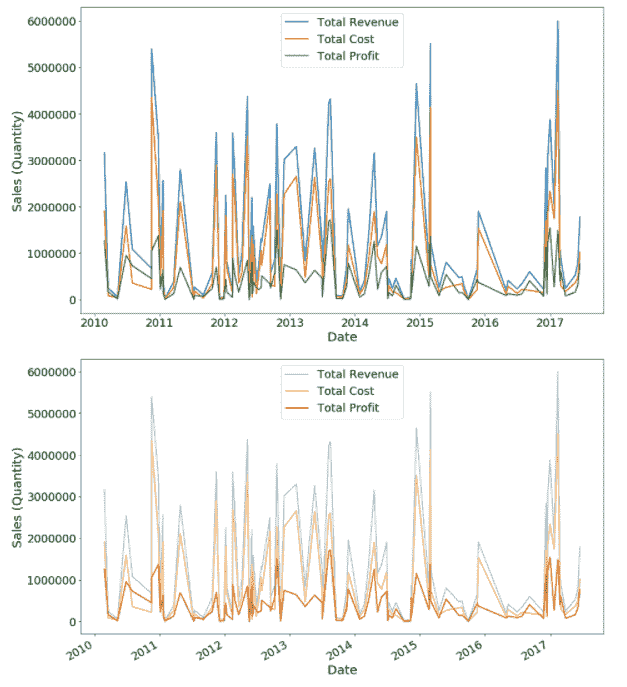

Python plot multiple lines time series

阅读: [Matplotlib 绘图条形图](https://pythonguides.com/matplotlib-plot-bar-chart/)

## Python 在 3D 中绘制多条线

您可以使用 matplotlib 并通过从模块 `mpl_toolkits` 导入 `mplot3d` 子模块在 python 中绘制多条 3D 线，该模块是 python 中 matplotlib 的外部工具包，用于绘制几何代数的多向量。

我们来做一个简单的例子，把概念理解清楚。首先导入 `mplot3d` 子模块，然后将 `matplotlib.axes` 中的**投影**设置为**‘3d’**。

准备一些样本数据，然后使用 `matplotlib.pyplot.plot()` 在图形中绘制数据，与在 2d 中绘制多条线的方法相同。

```py
# Importing packages
import matplotlib.pyplot as plt
import numpy as np

from mpl_toolkits import mplot3d

plt.axes(projection='3d')

z = np.linspace(0, 1, 100)
x1 = 3.7 * z
y1 = 0.6 * x1 + 3

x2 = 0.5 * z
y2 = 0.6 * x2 + 2

x3 = 0.8 * z
y3 = 2.1 * x3

plt.plot(x1, y1, z, 'r', linewidth=2, label='Line 1')
plt.plot(x2, y2, z, 'g', linewidth=2, label='Line 2')
plt.plot(x3, y3, z, 'b', linewidth=2, label='Line 3')

plt.title('Plot multiple lines in 3D')
plt.legend()

plt.show()
```

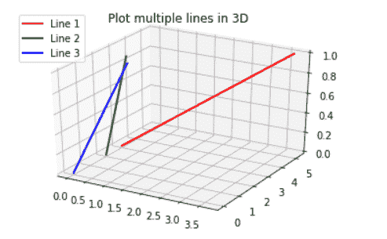

Python plot multiple lines in 3D

阅读: [Matplotlib 时间序列图](https://pythonguides.com/matplotlib-time-series-plot/)

## Matplotlib 用相同的颜色绘制多条线

在 matplotlib 中，可以指定折线图中线条的颜色。为此，您必须在 matplotlib.pyplot 模块的 `plot()` 函数中指定**颜色**参数的值。

在 Python 中，我们有各种各样的色调，即颜色。您可以通过用引号括起来的名称、代码或十六进制代码来定义颜色。

可以将**颜色**参数指定为**关键字参数**(例如，颜色=‘k’–>表示黑色；color = ' bluecolor = ' # DC 143 c '–>表示深红色)或作为**位置自变量**(例如，‘r '–>表示红色；g’–>表示绿色)。

**让我们看看为多行指定相同颜色的例子**:

**例#1**

这里我们使用位置参数绘制了多条颜色相同的线。

```py
**# Importing packages**

import matplotlib.pyplot as plt
import numpy as np

**# Define data values** 
x = range(3, 13)
y1 = np.random.randn(10)
y2 = np.random.randn(10)+range(3, 13)
y3 = np.random.randn(10)+range(21,31)

**# Plot 1st line** 
plt.plot(x, y1, 'r', linestyle= 'dashed')

**# Plot 2nd line**

plt.plot(x, y2, 'r')

**# Plot 3rd line**

plt.plot(x, y3, 'r', linestyle = 'dotted')

**# Display**

plt.show()
```

*   导入 `matplotlib.pyplot` 模块进行数据可视化。
*   导入 `numpy` 模块定义数据坐标。
*   要定义数据坐标，使用 `range()` ， `random.randn()` 函数。
*   要绘制折线图，请使用 `plot()` 函数。
*   要为线条设置不同的样式，使用**线条样式**参数。
*   要为多行设置相同的颜色，使用**位置参数**，如‘r’，‘g’。

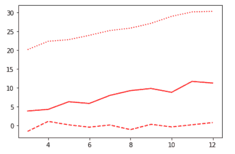

Matplotlib plot multiple lines with the same color

**例 2**

这里我们用十六进制代码绘制了多条颜色相同的线。

```py
**# Import Libraries**

import matplotlib.pyplot as plt
import numpy as np

**# Define Data** 
x = np.random.randint(low = 0, high = 60, size = 50)
y = np.random.randint(low = -15, high = 80, size = 50)

**# Plot**

plt.plot(x, color='#EE1289', label='Line 1')
plt.plot(y, color='#EE1289', linestyle = ':', label='Line 2')

**# Legend** 
plt.legend()

**# Display** 
plt.show()
```

*   导入 `matplotlib.pyplot` 模块进行数据可视化。
*   导入 `numpy` 模块定义数据坐标。
*   要定义数据坐标，使用 `random.randint()` 函数并设置其最低、最高值和大小。
*   要绘制折线图，请使用 `plot()` 函数。
*   要为线条设置不同的样式，使用**线条样式**参数。
*   要为多行设置相同的颜色，使用**十六进制代码**。
*   要向绘图添加图例，请将**标签**参数传递给**绘图()**函数，并使用**图例()**函数。

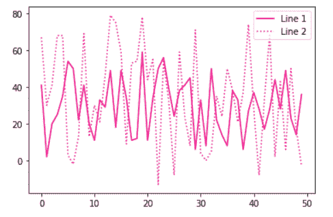

Matplotlib plot multiple lines having the same color

**例 3**

这里我们使用关键字参数绘制了多条颜色相同的线。

```py
**# Import Libraries**

import matplotlib.pyplot as plt

**# Define Data**

x = [1, 2, 3]
y1 = [2, 3, 4]
y2 = [5, 6, 7]
y3 = [1, 2, 3]

**# Plot** 
plt.plot(x, y1, color = 'g')
plt.plot(x, y2, color = 'g')
plt.plot(x, y3, color = 'g')

**# Display**

plt.show()
```

*   导入 `matplotlib.pyplot` 库。
*   接下来，定义数据坐标。
*   要绘制折线图，请使用 `plot()` 函数。
*   要为多个折线图设置相同的颜色，请使用**关键字参数 color** 并以简短形式指定颜色名称。

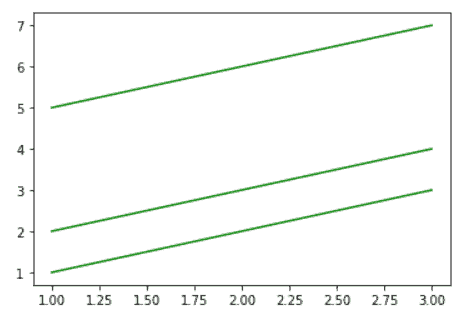

Plot multiple lines with the same color using matplotlib

**例#4**

在 matplotlib 中，使用关键字参数，我们绘制了多条相同颜色的线。

```py
**# Import Libraries**

import matplotlib.pyplot as plt
import numpy as np

**# Define Data**

x = np.arange(0,6,0.2)
y1 = np.sin(x)
y2 = np.cos(x)

**# Plot**

plt.plot(x, y1, color ='slategray')
plt.plot(x, y2, color = 'slategray')

**# Display**

plt.show()
```

*   导入 `matplotlib.pyplot` 库。
*   导入 `numpy` 包。
*   接下来，使用 `arange()` 、 `sin()` 和 `cos()` 函数定义数据坐标。
*   要绘制折线图，请使用 `plot()` 函数。
*   要为多个折线图设置相同的颜色，使用**关键字参数 color** 并指定颜色名称。

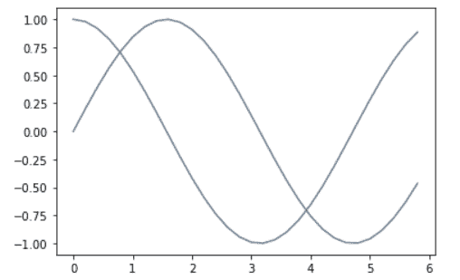

Plot multiple lines having the same color using matplotlib

读取: [Matplotlib 更新循环中的绘图](https://pythonguides.com/matplotlib-update-plot-in-loop/)

## Matplotlib 图标题多行

在这里，我们将学习在示例的帮助下使用 matplotlib 向多线图添加标题。在 matplotlib 中，我们有两种方法给一个情节添加标题。

第一种方法是当我们想给剧情或支线剧情添加一个单一的或主要的标题时，然后我们使用 pyplot 模块的 `suptitle()` 函数。而第二种方式是当我们想要给每个剧情或者支线剧情添加不同的标题时，那么我们就使用 pyplot 模块的 `title()` 函数。

**让我们看看不同的例子:**

**例#1**

在本例中，我们将学习将主标题添加到多行绘图中。

```py
**# Import Libraries** 
import matplotlib.pyplot as plt
import numpy as np

**# Define Data**

x = np.arange(20)
y1 = x+8
y2 = 2*x+8
y3 = 4*x+8
y4 = 6*x+8
y5 = 8*x+8

**# Colors**

colors=['lightcoral', 'yellow', 'lime', 'slategray', 'pink']
plt.gca().set_prop_cycle(color=colors)

**# Plot**

plt.plot(x, y1)
plt.plot(x, y2)
plt.plot(x, y3)
plt.plot(x, y4)
plt.plot(x, y5)

**# Main Title**

plt.suptitle("Multiple Lines Plot", fontweight='bold')

**# Display** 
plt.show()
```

*   导入 `matplotlib.pyplot` 包进行数据可视化。
*   导入 `numpy` 包进行数据绘制。
*   要定义数据坐标，使用 `arange()` 函数。
*   `matplotlib . axes . axes . set _ prop _ cycle()`方法接受一个按顺序使用的**颜色列表**作为参数。
*   要绘制多条折线图，使用 `plot()` 函数。
*   要将主标题添加到图中，使用 `suptitle()` 函数。

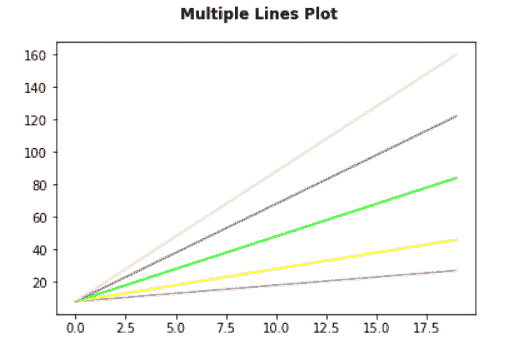

Matplotlib plot title multiple lines

**例#** 2

在本例中，我们将学习向多行绘图添加标题。

```py
**# Import Libraries**

import matplotlib.pyplot as plt
import numpy as np

**# Define Data**

x = np.linspace(0, 8, 100)
y1 = 5*x
y2 = np.power(x,2)
y3 = np.exp(x/18)

**# Plot**

plt.plot(x, y1, color='coral')
plt.plot(x, y2, color='lawngreen')
plt.plot(x, y3)

**# Title**

plt.title("Multiple Lines Plot", fontweight='bold')

**# Display**

plt.show()
```

*   首先导入 `matplotlib.pyplot` 和 `numpy` 库。
*   要定义数据坐标，使用 `linspace()` 、 `power()` 和 `exp()` 函数。
*   要绘制直线，使用 pyplot 模块的 `plot()` 函数。
*   要给图添加标题，使用 `title()` 函数。

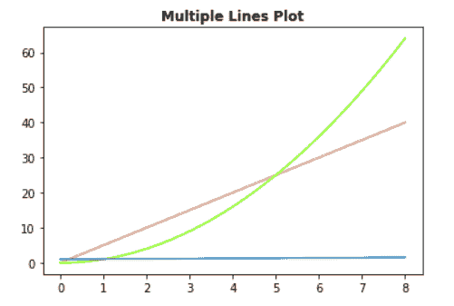

Matplotlib plot multiple lines with the title

**例 3**

在本例中，我们将在多行中添加标题。

```py
**# Import Libraries**

import matplotlib.pyplot as plt
import numpy as np

**# Define Data**

x = np.arange(0,10,0.2)
y1 = np.sin(x)
y2 = np.cos(x)

**# Plot**

plt.plot(x, y1)
plt.plot(x, y2)

**# Multiple line title**

plt.suptitle('Plot Multple Lines \n With Multiple Lines 
              Titles', fontweight='bold')

**# Display**

plt.show()
```

*   导入 `matplotlib.pyplot` 库。
*   导入 `numpy` 库。
*   接下来，使用 `arange()` 、 `sin()` 和 `cos()` 函数定义数据坐标。
*   要绘制折线图，请使用 `plot()` 函数。
*   要在多行中添加标题，请使用带有新行字符的 `suptitle()` 函数。

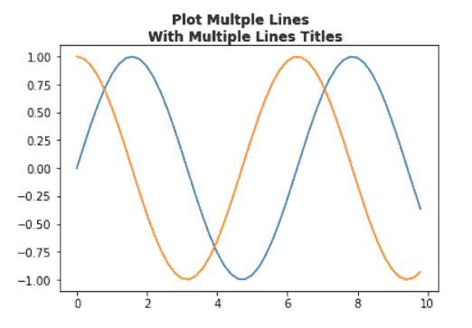

Matplotlib plot multiple lines having the title

阅读: [Matplotlib 饼图教程](https://pythonguides.com/matplotlib-pie-chart/)

## Matplotlib 在子情节中绘制多行

在 matplotlib 中，要绘制子图，请使用 `subplot()` 函数。**支线剧情()**函数需要三个参数，每个参数描述人物的排列。

第一个和第二个参数分别表示布局中的**行**和**列**。当前图的**索引**由第三个参数表示。

让我们看看有多行的支线剧情的例子:

**例#1**

在上面的例子中，我们使用 subplot()函数来创建支线剧情。

```py
**# Import Libraries**

import matplotlib.pyplot as plt
import numpy as np

**# Set figure size**

plt.figure(figsize=(8,6))

**# plot 1:**

plt.subplot(1, 2, 1)

**# Data**

x = np.random.randint(low = 0, high = 150, size = 30)
y = np.random.randint(low = 10, high = 50, size = 30)

**# Plotting**

plt.plot(x)
plt.plot(y)

**# plot 2:**

plt.subplot(1, 2, 2 )

**# Data**

x = [1, 2, 3]
y1 = [2, 3, 4]
y2 = [5, 6, 7]

**# Plotting**

plt.plot(x,y1)
plt.plot(x,y2)

**# Display**

plt.show()
```

*   导入 `matplotlib.pyplot` 和 `numpy` 包。
*   使用 `figsize` 设置图形尺寸，并设置宽度和高度。
*   要绘制子情节，使用 `subplot()` 函数，包括行、列和索引号。
*   要定义数据坐标，使用 `random.randint()` 函数。
*   要绘制折线图，请使用 `plot()` 函数。

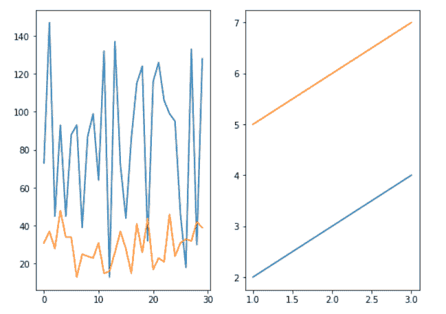

Matplotlib plot multiple lines in the subplot

**例 2**

让我们再看一个例子，用多行创建支线剧情。

```py
**# Import Libraries**

import matplotlib.pyplot as plt
import numpy as np

**# Set figure size**

plt.figure(figsize=(8,6))

**# plot 1:**

plt.subplot(1, 2, 1)

**# Data**

x = np.linspace(0, 8, 100)
y1 = np.exp(x/18)
y2 = 5*x

**# Plotting**

plt.plot(x, y1)
plt.plot(x, y2)

**# plot 2:**

plt.subplot(1, 2, 2 )

**# Data**

x = np.arange(0,10,0.2)
y1 = np.sin(x)
y2 = np.cos(x)

**# Plotting**

plt.plot(x,y1)
plt.plot(x,y2)

**# Display**

plt.show()
```

*   这里我们使用 `linspace()` 、 `exp()` 、 `arange(` )、 `sin()` 和 `cos()` 函数定义数据坐标来绘制子情节。
*   要绘制折线图，请使用 `plot()` 函数。

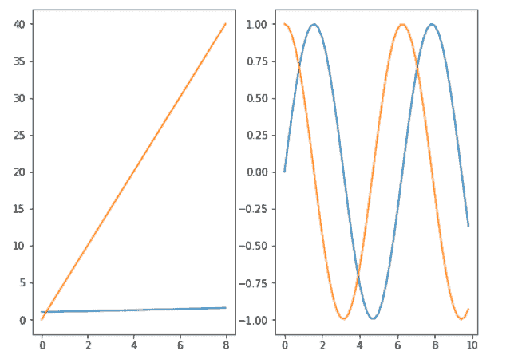

Matplotlib plot subplot with multiple lines

阅读: [Matplotlib 散点图颜色](https://pythonguides.com/matplotlib-scatter-plot-color/)

## Matplotlib 绘制多条不同长度的线

在 Matplotlib 中，我们将学习在例子的帮助下绘制多条不同长度的线。

**让我们看看与此相关的例子:**

**例#1**

在本例中，我们将使用 axhline()方法绘制多条长度不同、颜色相同的线条。

```py
**# Import library**

import matplotlib.pyplot as plt

**# line 1**

plt.axhline (y = 2)

**# line 2** 

plt.axhline (y = 3, xmax =0.4)

**# line 3**

plt.axhline (y = 4, xmin = 0.4, xmax =0.8)

**# line 4**

plt.axhline (y = 5, xmin =0.25, xmax =0.65)

**# Line 5**

plt.axhline (y = 6, xmin =0.6, xmax =0.8)

**# Display**

plt.show()
```

*   导入 `matplotlib.pyplot` 库。
*   接下来，我们使用 `axhline()` 方法绘制多条线。
*   为了设置不同长度的线，我们将参数 `xmin` 和 `xmax` 传递给该方法。
*   要获得相同颜色的线条，我们不能指定颜色参数。如果你想要不同的颜色线，请指定颜色参数。

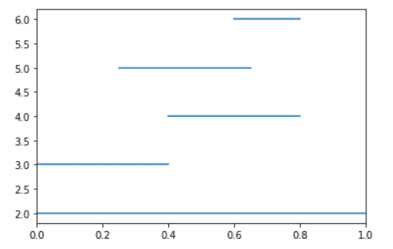

Matplotlib plot multiple lines different length

**例 2**

在这个例子中，我们将使用 hlines()方法绘制多条不同长度和不同颜色的线。

```py
**# Import library** 
import matplotlib.pyplot as plt

**# line 1**

plt.hlines (y= 2, xmin= 0.1, xmax= 0.35, color='c')

**# line 2** 

plt.hlines (y= 4, xmin = 0.1, xmax = 0.55, color='m', 
            linestyle = 'dotted')

**# line 3**

plt.hlines (y = 6, xmin = 0.1, xmax = 0.75, color='orange', 
            linestyle = 'dashed')

**# line 4**

plt.hlines (y = 8, xmin =0.1, xmax =0.9, color='red')

**# Display** 
plt.show()
```

*   导入 `matplotlib.pyplot` 库。
*   接下来，我们使用 `hlines()` 方法绘制多条线。
*   为了设置不同长度的线，我们将参数 `xmin` 和 `xmax` 传递给该方法。
*   如果你想要不同颜色的线条，也指定**颜色**参数。

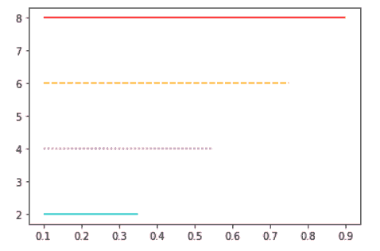

Matplotlib plot multiple lines with different length

**例 3**

在本例中，我们将使用 axvline()方法绘制多条不同长度的线。

```py
**# Import library**

import matplotlib.pyplot as plt

**# line 1**

plt.axvline(x = 5, color = 'b')

**# line 2** 

plt.axvline(x = 3, ymin = 0.2, ymax = 0.8, color='red')

**# line 3**

plt.axvline(x = 3.75, ymin = 0.2, ymax = 1, color='lightgreen')

**# line 4**

plt.axvline(x = 4.50, ymin = 0, ymax = 0.65, color='m')

**# Display**

plt.show()
```

*   导入 `matplotlib.pyplot` 库。
*   接下来，我们使用 `axvline()` 方法绘制多条线。
*   为了设置不同长度的线，我们将参数 `ymin` 和 `ymax` 传递给该方法。
*   如果你想要不同颜色的线条，也指定**颜色**参数。

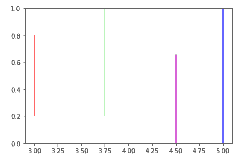

Matplotlib plot multiple lines having different length

**例#4**

在这个例子中，我们将使用 vlines()方法绘制多条不同长度的线。

```py
**# Import library** 
import matplotlib.pyplot as plt

**# Vertical line 1**

plt.vlines(x = 5, ymin = 0.75, ymax = 2, color = 'black')

**# Vertical line 2**

plt.vlines (x = 8, ymin = 0.50, ymax = 1.5, color='red')

**# Vertical line 3**

plt.vlines (x = [1, 2] , ymin = 0.2, ymax = 0.6, 
            color = 'orange')

**# Vertical line 4**

plt.vlines (x = 10, ymin = 0.2, ymax = 2, color='yellow')

**# Display**

plt.show()
```

*   这里我们使用 `axvline()` 方法来绘制多条线。
*   为了设置不同长度的线，我们将参数 `ymin` 和 `ymax` 传递给该方法。

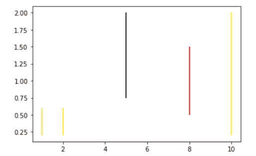

Matplotlib plot multiple lines own different length

**例#5**

在这个例子中，我们将使用 numpy 的 array()函数绘制多条不同长度的线。

```py
**# Import Libraries**

import matplotlib.pyplot as plt
import numpy as np

**# Define Data**

x = np.array([2, 4, 6, 8, 10, 12])
y = np.array([3, 6, 9])

**# Plot**

plt.plot(x)
plt.plot(y)

**# Display** 
plt.show()
```

*   首先导入 `matplotlib.pyplot` 和 `numpy` 库。
*   接下来，使用 numpy 的 `array()` 方法定义数据坐标。这里我们定义不同长度的线。
*   要绘制折线图，请使用 `plot()` 方法。

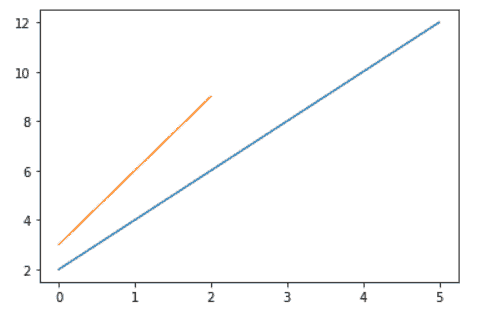

Plot multiple lines with different lengths using matplotlib

**例#6**

在本例中，我们使用 range()函数绘制多条不同长度的直线。

```py
**# Import library**

import matplotlib.pyplot as plt

**# Create subplot**

fig, ax = plt.subplots()

**# Define Data**

x = range(2012,2022)
y = [10, 11, 10.5, 15, 16, 19, 14.5, 12, 13, 20]

x1 = range(2016, 2022)
y1 = [11.5, 15.5, 15, 16, 20, 11]

**# Plot** 

ax.plot(x, y, color= '#CD1076')
ax.plot(x1,y1, color = 'orange')

**# Show**

plt.show()
```

*   导入 `matplotlib.pyplot` 库。
*   要创建支线剧情，使用**支线剧情()**函数。
*   接下来，使用 `range()` 函数定义数据坐标，得到多条不同长度的线。
*   要绘制折线图，请使用 `plot()` 函数。

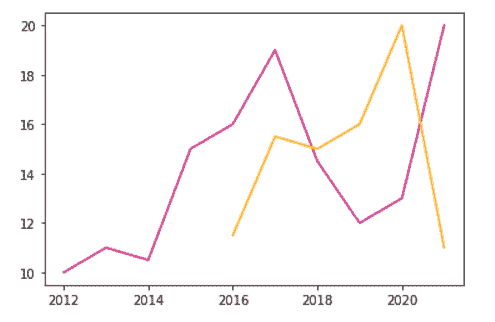

Plot multiple lines having different length using matplotlib

读取: [Matplotlib Plot NumPy 数组](https://pythonguides.com/matplotlib-plot-numpy-array/)

## Matplotlib 绘制多条线 seaborn

在 matplotlib 中，可以使用 seaborn lineplot()函数绘制多条线。

**以下是语法:**

```py
sns.lineplot(x, y, hue)
```

这里 `x` ，y，色相分别代表 x 轴坐标，y 轴坐标，颜色。

**让我们看看与此相关的例子:**

**例#1**

```py
**# Import Libraries** 
import seaborn as sns
import pandas as pd 
import matplotlib.pyplot as plt

**# Define Data** 
days = [1, 2, 3, 4, 5, 6, 7, 8, 9, 10, 11, 12, 13, 14, 15]
max_temp = [36.6, 37, 37.7, 13, 15.6, 46.8, 50, 22, 31, 26, 18, 42, 28, 26, 12]
min_temp = [12, 8, 18, 12, 11, 4, 3, 19, 20, 10, 12, 9, 14, 19, 16]

**# Dataframe** 
temp_df = pd.DataFrame({"days":days, "max_temp":max_temp, 
                        "min_temp":min_temp})

**# Print**

temp_df
```

*   首先导入必要的库，如 `seaborn` 、 `matplotlib.pyplot` 、 `pandas` 。
*   接下来，定义数据。
*   要创建数据帧，使用 pandas 的 `DataFrame()` 函数。

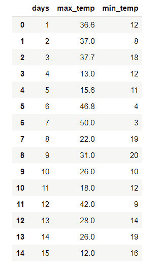

DataFrame

```py
**# Plot seaborn** 
sns.lineplot(x = "days", y = "max_temp", data=temp_df,)
sns.lineplot(x = "days", y = "min_temp", data=temp_df,)

**# Show**

plt.show()
```

*   要使用 seaborn 包绘制多折线图，请使用 `lineplot()` 函数。
*   要显示图形，使用 `show()` 功能。

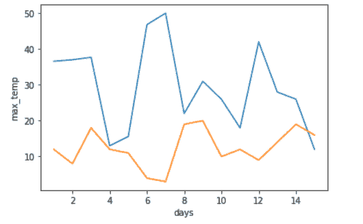

Matplotlib plot multiple lines using seaborn

**例 2**

```py
**# Import Libraries**

import seaborn as sns
import numpy as np
import matplotlib.pyplot as plt

**# Define Data**

x = np.linspace (1,10,2)
y = x * 2
z = np.exp(x)

**# Seaborn Plot**

sns.lineplot(x = x, y = y)
sns.lineplot(x = x, y = z)

**# Show**

plt.show()
```

*   导入 `seaborn` 、 `numpy` 、 `matplotlib.pyplot` 等库。
*   要定义数据坐标，使用 numpy 的 `linspace()` ， `exp()` 函数。
*   要绘制 seaborn 线图，使用 `lineplot()` 函数。
*   要显示图形，使用 `show()` 功能。

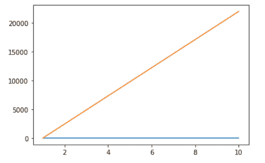

Plot multiple lines using matplotlib seaborn

**例 3**

```py
**# Import Libraries**

import matplotlib.pyplot as plt
import numpy as np
import seaborn as sns

**# Set style**

sns.set_style("darkgrid")

**# Define Data**

x = np.arange(0,20,0.2)
y1 = np.cos(x)
y2 = np.sin(2*x)

**# Plot**

sns.lineplot(x = x, y = y1)
sns.lineplot(x = x, y = y2)

**# Display**

plt.show()
```

*   导入必要的库，如: `matplotlib.pyplot` 、 `numpy` 、 `seaborn` 。
*   设置绘图的样式，使用 `set_style()` 方法，设置为**暗格**。
*   要定义数据坐标，使用 `arange()` 、 `cos()` 和 `sin()` 函数。
*   要绘制多条线，使用 `lineplot()` 函数。
*   为了可视化绘图，使用 `show()` 功能。

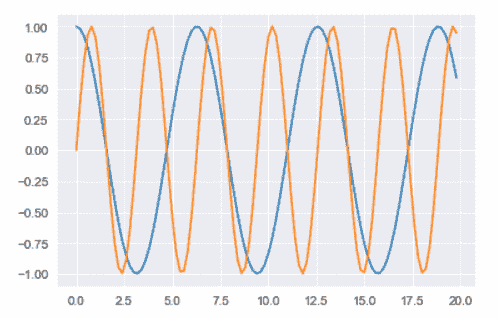

Matplotlib seaborn plot multiple lines

Read: [Matplotlib set_xticklabels](https://pythonguides.com/matplotlib-set_xticklabels/)

## Matplotlib 从 csv 文件中绘制多行

在这里，我们将学习如何使用 matplotlib 从 CSV 文件中绘制多行。

**要下载数据集，请单击 Max_Temp:**

[Max_Temp](https://docs.google.com/spreadsheets/d/e/2PACX-1vQkQFGXiSaGDIrJlDCL6EJJ5vuKPN92IqBoVWF4LXqHc4fzQiIRJpykgpNp1zsgdkDCTr2PGkKYKZgC/pubhtml)

**为了更清楚地理解概念，让**’**s 看不同的例子:**

*   导入必要的库如**熊猫**和 `matplotlib.pyplot` 。
*   接下来使用熊猫的 `read_csv()` 函数读取 csv 文件。
*   要查看 csv 文件，请将其打印出来。

**源代码:**

```py
**# Import Libraries** 
import pandas as pd 
import matplotlib.pyplot as plt 

**# Read CSV** 
data= pd.read_csv('Max_Temp.csv')

**# Print** 

data
```

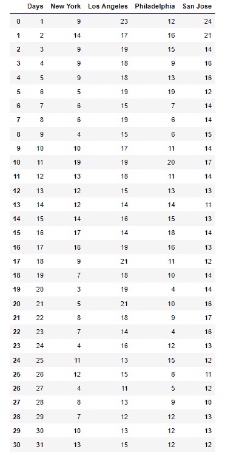

DataFrame

*   接下来，我们使用 `DataFrame()` 函数将 CSV 文件转换为熊猫的数据帧。
*   如果你想查看数据框，打印出来。

```py
**# Convert data frame**

df=pd.DataFrame(data)

**# Print**

df
```

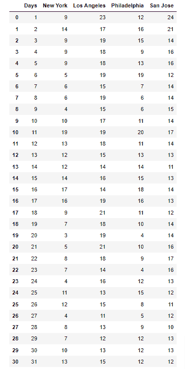

DataFrame

*   通过使用 `iloc()` 函数，初始化列表以从 pandas 数据帧中按位置选择行和列。

```py
**# Initilaize list** 

days = list(df.iloc[:,0])
city_1 = list(df.iloc[:,1])
city_2 = list(df.iloc[:,2])
city_3 = list(df.iloc[:,3])
city_4 = list(df.iloc[:,4])
```

**例#1**

*   现在，使用 `figsize()` 函数设置图形尺寸
*   要绘制多线图表，使用 `plot()` 函数并传递数据坐标。
*   要设置标记，请将标记**作为参数传递。**
*   为了可视化图表，使用 `show()` 函数。

```py
**# Set Figure Size**

plt.figure(figsize=(8,6))

**# Plot**

plt.plot(days, city_4, marker='o')
plt.plot(days, city_2, marker='o')

**# Display**

plt.show()
```

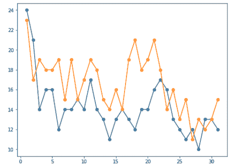

Plot multiple lines using matplotlib

**例 2**

在本例中，我们绘制了三个多线条图。

```py
**# Set Figure Size**

plt.figure(figsize=(8,6))

**# Plot**

plt.plot(days, city_4, marker='o')
plt.plot(days, city_2, marker='o')
plt.plot(days, city_1, marker='o')

**# Display**

plt.show()
```

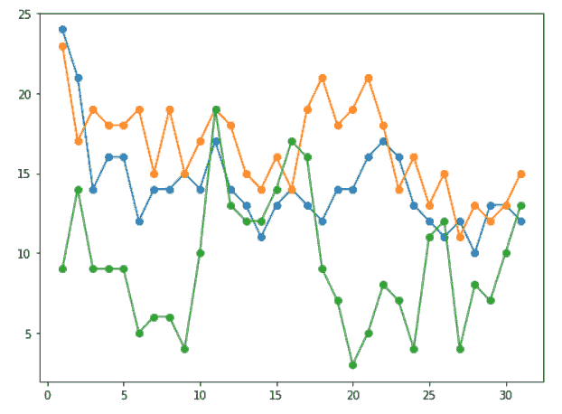

Matplotlib plot multiple lines by using CSV file

你可能也喜欢读下面的文章。

*   [什么是 matplotlib 内联](https://pythonguides.com/what-is-matplotlib-inline/)
*   [Matplotlib 条形图标签](https://pythonguides.com/matplotlib-bar-chart-labels/)
*   [将图例放在绘图 matplotlib 之外](https://pythonguides.com/put-legend-outside-plot-matplotlib/)

在本教程中，我们已经讨论了如何使用 Python 中的 matplotlib 来 ****绘制多条线，我们还讨论了以下主题:****

*   Python 在同一图表上绘制多条线
*   Python 绘制了多条不同颜色线
*   Python 使用图例绘制多条线
*   Python 从数组中绘制多行
*   Python 从数据帧绘制多条线
*   Python 为循环绘制多行
*   Python 用不同 y 轴绘制多条线
*   Python 绘制多线时间序列
*   Python 在 3D 中绘制多条线
*   Matplotlib 用相同的颜色绘制多条线。
*   Matplotlib 绘图标题多行
*   Matplotlib 在子情节中绘制多行
*   Matplotlib 绘制多条不同长度的线
*   Matplotlib 绘制多条线
*   Matplotlib 从 csv 文件中绘制多行

[Bijay Kumar](https://pythonguides.com/author/fewlines4biju/)

Python 是美国最流行的语言之一。我从事 Python 工作已经有很长时间了，我在与 Tkinter、Pandas、NumPy、Turtle、Django、Matplotlib、Tensorflow、Scipy、Scikit-Learn 等各种库合作方面拥有专业知识。我有与美国、加拿大、英国、澳大利亚、新西兰等国家的各种客户合作的经验。查看我的个人资料。

[enjoysharepoint.com/](https://enjoysharepoint.com/)[](https://www.facebook.com/fewlines4biju "Facebook")[](https://www.linkedin.com/in/fewlines4biju/ "Linkedin")[](https://twitter.com/fewlines4biju "Twitter")