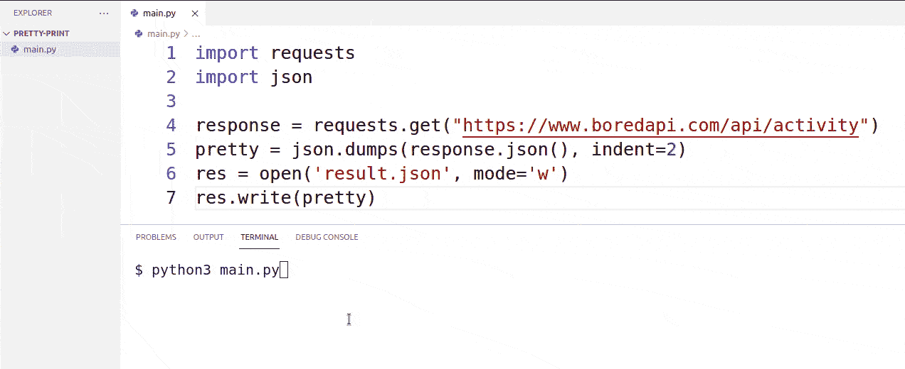
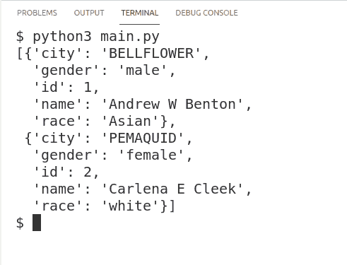
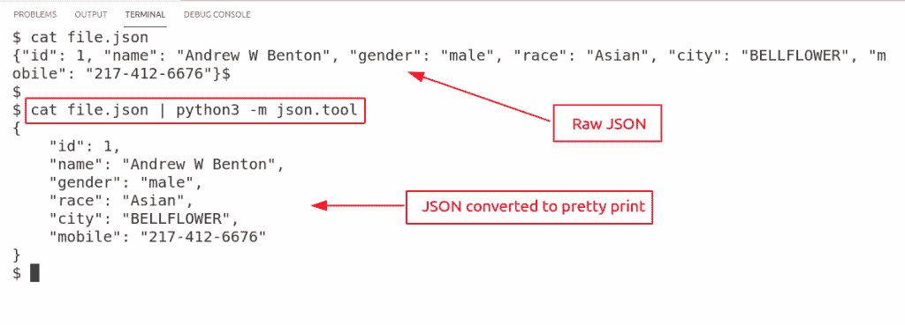
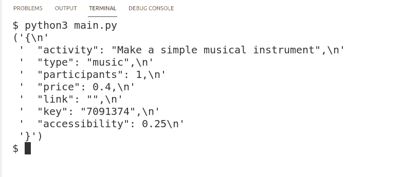
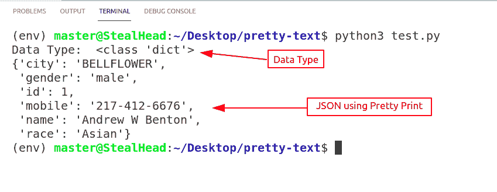
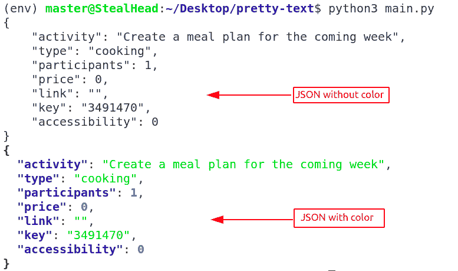
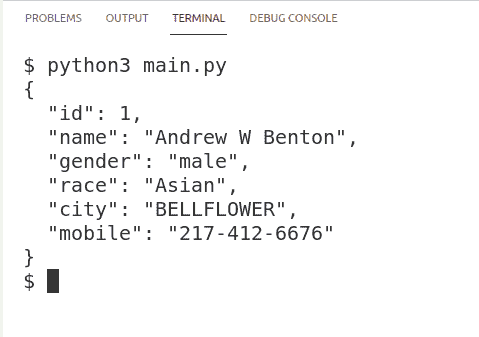

# Python 漂亮打印 JSON

> 原文：<https://pythonguides.com/python-pretty-print-json/>

[](https://sharepointsky.teachable.com/p/python-and-machine-learning-training-course)

[`pprint`](https://docs.python.org/3/library/pprint.html#module-pprint) 模块为“**”任意 Python 数据结构添加了一个功能，该数据结构可以作为解释器的输入。在本教程中，将学习关于 **Python 漂亮打印 JSON** 。此外，我们将涵盖这些主题。**

*   Python 漂亮地将 JSON 打印到文件
*   Python 漂亮打印 JSON 字符串
*   Python Pretty Print JSON 命令行
*   Python 漂亮打印 JSON 响应
*   Python 漂亮打印 JSON 对象
*   Python 漂亮打印 JSON 字典
*   Python 漂亮打印 JSON 颜色
*   Python 漂亮打印 JSON 转储
*   皮索漂亮的打印 JSON 一班轮

目录

[](#)

*   [Python 漂亮的打印 JSON 到文件](#Python_Pretty_Print_JSON_to_File "Python Pretty Print JSON to File")
*   [Python 漂亮打印 JSON 字符串](#Python_Pretty_Print_JSON_String "Python Pretty Print JSON String")
*   [Python 漂亮打印 JSON 命令行](#Python_Pretty_Print_JSON_Command_Line "Python Pretty Print JSON Command Line")
*   [Python 漂亮打印 JSON 响应](#Python_Pretty_Print_JSON_Response "Python Pretty Print JSON Response")
*   [Python 漂亮打印 JSON 对象](#Python_Pretty_Print_JSON_Object "Python Pretty Print JSON Object")
*   [Python 漂亮打印 JSON Dict](#Python_Pretty_Print_JSON_Dict "Python Pretty Print JSON Dict")
*   [Python 漂亮的打印 JSON 颜色](#Python_Pretty_Print_JSON_color "Python Pretty Print JSON color")
*   [Python 漂亮打印 JSON 转储](#Python_Pretty_Print_JSON_Dumps "Python Pretty Print JSON Dumps")
*   [Python 漂亮打印 JSON One Liner](#Python_Pretty_Print_JSON_One_Liner "Python Pretty Print JSON One Liner")

## Python 漂亮的打印 JSON 到文件

在本节中，我们将了解到 **Python pretty print JSON 到文件的转换**。

*   `PPrint` 是 python 内置的一个模块，不需要任何安装就可以直接导入。
*   Pretty Print (pprint)模块提供了广泛的模块，有助于清理数据并更好地呈现数据。
*   请注意， `json.dump()` 方法用于将 python 对象转换为 json 对象，输出以类似于 `pprint()` 方法的有组织的方式出现。但它们两者并不相同。
*   pprint()方法以有组织的方式打印 json 数据，而 dump()方法将 python 对象转换为 json 对象，数据可以写入文件。
*   在我们的例子中，我们使用了 boredapi 网站上的样本 JSON 数据。

**源代码:**

*   使用**请求**模块，我们已经从 URL 获取了 JSON 数据。这个[网址](https://www.boredapi.com/api/activity)来自 th boredapi。
*   我们已经使用 `json.dump()` 将数据转换成 json 对象。此外，转储数据看起来像一个漂亮的打印(pprint)方法。
*   为了将结果存储在一个文件中，我们使用了 python `open()` 方法。
*   最后，使用 write()方法将数据写入文件。

```py
import requests
import json

response = requests.get("https://www.boredapi.com/api/activity")
pretty = json.dumps(response.json(), indent=2)
res = open('result.json', mode='w')
res.write(pretty) 
```

**输出**:

在这个输出中，当我们运行代码时，从网站获取信息并转换成 JSON 对象，然后创建一个新文件。



Python Pretty Print JSON to File

阅读: [Python 截屏](https://pythonguides.com/python-screen-capture/)

## Python 漂亮打印 JSON 字符串

在本节中，我们将了解到 **python 漂亮的打印 JSON 字符串**。

*   JSON 文件看起来像一个 python 字典，但是它有一个“字符串”数据类型，这意味着它是一个字符串。所以请不要混淆，简单的 json 文件可以作为 json 字符串调用。
*   使用 python 中的 pprint()方法可以改善 JSON 字符串的表示。常规 json 字符串可以在一行中，没有任何缩进。
*   在我们的示例中，我们创建了一个 python 字典，然后将该 python 字典转换为 JSON 对象。在 using pprint()模块中，我们以漂亮的打印格式打印了数据。

**源代码:**

*   在这个源代码中，我们导入了两个模块。JSON 将 python 对象转换成 JSON 对象，pprint 实现 pretty print。
*   使用 **`json.loads()`** 方法将 python 对象转换为 JSON 对象。
*   最后，我们使用了 python pprint 模块中的 pprint()方法，使用该方法，我们可以以非常漂亮的格式打印结果。

```py
import json
import pprint

json_data = '[{"id": 1, "name": "Andrew W Benton", "gender": "male", "race": "Asian", "city": "BELLFLOWER"},'\
'{"id": 2, "name": "Carlena E Cleek", "gender": "female", "race": "white", "city": "PEMAQUID"}]'

json_object = json.loads(json_data)
pprint.pprint(json_object) 
```

**输出:**

在这个输出中，python dictionary 对象以 JSON 格式显示，并使用 pretty print 方法应用了适当的缩进。



Python Pretty Print JSON String

阅读: [Python 打印无换行符](https://pythonguides.com/python-print-without-newline/)

## Python 漂亮打印 JSON 命令行

在本节中，我们将学习如何在命令行上运行 python pretty print JSON。

假设您的机器上有一个 JSON 文件，您想以漂亮的打印格式查看它，那么您可以使用下面的命令。

```py
cat file.json | python3 -m json.tool
```

*   在这里， `cat` 是 linux 用来查看文件数据的命令。这个命令将在终端上显示 file.json 的全部内容。
*   这个命令将帮助以漂亮的打印格式显示 file.json 数据。
*   如果你是 windows 用户，那么用 python 代替 python3，用 echo 代替 cat。

**输出:**

在这个输出中，您可以看到我们已经在终端上运行了 pretty print JSON。



Python Pretty JSON Command Line

阅读: [Python 打印 2 位小数](https://pythonguides.com/python-print-2-decimal-places/)

## Python 漂亮打印 JSON 响应

在本节中，我们将了解到 **Python 漂亮的打印 JSON 响应**。

*   响应和请求是相互作用的两个术语。
*   每次我们从网站或 URL 发出请求，都会收到响应。没有响应意味着网站不工作。
*   使用 Python **请求**模块我们可以从 URL 中获取信息。这个信息被称为**响应**。如果没有收到响应，这意味着传递了不正确的 url。
*   一旦我们收集了响应，我们可以简单地转储 JSON 数据，或者我们可以使用 pretty print 方法使它看起来干净。
*   请注意，dump()和 pretty print (pprint)方法在这里做同样的事情，但它们并不相同。

**源代码:**

在这段代码中，使用 requests 模块从 URL 获取响应，然后将数据转换为 JSON 对象，并使用 python print 模块的 print 方法显示出来。

```py
import requests
import json
import pprint

response = requests.get("https://www.boredapi.com/api/activity")
pretty = json.dumps(response.json(), indent=2)
pprint.pprint(pretty)
```

**输出:**

在这个输出中，您可以看到 JSON 数据使用 pretty print 以正确的格式表示。



Python Pretty Print JSON Response

阅读:[如何用 Python 打印一个数的阶乘](https://pythonguides.com/factorial-of-a-number-in-python/)

## Python 漂亮打印 JSON 对象

在本节中，我们将了解 Python Pretty Print JSON 对象。使用**`json.loads()`**JSON 模块的方法我们可以创建 JSON 对象。

在下面的代码中，我们首先使用 `json.loads()` 方法将 python 字典对象转换为 JSON 对象，然后使用 pprint 模块的 `pprint()` 方法打印该对象。

```py
import json
import pprint

json_data = '[{"id": 1, "name": "Andrew W Benton", "gender": "male", "race": "Asian", "city": "BELLFLOWER"},'\
'{"id": 2, "name": "Carlena E Cleek", "gender": "female", "race": "white", "city": "PEMAQUID"}]'

json_object = json.loads(json_data)
pprint.pprint(json_object)
```

**输出:**

在这个输出中，显示了一个 python pretty print JSON 对象。


Python Pretty Print JSON Object

阅读:[如何打印 Python 斐波那契数列](https://pythonguides.com/python-fibonacci-series/)

## Python 漂亮打印 JSON Dict

在这一节中，我们将学习 **Python 漂亮的打印 JSON 字典**。这个方法也可以用于 Python pretty print JSON 数组。

*   JSON 和 [Python 字典](https://pythonguides.com/create-a-dictionary-in-python/)看起来很相似，但是两者的数据类型不同。
*   JSON 对象的数据类型为字符串(“str”)，字典的数据类型为“dict”。
*   使用 **`json.loads()`** 方法我们可以将 python 对象转换成 JSON 对象。
*   python pprint 方法用于以漂亮的打印格式显示数据。

```py
import json
import pprint

json_data = '[{"id": 1, "name": "Andrew W Benton", "gender": "male", "race": "Asian", "city": "BELLFLOWER"},'\
'{"id": 2, "name": "Carlena E Cleek", "gender": "female", "race": "white", "city": "PEMAQUID"}]'

json_object = json.loads(json_data)
pprint.pprint(json_object)
```

**输出:**

在此输出中，使用 python pprint 模块的 pprint()方法以树结构显示数据。


Python Pretty Print JSON Dict

**源代码:**

在这个源代码中，`json_data`是一个字典，我们使用`json.load()`方法将其转换为 JSON，然后使用`pprint()`以漂亮的打印格式打印 JSON 数据。

```py
import json
import pprint

json_data = {"id": 1, "name": "Andrew W Benton", "gender": "male", "race": "Asian", "city": "BELLFLOWER", "mobile": "217-412-6676"} 
print(type(json_data))

d = json.load(json_data)
pprint.pprint(d)
```

**输出:**

在这个输出中，我们展示了 python pretty print JSON 字典。我们已经将字典数据转换为 Python Pretty Print JSON。



Python Pretty Print JSON Dict

阅读: [Python 程序打印质数](https://pythonguides.com/python-program-to-print-prime-numbers/)

## Python 漂亮的打印 JSON 颜色

在本节中，我们将了解 **Python 漂亮的打印 JSON 颜色**。

*   使用 Python `Rich` 模块我们可以在终端上给漂亮的 JSON 打印上色。它使用终端上的颜色使 JSON 看起来更好。
*   Python 丰富的模块提供了 `print_json()` 方法。用这种方法打印出来的任何东西在终端上都是彩色的。
*   使用 Python 请求模块从网站获取数据。在我们的例子中，我们使用的是 [boredapi](https://www.boredapi.com/api/activity) ，它是互联网上可用的 json 样本。
*   `json.dumps()` 方法将普通的 json 转换成漂亮的 json 文件，该文件由缩进和空格组成。

**源代码:**

在这个源代码中，我们使用 python 请求模块从 URL 获取数据。rich 模块的 print_json()方法用于为终端上的输出着色。

```py
import requests
import json
from rich import print_json

response = requests.get("https://www.boredapi.com/api/activity")
pretty = json.dumps(response.json(), indent=4)

print(pretty)
print_json(pretty)
```

**输出:**

在这个输出中，显示了 python pretty print JSON 颜色。为了证明这种区别，我们首先显示常规输出，然后显示彩色输出。



Python Pretty Print JSON Color

阅读: [Python 程序打印数组中的元素](https://pythonguides.com/python-program-to-print-element-in-an-array/)

## Python 漂亮打印 JSON 转储

在本节中，我们将了解 **Python Print JSON 转储**。

*   Python JSON 转储方法将 Python 对象转换为 JSON 对象，并以有组织的方式显示数据。数据是用缩进分开的，看起来很干净。
*   Python JSON 转储的目的是将 Python 转换为 JSON 对象，其中，pprint()方法提供了多种方法来控制显示数据的外观。
*   在我们的例子中，我们使用 **`json.dumps()`** 方法将 python 字典数据转换为 json 数据。

**源代码:**

在这段源代码中，导入了 json 模块，并使用 json.dumps()方法将 python 数据转换为 JSON。

```py
import json

# raw json
json_data = {"id": 1, "name": "Andrew W Benton", "gender": "male", "race": "Asian", "city": "BELLFLOWER", "mobile": "217-412-6676"} 

# using dump to pretty json
pretty_json = json.dumps(json_data, indent=2)

# printing result
print(pretty_json)
```

**输出:**

在这个输出中，您可以看到信息以正确的格式显示。它在任何需要的地方都有缩进和空格。这种形式的 JSON 看起来更加简洁易懂。



Python Pretty Print JSON Dump

阅读: [Python 程序打印图案](https://pythonguides.com/print-pattern-in-python/)

## Python 漂亮打印 JSON One Liner

在这一节中，我们将学习 Python 漂亮的 JSON 一行程序。有时，您必须运行 JSON 文件，而不在文本或代码编辑器中打开它，这时可以使用这种方法。使用 Python 查看 JSON 文件是一行代码。

```py
echo '{"Name":["john", "moly"],"Grade":["A", "C"]}' | python -mjson.tool
```

你可能也喜欢读下面的文章。

*   [Python 统计文件中的字数](https://pythonguides.com/python-count-words-in-file/)
*   [Python 中的 Case 语句](https://pythonguides.com/case-statement-in-python/)
*   [无换行符的 Python 打印](https://pythonguides.com/python-print-without-newline/)
*   [11 Python 列表方法](https://pythonguides.com/python-list-methods/)
*   [Python 字典方法+示例](https://pythonguides.com/python-dictionary-methods/)

在本教程中，我们学习了 `Python pretty print JSON` 。此外，我们已经讨论了这些主题。

*   Python 漂亮地将 JSON 打印到文件
*   Python 漂亮打印 JSON 字符串
*   Python Pretty Print JSON 命令行
*   Python 漂亮打印 JSON 响应
*   Python 漂亮打印 JSON 对象
*   Python 漂亮打印 JSON 字典
*   Python 漂亮打印 JSON 颜色
*   Python 漂亮打印 JSON 转储
*   Python Pretty Print JSON One Liner

[Bijay Kumar](https://pythonguides.com/author/fewlines4biju/)

Python 是美国最流行的语言之一。我从事 Python 工作已经有很长时间了，我在与 Tkinter、Pandas、NumPy、Turtle、Django、Matplotlib、Tensorflow、Scipy、Scikit-Learn 等各种库合作方面拥有专业知识。我有与美国、加拿大、英国、澳大利亚、新西兰等国家的各种客户合作的经验。查看我的个人资料。

[enjoysharepoint.com/](https://enjoysharepoint.com/)[](https://www.facebook.com/fewlines4biju "Facebook")[](https://www.linkedin.com/in/fewlines4biju/ "Linkedin")[](https://twitter.com/fewlines4biju "Twitter")