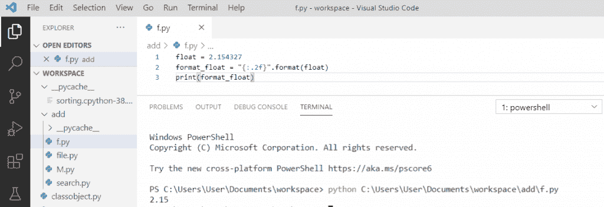
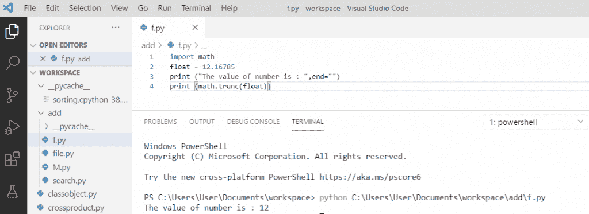
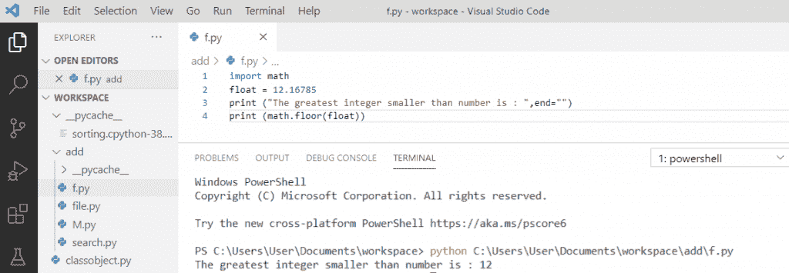
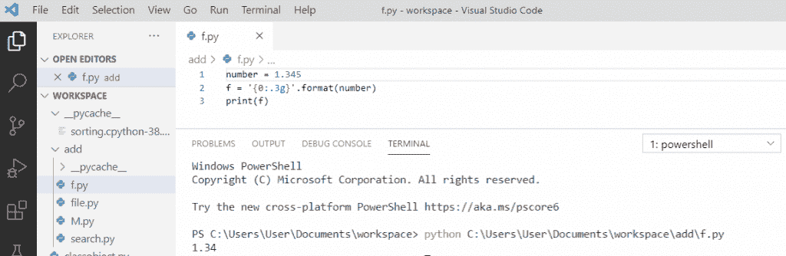
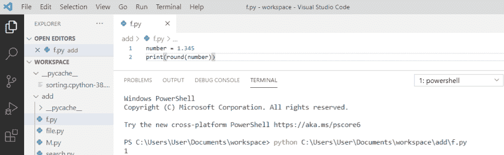
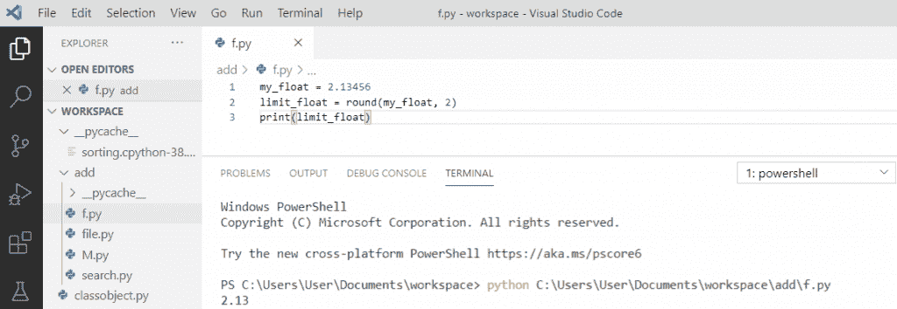

# Python 打印 2 位小数

> 原文：<https://pythonguides.com/python-print-2-decimal-places/>

[](https://sharepointsky.teachable.com/p/python-and-machine-learning-training-course)

在本 [Python 教程](https://pythonguides.com/python-programming-for-the-absolute-beginner/)中，我们将在**上讨论如何在 Python** 中打印 2 位小数。

*   Python 打印 2 位小数
*   Python 浮点精度截断
*   Python 浮点精度上限
*   Python 浮动精密地板
*   Python decimal format
*   Python 整数
*   将浮点数限制在小数点后两位

目录

[](#)

*   [Python 打印 2 位小数](#Python_print_2_decimal_places "Python print 2 decimal places")
*   [Python 浮点精度截断](#Python_float_precision_truncate "Python float precision truncate")
*   [Python 浮点精度上限](#Python_float_precision_ceil "Python float precision ceil")
*   [Python 浮动精密地板](#Python_float_precision_floor "Python float precision floor")
*   [Python decimal format](#Python_decimal_format "Python decimal format")
*   [Python 回合数](#Python_round_numbers "Python round numbers")
*   [限制浮动到小数点后两位](#Limiting_floats_to_two_decimal_points "Limiting floats to two decimal points")

## Python 打印 2 位小数

在 Python 中，要打印 2 个小数位，我们将使用 **str。** format()以“{:.2f}”为字符串，浮点为数字。调用 print，它将打印带有 2 个小数位的浮点数。

**举例:**

```py
float = 2.154327
format_float = "{:.2f}".format(float)
print(format_float)
```

写完上面的代码(python 打印 2 个小数位)，你将打印一个 `" format_float "` ，然后输出将显示为 `" 2.15 "` 。在这里，它将使用 2 个小数位格式化浮点。

可以参考下面截图 **python 打印 2 位小数位**。



Python print 2 decimal places

## Python 浮点精度截断

首先，我们需要**导入` `数学**模块。然后使用 `trunc()` 函数从浮点数中删除所有小数部分，并且只返回整数部分。

**举例:**

```py
import math
float = 12.16785
print("The value of number is: ",end="")
print (math.trunc(float))
```

写完上面的代码(python float precision truncate)，你会打印出 `" math.trunc(float)"` 然后输出会出现一个**"一个数的值是:` **12 "` 。这里， `trunc()` 将打印截断后的整数值。

关于`python float precision truncate`可以参考下面的截图



Python Float Precision truncate

## Python 浮点精度上限

在 Python 中， `ceil()` 函数用于返回一个数字的上限值。上限值是大于该数字的最小整数。

**举例:**

```py
import math
float = 12.16785
print("The smallest integer greater than number is: ",end="")
print (math.ceil(float))
```

写完上面的代码(python float precision ceil)，你会打印出 `" math.ceil(float) "` 然后输出会出现一个**"大于一个数的最小整数是:` **13 "` 。这里，我们使用 ceil 在天花板后打印数字。它将返回大于给定数字的最小整数。

关于 `python float precision ceil` ，可以参考下面的截图。


Python Float Precision ceil

## Python 浮动精密地板

Python `floor()` 函数用于返回一个数字的下限值。下限值是小于该数字的最大整数。

**举例:**

```py
import math
float = 12.16785
print("The greatest integer smaller than number is: ",end="")
print (math.floor(float))
```

写完上面的代码(python float precision floor)，你会打印出 `"math.floor(float)"` 然后输出会出现一个**"比一个数小的最大整数是:` **12 "` 。在这里，我们使用地板打印地板后的数字。它将返回小于该数字的最大整数。

`python float precision floor`可以参考下面截图。



Python Float Precision floor

## Python decimal format

为了格式化小数，我们将使用 `str.format(number)` 其中字符串是 **'{0:.3g}'** ，它将用数字格式化字符串。此外，它将显示小数点前有 1 个数字，小数点后最多有 2 个数字的数字。

**举例:**

```py
number = 1.345
f = '{0:.3g}'.format(number)
print(f)
```

写完上面的代码(python 十进制格式)，你将打印出 `" f "` ，然后输出将显示为 `" 1.34 "` 。这里，格式化小数显示小数点后有特定数字的数字。

**python 十进制格式**可以参考下面的截图。



Python decimal format

## Python 回合数

为了在 python 中舍入数字，我们将使用 `round()` 函数。**舍入功能**会将一个数字舍入到给定的位数，使数字舍入更容易。

**举例:**

```py
number = 1.345
print(round(number))
```

写完上面的代码(python round numbers)，你将打印出 `" number "` ，然后输出将显示为 `" 1 "` 。这里，数字 `1.345` 浮点数将被四舍五入为 `1` 。

**python 轮数**可以参考下面的截图。



Python round numbers

## 限制浮动到小数点后两位

`round()` 函数返回一个浮点数，它将被舍入到指定的数字，并且它将把浮点数舍入到两位小数。

**举例:**

```py
my_float = 2.13456
limit_float = round(my_float, 2)
print(limit_float)
```

写完上面的代码(限制浮点数为两位小数点)，你将打印出 `"limit_float"` ，然后输出将显示为 `" 2.13 "` 。在这里，**【舍入(数字)】用一个浮点数和 2 作为 ndigits 来舍入浮点数到小数点后两位。**

**python 轮数**可以参考下面的截图。



Limiting floats to two decimal points

您可能会喜欢以下 Python 教程:

*   [Python 生成器(Python 生成器 vs 迭代器)](https://pythonguides.com/python-generators/)
*   [Python 计数器——详细教程](https://pythonguides.com/python-counter/)
*   [Python 递归](https://pythonguides.com/python-recursion/)
*   [Python Tkinter 菜单栏–如何使用](https://pythonguides.com/python-tkinter-menu-bar/)
*   [Python 中的优先级队列](https://pythonguides.com/priority-queue-in-python/)
*   [Python 3 pickle typeerror 需要一个类似字节的对象，而不是“str”](https://pythonguides.com/python-3-pickle-typeerror-a-bytes-like-object-is-required-not-str/)
*   [Python 二分搜索法和线性搜索](https://pythonguides.com/python-binary-search/)
*   [Python 退出命令(quit()、exit()、sys.exit())](https://pythonguides.com/python-exit-command/)
*   [Python 点积和叉积](https://pythonguides.com/python-dot-product/)

在本教程中，我们学习了如何用 python 打印 2 个小数位，我们还讨论了以下主题:

*   Python 打印 2 位小数
*   Python 浮点精度截断
*   Python 浮点精度上限
*   Python 浮动精密地板
*   Python decimal format
*   Python 整数
*   将浮点数限制在小数点后两位

[Bijay Kumar](https://pythonguides.com/author/fewlines4biju/)

Python 是美国最流行的语言之一。我从事 Python 工作已经有很长时间了，我在与 Tkinter、Pandas、NumPy、Turtle、Django、Matplotlib、Tensorflow、Scipy、Scikit-Learn 等各种库合作方面拥有专业知识。我有与美国、加拿大、英国、澳大利亚、新西兰等国家的各种客户合作的经验。查看我的个人资料。

[enjoysharepoint.com/](https://enjoysharepoint.com/)[](https://www.facebook.com/fewlines4biju "Facebook")[](https://www.linkedin.com/in/fewlines4biju/ "Linkedin")[](https://twitter.com/fewlines4biju "Twitter")