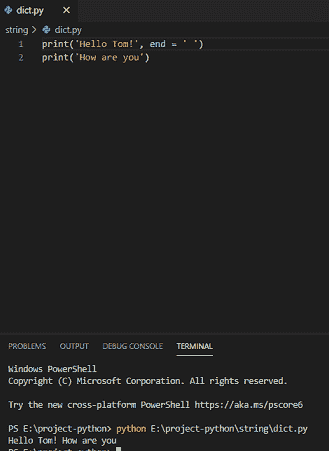
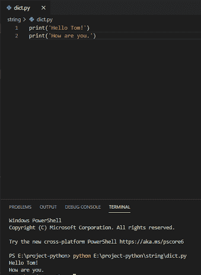
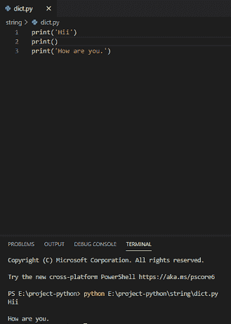
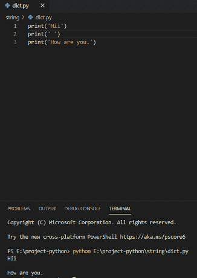
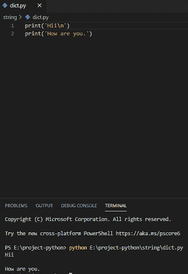
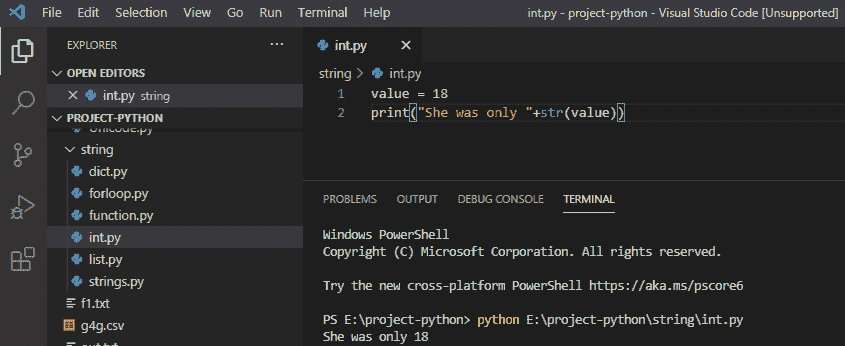
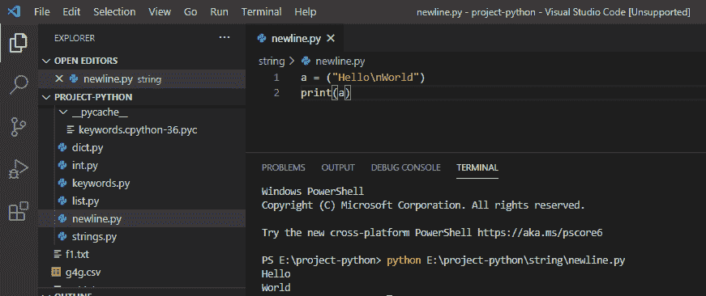

# 无换行符的 Python 打印

> 原文：<https://pythonguides.com/python-print-without-newline/>

[](https://sharepointsky.teachable.com/p/python-and-machine-learning-training-course)

在这个 Python 教程中，我们将会看到，**如何在 python** 中进行无换行符打印。我们将在没有换行符的 **Python 打印上查看各种例子**。同样，我们将看到**如何在 python 中打印换行符**，**在 Python 中打印空行，` `python 在同一行打印 string 和 int**以及**如何在 Python 中创建新行**

如果您是 Python 新手，请查看 [Python 下载和安装步骤](https://pythonguides.com/python-download-and-installation/)和 [Python Hello World 程序](https://pythonguides.com/python-hello-world-program/)

目录

[](#)

*   [无换行符的 Python 打印](#Python_print_without_newline "Python print without newline")
*   [用 Python 打印换行符](#Print_newline_in_Python "Print newline in Python")
*   [用 Python 打印空行](#Print_blank_line_in_Python "Print blank line in Python")
*   [Python 在同一行打印 string 和 int](#Python_print_string_and_int_on_the_same_line "Python print string and int on the same line")
*   [如何在 python 中创建新行](#How_to_create_a_new_line_in_python "How to create a new line in python")

## 无换行符的 Python 打印

在 python 中不带换行符的打印很容易，要不带换行符的打印，我们所要做的就是提供一个额外的参数“end ”,这样它就会附加在行尾。

**举例:**

```py
print('Hello Tom', end = [])
print('How are you')
```

在编写完上面的代码(python 打印，不带换行符)之后，您将打印这些代码，然后输出将显示为**“Hello Tom！**你好。在这里，结尾是用来加在结尾的。

你可以参考下面的截图来创建一个没有换行符的 python 打印。



Python print without newline

阅读:[Python 中的复数](https://pythonguides.com/complex-numbers-in-python/)

## 用 Python 打印换行符

现在，我们将看到如何在 Python 中**打印换行符。在 Python 中，换行符自动打印在行尾。**

**举例:**

```py
print('Hello Tom!')
print('How are you.')
```

在编写了上面的代码(用 Python 打印换行符)之后，您将打印这些代码，然后输出将显示为**“Hello Tom！**你好。在这里，它自动打印一个换行符。

你可以参考下面的截图，用 python 创建一个打印换行符。



Print newline in Python 3

## 用 Python 打印空行

现在，我们将看到如何在 Python 中**打印空行。没有任何参数的打印将给出一个空行，它将没有任何字符。**

**举例:**

```py
print('Hii')
print()
print('How are you.')
```

在编写完上面的代码(用 Python 打印空行)之后，您将打印这些代码，然后输出将显示为**“Hii How are you”**。这里， `print()` 会给你一个空行。

你可以参考下面的截图，用 python 创建一个打印空行。



Print blank line in Python

还可以在 python 中用单引号**打印一个空行。**

示例:

```py
print('Hii')
print(' ')
print('How are you.')
```

在编写完上面的代码(用 Python 打印空行)之后，您将打印这些代码，然后输出将显示为**“Hii How are you”**。这里，单引号**打印(')**会给你一个空行。你可以参考下面的截图，用 python 创建一个打印空行。



Print blank line in Python

通过在单引号或双引号中使用“\ n ”, python 中也会出现一个空行。

**举例:**

```py
print('Hii\n')
print('How are you.')
```

在编写完上面的代码(用 Python 打印空行)之后，您将打印这些代码，然后输出将显示为**“Hii How are you”**。在这里， **" \n "** 也会给你一个空行。你可以参考下面的截图，用 python 创建一个打印空行。



## Python 在同一行打印 string 和 int

在 python 中，在同一行打印 string 和 int 意味着我们想要将 int 和 string 连接起来，这可以通过使用 `str()` 方法来完成。

**举例:**

```py
value = 18
print("She was only "+str(value))
```

写完上面的代码后(python 在同一行打印 string 和 int)，你将打印的代码输出将显示为**“她只有 18 岁”**。这里，**+操作符**用于将字符串与 int 连接起来， `str()` 用于转换。你可以参考下面 python 打印字符串和 int 在同一行的截图。



## 如何在 python 中创建新行

在 python 中，要创建一个新行，我们将使用 **"\n"** 这意味着当前行在此结束，新行在" \n "之后开始。

**举例:**

```py
a = ("Hello\nWorld")
print(a)
```

写完上面的代码(如何在 python 中创建新行)，你将打印这些代码，然后输出将显示为 `" Hello World "` 。在这里，\n 用于创建一个新行。关于如何在 python 中创建新行，你可以参考下面的截图。



您可能会喜欢以下 Python 教程:

*   [Python 字典方法+示例](https://pythonguides.com/python-dictionary-methods/)
*   [11 Python 列表方法](https://pythonguides.com/python-list-methods/)
*   [如何在 Python 中创建列表](https://pythonguides.com/create-list-in-python/)
*   [使用 Visual Studio 代码](https://pythonguides.com/python-hello-world-program/)用 python 创建一个 hello world 程序
*   [Python 字符串函数](https://pythonguides.com/string-methods-in-python/)
*   [如何在 python 中把整数转换成字符串](https://pythonguides.com/convert-an-integer-to-string-in-python/)
*   [如何在 python 中连接字符串](https://pythonguides.com/concatenate-strings-in-python/)
*   [如何在 python 中使用正则表达式拆分字符串](https://pythonguides.com/python-split-string-regex/)
*   [如何在 Python 中创建字符串](https://pythonguides.com/create-a-string-in-python/)

在本 [Python 教程](https://wiki.python.org/moin/BeginnersGuide)中，我们学习了**如何在 python** 中不换行打印。

*   无换行符的 Python 打印
*   用 Python 打印换行符
*   用 Python 打印空行
*   Python 在同一行打印 string 和 int
*   如何在 python 中创建新行

[Bijay Kumar](https://pythonguides.com/author/fewlines4biju/)

Python 是美国最流行的语言之一。我从事 Python 工作已经有很长时间了，我在与 Tkinter、Pandas、NumPy、Turtle、Django、Matplotlib、Tensorflow、Scipy、Scikit-Learn 等各种库合作方面拥有专业知识。我有与美国、加拿大、英国、澳大利亚、新西兰等国家的各种客户合作的经验。查看我的个人资料。

[enjoysharepoint.com/](https://enjoysharepoint.com/)[](https://www.facebook.com/fewlines4biju "Facebook")[](https://www.linkedin.com/in/fewlines4biju/ "Linkedin")[](https://twitter.com/fewlines4biju "Twitter")