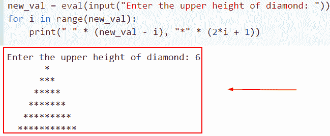
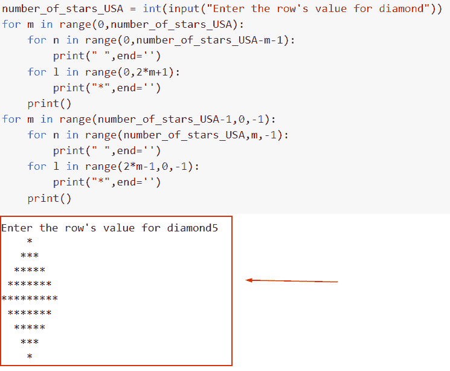
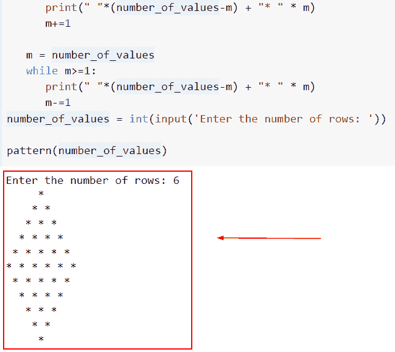
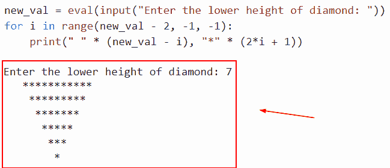
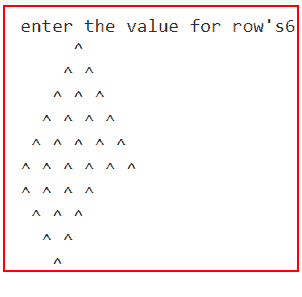
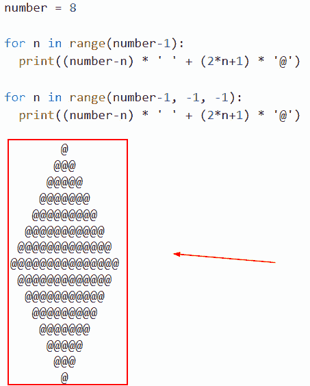

# 钻石图案的 Python 程序

> 原文：<https://pythonguides.com/python-program-for-a-diamond-pattern/>

[](https://sharepointsky.teachable.com/p/python-and-machine-learning-training-course)

在本 [Python 教程](https://pythonguides.com/python-and-machine-learning-training-course/)中，我们将讨论如何用 Python 打印星形和菱形图案。先说两种主要的利用星星的钻石打印技术。让我们从打印一个完整的钻石图案开始。此外，我们还将讨论以下主题

*   钻石图案的 Python 程序
*   Python 程序制作钻石图案
*   使用 while 循环打印菱形图案的 Python 程序
*   Python 代码打印钻石图案
*   Python 程序打印半菱形图案
*   Python 程序打印钻石形状

目录

[](#)

*   [菱形图案的 Python 程序](#Python_program_for_the_diamond_pattern "Python program for the diamond pattern")
*   [Python 程序制作钻石图案](#Python_program_to_make_a_diamond_pattern "Python program to make a diamond pattern")
*   [Python 程序使用 while 循环打印菱形图案](#Python_program_to_print_diamond_pattern_using_while_loop "Python program to print diamond pattern using while loop")
*   [Python 程序打印半菱形图案](#Python_Program_to_print_half_diamond_pattern "Python Program to print half diamond pattern")
*   [Python 代码打印钻石图案](#Python_code_to_print_diamond_pattern "Python code to print diamond pattern")
*   [Python 程序打印钻石形状](#Python_Program_to_print_diamond_shape "Python Program to print diamond shape")

## 菱形图案的 Python 程序

*   在 Python 中用于打印模式的许多 for 循环中，分别使用第一个外部和内部 for 循环打印行数和列数。
*   首先，我们将使用外部循环打印行数，然后使用 Python 中的内部循环打印列数。Python 变量用于在需要时输出空白。
*   在这个例子中，我们将打印星号和空格的数量。我们举个例子，看看如何用 Python 打印钻石的上半部分。

**举例**:

```py
new_val = eval(input("Enter the upper height of diamond: "))
for i in range(new_val):
    print(" " * (new_val - i), "*" * (2*i + 1))
```

如果你看这个菱形，你会注意到在它的上部又多了 1、3、5 和 7 个星号。因此，该行中星号的数量是 `2x+1` ，其中 x 是钻石从上到下的行号。

当我们向前移动时，左边的空格数必须减少一个，以弥补星号的增加。结果就是出现了 `h-x` 空格。(右边没有空格！)

因此，您应该为每一行打印 h-x 个空格和 2x+1 个星号，其中 x 是范围从 0 到 height–1 的高度。

下面是以下给定代码的实现



Python program for the diamond pattern

这就是如何用 Python 创建一个菱形图案的程序。

阅读 [Python 字典长度](https://pythonguides.com/python-dictionary-length/)

## Python 程序制作钻石图案

*   选择要使用的行数和列数。行数和列数是印刷任何图案的常见结构。要打印任何图案，我们必须使用两个循环；换句话说，我们必须使用嵌套循环。
*   打印图案所需的行数和列数分别由外部和内部循环指定。
*   input()函数可用于通过询问用户想要多少行来确定模式的大小。
*   行迭代接下来，使用 for 循环和 range()方法创建一个外部循环来迭代行数。
*   列迭代:为了管理列的数量，接下来构造一个内部循环或嵌套循环。根据外部循环的值，内部循环迭代。

示例:

让我们举个例子，看看如何用 Python 制作一个菱形图案。

**源代码**:

```py
number_of_stars_USA = int(input("Enter the row's value for diamond"))   
for m in range(0,number_of_stars_USA):
    for n in range(0,number_of_stars_USA-m-1):
        print(" ",end='')
    for l in range(0,2*m+1):
        print("*",end='')
    print()
for m in range(number_of_stars_USA-1,0,-1):
    for n in range(number_of_stars_USA,m,-1):
        print(" ",end='')
    for l in range(2*m-1,0,-1):
        print("*",end='')
    print() 
```

下面是以下代码的截图



Python program to make a diamond pattern

在这个例子中，我们已经了解了如何使用 for 循环方法在 Python 中制作菱形图案。

读取 [Python while 循环多个条件](https://pythonguides.com/python-while-loop-multiple-conditions/)

## Python 程序使用 while 循环打印菱形图案

*   在这一节中，我们将讨论如何使用 Python 中的 while 循环来打印菱形图案。
*   为了执行这个特定的任务，我们将使用 while 循环概念并定义函数，在这个函数中，我们将数字作为参数传递。
*   在这个 Python 程序中，首先读取用户的行。菱形设计的三角形中的行数由行来表示。给定行值 6，模式的总行数将是 10。

**举例**:

这里我们将举一个例子，检查如何使用 while 循环打印菱形图案。

```py
def pattern(number_of_values):

   m = 1
   while m<number_of_values:

      print(" "*(number_of_values-m) + "* " * m)
      m+=1 

   m = number_of_values
   while m>=1:
      print(" "*(number_of_values-m) + "* " * m)
      m-=1
number_of_values = int(input('Enter the number of rows: '))

pattern(number_of_values)
```

下面是以下给定代码的执行过程



Python program to print diamond pattern using while loop

这就是如何使用 while 循环方法在 Python 中打印菱形图案。

阅读 [Python Tkinter 测验](https://pythonguides.com/python-tkinter-quiz/)

## Python 程序打印半菱形图案

*   在这个例子中，我们将讨论如何用 Python 打印半菱形图案。
*   星号计数从下半部分的、7、5、3 和 1 开始下降。换句话说，如果 x 是从菱形中间开始的菱形的行号，那么 2x+1 就是该行中星号的个数。
*   我们越往下，星号越少，所以左边的空位一定越多，一定增加一个。因此，总共有 h-x 个空格。
*   为了打印每行的 h-x 空格和 `2x+1` 星号，其中 x 是 height- 2 和 0 之间的高度，请参见下面的示例。

**举例**:

```py
new_val = eval(input("Enter the lower height of diamond: "))
for i in range(new_val - 2, -1, -1):
    print(" " * (new_val - i), "*" * (2*i + 1))
```

你可以参考下面的截图



Python Program to print half diamond pattern method

正如你在截图中看到的，我们已经讨论了如何用 Python 打印半菱形图案。

读取 [Python 字典初始化](https://pythonguides.com/python-dictionary-initialize/)

## Python 代码打印钻石图案

*   在这一节中，我们将讨论如何用 Python 打印菱形图案。
*   首先，我们将使用外部循环打印行数，然后使用内部循环打印列数。Python 变量用于在需要时输出空白。
*   这些是我们在示例中要遵循的步骤
    *   输入创建菱形图案所需的行数，然后用于范围为(n)的循环
    *   使用第二个 for 循环，范围如下:1， `int((n/2))-i+3` 。并使用报表打印**【sep】【end】**。循环结束(3)然后使用范围(1，i+2)进行循环。
    *   打印“*”、“end=”循环结束(6)，循环结束后打印空格(2)。
    *   我们使用一个范围为菱形下部(n)的循环，然后使用第二个范围为 **(1.5-(int((n/2))-i+3)+2)的循环。**打印(" sep "，" end ")
    *   用于范围为(1，5-i)的循环，打印 **("*，end = " "**)空格后，打印循环(10)结束。

**举例**:

```py
new_val=int(input("enter the value for row's"))

for m in range(new_val):

    for n in range(1,int((new_val/2))-m+3):

        print(sep=" ",end=" ")

    for l in range(1,m+2):

        print("^", end=" ")

    print()

for m in range(new_val):

    for n in range(1,5-(int((new_val/2))-m+3)+2):

        print(sep=" ",end=" ")

    for l in range(1,5-m):

        print("^", end=" ")

    print()
```

下面是以下给定代码的实现



Python code to print diamond pattern

这就是如何用 Python 写代码打印菱形图案。

读取 [Python 字典值以列出](https://pythonguides.com/python-dictionary-values-to-list/)

## Python 程序打印钻石形状

*   我们将为循环使用两个外层，一个用于顶部三角形，另一个用于下部三角形，以及嵌套循环来打印 Python 中的菱形模式。
*   在这种方法中，Python 中的 string 属性将被用来重复指定的数字，包括乘法符号。

**举例**:

```py
number = 8

for n in range(number-1):
  print((number-n) * ' ' + (2*n+1) * '@')

for n in range(number-1, -1, -1):
  print((number-n) * ' ' + (2*n+1) * '@')
```

在下面给出的代码中，我们首先声明了一个变量，并给它赋了一个整数。接下来，我们使用 for-loop 方法并迭代 for-loop，并设置条件(2*n+1)。

下面是以下代码的截图



Python Program to print diamond shape

在这个例子中，我们已经理解了如何在 Python 中显示菱形。

在本教程中，我们讨论了如何用 Python 打印金字塔、星形和菱形图案。此外，我们还讨论了以下主题

*   菱形模式的 Python 程序
*   Python 程序制作钻石图案
*   使用 while 循环打印菱形图案的 Python 程序
*   Python 代码打印钻石图案
*   Python 程序打印半菱形图案
*   Python 程序打印钻石形状

您可能会喜欢以下 Python 教程:

*   [Python 反向 NumPy 数组](https://pythonguides.com/python-reverse-numpy-array/)
*   [用于冒泡排序的 Python 程序](https://pythonguides.com/python-program-for-bubble-sort/)
*   [如何在 Python 中创建字符串](https://pythonguides.com/create-a-string-in-python/)
*   [Python 字典更新示例](https://pythonguides.com/python-dictionary-update/)
*   [Python NumPy max 带示例](https://pythonguides.com/python-numpy-max-with-examples/)
*   [值错误:用序列](https://pythonguides.com/valueerror-setting-an-array-element-with-a-sequence/)设置数组元素

[Arvind](https://pythonguides.com/author/arvind/)

Arvind 目前是 TSInfo Technologies 的高级 Python 开发人员。他精通 Python 库，如 NumPy 和 Tensorflow。