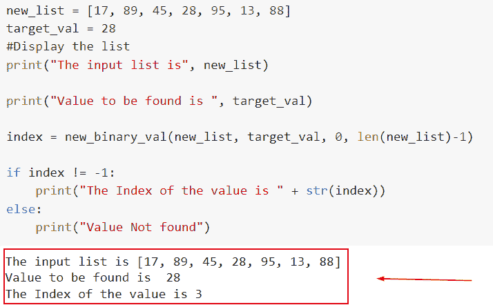
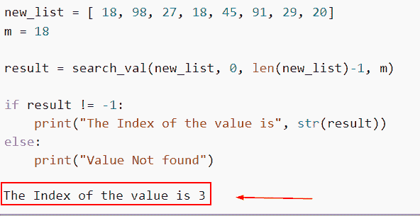
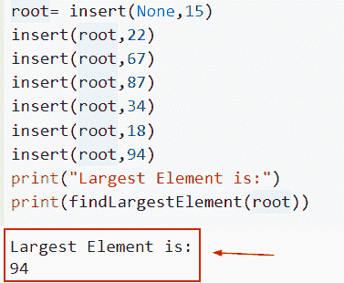
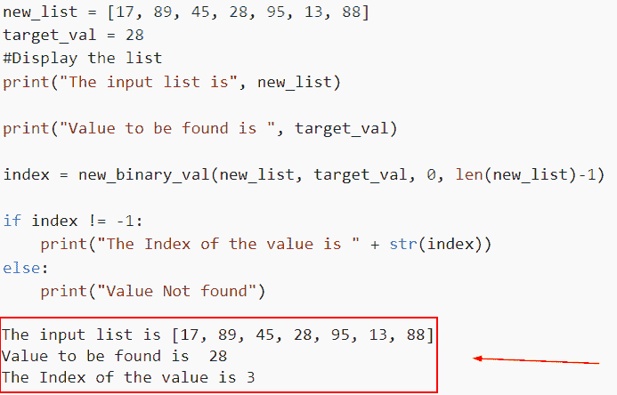
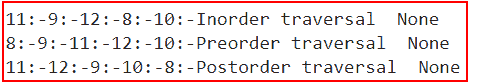
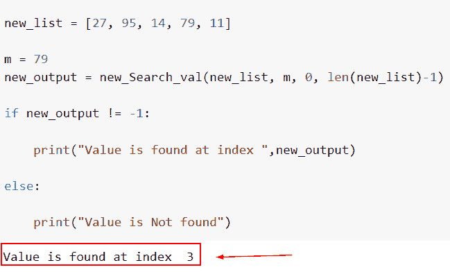
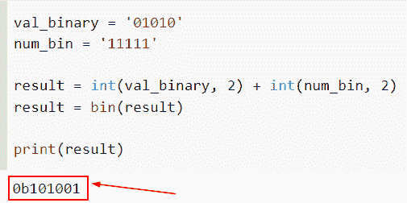

# 二分搜索法的 Python 程序

> 原文：<https://pythonguides.com/python-program-for-binary-search/>

[](https://sharepointsky.teachable.com/p/python-and-machine-learning-training-course)

你知道如何用 Python 来做二分搜索法吗？让我们用例子来讨论和理解如何对算法进行编码。此外，我们将涵盖以下主题。

*   二分搜索法的 Python 程序
*   二分搜索法递归和迭代的 Python 程序
*   二叉查找树的 Python 程序
*   二分搜索法递归的 Python 程序
*   用于二叉树遍历的 Python 程序
*   Python 程序实现无递归的二分搜索法
*   二进制加法的 Python 程序

目录

[](#)

*   [二分搜索法的 Python 程序](#Python_program_for_binary_search "Python program for binary search")
*   [二分搜索法的 Python 程序(递归和迭代)](#Python_program_for_binary_Search_recursive_and_iteration "Python program for binary Search (recursive and iteration)")
*   [二叉查找树的 Python 程序](#Python_Program_for_binary_Search_tree "Python Program for binary Search tree")
*   [二分搜索法的 Python 程序(递归)](#Python_Program_for_Binary_Search_recursive "Python Program for Binary Search (recursive)")
*   [用于二叉树遍历的 Python 程序](#Python_Program_for_binary_tree_traversal "Python Program for binary tree traversal")
*   [不用递归实现二分搜索法的 Python 程序](#Python_Program_to_implement_binary_search_without_recursion "Python Program to implement binary search without recursion")
*   [用于二进制加法的 Python 程序](#Python_Program_for_binary_addition "Python Program for binary addition")

## 二分搜索法的 Python 程序

*   在这一节，我们将如何用 Python 为二分搜索法写一个程序。
*   若要定位列表中的特定元素，请使用二分搜索法技术。假设我们需要获得一个包含 1000 个元素的列表中某个特定元素的索引位置。二分搜索法算法决定了元素的索引位置。
*   为了应用二分搜索法技术，列表的条目必须被排序。如果组件尚未排序，请先排序。对于二分搜索法，我们可以使用两种方法:下面将对它们进行解释。
    *   迭代法
    *   递归方法

递归方法出现在分而治之策略之后。这个方法反复调用一个函数，直到它在列表中找到一个条目。

迭代方法通过反复重复一个数字来寻找元素的索引位置。为了完成这个过程，使用了 while 循环。

让我们一步一步地完成二分搜索法的实现。我们在已经排序的元素列表中寻找 `82` 的索引位置。

以下是清单:

```py
[17,92,67,14,82,34] 
```

现在，我们将考虑列表中的两点，第一点表示为低值，第二点表示为高值。

```py
mid = (low+high)/2  
Here, the low is 0 and the high is 6\.  
mid = (0+6)/2  
mid = 3 
```

*   我们现在将搜索的元素与索引的中点匹配。在这种情况下，14 不等于 82。为了确定元素的位置，我们必须比较另外两个东西。
*   如果我们要寻找的数字等于中点，则返回 mid 否则，继续下一个比较。
*   由于要搜索的数是中间的数，我们将 low 设置为等于 mid + 1，并将 n 与 mid 右侧的组件的中间元素进行比较。

**举例**:

让我们举个例子，看看如何用 Python 创建一个二分搜索法程序。

```py
def new_binary_val(new_list, target_val, low, high):

    while low <= high:

        mid = low + (high - low)//2

        if new_list[mid] == target_val:
            return mid

        elif new_list[mid] < target_val:
            low = mid + 1

        else:
            high = mid - 1

    return -1

new_list = [17, 89, 45, 28, 95, 13, 88]
target_val = 28
#Display the list
print("The input list is", new_list)

print("Value to be found is ", target_val)

index = new_binary_val(new_list, target_val, 0, len(new_list)-1)

if index != -1:
    print("The Index of the value is " + str(index))
else:
    print("Value Not found")
```

下面是以下给定代码的实现



Python program for binary search

这就是我们如何用 Python 为二分搜索法创建一个程序。

阅读[如何在 Python 中找到完全数](https://pythonguides.com/perfect-number-in-python/)

## 二分搜索法的 Python 程序(递归和迭代)

*   使用 Python 中的二分搜索法在排序数组中查找项目的位置。列表被它一分为二。当输入一个值时，如果该值大于中间的数字，则搜索范围会缩小到列表的右侧。如果没有，列表左边的数字就是搜索要找的数字，为此，我们将使用递归方法。
*   这种方法包括遍历整个列表，同时重复一组指令。我们会继续找，直到找到中间值。
*   实现一个名为 binary `search()` 的函数，它接受四个参数(array，low，high，a)。
*   声明两个变量来保存列表的最大值和最小值。
*   然后继续第 4 步，直到达到最低值和最高值:
*   `mid=(low + high)` / 2 假设(a == arr[mid])返回 mid if (a > arr[mid])，否则如果 an 在右边，low 等于 mid+1，如果 an 在左边，high 等于 mid-1
*   设置从每个数字开始搜索的数组和元素。
*   如果找到元素，打印结果位置；否则，打印。没有找到它。

**举例**:

让我们举个例子，看看如何使用递归方法在 Python 中创建一个二分搜索法程序。

**源代码**:

```py
def search_val(new_list, low, high, m):

    if high >= low:
        mid = (high + low) // 2

        if new_list[mid] == m:
            return mid

        elif new_list[mid] > m:
            return search_val(new_list, low, mid - 1, m)

        else:
            return search_val(new_list, mid + 1, high, m)

    else:
        return -1

new_list = [ 18, 98, 27, 18, 45, 91, 29, 20]
m = 18

result = search_val(new_list, 0, len(new_list)-1, m)

if result != -1:
    print("The Index of the value is", str(result))
else:
    print("Value Not found")
```

你可以参考下面的截图



Python program for binary Search recursive and iteration

正如你在截图中看到的，我们已经理解了如何为二分搜索法递归和迭代方法编写程序。

阅读[如何在 Python 中反转一个数字](https://pythonguides.com/reverse-a-number-in-python/)

## 二叉查找树的 Python 程序

*   称为树的特定类型的数据结构用于以分层格式表示数据。它可以被描述为一组节点，即事物或实体的集合，这些事物或实体相互连接，形成一种层次结构的假象。树是非线性数据结构，因为它们的数据不是以线性或顺序的方式组织的。
*   二叉树是有限节点的集合，可能有也可能没有元素。三个实体构成一个节点。具有左右两个指针的值。每个子树的父组件是根节点。
*   它也可以被认为是树的根节点。子元素是连接到父元素的节点。另一方面，二叉树的基本组件是叶节点。

**举例**:

```py
class BinaryTreeNode:
  def __init__(self, data):
    self.data = data
    self.leftChild = None
    self.rightChild=None

def insert(root,newValue):
    if root is None:
        root=BinaryTreeNode(newValue)
        return root
    if newValue<root.data:
        root.leftChild=insert(root.leftChild,newValue)
    else:

        root.rightChild=insert(root.rightChild,newValue)
    return root
def findLargestElement(root):
    if root==None:
        return False
    elif root.rightChild==None:
        return root.data
    else:
        return findLargestElement(root.rightChild)
root= insert(None,15)
insert(root,22)
insert(root,67)
insert(root,87)
insert(root,34)
insert(root,18)
insert(root,94)
print("Largest Element is:")
print(findLargestElement(root))
```

下面是以下代码的截图



Python Program for binary Search tree

在这个例子中，我们已经理解了如何为二叉查找树写一个程序。

读 [Python 程序求偶数或奇数](https://pythonguides.com/python-program-for-even-or-odd/)

## 二分搜索法的 Python 程序(递归)

*   递归策略可用于二分搜索法。只要需求没有得到满足，递归函数就会一直调用自己。
*   在递归方法中使用的分而治之策略将一个困难的问题分成更小的子问题，解决这些子问题，然后将它们组合起来产生想要的答案。

**举例**:

让我们举一个例子，看看如何使用递归方法用 Python 为二分搜索法创建一个程序。

**源代码**:

```py
def new_binary_val(new_list, target_val, low, high):

    while low <= high:

        mid = low + (high - low)//2

        if new_list[mid] == target_val:
            return mid

        elif new_list[mid] < target_val:
            low = mid + 1

        else:
            high = mid - 1

    return -1

new_list = [17, 89, 45, 28, 95, 13, 88]
target_val = 28
#Display the list
print("The input list is", new_list)

print("Value to be found is ", target_val)

index = new_binary_val(new_list, target_val, 0, len(new_list)-1)

if index != -1:
    print("The Index of the value is " + str(index))
else:
    print("Value Not found")
```

下面是以下给定代码的实现



Python Program for Binary Search recursive

阅读: [Python 扩展 Vs 追加](https://pythonguides.com/python-extend-vs-append/)

## 用于二叉树遍历的 Python 程序

*   为了被遍历，树的所有节点都必须被访问。例如，您可能希望确定最大值或将树中的所有值相加。为了执行这些操作，您必须遍历树的每个节点。
*   树是用多种编程语言实现的抽象数据结构，遍历意味着访问。与数组或列表的实现相比，树的实现本质上是非线性的。
*   遍历方法用于访问树中的每个节点并打印其值。遍历树中的每个节点是遍历的必要部分。因为每个节点都是通过边连接的，所以我们总是从根(头)开始。
*   对于树形数据结构，有三种遍历方法可以执行。
    *   有序树遍历
    *   前序树遍历
    *   后序树遍历
*   现在我们简单讨论一下 Python 中遍历树的这三种方式。
    *   **Inorder 树遍历**:In order 遍历中，首先访问当前节点的左子树或左子树，然后是当前节点，最后是当前节点的右子树或右子树。我们重复这个步骤，直到遍历完所有节点。
    *   **前序树遍历**:这种方法从访问根节点开始，然后遍历左边的子树，最后遍历右边的子树。
    *   **后序树遍历**:这种情况下，遍历根节点，先访问左侧，再遍历右侧子树。

**举例**:

让我们通过使用 inorder、preorder 和 postorder 来看一个 Python 中遍历的例子和实现。

**源代码**:

```py
class Node:
    def __init__(self, element):
        self.left = None
        self.right = None
        self.val = element

def inorder(root):

    if root:
        inorder(root.left)
        print(str(root.val) + ":-", end='')
        inorder(root.right)

def postorder(root):

    if root:
        postorder(root.left)
        postorder(root.right)
        print(str(root.val) + ":-", end='')

def preorder(root):

    if root:
        print(str(root.val) + ":-", end='')
        preorder(root.left)
        preorder(root.right)

root = Node(8)
root.left = Node(9)
root.right = Node(10)
root.left.left = Node(11)
root.left.right = Node(12)

print("Inorder traversal ",inorder(root))

print("Preorder traversal ",preorder(root))

print("Postorder traversal ",postorder(root))
```

下面是以下代码的截图



Python Program for binary tree traversal

在 Python 中读取[复数](https://pythonguides.com/complex-numbers-in-python/)

## 不用递归实现二分搜索法的 Python 程序

*   在这个例子中，我们将实现一个没有递归方法的二分搜索法程序。因此，在这种情况下，我们将使用迭代过程。
*   迭代方法通过反复重复一个数字来寻找元素的索引位置。为了完成这个过程，使用了 while 循环。
*   在这个例子中，我们将考虑在下面的列表上实现搜索。假设待求的值为 `m= 79` 。现在我们将使用两个指针——指向列表中最小位置的低指针和指向列表中最高位置的高指针。
*   如果中间元素和要搜索的元素匹配，我们将比较中间元素和匹配元素并返回中间元素。
*   我们将把 low 指针设置为**“mid+1”**元素，如果要寻找的元素大于 mid，则重新运行该过程。
*   高位指针将移动到**“中间-1”**元素，如果要查找的元素低于中间元素，将重复该方法。

**举例**:

```py
def new_Search_val(new_list, m, low, high):

    while low <= high:
        middle = low + (high - low)//2
        if new_list[middle] == m:
            return middle
        elif new_list[middle] < m:

            low = middle + 1
        else:

            high = middle - 1
    return -1

new_list = [27, 95, 14, 79, 11]

m = 79
new_output = new_Search_val(new_list, m, 0, len(new_list)-1)

if new_output != -1:

    print("Value is found at index ",new_output)

else:

    print("Value is Not found")
```

下面是以下给定代码的执行过程



Python Program to implement binary search without recursion

阅读 [Python 回文程序及示例](https://pythonguides.com/python-palindrome-program/)

## 用于二进制加法的 Python 程序

*   在这一节中，我们将讨论如何在 Python 中添加两个二进制加法。
*   为此，我们将在下面的示例中使用 int()函数，我们将字符串(二进制值)转换为整数，因此我们将基值作为 `2` 传递。
*   int()方法将给定的字符串转换成一个整数，并考虑所提供的基值(二进制数的基值为 2，小数的基值为 10)。
*   Python 函数 `bin()` 将整数转换成等价的二进制表示。这将产生一个包含前缀(0b)的字符串，表示它已被转换为二进制格式。

**举例**:

```py
val_binary = '01010'
num_bin = '11111'

result = int(val_binary, 2) + int(num_bin, 2)
result = bin(result)

print(result)
```

下面是以下代码的截图



Python Program for binary addition

这就是我们如何通过使用 int()函数在 Python 中将两个二进制数相加。

在本文中，我们讨论了如何用 Python 实现二分搜索法。让我们用例子来讨论和理解如何对算法进行编码。此外，我们将涵盖以下主题。

*   二分搜索法的 Python 程序
*   二分搜索法的 Python 程序(递归和迭代)
*   没有函数的二分搜索法 Python 程序
*   二叉查找树的 Python 程序
*   二分搜索法的 Python 程序(递归)
*   用于二叉树遍历的 Python 程序
*   Python 程序实现无递归的二分搜索法
*   二进制加法的 Python 程序

您可能会喜欢以下 Python 教程:

*   [Python 中的阿姆斯特朗数](https://pythonguides.com/armstrong-number-in-python/)
*   [用于冒泡排序的 Python 程序](https://pythonguides.com/python-program-for-bubble-sort/)
*   [钻石图案的 Python 程序](https://pythonguides.com/python-program-for-a-diamond-pattern/)
*   [如何在 python 中使用正则表达式拆分字符串](https://pythonguides.com/python-split-string-regex/)
*   [Python 字典方法](https://pythonguides.com/python-dictionary-methods/)
*   [如何在 python 中把整数转换成字符串](https://pythonguides.com/convert-an-integer-to-string-in-python/)
*   [解析 Python 时出现意外的 EOF](https://pythonguides.com/unexpected-eof-python/)

[Bijay Kumar](https://pythonguides.com/author/fewlines4biju/)

Python 是美国最流行的语言之一。我从事 Python 工作已经有很长时间了，我在与 Tkinter、Pandas、NumPy、Turtle、Django、Matplotlib、Tensorflow、Scipy、Scikit-Learn 等各种库合作方面拥有专业知识。我有与美国、加拿大、英国、澳大利亚、新西兰等国家的各种客户合作的经验。查看我的个人资料。

[enjoysharepoint.com/](https://enjoysharepoint.com/)[](https://www.facebook.com/fewlines4biju "Facebook")[](https://www.linkedin.com/in/fewlines4biju/ "Linkedin")[](https://twitter.com/fewlines4biju "Twitter")