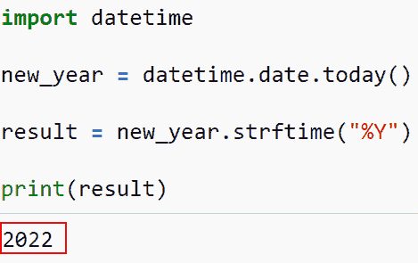

# 当前日期和时间的 Python 程序

> 原文：<https://pythonguides.com/python-program-for-current-date-and-time/>

[](https://sharepointsky.teachable.com/p/python-and-machine-learning-training-course)

在这个 [Python 教程](https://pythonguides.com/python-and-machine-learning-training-course/)中，我们将讨论如何**在 Python** 中获取当前日期和时间，我们还将讨论如何在 Python 中获取 dd mm yyyy 格式的当前日期。除此之外，我们还将讨论以下主题。

*   当前日期和时间的 Python 程序
*   用于显示当前日期和时间的 Python 程序
*   Python 时间获取当前年份
*   Python 程序来获取当前时间

目录

[](#)

*   [当前日期和时间的 Python 程序](#Python_program_for_current_date_and_time "Python program for current date and time")
    *   [方法-1:使用日期时间模块](#Method-1_Using_the_Datetime_module "Method-1: Using the Datetime module")
    *   [方法二:使用摆锤模块](#Method_2_By_using_the_pendulum_module "Method 2: By using the pendulum module")
    *   [方法-3:使用日期时间的日期时间属性](#Method-3_Attributes_of_Datetime_using_Datetime "Method-3: Attributes of Datetime using Datetime")
    *   [方法 4:使用 pytz 模块](#Method_4_By_using_the_pytz_module "Method 4: By using the pytz module")
*   [显示当前日期和时间的 Python 程序](#Python_program_for_displaying_current_date_and_time "Python program for displaying current date and time")
*   [Python 时间获取当前年份](#Python_time_get_the_current_year "Python time get the current year")
*   [Python 程序获取当前时间](#Python_program_to_get_the_current_time "Python program to get the current time")

## 当前日期和时间的 Python 程序

*   本节将讨论如何在 Python 中获取当前日期和时间。
*   用户可能经常需要当前系统日期和时间来进行各种操作。许多 Python 内置的函数和模块使得修复这个问题变得很简单。
*   通过导入内置的 Python 包 datetime，我们可以处理日期方法。为了处理日期，我们有数据对象。此 datetime 模块中包含年、月、日、小时、分钟、秒和微秒形式的日期。
*   有许多方法可以从 datetime 模块中获取关于 date 对象的数据。要计算该函数，必须提供日期、月份和年份。

**举例**:

让我们举一个例子，检查我们在 Python 中获取当前日期和时间的第一个方法。

### **方法 1:使用日期时间模块**

Python 中的 datetime 模块提供了日期和时间操作类。可能有各种需要处理时间和日期的应用程序。当处理各种日期和时间格式时，datetime 模块会以一种很好的方式出现。

要确定当前时间和日期，请使用 `now()` 方法。此项属于 datetime 模块。它以 **yyy-mm-dd hh:mm:ss: ms** 格式返回日期和时间。

示例:

```py
import datetime

recent_time_date = datetime.datetime.now()

# Display the value
print("Current time and date:", recent_time_date)
```

在下面的代码中，我们首先导入了 datetime 模块，然后使用了 `datetime.now()` 函数。接下来，我们使用 `now()` 函数来获取当前时间。

下面是以下代码的截图


Python program for current date and time

这是如何在 Python 中使用 datetime.now()方法获取当前日期和时间。

Read: [在 Python 中检查一个字符串是否包含子串](https://pythonguides.com/check-if-a-string-contains-a-substring-in-python/)

### **方法二:利用摆模块**

Pendulum 是一个时区库，使得在 Python 中操作日期和时间更加容易。与 datetime 模块一样，pendulum 模块也提供了一个返回当前时间和日期的 `now()` 方法。

**举例**:

```py
import pendulum
new_time = pendulum.now()
print(new_time)
```

下面是以下给定代码的实现


Python program for current date and time pendulum module

正如你在截图中看到的，我们已经理解了如何使用 python 中的钟摆模块来显示当前的日期和时间。

### **方法-3:使用日期时间** 的日期时间属性

与年、月、日、小时、分钟和秒等与时间相关的属性一样， `timedate.now()` 具有多种特性。

**举例**:

```py
import datetime

new_current_date_time = datetime.datetime.now()

print("The attributes of datetime.now() are :")

print(" Current Year :", new_current_date_time.year)

print("Current Month : ", new_current_date_time.month)

print("Current Day : ",  new_current_date_time.day)

print("Current Hour : ", new_current_date_time.hour)

print("Current Minute : ", new_current_date_time.minute)

print("Current Second :", new_current_date_time.second)

print("Current Microsecond :", new_current_date_time.microsecond)
```

你可以参考下面的截图


Python program for current date and time attributes

### **方法四:通过使用 pytz 模块**

时区会影响日期和时间的值。对于需要与其他国家的用户进行交互的 Python 应用程序，这些变量必须进行更改。

该区域表示 Python dateTime 模块无法转换日期和时间数据。使用 Python 的 **pytz 模块**，可以解决这个问题。

另一方面，Pendulum 是从 datetime 模块派生的相关库。它比它的对手更快，因为它采用了一种方法(pytz)。

**举例**:

```py
import pytz
from datetime import datetime

new_utc = pytz.timezone('UTC')
new_pst = pytz.timezone('America/Los_Angeles')
new_ist = pytz.timezone('Asia/Calcutta')

print('Current Date and Time in UTC =', datetime.now(new_utc))
print('Current Date and Time in PST =', datetime.now(new_pst))
print('Current Date and Time in IST =', datetime.now(new_ist))
```

下面是以下代码的截图


Python program for current date and time pytz module

这就是我们如何使用 pytz 模块获得当前日期和时间的方法。

阅读 [Python 连接列表示例](https://pythonguides.com/python-concatenate-list/)

## 显示当前日期和时间的 Python 程序

*   这里我们将讨论如何在 Python 中显示当前日期和时间。
*   用户可能经常需要当前系统日期和时间来进行各种操作。许多 Python 内置的函数和模块使得修复这个问题变得很简单。
*   为了执行这个特定的任务，我们将使用内置的 Python 包 DateTime，我们可以处理日期方法。为了处理日期，我们有数据对象。此 DateTime 模块中包含年、月、日、小时、分钟、秒和微秒形式的日期。

**举例**:

让我们举个例子，看看如何在 Python 中显示当前的日期和时间。

**源代码**:

```py
import datetime

new_time_date = datetime.datetime.now()

# Display the Current-time date
print("Current time and date:", new_time_date)
```

下面是以下给定代码的输出


Python program for displaying current-date and time

在这个例子中，我们已经理解了如何在 Python 中显示当前日期和时间。

阅读 [Python 二叉树实现](https://pythonguides.com/python-binary-tree/)

## Python 时间获取当前年份

*   要在 Python 中获取当前年份，有多种方法可以执行这项任务。
*   在 Python 中查找当前年份是使用 strfttime()函数。strftime()函数的参数是一个指定日期格式的字符串。给定日期以指定格式的字符串形式返回。为了让 strftime()返回 date 对象的年份，我们将传递给它“% Y”。

**举例**:

```py
import datetime

new_year = datetime.date.today()

result = new_year.strftime("%Y")

print(result)
```

下面是以下给定代码的执行过程



Python time get the current year

**方法二:使用年属性**

查找当前年份的最快方法是使用 datetime 模块。我们可以直接访问返回对象的 year 属性。

Python 要求我们在调用 today()之前从 datetime 模块导入日期类。用于检索当前年度的年度。

**举例**:

```py
import datetime

new_year = datetime.date.today()

result = new_year.year

print(result)
```

下面是以下代码的截图


Python time get the current year attribute year

在这个例子中，我们已经了解了如何通过使用 Python 中的属性 year 来获取当前年份。

阅读 [Python 连接列表](https://pythonguides.com/python-concatenate-list/)

## Python 程序获取当前时间

*   若要获取当前时间，请对 Datetime 对象使用 now()函数。这将为您提供当前位置的详细时间和日期报告。一旦有了这个，就可以用 strftime()方法格式化这个值，只检索时间数据。
*   在上面提到的程序中，我们使用 datetime.now()来检索当前日期和时间。然后使用 now()方法从 datetime 对象中提取当前日期和时间。

**举例**:

```py
from datetime import datetime
new_time = datetime.now()
result = new_time.strftime("%H:%M:%S")
print("Current Time is :", result)
```

下面是以下给定代码的执行过程


Python program to get the current time

**方法二:使用时间模块**

时间模块的 `localtime()` 函数可用于确定当前时间。让我们使用 Python 的 `localtime()` 函数。

**举例**:

```py
import time
new_current_time = time.localtime()
result = time.strftime("%H:%M:%S",new_current_time )
print("Current Time is :", result)
```

你可以参考下面的截图


Python program to get the current time module

这是如何通过使用 Python 中的时间模块来获取当前时间。

在本教程中，我们讨论了如何在 Python 中获取当前日期和时间，也讨论了如何在 Python 中获取 dd mm yyyy 格式的当前日期。除此之外，我们还讨论了以下主题。

*   当前日期和时间的 Python 程序
*   用于显示当前日期和时间的 Python 程序
*   Python 时间获取当前年份
*   Python 程序来获取当前时间

您可能还会喜欢以下 Python 教程:

*   [如何在 Python 中寻找完全数](https://pythonguides.com/perfect-number-in-python/)
*   [如何在 Python 中修剪字符串](https://pythonguides.com/trim-a-string-in-python/)
*   [如何在 Python 中反转一个数字](https://pythonguides.com/reverse-a-number-in-python/)
*   [偶数或奇数的 Python 程序](https://pythonguides.com/python-program-for-even-or-odd/)
*   [Python 中的复数](https://pythonguides.com/complex-numbers-in-python/)
*   [Python 回文程序](https://pythonguides.com/python-palindrome-program/)

[Arvind](https://pythonguides.com/author/arvind/)

Arvind 目前是 TSInfo Technologies 的高级 Python 开发人员。他精通 Python 库，如 NumPy 和 Tensorflow。