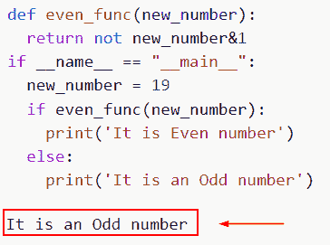

# 偶数或奇数的 Python 程序

> 原文：<https://pythonguides.com/python-program-for-even-or-odd/>

[](https://sharepointsky.teachable.com/p/python-and-machine-learning-training-course)

这里我们将了解如何在 [Python](https://pythonguides.com/python-hello-world-program/) 中创建一个程序并检查数字是偶数还是奇数的条件。我们还将讨论以下给定的主题。

*   偶数或奇数的 Python 程序
*   写一个 Python 程序，用函数检查奇偶
*   写一个 Python 程序，找出这个数是偶数还是奇数
*   如何编写 Python 程序将偶数和奇数放在不同的列表中

目录

[](#)

*   [偶数或奇数的 Python 程序](#Python_Program_for_even_or_odd "Python Program for even or odd")
*   [Python 程序使用函数](#Python_program_to_check_even_or_odd_using_function "Python program to check even or odd using function")检查偶数或奇数
*   [Python 程序找出数字是偶数还是奇数](#Python_program_to_find_whether_the_number_is_even_or_odd "Python program to find whether the number is even or odd")
*   [Python 程序将偶数和奇数放在不同的列表中](#Python_program_to_put_even_and_odd_numbers_in_a_different_list "Python program to put even and odd numbers in a different list")

## 偶数或奇数的 Python 程序

*   在这一节中，我们将讨论 Python 程序来确定一个给定的数是偶数还是奇数。
*   模数运算符用于确定 Python 中的数字是偶数还是奇数。执行除法时获得的余数由模数运算符返回。
*   即使模数运算符应用后返回的值为零，程序也会打印出输入的数字是。号码是奇数，如果不是就打印出来。还使用 if…else 语句。
*   简而言之，我们可以说，如果你将一个值除以 2，那么它将返回余数 0。所以它被称为偶数，否则，它将返回奇数。
*   数学上，偶数是 2，4，6，10，奇数是 1，3，5，7，9。如果一个数能被 2 整除，它就是偶数。我们使用余数运算符%来计算值除以 2 后的余数。如果余数不等于零，则该整数为奇数。

**举例**:

```py
new_number = int(input("Enter the value: "))  
if (new_number  % 2) == 0:  
   print("It is Even number".format(new_number ))  
else:  
   print("It is Odd number".format(new_number )) 
```

在下面的给定代码中，我们首先将输入值作为用户，然后将设置条件 num%2==0，并在获得余数后检查该条件是偶数还是奇数。

下面是下面给出的代码的截图。


Python Program for even or odd

这就是我们如何为偶数或奇数创建 python 程序。

阅读:[检查一个数是否是素数 Python](https://pythonguides.com/check-if-a-number-is-a-prime-python/)

## Python 程序使用函数检查偶数或奇数

*   在这个例子中，我们将讨论如何使用函数在 Python 中检查偶数或奇数。
*   除以二的元素如果没有余数，这个数就称为偶数。如果一个给定的整数能被 2 整除，它就称为偶数。
*   如果输入除以 2，结果不是 0，则输出称为奇数。

**举例**:

```py
def evoddfunc(num):
  if num%2==0:
    print(num,"is an even number")
  else:
    print(num,"is an odd number")
evoddfunc(20)
```

下面是以下给定代码的执行。


Python program to check even or odd using function

在这个例子中，我们已经了解了如何检查数字是偶数还是奇数。

阅读: [Python 将元组转换为列表](https://pythonguides.com/python-convert-tuple-to-list/)

## Python 程序找出数字是偶数还是奇数

*   在这个例子中，我们将讨论如何在 Python 中检查数字是偶数还是奇数。
*   数学上，偶数是 2，4，6，10，奇数是 1，3，5，7，9。如果一个数能被 2 整除，它就是偶数。我们使用按位运算符计算值除以 2 后的余数。如果余数不等于零，则该整数为奇数。
*   计算机程序设计中的按位操作是在位的级别上操作位串、位数组或二进制数。这是一个由 CPU 直接支持的快速而简单的操作，也是高级算术运算的基础。

**举例**:

```py
def even_func(new_number):
  return not new_number&1
if __name__ == "__main__":
  new_number = 19
  if even_func(new_number):
    print('It is Even number')
  else:
    print('It is an Odd number')
```

下面是以下给定代码的实现



Python program to find whether the number is even or odd

这就是我们如何在 Python 中创建一个程序来查找数字是偶数还是奇数。

阅读:[获取当前目录 Python](https://pythonguides.com/get-current-directory-python/)

## Python 程序将偶数和奇数放在不同的列表中

*   这里我们将讨论如何在 Python 中将偶数和奇数放在不同的列表中。
*   为了执行这个特定的任务，我们将使用 list comprehension 方法和一个 Python list comprehension，它由包含表达式的括号组成，为每个元素运行，for 循环遍历 Python 列表中的每个元素。
*   使用 list comprehension 在提供的列表中存储所有偶数成员。例如，获取列表 evenList，然后使用列表理解来存储现有列表中的所有奇数成员，并将其声明为 oddlist。
*   因此，为偶数和奇数条目创建了两个单独的列表。需要打印偶数列表和奇数列表，然后执行程序。

**举例**:

```py
 input_list = [14, 18, 31, 11, 13, 87, 103,
              27, 64, 96, 22, 48, 17, 15, 11, 28, 47]

new_even_list = [m for m in input_list if m % 2 == 0]
new_odd_List = [m for m in input_list if m % 2 != 0]

print("Even numbers are available in list are :")
print(new_even_list)
print("Odd numbers are available in list are :")
print(new_odd_List)
```

下面是下面给出的代码的截图。


Python program to put even and odd numbers in a different list

您可能也喜欢阅读以下 Python 教程。

*   [Python if else with examples](https://pythonguides.com/python-if-else/)
*   [在 Python 中创建一个元组](https://pythonguides.com/create-a-tuple-in-python/)
*   [Python 将列表追加到另一个列表中](https://pythonguides.com/python-append-list-to-another-list/)
*   [在 Python 中寻找完美的数字](https://pythonguides.com/perfect-number-in-python/)
*   [Python 关键字与示例](https://pythonguides.com/python-keywords/)
*   [Python 关键字与示例](https://pythonguides.com/python-keywords/)
*   [用 Python 求一个数的位数之和](https://pythonguides.com/sum-of-digits-of-a-number-in-python/)

在本教程中，我们讨论了如何在 Python 中创建一个程序并检查数字是偶数还是奇数的条件。我们还讨论了以下主题。

*   偶数或奇数的 Python 程序
*   写一个 Python 程序，用函数检查奇偶
*   写一个 Python 程序，找出这个数是偶数还是奇数
*   如何编写 Python 程序将偶数和奇数放在不同的列表中

[Bijay Kumar](https://pythonguides.com/author/fewlines4biju/)

Python 是美国最流行的语言之一。我从事 Python 工作已经有很长时间了，我在与 Tkinter、Pandas、NumPy、Turtle、Django、Matplotlib、Tensorflow、Scipy、Scikit-Learn 等各种库合作方面拥有专业知识。我有与美国、加拿大、英国、澳大利亚、新西兰等国家的各种客户合作的经验。查看我的个人资料。

[enjoysharepoint.com/](https://enjoysharepoint.com/)[](https://www.facebook.com/fewlines4biju "Facebook")[](https://www.linkedin.com/in/fewlines4biju/ "Linkedin")[](https://twitter.com/fewlines4biju "Twitter")