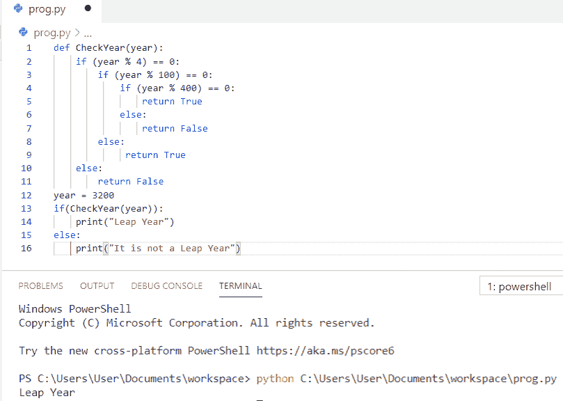

# Python 程序检查闰年

> 原文：<https://pythonguides.com/python-program-to-check-leap-year/>

[](https://sharepointsky.teachable.com/p/python-and-machine-learning-training-course)

在这个 [Python 教程](https://pythonguides.com/learn-python/)中，你将学习到 **Python 程序来检查闰年**，我们也将检查 **:**

*   Python 程序检查闰年
*   Python 程序通过获取用户输入来检查闰年
*   使用函数检查闰年的 Python 程序
*   Python 程序中查找输入年份是闰年还是不闰年
*   使用 if 语句检查闰年的 Python 程序

目录

[](#)

*   [Python 程序检查闰年](#Python_program_to_check_leap_year "Python program to check leap year")
*   [Python 程序通过获取用户输入来检查闰年](#Python_program_to_check_leap_year_by_getting_input_from_a_user "Python program to check leap year by getting input from a user")
*   [Python 程序使用函数](#Python_program_to_check_leap_year_using_function "Python program to check leap year using function")检查闰年
*   [Python 程序查找输入年份是否闰年](#Python_program_to_find_the_input_year_is_leap_or_not "Python program to find the input year is leap or not")
*   使用 if 语句检查闰年的 Python 程序

## Python 程序检查闰年

让我们看看 **python 程序检查闰年**

*   在这个例子中，我们先取一个变量为 `Year = 2024` 。
*   如果一年能被 4 整除并且没有余数，那么进入下一步。如果不能被 4 整除。这不是闰年。
*   如果一年能被 4 整除，但不能被 100 整除，那么这一年就是闰年。如果一年能被 4 和 100 整除，则进入下一步。
*   如果一年能被 100 整除，但不能被 400 整除，那么它就不是闰年。如果一年能被两者整除，那么它就是闰年。
*   最后，**打印**该年是否是闰年。

**举例:**

```py
Year = 2024
if (Year % 4) == 0:
   if (Year % 100) == 0:
       if (Year % 400) == 0:
           print("{0} is a leap year".format(Year))
       else:
           print("{0} is not a leap year".format(Year))
   else:
       print("{0} is a leap year".format(Year))
else:
   print("{0} is not a leap year".format(Year))
```

你可以参考下面的截图来查看 python 程序检查闰年的输出。


Python program to check leap year

上面的代码我们可以用 Python 中的来**检查闰年。**

看看，[如何在 Python 中求三角形的面积](https://pythonguides.com/find-area-of-a-triangle-in-python/)。

## Python 程序通过获取用户输入来检查闰年

这里，我们将看到 **python 程序通过从用户**获取输入来检查闰年

*   首先，我们将允许**用户**输入任何年份。
*   如果一年能被 4 整除并且没有余数，那么进入下一步。如果不能被 4 整除。这不是闰年。
*   如果一年能被 4 整除，但不能被 100 整除，那么这一年就是闰年。如果一年能被 4 和 100 整除，则进入下一步。
*   如果一年能被 100 整除，但不能被 400 整除，那么它就不是闰年。如果一年能被两者整除，那么它就是闰年。
*   最后，**打印**该年是否是闰年。

**举例:**

```py
Year = int(input("Enter a year: "))  
if (Year % 4) == 0:  
   if (Year % 100) == 0:  
       if (Year % 400) == 0:  
           print("{0} is a leap year".format(Year))  
       else:  
           print("{0} is not a leap year".format(Year))  
   else:  
       print("{0} is a leap year".format(Year))  
else:  
   print("{0} is not a leap year".format(Year)) 
```

你可以参考下面的截图来查看 python 程序的输出，该程序通过获取用户的输入来检查闰年。


Python program to check leap year by getting input from a user

我们可以使用 Python 中的代码**从用户那里获取输入来检查闰年。**

还有，读， [Python 程序求平方](https://pythonguides.com/python-program-to-find-the-area-of-square/)的面积。

## Python 程序使用函数检查闰年

现在，我们将看到使用函数检查闰年的 **python 程序**

*   首先，我们将**使用 `def` 关键字定义一个带有参数的函数**。
*   如果年份是 4 的倍数而不是 100 的倍数，或者年份是 400 的倍数，则返回 true。
*   变量被定义为 `year = 3200` 并且该值被传递给函数参数。
*   最后，**印**年是否闰年。

**举例:**

```py
def CheckYear(year):
    if (year % 4) == 0:
        if (year % 100) == 0:
            if (year % 400) == 0:
                return True
            else:
                return False
        else:
             return True
    else:
        return False
year = 3200
if(CheckYear(year)):
    print("Leap Year")
else:
    print("It is not a Leap Year")
```

你可以参考下面的截图来查看 python 程序使用函数检查闰年的输出。



Python program to check leap year using function

上面的代码，我们可以用 Python 中的函数来**检查闰年。**

[Python 程序，求矩形的面积](https://pythonguides.com/python-program-to-find-an-area-of-a-rectangle/)。

## Python 程序查找输入年份是否闰年

在这里，我们将看到 **python 程序查找输入年份是否是闰年的 python**

*   首先，我们将允许**用户**输入年份。
*   然后我们将使用 if 条件来检查输入的年份是否是闰年。
*   最后，**打印**输入的年份是否是闰年。

**举例:**

```py
Year = int(input("Enter a Year: "))
if Year % 4 == 0 and Year % 100 != 0:
    print(Year, "is a Leap Year")
elif Year % 100 == 0:
    print(Year, "is not a Leap Year")
elif Year % 400 ==0:
    print(Year, "is a Leap Year")
else:
    print(Year, "is not a Leap Year")
```

你可以参考下面的截图来查看 python 程序的输出，以确定输入年份是否是闰年。


Python program to find the input year is leap or not

这是 Python 程序，用来查找输入的年份是否是闰年。

还有，看看，[如何用 Python](https://pythonguides.com/calculate-area-of-a-circle-in-python/) 计算圆的面积。

## 使用 if 语句检查闰年的 Python 程序

让我们看看使用 if 语句检查闰年的 **python 程序**

*   在这个例子中，我们将允许**用户**输入任何年份。
*   现在，我们将使用 if-else 条件来检查年份是否是闰年。
*   这里，我们将在一个 if 语句中检查多个条件，我们已经使用了逻辑 and 和逻辑 OR 运算符。
*   第一个条件 **(Year%400 == 0)** 会检查年余数是否正好等于 0。所以如果任何一个数字能被 400 整除就是闰年。
*   第二条语句包含 2 条带有逻辑运算符**和**的语句，因此它们都必须为真。
*   **( Year%4 == 0 )** 将检查一年的剩余时间是否正好等于 0。如果条件为假，那么它将从条件中退出，因为它肯定不是闰年。
*   最后，**打印出**年份是否是闰年。

**举例:**

```py
Year = int(input("Enter the Year: "))
if (( Year%400 == 0) or (( Year%4 == 0 ) and ( Year%100 != 0))):
    print("%d is a Leap Year" %Year)
else:
    print("%d is Not the Leap Year" %Year)
```

你可以参考下面的截图来查看 python 程序使用 if 语句检查闰年的输出。


Python program to check leap year using if statement

这段代码，我们可以用 Python 中的 if 语句来**检查闰年。**

此外，请查看:

*   [Python 中如何计算单利](https://pythonguides.com/calculate-simple-interest-in-python/)
*   [Python 程序打印图案](https://pythonguides.com/print-pattern-in-python/)
*   [如何在 Python 中打印一个数的阶乘](https://pythonguides.com/factorial-of-a-number-in-python/)

在本 Python 教程中，我们学习了用于检查闰年的 **Python 程序。此外，我们还讨论了以下主题:**

*   Python 程序检查闰年
*   Python 程序通过获取用户输入来检查闰年
*   使用函数检查闰年的 Python 程序
*   Python 程序中查找输入年份是闰年还是不闰年
*   使用 if 语句检查闰年的 Python 程序

[Bijay Kumar](https://pythonguides.com/author/fewlines4biju/)

Python 是美国最流行的语言之一。我从事 Python 工作已经有很长时间了，我在与 Tkinter、Pandas、NumPy、Turtle、Django、Matplotlib、Tensorflow、Scipy、Scikit-Learn 等各种库合作方面拥有专业知识。我有与美国、加拿大、英国、澳大利亚、新西兰等国家的各种客户合作的经验。查看我的个人资料。

[enjoysharepoint.com/](https://enjoysharepoint.com/)[](https://www.facebook.com/fewlines4biju "Facebook")[](https://www.linkedin.com/in/fewlines4biju/ "Linkedin")[](https://twitter.com/fewlines4biju "Twitter")